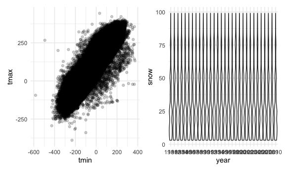

p8105_hw3_sk4970
================

# Problem 1

``` r
# importing data
data("instacart")

instacart = 
  instacart %>% 
  as_tibble(instacart)

# each row respresent a single product from an instacart order. Variables include identifiers for user, order, and product; the order in which each product was added to the cart. There are several order-level variables, describing the day and time of the order, and number of days since prior order. Then there are several item-specific variables, describing the product name (e.g. Yogurt, Avocado), department (e.g. dairy and eggs, produce), and aisle (e.g. yogurt, fresh fruits), and whether the item has been ordered by this user in the past. 
```

In total, there are 39123 products found in 131209 orders from 131209
distinct users.

``` r
# Below is a table summarizing the number of items ordered from aisle. In total, there are 134 aisles, with fresh vegetables and fresh fruits holding the most items ordered by far.

instacart %>% 
  count(aisle) %>% 
  arrange(desc(n))
```

    ## # A tibble: 134 × 2
    ##    aisle                              n
    ##    <chr>                          <int>
    ##  1 fresh vegetables              150609
    ##  2 fresh fruits                  150473
    ##  3 packaged vegetables fruits     78493
    ##  4 yogurt                         55240
    ##  5 packaged cheese                41699
    ##  6 water seltzer sparkling water  36617
    ##  7 milk                           32644
    ##  8 chips pretzels                 31269
    ##  9 soy lactosefree                26240
    ## 10 bread                          23635
    ## # … with 124 more rows

``` r
# The plot below shows the number of items ordered in each aisle. Here, aisles are ordered by ascending number of items.

instacart %>% 
  count(aisle) %>% 
  filter(n > 10000) %>% 
  mutate(aisle = fct_reorder(aisle, n)) %>% 
  ggplot(aes(x = aisle, y = n)) + 
  geom_point() + 
  labs(title = "Number of items ordered in each aisle") +
  theme(axis.text.x = element_text(angle = 60, hjust = 1))
```


``` r
# Next table shows the three most popular items in aisles `baking ingredients`, `dog food care`, and `packaged vegetables fruits`, and includes the number of times each item is ordered in your table.

instacart %>% 
  filter(aisle %in% c("baking ingredients", "dog food care", "packaged vegetables fruits")) %>%
  group_by(aisle) %>% 
  count(product_name) %>% 
  mutate(rank = min_rank(desc(n))) %>% 
  filter(rank < 4) %>% 
  arrange(desc(n)) %>%
  knitr::kable()
```

| aisle                      | product_name                                  |    n | rank |
|:---------------------------|:----------------------------------------------|-----:|-----:|
| packaged vegetables fruits | Organic Baby Spinach                          | 9784 |    1 |
| packaged vegetables fruits | Organic Raspberries                           | 5546 |    2 |
| packaged vegetables fruits | Organic Blueberries                           | 4966 |    3 |
| baking ingredients         | Light Brown Sugar                             |  499 |    1 |
| baking ingredients         | Pure Baking Soda                              |  387 |    2 |
| baking ingredients         | Cane Sugar                                    |  336 |    3 |
| dog food care              | Snack Sticks Chicken & Rice Recipe Dog Treats |   30 |    1 |
| dog food care              | Organix Chicken & Brown Rice Recipe           |   28 |    2 |
| dog food care              | Small Dog Biscuits                            |   26 |    3 |

``` r
# The below table shows the mean hour of the day at which Pink Lady Apples and Coffee Ice Cream are ordered on each day of the week. This table has been formatted in an untidy manner for human readers. Pink Lady Apples are generally purchased slightly earlier in the day than Coffee Ice Cream, with the exception of day 5.

instacart %>%
  filter(product_name %in% c("Pink Lady Apples", "Coffee Ice Cream")) %>%
  group_by(product_name, order_dow) %>%
  summarize(mean_hour = mean(order_hour_of_day)) %>%
  spread(key = order_dow, value = mean_hour) %>%
  knitr::kable(digits = 2)
```

    ## `summarise()` has grouped output by 'product_name'. You can override using the
    ## `.groups` argument.

| product_name     |     0 |     1 |     2 |     3 |     4 |     5 |     6 |
|:-----------------|------:|------:|------:|------:|------:|------:|------:|
| Coffee Ice Cream | 13.77 | 14.32 | 15.38 | 15.32 | 15.22 | 12.26 | 13.83 |
| Pink Lady Apples | 13.44 | 11.36 | 11.70 | 14.25 | 11.55 | 12.78 | 11.94 |

# Problem 2

``` r
# importing data
accel = read_csv(file = "./accel_data.csv") %>%
  janitor::clean_names()
```

    ## Rows: 35 Columns: 1443
    ## ── Column specification ────────────────────────────────────────────────────────
    ## Delimiter: ","
    ## chr    (1): day
    ## dbl (1442): week, day_id, activity.1, activity.2, activity.3, activity.4, ac...
    ## 
    ## ℹ Use `spec()` to retrieve the full column specification for this data.
    ## ℹ Specify the column types or set `show_col_types = FALSE` to quiet this message.

``` r
# pivoting data to tidy
  acceler = 
  pivot_longer(
    accel, 
    activity_1:activity_1440, 
    names_to = "activity_num",
    names_repair = "minimal", 
    values_to = "activity") 
    
  accelerometer = subset(acceler, select = -activity_num)
  
# create weekday vs. weekend variable
 accelerometer %>%
   mutate(day_type = case_when(day == 'Saturday' ~ 'weekend', day == 'Sunday' ~ 'weekend', TRUE ~ 'weekday'))
```

    ## # A tibble: 50,400 × 5
    ##     week day_id day    activity day_type
    ##    <dbl>  <dbl> <chr>     <dbl> <chr>   
    ##  1     1      1 Friday     88.4 weekday 
    ##  2     1      1 Friday     82.2 weekday 
    ##  3     1      1 Friday     64.4 weekday 
    ##  4     1      1 Friday     70.0 weekday 
    ##  5     1      1 Friday     75.0 weekday 
    ##  6     1      1 Friday     66.3 weekday 
    ##  7     1      1 Friday     53.8 weekday 
    ##  8     1      1 Friday     47.8 weekday 
    ##  9     1      1 Friday     55.5 weekday 
    ## 10     1      1 Friday     43.0 weekday 
    ## # … with 50,390 more rows

``` r
 ## the data set has 5 variables--week, day id, day, activity, and day type with 50,400 observations.

# total activity variable 
 accelerometer %>%
   group_by(day_id) %>%
   mutate(sum_by_group = sum(activity)) %>%
   table
```

    ## , , day = Friday, activity = 1, sum_by_group = 1440
    ## 
    ##     day_id
    ## week    1    2    3    4    5    6    7    8    9   10   11   12   13   14   15
    ##    1    0    0    0    0    0    0    0    0    0    0    0    0    0    0    0
    ##    2    0    0    0    0    0    0    0    0    0    0    0    0    0    0    0
    ##    3    0    0    0    0    0    0    0    0    0    0    0    0    0    0    0
    ##    4    0    0    0    0    0    0    0    0    0    0    0    0    0    0    0
    ##    5    0    0    0    0    0    0    0    0    0    0    0    0    0    0    0
    ##     day_id
    ## week   16   17   18   19   20   21   22   23   24   25   26   27   28   29   30
    ##    1    0    0    0    0    0    0    0    0    0    0    0    0    0    0    0
    ##    2    0    0    0    0    0    0    0    0    0    0    0    0    0    0    0
    ##    3    0    0    0    0    0    0    0    0    0    0    0    0    0    0    0
    ##    4    0    0    0    0    0    0    0    0    0    0    0    0    0    0    0
    ##    5    0    0    0    0    0    0    0    0    0    0    0    0    0    0    0
    ##     day_id
    ## week   31   32   33   34   35
    ##    1    0    0    0    0    0
    ##    2    0    0    0    0    0
    ##    3    0    0    0    0    0
    ##    4    0    0    0    0    0
    ##    5    0    0    0    0    0
    ## 
    ## , , day = Monday, activity = 1, sum_by_group = 1440
    ## 
    ##     day_id
    ## week    1    2    3    4    5    6    7    8    9   10   11   12   13   14   15
    ##    1    0    0    0    0    0    0    0    0    0    0    0    0    0    0    0
    ##    2    0    0    0    0    0    0    0    0    0    0    0    0    0    0    0
    ##    3    0    0    0    0    0    0    0    0    0    0    0    0    0    0    0
    ##    4    0    0    0    0    0    0    0    0    0    0    0    0    0    0    0
    ##    5    0    0    0    0    0    0    0    0    0    0    0    0    0    0    0
    ##     day_id
    ## week   16   17   18   19   20   21   22   23   24   25   26   27   28   29   30
    ##    1    0    0    0    0    0    0    0    0    0    0    0    0    0    0    0
    ##    2    0    0    0    0    0    0    0    0    0    0    0    0    0    0    0
    ##    3    0    0    0    0    0    0    0    0    0    0    0    0    0    0    0
    ##    4    0    0    0    0    0    0    0    0    0    0    0    0    0    0    0
    ##    5    0    0    0    0    0    0    0    0    0    0    0    0    0    0    0
    ##     day_id
    ## week   31   32   33   34   35
    ##    1    0    0    0    0    0
    ##    2    0    0    0    0    0
    ##    3    0    0    0    0    0
    ##    4    0    0    0    0    0
    ##    5    0    0    0    0    0
    ## 
    ## , , day = Saturday, activity = 1, sum_by_group = 1440
    ## 
    ##     day_id
    ## week    1    2    3    4    5    6    7    8    9   10   11   12   13   14   15
    ##    1    0    0    0    0    0    0    0    0    0    0    0    0    0    0    0
    ##    2    0    0    0    0    0    0    0    0    0    0    0    0    0    0    0
    ##    3    0    0    0    0    0    0    0    0    0    0    0    0    0    0    0
    ##    4    0    0    0    0    0    0    0    0    0    0    0    0    0    0    0
    ##    5    0    0    0    0    0    0    0    0    0    0    0    0    0    0    0
    ##     day_id
    ## week   16   17   18   19   20   21   22   23   24   25   26   27   28   29   30
    ##    1    0    0    0    0    0    0    0    0    0    0    0    0    0    0    0
    ##    2    0    0    0    0    0    0    0    0    0    0    0    0    0    0    0
    ##    3    0    0    0    0    0    0    0    0    0    0    0    0    0    0    0
    ##    4    0    0    0    0    0    0    0    0 1440    0    0    0    0    0    0
    ##    5    0    0    0    0    0    0    0    0    0    0    0    0    0    0    0
    ##     day_id
    ## week   31   32   33   34   35
    ##    1    0    0    0    0    0
    ##    2    0    0    0    0    0
    ##    3    0    0    0    0    0
    ##    4    0    0    0    0    0
    ##    5 1440    0    0    0    0
    ## 
    ## , , day = Sunday, activity = 1, sum_by_group = 1440
    ## 
    ##     day_id
    ## week    1    2    3    4    5    6    7    8    9   10   11   12   13   14   15
    ##    1    0    0    0    0    0    0    0    0    0    0    0    0    0    0    0
    ##    2    0    0    0    0    0    0    0    0    0    0    0    0    0    0    0
    ##    3    0    0    0    0    0    0    0    0    0    0    0    0    0    0    0
    ##    4    0    0    0    0    0    0    0    0    0    0    0    0    0    0    0
    ##    5    0    0    0    0    0    0    0    0    0    0    0    0    0    0    0
    ##     day_id
    ## week   16   17   18   19   20   21   22   23   24   25   26   27   28   29   30
    ##    1    0    0    0    0    0    0    0    0    0    0    0    0    0    0    0
    ##    2    0    0    0    0    0    0    0    0    0    0    0    0    0    0    0
    ##    3    0    0    0    0    0    0    0    0    0    0    0    0    0    0    0
    ##    4    0    0    0    0    0    0    0    0    0    0    0    0    0    0    0
    ##    5    0    0    0    0    0    0    0    0    0    0    0    0    0    0    0
    ##     day_id
    ## week   31   32   33   34   35
    ##    1    0    0    0    0    0
    ##    2    0    0    0    0    0
    ##    3    0    0    0    0    0
    ##    4    0    0    0    0    0
    ##    5    0    0    0    0    0
    ## 
    ## , , day = Thursday, activity = 1, sum_by_group = 1440
    ## 
    ##     day_id
    ## week    1    2    3    4    5    6    7    8    9   10   11   12   13   14   15
    ##    1    0    0    0    0    0    0    0    0    0    0    0    0    0    0    0
    ##    2    0    0    0    0    0    0    0    0    0    0    0    0    0    0    0
    ##    3    0    0    0    0    0    0    0    0    0    0    0    0    0    0    0
    ##    4    0    0    0    0    0    0    0    0    0    0    0    0    0    0    0
    ##    5    0    0    0    0    0    0    0    0    0    0    0    0    0    0    0
    ##     day_id
    ## week   16   17   18   19   20   21   22   23   24   25   26   27   28   29   30
    ##    1    0    0    0    0    0    0    0    0    0    0    0    0    0    0    0
    ##    2    0    0    0    0    0    0    0    0    0    0    0    0    0    0    0
    ##    3    0    0    0    0    0    0    0    0    0    0    0    0    0    0    0
    ##    4    0    0    0    0    0    0    0    0    0    0    0    0    0    0    0
    ##    5    0    0    0    0    0    0    0    0    0    0    0    0    0    0    0
    ##     day_id
    ## week   31   32   33   34   35
    ##    1    0    0    0    0    0
    ##    2    0    0    0    0    0
    ##    3    0    0    0    0    0
    ##    4    0    0    0    0    0
    ##    5    0    0    0    0    0
    ## 
    ## , , day = Tuesday, activity = 1, sum_by_group = 1440
    ## 
    ##     day_id
    ## week    1    2    3    4    5    6    7    8    9   10   11   12   13   14   15
    ##    1    0    0    0    0    0    0    0    0    0    0    0    0    0    0    0
    ##    2    0    0    0    0    0    0    0    0    0    0    0    0    0    0    0
    ##    3    0    0    0    0    0    0    0    0    0    0    0    0    0    0    0
    ##    4    0    0    0    0    0    0    0    0    0    0    0    0    0    0    0
    ##    5    0    0    0    0    0    0    0    0    0    0    0    0    0    0    0
    ##     day_id
    ## week   16   17   18   19   20   21   22   23   24   25   26   27   28   29   30
    ##    1    0    0    0    0    0    0    0    0    0    0    0    0    0    0    0
    ##    2    0    0    0    0    0    0    0    0    0    0    0    0    0    0    0
    ##    3    0    0    0    0    0    0    0    0    0    0    0    0    0    0    0
    ##    4    0    0    0    0    0    0    0    0    0    0    0    0    0    0    0
    ##    5    0    0    0    0    0    0    0    0    0    0    0    0    0    0    0
    ##     day_id
    ## week   31   32   33   34   35
    ##    1    0    0    0    0    0
    ##    2    0    0    0    0    0
    ##    3    0    0    0    0    0
    ##    4    0    0    0    0    0
    ##    5    0    0    0    0    0
    ## 
    ## , , day = Wednesday, activity = 1, sum_by_group = 1440
    ## 
    ##     day_id
    ## week    1    2    3    4    5    6    7    8    9   10   11   12   13   14   15
    ##    1    0    0    0    0    0    0    0    0    0    0    0    0    0    0    0
    ##    2    0    0    0    0    0    0    0    0    0    0    0    0    0    0    0
    ##    3    0    0    0    0    0    0    0    0    0    0    0    0    0    0    0
    ##    4    0    0    0    0    0    0    0    0    0    0    0    0    0    0    0
    ##    5    0    0    0    0    0    0    0    0    0    0    0    0    0    0    0
    ##     day_id
    ## week   16   17   18   19   20   21   22   23   24   25   26   27   28   29   30
    ##    1    0    0    0    0    0    0    0    0    0    0    0    0    0    0    0
    ##    2    0    0    0    0    0    0    0    0    0    0    0    0    0    0    0
    ##    3    0    0    0    0    0    0    0    0    0    0    0    0    0    0    0
    ##    4    0    0    0    0    0    0    0    0    0    0    0    0    0    0    0
    ##    5    0    0    0    0    0    0    0    0    0    0    0    0    0    0    0
    ##     day_id
    ## week   31   32   33   34   35
    ##    1    0    0    0    0    0
    ##    2    0    0    0    0    0
    ##    3    0    0    0    0    0
    ##    4    0    0    0    0    0
    ##    5    0    0    0    0    0
    ## 
    ## , , day = Friday, activity = 2.844444444, sum_by_group = 1440
    ## 
    ##     day_id
    ## week    1    2    3    4    5    6    7    8    9   10   11   12   13   14   15
    ##    1    0    0    0    0    0    0    0    0    0    0    0    0    0    0    0
    ##    2    0    0    0    0    0    0    0    0    0    0    0    0    0    0    0
    ##    3    0    0    0    0    0    0    0    0    0    0    0    0    0    0    0
    ##    4    0    0    0    0    0    0    0    0    0    0    0    0    0    0    0
    ##    5    0    0    0    0    0    0    0    0    0    0    0    0    0    0    0
    ##     day_id
    ## week   16   17   18   19   20   21   22   23   24   25   26   27   28   29   30
    ##    1    0    0    0    0    0    0    0    0    0    0    0    0    0    0    0
    ##    2    0    0    0    0    0    0    0    0    0    0    0    0    0    0    0
    ##    3    0    0    0    0    0    0    0    0    0    0    0    0    0    0    0
    ##    4    0    0    0    0    0    0    0    0    0    0    0    0    0    0    0
    ##    5    0    0    0    0    0    0    0    0    0    0    0    0    0    0    0
    ##     day_id
    ## week   31   32   33   34   35
    ##    1    0    0    0    0    0
    ##    2    0    0    0    0    0
    ##    3    0    0    0    0    0
    ##    4    0    0    0    0    0
    ##    5    0    0    0    0    0
    ## 
    ## , , day = Monday, activity = 2.844444444, sum_by_group = 1440
    ## 
    ##     day_id
    ## week    1    2    3    4    5    6    7    8    9   10   11   12   13   14   15
    ##    1    0    0    0    0    0    0    0    0    0    0    0    0    0    0    0
    ##    2    0    0    0    0    0    0    0    0    0    0    0    0    0    0    0
    ##    3    0    0    0    0    0    0    0    0    0    0    0    0    0    0    0
    ##    4    0    0    0    0    0    0    0    0    0    0    0    0    0    0    0
    ##    5    0    0    0    0    0    0    0    0    0    0    0    0    0    0    0
    ##     day_id
    ## week   16   17   18   19   20   21   22   23   24   25   26   27   28   29   30
    ##    1    0    0    0    0    0    0    0    0    0    0    0    0    0    0    0
    ##    2    0    0    0    0    0    0    0    0    0    0    0    0    0    0    0
    ##    3    0    0    0    0    0    0    0    0    0    0    0    0    0    0    0
    ##    4    0    0    0    0    0    0    0    0    0    0    0    0    0    0    0
    ##    5    0    0    0    0    0    0    0    0    0    0    0    0    0    0    0
    ##     day_id
    ## week   31   32   33   34   35
    ##    1    0    0    0    0    0
    ##    2    0    0    0    0    0
    ##    3    0    0    0    0    0
    ##    4    0    0    0    0    0
    ##    5    0    0    0    0    0
    ## 
    ## , , day = Saturday, activity = 2.844444444, sum_by_group = 1440
    ## 
    ##     day_id
    ## week    1    2    3    4    5    6    7    8    9   10   11   12   13   14   15
    ##    1    0    0    0    0    0    0    0    0    0    0    0    0    0    0    0
    ##    2    0    0    0    0    0    0    0    0    0    0    0    0    0    0    0
    ##    3    0    0    0    0    0    0    0    0    0    0    0    0    0    0    0
    ##    4    0    0    0    0    0    0    0    0    0    0    0    0    0    0    0
    ##    5    0    0    0    0    0    0    0    0    0    0    0    0    0    0    0
    ##     day_id
    ## week   16   17   18   19   20   21   22   23   24   25   26   27   28   29   30
    ##    1    0    0    0    0    0    0    0    0    0    0    0    0    0    0    0
    ##    2    0    0    0    0    0    0    0    0    0    0    0    0    0    0    0
    ##    3    0    0    0    0    0    0    0    0    0    0    0    0    0    0    0
    ##    4    0    0    0    0    0    0    0    0    0    0    0    0    0    0    0
    ##    5    0    0    0    0    0    0    0    0    0    0    0    0    0    0    0
    ##     day_id
    ## week   31   32   33   34   35
    ##    1    0    0    0    0    0
    ##    2    0    0    0    0    0
    ##    3    0    0    0    0    0
    ##    4    0    0    0    0    0
    ##    5    0    0    0    0    0
    ## 
    ## , , day = Sunday, activity = 2.844444444, sum_by_group = 1440
    ## 
    ##     day_id
    ## week    1    2    3    4    5    6    7    8    9   10   11   12   13   14   15
    ##    1    0    0    0    0    0    0    0    0    0    0    0    0    0    0    0
    ##    2    0    0    0    0    0    0    0    0    0    0    0    0    0    0    0
    ##    3    0    0    0    0    0    0    0    0    0    0    0    0    0    0    0
    ##    4    0    0    0    0    0    0    0    0    0    0    0    0    0    0    0
    ##    5    0    0    0    0    0    0    0    0    0    0    0    0    0    0    0
    ##     day_id
    ## week   16   17   18   19   20   21   22   23   24   25   26   27   28   29   30
    ##    1    0    0    0    0    0    0    0    0    0    0    0    0    0    0    0
    ##    2    0    0    0    0    0    0    0    0    0    0    0    0    0    0    0
    ##    3    0    0    0    0    0    0    0    0    0    0    0    0    0    0    0
    ##    4    0    0    0    0    0    0    0    0    0    0    0    0    0    0    0
    ##    5    0    0    0    0    0    0    0    0    0    0    0    0    0    0    0
    ##     day_id
    ## week   31   32   33   34   35
    ##    1    0    0    0    0    0
    ##    2    0    0    0    0    0
    ##    3    0    0    0    0    0
    ##    4    0    0    0    0    0
    ##    5    0    0    0    0    0
    ## 
    ## , , day = Thursday, activity = 2.844444444, sum_by_group = 1440
    ## 
    ##     day_id
    ## week    1    2    3    4    5    6    7    8    9   10   11   12   13   14   15
    ##    1    0    0    0    0    0    0    0    0    0    0    0    0    0    0    0
    ##    2    0    0    0    0    0    0    0    0    0    0    0    0    0    0    0
    ##    3    0    0    0    0    0    0    0    0    0    0    0    0    0    0    0
    ##    4    0    0    0    0    0    0    0    0    0    0    0    0    0    0    0
    ##    5    0    0    0    0    0    0    0    0    0    0    0    0    0    0    0
    ##     day_id
    ## week   16   17   18   19   20   21   22   23   24   25   26   27   28   29   30
    ##    1    0    0    0    0    0    0    0    0    0    0    0    0    0    0    0
    ##    2    0    0    0    0    0    0    0    0    0    0    0    0    0    0    0
    ##    3    0    0    0    0    0    0    0    0    0    0    0    0    0    0    0
    ##    4    0    0    0    0    0    0    0    0    0    0    0    0    0    0    0
    ##    5    0    0    0    0    0    0    0    0    0    0    0    0    0    0    0
    ##     day_id
    ## week   31   32   33   34   35
    ##    1    0    0    0    0    0
    ##    2    0    0    0    0    0
    ##    3    0    0    0    0    0
    ##    4    0    0    0    0    0
    ##    5    0    0    0    0    0
    ## 
    ## , , day = Tuesday, activity = 2.844444444, sum_by_group = 1440
    ## 
    ##     day_id
    ## week    1    2    3    4    5    6    7    8    9   10   11   12   13   14   15
    ##    1    0    0    0    0    0    0    0    0    0    0    0    0    0    0    0
    ##    2    0    0    0    0    0    0    0    0    0    0    0    0    0    0    0
    ##    3    0    0    0    0    0    0    0    0    0    0    0    0    0    0    0
    ##    4    0    0    0    0    0    0    0    0    0    0    0    0    0    0    0
    ##    5    0    0    0    0    0    0    0    0    0    0    0    0    0    0    0
    ##     day_id
    ## week   16   17   18   19   20   21   22   23   24   25   26   27   28   29   30
    ##    1    0    0    0    0    0    0    0    0    0    0    0    0    0    0    0
    ##    2    0    0    0    0    0    0    0    0    0    0    0    0    0    0    0
    ##    3    0    0    0    0    0    0    0    0    0    0    0    0    0    0    0
    ##    4    0    0    0    0    0    0    0    0    0    0    0    0    0    0    0
    ##    5    0    0    0    0    0    0    0    0    0    0    0    0    0    0    0
    ##     day_id
    ## week   31   32   33   34   35
    ##    1    0    0    0    0    0
    ##    2    0    0    0    0    0
    ##    3    0    0    0    0    0
    ##    4    0    0    0    0    0
    ##    5    0    0    0    0    0
    ## 
    ## , , day = Wednesday, activity = 2.844444444, sum_by_group = 1440
    ## 
    ##     day_id
    ## week    1    2    3    4    5    6    7    8    9   10   11   12   13   14   15
    ##    1    0    0    0    0    0    0    0    0    0    0    0    0    0    0    0
    ##    2    0    0    0    0    0    0    0    0    0    0    0    0    0    0    0
    ##    3    0    0    0    0    0    0    0    0    0    0    0    0    0    0    0
    ##    4    0    0    0    0    0    0    0    0    0    0    0    0    0    0    0
    ##    5    0    0    0    0    0    0    0    0    0    0    0    0    0    0    0
    ##     day_id
    ## week   16   17   18   19   20   21   22   23   24   25   26   27   28   29   30
    ##    1    0    0    0    0    0    0    0    0    0    0    0    0    0    0    0
    ##    2    0    0    0    0    0    0    0    0    0    0    0    0    0    0    0
    ##    3    0    0    0    0    0    0    0    0    0    0    0    0    0    0    0
    ##    4    0    0    0    0    0    0    0    0    0    0    0    0    0    0    0
    ##    5    0    0    0    0    0    0    0    0    0    0    0    0    0    0    0
    ##     day_id
    ## week   31   32   33   34   35
    ##    1    0    0    0    0    0
    ##    2    0    0    0    0    0
    ##    3    0    0    0    0    0
    ##    4    0    0    0    0    0
    ##    5    0    0    0    0    0
    ## 
    ## , , day = Friday, activity = 4, sum_by_group = 1440
    ## 
    ##     day_id
    ## week    1    2    3    4    5    6    7    8    9   10   11   12   13   14   15
    ##    1    0    0    0    0    0    0    0    0    0    0    0    0    0    0    0
    ##    2    0    0    0    0    0    0    0    0    0    0    0    0    0    0    0
    ##    3    0    0    0    0    0    0    0    0    0    0    0    0    0    0    0
    ##    4    0    0    0    0    0    0    0    0    0    0    0    0    0    0    0
    ##    5    0    0    0    0    0    0    0    0    0    0    0    0    0    0    0
    ##     day_id
    ## week   16   17   18   19   20   21   22   23   24   25   26   27   28   29   30
    ##    1    0    0    0    0    0    0    0    0    0    0    0    0    0    0    0
    ##    2    0    0    0    0    0    0    0    0    0    0    0    0    0    0    0
    ##    3    0    0    0    0    0    0    0    0    0    0    0    0    0    0    0
    ##    4    0    0    0    0    0    0    0    0    0    0    0    0    0    0    0
    ##    5    0    0    0    0    0    0    0    0    0    0    0    0    0    0    0
    ##     day_id
    ## week   31   32   33   34   35
    ##    1    0    0    0    0    0
    ##    2    0    0    0    0    0
    ##    3    0    0    0    0    0
    ##    4    0    0    0    0    0
    ##    5    0    0    0    0    0
    ## 
    ## , , day = Monday, activity = 4, sum_by_group = 1440
    ## 
    ##     day_id
    ## week    1    2    3    4    5    6    7    8    9   10   11   12   13   14   15
    ##    1    0    0    0    0    0    0    0    0    0    0    0    0    0    0    0
    ##    2    0    0    0    0    0    0    0    0    0    0    0    0    0    0    0
    ##    3    0    0    0    0    0    0    0    0    0    0    0    0    0    0    0
    ##    4    0    0    0    0    0    0    0    0    0    0    0    0    0    0    0
    ##    5    0    0    0    0    0    0    0    0    0    0    0    0    0    0    0
    ##     day_id
    ## week   16   17   18   19   20   21   22   23   24   25   26   27   28   29   30
    ##    1    0    0    0    0    0    0    0    0    0    0    0    0    0    0    0
    ##    2    0    0    0    0    0    0    0    0    0    0    0    0    0    0    0
    ##    3    0    0    0    0    0    0    0    0    0    0    0    0    0    0    0
    ##    4    0    0    0    0    0    0    0    0    0    0    0    0    0    0    0
    ##    5    0    0    0    0    0    0    0    0    0    0    0    0    0    0    0
    ##     day_id
    ## week   31   32   33   34   35
    ##    1    0    0    0    0    0
    ##    2    0    0    0    0    0
    ##    3    0    0    0    0    0
    ##    4    0    0    0    0    0
    ##    5    0    0    0    0    0
    ## 
    ## , , day = Saturday, activity = 4, sum_by_group = 1440
    ## 
    ##     day_id
    ## week    1    2    3    4    5    6    7    8    9   10   11   12   13   14   15
    ##    1    0    0    0    0    0    0    0    0    0    0    0    0    0    0    0
    ##    2    0    0    0    0    0    0    0    0    0    0    0    0    0    0    0
    ##    3    0    0    0    0    0    0    0    0    0    0    0    0    0    0    0
    ##    4    0    0    0    0    0    0    0    0    0    0    0    0    0    0    0
    ##    5    0    0    0    0    0    0    0    0    0    0    0    0    0    0    0
    ##     day_id
    ## week   16   17   18   19   20   21   22   23   24   25   26   27   28   29   30
    ##    1    0    0    0    0    0    0    0    0    0    0    0    0    0    0    0
    ##    2    0    0    0    0    0    0    0    0    0    0    0    0    0    0    0
    ##    3    0    0    0    0    0    0    0    0    0    0    0    0    0    0    0
    ##    4    0    0    0    0    0    0    0    0    0    0    0    0    0    0    0
    ##    5    0    0    0    0    0    0    0    0    0    0    0    0    0    0    0
    ##     day_id
    ## week   31   32   33   34   35
    ##    1    0    0    0    0    0
    ##    2    0    0    0    0    0
    ##    3    0    0    0    0    0
    ##    4    0    0    0    0    0
    ##    5    0    0    0    0    0
    ## 
    ## , , day = Sunday, activity = 4, sum_by_group = 1440
    ## 
    ##     day_id
    ## week    1    2    3    4    5    6    7    8    9   10   11   12   13   14   15
    ##    1    0    0    0    0    0    0    0    0    0    0    0    0    0    0    0
    ##    2    0    0    0    0    0    0    0    0    0    0    0    0    0    0    0
    ##    3    0    0    0    0    0    0    0    0    0    0    0    0    0    0    0
    ##    4    0    0    0    0    0    0    0    0    0    0    0    0    0    0    0
    ##    5    0    0    0    0    0    0    0    0    0    0    0    0    0    0    0
    ##     day_id
    ## week   16   17   18   19   20   21   22   23   24   25   26   27   28   29   30
    ##    1    0    0    0    0    0    0    0    0    0    0    0    0    0    0    0
    ##    2    0    0    0    0    0    0    0    0    0    0    0    0    0    0    0
    ##    3    0    0    0    0    0    0    0    0    0    0    0    0    0    0    0
    ##    4    0    0    0    0    0    0    0    0    0    0    0    0    0    0    0
    ##    5    0    0    0    0    0    0    0    0    0    0    0    0    0    0    0
    ##     day_id
    ## week   31   32   33   34   35
    ##    1    0    0    0    0    0
    ##    2    0    0    0    0    0
    ##    3    0    0    0    0    0
    ##    4    0    0    0    0    0
    ##    5    0    0    0    0    0
    ## 
    ## , , day = Thursday, activity = 4, sum_by_group = 1440
    ## 
    ##     day_id
    ## week    1    2    3    4    5    6    7    8    9   10   11   12   13   14   15
    ##    1    0    0    0    0    0    0    0    0    0    0    0    0    0    0    0
    ##    2    0    0    0    0    0    0    0    0    0    0    0    0    0    0    0
    ##    3    0    0    0    0    0    0    0    0    0    0    0    0    0    0    0
    ##    4    0    0    0    0    0    0    0    0    0    0    0    0    0    0    0
    ##    5    0    0    0    0    0    0    0    0    0    0    0    0    0    0    0
    ##     day_id
    ## week   16   17   18   19   20   21   22   23   24   25   26   27   28   29   30
    ##    1    0    0    0    0    0    0    0    0    0    0    0    0    0    0    0
    ##    2    0    0    0    0    0    0    0    0    0    0    0    0    0    0    0
    ##    3    0    0    0    0    0    0    0    0    0    0    0    0    0    0    0
    ##    4    0    0    0    0    0    0    0    0    0    0    0    0    0    0    0
    ##    5    0    0    0    0    0    0    0    0    0    0    0    0    0    0    0
    ##     day_id
    ## week   31   32   33   34   35
    ##    1    0    0    0    0    0
    ##    2    0    0    0    0    0
    ##    3    0    0    0    0    0
    ##    4    0    0    0    0    0
    ##    5    0    0    0    0    0
    ## 
    ## , , day = Tuesday, activity = 4, sum_by_group = 1440
    ## 
    ##     day_id
    ## week    1    2    3    4    5    6    7    8    9   10   11   12   13   14   15
    ##    1    0    0    0    0    0    0    0    0    0    0    0    0    0    0    0
    ##    2    0    0    0    0    0    0    0    0    0    0    0    0    0    0    0
    ##    3    0    0    0    0    0    0    0    0    0    0    0    0    0    0    0
    ##    4    0    0    0    0    0    0    0    0    0    0    0    0    0    0    0
    ##    5    0    0    0    0    0    0    0    0    0    0    0    0    0    0    0
    ##     day_id
    ## week   16   17   18   19   20   21   22   23   24   25   26   27   28   29   30
    ##    1    0    0    0    0    0    0    0    0    0    0    0    0    0    0    0
    ##    2    0    0    0    0    0    0    0    0    0    0    0    0    0    0    0
    ##    3    0    0    0    0    0    0    0    0    0    0    0    0    0    0    0
    ##    4    0    0    0    0    0    0    0    0    0    0    0    0    0    0    0
    ##    5    0    0    0    0    0    0    0    0    0    0    0    0    0    0    0
    ##     day_id
    ## week   31   32   33   34   35
    ##    1    0    0    0    0    0
    ##    2    0    0    0    0    0
    ##    3    0    0    0    0    0
    ##    4    0    0    0    0    0
    ##    5    0    0    0    0    0
    ## 
    ## , , day = Wednesday, activity = 4, sum_by_group = 1440
    ## 
    ##     day_id
    ## week    1    2    3    4    5    6    7    8    9   10   11   12   13   14   15
    ##    1    0    0    0    0    0    0    0    0    0    0    0    0    0    0    0
    ##    2    0    0    0    0    0    0    0    0    0    0    0    0    0    0    0
    ##    3    0    0    0    0    0    0    0    0    0    0    0    0    0    0    0
    ##    4    0    0    0    0    0    0    0    0    0    0    0    0    0    0    0
    ##    5    0    0    0    0    0    0    0    0    0    0    0    0    0    0    0
    ##     day_id
    ## week   16   17   18   19   20   21   22   23   24   25   26   27   28   29   30
    ##    1    0    0    0    0    0    0    0    0    0    0    0    0    0    0    0
    ##    2    0    0    0    0    0    0    0    0    0    0    0    0    0    0    0
    ##    3    0    0    0    0    0    0    0    0    0    0    0    0    0    0    0
    ##    4    0    0    0    0    0    0    0    0    0    0    0    0    0    0    0
    ##    5    0    0    0    0    0    0    0    0    0    0    0    0    0    0    0
    ##     day_id
    ## week   31   32   33   34   35
    ##    1    0    0    0    0    0
    ##    2    0    0    0    0    0
    ##    3    0    0    0    0    0
    ##    4    0    0    0    0    0
    ##    5    0    0    0    0    0
    ## 
    ## , , day = Friday, activity = 4.711111111, sum_by_group = 1440
    ## 
    ##     day_id
    ## week    1    2    3    4    5    6    7    8    9   10   11   12   13   14   15
    ##    1    0    0    0    0    0    0    0    0    0    0    0    0    0    0    0
    ##    2    0    0    0    0    0    0    0    0    0    0    0    0    0    0    0
    ##    3    0    0    0    0    0    0    0    0    0    0    0    0    0    0    0
    ##    4    0    0    0    0    0    0    0    0    0    0    0    0    0    0    0
    ##    5    0    0    0    0    0    0    0    0    0    0    0    0    0    0    0
    ##     day_id
    ## week   16   17   18   19   20   21   22   23   24   25   26   27   28   29   30
    ##    1    0    0    0    0    0    0    0    0    0    0    0    0    0    0    0
    ##    2    0    0    0    0    0    0    0    0    0    0    0    0    0    0    0
    ##    3    0    0    0    0    0    0    0    0    0    0    0    0    0    0    0
    ##    4    0    0    0    0    0    0    0    0    0    0    0    0    0    0    0
    ##    5    0    0    0    0    0    0    0    0    0    0    0    0    0    0    0
    ##     day_id
    ## week   31   32   33   34   35
    ##    1    0    0    0    0    0
    ##    2    0    0    0    0    0
    ##    3    0    0    0    0    0
    ##    4    0    0    0    0    0
    ##    5    0    0    0    0    0
    ## 
    ## , , day = Monday, activity = 4.711111111, sum_by_group = 1440
    ## 
    ##     day_id
    ## week    1    2    3    4    5    6    7    8    9   10   11   12   13   14   15
    ##    1    0    0    0    0    0    0    0    0    0    0    0    0    0    0    0
    ##    2    0    0    0    0    0    0    0    0    0    0    0    0    0    0    0
    ##    3    0    0    0    0    0    0    0    0    0    0    0    0    0    0    0
    ##    4    0    0    0    0    0    0    0    0    0    0    0    0    0    0    0
    ##    5    0    0    0    0    0    0    0    0    0    0    0    0    0    0    0
    ##     day_id
    ## week   16   17   18   19   20   21   22   23   24   25   26   27   28   29   30
    ##    1    0    0    0    0    0    0    0    0    0    0    0    0    0    0    0
    ##    2    0    0    0    0    0    0    0    0    0    0    0    0    0    0    0
    ##    3    0    0    0    0    0    0    0    0    0    0    0    0    0    0    0
    ##    4    0    0    0    0    0    0    0    0    0    0    0    0    0    0    0
    ##    5    0    0    0    0    0    0    0    0    0    0    0    0    0    0    0
    ##     day_id
    ## week   31   32   33   34   35
    ##    1    0    0    0    0    0
    ##    2    0    0    0    0    0
    ##    3    0    0    0    0    0
    ##    4    0    0    0    0    0
    ##    5    0    0    0    0    0
    ## 
    ## , , day = Saturday, activity = 4.711111111, sum_by_group = 1440
    ## 
    ##     day_id
    ## week    1    2    3    4    5    6    7    8    9   10   11   12   13   14   15
    ##    1    0    0    0    0    0    0    0    0    0    0    0    0    0    0    0
    ##    2    0    0    0    0    0    0    0    0    0    0    0    0    0    0    0
    ##    3    0    0    0    0    0    0    0    0    0    0    0    0    0    0    0
    ##    4    0    0    0    0    0    0    0    0    0    0    0    0    0    0    0
    ##    5    0    0    0    0    0    0    0    0    0    0    0    0    0    0    0
    ##     day_id
    ## week   16   17   18   19   20   21   22   23   24   25   26   27   28   29   30
    ##    1    0    0    0    0    0    0    0    0    0    0    0    0    0    0    0
    ##    2    0    0    0    0    0    0    0    0    0    0    0    0    0    0    0
    ##    3    0    0    0    0    0    0    0    0    0    0    0    0    0    0    0
    ##    4    0    0    0    0    0    0    0    0    0    0    0    0    0    0    0
    ##    5    0    0    0    0    0    0    0    0    0    0    0    0    0    0    0
    ##     day_id
    ## week   31   32   33   34   35
    ##    1    0    0    0    0    0
    ##    2    0    0    0    0    0
    ##    3    0    0    0    0    0
    ##    4    0    0    0    0    0
    ##    5    0    0    0    0    0
    ## 
    ## , , day = Sunday, activity = 4.711111111, sum_by_group = 1440
    ## 
    ##     day_id
    ## week    1    2    3    4    5    6    7    8    9   10   11   12   13   14   15
    ##    1    0    0    0    0    0    0    0    0    0    0    0    0    0    0    0
    ##    2    0    0    0    0    0    0    0    0    0    0    0    0    0    0    0
    ##    3    0    0    0    0    0    0    0    0    0    0    0    0    0    0    0
    ##    4    0    0    0    0    0    0    0    0    0    0    0    0    0    0    0
    ##    5    0    0    0    0    0    0    0    0    0    0    0    0    0    0    0
    ##     day_id
    ## week   16   17   18   19   20   21   22   23   24   25   26   27   28   29   30
    ##    1    0    0    0    0    0    0    0    0    0    0    0    0    0    0    0
    ##    2    0    0    0    0    0    0    0    0    0    0    0    0    0    0    0
    ##    3    0    0    0    0    0    0    0    0    0    0    0    0    0    0    0
    ##    4    0    0    0    0    0    0    0    0    0    0    0    0    0    0    0
    ##    5    0    0    0    0    0    0    0    0    0    0    0    0    0    0    0
    ##     day_id
    ## week   31   32   33   34   35
    ##    1    0    0    0    0    0
    ##    2    0    0    0    0    0
    ##    3    0    0    0    0    0
    ##    4    0    0    0    0    0
    ##    5    0    0    0    0    0
    ## 
    ## , , day = Thursday, activity = 4.711111111, sum_by_group = 1440
    ## 
    ##     day_id
    ## week    1    2    3    4    5    6    7    8    9   10   11   12   13   14   15
    ##    1    0    0    0    0    0    0    0    0    0    0    0    0    0    0    0
    ##    2    0    0    0    0    0    0    0    0    0    0    0    0    0    0    0
    ##    3    0    0    0    0    0    0    0    0    0    0    0    0    0    0    0
    ##    4    0    0    0    0    0    0    0    0    0    0    0    0    0    0    0
    ##    5    0    0    0    0    0    0    0    0    0    0    0    0    0    0    0
    ##     day_id
    ## week   16   17   18   19   20   21   22   23   24   25   26   27   28   29   30
    ##    1    0    0    0    0    0    0    0    0    0    0    0    0    0    0    0
    ##    2    0    0    0    0    0    0    0    0    0    0    0    0    0    0    0
    ##    3    0    0    0    0    0    0    0    0    0    0    0    0    0    0    0
    ##    4    0    0    0    0    0    0    0    0    0    0    0    0    0    0    0
    ##    5    0    0    0    0    0    0    0    0    0    0    0    0    0    0    0
    ##     day_id
    ## week   31   32   33   34   35
    ##    1    0    0    0    0    0
    ##    2    0    0    0    0    0
    ##    3    0    0    0    0    0
    ##    4    0    0    0    0    0
    ##    5    0    0    0    0    0
    ## 
    ## , , day = Tuesday, activity = 4.711111111, sum_by_group = 1440
    ## 
    ##     day_id
    ## week    1    2    3    4    5    6    7    8    9   10   11   12   13   14   15
    ##    1    0    0    0    0    0    0    0    0    0    0    0    0    0    0    0
    ##    2    0    0    0    0    0    0    0    0    0    0    0    0    0    0    0
    ##    3    0    0    0    0    0    0    0    0    0    0    0    0    0    0    0
    ##    4    0    0    0    0    0    0    0    0    0    0    0    0    0    0    0
    ##    5    0    0    0    0    0    0    0    0    0    0    0    0    0    0    0
    ##     day_id
    ## week   16   17   18   19   20   21   22   23   24   25   26   27   28   29   30
    ##    1    0    0    0    0    0    0    0    0    0    0    0    0    0    0    0
    ##    2    0    0    0    0    0    0    0    0    0    0    0    0    0    0    0
    ##    3    0    0    0    0    0    0    0    0    0    0    0    0    0    0    0
    ##    4    0    0    0    0    0    0    0    0    0    0    0    0    0    0    0
    ##    5    0    0    0    0    0    0    0    0    0    0    0    0    0    0    0
    ##     day_id
    ## week   31   32   33   34   35
    ##    1    0    0    0    0    0
    ##    2    0    0    0    0    0
    ##    3    0    0    0    0    0
    ##    4    0    0    0    0    0
    ##    5    0    0    0    0    0
    ## 
    ## , , day = Wednesday, activity = 4.711111111, sum_by_group = 1440
    ## 
    ##     day_id
    ## week    1    2    3    4    5    6    7    8    9   10   11   12   13   14   15
    ##    1    0    0    0    0    0    0    0    0    0    0    0    0    0    0    0
    ##    2    0    0    0    0    0    0    0    0    0    0    0    0    0    0    0
    ##    3    0    0    0    0    0    0    0    0    0    0    0    0    0    0    0
    ##    4    0    0    0    0    0    0    0    0    0    0    0    0    0    0    0
    ##    5    0    0    0    0    0    0    0    0    0    0    0    0    0    0    0
    ##     day_id
    ## week   16   17   18   19   20   21   22   23   24   25   26   27   28   29   30
    ##    1    0    0    0    0    0    0    0    0    0    0    0    0    0    0    0
    ##    2    0    0    0    0    0    0    0    0    0    0    0    0    0    0    0
    ##    3    0    0    0    0    0    0    0    0    0    0    0    0    0    0    0
    ##    4    0    0    0    0    0    0    0    0    0    0    0    0    0    0    0
    ##    5    0    0    0    0    0    0    0    0    0    0    0    0    0    0    0
    ##     day_id
    ## week   31   32   33   34   35
    ##    1    0    0    0    0    0
    ##    2    0    0    0    0    0
    ##    3    0    0    0    0    0
    ##    4    0    0    0    0    0
    ##    5    0    0    0    0    0
    ## 
    ## , , day = Friday, activity = 5.177777778, sum_by_group = 1440
    ## 
    ##     day_id
    ## week    1    2    3    4    5    6    7    8    9   10   11   12   13   14   15
    ##    1    0    0    0    0    0    0    0    0    0    0    0    0    0    0    0
    ##    2    0    0    0    0    0    0    0    0    0    0    0    0    0    0    0
    ##    3    0    0    0    0    0    0    0    0    0    0    0    0    0    0    0
    ##    4    0    0    0    0    0    0    0    0    0    0    0    0    0    0    0
    ##    5    0    0    0    0    0    0    0    0    0    0    0    0    0    0    0
    ##     day_id
    ## week   16   17   18   19   20   21   22   23   24   25   26   27   28   29   30
    ##    1    0    0    0    0    0    0    0    0    0    0    0    0    0    0    0
    ##    2    0    0    0    0    0    0    0    0    0    0    0    0    0    0    0
    ##    3    0    0    0    0    0    0    0    0    0    0    0    0    0    0    0
    ##    4    0    0    0    0    0    0    0    0    0    0    0    0    0    0    0
    ##    5    0    0    0    0    0    0    0    0    0    0    0    0    0    0    0
    ##     day_id
    ## week   31   32   33   34   35
    ##    1    0    0    0    0    0
    ##    2    0    0    0    0    0
    ##    3    0    0    0    0    0
    ##    4    0    0    0    0    0
    ##    5    0    0    0    0    0
    ## 
    ## , , day = Monday, activity = 5.177777778, sum_by_group = 1440
    ## 
    ##     day_id
    ## week    1    2    3    4    5    6    7    8    9   10   11   12   13   14   15
    ##    1    0    0    0    0    0    0    0    0    0    0    0    0    0    0    0
    ##    2    0    0    0    0    0    0    0    0    0    0    0    0    0    0    0
    ##    3    0    0    0    0    0    0    0    0    0    0    0    0    0    0    0
    ##    4    0    0    0    0    0    0    0    0    0    0    0    0    0    0    0
    ##    5    0    0    0    0    0    0    0    0    0    0    0    0    0    0    0
    ##     day_id
    ## week   16   17   18   19   20   21   22   23   24   25   26   27   28   29   30
    ##    1    0    0    0    0    0    0    0    0    0    0    0    0    0    0    0
    ##    2    0    0    0    0    0    0    0    0    0    0    0    0    0    0    0
    ##    3    0    0    0    0    0    0    0    0    0    0    0    0    0    0    0
    ##    4    0    0    0    0    0    0    0    0    0    0    0    0    0    0    0
    ##    5    0    0    0    0    0    0    0    0    0    0    0    0    0    0    0
    ##     day_id
    ## week   31   32   33   34   35
    ##    1    0    0    0    0    0
    ##    2    0    0    0    0    0
    ##    3    0    0    0    0    0
    ##    4    0    0    0    0    0
    ##    5    0    0    0    0    0
    ## 
    ## , , day = Saturday, activity = 5.177777778, sum_by_group = 1440
    ## 
    ##     day_id
    ## week    1    2    3    4    5    6    7    8    9   10   11   12   13   14   15
    ##    1    0    0    0    0    0    0    0    0    0    0    0    0    0    0    0
    ##    2    0    0    0    0    0    0    0    0    0    0    0    0    0    0    0
    ##    3    0    0    0    0    0    0    0    0    0    0    0    0    0    0    0
    ##    4    0    0    0    0    0    0    0    0    0    0    0    0    0    0    0
    ##    5    0    0    0    0    0    0    0    0    0    0    0    0    0    0    0
    ##     day_id
    ## week   16   17   18   19   20   21   22   23   24   25   26   27   28   29   30
    ##    1    0    0    0    0    0    0    0    0    0    0    0    0    0    0    0
    ##    2    0    0    0    0    0    0    0    0    0    0    0    0    0    0    0
    ##    3    0    0    0    0    0    0    0    0    0    0    0    0    0    0    0
    ##    4    0    0    0    0    0    0    0    0    0    0    0    0    0    0    0
    ##    5    0    0    0    0    0    0    0    0    0    0    0    0    0    0    0
    ##     day_id
    ## week   31   32   33   34   35
    ##    1    0    0    0    0    0
    ##    2    0    0    0    0    0
    ##    3    0    0    0    0    0
    ##    4    0    0    0    0    0
    ##    5    0    0    0    0    0
    ## 
    ## , , day = Sunday, activity = 5.177777778, sum_by_group = 1440
    ## 
    ##     day_id
    ## week    1    2    3    4    5    6    7    8    9   10   11   12   13   14   15
    ##    1    0    0    0    0    0    0    0    0    0    0    0    0    0    0    0
    ##    2    0    0    0    0    0    0    0    0    0    0    0    0    0    0    0
    ##    3    0    0    0    0    0    0    0    0    0    0    0    0    0    0    0
    ##    4    0    0    0    0    0    0    0    0    0    0    0    0    0    0    0
    ##    5    0    0    0    0    0    0    0    0    0    0    0    0    0    0    0
    ##     day_id
    ## week   16   17   18   19   20   21   22   23   24   25   26   27   28   29   30
    ##    1    0    0    0    0    0    0    0    0    0    0    0    0    0    0    0
    ##    2    0    0    0    0    0    0    0    0    0    0    0    0    0    0    0
    ##    3    0    0    0    0    0    0    0    0    0    0    0    0    0    0    0
    ##    4    0    0    0    0    0    0    0    0    0    0    0    0    0    0    0
    ##    5    0    0    0    0    0    0    0    0    0    0    0    0    0    0    0
    ##     day_id
    ## week   31   32   33   34   35
    ##    1    0    0    0    0    0
    ##    2    0    0    0    0    0
    ##    3    0    0    0    0    0
    ##    4    0    0    0    0    0
    ##    5    0    0    0    0    0
    ## 
    ## , , day = Thursday, activity = 5.177777778, sum_by_group = 1440
    ## 
    ##     day_id
    ## week    1    2    3    4    5    6    7    8    9   10   11   12   13   14   15
    ##    1    0    0    0    0    0    0    0    0    0    0    0    0    0    0    0
    ##    2    0    0    0    0    0    0    0    0    0    0    0    0    0    0    0
    ##    3    0    0    0    0    0    0    0    0    0    0    0    0    0    0    0
    ##    4    0    0    0    0    0    0    0    0    0    0    0    0    0    0    0
    ##    5    0    0    0    0    0    0    0    0    0    0    0    0    0    0    0
    ##     day_id
    ## week   16   17   18   19   20   21   22   23   24   25   26   27   28   29   30
    ##    1    0    0    0    0    0    0    0    0    0    0    0    0    0    0    0
    ##    2    0    0    0    0    0    0    0    0    0    0    0    0    0    0    0
    ##    3    0    0    0    0    0    0    0    0    0    0    0    0    0    0    0
    ##    4    0    0    0    0    0    0    0    0    0    0    0    0    0    0    0
    ##    5    0    0    0    0    0    0    0    0    0    0    0    0    0    0    0
    ##     day_id
    ## week   31   32   33   34   35
    ##    1    0    0    0    0    0
    ##    2    0    0    0    0    0
    ##    3    0    0    0    0    0
    ##    4    0    0    0    0    0
    ##    5    0    0    0    0    0
    ## 
    ## , , day = Tuesday, activity = 5.177777778, sum_by_group = 1440
    ## 
    ##     day_id
    ## week    1    2    3    4    5    6    7    8    9   10   11   12   13   14   15
    ##    1    0    0    0    0    0    0    0    0    0    0    0    0    0    0    0
    ##    2    0    0    0    0    0    0    0    0    0    0    0    0    0    0    0
    ##    3    0    0    0    0    0    0    0    0    0    0    0    0    0    0    0
    ##    4    0    0    0    0    0    0    0    0    0    0    0    0    0    0    0
    ##    5    0    0    0    0    0    0    0    0    0    0    0    0    0    0    0
    ##     day_id
    ## week   16   17   18   19   20   21   22   23   24   25   26   27   28   29   30
    ##    1    0    0    0    0    0    0    0    0    0    0    0    0    0    0    0
    ##    2    0    0    0    0    0    0    0    0    0    0    0    0    0    0    0
    ##    3    0    0    0    0    0    0    0    0    0    0    0    0    0    0    0
    ##    4    0    0    0    0    0    0    0    0    0    0    0    0    0    0    0
    ##    5    0    0    0    0    0    0    0    0    0    0    0    0    0    0    0
    ##     day_id
    ## week   31   32   33   34   35
    ##    1    0    0    0    0    0
    ##    2    0    0    0    0    0
    ##    3    0    0    0    0    0
    ##    4    0    0    0    0    0
    ##    5    0    0    0    0    0
    ## 
    ## , , day = Wednesday, activity = 5.177777778, sum_by_group = 1440
    ## 
    ##     day_id
    ## week    1    2    3    4    5    6    7    8    9   10   11   12   13   14   15
    ##    1    0    0    0    0    0    0    0    0    0    0    0    0    0    0    0
    ##    2    0    0    0    0    0    0    0    0    0    0    0    0    0    0    0
    ##    3    0    0    0    0    0    0    0    0    0    0    0    0    0    0    0
    ##    4    0    0    0    0    0    0    0    0    0    0    0    0    0    0    0
    ##    5    0    0    0    0    0    0    0    0    0    0    0    0    0    0    0
    ##     day_id
    ## week   16   17   18   19   20   21   22   23   24   25   26   27   28   29   30
    ##    1    0    0    0    0    0    0    0    0    0    0    0    0    0    0    0
    ##    2    0    0    0    0    0    0    0    0    0    0    0    0    0    0    0
    ##    3    0    0    0    0    0    0    0    0    0    0    0    0    0    0    0
    ##    4    0    0    0    0    0    0    0    0    0    0    0    0    0    0    0
    ##    5    0    0    0    0    0    0    0    0    0    0    0    0    0    0    0
    ##     day_id
    ## week   31   32   33   34   35
    ##    1    0    0    0    0    0
    ##    2    0    0    0    0    0
    ##    3    0    0    0    0    0
    ##    4    0    0    0    0    0
    ##    5    0    0    0    0    0
    ## 
    ## , , day = Friday, activity = 5.622222222, sum_by_group = 1440
    ## 
    ##     day_id
    ## week    1    2    3    4    5    6    7    8    9   10   11   12   13   14   15
    ##    1    0    0    0    0    0    0    0    0    0    0    0    0    0    0    0
    ##    2    0    0    0    0    0    0    0    0    0    0    0    0    0    0    0
    ##    3    0    0    0    0    0    0    0    0    0    0    0    0    0    0    0
    ##    4    0    0    0    0    0    0    0    0    0    0    0    0    0    0    0
    ##    5    0    0    0    0    0    0    0    0    0    0    0    0    0    0    0
    ##     day_id
    ## week   16   17   18   19   20   21   22   23   24   25   26   27   28   29   30
    ##    1    0    0    0    0    0    0    0    0    0    0    0    0    0    0    0
    ##    2    0    0    0    0    0    0    0    0    0    0    0    0    0    0    0
    ##    3    0    0    0    0    0    0    0    0    0    0    0    0    0    0    0
    ##    4    0    0    0    0    0    0    0    0    0    0    0    0    0    0    0
    ##    5    0    0    0    0    0    0    0    0    0    0    0    0    0    0    0
    ##     day_id
    ## week   31   32   33   34   35
    ##    1    0    0    0    0    0
    ##    2    0    0    0    0    0
    ##    3    0    0    0    0    0
    ##    4    0    0    0    0    0
    ##    5    0    0    0    0    0
    ## 
    ## , , day = Monday, activity = 5.622222222, sum_by_group = 1440
    ## 
    ##     day_id
    ## week    1    2    3    4    5    6    7    8    9   10   11   12   13   14   15
    ##    1    0    0    0    0    0    0    0    0    0    0    0    0    0    0    0
    ##    2    0    0    0    0    0    0    0    0    0    0    0    0    0    0    0
    ##    3    0    0    0    0    0    0    0    0    0    0    0    0    0    0    0
    ##    4    0    0    0    0    0    0    0    0    0    0    0    0    0    0    0
    ##    5    0    0    0    0    0    0    0    0    0    0    0    0    0    0    0
    ##     day_id
    ## week   16   17   18   19   20   21   22   23   24   25   26   27   28   29   30
    ##    1    0    0    0    0    0    0    0    0    0    0    0    0    0    0    0
    ##    2    0    0    0    0    0    0    0    0    0    0    0    0    0    0    0
    ##    3    0    0    0    0    0    0    0    0    0    0    0    0    0    0    0
    ##    4    0    0    0    0    0    0    0    0    0    0    0    0    0    0    0
    ##    5    0    0    0    0    0    0    0    0    0    0    0    0    0    0    0
    ##     day_id
    ## week   31   32   33   34   35
    ##    1    0    0    0    0    0
    ##    2    0    0    0    0    0
    ##    3    0    0    0    0    0
    ##    4    0    0    0    0    0
    ##    5    0    0    0    0    0
    ## 
    ## , , day = Saturday, activity = 5.622222222, sum_by_group = 1440
    ## 
    ##     day_id
    ## week    1    2    3    4    5    6    7    8    9   10   11   12   13   14   15
    ##    1    0    0    0    0    0    0    0    0    0    0    0    0    0    0    0
    ##    2    0    0    0    0    0    0    0    0    0    0    0    0    0    0    0
    ##    3    0    0    0    0    0    0    0    0    0    0    0    0    0    0    0
    ##    4    0    0    0    0    0    0    0    0    0    0    0    0    0    0    0
    ##    5    0    0    0    0    0    0    0    0    0    0    0    0    0    0    0
    ##     day_id
    ## week   16   17   18   19   20   21   22   23   24   25   26   27   28   29   30
    ##    1    0    0    0    0    0    0    0    0    0    0    0    0    0    0    0
    ##    2    0    0    0    0    0    0    0    0    0    0    0    0    0    0    0
    ##    3    0    0    0    0    0    0    0    0    0    0    0    0    0    0    0
    ##    4    0    0    0    0    0    0    0    0    0    0    0    0    0    0    0
    ##    5    0    0    0    0    0    0    0    0    0    0    0    0    0    0    0
    ##     day_id
    ## week   31   32   33   34   35
    ##    1    0    0    0    0    0
    ##    2    0    0    0    0    0
    ##    3    0    0    0    0    0
    ##    4    0    0    0    0    0
    ##    5    0    0    0    0    0
    ## 
    ## , , day = Sunday, activity = 5.622222222, sum_by_group = 1440
    ## 
    ##     day_id
    ## week    1    2    3    4    5    6    7    8    9   10   11   12   13   14   15
    ##    1    0    0    0    0    0    0    0    0    0    0    0    0    0    0    0
    ##    2    0    0    0    0    0    0    0    0    0    0    0    0    0    0    0
    ##    3    0    0    0    0    0    0    0    0    0    0    0    0    0    0    0
    ##    4    0    0    0    0    0    0    0    0    0    0    0    0    0    0    0
    ##    5    0    0    0    0    0    0    0    0    0    0    0    0    0    0    0
    ##     day_id
    ## week   16   17   18   19   20   21   22   23   24   25   26   27   28   29   30
    ##    1    0    0    0    0    0    0    0    0    0    0    0    0    0    0    0
    ##    2    0    0    0    0    0    0    0    0    0    0    0    0    0    0    0
    ##    3    0    0    0    0    0    0    0    0    0    0    0    0    0    0    0
    ##    4    0    0    0    0    0    0    0    0    0    0    0    0    0    0    0
    ##    5    0    0    0    0    0    0    0    0    0    0    0    0    0    0    0
    ##     day_id
    ## week   31   32   33   34   35
    ##    1    0    0    0    0    0
    ##    2    0    0    0    0    0
    ##    3    0    0    0    0    0
    ##    4    0    0    0    0    0
    ##    5    0    0    0    0    0
    ## 
    ## , , day = Thursday, activity = 5.622222222, sum_by_group = 1440
    ## 
    ##     day_id
    ## week    1    2    3    4    5    6    7    8    9   10   11   12   13   14   15
    ##    1    0    0    0    0    0    0    0    0    0    0    0    0    0    0    0
    ##    2    0    0    0    0    0    0    0    0    0    0    0    0    0    0    0
    ##    3    0    0    0    0    0    0    0    0    0    0    0    0    0    0    0
    ##    4    0    0    0    0    0    0    0    0    0    0    0    0    0    0    0
    ##    5    0    0    0    0    0    0    0    0    0    0    0    0    0    0    0
    ##     day_id
    ## week   16   17   18   19   20   21   22   23   24   25   26   27   28   29   30
    ##    1    0    0    0    0    0    0    0    0    0    0    0    0    0    0    0
    ##    2    0    0    0    0    0    0    0    0    0    0    0    0    0    0    0
    ##    3    0    0    0    0    0    0    0    0    0    0    0    0    0    0    0
    ##    4    0    0    0    0    0    0    0    0    0    0    0    0    0    0    0
    ##    5    0    0    0    0    0    0    0    0    0    0    0    0    0    0    0
    ##     day_id
    ## week   31   32   33   34   35
    ##    1    0    0    0    0    0
    ##    2    0    0    0    0    0
    ##    3    0    0    0    0    0
    ##    4    0    0    0    0    0
    ##    5    0    0    0    0    0
    ## 
    ## , , day = Tuesday, activity = 5.622222222, sum_by_group = 1440
    ## 
    ##     day_id
    ## week    1    2    3    4    5    6    7    8    9   10   11   12   13   14   15
    ##    1    0    0    0    0    0    0    0    0    0    0    0    0    0    0    0
    ##    2    0    0    0    0    0    0    0    0    0    0    0    0    0    0    0
    ##    3    0    0    0    0    0    0    0    0    0    0    0    0    0    0    0
    ##    4    0    0    0    0    0    0    0    0    0    0    0    0    0    0    0
    ##    5    0    0    0    0    0    0    0    0    0    0    0    0    0    0    0
    ##     day_id
    ## week   16   17   18   19   20   21   22   23   24   25   26   27   28   29   30
    ##    1    0    0    0    0    0    0    0    0    0    0    0    0    0    0    0
    ##    2    0    0    0    0    0    0    0    0    0    0    0    0    0    0    0
    ##    3    0    0    0    0    0    0    0    0    0    0    0    0    0    0    0
    ##    4    0    0    0    0    0    0    0    0    0    0    0    0    0    0    0
    ##    5    0    0    0    0    0    0    0    0    0    0    0    0    0    0    0
    ##     day_id
    ## week   31   32   33   34   35
    ##    1    0    0    0    0    0
    ##    2    0    0    0    0    0
    ##    3    0    0    0    0    0
    ##    4    0    0    0    0    0
    ##    5    0    0    0    0    0
    ## 
    ## , , day = Wednesday, activity = 5.622222222, sum_by_group = 1440
    ## 
    ##     day_id
    ## week    1    2    3    4    5    6    7    8    9   10   11   12   13   14   15
    ##    1    0    0    0    0    0    0    0    0    0    0    0    0    0    0    0
    ##    2    0    0    0    0    0    0    0    0    0    0    0    0    0    0    0
    ##    3    0    0    0    0    0    0    0    0    0    0    0    0    0    0    0
    ##    4    0    0    0    0    0    0    0    0    0    0    0    0    0    0    0
    ##    5    0    0    0    0    0    0    0    0    0    0    0    0    0    0    0
    ##     day_id
    ## week   16   17   18   19   20   21   22   23   24   25   26   27   28   29   30
    ##    1    0    0    0    0    0    0    0    0    0    0    0    0    0    0    0
    ##    2    0    0    0    0    0    0    0    0    0    0    0    0    0    0    0
    ##    3    0    0    0    0    0    0    0    0    0    0    0    0    0    0    0
    ##    4    0    0    0    0    0    0    0    0    0    0    0    0    0    0    0
    ##    5    0    0    0    0    0    0    0    0    0    0    0    0    0    0    0
    ##     day_id
    ## week   31   32   33   34   35
    ##    1    0    0    0    0    0
    ##    2    0    0    0    0    0
    ##    3    0    0    0    0    0
    ##    4    0    0    0    0    0
    ##    5    0    0    0    0    0
    ## 
    ## , , day = Friday, activity = 6.8, sum_by_group = 1440
    ## 
    ##     day_id
    ## week    1    2    3    4    5    6    7    8    9   10   11   12   13   14   15
    ##    1    0    0    0    0    0    0    0    0    0    0    0    0    0    0    0
    ##    2    0    0    0    0    0    0    0    0    0    0    0    0    0    0    0
    ##    3    0    0    0    0    0    0    0    0    0    0    0    0    0    0    0
    ##    4    0    0    0    0    0    0    0    0    0    0    0    0    0    0    0
    ##    5    0    0    0    0    0    0    0    0    0    0    0    0    0    0    0
    ##     day_id
    ## week   16   17   18   19   20   21   22   23   24   25   26   27   28   29   30
    ##    1    0    0    0    0    0    0    0    0    0    0    0    0    0    0    0
    ##    2    0    0    0    0    0    0    0    0    0    0    0    0    0    0    0
    ##    3    0    0    0    0    0    0    0    0    0    0    0    0    0    0    0
    ##    4    0    0    0    0    0    0    0    0    0    0    0    0    0    0    0
    ##    5    0    0    0    0    0    0    0    0    0    0    0    0    0    0    0
    ##     day_id
    ## week   31   32   33   34   35
    ##    1    0    0    0    0    0
    ##    2    0    0    0    0    0
    ##    3    0    0    0    0    0
    ##    4    0    0    0    0    0
    ##    5    0    0    0    0    0
    ## 
    ## , , day = Monday, activity = 6.8, sum_by_group = 1440
    ## 
    ##     day_id
    ## week    1    2    3    4    5    6    7    8    9   10   11   12   13   14   15
    ##    1    0    0    0    0    0    0    0    0    0    0    0    0    0    0    0
    ##    2    0    0    0    0    0    0    0    0    0    0    0    0    0    0    0
    ##    3    0    0    0    0    0    0    0    0    0    0    0    0    0    0    0
    ##    4    0    0    0    0    0    0    0    0    0    0    0    0    0    0    0
    ##    5    0    0    0    0    0    0    0    0    0    0    0    0    0    0    0
    ##     day_id
    ## week   16   17   18   19   20   21   22   23   24   25   26   27   28   29   30
    ##    1    0    0    0    0    0    0    0    0    0    0    0    0    0    0    0
    ##    2    0    0    0    0    0    0    0    0    0    0    0    0    0    0    0
    ##    3    0    0    0    0    0    0    0    0    0    0    0    0    0    0    0
    ##    4    0    0    0    0    0    0    0    0    0    0    0    0    0    0    0
    ##    5    0    0    0    0    0    0    0    0    0    0    0    0    0    0    0
    ##     day_id
    ## week   31   32   33   34   35
    ##    1    0    0    0    0    0
    ##    2    0    0    0    0    0
    ##    3    0    0    0    0    0
    ##    4    0    0    0    0    0
    ##    5    0    0    0    0    0
    ## 
    ## , , day = Saturday, activity = 6.8, sum_by_group = 1440
    ## 
    ##     day_id
    ## week    1    2    3    4    5    6    7    8    9   10   11   12   13   14   15
    ##    1    0    0    0    0    0    0    0    0    0    0    0    0    0    0    0
    ##    2    0    0    0    0    0    0    0    0    0    0    0    0    0    0    0
    ##    3    0    0    0    0    0    0    0    0    0    0    0    0    0    0    0
    ##    4    0    0    0    0    0    0    0    0    0    0    0    0    0    0    0
    ##    5    0    0    0    0    0    0    0    0    0    0    0    0    0    0    0
    ##     day_id
    ## week   16   17   18   19   20   21   22   23   24   25   26   27   28   29   30
    ##    1    0    0    0    0    0    0    0    0    0    0    0    0    0    0    0
    ##    2    0    0    0    0    0    0    0    0    0    0    0    0    0    0    0
    ##    3    0    0    0    0    0    0    0    0    0    0    0    0    0    0    0
    ##    4    0    0    0    0    0    0    0    0    0    0    0    0    0    0    0
    ##    5    0    0    0    0    0    0    0    0    0    0    0    0    0    0    0
    ##     day_id
    ## week   31   32   33   34   35
    ##    1    0    0    0    0    0
    ##    2    0    0    0    0    0
    ##    3    0    0    0    0    0
    ##    4    0    0    0    0    0
    ##    5    0    0    0    0    0
    ## 
    ## , , day = Sunday, activity = 6.8, sum_by_group = 1440
    ## 
    ##     day_id
    ## week    1    2    3    4    5    6    7    8    9   10   11   12   13   14   15
    ##    1    0    0    0    0    0    0    0    0    0    0    0    0    0    0    0
    ##    2    0    0    0    0    0    0    0    0    0    0    0    0    0    0    0
    ##    3    0    0    0    0    0    0    0    0    0    0    0    0    0    0    0
    ##    4    0    0    0    0    0    0    0    0    0    0    0    0    0    0    0
    ##    5    0    0    0    0    0    0    0    0    0    0    0    0    0    0    0
    ##     day_id
    ## week   16   17   18   19   20   21   22   23   24   25   26   27   28   29   30
    ##    1    0    0    0    0    0    0    0    0    0    0    0    0    0    0    0
    ##    2    0    0    0    0    0    0    0    0    0    0    0    0    0    0    0
    ##    3    0    0    0    0    0    0    0    0    0    0    0    0    0    0    0
    ##    4    0    0    0    0    0    0    0    0    0    0    0    0    0    0    0
    ##    5    0    0    0    0    0    0    0    0    0    0    0    0    0    0    0
    ##     day_id
    ## week   31   32   33   34   35
    ##    1    0    0    0    0    0
    ##    2    0    0    0    0    0
    ##    3    0    0    0    0    0
    ##    4    0    0    0    0    0
    ##    5    0    0    0    0    0
    ## 
    ## , , day = Thursday, activity = 6.8, sum_by_group = 1440
    ## 
    ##     day_id
    ## week    1    2    3    4    5    6    7    8    9   10   11   12   13   14   15
    ##    1    0    0    0    0    0    0    0    0    0    0    0    0    0    0    0
    ##    2    0    0    0    0    0    0    0    0    0    0    0    0    0    0    0
    ##    3    0    0    0    0    0    0    0    0    0    0    0    0    0    0    0
    ##    4    0    0    0    0    0    0    0    0    0    0    0    0    0    0    0
    ##    5    0    0    0    0    0    0    0    0    0    0    0    0    0    0    0
    ##     day_id
    ## week   16   17   18   19   20   21   22   23   24   25   26   27   28   29   30
    ##    1    0    0    0    0    0    0    0    0    0    0    0    0    0    0    0
    ##    2    0    0    0    0    0    0    0    0    0    0    0    0    0    0    0
    ##    3    0    0    0    0    0    0    0    0    0    0    0    0    0    0    0
    ##    4    0    0    0    0    0    0    0    0    0    0    0    0    0    0    0
    ##    5    0    0    0    0    0    0    0    0    0    0    0    0    0    0    0
    ##     day_id
    ## week   31   32   33   34   35
    ##    1    0    0    0    0    0
    ##    2    0    0    0    0    0
    ##    3    0    0    0    0    0
    ##    4    0    0    0    0    0
    ##    5    0    0    0    0    0
    ## 
    ## , , day = Tuesday, activity = 6.8, sum_by_group = 1440
    ## 
    ##     day_id
    ## week    1    2    3    4    5    6    7    8    9   10   11   12   13   14   15
    ##    1    0    0    0    0    0    0    0    0    0    0    0    0    0    0    0
    ##    2    0    0    0    0    0    0    0    0    0    0    0    0    0    0    0
    ##    3    0    0    0    0    0    0    0    0    0    0    0    0    0    0    0
    ##    4    0    0    0    0    0    0    0    0    0    0    0    0    0    0    0
    ##    5    0    0    0    0    0    0    0    0    0    0    0    0    0    0    0
    ##     day_id
    ## week   16   17   18   19   20   21   22   23   24   25   26   27   28   29   30
    ##    1    0    0    0    0    0    0    0    0    0    0    0    0    0    0    0
    ##    2    0    0    0    0    0    0    0    0    0    0    0    0    0    0    0
    ##    3    0    0    0    0    0    0    0    0    0    0    0    0    0    0    0
    ##    4    0    0    0    0    0    0    0    0    0    0    0    0    0    0    0
    ##    5    0    0    0    0    0    0    0    0    0    0    0    0    0    0    0
    ##     day_id
    ## week   31   32   33   34   35
    ##    1    0    0    0    0    0
    ##    2    0    0    0    0    0
    ##    3    0    0    0    0    0
    ##    4    0    0    0    0    0
    ##    5    0    0    0    0    0
    ## 
    ## , , day = Wednesday, activity = 6.8, sum_by_group = 1440
    ## 
    ##     day_id
    ## week    1    2    3    4    5    6    7    8    9   10   11   12   13   14   15
    ##    1    0    0    0    0    0    0    0    0    0    0    0    0    0    0    0
    ##    2    0    0    0    0    0    0    0    0    0    0    0    0    0    0    0
    ##    3    0    0    0    0    0    0    0    0    0    0    0    0    0    0    0
    ##    4    0    0    0    0    0    0    0    0    0    0    0    0    0    0    0
    ##    5    0    0    0    0    0    0    0    0    0    0    0    0    0    0    0
    ##     day_id
    ## week   16   17   18   19   20   21   22   23   24   25   26   27   28   29   30
    ##    1    0    0    0    0    0    0    0    0    0    0    0    0    0    0    0
    ##    2    0    0    0    0    0    0    0    0    0    0    0    0    0    0    0
    ##    3    0    0    0    0    0    0    0    0    0    0    0    0    0    0    0
    ##    4    0    0    0    0    0    0    0    0    0    0    0    0    0    0    0
    ##    5    0    0    0    0    0    0    0    0    0    0    0    0    0    0    0
    ##     day_id
    ## week   31   32   33   34   35
    ##    1    0    0    0    0    0
    ##    2    0    0    0    0    0
    ##    3    0    0    0    0    0
    ##    4    0    0    0    0    0
    ##    5    0    0    0    0    0
    ## 
    ## , , day = Friday, activity = 7.266666667, sum_by_group = 1440
    ## 
    ##     day_id
    ## week    1    2    3    4    5    6    7    8    9   10   11   12   13   14   15
    ##    1    0    0    0    0    0    0    0    0    0    0    0    0    0    0    0
    ##    2    0    0    0    0    0    0    0    0    0    0    0    0    0    0    0
    ##    3    0    0    0    0    0    0    0    0    0    0    0    0    0    0    0
    ##    4    0    0    0    0    0    0    0    0    0    0    0    0    0    0    0
    ##    5    0    0    0    0    0    0    0    0    0    0    0    0    0    0    0
    ##     day_id
    ## week   16   17   18   19   20   21   22   23   24   25   26   27   28   29   30
    ##    1    0    0    0    0    0    0    0    0    0    0    0    0    0    0    0
    ##    2    0    0    0    0    0    0    0    0    0    0    0    0    0    0    0
    ##    3    0    0    0    0    0    0    0    0    0    0    0    0    0    0    0
    ##    4    0    0    0    0    0    0    0    0    0    0    0    0    0    0    0
    ##    5    0    0    0    0    0    0    0    0    0    0    0    0    0    0    0
    ##     day_id
    ## week   31   32   33   34   35
    ##    1    0    0    0    0    0
    ##    2    0    0    0    0    0
    ##    3    0    0    0    0    0
    ##    4    0    0    0    0    0
    ##    5    0    0    0    0    0
    ## 
    ## , , day = Monday, activity = 7.266666667, sum_by_group = 1440
    ## 
    ##     day_id
    ## week    1    2    3    4    5    6    7    8    9   10   11   12   13   14   15
    ##    1    0    0    0    0    0    0    0    0    0    0    0    0    0    0    0
    ##    2    0    0    0    0    0    0    0    0    0    0    0    0    0    0    0
    ##    3    0    0    0    0    0    0    0    0    0    0    0    0    0    0    0
    ##    4    0    0    0    0    0    0    0    0    0    0    0    0    0    0    0
    ##    5    0    0    0    0    0    0    0    0    0    0    0    0    0    0    0
    ##     day_id
    ## week   16   17   18   19   20   21   22   23   24   25   26   27   28   29   30
    ##    1    0    0    0    0    0    0    0    0    0    0    0    0    0    0    0
    ##    2    0    0    0    0    0    0    0    0    0    0    0    0    0    0    0
    ##    3    0    0    0    0    0    0    0    0    0    0    0    0    0    0    0
    ##    4    0    0    0    0    0    0    0    0    0    0    0    0    0    0    0
    ##    5    0    0    0    0    0    0    0    0    0    0    0    0    0    0    0
    ##     day_id
    ## week   31   32   33   34   35
    ##    1    0    0    0    0    0
    ##    2    0    0    0    0    0
    ##    3    0    0    0    0    0
    ##    4    0    0    0    0    0
    ##    5    0    0    0    0    0
    ## 
    ## , , day = Saturday, activity = 7.266666667, sum_by_group = 1440
    ## 
    ##     day_id
    ## week    1    2    3    4    5    6    7    8    9   10   11   12   13   14   15
    ##    1    0    0    0    0    0    0    0    0    0    0    0    0    0    0    0
    ##    2    0    0    0    0    0    0    0    0    0    0    0    0    0    0    0
    ##    3    0    0    0    0    0    0    0    0    0    0    0    0    0    0    0
    ##    4    0    0    0    0    0    0    0    0    0    0    0    0    0    0    0
    ##    5    0    0    0    0    0    0    0    0    0    0    0    0    0    0    0
    ##     day_id
    ## week   16   17   18   19   20   21   22   23   24   25   26   27   28   29   30
    ##    1    0    0    0    0    0    0    0    0    0    0    0    0    0    0    0
    ##    2    0    0    0    0    0    0    0    0    0    0    0    0    0    0    0
    ##    3    0    0    0    0    0    0    0    0    0    0    0    0    0    0    0
    ##    4    0    0    0    0    0    0    0    0    0    0    0    0    0    0    0
    ##    5    0    0    0    0    0    0    0    0    0    0    0    0    0    0    0
    ##     day_id
    ## week   31   32   33   34   35
    ##    1    0    0    0    0    0
    ##    2    0    0    0    0    0
    ##    3    0    0    0    0    0
    ##    4    0    0    0    0    0
    ##    5    0    0    0    0    0
    ## 
    ## , , day = Sunday, activity = 7.266666667, sum_by_group = 1440
    ## 
    ##     day_id
    ## week    1    2    3    4    5    6    7    8    9   10   11   12   13   14   15
    ##    1    0    0    0    0    0    0    0    0    0    0    0    0    0    0    0
    ##    2    0    0    0    0    0    0    0    0    0    0    0    0    0    0    0
    ##    3    0    0    0    0    0    0    0    0    0    0    0    0    0    0    0
    ##    4    0    0    0    0    0    0    0    0    0    0    0    0    0    0    0
    ##    5    0    0    0    0    0    0    0    0    0    0    0    0    0    0    0
    ##     day_id
    ## week   16   17   18   19   20   21   22   23   24   25   26   27   28   29   30
    ##    1    0    0    0    0    0    0    0    0    0    0    0    0    0    0    0
    ##    2    0    0    0    0    0    0    0    0    0    0    0    0    0    0    0
    ##    3    0    0    0    0    0    0    0    0    0    0    0    0    0    0    0
    ##    4    0    0    0    0    0    0    0    0    0    0    0    0    0    0    0
    ##    5    0    0    0    0    0    0    0    0    0    0    0    0    0    0    0
    ##     day_id
    ## week   31   32   33   34   35
    ##    1    0    0    0    0    0
    ##    2    0    0    0    0    0
    ##    3    0    0    0    0    0
    ##    4    0    0    0    0    0
    ##    5    0    0    0    0    0
    ## 
    ## , , day = Thursday, activity = 7.266666667, sum_by_group = 1440
    ## 
    ##     day_id
    ## week    1    2    3    4    5    6    7    8    9   10   11   12   13   14   15
    ##    1    0    0    0    0    0    0    0    0    0    0    0    0    0    0    0
    ##    2    0    0    0    0    0    0    0    0    0    0    0    0    0    0    0
    ##    3    0    0    0    0    0    0    0    0    0    0    0    0    0    0    0
    ##    4    0    0    0    0    0    0    0    0    0    0    0    0    0    0    0
    ##    5    0    0    0    0    0    0    0    0    0    0    0    0    0    0    0
    ##     day_id
    ## week   16   17   18   19   20   21   22   23   24   25   26   27   28   29   30
    ##    1    0    0    0    0    0    0    0    0    0    0    0    0    0    0    0
    ##    2    0    0    0    0    0    0    0    0    0    0    0    0    0    0    0
    ##    3    0    0    0    0    0    0    0    0    0    0    0    0    0    0    0
    ##    4    0    0    0    0    0    0    0    0    0    0    0    0    0    0    0
    ##    5    0    0    0    0    0    0    0    0    0    0    0    0    0    0    0
    ##     day_id
    ## week   31   32   33   34   35
    ##    1    0    0    0    0    0
    ##    2    0    0    0    0    0
    ##    3    0    0    0    0    0
    ##    4    0    0    0    0    0
    ##    5    0    0    0    0    0
    ## 
    ## , , day = Tuesday, activity = 7.266666667, sum_by_group = 1440
    ## 
    ##     day_id
    ## week    1    2    3    4    5    6    7    8    9   10   11   12   13   14   15
    ##    1    0    0    0    0    0    0    0    0    0    0    0    0    0    0    0
    ##    2    0    0    0    0    0    0    0    0    0    0    0    0    0    0    0
    ##    3    0    0    0    0    0    0    0    0    0    0    0    0    0    0    0
    ##    4    0    0    0    0    0    0    0    0    0    0    0    0    0    0    0
    ##    5    0    0    0    0    0    0    0    0    0    0    0    0    0    0    0
    ##     day_id
    ## week   16   17   18   19   20   21   22   23   24   25   26   27   28   29   30
    ##    1    0    0    0    0    0    0    0    0    0    0    0    0    0    0    0
    ##    2    0    0    0    0    0    0    0    0    0    0    0    0    0    0    0
    ##    3    0    0    0    0    0    0    0    0    0    0    0    0    0    0    0
    ##    4    0    0    0    0    0    0    0    0    0    0    0    0    0    0    0
    ##    5    0    0    0    0    0    0    0    0    0    0    0    0    0    0    0
    ##     day_id
    ## week   31   32   33   34   35
    ##    1    0    0    0    0    0
    ##    2    0    0    0    0    0
    ##    3    0    0    0    0    0
    ##    4    0    0    0    0    0
    ##    5    0    0    0    0    0
    ## 
    ## , , day = Wednesday, activity = 7.266666667, sum_by_group = 1440
    ## 
    ##     day_id
    ## week    1    2    3    4    5    6    7    8    9   10   11   12   13   14   15
    ##    1    0    0    0    0    0    0    0    0    0    0    0    0    0    0    0
    ##    2    0    0    0    0    0    0    0    0    0    0    0    0    0    0    0
    ##    3    0    0    0    0    0    0    0    0    0    0    0    0    0    0    0
    ##    4    0    0    0    0    0    0    0    0    0    0    0    0    0    0    0
    ##    5    0    0    0    0    0    0    0    0    0    0    0    0    0    0    0
    ##     day_id
    ## week   16   17   18   19   20   21   22   23   24   25   26   27   28   29   30
    ##    1    0    0    0    0    0    0    0    0    0    0    0    0    0    0    0
    ##    2    0    0    0    0    0    0    0    0    0    0    0    0    0    0    0
    ##    3    0    0    0    0    0    0    0    0    0    0    0    0    0    0    0
    ##    4    0    0    0    0    0    0    0    0    0    0    0    0    0    0    0
    ##    5    0    0    0    0    0    0    0    0    0    0    0    0    0    0    0
    ##     day_id
    ## week   31   32   33   34   35
    ##    1    0    0    0    0    0
    ##    2    0    0    0    0    0
    ##    3    0    0    0    0    0
    ##    4    0    0    0    0    0
    ##    5    0    0    0    0    0
    ## 
    ## , , day = Friday, activity = 7.488888889, sum_by_group = 1440
    ## 
    ##     day_id
    ## week    1    2    3    4    5    6    7    8    9   10   11   12   13   14   15
    ##    1    0    0    0    0    0    0    0    0    0    0    0    0    0    0    0
    ##    2    0    0    0    0    0    0    0    0    0    0    0    0    0    0    0
    ##    3    0    0    0    0    0    0    0    0    0    0    0    0    0    0    0
    ##    4    0    0    0    0    0    0    0    0    0    0    0    0    0    0    0
    ##    5    0    0    0    0    0    0    0    0    0    0    0    0    0    0    0
    ##     day_id
    ## week   16   17   18   19   20   21   22   23   24   25   26   27   28   29   30
    ##    1    0    0    0    0    0    0    0    0    0    0    0    0    0    0    0
    ##    2    0    0    0    0    0    0    0    0    0    0    0    0    0    0    0
    ##    3    0    0    0    0    0    0    0    0    0    0    0    0    0    0    0
    ##    4    0    0    0    0    0    0    0    0    0    0    0    0    0    0    0
    ##    5    0    0    0    0    0    0    0    0    0    0    0    0    0    0    0
    ##     day_id
    ## week   31   32   33   34   35
    ##    1    0    0    0    0    0
    ##    2    0    0    0    0    0
    ##    3    0    0    0    0    0
    ##    4    0    0    0    0    0
    ##    5    0    0    0    0    0
    ## 
    ## , , day = Monday, activity = 7.488888889, sum_by_group = 1440
    ## 
    ##     day_id
    ## week    1    2    3    4    5    6    7    8    9   10   11   12   13   14   15
    ##    1    0    0    0    0    0    0    0    0    0    0    0    0    0    0    0
    ##    2    0    0    0    0    0    0    0    0    0    0    0    0    0    0    0
    ##    3    0    0    0    0    0    0    0    0    0    0    0    0    0    0    0
    ##    4    0    0    0    0    0    0    0    0    0    0    0    0    0    0    0
    ##    5    0    0    0    0    0    0    0    0    0    0    0    0    0    0    0
    ##     day_id
    ## week   16   17   18   19   20   21   22   23   24   25   26   27   28   29   30
    ##    1    0    0    0    0    0    0    0    0    0    0    0    0    0    0    0
    ##    2    0    0    0    0    0    0    0    0    0    0    0    0    0    0    0
    ##    3    0    0    0    0    0    0    0    0    0    0    0    0    0    0    0
    ##    4    0    0    0    0    0    0    0    0    0    0    0    0    0    0    0
    ##    5    0    0    0    0    0    0    0    0    0    0    0    0    0    0    0
    ##     day_id
    ## week   31   32   33   34   35
    ##    1    0    0    0    0    0
    ##    2    0    0    0    0    0
    ##    3    0    0    0    0    0
    ##    4    0    0    0    0    0
    ##    5    0    0    0    0    0
    ## 
    ## , , day = Saturday, activity = 7.488888889, sum_by_group = 1440
    ## 
    ##     day_id
    ## week    1    2    3    4    5    6    7    8    9   10   11   12   13   14   15
    ##    1    0    0    0    0    0    0    0    0    0    0    0    0    0    0    0
    ##    2    0    0    0    0    0    0    0    0    0    0    0    0    0    0    0
    ##    3    0    0    0    0    0    0    0    0    0    0    0    0    0    0    0
    ##    4    0    0    0    0    0    0    0    0    0    0    0    0    0    0    0
    ##    5    0    0    0    0    0    0    0    0    0    0    0    0    0    0    0
    ##     day_id
    ## week   16   17   18   19   20   21   22   23   24   25   26   27   28   29   30
    ##    1    0    0    0    0    0    0    0    0    0    0    0    0    0    0    0
    ##    2    0    0    0    0    0    0    0    0    0    0    0    0    0    0    0
    ##    3    0    0    0    0    0    0    0    0    0    0    0    0    0    0    0
    ##    4    0    0    0    0    0    0    0    0    0    0    0    0    0    0    0
    ##    5    0    0    0    0    0    0    0    0    0    0    0    0    0    0    0
    ##     day_id
    ## week   31   32   33   34   35
    ##    1    0    0    0    0    0
    ##    2    0    0    0    0    0
    ##    3    0    0    0    0    0
    ##    4    0    0    0    0    0
    ##    5    0    0    0    0    0
    ## 
    ## , , day = Sunday, activity = 7.488888889, sum_by_group = 1440
    ## 
    ##     day_id
    ## week    1    2    3    4    5    6    7    8    9   10   11   12   13   14   15
    ##    1    0    0    0    0    0    0    0    0    0    0    0    0    0    0    0
    ##    2    0    0    0    0    0    0    0    0    0    0    0    0    0    0    0
    ##    3    0    0    0    0    0    0    0    0    0    0    0    0    0    0    0
    ##    4    0    0    0    0    0    0    0    0    0    0    0    0    0    0    0
    ##    5    0    0    0    0    0    0    0    0    0    0    0    0    0    0    0
    ##     day_id
    ## week   16   17   18   19   20   21   22   23   24   25   26   27   28   29   30
    ##    1    0    0    0    0    0    0    0    0    0    0    0    0    0    0    0
    ##    2    0    0    0    0    0    0    0    0    0    0    0    0    0    0    0
    ##    3    0    0    0    0    0    0    0    0    0    0    0    0    0    0    0
    ##    4    0    0    0    0    0    0    0    0    0    0    0    0    0    0    0
    ##    5    0    0    0    0    0    0    0    0    0    0    0    0    0    0    0
    ##     day_id
    ## week   31   32   33   34   35
    ##    1    0    0    0    0    0
    ##    2    0    0    0    0    0
    ##    3    0    0    0    0    0
    ##    4    0    0    0    0    0
    ##    5    0    0    0    0    0
    ## 
    ## , , day = Thursday, activity = 7.488888889, sum_by_group = 1440
    ## 
    ##     day_id
    ## week    1    2    3    4    5    6    7    8    9   10   11   12   13   14   15
    ##    1    0    0    0    0    0    0    0    0    0    0    0    0    0    0    0
    ##    2    0    0    0    0    0    0    0    0    0    0    0    0    0    0    0
    ##    3    0    0    0    0    0    0    0    0    0    0    0    0    0    0    0
    ##    4    0    0    0    0    0    0    0    0    0    0    0    0    0    0    0
    ##    5    0    0    0    0    0    0    0    0    0    0    0    0    0    0    0
    ##     day_id
    ## week   16   17   18   19   20   21   22   23   24   25   26   27   28   29   30
    ##    1    0    0    0    0    0    0    0    0    0    0    0    0    0    0    0
    ##    2    0    0    0    0    0    0    0    0    0    0    0    0    0    0    0
    ##    3    0    0    0    0    0    0    0    0    0    0    0    0    0    0    0
    ##    4    0    0    0    0    0    0    0    0    0    0    0    0    0    0    0
    ##    5    0    0    0    0    0    0    0    0    0    0    0    0    0    0    0
    ##     day_id
    ## week   31   32   33   34   35
    ##    1    0    0    0    0    0
    ##    2    0    0    0    0    0
    ##    3    0    0    0    0    0
    ##    4    0    0    0    0    0
    ##    5    0    0    0    0    0
    ## 
    ## , , day = Tuesday, activity = 7.488888889, sum_by_group = 1440
    ## 
    ##     day_id
    ## week    1    2    3    4    5    6    7    8    9   10   11   12   13   14   15
    ##    1    0    0    0    0    0    0    0    0    0    0    0    0    0    0    0
    ##    2    0    0    0    0    0    0    0    0    0    0    0    0    0    0    0
    ##    3    0    0    0    0    0    0    0    0    0    0    0    0    0    0    0
    ##    4    0    0    0    0    0    0    0    0    0    0    0    0    0    0    0
    ##    5    0    0    0    0    0    0    0    0    0    0    0    0    0    0    0
    ##     day_id
    ## week   16   17   18   19   20   21   22   23   24   25   26   27   28   29   30
    ##    1    0    0    0    0    0    0    0    0    0    0    0    0    0    0    0
    ##    2    0    0    0    0    0    0    0    0    0    0    0    0    0    0    0
    ##    3    0    0    0    0    0    0    0    0    0    0    0    0    0    0    0
    ##    4    0    0    0    0    0    0    0    0    0    0    0    0    0    0    0
    ##    5    0    0    0    0    0    0    0    0    0    0    0    0    0    0    0
    ##     day_id
    ## week   31   32   33   34   35
    ##    1    0    0    0    0    0
    ##    2    0    0    0    0    0
    ##    3    0    0    0    0    0
    ##    4    0    0    0    0    0
    ##    5    0    0    0    0    0
    ## 
    ## , , day = Wednesday, activity = 7.488888889, sum_by_group = 1440
    ## 
    ##     day_id
    ## week    1    2    3    4    5    6    7    8    9   10   11   12   13   14   15
    ##    1    0    0    0    0    0    0    0    0    0    0    0    0    0    0    0
    ##    2    0    0    0    0    0    0    0    0    0    0    0    0    0    0    0
    ##    3    0    0    0    0    0    0    0    0    0    0    0    0    0    0    0
    ##    4    0    0    0    0    0    0    0    0    0    0    0    0    0    0    0
    ##    5    0    0    0    0    0    0    0    0    0    0    0    0    0    0    0
    ##     day_id
    ## week   16   17   18   19   20   21   22   23   24   25   26   27   28   29   30
    ##    1    0    0    0    0    0    0    0    0    0    0    0    0    0    0    0
    ##    2    0    0    0    0    0    0    0    0    0    0    0    0    0    0    0
    ##    3    0    0    0    0    0    0    0    0    0    0    0    0    0    0    0
    ##    4    0    0    0    0    0    0    0    0    0    0    0    0    0    0    0
    ##    5    0    0    0    0    0    0    0    0    0    0    0    0    0    0    0
    ##     day_id
    ## week   31   32   33   34   35
    ##    1    0    0    0    0    0
    ##    2    0    0    0    0    0
    ##    3    0    0    0    0    0
    ##    4    0    0    0    0    0
    ##    5    0    0    0    0    0
    ## 
    ## , , day = Friday, activity = 7.711111111, sum_by_group = 1440
    ## 
    ##     day_id
    ## week    1    2    3    4    5    6    7    8    9   10   11   12   13   14   15
    ##    1    0    0    0    0    0    0    0    0    0    0    0    0    0    0    0
    ##    2    0    0    0    0    0    0    0    0    0    0    0    0    0    0    0
    ##    3    0    0    0    0    0    0    0    0    0    0    0    0    0    0    0
    ##    4    0    0    0    0    0    0    0    0    0    0    0    0    0    0    0
    ##    5    0    0    0    0    0    0    0    0    0    0    0    0    0    0    0
    ##     day_id
    ## week   16   17   18   19   20   21   22   23   24   25   26   27   28   29   30
    ##    1    0    0    0    0    0    0    0    0    0    0    0    0    0    0    0
    ##    2    0    0    0    0    0    0    0    0    0    0    0    0    0    0    0
    ##    3    0    0    0    0    0    0    0    0    0    0    0    0    0    0    0
    ##    4    0    0    0    0    0    0    0    0    0    0    0    0    0    0    0
    ##    5    0    0    0    0    0    0    0    0    0    0    0    0    0    0    0
    ##     day_id
    ## week   31   32   33   34   35
    ##    1    0    0    0    0    0
    ##    2    0    0    0    0    0
    ##    3    0    0    0    0    0
    ##    4    0    0    0    0    0
    ##    5    0    0    0    0    0
    ## 
    ## , , day = Monday, activity = 7.711111111, sum_by_group = 1440
    ## 
    ##     day_id
    ## week    1    2    3    4    5    6    7    8    9   10   11   12   13   14   15
    ##    1    0    0    0    0    0    0    0    0    0    0    0    0    0    0    0
    ##    2    0    0    0    0    0    0    0    0    0    0    0    0    0    0    0
    ##    3    0    0    0    0    0    0    0    0    0    0    0    0    0    0    0
    ##    4    0    0    0    0    0    0    0    0    0    0    0    0    0    0    0
    ##    5    0    0    0    0    0    0    0    0    0    0    0    0    0    0    0
    ##     day_id
    ## week   16   17   18   19   20   21   22   23   24   25   26   27   28   29   30
    ##    1    0    0    0    0    0    0    0    0    0    0    0    0    0    0    0
    ##    2    0    0    0    0    0    0    0    0    0    0    0    0    0    0    0
    ##    3    0    0    0    0    0    0    0    0    0    0    0    0    0    0    0
    ##    4    0    0    0    0    0    0    0    0    0    0    0    0    0    0    0
    ##    5    0    0    0    0    0    0    0    0    0    0    0    0    0    0    0
    ##     day_id
    ## week   31   32   33   34   35
    ##    1    0    0    0    0    0
    ##    2    0    0    0    0    0
    ##    3    0    0    0    0    0
    ##    4    0    0    0    0    0
    ##    5    0    0    0    0    0
    ## 
    ## , , day = Saturday, activity = 7.711111111, sum_by_group = 1440
    ## 
    ##     day_id
    ## week    1    2    3    4    5    6    7    8    9   10   11   12   13   14   15
    ##    1    0    0    0    0    0    0    0    0    0    0    0    0    0    0    0
    ##    2    0    0    0    0    0    0    0    0    0    0    0    0    0    0    0
    ##    3    0    0    0    0    0    0    0    0    0    0    0    0    0    0    0
    ##    4    0    0    0    0    0    0    0    0    0    0    0    0    0    0    0
    ##    5    0    0    0    0    0    0    0    0    0    0    0    0    0    0    0
    ##     day_id
    ## week   16   17   18   19   20   21   22   23   24   25   26   27   28   29   30
    ##    1    0    0    0    0    0    0    0    0    0    0    0    0    0    0    0
    ##    2    0    0    0    0    0    0    0    0    0    0    0    0    0    0    0
    ##    3    0    0    0    0    0    0    0    0    0    0    0    0    0    0    0
    ##    4    0    0    0    0    0    0    0    0    0    0    0    0    0    0    0
    ##    5    0    0    0    0    0    0    0    0    0    0    0    0    0    0    0
    ##     day_id
    ## week   31   32   33   34   35
    ##    1    0    0    0    0    0
    ##    2    0    0    0    0    0
    ##    3    0    0    0    0    0
    ##    4    0    0    0    0    0
    ##    5    0    0    0    0    0
    ## 
    ## , , day = Sunday, activity = 7.711111111, sum_by_group = 1440
    ## 
    ##     day_id
    ## week    1    2    3    4    5    6    7    8    9   10   11   12   13   14   15
    ##    1    0    0    0    0    0    0    0    0    0    0    0    0    0    0    0
    ##    2    0    0    0    0    0    0    0    0    0    0    0    0    0    0    0
    ##    3    0    0    0    0    0    0    0    0    0    0    0    0    0    0    0
    ##    4    0    0    0    0    0    0    0    0    0    0    0    0    0    0    0
    ##    5    0    0    0    0    0    0    0    0    0    0    0    0    0    0    0
    ##     day_id
    ## week   16   17   18   19   20   21   22   23   24   25   26   27   28   29   30
    ##    1    0    0    0    0    0    0    0    0    0    0    0    0    0    0    0
    ##    2    0    0    0    0    0    0    0    0    0    0    0    0    0    0    0
    ##    3    0    0    0    0    0    0    0    0    0    0    0    0    0    0    0
    ##    4    0    0    0    0    0    0    0    0    0    0    0    0    0    0    0
    ##    5    0    0    0    0    0    0    0    0    0    0    0    0    0    0    0
    ##     day_id
    ## week   31   32   33   34   35
    ##    1    0    0    0    0    0
    ##    2    0    0    0    0    0
    ##    3    0    0    0    0    0
    ##    4    0    0    0    0    0
    ##    5    0    0    0    0    0
    ## 
    ## , , day = Thursday, activity = 7.711111111, sum_by_group = 1440
    ## 
    ##     day_id
    ## week    1    2    3    4    5    6    7    8    9   10   11   12   13   14   15
    ##    1    0    0    0    0    0    0    0    0    0    0    0    0    0    0    0
    ##    2    0    0    0    0    0    0    0    0    0    0    0    0    0    0    0
    ##    3    0    0    0    0    0    0    0    0    0    0    0    0    0    0    0
    ##    4    0    0    0    0    0    0    0    0    0    0    0    0    0    0    0
    ##    5    0    0    0    0    0    0    0    0    0    0    0    0    0    0    0
    ##     day_id
    ## week   16   17   18   19   20   21   22   23   24   25   26   27   28   29   30
    ##    1    0    0    0    0    0    0    0    0    0    0    0    0    0    0    0
    ##    2    0    0    0    0    0    0    0    0    0    0    0    0    0    0    0
    ##    3    0    0    0    0    0    0    0    0    0    0    0    0    0    0    0
    ##    4    0    0    0    0    0    0    0    0    0    0    0    0    0    0    0
    ##    5    0    0    0    0    0    0    0    0    0    0    0    0    0    0    0
    ##     day_id
    ## week   31   32   33   34   35
    ##    1    0    0    0    0    0
    ##    2    0    0    0    0    0
    ##    3    0    0    0    0    0
    ##    4    0    0    0    0    0
    ##    5    0    0    0    0    0
    ## 
    ## , , day = Tuesday, activity = 7.711111111, sum_by_group = 1440
    ## 
    ##     day_id
    ## week    1    2    3    4    5    6    7    8    9   10   11   12   13   14   15
    ##    1    0    0    0    0    0    0    0    0    0    0    0    0    0    0    0
    ##    2    0    0    0    0    0    0    0    0    0    0    0    0    0    0    0
    ##    3    0    0    0    0    0    0    0    0    0    0    0    0    0    0    0
    ##    4    0    0    0    0    0    0    0    0    0    0    0    0    0    0    0
    ##    5    0    0    0    0    0    0    0    0    0    0    0    0    0    0    0
    ##     day_id
    ## week   16   17   18   19   20   21   22   23   24   25   26   27   28   29   30
    ##    1    0    0    0    0    0    0    0    0    0    0    0    0    0    0    0
    ##    2    0    0    0    0    0    0    0    0    0    0    0    0    0    0    0
    ##    3    0    0    0    0    0    0    0    0    0    0    0    0    0    0    0
    ##    4    0    0    0    0    0    0    0    0    0    0    0    0    0    0    0
    ##    5    0    0    0    0    0    0    0    0    0    0    0    0    0    0    0
    ##     day_id
    ## week   31   32   33   34   35
    ##    1    0    0    0    0    0
    ##    2    0    0    0    0    0
    ##    3    0    0    0    0    0
    ##    4    0    0    0    0    0
    ##    5    0    0    0    0    0
    ## 
    ## , , day = Wednesday, activity = 7.711111111, sum_by_group = 1440
    ## 
    ##     day_id
    ## week    1    2    3    4    5    6    7    8    9   10   11   12   13   14   15
    ##    1    0    0    0    0    0    0    0    0    0    0    0    0    0    0    0
    ##    2    0    0    0    0    0    0    0    0    0    0    0    0    0    0    0
    ##    3    0    0    0    0    0    0    0    0    0    0    0    0    0    0    0
    ##    4    0    0    0    0    0    0    0    0    0    0    0    0    0    0    0
    ##    5    0    0    0    0    0    0    0    0    0    0    0    0    0    0    0
    ##     day_id
    ## week   16   17   18   19   20   21   22   23   24   25   26   27   28   29   30
    ##    1    0    0    0    0    0    0    0    0    0    0    0    0    0    0    0
    ##    2    0    0    0    0    0    0    0    0    0    0    0    0    0    0    0
    ##    3    0    0    0    0    0    0    0    0    0    0    0    0    0    0    0
    ##    4    0    0    0    0    0    0    0    0    0    0    0    0    0    0    0
    ##    5    0    0    0    0    0    0    0    0    0    0    0    0    0    0    0
    ##     day_id
    ## week   31   32   33   34   35
    ##    1    0    0    0    0    0
    ##    2    0    0    0    0    0
    ##    3    0    0    0    0    0
    ##    4    0    0    0    0    0
    ##    5    0    0    0    0    0
    ## 
    ## , , day = Friday, activity = 7.8, sum_by_group = 1440
    ## 
    ##     day_id
    ## week    1    2    3    4    5    6    7    8    9   10   11   12   13   14   15
    ##    1    0    0    0    0    0    0    0    0    0    0    0    0    0    0    0
    ##    2    0    0    0    0    0    0    0    0    0    0    0    0    0    0    0
    ##    3    0    0    0    0    0    0    0    0    0    0    0    0    0    0    0
    ##    4    0    0    0    0    0    0    0    0    0    0    0    0    0    0    0
    ##    5    0    0    0    0    0    0    0    0    0    0    0    0    0    0    0
    ##     day_id
    ## week   16   17   18   19   20   21   22   23   24   25   26   27   28   29   30
    ##    1    0    0    0    0    0    0    0    0    0    0    0    0    0    0    0
    ##    2    0    0    0    0    0    0    0    0    0    0    0    0    0    0    0
    ##    3    0    0    0    0    0    0    0    0    0    0    0    0    0    0    0
    ##    4    0    0    0    0    0    0    0    0    0    0    0    0    0    0    0
    ##    5    0    0    0    0    0    0    0    0    0    0    0    0    0    0    0
    ##     day_id
    ## week   31   32   33   34   35
    ##    1    0    0    0    0    0
    ##    2    0    0    0    0    0
    ##    3    0    0    0    0    0
    ##    4    0    0    0    0    0
    ##    5    0    0    0    0    0
    ## 
    ## , , day = Monday, activity = 7.8, sum_by_group = 1440
    ## 
    ##     day_id
    ## week    1    2    3    4    5    6    7    8    9   10   11   12   13   14   15
    ##    1    0    0    0    0    0    0    0    0    0    0    0    0    0    0    0
    ##    2    0    0    0    0    0    0    0    0    0    0    0    0    0    0    0
    ##    3    0    0    0    0    0    0    0    0    0    0    0    0    0    0    0
    ##    4    0    0    0    0    0    0    0    0    0    0    0    0    0    0    0
    ##    5    0    0    0    0    0    0    0    0    0    0    0    0    0    0    0
    ##     day_id
    ## week   16   17   18   19   20   21   22   23   24   25   26   27   28   29   30
    ##    1    0    0    0    0    0    0    0    0    0    0    0    0    0    0    0
    ##    2    0    0    0    0    0    0    0    0    0    0    0    0    0    0    0
    ##    3    0    0    0    0    0    0    0    0    0    0    0    0    0    0    0
    ##    4    0    0    0    0    0    0    0    0    0    0    0    0    0    0    0
    ##    5    0    0    0    0    0    0    0    0    0    0    0    0    0    0    0
    ##     day_id
    ## week   31   32   33   34   35
    ##    1    0    0    0    0    0
    ##    2    0    0    0    0    0
    ##    3    0    0    0    0    0
    ##    4    0    0    0    0    0
    ##    5    0    0    0    0    0
    ## 
    ## , , day = Saturday, activity = 7.8, sum_by_group = 1440
    ## 
    ##     day_id
    ## week    1    2    3    4    5    6    7    8    9   10   11   12   13   14   15
    ##    1    0    0    0    0    0    0    0    0    0    0    0    0    0    0    0
    ##    2    0    0    0    0    0    0    0    0    0    0    0    0    0    0    0
    ##    3    0    0    0    0    0    0    0    0    0    0    0    0    0    0    0
    ##    4    0    0    0    0    0    0    0    0    0    0    0    0    0    0    0
    ##    5    0    0    0    0    0    0    0    0    0    0    0    0    0    0    0
    ##     day_id
    ## week   16   17   18   19   20   21   22   23   24   25   26   27   28   29   30
    ##    1    0    0    0    0    0    0    0    0    0    0    0    0    0    0    0
    ##    2    0    0    0    0    0    0    0    0    0    0    0    0    0    0    0
    ##    3    0    0    0    0    0    0    0    0    0    0    0    0    0    0    0
    ##    4    0    0    0    0    0    0    0    0    0    0    0    0    0    0    0
    ##    5    0    0    0    0    0    0    0    0    0    0    0    0    0    0    0
    ##     day_id
    ## week   31   32   33   34   35
    ##    1    0    0    0    0    0
    ##    2    0    0    0    0    0
    ##    3    0    0    0    0    0
    ##    4    0    0    0    0    0
    ##    5    0    0    0    0    0
    ## 
    ## , , day = Sunday, activity = 7.8, sum_by_group = 1440
    ## 
    ##     day_id
    ## week    1    2    3    4    5    6    7    8    9   10   11   12   13   14   15
    ##    1    0    0    0    0    0    0    0    0    0    0    0    0    0    0    0
    ##    2    0    0    0    0    0    0    0    0    0    0    0    0    0    0    0
    ##    3    0    0    0    0    0    0    0    0    0    0    0    0    0    0    0
    ##    4    0    0    0    0    0    0    0    0    0    0    0    0    0    0    0
    ##    5    0    0    0    0    0    0    0    0    0    0    0    0    0    0    0
    ##     day_id
    ## week   16   17   18   19   20   21   22   23   24   25   26   27   28   29   30
    ##    1    0    0    0    0    0    0    0    0    0    0    0    0    0    0    0
    ##    2    0    0    0    0    0    0    0    0    0    0    0    0    0    0    0
    ##    3    0    0    0    0    0    0    0    0    0    0    0    0    0    0    0
    ##    4    0    0    0    0    0    0    0    0    0    0    0    0    0    0    0
    ##    5    0    0    0    0    0    0    0    0    0    0    0    0    0    0    0
    ##     day_id
    ## week   31   32   33   34   35
    ##    1    0    0    0    0    0
    ##    2    0    0    0    0    0
    ##    3    0    0    0    0    0
    ##    4    0    0    0    0    0
    ##    5    0    0    0    0    0
    ## 
    ## , , day = Thursday, activity = 7.8, sum_by_group = 1440
    ## 
    ##     day_id
    ## week    1    2    3    4    5    6    7    8    9   10   11   12   13   14   15
    ##    1    0    0    0    0    0    0    0    0    0    0    0    0    0    0    0
    ##    2    0    0    0    0    0    0    0    0    0    0    0    0    0    0    0
    ##    3    0    0    0    0    0    0    0    0    0    0    0    0    0    0    0
    ##    4    0    0    0    0    0    0    0    0    0    0    0    0    0    0    0
    ##    5    0    0    0    0    0    0    0    0    0    0    0    0    0    0    0
    ##     day_id
    ## week   16   17   18   19   20   21   22   23   24   25   26   27   28   29   30
    ##    1    0    0    0    0    0    0    0    0    0    0    0    0    0    0    0
    ##    2    0    0    0    0    0    0    0    0    0    0    0    0    0    0    0
    ##    3    0    0    0    0    0    0    0    0    0    0    0    0    0    0    0
    ##    4    0    0    0    0    0    0    0    0    0    0    0    0    0    0    0
    ##    5    0    0    0    0    0    0    0    0    0    0    0    0    0    0    0
    ##     day_id
    ## week   31   32   33   34   35
    ##    1    0    0    0    0    0
    ##    2    0    0    0    0    0
    ##    3    0    0    0    0    0
    ##    4    0    0    0    0    0
    ##    5    0    0    0    0    0
    ## 
    ## , , day = Tuesday, activity = 7.8, sum_by_group = 1440
    ## 
    ##     day_id
    ## week    1    2    3    4    5    6    7    8    9   10   11   12   13   14   15
    ##    1    0    0    0    0    0    0    0    0    0    0    0    0    0    0    0
    ##    2    0    0    0    0    0    0    0    0    0    0    0    0    0    0    0
    ##    3    0    0    0    0    0    0    0    0    0    0    0    0    0    0    0
    ##    4    0    0    0    0    0    0    0    0    0    0    0    0    0    0    0
    ##    5    0    0    0    0    0    0    0    0    0    0    0    0    0    0    0
    ##     day_id
    ## week   16   17   18   19   20   21   22   23   24   25   26   27   28   29   30
    ##    1    0    0    0    0    0    0    0    0    0    0    0    0    0    0    0
    ##    2    0    0    0    0    0    0    0    0    0    0    0    0    0    0    0
    ##    3    0    0    0    0    0    0    0    0    0    0    0    0    0    0    0
    ##    4    0    0    0    0    0    0    0    0    0    0    0    0    0    0    0
    ##    5    0    0    0    0    0    0    0    0    0    0    0    0    0    0    0
    ##     day_id
    ## week   31   32   33   34   35
    ##    1    0    0    0    0    0
    ##    2    0    0    0    0    0
    ##    3    0    0    0    0    0
    ##    4    0    0    0    0    0
    ##    5    0    0    0    0    0
    ## 
    ## , , day = Wednesday, activity = 7.8, sum_by_group = 1440
    ## 
    ##     day_id
    ## week    1    2    3    4    5    6    7    8    9   10   11   12   13   14   15
    ##    1    0    0    0    0    0    0    0    0    0    0    0    0    0    0    0
    ##    2    0    0    0    0    0    0    0    0    0    0    0    0    0    0    0
    ##    3    0    0    0    0    0    0    0    0    0    0    0    0    0    0    0
    ##    4    0    0    0    0    0    0    0    0    0    0    0    0    0    0    0
    ##    5    0    0    0    0    0    0    0    0    0    0    0    0    0    0    0
    ##     day_id
    ## week   16   17   18   19   20   21   22   23   24   25   26   27   28   29   30
    ##    1    0    0    0    0    0    0    0    0    0    0    0    0    0    0    0
    ##    2    0    0    0    0    0    0    0    0    0    0    0    0    0    0    0
    ##    3    0    0    0    0    0    0    0    0    0    0    0    0    0    0    0
    ##    4    0    0    0    0    0    0    0    0    0    0    0    0    0    0    0
    ##    5    0    0    0    0    0    0    0    0    0    0    0    0    0    0    0
    ##     day_id
    ## week   31   32   33   34   35
    ##    1    0    0    0    0    0
    ##    2    0    0    0    0    0
    ##    3    0    0    0    0    0
    ##    4    0    0    0    0    0
    ##    5    0    0    0    0    0
    ## 
    ## , , day = Friday, activity = 7.955555556, sum_by_group = 1440
    ## 
    ##     day_id
    ## week    1    2    3    4    5    6    7    8    9   10   11   12   13   14   15
    ##    1    0    0    0    0    0    0    0    0    0    0    0    0    0    0    0
    ##    2    0    0    0    0    0    0    0    0    0    0    0    0    0    0    0
    ##    3    0    0    0    0    0    0    0    0    0    0    0    0    0    0    0
    ##    4    0    0    0    0    0    0    0    0    0    0    0    0    0    0    0
    ##    5    0    0    0    0    0    0    0    0    0    0    0    0    0    0    0
    ##     day_id
    ## week   16   17   18   19   20   21   22   23   24   25   26   27   28   29   30
    ##    1    0    0    0    0    0    0    0    0    0    0    0    0    0    0    0
    ##    2    0    0    0    0    0    0    0    0    0    0    0    0    0    0    0
    ##    3    0    0    0    0    0    0    0    0    0    0    0    0    0    0    0
    ##    4    0    0    0    0    0    0    0    0    0    0    0    0    0    0    0
    ##    5    0    0    0    0    0    0    0    0    0    0    0    0    0    0    0
    ##     day_id
    ## week   31   32   33   34   35
    ##    1    0    0    0    0    0
    ##    2    0    0    0    0    0
    ##    3    0    0    0    0    0
    ##    4    0    0    0    0    0
    ##    5    0    0    0    0    0
    ## 
    ## , , day = Monday, activity = 7.955555556, sum_by_group = 1440
    ## 
    ##     day_id
    ## week    1    2    3    4    5    6    7    8    9   10   11   12   13   14   15
    ##    1    0    0    0    0    0    0    0    0    0    0    0    0    0    0    0
    ##    2    0    0    0    0    0    0    0    0    0    0    0    0    0    0    0
    ##    3    0    0    0    0    0    0    0    0    0    0    0    0    0    0    0
    ##    4    0    0    0    0    0    0    0    0    0    0    0    0    0    0    0
    ##    5    0    0    0    0    0    0    0    0    0    0    0    0    0    0    0
    ##     day_id
    ## week   16   17   18   19   20   21   22   23   24   25   26   27   28   29   30
    ##    1    0    0    0    0    0    0    0    0    0    0    0    0    0    0    0
    ##    2    0    0    0    0    0    0    0    0    0    0    0    0    0    0    0
    ##    3    0    0    0    0    0    0    0    0    0    0    0    0    0    0    0
    ##    4    0    0    0    0    0    0    0    0    0    0    0    0    0    0    0
    ##    5    0    0    0    0    0    0    0    0    0    0    0    0    0    0    0
    ##     day_id
    ## week   31   32   33   34   35
    ##    1    0    0    0    0    0
    ##    2    0    0    0    0    0
    ##    3    0    0    0    0    0
    ##    4    0    0    0    0    0
    ##    5    0    0    0    0    0
    ## 
    ## , , day = Saturday, activity = 7.955555556, sum_by_group = 1440
    ## 
    ##     day_id
    ## week    1    2    3    4    5    6    7    8    9   10   11   12   13   14   15
    ##    1    0    0    0    0    0    0    0    0    0    0    0    0    0    0    0
    ##    2    0    0    0    0    0    0    0    0    0    0    0    0    0    0    0
    ##    3    0    0    0    0    0    0    0    0    0    0    0    0    0    0    0
    ##    4    0    0    0    0    0    0    0    0    0    0    0    0    0    0    0
    ##    5    0    0    0    0    0    0    0    0    0    0    0    0    0    0    0
    ##     day_id
    ## week   16   17   18   19   20   21   22   23   24   25   26   27   28   29   30
    ##    1    0    0    0    0    0    0    0    0    0    0    0    0    0    0    0
    ##    2    0    0    0    0    0    0    0    0    0    0    0    0    0    0    0
    ##    3    0    0    0    0    0    0    0    0    0    0    0    0    0    0    0
    ##    4    0    0    0    0    0    0    0    0    0    0    0    0    0    0    0
    ##    5    0    0    0    0    0    0    0    0    0    0    0    0    0    0    0
    ##     day_id
    ## week   31   32   33   34   35
    ##    1    0    0    0    0    0
    ##    2    0    0    0    0    0
    ##    3    0    0    0    0    0
    ##    4    0    0    0    0    0
    ##    5    0    0    0    0    0
    ## 
    ## , , day = Sunday, activity = 7.955555556, sum_by_group = 1440
    ## 
    ##     day_id
    ## week    1    2    3    4    5    6    7    8    9   10   11   12   13   14   15
    ##    1    0    0    0    0    0    0    0    0    0    0    0    0    0    0    0
    ##    2    0    0    0    0    0    0    0    0    0    0    0    0    0    0    0
    ##    3    0    0    0    0    0    0    0    0    0    0    0    0    0    0    0
    ##    4    0    0    0    0    0    0    0    0    0    0    0    0    0    0    0
    ##    5    0    0    0    0    0    0    0    0    0    0    0    0    0    0    0
    ##     day_id
    ## week   16   17   18   19   20   21   22   23   24   25   26   27   28   29   30
    ##    1    0    0    0    0    0    0    0    0    0    0    0    0    0    0    0
    ##    2    0    0    0    0    0    0    0    0    0    0    0    0    0    0    0
    ##    3    0    0    0    0    0    0    0    0    0    0    0    0    0    0    0
    ##    4    0    0    0    0    0    0    0    0    0    0    0    0    0    0    0
    ##    5    0    0    0    0    0    0    0    0    0    0    0    0    0    0    0
    ##     day_id
    ## week   31   32   33   34   35
    ##    1    0    0    0    0    0
    ##    2    0    0    0    0    0
    ##    3    0    0    0    0    0
    ##    4    0    0    0    0    0
    ##    5    0    0    0    0    0
    ## 
    ## , , day = Thursday, activity = 7.955555556, sum_by_group = 1440
    ## 
    ##     day_id
    ## week    1    2    3    4    5    6    7    8    9   10   11   12   13   14   15
    ##    1    0    0    0    0    0    0    0    0    0    0    0    0    0    0    0
    ##    2    0    0    0    0    0    0    0    0    0    0    0    0    0    0    0
    ##    3    0    0    0    0    0    0    0    0    0    0    0    0    0    0    0
    ##    4    0    0    0    0    0    0    0    0    0    0    0    0    0    0    0
    ##    5    0    0    0    0    0    0    0    0    0    0    0    0    0    0    0
    ##     day_id
    ## week   16   17   18   19   20   21   22   23   24   25   26   27   28   29   30
    ##    1    0    0    0    0    0    0    0    0    0    0    0    0    0    0    0
    ##    2    0    0    0    0    0    0    0    0    0    0    0    0    0    0    0
    ##    3    0    0    0    0    0    0    0    0    0    0    0    0    0    0    0
    ##    4    0    0    0    0    0    0    0    0    0    0    0    0    0    0    0
    ##    5    0    0    0    0    0    0    0    0    0    0    0    0    0    0    0
    ##     day_id
    ## week   31   32   33   34   35
    ##    1    0    0    0    0    0
    ##    2    0    0    0    0    0
    ##    3    0    0    0    0    0
    ##    4    0    0    0    0    0
    ##    5    0    0    0    0    0
    ## 
    ## , , day = Tuesday, activity = 7.955555556, sum_by_group = 1440
    ## 
    ##     day_id
    ## week    1    2    3    4    5    6    7    8    9   10   11   12   13   14   15
    ##    1    0    0    0    0    0    0    0    0    0    0    0    0    0    0    0
    ##    2    0    0    0    0    0    0    0    0    0    0    0    0    0    0    0
    ##    3    0    0    0    0    0    0    0    0    0    0    0    0    0    0    0
    ##    4    0    0    0    0    0    0    0    0    0    0    0    0    0    0    0
    ##    5    0    0    0    0    0    0    0    0    0    0    0    0    0    0    0
    ##     day_id
    ## week   16   17   18   19   20   21   22   23   24   25   26   27   28   29   30
    ##    1    0    0    0    0    0    0    0    0    0    0    0    0    0    0    0
    ##    2    0    0    0    0    0    0    0    0    0    0    0    0    0    0    0
    ##    3    0    0    0    0    0    0    0    0    0    0    0    0    0    0    0
    ##    4    0    0    0    0    0    0    0    0    0    0    0    0    0    0    0
    ##    5    0    0    0    0    0    0    0    0    0    0    0    0    0    0    0
    ##     day_id
    ## week   31   32   33   34   35
    ##    1    0    0    0    0    0
    ##    2    0    0    0    0    0
    ##    3    0    0    0    0    0
    ##    4    0    0    0    0    0
    ##    5    0    0    0    0    0
    ## 
    ## , , day = Wednesday, activity = 7.955555556, sum_by_group = 1440
    ## 
    ##     day_id
    ## week    1    2    3    4    5    6    7    8    9   10   11   12   13   14   15
    ##    1    0    0    0    0    0    0    0    0    0    0    0    0    0    0    0
    ##    2    0    0    0    0    0    0    0    0    0    0    0    0    0    0    0
    ##    3    0    0    0    0    0    0    0    0    0    0    0    0    0    0    0
    ##    4    0    0    0    0    0    0    0    0    0    0    0    0    0    0    0
    ##    5    0    0    0    0    0    0    0    0    0    0    0    0    0    0    0
    ##     day_id
    ## week   16   17   18   19   20   21   22   23   24   25   26   27   28   29   30
    ##    1    0    0    0    0    0    0    0    0    0    0    0    0    0    0    0
    ##    2    0    0    0    0    0    0    0    0    0    0    0    0    0    0    0
    ##    3    0    0    0    0    0    0    0    0    0    0    0    0    0    0    0
    ##    4    0    0    0    0    0    0    0    0    0    0    0    0    0    0    0
    ##    5    0    0    0    0    0    0    0    0    0    0    0    0    0    0    0
    ##     day_id
    ## week   31   32   33   34   35
    ##    1    0    0    0    0    0
    ##    2    0    0    0    0    0
    ##    3    0    0    0    0    0
    ##    4    0    0    0    0    0
    ##    5    0    0    0    0    0
    ## 
    ## , , day = Friday, activity = 8.155555556, sum_by_group = 1440
    ## 
    ##     day_id
    ## week    1    2    3    4    5    6    7    8    9   10   11   12   13   14   15
    ##    1    0    0    0    0    0    0    0    0    0    0    0    0    0    0    0
    ##    2    0    0    0    0    0    0    0    0    0    0    0    0    0    0    0
    ##    3    0    0    0    0    0    0    0    0    0    0    0    0    0    0    0
    ##    4    0    0    0    0    0    0    0    0    0    0    0    0    0    0    0
    ##    5    0    0    0    0    0    0    0    0    0    0    0    0    0    0    0
    ##     day_id
    ## week   16   17   18   19   20   21   22   23   24   25   26   27   28   29   30
    ##    1    0    0    0    0    0    0    0    0    0    0    0    0    0    0    0
    ##    2    0    0    0    0    0    0    0    0    0    0    0    0    0    0    0
    ##    3    0    0    0    0    0    0    0    0    0    0    0    0    0    0    0
    ##    4    0    0    0    0    0    0    0    0    0    0    0    0    0    0    0
    ##    5    0    0    0    0    0    0    0    0    0    0    0    0    0    0    0
    ##     day_id
    ## week   31   32   33   34   35
    ##    1    0    0    0    0    0
    ##    2    0    0    0    0    0
    ##    3    0    0    0    0    0
    ##    4    0    0    0    0    0
    ##    5    0    0    0    0    0
    ## 
    ## , , day = Monday, activity = 8.155555556, sum_by_group = 1440
    ## 
    ##     day_id
    ## week    1    2    3    4    5    6    7    8    9   10   11   12   13   14   15
    ##    1    0    0    0    0    0    0    0    0    0    0    0    0    0    0    0
    ##    2    0    0    0    0    0    0    0    0    0    0    0    0    0    0    0
    ##    3    0    0    0    0    0    0    0    0    0    0    0    0    0    0    0
    ##    4    0    0    0    0    0    0    0    0    0    0    0    0    0    0    0
    ##    5    0    0    0    0    0    0    0    0    0    0    0    0    0    0    0
    ##     day_id
    ## week   16   17   18   19   20   21   22   23   24   25   26   27   28   29   30
    ##    1    0    0    0    0    0    0    0    0    0    0    0    0    0    0    0
    ##    2    0    0    0    0    0    0    0    0    0    0    0    0    0    0    0
    ##    3    0    0    0    0    0    0    0    0    0    0    0    0    0    0    0
    ##    4    0    0    0    0    0    0    0    0    0    0    0    0    0    0    0
    ##    5    0    0    0    0    0    0    0    0    0    0    0    0    0    0    0
    ##     day_id
    ## week   31   32   33   34   35
    ##    1    0    0    0    0    0
    ##    2    0    0    0    0    0
    ##    3    0    0    0    0    0
    ##    4    0    0    0    0    0
    ##    5    0    0    0    0    0
    ## 
    ## , , day = Saturday, activity = 8.155555556, sum_by_group = 1440
    ## 
    ##     day_id
    ## week    1    2    3    4    5    6    7    8    9   10   11   12   13   14   15
    ##    1    0    0    0    0    0    0    0    0    0    0    0    0    0    0    0
    ##    2    0    0    0    0    0    0    0    0    0    0    0    0    0    0    0
    ##    3    0    0    0    0    0    0    0    0    0    0    0    0    0    0    0
    ##    4    0    0    0    0    0    0    0    0    0    0    0    0    0    0    0
    ##    5    0    0    0    0    0    0    0    0    0    0    0    0    0    0    0
    ##     day_id
    ## week   16   17   18   19   20   21   22   23   24   25   26   27   28   29   30
    ##    1    0    0    0    0    0    0    0    0    0    0    0    0    0    0    0
    ##    2    0    0    0    0    0    0    0    0    0    0    0    0    0    0    0
    ##    3    0    0    0    0    0    0    0    0    0    0    0    0    0    0    0
    ##    4    0    0    0    0    0    0    0    0    0    0    0    0    0    0    0
    ##    5    0    0    0    0    0    0    0    0    0    0    0    0    0    0    0
    ##     day_id
    ## week   31   32   33   34   35
    ##    1    0    0    0    0    0
    ##    2    0    0    0    0    0
    ##    3    0    0    0    0    0
    ##    4    0    0    0    0    0
    ##    5    0    0    0    0    0
    ## 
    ## , , day = Sunday, activity = 8.155555556, sum_by_group = 1440
    ## 
    ##     day_id
    ## week    1    2    3    4    5    6    7    8    9   10   11   12   13   14   15
    ##    1    0    0    0    0    0    0    0    0    0    0    0    0    0    0    0
    ##    2    0    0    0    0    0    0    0    0    0    0    0    0    0    0    0
    ##    3    0    0    0    0    0    0    0    0    0    0    0    0    0    0    0
    ##    4    0    0    0    0    0    0    0    0    0    0    0    0    0    0    0
    ##    5    0    0    0    0    0    0    0    0    0    0    0    0    0    0    0
    ##     day_id
    ## week   16   17   18   19   20   21   22   23   24   25   26   27   28   29   30
    ##    1    0    0    0    0    0    0    0    0    0    0    0    0    0    0    0
    ##    2    0    0    0    0    0    0    0    0    0    0    0    0    0    0    0
    ##    3    0    0    0    0    0    0    0    0    0    0    0    0    0    0    0
    ##    4    0    0    0    0    0    0    0    0    0    0    0    0    0    0    0
    ##    5    0    0    0    0    0    0    0    0    0    0    0    0    0    0    0
    ##     day_id
    ## week   31   32   33   34   35
    ##    1    0    0    0    0    0
    ##    2    0    0    0    0    0
    ##    3    0    0    0    0    0
    ##    4    0    0    0    0    0
    ##    5    0    0    0    0    0
    ## 
    ## , , day = Thursday, activity = 8.155555556, sum_by_group = 1440
    ## 
    ##     day_id
    ## week    1    2    3    4    5    6    7    8    9   10   11   12   13   14   15
    ##    1    0    0    0    0    0    0    0    0    0    0    0    0    0    0    0
    ##    2    0    0    0    0    0    0    0    0    0    0    0    0    0    0    0
    ##    3    0    0    0    0    0    0    0    0    0    0    0    0    0    0    0
    ##    4    0    0    0    0    0    0    0    0    0    0    0    0    0    0    0
    ##    5    0    0    0    0    0    0    0    0    0    0    0    0    0    0    0
    ##     day_id
    ## week   16   17   18   19   20   21   22   23   24   25   26   27   28   29   30
    ##    1    0    0    0    0    0    0    0    0    0    0    0    0    0    0    0
    ##    2    0    0    0    0    0    0    0    0    0    0    0    0    0    0    0
    ##    3    0    0    0    0    0    0    0    0    0    0    0    0    0    0    0
    ##    4    0    0    0    0    0    0    0    0    0    0    0    0    0    0    0
    ##    5    0    0    0    0    0    0    0    0    0    0    0    0    0    0    0
    ##     day_id
    ## week   31   32   33   34   35
    ##    1    0    0    0    0    0
    ##    2    0    0    0    0    0
    ##    3    0    0    0    0    0
    ##    4    0    0    0    0    0
    ##    5    0    0    0    0    0
    ## 
    ## , , day = Tuesday, activity = 8.155555556, sum_by_group = 1440
    ## 
    ##     day_id
    ## week    1    2    3    4    5    6    7    8    9   10   11   12   13   14   15
    ##    1    0    0    0    0    0    0    0    0    0    0    0    0    0    0    0
    ##    2    0    0    0    0    0    0    0    0    0    0    0    0    0    0    0
    ##    3    0    0    0    0    0    0    0    0    0    0    0    0    0    0    0
    ##    4    0    0    0    0    0    0    0    0    0    0    0    0    0    0    0
    ##    5    0    0    0    0    0    0    0    0    0    0    0    0    0    0    0
    ##     day_id
    ## week   16   17   18   19   20   21   22   23   24   25   26   27   28   29   30
    ##    1    0    0    0    0    0    0    0    0    0    0    0    0    0    0    0
    ##    2    0    0    0    0    0    0    0    0    0    0    0    0    0    0    0
    ##    3    0    0    0    0    0    0    0    0    0    0    0    0    0    0    0
    ##    4    0    0    0    0    0    0    0    0    0    0    0    0    0    0    0
    ##    5    0    0    0    0    0    0    0    0    0    0    0    0    0    0    0
    ##     day_id
    ## week   31   32   33   34   35
    ##    1    0    0    0    0    0
    ##    2    0    0    0    0    0
    ##    3    0    0    0    0    0
    ##    4    0    0    0    0    0
    ##    5    0    0    0    0    0
    ## 
    ## , , day = Wednesday, activity = 8.155555556, sum_by_group = 1440
    ## 
    ##     day_id
    ## week    1    2    3    4    5    6    7    8    9   10   11   12   13   14   15
    ##    1    0    0    0    0    0    0    0    0    0    0    0    0    0    0    0
    ##    2    0    0    0    0    0    0    0    0    0    0    0    0    0    0    0
    ##    3    0    0    0    0    0    0    0    0    0    0    0    0    0    0    0
    ##    4    0    0    0    0    0    0    0    0    0    0    0    0    0    0    0
    ##    5    0    0    0    0    0    0    0    0    0    0    0    0    0    0    0
    ##     day_id
    ## week   16   17   18   19   20   21   22   23   24   25   26   27   28   29   30
    ##    1    0    0    0    0    0    0    0    0    0    0    0    0    0    0    0
    ##    2    0    0    0    0    0    0    0    0    0    0    0    0    0    0    0
    ##    3    0    0    0    0    0    0    0    0    0    0    0    0    0    0    0
    ##    4    0    0    0    0    0    0    0    0    0    0    0    0    0    0    0
    ##    5    0    0    0    0    0    0    0    0    0    0    0    0    0    0    0
    ##     day_id
    ## week   31   32   33   34   35
    ##    1    0    0    0    0    0
    ##    2    0    0    0    0    0
    ##    3    0    0    0    0    0
    ##    4    0    0    0    0    0
    ##    5    0    0    0    0    0
    ## 
    ## , , day = Friday, activity = 8.2, sum_by_group = 1440
    ## 
    ##     day_id
    ## week    1    2    3    4    5    6    7    8    9   10   11   12   13   14   15
    ##    1    0    0    0    0    0    0    0    0    0    0    0    0    0    0    0
    ##    2    0    0    0    0    0    0    0    0    0    0    0    0    0    0    0
    ##    3    0    0    0    0    0    0    0    0    0    0    0    0    0    0    0
    ##    4    0    0    0    0    0    0    0    0    0    0    0    0    0    0    0
    ##    5    0    0    0    0    0    0    0    0    0    0    0    0    0    0    0
    ##     day_id
    ## week   16   17   18   19   20   21   22   23   24   25   26   27   28   29   30
    ##    1    0    0    0    0    0    0    0    0    0    0    0    0    0    0    0
    ##    2    0    0    0    0    0    0    0    0    0    0    0    0    0    0    0
    ##    3    0    0    0    0    0    0    0    0    0    0    0    0    0    0    0
    ##    4    0    0    0    0    0    0    0    0    0    0    0    0    0    0    0
    ##    5    0    0    0    0    0    0    0    0    0    0    0    0    0    0    0
    ##     day_id
    ## week   31   32   33   34   35
    ##    1    0    0    0    0    0
    ##    2    0    0    0    0    0
    ##    3    0    0    0    0    0
    ##    4    0    0    0    0    0
    ##    5    0    0    0    0    0
    ## 
    ## , , day = Monday, activity = 8.2, sum_by_group = 1440
    ## 
    ##     day_id
    ## week    1    2    3    4    5    6    7    8    9   10   11   12   13   14   15
    ##    1    0    0    0    0    0    0    0    0    0    0    0    0    0    0    0
    ##    2    0    0    0    0    0    0    0    0    0    0    0    0    0    0    0
    ##    3    0    0    0    0    0    0    0    0    0    0    0    0    0    0    0
    ##    4    0    0    0    0    0    0    0    0    0    0    0    0    0    0    0
    ##    5    0    0    0    0    0    0    0    0    0    0    0    0    0    0    0
    ##     day_id
    ## week   16   17   18   19   20   21   22   23   24   25   26   27   28   29   30
    ##    1    0    0    0    0    0    0    0    0    0    0    0    0    0    0    0
    ##    2    0    0    0    0    0    0    0    0    0    0    0    0    0    0    0
    ##    3    0    0    0    0    0    0    0    0    0    0    0    0    0    0    0
    ##    4    0    0    0    0    0    0    0    0    0    0    0    0    0    0    0
    ##    5    0    0    0    0    0    0    0    0    0    0    0    0    0    0    0
    ##     day_id
    ## week   31   32   33   34   35
    ##    1    0    0    0    0    0
    ##    2    0    0    0    0    0
    ##    3    0    0    0    0    0
    ##    4    0    0    0    0    0
    ##    5    0    0    0    0    0
    ## 
    ## , , day = Saturday, activity = 8.2, sum_by_group = 1440
    ## 
    ##     day_id
    ## week    1    2    3    4    5    6    7    8    9   10   11   12   13   14   15
    ##    1    0    0    0    0    0    0    0    0    0    0    0    0    0    0    0
    ##    2    0    0    0    0    0    0    0    0    0    0    0    0    0    0    0
    ##    3    0    0    0    0    0    0    0    0    0    0    0    0    0    0    0
    ##    4    0    0    0    0    0    0    0    0    0    0    0    0    0    0    0
    ##    5    0    0    0    0    0    0    0    0    0    0    0    0    0    0    0
    ##     day_id
    ## week   16   17   18   19   20   21   22   23   24   25   26   27   28   29   30
    ##    1    0    0    0    0    0    0    0    0    0    0    0    0    0    0    0
    ##    2    0    0    0    0    0    0    0    0    0    0    0    0    0    0    0
    ##    3    0    0    0    0    0    0    0    0    0    0    0    0    0    0    0
    ##    4    0    0    0    0    0    0    0    0    0    0    0    0    0    0    0
    ##    5    0    0    0    0    0    0    0    0    0    0    0    0    0    0    0
    ##     day_id
    ## week   31   32   33   34   35
    ##    1    0    0    0    0    0
    ##    2    0    0    0    0    0
    ##    3    0    0    0    0    0
    ##    4    0    0    0    0    0
    ##    5    0    0    0    0    0
    ## 
    ## , , day = Sunday, activity = 8.2, sum_by_group = 1440
    ## 
    ##     day_id
    ## week    1    2    3    4    5    6    7    8    9   10   11   12   13   14   15
    ##    1    0    0    0    0    0    0    0    0    0    0    0    0    0    0    0
    ##    2    0    0    0    0    0    0    0    0    0    0    0    0    0    0    0
    ##    3    0    0    0    0    0    0    0    0    0    0    0    0    0    0    0
    ##    4    0    0    0    0    0    0    0    0    0    0    0    0    0    0    0
    ##    5    0    0    0    0    0    0    0    0    0    0    0    0    0    0    0
    ##     day_id
    ## week   16   17   18   19   20   21   22   23   24   25   26   27   28   29   30
    ##    1    0    0    0    0    0    0    0    0    0    0    0    0    0    0    0
    ##    2    0    0    0    0    0    0    0    0    0    0    0    0    0    0    0
    ##    3    0    0    0    0    0    0    0    0    0    0    0    0    0    0    0
    ##    4    0    0    0    0    0    0    0    0    0    0    0    0    0    0    0
    ##    5    0    0    0    0    0    0    0    0    0    0    0    0    0    0    0
    ##     day_id
    ## week   31   32   33   34   35
    ##    1    0    0    0    0    0
    ##    2    0    0    0    0    0
    ##    3    0    0    0    0    0
    ##    4    0    0    0    0    0
    ##    5    0    0    0    0    0
    ## 
    ## , , day = Thursday, activity = 8.2, sum_by_group = 1440
    ## 
    ##     day_id
    ## week    1    2    3    4    5    6    7    8    9   10   11   12   13   14   15
    ##    1    0    0    0    0    0    0    0    0    0    0    0    0    0    0    0
    ##    2    0    0    0    0    0    0    0    0    0    0    0    0    0    0    0
    ##    3    0    0    0    0    0    0    0    0    0    0    0    0    0    0    0
    ##    4    0    0    0    0    0    0    0    0    0    0    0    0    0    0    0
    ##    5    0    0    0    0    0    0    0    0    0    0    0    0    0    0    0
    ##     day_id
    ## week   16   17   18   19   20   21   22   23   24   25   26   27   28   29   30
    ##    1    0    0    0    0    0    0    0    0    0    0    0    0    0    0    0
    ##    2    0    0    0    0    0    0    0    0    0    0    0    0    0    0    0
    ##    3    0    0    0    0    0    0    0    0    0    0    0    0    0    0    0
    ##    4    0    0    0    0    0    0    0    0    0    0    0    0    0    0    0
    ##    5    0    0    0    0    0    0    0    0    0    0    0    0    0    0    0
    ##     day_id
    ## week   31   32   33   34   35
    ##    1    0    0    0    0    0
    ##    2    0    0    0    0    0
    ##    3    0    0    0    0    0
    ##    4    0    0    0    0    0
    ##    5    0    0    0    0    0
    ## 
    ## , , day = Tuesday, activity = 8.2, sum_by_group = 1440
    ## 
    ##     day_id
    ## week    1    2    3    4    5    6    7    8    9   10   11   12   13   14   15
    ##    1    0    0    0    0    0    0    0    0    0    0    0    0    0    0    0
    ##    2    0    0    0    0    0    0    0    0    0    0    0    0    0    0    0
    ##    3    0    0    0    0    0    0    0    0    0    0    0    0    0    0    0
    ##    4    0    0    0    0    0    0    0    0    0    0    0    0    0    0    0
    ##    5    0    0    0    0    0    0    0    0    0    0    0    0    0    0    0
    ##     day_id
    ## week   16   17   18   19   20   21   22   23   24   25   26   27   28   29   30
    ##    1    0    0    0    0    0    0    0    0    0    0    0    0    0    0    0
    ##    2    0    0    0    0    0    0    0    0    0    0    0    0    0    0    0
    ##    3    0    0    0    0    0    0    0    0    0    0    0    0    0    0    0
    ##    4    0    0    0    0    0    0    0    0    0    0    0    0    0    0    0
    ##    5    0    0    0    0    0    0    0    0    0    0    0    0    0    0    0
    ##     day_id
    ## week   31   32   33   34   35
    ##    1    0    0    0    0    0
    ##    2    0    0    0    0    0
    ##    3    0    0    0    0    0
    ##    4    0    0    0    0    0
    ##    5    0    0    0    0    0
    ## 
    ## , , day = Wednesday, activity = 8.2, sum_by_group = 1440
    ## 
    ##     day_id
    ## week    1    2    3    4    5    6    7    8    9   10   11   12   13   14   15
    ##    1    0    0    0    0    0    0    0    0    0    0    0    0    0    0    0
    ##    2    0    0    0    0    0    0    0    0    0    0    0    0    0    0    0
    ##    3    0    0    0    0    0    0    0    0    0    0    0    0    0    0    0
    ##    4    0    0    0    0    0    0    0    0    0    0    0    0    0    0    0
    ##    5    0    0    0    0    0    0    0    0    0    0    0    0    0    0    0
    ##     day_id
    ## week   16   17   18   19   20   21   22   23   24   25   26   27   28   29   30
    ##    1    0    0    0    0    0    0    0    0    0    0    0    0    0    0    0
    ##    2    0    0    0    0    0    0    0    0    0    0    0    0    0    0    0
    ##    3    0    0    0    0    0    0    0    0    0    0    0    0    0    0    0
    ##    4    0    0    0    0    0    0    0    0    0    0    0    0    0    0    0
    ##    5    0    0    0    0    0    0    0    0    0    0    0    0    0    0    0
    ##     day_id
    ## week   31   32   33   34   35
    ##    1    0    0    0    0    0
    ##    2    0    0    0    0    0
    ##    3    0    0    0    0    0
    ##    4    0    0    0    0    0
    ##    5    0    0    0    0    0
    ## 
    ## , , day = Friday, activity = 8.466666667, sum_by_group = 1440
    ## 
    ##     day_id
    ## week    1    2    3    4    5    6    7    8    9   10   11   12   13   14   15
    ##    1    0    0    0    0    0    0    0    0    0    0    0    0    0    0    0
    ##    2    0    0    0    0    0    0    0    0    0    0    0    0    0    0    0
    ##    3    0    0    0    0    0    0    0    0    0    0    0    0    0    0    0
    ##    4    0    0    0    0    0    0    0    0    0    0    0    0    0    0    0
    ##    5    0    0    0    0    0    0    0    0    0    0    0    0    0    0    0
    ##     day_id
    ## week   16   17   18   19   20   21   22   23   24   25   26   27   28   29   30
    ##    1    0    0    0    0    0    0    0    0    0    0    0    0    0    0    0
    ##    2    0    0    0    0    0    0    0    0    0    0    0    0    0    0    0
    ##    3    0    0    0    0    0    0    0    0    0    0    0    0    0    0    0
    ##    4    0    0    0    0    0    0    0    0    0    0    0    0    0    0    0
    ##    5    0    0    0    0    0    0    0    0    0    0    0    0    0    0    0
    ##     day_id
    ## week   31   32   33   34   35
    ##    1    0    0    0    0    0
    ##    2    0    0    0    0    0
    ##    3    0    0    0    0    0
    ##    4    0    0    0    0    0
    ##    5    0    0    0    0    0
    ## 
    ## , , day = Monday, activity = 8.466666667, sum_by_group = 1440
    ## 
    ##     day_id
    ## week    1    2    3    4    5    6    7    8    9   10   11   12   13   14   15
    ##    1    0    0    0    0    0    0    0    0    0    0    0    0    0    0    0
    ##    2    0    0    0    0    0    0    0    0    0    0    0    0    0    0    0
    ##    3    0    0    0    0    0    0    0    0    0    0    0    0    0    0    0
    ##    4    0    0    0    0    0    0    0    0    0    0    0    0    0    0    0
    ##    5    0    0    0    0    0    0    0    0    0    0    0    0    0    0    0
    ##     day_id
    ## week   16   17   18   19   20   21   22   23   24   25   26   27   28   29   30
    ##    1    0    0    0    0    0    0    0    0    0    0    0    0    0    0    0
    ##    2    0    0    0    0    0    0    0    0    0    0    0    0    0    0    0
    ##    3    0    0    0    0    0    0    0    0    0    0    0    0    0    0    0
    ##    4    0    0    0    0    0    0    0    0    0    0    0    0    0    0    0
    ##    5    0    0    0    0    0    0    0    0    0    0    0    0    0    0    0
    ##     day_id
    ## week   31   32   33   34   35
    ##    1    0    0    0    0    0
    ##    2    0    0    0    0    0
    ##    3    0    0    0    0    0
    ##    4    0    0    0    0    0
    ##    5    0    0    0    0    0
    ## 
    ## , , day = Saturday, activity = 8.466666667, sum_by_group = 1440
    ## 
    ##     day_id
    ## week    1    2    3    4    5    6    7    8    9   10   11   12   13   14   15
    ##    1    0    0    0    0    0    0    0    0    0    0    0    0    0    0    0
    ##    2    0    0    0    0    0    0    0    0    0    0    0    0    0    0    0
    ##    3    0    0    0    0    0    0    0    0    0    0    0    0    0    0    0
    ##    4    0    0    0    0    0    0    0    0    0    0    0    0    0    0    0
    ##    5    0    0    0    0    0    0    0    0    0    0    0    0    0    0    0
    ##     day_id
    ## week   16   17   18   19   20   21   22   23   24   25   26   27   28   29   30
    ##    1    0    0    0    0    0    0    0    0    0    0    0    0    0    0    0
    ##    2    0    0    0    0    0    0    0    0    0    0    0    0    0    0    0
    ##    3    0    0    0    0    0    0    0    0    0    0    0    0    0    0    0
    ##    4    0    0    0    0    0    0    0    0    0    0    0    0    0    0    0
    ##    5    0    0    0    0    0    0    0    0    0    0    0    0    0    0    0
    ##     day_id
    ## week   31   32   33   34   35
    ##    1    0    0    0    0    0
    ##    2    0    0    0    0    0
    ##    3    0    0    0    0    0
    ##    4    0    0    0    0    0
    ##    5    0    0    0    0    0
    ## 
    ## , , day = Sunday, activity = 8.466666667, sum_by_group = 1440
    ## 
    ##     day_id
    ## week    1    2    3    4    5    6    7    8    9   10   11   12   13   14   15
    ##    1    0    0    0    0    0    0    0    0    0    0    0    0    0    0    0
    ##    2    0    0    0    0    0    0    0    0    0    0    0    0    0    0    0
    ##    3    0    0    0    0    0    0    0    0    0    0    0    0    0    0    0
    ##    4    0    0    0    0    0    0    0    0    0    0    0    0    0    0    0
    ##    5    0    0    0    0    0    0    0    0    0    0    0    0    0    0    0
    ##     day_id
    ## week   16   17   18   19   20   21   22   23   24   25   26   27   28   29   30
    ##    1    0    0    0    0    0    0    0    0    0    0    0    0    0    0    0
    ##    2    0    0    0    0    0    0    0    0    0    0    0    0    0    0    0
    ##    3    0    0    0    0    0    0    0    0    0    0    0    0    0    0    0
    ##    4    0    0    0    0    0    0    0    0    0    0    0    0    0    0    0
    ##    5    0    0    0    0    0    0    0    0    0    0    0    0    0    0    0
    ##     day_id
    ## week   31   32   33   34   35
    ##    1    0    0    0    0    0
    ##    2    0    0    0    0    0
    ##    3    0    0    0    0    0
    ##    4    0    0    0    0    0
    ##    5    0    0    0    0    0
    ## 
    ## , , day = Thursday, activity = 8.466666667, sum_by_group = 1440
    ## 
    ##     day_id
    ## week    1    2    3    4    5    6    7    8    9   10   11   12   13   14   15
    ##    1    0    0    0    0    0    0    0    0    0    0    0    0    0    0    0
    ##    2    0    0    0    0    0    0    0    0    0    0    0    0    0    0    0
    ##    3    0    0    0    0    0    0    0    0    0    0    0    0    0    0    0
    ##    4    0    0    0    0    0    0    0    0    0    0    0    0    0    0    0
    ##    5    0    0    0    0    0    0    0    0    0    0    0    0    0    0    0
    ##     day_id
    ## week   16   17   18   19   20   21   22   23   24   25   26   27   28   29   30
    ##    1    0    0    0    0    0    0    0    0    0    0    0    0    0    0    0
    ##    2    0    0    0    0    0    0    0    0    0    0    0    0    0    0    0
    ##    3    0    0    0    0    0    0    0    0    0    0    0    0    0    0    0
    ##    4    0    0    0    0    0    0    0    0    0    0    0    0    0    0    0
    ##    5    0    0    0    0    0    0    0    0    0    0    0    0    0    0    0
    ##     day_id
    ## week   31   32   33   34   35
    ##    1    0    0    0    0    0
    ##    2    0    0    0    0    0
    ##    3    0    0    0    0    0
    ##    4    0    0    0    0    0
    ##    5    0    0    0    0    0
    ## 
    ## , , day = Tuesday, activity = 8.466666667, sum_by_group = 1440
    ## 
    ##     day_id
    ## week    1    2    3    4    5    6    7    8    9   10   11   12   13   14   15
    ##    1    0    0    0    0    0    0    0    0    0    0    0    0    0    0    0
    ##    2    0    0    0    0    0    0    0    0    0    0    0    0    0    0    0
    ##    3    0    0    0    0    0    0    0    0    0    0    0    0    0    0    0
    ##    4    0    0    0    0    0    0    0    0    0    0    0    0    0    0    0
    ##    5    0    0    0    0    0    0    0    0    0    0    0    0    0    0    0
    ##     day_id
    ## week   16   17   18   19   20   21   22   23   24   25   26   27   28   29   30
    ##    1    0    0    0    0    0    0    0    0    0    0    0    0    0    0    0
    ##    2    0    0    0    0    0    0    0    0    0    0    0    0    0    0    0
    ##    3    0    0    0    0    0    0    0    0    0    0    0    0    0    0    0
    ##    4    0    0    0    0    0    0    0    0    0    0    0    0    0    0    0
    ##    5    0    0    0    0    0    0    0    0    0    0    0    0    0    0    0
    ##     day_id
    ## week   31   32   33   34   35
    ##    1    0    0    0    0    0
    ##    2    0    0    0    0    0
    ##    3    0    0    0    0    0
    ##    4    0    0    0    0    0
    ##    5    0    0    0    0    0
    ## 
    ## , , day = Wednesday, activity = 8.466666667, sum_by_group = 1440
    ## 
    ##     day_id
    ## week    1    2    3    4    5    6    7    8    9   10   11   12   13   14   15
    ##    1    0    0    0    0    0    0    0    0    0    0    0    0    0    0    0
    ##    2    0    0    0    0    0    0    0    0    0    0    0    0    0    0    0
    ##    3    0    0    0    0    0    0    0    0    0    0    0    0    0    0    0
    ##    4    0    0    0    0    0    0    0    0    0    0    0    0    0    0    0
    ##    5    0    0    0    0    0    0    0    0    0    0    0    0    0    0    0
    ##     day_id
    ## week   16   17   18   19   20   21   22   23   24   25   26   27   28   29   30
    ##    1    0    0    0    0    0    0    0    0    0    0    0    0    0    0    0
    ##    2    0    0    0    0    0    0    0    0    0    0    0    0    0    0    0
    ##    3    0    0    0    0    0    0    0    0    0    0    0    0    0    0    0
    ##    4    0    0    0    0    0    0    0    0    0    0    0    0    0    0    0
    ##    5    0    0    0    0    0    0    0    0    0    0    0    0    0    0    0
    ##     day_id
    ## week   31   32   33   34   35
    ##    1    0    0    0    0    0
    ##    2    0    0    0    0    0
    ##    3    0    0    0    0    0
    ##    4    0    0    0    0    0
    ##    5    0    0    0    0    0
    ## 
    ## , , day = Friday, activity = 8.622222222, sum_by_group = 1440
    ## 
    ##     day_id
    ## week    1    2    3    4    5    6    7    8    9   10   11   12   13   14   15
    ##    1    0    0    0    0    0    0    0    0    0    0    0    0    0    0    0
    ##    2    0    0    0    0    0    0    0    0    0    0    0    0    0    0    0
    ##    3    0    0    0    0    0    0    0    0    0    0    0    0    0    0    0
    ##    4    0    0    0    0    0    0    0    0    0    0    0    0    0    0    0
    ##    5    0    0    0    0    0    0    0    0    0    0    0    0    0    0    0
    ##     day_id
    ## week   16   17   18   19   20   21   22   23   24   25   26   27   28   29   30
    ##    1    0    0    0    0    0    0    0    0    0    0    0    0    0    0    0
    ##    2    0    0    0    0    0    0    0    0    0    0    0    0    0    0    0
    ##    3    0    0    0    0    0    0    0    0    0    0    0    0    0    0    0
    ##    4    0    0    0    0    0    0    0    0    0    0    0    0    0    0    0
    ##    5    0    0    0    0    0    0    0    0    0    0    0    0    0    0    0
    ##     day_id
    ## week   31   32   33   34   35
    ##    1    0    0    0    0    0
    ##    2    0    0    0    0    0
    ##    3    0    0    0    0    0
    ##    4    0    0    0    0    0
    ##    5    0    0    0    0    0
    ## 
    ## , , day = Monday, activity = 8.622222222, sum_by_group = 1440
    ## 
    ##     day_id
    ## week    1    2    3    4    5    6    7    8    9   10   11   12   13   14   15
    ##    1    0    0    0    0    0    0    0    0    0    0    0    0    0    0    0
    ##    2    0    0    0    0    0    0    0    0    0    0    0    0    0    0    0
    ##    3    0    0    0    0    0    0    0    0    0    0    0    0    0    0    0
    ##    4    0    0    0    0    0    0    0    0    0    0    0    0    0    0    0
    ##    5    0    0    0    0    0    0    0    0    0    0    0    0    0    0    0
    ##     day_id
    ## week   16   17   18   19   20   21   22   23   24   25   26   27   28   29   30
    ##    1    0    0    0    0    0    0    0    0    0    0    0    0    0    0    0
    ##    2    0    0    0    0    0    0    0    0    0    0    0    0    0    0    0
    ##    3    0    0    0    0    0    0    0    0    0    0    0    0    0    0    0
    ##    4    0    0    0    0    0    0    0    0    0    0    0    0    0    0    0
    ##    5    0    0    0    0    0    0    0    0    0    0    0    0    0    0    0
    ##     day_id
    ## week   31   32   33   34   35
    ##    1    0    0    0    0    0
    ##    2    0    0    0    0    0
    ##    3    0    0    0    0    0
    ##    4    0    0    0    0    0
    ##    5    0    0    0    0    0
    ## 
    ## , , day = Saturday, activity = 8.622222222, sum_by_group = 1440
    ## 
    ##     day_id
    ## week    1    2    3    4    5    6    7    8    9   10   11   12   13   14   15
    ##    1    0    0    0    0    0    0    0    0    0    0    0    0    0    0    0
    ##    2    0    0    0    0    0    0    0    0    0    0    0    0    0    0    0
    ##    3    0    0    0    0    0    0    0    0    0    0    0    0    0    0    0
    ##    4    0    0    0    0    0    0    0    0    0    0    0    0    0    0    0
    ##    5    0    0    0    0    0    0    0    0    0    0    0    0    0    0    0
    ##     day_id
    ## week   16   17   18   19   20   21   22   23   24   25   26   27   28   29   30
    ##    1    0    0    0    0    0    0    0    0    0    0    0    0    0    0    0
    ##    2    0    0    0    0    0    0    0    0    0    0    0    0    0    0    0
    ##    3    0    0    0    0    0    0    0    0    0    0    0    0    0    0    0
    ##    4    0    0    0    0    0    0    0    0    0    0    0    0    0    0    0
    ##    5    0    0    0    0    0    0    0    0    0    0    0    0    0    0    0
    ##     day_id
    ## week   31   32   33   34   35
    ##    1    0    0    0    0    0
    ##    2    0    0    0    0    0
    ##    3    0    0    0    0    0
    ##    4    0    0    0    0    0
    ##    5    0    0    0    0    0
    ## 
    ## , , day = Sunday, activity = 8.622222222, sum_by_group = 1440
    ## 
    ##     day_id
    ## week    1    2    3    4    5    6    7    8    9   10   11   12   13   14   15
    ##    1    0    0    0    0    0    0    0    0    0    0    0    0    0    0    0
    ##    2    0    0    0    0    0    0    0    0    0    0    0    0    0    0    0
    ##    3    0    0    0    0    0    0    0    0    0    0    0    0    0    0    0
    ##    4    0    0    0    0    0    0    0    0    0    0    0    0    0    0    0
    ##    5    0    0    0    0    0    0    0    0    0    0    0    0    0    0    0
    ##     day_id
    ## week   16   17   18   19   20   21   22   23   24   25   26   27   28   29   30
    ##    1    0    0    0    0    0    0    0    0    0    0    0    0    0    0    0
    ##    2    0    0    0    0    0    0    0    0    0    0    0    0    0    0    0
    ##    3    0    0    0    0    0    0    0    0    0    0    0    0    0    0    0
    ##    4    0    0    0    0    0    0    0    0    0    0    0    0    0    0    0
    ##    5    0    0    0    0    0    0    0    0    0    0    0    0    0    0    0
    ##     day_id
    ## week   31   32   33   34   35
    ##    1    0    0    0    0    0
    ##    2    0    0    0    0    0
    ##    3    0    0    0    0    0
    ##    4    0    0    0    0    0
    ##    5    0    0    0    0    0
    ## 
    ## , , day = Thursday, activity = 8.622222222, sum_by_group = 1440
    ## 
    ##     day_id
    ## week    1    2    3    4    5    6    7    8    9   10   11   12   13   14   15
    ##    1    0    0    0    0    0    0    0    0    0    0    0    0    0    0    0
    ##    2    0    0    0    0    0    0    0    0    0    0    0    0    0    0    0
    ##    3    0    0    0    0    0    0    0    0    0    0    0    0    0    0    0
    ##    4    0    0    0    0    0    0    0    0    0    0    0    0    0    0    0
    ##    5    0    0    0    0    0    0    0    0    0    0    0    0    0    0    0
    ##     day_id
    ## week   16   17   18   19   20   21   22   23   24   25   26   27   28   29   30
    ##    1    0    0    0    0    0    0    0    0    0    0    0    0    0    0    0
    ##    2    0    0    0    0    0    0    0    0    0    0    0    0    0    0    0
    ##    3    0    0    0    0    0    0    0    0    0    0    0    0    0    0    0
    ##    4    0    0    0    0    0    0    0    0    0    0    0    0    0    0    0
    ##    5    0    0    0    0    0    0    0    0    0    0    0    0    0    0    0
    ##     day_id
    ## week   31   32   33   34   35
    ##    1    0    0    0    0    0
    ##    2    0    0    0    0    0
    ##    3    0    0    0    0    0
    ##    4    0    0    0    0    0
    ##    5    0    0    0    0    0
    ## 
    ## , , day = Tuesday, activity = 8.622222222, sum_by_group = 1440
    ## 
    ##     day_id
    ## week    1    2    3    4    5    6    7    8    9   10   11   12   13   14   15
    ##    1    0    0    0    0    0    0    0    0    0    0    0    0    0    0    0
    ##    2    0    0    0    0    0    0    0    0    0    0    0    0    0    0    0
    ##    3    0    0    0    0    0    0    0    0    0    0    0    0    0    0    0
    ##    4    0    0    0    0    0    0    0    0    0    0    0    0    0    0    0
    ##    5    0    0    0    0    0    0    0    0    0    0    0    0    0    0    0
    ##     day_id
    ## week   16   17   18   19   20   21   22   23   24   25   26   27   28   29   30
    ##    1    0    0    0    0    0    0    0    0    0    0    0    0    0    0    0
    ##    2    0    0    0    0    0    0    0    0    0    0    0    0    0    0    0
    ##    3    0    0    0    0    0    0    0    0    0    0    0    0    0    0    0
    ##    4    0    0    0    0    0    0    0    0    0    0    0    0    0    0    0
    ##    5    0    0    0    0    0    0    0    0    0    0    0    0    0    0    0
    ##     day_id
    ## week   31   32   33   34   35
    ##    1    0    0    0    0    0
    ##    2    0    0    0    0    0
    ##    3    0    0    0    0    0
    ##    4    0    0    0    0    0
    ##    5    0    0    0    0    0
    ## 
    ## , , day = Wednesday, activity = 8.622222222, sum_by_group = 1440
    ## 
    ##     day_id
    ## week    1    2    3    4    5    6    7    8    9   10   11   12   13   14   15
    ##    1    0    0    0    0    0    0    0    0    0    0    0    0    0    0    0
    ##    2    0    0    0    0    0    0    0    0    0    0    0    0    0    0    0
    ##    3    0    0    0    0    0    0    0    0    0    0    0    0    0    0    0
    ##    4    0    0    0    0    0    0    0    0    0    0    0    0    0    0    0
    ##    5    0    0    0    0    0    0    0    0    0    0    0    0    0    0    0
    ##     day_id
    ## week   16   17   18   19   20   21   22   23   24   25   26   27   28   29   30
    ##    1    0    0    0    0    0    0    0    0    0    0    0    0    0    0    0
    ##    2    0    0    0    0    0    0    0    0    0    0    0    0    0    0    0
    ##    3    0    0    0    0    0    0    0    0    0    0    0    0    0    0    0
    ##    4    0    0    0    0    0    0    0    0    0    0    0    0    0    0    0
    ##    5    0    0    0    0    0    0    0    0    0    0    0    0    0    0    0
    ##     day_id
    ## week   31   32   33   34   35
    ##    1    0    0    0    0    0
    ##    2    0    0    0    0    0
    ##    3    0    0    0    0    0
    ##    4    0    0    0    0    0
    ##    5    0    0    0    0    0
    ## 
    ## , , day = Friday, activity = 8.644444444, sum_by_group = 1440
    ## 
    ##     day_id
    ## week    1    2    3    4    5    6    7    8    9   10   11   12   13   14   15
    ##    1    0    0    0    0    0    0    0    0    0    0    0    0    0    0    0
    ##    2    0    0    0    0    0    0    0    0    0    0    0    0    0    0    0
    ##    3    0    0    0    0    0    0    0    0    0    0    0    0    0    0    0
    ##    4    0    0    0    0    0    0    0    0    0    0    0    0    0    0    0
    ##    5    0    0    0    0    0    0    0    0    0    0    0    0    0    0    0
    ##     day_id
    ## week   16   17   18   19   20   21   22   23   24   25   26   27   28   29   30
    ##    1    0    0    0    0    0    0    0    0    0    0    0    0    0    0    0
    ##    2    0    0    0    0    0    0    0    0    0    0    0    0    0    0    0
    ##    3    0    0    0    0    0    0    0    0    0    0    0    0    0    0    0
    ##    4    0    0    0    0    0    0    0    0    0    0    0    0    0    0    0
    ##    5    0    0    0    0    0    0    0    0    0    0    0    0    0    0    0
    ##     day_id
    ## week   31   32   33   34   35
    ##    1    0    0    0    0    0
    ##    2    0    0    0    0    0
    ##    3    0    0    0    0    0
    ##    4    0    0    0    0    0
    ##    5    0    0    0    0    0
    ## 
    ## , , day = Monday, activity = 8.644444444, sum_by_group = 1440
    ## 
    ##     day_id
    ## week    1    2    3    4    5    6    7    8    9   10   11   12   13   14   15
    ##    1    0    0    0    0    0    0    0    0    0    0    0    0    0    0    0
    ##    2    0    0    0    0    0    0    0    0    0    0    0    0    0    0    0
    ##    3    0    0    0    0    0    0    0    0    0    0    0    0    0    0    0
    ##    4    0    0    0    0    0    0    0    0    0    0    0    0    0    0    0
    ##    5    0    0    0    0    0    0    0    0    0    0    0    0    0    0    0
    ##     day_id
    ## week   16   17   18   19   20   21   22   23   24   25   26   27   28   29   30
    ##    1    0    0    0    0    0    0    0    0    0    0    0    0    0    0    0
    ##    2    0    0    0    0    0    0    0    0    0    0    0    0    0    0    0
    ##    3    0    0    0    0    0    0    0    0    0    0    0    0    0    0    0
    ##    4    0    0    0    0    0    0    0    0    0    0    0    0    0    0    0
    ##    5    0    0    0    0    0    0    0    0    0    0    0    0    0    0    0
    ##     day_id
    ## week   31   32   33   34   35
    ##    1    0    0    0    0    0
    ##    2    0    0    0    0    0
    ##    3    0    0    0    0    0
    ##    4    0    0    0    0    0
    ##    5    0    0    0    0    0
    ## 
    ## , , day = Saturday, activity = 8.644444444, sum_by_group = 1440
    ## 
    ##     day_id
    ## week    1    2    3    4    5    6    7    8    9   10   11   12   13   14   15
    ##    1    0    0    0    0    0    0    0    0    0    0    0    0    0    0    0
    ##    2    0    0    0    0    0    0    0    0    0    0    0    0    0    0    0
    ##    3    0    0    0    0    0    0    0    0    0    0    0    0    0    0    0
    ##    4    0    0    0    0    0    0    0    0    0    0    0    0    0    0    0
    ##    5    0    0    0    0    0    0    0    0    0    0    0    0    0    0    0
    ##     day_id
    ## week   16   17   18   19   20   21   22   23   24   25   26   27   28   29   30
    ##    1    0    0    0    0    0    0    0    0    0    0    0    0    0    0    0
    ##    2    0    0    0    0    0    0    0    0    0    0    0    0    0    0    0
    ##    3    0    0    0    0    0    0    0    0    0    0    0    0    0    0    0
    ##    4    0    0    0    0    0    0    0    0    0    0    0    0    0    0    0
    ##    5    0    0    0    0    0    0    0    0    0    0    0    0    0    0    0
    ##     day_id
    ## week   31   32   33   34   35
    ##    1    0    0    0    0    0
    ##    2    0    0    0    0    0
    ##    3    0    0    0    0    0
    ##    4    0    0    0    0    0
    ##    5    0    0    0    0    0
    ## 
    ## , , day = Sunday, activity = 8.644444444, sum_by_group = 1440
    ## 
    ##     day_id
    ## week    1    2    3    4    5    6    7    8    9   10   11   12   13   14   15
    ##    1    0    0    0    0    0    0    0    0    0    0    0    0    0    0    0
    ##    2    0    0    0    0    0    0    0    0    0    0    0    0    0    0    0
    ##    3    0    0    0    0    0    0    0    0    0    0    0    0    0    0    0
    ##    4    0    0    0    0    0    0    0    0    0    0    0    0    0    0    0
    ##    5    0    0    0    0    0    0    0    0    0    0    0    0    0    0    0
    ##     day_id
    ## week   16   17   18   19   20   21   22   23   24   25   26   27   28   29   30
    ##    1    0    0    0    0    0    0    0    0    0    0    0    0    0    0    0
    ##    2    0    0    0    0    0    0    0    0    0    0    0    0    0    0    0
    ##    3    0    0    0    0    0    0    0    0    0    0    0    0    0    0    0
    ##    4    0    0    0    0    0    0    0    0    0    0    0    0    0    0    0
    ##    5    0    0    0    0    0    0    0    0    0    0    0    0    0    0    0
    ##     day_id
    ## week   31   32   33   34   35
    ##    1    0    0    0    0    0
    ##    2    0    0    0    0    0
    ##    3    0    0    0    0    0
    ##    4    0    0    0    0    0
    ##    5    0    0    0    0    0
    ## 
    ## , , day = Thursday, activity = 8.644444444, sum_by_group = 1440
    ## 
    ##     day_id
    ## week    1    2    3    4    5    6    7    8    9   10   11   12   13   14   15
    ##    1    0    0    0    0    0    0    0    0    0    0    0    0    0    0    0
    ##    2    0    0    0    0    0    0    0    0    0    0    0    0    0    0    0
    ##    3    0    0    0    0    0    0    0    0    0    0    0    0    0    0    0
    ##    4    0    0    0    0    0    0    0    0    0    0    0    0    0    0    0
    ##    5    0    0    0    0    0    0    0    0    0    0    0    0    0    0    0
    ##     day_id
    ## week   16   17   18   19   20   21   22   23   24   25   26   27   28   29   30
    ##    1    0    0    0    0    0    0    0    0    0    0    0    0    0    0    0
    ##    2    0    0    0    0    0    0    0    0    0    0    0    0    0    0    0
    ##    3    0    0    0    0    0    0    0    0    0    0    0    0    0    0    0
    ##    4    0    0    0    0    0    0    0    0    0    0    0    0    0    0    0
    ##    5    0    0    0    0    0    0    0    0    0    0    0    0    0    0    0
    ##     day_id
    ## week   31   32   33   34   35
    ##    1    0    0    0    0    0
    ##    2    0    0    0    0    0
    ##    3    0    0    0    0    0
    ##    4    0    0    0    0    0
    ##    5    0    0    0    0    0
    ## 
    ## , , day = Tuesday, activity = 8.644444444, sum_by_group = 1440
    ## 
    ##     day_id
    ## week    1    2    3    4    5    6    7    8    9   10   11   12   13   14   15
    ##    1    0    0    0    0    0    0    0    0    0    0    0    0    0    0    0
    ##    2    0    0    0    0    0    0    0    0    0    0    0    0    0    0    0
    ##    3    0    0    0    0    0    0    0    0    0    0    0    0    0    0    0
    ##    4    0    0    0    0    0    0    0    0    0    0    0    0    0    0    0
    ##    5    0    0    0    0    0    0    0    0    0    0    0    0    0    0    0
    ##     day_id
    ## week   16   17   18   19   20   21   22   23   24   25   26   27   28   29   30
    ##    1    0    0    0    0    0    0    0    0    0    0    0    0    0    0    0
    ##    2    0    0    0    0    0    0    0    0    0    0    0    0    0    0    0
    ##    3    0    0    0    0    0    0    0    0    0    0    0    0    0    0    0
    ##    4    0    0    0    0    0    0    0    0    0    0    0    0    0    0    0
    ##    5    0    0    0    0    0    0    0    0    0    0    0    0    0    0    0
    ##     day_id
    ## week   31   32   33   34   35
    ##    1    0    0    0    0    0
    ##    2    0    0    0    0    0
    ##    3    0    0    0    0    0
    ##    4    0    0    0    0    0
    ##    5    0    0    0    0    0
    ## 
    ## , , day = Wednesday, activity = 8.644444444, sum_by_group = 1440
    ## 
    ##     day_id
    ## week    1    2    3    4    5    6    7    8    9   10   11   12   13   14   15
    ##    1    0    0    0    0    0    0    0    0    0    0    0    0    0    0    0
    ##    2    0    0    0    0    0    0    0    0    0    0    0    0    0    0    0
    ##    3    0    0    0    0    0    0    0    0    0    0    0    0    0    0    0
    ##    4    0    0    0    0    0    0    0    0    0    0    0    0    0    0    0
    ##    5    0    0    0    0    0    0    0    0    0    0    0    0    0    0    0
    ##     day_id
    ## week   16   17   18   19   20   21   22   23   24   25   26   27   28   29   30
    ##    1    0    0    0    0    0    0    0    0    0    0    0    0    0    0    0
    ##    2    0    0    0    0    0    0    0    0    0    0    0    0    0    0    0
    ##    3    0    0    0    0    0    0    0    0    0    0    0    0    0    0    0
    ##    4    0    0    0    0    0    0    0    0    0    0    0    0    0    0    0
    ##    5    0    0    0    0    0    0    0    0    0    0    0    0    0    0    0
    ##     day_id
    ## week   31   32   33   34   35
    ##    1    0    0    0    0    0
    ##    2    0    0    0    0    0
    ##    3    0    0    0    0    0
    ##    4    0    0    0    0    0
    ##    5    0    0    0    0    0
    ## 
    ## , , day = Friday, activity = 8.666666667, sum_by_group = 1440
    ## 
    ##     day_id
    ## week    1    2    3    4    5    6    7    8    9   10   11   12   13   14   15
    ##    1    0    0    0    0    0    0    0    0    0    0    0    0    0    0    0
    ##    2    0    0    0    0    0    0    0    0    0    0    0    0    0    0    0
    ##    3    0    0    0    0    0    0    0    0    0    0    0    0    0    0    0
    ##    4    0    0    0    0    0    0    0    0    0    0    0    0    0    0    0
    ##    5    0    0    0    0    0    0    0    0    0    0    0    0    0    0    0
    ##     day_id
    ## week   16   17   18   19   20   21   22   23   24   25   26   27   28   29   30
    ##    1    0    0    0    0    0    0    0    0    0    0    0    0    0    0    0
    ##    2    0    0    0    0    0    0    0    0    0    0    0    0    0    0    0
    ##    3    0    0    0    0    0    0    0    0    0    0    0    0    0    0    0
    ##    4    0    0    0    0    0    0    0    0    0    0    0    0    0    0    0
    ##    5    0    0    0    0    0    0    0    0    0    0    0    0    0    0    0
    ##     day_id
    ## week   31   32   33   34   35
    ##    1    0    0    0    0    0
    ##    2    0    0    0    0    0
    ##    3    0    0    0    0    0
    ##    4    0    0    0    0    0
    ##    5    0    0    0    0    0
    ## 
    ## , , day = Monday, activity = 8.666666667, sum_by_group = 1440
    ## 
    ##     day_id
    ## week    1    2    3    4    5    6    7    8    9   10   11   12   13   14   15
    ##    1    0    0    0    0    0    0    0    0    0    0    0    0    0    0    0
    ##    2    0    0    0    0    0    0    0    0    0    0    0    0    0    0    0
    ##    3    0    0    0    0    0    0    0    0    0    0    0    0    0    0    0
    ##    4    0    0    0    0    0    0    0    0    0    0    0    0    0    0    0
    ##    5    0    0    0    0    0    0    0    0    0    0    0    0    0    0    0
    ##     day_id
    ## week   16   17   18   19   20   21   22   23   24   25   26   27   28   29   30
    ##    1    0    0    0    0    0    0    0    0    0    0    0    0    0    0    0
    ##    2    0    0    0    0    0    0    0    0    0    0    0    0    0    0    0
    ##    3    0    0    0    0    0    0    0    0    0    0    0    0    0    0    0
    ##    4    0    0    0    0    0    0    0    0    0    0    0    0    0    0    0
    ##    5    0    0    0    0    0    0    0    0    0    0    0    0    0    0    0
    ##     day_id
    ## week   31   32   33   34   35
    ##    1    0    0    0    0    0
    ##    2    0    0    0    0    0
    ##    3    0    0    0    0    0
    ##    4    0    0    0    0    0
    ##    5    0    0    0    0    0
    ## 
    ## , , day = Saturday, activity = 8.666666667, sum_by_group = 1440
    ## 
    ##     day_id
    ## week    1    2    3    4    5    6    7    8    9   10   11   12   13   14   15
    ##    1    0    0    0    0    0    0    0    0    0    0    0    0    0    0    0
    ##    2    0    0    0    0    0    0    0    0    0    0    0    0    0    0    0
    ##    3    0    0    0    0    0    0    0    0    0    0    0    0    0    0    0
    ##    4    0    0    0    0    0    0    0    0    0    0    0    0    0    0    0
    ##    5    0    0    0    0    0    0    0    0    0    0    0    0    0    0    0
    ##     day_id
    ## week   16   17   18   19   20   21   22   23   24   25   26   27   28   29   30
    ##    1    0    0    0    0    0    0    0    0    0    0    0    0    0    0    0
    ##    2    0    0    0    0    0    0    0    0    0    0    0    0    0    0    0
    ##    3    0    0    0    0    0    0    0    0    0    0    0    0    0    0    0
    ##    4    0    0    0    0    0    0    0    0    0    0    0    0    0    0    0
    ##    5    0    0    0    0    0    0    0    0    0    0    0    0    0    0    0
    ##     day_id
    ## week   31   32   33   34   35
    ##    1    0    0    0    0    0
    ##    2    0    0    0    0    0
    ##    3    0    0    0    0    0
    ##    4    0    0    0    0    0
    ##    5    0    0    0    0    0
    ## 
    ## , , day = Sunday, activity = 8.666666667, sum_by_group = 1440
    ## 
    ##     day_id
    ## week    1    2    3    4    5    6    7    8    9   10   11   12   13   14   15
    ##    1    0    0    0    0    0    0    0    0    0    0    0    0    0    0    0
    ##    2    0    0    0    0    0    0    0    0    0    0    0    0    0    0    0
    ##    3    0    0    0    0    0    0    0    0    0    0    0    0    0    0    0
    ##    4    0    0    0    0    0    0    0    0    0    0    0    0    0    0    0
    ##    5    0    0    0    0    0    0    0    0    0    0    0    0    0    0    0
    ##     day_id
    ## week   16   17   18   19   20   21   22   23   24   25   26   27   28   29   30
    ##    1    0    0    0    0    0    0    0    0    0    0    0    0    0    0    0
    ##    2    0    0    0    0    0    0    0    0    0    0    0    0    0    0    0
    ##    3    0    0    0    0    0    0    0    0    0    0    0    0    0    0    0
    ##    4    0    0    0    0    0    0    0    0    0    0    0    0    0    0    0
    ##    5    0    0    0    0    0    0    0    0    0    0    0    0    0    0    0
    ##     day_id
    ## week   31   32   33   34   35
    ##    1    0    0    0    0    0
    ##    2    0    0    0    0    0
    ##    3    0    0    0    0    0
    ##    4    0    0    0    0    0
    ##    5    0    0    0    0    0
    ## 
    ## , , day = Thursday, activity = 8.666666667, sum_by_group = 1440
    ## 
    ##     day_id
    ## week    1    2    3    4    5    6    7    8    9   10   11   12   13   14   15
    ##    1    0    0    0    0    0    0    0    0    0    0    0    0    0    0    0
    ##    2    0    0    0    0    0    0    0    0    0    0    0    0    0    0    0
    ##    3    0    0    0    0    0    0    0    0    0    0    0    0    0    0    0
    ##    4    0    0    0    0    0    0    0    0    0    0    0    0    0    0    0
    ##    5    0    0    0    0    0    0    0    0    0    0    0    0    0    0    0
    ##     day_id
    ## week   16   17   18   19   20   21   22   23   24   25   26   27   28   29   30
    ##    1    0    0    0    0    0    0    0    0    0    0    0    0    0    0    0
    ##    2    0    0    0    0    0    0    0    0    0    0    0    0    0    0    0
    ##    3    0    0    0    0    0    0    0    0    0    0    0    0    0    0    0
    ##    4    0    0    0    0    0    0    0    0    0    0    0    0    0    0    0
    ##    5    0    0    0    0    0    0    0    0    0    0    0    0    0    0    0
    ##     day_id
    ## week   31   32   33   34   35
    ##    1    0    0    0    0    0
    ##    2    0    0    0    0    0
    ##    3    0    0    0    0    0
    ##    4    0    0    0    0    0
    ##    5    0    0    0    0    0
    ## 
    ## , , day = Tuesday, activity = 8.666666667, sum_by_group = 1440
    ## 
    ##     day_id
    ## week    1    2    3    4    5    6    7    8    9   10   11   12   13   14   15
    ##    1    0    0    0    0    0    0    0    0    0    0    0    0    0    0    0
    ##    2    0    0    0    0    0    0    0    0    0    0    0    0    0    0    0
    ##    3    0    0    0    0    0    0    0    0    0    0    0    0    0    0    0
    ##    4    0    0    0    0    0    0    0    0    0    0    0    0    0    0    0
    ##    5    0    0    0    0    0    0    0    0    0    0    0    0    0    0    0
    ##     day_id
    ## week   16   17   18   19   20   21   22   23   24   25   26   27   28   29   30
    ##    1    0    0    0    0    0    0    0    0    0    0    0    0    0    0    0
    ##    2    0    0    0    0    0    0    0    0    0    0    0    0    0    0    0
    ##    3    0    0    0    0    0    0    0    0    0    0    0    0    0    0    0
    ##    4    0    0    0    0    0    0    0    0    0    0    0    0    0    0    0
    ##    5    0    0    0    0    0    0    0    0    0    0    0    0    0    0    0
    ##     day_id
    ## week   31   32   33   34   35
    ##    1    0    0    0    0    0
    ##    2    0    0    0    0    0
    ##    3    0    0    0    0    0
    ##    4    0    0    0    0    0
    ##    5    0    0    0    0    0
    ## 
    ## , , day = Wednesday, activity = 8.666666667, sum_by_group = 1440
    ## 
    ##     day_id
    ## week    1    2    3    4    5    6    7    8    9   10   11   12   13   14   15
    ##    1    0    0    0    0    0    0    0    0    0    0    0    0    0    0    0
    ##    2    0    0    0    0    0    0    0    0    0    0    0    0    0    0    0
    ##    3    0    0    0    0    0    0    0    0    0    0    0    0    0    0    0
    ##    4    0    0    0    0    0    0    0    0    0    0    0    0    0    0    0
    ##    5    0    0    0    0    0    0    0    0    0    0    0    0    0    0    0
    ##     day_id
    ## week   16   17   18   19   20   21   22   23   24   25   26   27   28   29   30
    ##    1    0    0    0    0    0    0    0    0    0    0    0    0    0    0    0
    ##    2    0    0    0    0    0    0    0    0    0    0    0    0    0    0    0
    ##    3    0    0    0    0    0    0    0    0    0    0    0    0    0    0    0
    ##    4    0    0    0    0    0    0    0    0    0    0    0    0    0    0    0
    ##    5    0    0    0    0    0    0    0    0    0    0    0    0    0    0    0
    ##     day_id
    ## week   31   32   33   34   35
    ##    1    0    0    0    0    0
    ##    2    0    0    0    0    0
    ##    3    0    0    0    0    0
    ##    4    0    0    0    0    0
    ##    5    0    0    0    0    0
    ## 
    ## , , day = Friday, activity = 8.688888889, sum_by_group = 1440
    ## 
    ##     day_id
    ## week    1    2    3    4    5    6    7    8    9   10   11   12   13   14   15
    ##    1    0    0    0    0    0    0    0    0    0    0    0    0    0    0    0
    ##    2    0    0    0    0    0    0    0    0    0    0    0    0    0    0    0
    ##    3    0    0    0    0    0    0    0    0    0    0    0    0    0    0    0
    ##    4    0    0    0    0    0    0    0    0    0    0    0    0    0    0    0
    ##    5    0    0    0    0    0    0    0    0    0    0    0    0    0    0    0
    ##     day_id
    ## week   16   17   18   19   20   21   22   23   24   25   26   27   28   29   30
    ##    1    0    0    0    0    0    0    0    0    0    0    0    0    0    0    0
    ##    2    0    0    0    0    0    0    0    0    0    0    0    0    0    0    0
    ##    3    0    0    0    0    0    0    0    0    0    0    0    0    0    0    0
    ##    4    0    0    0    0    0    0    0    0    0    0    0    0    0    0    0
    ##    5    0    0    0    0    0    0    0    0    0    0    0    0    0    0    0
    ##     day_id
    ## week   31   32   33   34   35
    ##    1    0    0    0    0    0
    ##    2    0    0    0    0    0
    ##    3    0    0    0    0    0
    ##    4    0    0    0    0    0
    ##    5    0    0    0    0    0
    ## 
    ## , , day = Monday, activity = 8.688888889, sum_by_group = 1440
    ## 
    ##     day_id
    ## week    1    2    3    4    5    6    7    8    9   10   11   12   13   14   15
    ##    1    0    0    0    0    0    0    0    0    0    0    0    0    0    0    0
    ##    2    0    0    0    0    0    0    0    0    0    0    0    0    0    0    0
    ##    3    0    0    0    0    0    0    0    0    0    0    0    0    0    0    0
    ##    4    0    0    0    0    0    0    0    0    0    0    0    0    0    0    0
    ##    5    0    0    0    0    0    0    0    0    0    0    0    0    0    0    0
    ##     day_id
    ## week   16   17   18   19   20   21   22   23   24   25   26   27   28   29   30
    ##    1    0    0    0    0    0    0    0    0    0    0    0    0    0    0    0
    ##    2    0    0    0    0    0    0    0    0    0    0    0    0    0    0    0
    ##    3    0    0    0    0    0    0    0    0    0    0    0    0    0    0    0
    ##    4    0    0    0    0    0    0    0    0    0    0    0    0    0    0    0
    ##    5    0    0    0    0    0    0    0    0    0    0    0    0    0    0    0
    ##     day_id
    ## week   31   32   33   34   35
    ##    1    0    0    0    0    0
    ##    2    0    0    0    0    0
    ##    3    0    0    0    0    0
    ##    4    0    0    0    0    0
    ##    5    0    0    0    0    0
    ## 
    ## , , day = Saturday, activity = 8.688888889, sum_by_group = 1440
    ## 
    ##     day_id
    ## week    1    2    3    4    5    6    7    8    9   10   11   12   13   14   15
    ##    1    0    0    0    0    0    0    0    0    0    0    0    0    0    0    0
    ##    2    0    0    0    0    0    0    0    0    0    0    0    0    0    0    0
    ##    3    0    0    0    0    0    0    0    0    0    0    0    0    0    0    0
    ##    4    0    0    0    0    0    0    0    0    0    0    0    0    0    0    0
    ##    5    0    0    0    0    0    0    0    0    0    0    0    0    0    0    0
    ##     day_id
    ## week   16   17   18   19   20   21   22   23   24   25   26   27   28   29   30
    ##    1    0    0    0    0    0    0    0    0    0    0    0    0    0    0    0
    ##    2    0    0    0    0    0    0    0    0    0    0    0    0    0    0    0
    ##    3    0    0    0    0    0    0    0    0    0    0    0    0    0    0    0
    ##    4    0    0    0    0    0    0    0    0    0    0    0    0    0    0    0
    ##    5    0    0    0    0    0    0    0    0    0    0    0    0    0    0    0
    ##     day_id
    ## week   31   32   33   34   35
    ##    1    0    0    0    0    0
    ##    2    0    0    0    0    0
    ##    3    0    0    0    0    0
    ##    4    0    0    0    0    0
    ##    5    0    0    0    0    0
    ## 
    ## , , day = Sunday, activity = 8.688888889, sum_by_group = 1440
    ## 
    ##     day_id
    ## week    1    2    3    4    5    6    7    8    9   10   11   12   13   14   15
    ##    1    0    0    0    0    0    0    0    0    0    0    0    0    0    0    0
    ##    2    0    0    0    0    0    0    0    0    0    0    0    0    0    0    0
    ##    3    0    0    0    0    0    0    0    0    0    0    0    0    0    0    0
    ##    4    0    0    0    0    0    0    0    0    0    0    0    0    0    0    0
    ##    5    0    0    0    0    0    0    0    0    0    0    0    0    0    0    0
    ##     day_id
    ## week   16   17   18   19   20   21   22   23   24   25   26   27   28   29   30
    ##    1    0    0    0    0    0    0    0    0    0    0    0    0    0    0    0
    ##    2    0    0    0    0    0    0    0    0    0    0    0    0    0    0    0
    ##    3    0    0    0    0    0    0    0    0    0    0    0    0    0    0    0
    ##    4    0    0    0    0    0    0    0    0    0    0    0    0    0    0    0
    ##    5    0    0    0    0    0    0    0    0    0    0    0    0    0    0    0
    ##     day_id
    ## week   31   32   33   34   35
    ##    1    0    0    0    0    0
    ##    2    0    0    0    0    0
    ##    3    0    0    0    0    0
    ##    4    0    0    0    0    0
    ##    5    0    0    0    0    0
    ## 
    ## , , day = Thursday, activity = 8.688888889, sum_by_group = 1440
    ## 
    ##     day_id
    ## week    1    2    3    4    5    6    7    8    9   10   11   12   13   14   15
    ##    1    0    0    0    0    0    0    0    0    0    0    0    0    0    0    0
    ##    2    0    0    0    0    0    0    0    0    0    0    0    0    0    0    0
    ##    3    0    0    0    0    0    0    0    0    0    0    0    0    0    0    0
    ##    4    0    0    0    0    0    0    0    0    0    0    0    0    0    0    0
    ##    5    0    0    0    0    0    0    0    0    0    0    0    0    0    0    0
    ##     day_id
    ## week   16   17   18   19   20   21   22   23   24   25   26   27   28   29   30
    ##    1    0    0    0    0    0    0    0    0    0    0    0    0    0    0    0
    ##    2    0    0    0    0    0    0    0    0    0    0    0    0    0    0    0
    ##    3    0    0    0    0    0    0    0    0    0    0    0    0    0    0    0
    ##    4    0    0    0    0    0    0    0    0    0    0    0    0    0    0    0
    ##    5    0    0    0    0    0    0    0    0    0    0    0    0    0    0    0
    ##     day_id
    ## week   31   32   33   34   35
    ##    1    0    0    0    0    0
    ##    2    0    0    0    0    0
    ##    3    0    0    0    0    0
    ##    4    0    0    0    0    0
    ##    5    0    0    0    0    0
    ## 
    ## , , day = Tuesday, activity = 8.688888889, sum_by_group = 1440
    ## 
    ##     day_id
    ## week    1    2    3    4    5    6    7    8    9   10   11   12   13   14   15
    ##    1    0    0    0    0    0    0    0    0    0    0    0    0    0    0    0
    ##    2    0    0    0    0    0    0    0    0    0    0    0    0    0    0    0
    ##    3    0    0    0    0    0    0    0    0    0    0    0    0    0    0    0
    ##    4    0    0    0    0    0    0    0    0    0    0    0    0    0    0    0
    ##    5    0    0    0    0    0    0    0    0    0    0    0    0    0    0    0
    ##     day_id
    ## week   16   17   18   19   20   21   22   23   24   25   26   27   28   29   30
    ##    1    0    0    0    0    0    0    0    0    0    0    0    0    0    0    0
    ##    2    0    0    0    0    0    0    0    0    0    0    0    0    0    0    0
    ##    3    0    0    0    0    0    0    0    0    0    0    0    0    0    0    0
    ##    4    0    0    0    0    0    0    0    0    0    0    0    0    0    0    0
    ##    5    0    0    0    0    0    0    0    0    0    0    0    0    0    0    0
    ##     day_id
    ## week   31   32   33   34   35
    ##    1    0    0    0    0    0
    ##    2    0    0    0    0    0
    ##    3    0    0    0    0    0
    ##    4    0    0    0    0    0
    ##    5    0    0    0    0    0
    ## 
    ## , , day = Wednesday, activity = 8.688888889, sum_by_group = 1440
    ## 
    ##     day_id
    ## week    1    2    3    4    5    6    7    8    9   10   11   12   13   14   15
    ##    1    0    0    0    0    0    0    0    0    0    0    0    0    0    0    0
    ##    2    0    0    0    0    0    0    0    0    0    0    0    0    0    0    0
    ##    3    0    0    0    0    0    0    0    0    0    0    0    0    0    0    0
    ##    4    0    0    0    0    0    0    0    0    0    0    0    0    0    0    0
    ##    5    0    0    0    0    0    0    0    0    0    0    0    0    0    0    0
    ##     day_id
    ## week   16   17   18   19   20   21   22   23   24   25   26   27   28   29   30
    ##    1    0    0    0    0    0    0    0    0    0    0    0    0    0    0    0
    ##    2    0    0    0    0    0    0    0    0    0    0    0    0    0    0    0
    ##    3    0    0    0    0    0    0    0    0    0    0    0    0    0    0    0
    ##    4    0    0    0    0    0    0    0    0    0    0    0    0    0    0    0
    ##    5    0    0    0    0    0    0    0    0    0    0    0    0    0    0    0
    ##     day_id
    ## week   31   32   33   34   35
    ##    1    0    0    0    0    0
    ##    2    0    0    0    0    0
    ##    3    0    0    0    0    0
    ##    4    0    0    0    0    0
    ##    5    0    0    0    0    0
    ## 
    ## , , day = Friday, activity = 8.777777778, sum_by_group = 1440
    ## 
    ##     day_id
    ## week    1    2    3    4    5    6    7    8    9   10   11   12   13   14   15
    ##    1    0    0    0    0    0    0    0    0    0    0    0    0    0    0    0
    ##    2    0    0    0    0    0    0    0    0    0    0    0    0    0    0    0
    ##    3    0    0    0    0    0    0    0    0    0    0    0    0    0    0    0
    ##    4    0    0    0    0    0    0    0    0    0    0    0    0    0    0    0
    ##    5    0    0    0    0    0    0    0    0    0    0    0    0    0    0    0
    ##     day_id
    ## week   16   17   18   19   20   21   22   23   24   25   26   27   28   29   30
    ##    1    0    0    0    0    0    0    0    0    0    0    0    0    0    0    0
    ##    2    0    0    0    0    0    0    0    0    0    0    0    0    0    0    0
    ##    3    0    0    0    0    0    0    0    0    0    0    0    0    0    0    0
    ##    4    0    0    0    0    0    0    0    0    0    0    0    0    0    0    0
    ##    5    0    0    0    0    0    0    0    0    0    0    0    0    0    0    0
    ##     day_id
    ## week   31   32   33   34   35
    ##    1    0    0    0    0    0
    ##    2    0    0    0    0    0
    ##    3    0    0    0    0    0
    ##    4    0    0    0    0    0
    ##    5    0    0    0    0    0
    ## 
    ## , , day = Monday, activity = 8.777777778, sum_by_group = 1440
    ## 
    ##     day_id
    ## week    1    2    3    4    5    6    7    8    9   10   11   12   13   14   15
    ##    1    0    0    0    0    0    0    0    0    0    0    0    0    0    0    0
    ##    2    0    0    0    0    0    0    0    0    0    0    0    0    0    0    0
    ##    3    0    0    0    0    0    0    0    0    0    0    0    0    0    0    0
    ##    4    0    0    0    0    0    0    0    0    0    0    0    0    0    0    0
    ##    5    0    0    0    0    0    0    0    0    0    0    0    0    0    0    0
    ##     day_id
    ## week   16   17   18   19   20   21   22   23   24   25   26   27   28   29   30
    ##    1    0    0    0    0    0    0    0    0    0    0    0    0    0    0    0
    ##    2    0    0    0    0    0    0    0    0    0    0    0    0    0    0    0
    ##    3    0    0    0    0    0    0    0    0    0    0    0    0    0    0    0
    ##    4    0    0    0    0    0    0    0    0    0    0    0    0    0    0    0
    ##    5    0    0    0    0    0    0    0    0    0    0    0    0    0    0    0
    ##     day_id
    ## week   31   32   33   34   35
    ##    1    0    0    0    0    0
    ##    2    0    0    0    0    0
    ##    3    0    0    0    0    0
    ##    4    0    0    0    0    0
    ##    5    0    0    0    0    0
    ## 
    ## , , day = Saturday, activity = 8.777777778, sum_by_group = 1440
    ## 
    ##     day_id
    ## week    1    2    3    4    5    6    7    8    9   10   11   12   13   14   15
    ##    1    0    0    0    0    0    0    0    0    0    0    0    0    0    0    0
    ##    2    0    0    0    0    0    0    0    0    0    0    0    0    0    0    0
    ##    3    0    0    0    0    0    0    0    0    0    0    0    0    0    0    0
    ##    4    0    0    0    0    0    0    0    0    0    0    0    0    0    0    0
    ##    5    0    0    0    0    0    0    0    0    0    0    0    0    0    0    0
    ##     day_id
    ## week   16   17   18   19   20   21   22   23   24   25   26   27   28   29   30
    ##    1    0    0    0    0    0    0    0    0    0    0    0    0    0    0    0
    ##    2    0    0    0    0    0    0    0    0    0    0    0    0    0    0    0
    ##    3    0    0    0    0    0    0    0    0    0    0    0    0    0    0    0
    ##    4    0    0    0    0    0    0    0    0    0    0    0    0    0    0    0
    ##    5    0    0    0    0    0    0    0    0    0    0    0    0    0    0    0
    ##     day_id
    ## week   31   32   33   34   35
    ##    1    0    0    0    0    0
    ##    2    0    0    0    0    0
    ##    3    0    0    0    0    0
    ##    4    0    0    0    0    0
    ##    5    0    0    0    0    0
    ## 
    ## , , day = Sunday, activity = 8.777777778, sum_by_group = 1440
    ## 
    ##     day_id
    ## week    1    2    3    4    5    6    7    8    9   10   11   12   13   14   15
    ##    1    0    0    0    0    0    0    0    0    0    0    0    0    0    0    0
    ##    2    0    0    0    0    0    0    0    0    0    0    0    0    0    0    0
    ##    3    0    0    0    0    0    0    0    0    0    0    0    0    0    0    0
    ##    4    0    0    0    0    0    0    0    0    0    0    0    0    0    0    0
    ##    5    0    0    0    0    0    0    0    0    0    0    0    0    0    0    0
    ##     day_id
    ## week   16   17   18   19   20   21   22   23   24   25   26   27   28   29   30
    ##    1    0    0    0    0    0    0    0    0    0    0    0    0    0    0    0
    ##    2    0    0    0    0    0    0    0    0    0    0    0    0    0    0    0
    ##    3    0    0    0    0    0    0    0    0    0    0    0    0    0    0    0
    ##    4    0    0    0    0    0    0    0    0    0    0    0    0    0    0    0
    ##    5    0    0    0    0    0    0    0    0    0    0    0    0    0    0    0
    ##     day_id
    ## week   31   32   33   34   35
    ##    1    0    0    0    0    0
    ##    2    0    0    0    0    0
    ##    3    0    0    0    0    0
    ##    4    0    0    0    0    0
    ##    5    0    0    0    0    0
    ## 
    ## , , day = Thursday, activity = 8.777777778, sum_by_group = 1440
    ## 
    ##     day_id
    ## week    1    2    3    4    5    6    7    8    9   10   11   12   13   14   15
    ##    1    0    0    0    0    0    0    0    0    0    0    0    0    0    0    0
    ##    2    0    0    0    0    0    0    0    0    0    0    0    0    0    0    0
    ##    3    0    0    0    0    0    0    0    0    0    0    0    0    0    0    0
    ##    4    0    0    0    0    0    0    0    0    0    0    0    0    0    0    0
    ##    5    0    0    0    0    0    0    0    0    0    0    0    0    0    0    0
    ##     day_id
    ## week   16   17   18   19   20   21   22   23   24   25   26   27   28   29   30
    ##    1    0    0    0    0    0    0    0    0    0    0    0    0    0    0    0
    ##    2    0    0    0    0    0    0    0    0    0    0    0    0    0    0    0
    ##    3    0    0    0    0    0    0    0    0    0    0    0    0    0    0    0
    ##    4    0    0    0    0    0    0    0    0    0    0    0    0    0    0    0
    ##    5    0    0    0    0    0    0    0    0    0    0    0    0    0    0    0
    ##     day_id
    ## week   31   32   33   34   35
    ##    1    0    0    0    0    0
    ##    2    0    0    0    0    0
    ##    3    0    0    0    0    0
    ##    4    0    0    0    0    0
    ##    5    0    0    0    0    0
    ## 
    ## , , day = Tuesday, activity = 8.777777778, sum_by_group = 1440
    ## 
    ##     day_id
    ## week    1    2    3    4    5    6    7    8    9   10   11   12   13   14   15
    ##    1    0    0    0    0    0    0    0    0    0    0    0    0    0    0    0
    ##    2    0    0    0    0    0    0    0    0    0    0    0    0    0    0    0
    ##    3    0    0    0    0    0    0    0    0    0    0    0    0    0    0    0
    ##    4    0    0    0    0    0    0    0    0    0    0    0    0    0    0    0
    ##    5    0    0    0    0    0    0    0    0    0    0    0    0    0    0    0
    ##     day_id
    ## week   16   17   18   19   20   21   22   23   24   25   26   27   28   29   30
    ##    1    0    0    0    0    0    0    0    0    0    0    0    0    0    0    0
    ##    2    0    0    0    0    0    0    0    0    0    0    0    0    0    0    0
    ##    3    0    0    0    0    0    0    0    0    0    0    0    0    0    0    0
    ##    4    0    0    0    0    0    0    0    0    0    0    0    0    0    0    0
    ##    5    0    0    0    0    0    0    0    0    0    0    0    0    0    0    0
    ##     day_id
    ## week   31   32   33   34   35
    ##    1    0    0    0    0    0
    ##    2    0    0    0    0    0
    ##    3    0    0    0    0    0
    ##    4    0    0    0    0    0
    ##    5    0    0    0    0    0
    ## 
    ## , , day = Wednesday, activity = 8.777777778, sum_by_group = 1440
    ## 
    ##     day_id
    ## week    1    2    3    4    5    6    7    8    9   10   11   12   13   14   15
    ##    1    0    0    0    0    0    0    0    0    0    0    0    0    0    0    0
    ##    2    0    0    0    0    0    0    0    0    0    0    0    0    0    0    0
    ##    3    0    0    0    0    0    0    0    0    0    0    0    0    0    0    0
    ##    4    0    0    0    0    0    0    0    0    0    0    0    0    0    0    0
    ##    5    0    0    0    0    0    0    0    0    0    0    0    0    0    0    0
    ##     day_id
    ## week   16   17   18   19   20   21   22   23   24   25   26   27   28   29   30
    ##    1    0    0    0    0    0    0    0    0    0    0    0    0    0    0    0
    ##    2    0    0    0    0    0    0    0    0    0    0    0    0    0    0    0
    ##    3    0    0    0    0    0    0    0    0    0    0    0    0    0    0    0
    ##    4    0    0    0    0    0    0    0    0    0    0    0    0    0    0    0
    ##    5    0    0    0    0    0    0    0    0    0    0    0    0    0    0    0
    ##     day_id
    ## week   31   32   33   34   35
    ##    1    0    0    0    0    0
    ##    2    0    0    0    0    0
    ##    3    0    0    0    0    0
    ##    4    0    0    0    0    0
    ##    5    0    0    0    0    0
    ## 
    ## , , day = Friday, activity = 8.888888889, sum_by_group = 1440
    ## 
    ##     day_id
    ## week    1    2    3    4    5    6    7    8    9   10   11   12   13   14   15
    ##    1    0    0    0    0    0    0    0    0    0    0    0    0    0    0    0
    ##    2    0    0    0    0    0    0    0    0    0    0    0    0    0    0    0
    ##    3    0    0    0    0    0    0    0    0    0    0    0    0    0    0    0
    ##    4    0    0    0    0    0    0    0    0    0    0    0    0    0    0    0
    ##    5    0    0    0    0    0    0    0    0    0    0    0    0    0    0    0
    ##     day_id
    ## week   16   17   18   19   20   21   22   23   24   25   26   27   28   29   30
    ##    1    0    0    0    0    0    0    0    0    0    0    0    0    0    0    0
    ##    2    0    0    0    0    0    0    0    0    0    0    0    0    0    0    0
    ##    3    0    0    0    0    0    0    0    0    0    0    0    0    0    0    0
    ##    4    0    0    0    0    0    0    0    0    0    0    0    0    0    0    0
    ##    5    0    0    0    0    0    0    0    0    0    0    0    0    0    0    0
    ##     day_id
    ## week   31   32   33   34   35
    ##    1    0    0    0    0    0
    ##    2    0    0    0    0    0
    ##    3    0    0    0    0    0
    ##    4    0    0    0    0    0
    ##    5    0    0    0    0    0
    ## 
    ## , , day = Monday, activity = 8.888888889, sum_by_group = 1440
    ## 
    ##     day_id
    ## week    1    2    3    4    5    6    7    8    9   10   11   12   13   14   15
    ##    1    0    0    0    0    0    0    0    0    0    0    0    0    0    0    0
    ##    2    0    0    0    0    0    0    0    0    0    0    0    0    0    0    0
    ##    3    0    0    0    0    0    0    0    0    0    0    0    0    0    0    0
    ##    4    0    0    0    0    0    0    0    0    0    0    0    0    0    0    0
    ##    5    0    0    0    0    0    0    0    0    0    0    0    0    0    0    0
    ##     day_id
    ## week   16   17   18   19   20   21   22   23   24   25   26   27   28   29   30
    ##    1    0    0    0    0    0    0    0    0    0    0    0    0    0    0    0
    ##    2    0    0    0    0    0    0    0    0    0    0    0    0    0    0    0
    ##    3    0    0    0    0    0    0    0    0    0    0    0    0    0    0    0
    ##    4    0    0    0    0    0    0    0    0    0    0    0    0    0    0    0
    ##    5    0    0    0    0    0    0    0    0    0    0    0    0    0    0    0
    ##     day_id
    ## week   31   32   33   34   35
    ##    1    0    0    0    0    0
    ##    2    0    0    0    0    0
    ##    3    0    0    0    0    0
    ##    4    0    0    0    0    0
    ##    5    0    0    0    0    0
    ## 
    ## , , day = Saturday, activity = 8.888888889, sum_by_group = 1440
    ## 
    ##     day_id
    ## week    1    2    3    4    5    6    7    8    9   10   11   12   13   14   15
    ##    1    0    0    0    0    0    0    0    0    0    0    0    0    0    0    0
    ##    2    0    0    0    0    0    0    0    0    0    0    0    0    0    0    0
    ##    3    0    0    0    0    0    0    0    0    0    0    0    0    0    0    0
    ##    4    0    0    0    0    0    0    0    0    0    0    0    0    0    0    0
    ##    5    0    0    0    0    0    0    0    0    0    0    0    0    0    0    0
    ##     day_id
    ## week   16   17   18   19   20   21   22   23   24   25   26   27   28   29   30
    ##    1    0    0    0    0    0    0    0    0    0    0    0    0    0    0    0
    ##    2    0    0    0    0    0    0    0    0    0    0    0    0    0    0    0
    ##    3    0    0    0    0    0    0    0    0    0    0    0    0    0    0    0
    ##    4    0    0    0    0    0    0    0    0    0    0    0    0    0    0    0
    ##    5    0    0    0    0    0    0    0    0    0    0    0    0    0    0    0
    ##     day_id
    ## week   31   32   33   34   35
    ##    1    0    0    0    0    0
    ##    2    0    0    0    0    0
    ##    3    0    0    0    0    0
    ##    4    0    0    0    0    0
    ##    5    0    0    0    0    0
    ## 
    ## , , day = Sunday, activity = 8.888888889, sum_by_group = 1440
    ## 
    ##     day_id
    ## week    1    2    3    4    5    6    7    8    9   10   11   12   13   14   15
    ##    1    0    0    0    0    0    0    0    0    0    0    0    0    0    0    0
    ##    2    0    0    0    0    0    0    0    0    0    0    0    0    0    0    0
    ##    3    0    0    0    0    0    0    0    0    0    0    0    0    0    0    0
    ##    4    0    0    0    0    0    0    0    0    0    0    0    0    0    0    0
    ##    5    0    0    0    0    0    0    0    0    0    0    0    0    0    0    0
    ##     day_id
    ## week   16   17   18   19   20   21   22   23   24   25   26   27   28   29   30
    ##    1    0    0    0    0    0    0    0    0    0    0    0    0    0    0    0
    ##    2    0    0    0    0    0    0    0    0    0    0    0    0    0    0    0
    ##    3    0    0    0    0    0    0    0    0    0    0    0    0    0    0    0
    ##    4    0    0    0    0    0    0    0    0    0    0    0    0    0    0    0
    ##    5    0    0    0    0    0    0    0    0    0    0    0    0    0    0    0
    ##     day_id
    ## week   31   32   33   34   35
    ##    1    0    0    0    0    0
    ##    2    0    0    0    0    0
    ##    3    0    0    0    0    0
    ##    4    0    0    0    0    0
    ##    5    0    0    0    0    0
    ## 
    ## , , day = Thursday, activity = 8.888888889, sum_by_group = 1440
    ## 
    ##     day_id
    ## week    1    2    3    4    5    6    7    8    9   10   11   12   13   14   15
    ##    1    0    0    0    0    0    0    0    0    0    0    0    0    0    0    0
    ##    2    0    0    0    0    0    0    0    0    0    0    0    0    0    0    0
    ##    3    0    0    0    0    0    0    0    0    0    0    0    0    0    0    0
    ##    4    0    0    0    0    0    0    0    0    0    0    0    0    0    0    0
    ##    5    0    0    0    0    0    0    0    0    0    0    0    0    0    0    0
    ##     day_id
    ## week   16   17   18   19   20   21   22   23   24   25   26   27   28   29   30
    ##    1    0    0    0    0    0    0    0    0    0    0    0    0    0    0    0
    ##    2    0    0    0    0    0    0    0    0    0    0    0    0    0    0    0
    ##    3    0    0    0    0    0    0    0    0    0    0    0    0    0    0    0
    ##    4    0    0    0    0    0    0    0    0    0    0    0    0    0    0    0
    ##    5    0    0    0    0    0    0    0    0    0    0    0    0    0    0    0
    ##     day_id
    ## week   31   32   33   34   35
    ##    1    0    0    0    0    0
    ##    2    0    0    0    0    0
    ##    3    0    0    0    0    0
    ##    4    0    0    0    0    0
    ##    5    0    0    0    0    0
    ## 
    ## , , day = Tuesday, activity = 8.888888889, sum_by_group = 1440
    ## 
    ##     day_id
    ## week    1    2    3    4    5    6    7    8    9   10   11   12   13   14   15
    ##    1    0    0    0    0    0    0    0    0    0    0    0    0    0    0    0
    ##    2    0    0    0    0    0    0    0    0    0    0    0    0    0    0    0
    ##    3    0    0    0    0    0    0    0    0    0    0    0    0    0    0    0
    ##    4    0    0    0    0    0    0    0    0    0    0    0    0    0    0    0
    ##    5    0    0    0    0    0    0    0    0    0    0    0    0    0    0    0
    ##     day_id
    ## week   16   17   18   19   20   21   22   23   24   25   26   27   28   29   30
    ##    1    0    0    0    0    0    0    0    0    0    0    0    0    0    0    0
    ##    2    0    0    0    0    0    0    0    0    0    0    0    0    0    0    0
    ##    3    0    0    0    0    0    0    0    0    0    0    0    0    0    0    0
    ##    4    0    0    0    0    0    0    0    0    0    0    0    0    0    0    0
    ##    5    0    0    0    0    0    0    0    0    0    0    0    0    0    0    0
    ##     day_id
    ## week   31   32   33   34   35
    ##    1    0    0    0    0    0
    ##    2    0    0    0    0    0
    ##    3    0    0    0    0    0
    ##    4    0    0    0    0    0
    ##    5    0    0    0    0    0
    ## 
    ## , , day = Wednesday, activity = 8.888888889, sum_by_group = 1440
    ## 
    ##     day_id
    ## week    1    2    3    4    5    6    7    8    9   10   11   12   13   14   15
    ##    1    0    0    0    0    0    0    0    0    0    0    0    0    0    0    0
    ##    2    0    0    0    0    0    0    0    0    0    0    0    0    0    0    0
    ##    3    0    0    0    0    0    0    0    0    0    0    0    0    0    0    0
    ##    4    0    0    0    0    0    0    0    0    0    0    0    0    0    0    0
    ##    5    0    0    0    0    0    0    0    0    0    0    0    0    0    0    0
    ##     day_id
    ## week   16   17   18   19   20   21   22   23   24   25   26   27   28   29   30
    ##    1    0    0    0    0    0    0    0    0    0    0    0    0    0    0    0
    ##    2    0    0    0    0    0    0    0    0    0    0    0    0    0    0    0
    ##    3    0    0    0    0    0    0    0    0    0    0    0    0    0    0    0
    ##    4    0    0    0    0    0    0    0    0    0    0    0    0    0    0    0
    ##    5    0    0    0    0    0    0    0    0    0    0    0    0    0    0    0
    ##     day_id
    ## week   31   32   33   34   35
    ##    1    0    0    0    0    0
    ##    2    0    0    0    0    0
    ##    3    0    0    0    0    0
    ##    4    0    0    0    0    0
    ##    5    0    0    0    0    0
    ## 
    ## , , day = Friday, activity = 9, sum_by_group = 1440
    ## 
    ##     day_id
    ## week    1    2    3    4    5    6    7    8    9   10   11   12   13   14   15
    ##    1    0    0    0    0    0    0    0    0    0    0    0    0    0    0    0
    ##    2    0    0    0    0    0    0    0    0    0    0    0    0    0    0    0
    ##    3    0    0    0    0    0    0    0    0    0    0    0    0    0    0    0
    ##    4    0    0    0    0    0    0    0    0    0    0    0    0    0    0    0
    ##    5    0    0    0    0    0    0    0    0    0    0    0    0    0    0    0
    ##     day_id
    ## week   16   17   18   19   20   21   22   23   24   25   26   27   28   29   30
    ##    1    0    0    0    0    0    0    0    0    0    0    0    0    0    0    0
    ##    2    0    0    0    0    0    0    0    0    0    0    0    0    0    0    0
    ##    3    0    0    0    0    0    0    0    0    0    0    0    0    0    0    0
    ##    4    0    0    0    0    0    0    0    0    0    0    0    0    0    0    0
    ##    5    0    0    0    0    0    0    0    0    0    0    0    0    0    0    0
    ##     day_id
    ## week   31   32   33   34   35
    ##    1    0    0    0    0    0
    ##    2    0    0    0    0    0
    ##    3    0    0    0    0    0
    ##    4    0    0    0    0    0
    ##    5    0    0    0    0    0
    ## 
    ## , , day = Monday, activity = 9, sum_by_group = 1440
    ## 
    ##     day_id
    ## week    1    2    3    4    5    6    7    8    9   10   11   12   13   14   15
    ##    1    0    0    0    0    0    0    0    0    0    0    0    0    0    0    0
    ##    2    0    0    0    0    0    0    0    0    0    0    0    0    0    0    0
    ##    3    0    0    0    0    0    0    0    0    0    0    0    0    0    0    0
    ##    4    0    0    0    0    0    0    0    0    0    0    0    0    0    0    0
    ##    5    0    0    0    0    0    0    0    0    0    0    0    0    0    0    0
    ##     day_id
    ## week   16   17   18   19   20   21   22   23   24   25   26   27   28   29   30
    ##    1    0    0    0    0    0    0    0    0    0    0    0    0    0    0    0
    ##    2    0    0    0    0    0    0    0    0    0    0    0    0    0    0    0
    ##    3    0    0    0    0    0    0    0    0    0    0    0    0    0    0    0
    ##    4    0    0    0    0    0    0    0    0    0    0    0    0    0    0    0
    ##    5    0    0    0    0    0    0    0    0    0    0    0    0    0    0    0
    ##     day_id
    ## week   31   32   33   34   35
    ##    1    0    0    0    0    0
    ##    2    0    0    0    0    0
    ##    3    0    0    0    0    0
    ##    4    0    0    0    0    0
    ##    5    0    0    0    0    0
    ## 
    ## , , day = Saturday, activity = 9, sum_by_group = 1440
    ## 
    ##     day_id
    ## week    1    2    3    4    5    6    7    8    9   10   11   12   13   14   15
    ##    1    0    0    0    0    0    0    0    0    0    0    0    0    0    0    0
    ##    2    0    0    0    0    0    0    0    0    0    0    0    0    0    0    0
    ##    3    0    0    0    0    0    0    0    0    0    0    0    0    0    0    0
    ##    4    0    0    0    0    0    0    0    0    0    0    0    0    0    0    0
    ##    5    0    0    0    0    0    0    0    0    0    0    0    0    0    0    0
    ##     day_id
    ## week   16   17   18   19   20   21   22   23   24   25   26   27   28   29   30
    ##    1    0    0    0    0    0    0    0    0    0    0    0    0    0    0    0
    ##    2    0    0    0    0    0    0    0    0    0    0    0    0    0    0    0
    ##    3    0    0    0    0    0    0    0    0    0    0    0    0    0    0    0
    ##    4    0    0    0    0    0    0    0    0    0    0    0    0    0    0    0
    ##    5    0    0    0    0    0    0    0    0    0    0    0    0    0    0    0
    ##     day_id
    ## week   31   32   33   34   35
    ##    1    0    0    0    0    0
    ##    2    0    0    0    0    0
    ##    3    0    0    0    0    0
    ##    4    0    0    0    0    0
    ##    5    0    0    0    0    0
    ## 
    ## , , day = Sunday, activity = 9, sum_by_group = 1440
    ## 
    ##     day_id
    ## week    1    2    3    4    5    6    7    8    9   10   11   12   13   14   15
    ##    1    0    0    0    0    0    0    0    0    0    0    0    0    0    0    0
    ##    2    0    0    0    0    0    0    0    0    0    0    0    0    0    0    0
    ##    3    0    0    0    0    0    0    0    0    0    0    0    0    0    0    0
    ##    4    0    0    0    0    0    0    0    0    0    0    0    0    0    0    0
    ##    5    0    0    0    0    0    0    0    0    0    0    0    0    0    0    0
    ##     day_id
    ## week   16   17   18   19   20   21   22   23   24   25   26   27   28   29   30
    ##    1    0    0    0    0    0    0    0    0    0    0    0    0    0    0    0
    ##    2    0    0    0    0    0    0    0    0    0    0    0    0    0    0    0
    ##    3    0    0    0    0    0    0    0    0    0    0    0    0    0    0    0
    ##    4    0    0    0    0    0    0    0    0    0    0    0    0    0    0    0
    ##    5    0    0    0    0    0    0    0    0    0    0    0    0    0    0    0
    ##     day_id
    ## week   31   32   33   34   35
    ##    1    0    0    0    0    0
    ##    2    0    0    0    0    0
    ##    3    0    0    0    0    0
    ##    4    0    0    0    0    0
    ##    5    0    0    0    0    0
    ## 
    ## , , day = Thursday, activity = 9, sum_by_group = 1440
    ## 
    ##     day_id
    ## week    1    2    3    4    5    6    7    8    9   10   11   12   13   14   15
    ##    1    0    0    0    0    0    0    0    0    0    0    0    0    0    0    0
    ##    2    0    0    0    0    0    0    0    0    0    0    0    0    0    0    0
    ##    3    0    0    0    0    0    0    0    0    0    0    0    0    0    0    0
    ##    4    0    0    0    0    0    0    0    0    0    0    0    0    0    0    0
    ##    5    0    0    0    0    0    0    0    0    0    0    0    0    0    0    0
    ##     day_id
    ## week   16   17   18   19   20   21   22   23   24   25   26   27   28   29   30
    ##    1    0    0    0    0    0    0    0    0    0    0    0    0    0    0    0
    ##    2    0    0    0    0    0    0    0    0    0    0    0    0    0    0    0
    ##    3    0    0    0    0    0    0    0    0    0    0    0    0    0    0    0
    ##    4    0    0    0    0    0    0    0    0    0    0    0    0    0    0    0
    ##    5    0    0    0    0    0    0    0    0    0    0    0    0    0    0    0
    ##     day_id
    ## week   31   32   33   34   35
    ##    1    0    0    0    0    0
    ##    2    0    0    0    0    0
    ##    3    0    0    0    0    0
    ##    4    0    0    0    0    0
    ##    5    0    0    0    0    0
    ## 
    ## , , day = Tuesday, activity = 9, sum_by_group = 1440
    ## 
    ##     day_id
    ## week    1    2    3    4    5    6    7    8    9   10   11   12   13   14   15
    ##    1    0    0    0    0    0    0    0    0    0    0    0    0    0    0    0
    ##    2    0    0    0    0    0    0    0    0    0    0    0    0    0    0    0
    ##    3    0    0    0    0    0    0    0    0    0    0    0    0    0    0    0
    ##    4    0    0    0    0    0    0    0    0    0    0    0    0    0    0    0
    ##    5    0    0    0    0    0    0    0    0    0    0    0    0    0    0    0
    ##     day_id
    ## week   16   17   18   19   20   21   22   23   24   25   26   27   28   29   30
    ##    1    0    0    0    0    0    0    0    0    0    0    0    0    0    0    0
    ##    2    0    0    0    0    0    0    0    0    0    0    0    0    0    0    0
    ##    3    0    0    0    0    0    0    0    0    0    0    0    0    0    0    0
    ##    4    0    0    0    0    0    0    0    0    0    0    0    0    0    0    0
    ##    5    0    0    0    0    0    0    0    0    0    0    0    0    0    0    0
    ##     day_id
    ## week   31   32   33   34   35
    ##    1    0    0    0    0    0
    ##    2    0    0    0    0    0
    ##    3    0    0    0    0    0
    ##    4    0    0    0    0    0
    ##    5    0    0    0    0    0
    ## 
    ## , , day = Wednesday, activity = 9, sum_by_group = 1440
    ## 
    ##     day_id
    ## week    1    2    3    4    5    6    7    8    9   10   11   12   13   14   15
    ##    1    0    0    0    0    0    0    0    0    0    0    0    0    0    0    0
    ##    2    0    0    0    0    0    0    0    0    0    0    0    0    0    0    0
    ##    3    0    0    0    0    0    0    0    0    0    0    0    0    0    0    0
    ##    4    0    0    0    0    0    0    0    0    0    0    0    0    0    0    0
    ##    5    0    0    0    0    0    0    0    0    0    0    0    0    0    0    0
    ##     day_id
    ## week   16   17   18   19   20   21   22   23   24   25   26   27   28   29   30
    ##    1    0    0    0    0    0    0    0    0    0    0    0    0    0    0    0
    ##    2    0    0    0    0    0    0    0    0    0    0    0    0    0    0    0
    ##    3    0    0    0    0    0    0    0    0    0    0    0    0    0    0    0
    ##    4    0    0    0    0    0    0    0    0    0    0    0    0    0    0    0
    ##    5    0    0    0    0    0    0    0    0    0    0    0    0    0    0    0
    ##     day_id
    ## week   31   32   33   34   35
    ##    1    0    0    0    0    0
    ##    2    0    0    0    0    0
    ##    3    0    0    0    0    0
    ##    4    0    0    0    0    0
    ##    5    0    0    0    0    0
    ## 
    ## , , day = Friday, activity = 9.044444444, sum_by_group = 1440
    ## 
    ##     day_id
    ## week    1    2    3    4    5    6    7    8    9   10   11   12   13   14   15
    ##    1    0    0    0    0    0    0    0    0    0    0    0    0    0    0    0
    ##    2    0    0    0    0    0    0    0    0    0    0    0    0    0    0    0
    ##    3    0    0    0    0    0    0    0    0    0    0    0    0    0    0    0
    ##    4    0    0    0    0    0    0    0    0    0    0    0    0    0    0    0
    ##    5    0    0    0    0    0    0    0    0    0    0    0    0    0    0    0
    ##     day_id
    ## week   16   17   18   19   20   21   22   23   24   25   26   27   28   29   30
    ##    1    0    0    0    0    0    0    0    0    0    0    0    0    0    0    0
    ##    2    0    0    0    0    0    0    0    0    0    0    0    0    0    0    0
    ##    3    0    0    0    0    0    0    0    0    0    0    0    0    0    0    0
    ##    4    0    0    0    0    0    0    0    0    0    0    0    0    0    0    0
    ##    5    0    0    0    0    0    0    0    0    0    0    0    0    0    0    0
    ##     day_id
    ## week   31   32   33   34   35
    ##    1    0    0    0    0    0
    ##    2    0    0    0    0    0
    ##    3    0    0    0    0    0
    ##    4    0    0    0    0    0
    ##    5    0    0    0    0    0
    ## 
    ## , , day = Monday, activity = 9.044444444, sum_by_group = 1440
    ## 
    ##     day_id
    ## week    1    2    3    4    5    6    7    8    9   10   11   12   13   14   15
    ##    1    0    0    0    0    0    0    0    0    0    0    0    0    0    0    0
    ##    2    0    0    0    0    0    0    0    0    0    0    0    0    0    0    0
    ##    3    0    0    0    0    0    0    0    0    0    0    0    0    0    0    0
    ##    4    0    0    0    0    0    0    0    0    0    0    0    0    0    0    0
    ##    5    0    0    0    0    0    0    0    0    0    0    0    0    0    0    0
    ##     day_id
    ## week   16   17   18   19   20   21   22   23   24   25   26   27   28   29   30
    ##    1    0    0    0    0    0    0    0    0    0    0    0    0    0    0    0
    ##    2    0    0    0    0    0    0    0    0    0    0    0    0    0    0    0
    ##    3    0    0    0    0    0    0    0    0    0    0    0    0    0    0    0
    ##    4    0    0    0    0    0    0    0    0    0    0    0    0    0    0    0
    ##    5    0    0    0    0    0    0    0    0    0    0    0    0    0    0    0
    ##     day_id
    ## week   31   32   33   34   35
    ##    1    0    0    0    0    0
    ##    2    0    0    0    0    0
    ##    3    0    0    0    0    0
    ##    4    0    0    0    0    0
    ##    5    0    0    0    0    0
    ## 
    ## , , day = Saturday, activity = 9.044444444, sum_by_group = 1440
    ## 
    ##     day_id
    ## week    1    2    3    4    5    6    7    8    9   10   11   12   13   14   15
    ##    1    0    0    0    0    0    0    0    0    0    0    0    0    0    0    0
    ##    2    0    0    0    0    0    0    0    0    0    0    0    0    0    0    0
    ##    3    0    0    0    0    0    0    0    0    0    0    0    0    0    0    0
    ##    4    0    0    0    0    0    0    0    0    0    0    0    0    0    0    0
    ##    5    0    0    0    0    0    0    0    0    0    0    0    0    0    0    0
    ##     day_id
    ## week   16   17   18   19   20   21   22   23   24   25   26   27   28   29   30
    ##    1    0    0    0    0    0    0    0    0    0    0    0    0    0    0    0
    ##    2    0    0    0    0    0    0    0    0    0    0    0    0    0    0    0
    ##    3    0    0    0    0    0    0    0    0    0    0    0    0    0    0    0
    ##    4    0    0    0    0    0    0    0    0    0    0    0    0    0    0    0
    ##    5    0    0    0    0    0    0    0    0    0    0    0    0    0    0    0
    ##     day_id
    ## week   31   32   33   34   35
    ##    1    0    0    0    0    0
    ##    2    0    0    0    0    0
    ##    3    0    0    0    0    0
    ##    4    0    0    0    0    0
    ##    5    0    0    0    0    0
    ## 
    ## , , day = Sunday, activity = 9.044444444, sum_by_group = 1440
    ## 
    ##     day_id
    ## week    1    2    3    4    5    6    7    8    9   10   11   12   13   14   15
    ##    1    0    0    0    0    0    0    0    0    0    0    0    0    0    0    0
    ##    2    0    0    0    0    0    0    0    0    0    0    0    0    0    0    0
    ##    3    0    0    0    0    0    0    0    0    0    0    0    0    0    0    0
    ##    4    0    0    0    0    0    0    0    0    0    0    0    0    0    0    0
    ##    5    0    0    0    0    0    0    0    0    0    0    0    0    0    0    0
    ##     day_id
    ## week   16   17   18   19   20   21   22   23   24   25   26   27   28   29   30
    ##    1    0    0    0    0    0    0    0    0    0    0    0    0    0    0    0
    ##    2    0    0    0    0    0    0    0    0    0    0    0    0    0    0    0
    ##    3    0    0    0    0    0    0    0    0    0    0    0    0    0    0    0
    ##    4    0    0    0    0    0    0    0    0    0    0    0    0    0    0    0
    ##    5    0    0    0    0    0    0    0    0    0    0    0    0    0    0    0
    ##     day_id
    ## week   31   32   33   34   35
    ##    1    0    0    0    0    0
    ##    2    0    0    0    0    0
    ##    3    0    0    0    0    0
    ##    4    0    0    0    0    0
    ##    5    0    0    0    0    0
    ## 
    ## , , day = Thursday, activity = 9.044444444, sum_by_group = 1440
    ## 
    ##     day_id
    ## week    1    2    3    4    5    6    7    8    9   10   11   12   13   14   15
    ##    1    0    0    0    0    0    0    0    0    0    0    0    0    0    0    0
    ##    2    0    0    0    0    0    0    0    0    0    0    0    0    0    0    0
    ##    3    0    0    0    0    0    0    0    0    0    0    0    0    0    0    0
    ##    4    0    0    0    0    0    0    0    0    0    0    0    0    0    0    0
    ##    5    0    0    0    0    0    0    0    0    0    0    0    0    0    0    0
    ##     day_id
    ## week   16   17   18   19   20   21   22   23   24   25   26   27   28   29   30
    ##    1    0    0    0    0    0    0    0    0    0    0    0    0    0    0    0
    ##    2    0    0    0    0    0    0    0    0    0    0    0    0    0    0    0
    ##    3    0    0    0    0    0    0    0    0    0    0    0    0    0    0    0
    ##    4    0    0    0    0    0    0    0    0    0    0    0    0    0    0    0
    ##    5    0    0    0    0    0    0    0    0    0    0    0    0    0    0    0
    ##     day_id
    ## week   31   32   33   34   35
    ##    1    0    0    0    0    0
    ##    2    0    0    0    0    0
    ##    3    0    0    0    0    0
    ##    4    0    0    0    0    0
    ##    5    0    0    0    0    0
    ## 
    ## , , day = Tuesday, activity = 9.044444444, sum_by_group = 1440
    ## 
    ##     day_id
    ## week    1    2    3    4    5    6    7    8    9   10   11   12   13   14   15
    ##    1    0    0    0    0    0    0    0    0    0    0    0    0    0    0    0
    ##    2    0    0    0    0    0    0    0    0    0    0    0    0    0    0    0
    ##    3    0    0    0    0    0    0    0    0    0    0    0    0    0    0    0
    ##    4    0    0    0    0    0    0    0    0    0    0    0    0    0    0    0
    ##    5    0    0    0    0    0    0    0    0    0    0    0    0    0    0    0
    ##     day_id
    ## week   16   17   18   19   20   21   22   23   24   25   26   27   28   29   30
    ##    1    0    0    0    0    0    0    0    0    0    0    0    0    0    0    0
    ##    2    0    0    0    0    0    0    0    0    0    0    0    0    0    0    0
    ##    3    0    0    0    0    0    0    0    0    0    0    0    0    0    0    0
    ##    4    0    0    0    0    0    0    0    0    0    0    0    0    0    0    0
    ##    5    0    0    0    0    0    0    0    0    0    0    0    0    0    0    0
    ##     day_id
    ## week   31   32   33   34   35
    ##    1    0    0    0    0    0
    ##    2    0    0    0    0    0
    ##    3    0    0    0    0    0
    ##    4    0    0    0    0    0
    ##    5    0    0    0    0    0
    ## 
    ## , , day = Wednesday, activity = 9.044444444, sum_by_group = 1440
    ## 
    ##     day_id
    ## week    1    2    3    4    5    6    7    8    9   10   11   12   13   14   15
    ##    1    0    0    0    0    0    0    0    0    0    0    0    0    0    0    0
    ##    2    0    0    0    0    0    0    0    0    0    0    0    0    0    0    0
    ##    3    0    0    0    0    0    0    0    0    0    0    0    0    0    0    0
    ##    4    0    0    0    0    0    0    0    0    0    0    0    0    0    0    0
    ##    5    0    0    0    0    0    0    0    0    0    0    0    0    0    0    0
    ##     day_id
    ## week   16   17   18   19   20   21   22   23   24   25   26   27   28   29   30
    ##    1    0    0    0    0    0    0    0    0    0    0    0    0    0    0    0
    ##    2    0    0    0    0    0    0    0    0    0    0    0    0    0    0    0
    ##    3    0    0    0    0    0    0    0    0    0    0    0    0    0    0    0
    ##    4    0    0    0    0    0    0    0    0    0    0    0    0    0    0    0
    ##    5    0    0    0    0    0    0    0    0    0    0    0    0    0    0    0
    ##     day_id
    ## week   31   32   33   34   35
    ##    1    0    0    0    0    0
    ##    2    0    0    0    0    0
    ##    3    0    0    0    0    0
    ##    4    0    0    0    0    0
    ##    5    0    0    0    0    0
    ## 
    ## , , day = Friday, activity = 9.444444444, sum_by_group = 1440
    ## 
    ##     day_id
    ## week    1    2    3    4    5    6    7    8    9   10   11   12   13   14   15
    ##    1    0    0    0    0    0    0    0    0    0    0    0    0    0    0    0
    ##    2    0    0    0    0    0    0    0    0    0    0    0    0    0    0    0
    ##    3    0    0    0    0    0    0    0    0    0    0    0    0    0    0    0
    ##    4    0    0    0    0    0    0    0    0    0    0    0    0    0    0    0
    ##    5    0    0    0    0    0    0    0    0    0    0    0    0    0    0    0
    ##     day_id
    ## week   16   17   18   19   20   21   22   23   24   25   26   27   28   29   30
    ##    1    0    0    0    0    0    0    0    0    0    0    0    0    0    0    0
    ##    2    0    0    0    0    0    0    0    0    0    0    0    0    0    0    0
    ##    3    0    0    0    0    0    0    0    0    0    0    0    0    0    0    0
    ##    4    0    0    0    0    0    0    0    0    0    0    0    0    0    0    0
    ##    5    0    0    0    0    0    0    0    0    0    0    0    0    0    0    0
    ##     day_id
    ## week   31   32   33   34   35
    ##    1    0    0    0    0    0
    ##    2    0    0    0    0    0
    ##    3    0    0    0    0    0
    ##    4    0    0    0    0    0
    ##    5    0    0    0    0    0
    ## 
    ## , , day = Monday, activity = 9.444444444, sum_by_group = 1440
    ## 
    ##     day_id
    ## week    1    2    3    4    5    6    7    8    9   10   11   12   13   14   15
    ##    1    0    0    0    0    0    0    0    0    0    0    0    0    0    0    0
    ##    2    0    0    0    0    0    0    0    0    0    0    0    0    0    0    0
    ##    3    0    0    0    0    0    0    0    0    0    0    0    0    0    0    0
    ##    4    0    0    0    0    0    0    0    0    0    0    0    0    0    0    0
    ##    5    0    0    0    0    0    0    0    0    0    0    0    0    0    0    0
    ##     day_id
    ## week   16   17   18   19   20   21   22   23   24   25   26   27   28   29   30
    ##    1    0    0    0    0    0    0    0    0    0    0    0    0    0    0    0
    ##    2    0    0    0    0    0    0    0    0    0    0    0    0    0    0    0
    ##    3    0    0    0    0    0    0    0    0    0    0    0    0    0    0    0
    ##    4    0    0    0    0    0    0    0    0    0    0    0    0    0    0    0
    ##    5    0    0    0    0    0    0    0    0    0    0    0    0    0    0    0
    ##     day_id
    ## week   31   32   33   34   35
    ##    1    0    0    0    0    0
    ##    2    0    0    0    0    0
    ##    3    0    0    0    0    0
    ##    4    0    0    0    0    0
    ##    5    0    0    0    0    0
    ## 
    ## , , day = Saturday, activity = 9.444444444, sum_by_group = 1440
    ## 
    ##     day_id
    ## week    1    2    3    4    5    6    7    8    9   10   11   12   13   14   15
    ##    1    0    0    0    0    0    0    0    0    0    0    0    0    0    0    0
    ##    2    0    0    0    0    0    0    0    0    0    0    0    0    0    0    0
    ##    3    0    0    0    0    0    0    0    0    0    0    0    0    0    0    0
    ##    4    0    0    0    0    0    0    0    0    0    0    0    0    0    0    0
    ##    5    0    0    0    0    0    0    0    0    0    0    0    0    0    0    0
    ##     day_id
    ## week   16   17   18   19   20   21   22   23   24   25   26   27   28   29   30
    ##    1    0    0    0    0    0    0    0    0    0    0    0    0    0    0    0
    ##    2    0    0    0    0    0    0    0    0    0    0    0    0    0    0    0
    ##    3    0    0    0    0    0    0    0    0    0    0    0    0    0    0    0
    ##    4    0    0    0    0    0    0    0    0    0    0    0    0    0    0    0
    ##    5    0    0    0    0    0    0    0    0    0    0    0    0    0    0    0
    ##     day_id
    ## week   31   32   33   34   35
    ##    1    0    0    0    0    0
    ##    2    0    0    0    0    0
    ##    3    0    0    0    0    0
    ##    4    0    0    0    0    0
    ##    5    0    0    0    0    0
    ## 
    ## , , day = Sunday, activity = 9.444444444, sum_by_group = 1440
    ## 
    ##     day_id
    ## week    1    2    3    4    5    6    7    8    9   10   11   12   13   14   15
    ##    1    0    0    0    0    0    0    0    0    0    0    0    0    0    0    0
    ##    2    0    0    0    0    0    0    0    0    0    0    0    0    0    0    0
    ##    3    0    0    0    0    0    0    0    0    0    0    0    0    0    0    0
    ##    4    0    0    0    0    0    0    0    0    0    0    0    0    0    0    0
    ##    5    0    0    0    0    0    0    0    0    0    0    0    0    0    0    0
    ##     day_id
    ## week   16   17   18   19   20   21   22   23   24   25   26   27   28   29   30
    ##    1    0    0    0    0    0    0    0    0    0    0    0    0    0    0    0
    ##    2    0    0    0    0    0    0    0    0    0    0    0    0    0    0    0
    ##    3    0    0    0    0    0    0    0    0    0    0    0    0    0    0    0
    ##    4    0    0    0    0    0    0    0    0    0    0    0    0    0    0    0
    ##    5    0    0    0    0    0    0    0    0    0    0    0    0    0    0    0
    ##     day_id
    ## week   31   32   33   34   35
    ##    1    0    0    0    0    0
    ##    2    0    0    0    0    0
    ##    3    0    0    0    0    0
    ##    4    0    0    0    0    0
    ##    5    0    0    0    0    0
    ## 
    ## , , day = Thursday, activity = 9.444444444, sum_by_group = 1440
    ## 
    ##     day_id
    ## week    1    2    3    4    5    6    7    8    9   10   11   12   13   14   15
    ##    1    0    0    0    0    0    0    0    0    0    0    0    0    0    0    0
    ##    2    0    0    0    0    0    0    0    0    0    0    0    0    0    0    0
    ##    3    0    0    0    0    0    0    0    0    0    0    0    0    0    0    0
    ##    4    0    0    0    0    0    0    0    0    0    0    0    0    0    0    0
    ##    5    0    0    0    0    0    0    0    0    0    0    0    0    0    0    0
    ##     day_id
    ## week   16   17   18   19   20   21   22   23   24   25   26   27   28   29   30
    ##    1    0    0    0    0    0    0    0    0    0    0    0    0    0    0    0
    ##    2    0    0    0    0    0    0    0    0    0    0    0    0    0    0    0
    ##    3    0    0    0    0    0    0    0    0    0    0    0    0    0    0    0
    ##    4    0    0    0    0    0    0    0    0    0    0    0    0    0    0    0
    ##    5    0    0    0    0    0    0    0    0    0    0    0    0    0    0    0
    ##     day_id
    ## week   31   32   33   34   35
    ##    1    0    0    0    0    0
    ##    2    0    0    0    0    0
    ##    3    0    0    0    0    0
    ##    4    0    0    0    0    0
    ##    5    0    0    0    0    0
    ## 
    ## , , day = Tuesday, activity = 9.444444444, sum_by_group = 1440
    ## 
    ##     day_id
    ## week    1    2    3    4    5    6    7    8    9   10   11   12   13   14   15
    ##    1    0    0    0    0    0    0    0    0    0    0    0    0    0    0    0
    ##    2    0    0    0    0    0    0    0    0    0    0    0    0    0    0    0
    ##    3    0    0    0    0    0    0    0    0    0    0    0    0    0    0    0
    ##    4    0    0    0    0    0    0    0    0    0    0    0    0    0    0    0
    ##    5    0    0    0    0    0    0    0    0    0    0    0    0    0    0    0
    ##     day_id
    ## week   16   17   18   19   20   21   22   23   24   25   26   27   28   29   30
    ##    1    0    0    0    0    0    0    0    0    0    0    0    0    0    0    0
    ##    2    0    0    0    0    0    0    0    0    0    0    0    0    0    0    0
    ##    3    0    0    0    0    0    0    0    0    0    0    0    0    0    0    0
    ##    4    0    0    0    0    0    0    0    0    0    0    0    0    0    0    0
    ##    5    0    0    0    0    0    0    0    0    0    0    0    0    0    0    0
    ##     day_id
    ## week   31   32   33   34   35
    ##    1    0    0    0    0    0
    ##    2    0    0    0    0    0
    ##    3    0    0    0    0    0
    ##    4    0    0    0    0    0
    ##    5    0    0    0    0    0
    ## 
    ## , , day = Wednesday, activity = 9.444444444, sum_by_group = 1440
    ## 
    ##     day_id
    ## week    1    2    3    4    5    6    7    8    9   10   11   12   13   14   15
    ##    1    0    0    0    0    0    0    0    0    0    0    0    0    0    0    0
    ##    2    0    0    0    0    0    0    0    0    0    0    0    0    0    0    0
    ##    3    0    0    0    0    0    0    0    0    0    0    0    0    0    0    0
    ##    4    0    0    0    0    0    0    0    0    0    0    0    0    0    0    0
    ##    5    0    0    0    0    0    0    0    0    0    0    0    0    0    0    0
    ##     day_id
    ## week   16   17   18   19   20   21   22   23   24   25   26   27   28   29   30
    ##    1    0    0    0    0    0    0    0    0    0    0    0    0    0    0    0
    ##    2    0    0    0    0    0    0    0    0    0    0    0    0    0    0    0
    ##    3    0    0    0    0    0    0    0    0    0    0    0    0    0    0    0
    ##    4    0    0    0    0    0    0    0    0    0    0    0    0    0    0    0
    ##    5    0    0    0    0    0    0    0    0    0    0    0    0    0    0    0
    ##     day_id
    ## week   31   32   33   34   35
    ##    1    0    0    0    0    0
    ##    2    0    0    0    0    0
    ##    3    0    0    0    0    0
    ##    4    0    0    0    0    0
    ##    5    0    0    0    0    0
    ## 
    ## , , day = Friday, activity = 9.488888889, sum_by_group = 1440
    ## 
    ##     day_id
    ## week    1    2    3    4    5    6    7    8    9   10   11   12   13   14   15
    ##    1    0    0    0    0    0    0    0    0    0    0    0    0    0    0    0
    ##    2    0    0    0    0    0    0    0    0    0    0    0    0    0    0    0
    ##    3    0    0    0    0    0    0    0    0    0    0    0    0    0    0    0
    ##    4    0    0    0    0    0    0    0    0    0    0    0    0    0    0    0
    ##    5    0    0    0    0    0    0    0    0    0    0    0    0    0    0    0
    ##     day_id
    ## week   16   17   18   19   20   21   22   23   24   25   26   27   28   29   30
    ##    1    0    0    0    0    0    0    0    0    0    0    0    0    0    0    0
    ##    2    0    0    0    0    0    0    0    0    0    0    0    0    0    0    0
    ##    3    0    0    0    0    0    0    0    0    0    0    0    0    0    0    0
    ##    4    0    0    0    0    0    0    0    0    0    0    0    0    0    0    0
    ##    5    0    0    0    0    0    0    0    0    0    0    0    0    0    0    0
    ##     day_id
    ## week   31   32   33   34   35
    ##    1    0    0    0    0    0
    ##    2    0    0    0    0    0
    ##    3    0    0    0    0    0
    ##    4    0    0    0    0    0
    ##    5    0    0    0    0    0
    ## 
    ## , , day = Monday, activity = 9.488888889, sum_by_group = 1440
    ## 
    ##     day_id
    ## week    1    2    3    4    5    6    7    8    9   10   11   12   13   14   15
    ##    1    0    0    0    0    0    0    0    0    0    0    0    0    0    0    0
    ##    2    0    0    0    0    0    0    0    0    0    0    0    0    0    0    0
    ##    3    0    0    0    0    0    0    0    0    0    0    0    0    0    0    0
    ##    4    0    0    0    0    0    0    0    0    0    0    0    0    0    0    0
    ##    5    0    0    0    0    0    0    0    0    0    0    0    0    0    0    0
    ##     day_id
    ## week   16   17   18   19   20   21   22   23   24   25   26   27   28   29   30
    ##    1    0    0    0    0    0    0    0    0    0    0    0    0    0    0    0
    ##    2    0    0    0    0    0    0    0    0    0    0    0    0    0    0    0
    ##    3    0    0    0    0    0    0    0    0    0    0    0    0    0    0    0
    ##    4    0    0    0    0    0    0    0    0    0    0    0    0    0    0    0
    ##    5    0    0    0    0    0    0    0    0    0    0    0    0    0    0    0
    ##     day_id
    ## week   31   32   33   34   35
    ##    1    0    0    0    0    0
    ##    2    0    0    0    0    0
    ##    3    0    0    0    0    0
    ##    4    0    0    0    0    0
    ##    5    0    0    0    0    0
    ## 
    ## , , day = Saturday, activity = 9.488888889, sum_by_group = 1440
    ## 
    ##     day_id
    ## week    1    2    3    4    5    6    7    8    9   10   11   12   13   14   15
    ##    1    0    0    0    0    0    0    0    0    0    0    0    0    0    0    0
    ##    2    0    0    0    0    0    0    0    0    0    0    0    0    0    0    0
    ##    3    0    0    0    0    0    0    0    0    0    0    0    0    0    0    0
    ##    4    0    0    0    0    0    0    0    0    0    0    0    0    0    0    0
    ##    5    0    0    0    0    0    0    0    0    0    0    0    0    0    0    0
    ##     day_id
    ## week   16   17   18   19   20   21   22   23   24   25   26   27   28   29   30
    ##    1    0    0    0    0    0    0    0    0    0    0    0    0    0    0    0
    ##    2    0    0    0    0    0    0    0    0    0    0    0    0    0    0    0
    ##    3    0    0    0    0    0    0    0    0    0    0    0    0    0    0    0
    ##    4    0    0    0    0    0    0    0    0    0    0    0    0    0    0    0
    ##    5    0    0    0    0    0    0    0    0    0    0    0    0    0    0    0
    ##     day_id
    ## week   31   32   33   34   35
    ##    1    0    0    0    0    0
    ##    2    0    0    0    0    0
    ##    3    0    0    0    0    0
    ##    4    0    0    0    0    0
    ##    5    0    0    0    0    0
    ## 
    ## , , day = Sunday, activity = 9.488888889, sum_by_group = 1440
    ## 
    ##     day_id
    ## week    1    2    3    4    5    6    7    8    9   10   11   12   13   14   15
    ##    1    0    0    0    0    0    0    0    0    0    0    0    0    0    0    0
    ##    2    0    0    0    0    0    0    0    0    0    0    0    0    0    0    0
    ##    3    0    0    0    0    0    0    0    0    0    0    0    0    0    0    0
    ##    4    0    0    0    0    0    0    0    0    0    0    0    0    0    0    0
    ##    5    0    0    0    0    0    0    0    0    0    0    0    0    0    0    0
    ##     day_id
    ## week   16   17   18   19   20   21   22   23   24   25   26   27   28   29   30
    ##    1    0    0    0    0    0    0    0    0    0    0    0    0    0    0    0
    ##    2    0    0    0    0    0    0    0    0    0    0    0    0    0    0    0
    ##    3    0    0    0    0    0    0    0    0    0    0    0    0    0    0    0
    ##    4    0    0    0    0    0    0    0    0    0    0    0    0    0    0    0
    ##    5    0    0    0    0    0    0    0    0    0    0    0    0    0    0    0
    ##     day_id
    ## week   31   32   33   34   35
    ##    1    0    0    0    0    0
    ##    2    0    0    0    0    0
    ##    3    0    0    0    0    0
    ##    4    0    0    0    0    0
    ##    5    0    0    0    0    0
    ## 
    ## , , day = Thursday, activity = 9.488888889, sum_by_group = 1440
    ## 
    ##     day_id
    ## week    1    2    3    4    5    6    7    8    9   10   11   12   13   14   15
    ##    1    0    0    0    0    0    0    0    0    0    0    0    0    0    0    0
    ##    2    0    0    0    0    0    0    0    0    0    0    0    0    0    0    0
    ##    3    0    0    0    0    0    0    0    0    0    0    0    0    0    0    0
    ##    4    0    0    0    0    0    0    0    0    0    0    0    0    0    0    0
    ##    5    0    0    0    0    0    0    0    0    0    0    0    0    0    0    0
    ##     day_id
    ## week   16   17   18   19   20   21   22   23   24   25   26   27   28   29   30
    ##    1    0    0    0    0    0    0    0    0    0    0    0    0    0    0    0
    ##    2    0    0    0    0    0    0    0    0    0    0    0    0    0    0    0
    ##    3    0    0    0    0    0    0    0    0    0    0    0    0    0    0    0
    ##    4    0    0    0    0    0    0    0    0    0    0    0    0    0    0    0
    ##    5    0    0    0    0    0    0    0    0    0    0    0    0    0    0    0
    ##     day_id
    ## week   31   32   33   34   35
    ##    1    0    0    0    0    0
    ##    2    0    0    0    0    0
    ##    3    0    0    0    0    0
    ##    4    0    0    0    0    0
    ##    5    0    0    0    0    0
    ## 
    ## , , day = Tuesday, activity = 9.488888889, sum_by_group = 1440
    ## 
    ##     day_id
    ## week    1    2    3    4    5    6    7    8    9   10   11   12   13   14   15
    ##    1    0    0    0    0    0    0    0    0    0    0    0    0    0    0    0
    ##    2    0    0    0    0    0    0    0    0    0    0    0    0    0    0    0
    ##    3    0    0    0    0    0    0    0    0    0    0    0    0    0    0    0
    ##    4    0    0    0    0    0    0    0    0    0    0    0    0    0    0    0
    ##    5    0    0    0    0    0    0    0    0    0    0    0    0    0    0    0
    ##     day_id
    ## week   16   17   18   19   20   21   22   23   24   25   26   27   28   29   30
    ##    1    0    0    0    0    0    0    0    0    0    0    0    0    0    0    0
    ##    2    0    0    0    0    0    0    0    0    0    0    0    0    0    0    0
    ##    3    0    0    0    0    0    0    0    0    0    0    0    0    0    0    0
    ##    4    0    0    0    0    0    0    0    0    0    0    0    0    0    0    0
    ##    5    0    0    0    0    0    0    0    0    0    0    0    0    0    0    0
    ##     day_id
    ## week   31   32   33   34   35
    ##    1    0    0    0    0    0
    ##    2    0    0    0    0    0
    ##    3    0    0    0    0    0
    ##    4    0    0    0    0    0
    ##    5    0    0    0    0    0
    ## 
    ## , , day = Wednesday, activity = 9.488888889, sum_by_group = 1440
    ## 
    ##     day_id
    ## week    1    2    3    4    5    6    7    8    9   10   11   12   13   14   15
    ##    1    0    0    0    0    0    0    0    0    0    0    0    0    0    0    0
    ##    2    0    0    0    0    0    0    0    0    0    0    0    0    0    0    0
    ##    3    0    0    0    0    0    0    0    0    0    0    0    0    0    0    0
    ##    4    0    0    0    0    0    0    0    0    0    0    0    0    0    0    0
    ##    5    0    0    0    0    0    0    0    0    0    0    0    0    0    0    0
    ##     day_id
    ## week   16   17   18   19   20   21   22   23   24   25   26   27   28   29   30
    ##    1    0    0    0    0    0    0    0    0    0    0    0    0    0    0    0
    ##    2    0    0    0    0    0    0    0    0    0    0    0    0    0    0    0
    ##    3    0    0    0    0    0    0    0    0    0    0    0    0    0    0    0
    ##    4    0    0    0    0    0    0    0    0    0    0    0    0    0    0    0
    ##    5    0    0    0    0    0    0    0    0    0    0    0    0    0    0    0
    ##     day_id
    ## week   31   32   33   34   35
    ##    1    0    0    0    0    0
    ##    2    0    0    0    0    0
    ##    3    0    0    0    0    0
    ##    4    0    0    0    0    0
    ##    5    0    0    0    0    0
    ## 
    ## , , day = Friday, activity = 9.822222222, sum_by_group = 1440
    ## 
    ##     day_id
    ## week    1    2    3    4    5    6    7    8    9   10   11   12   13   14   15
    ##    1    0    0    0    0    0    0    0    0    0    0    0    0    0    0    0
    ##    2    0    0    0    0    0    0    0    0    0    0    0    0    0    0    0
    ##    3    0    0    0    0    0    0    0    0    0    0    0    0    0    0    0
    ##    4    0    0    0    0    0    0    0    0    0    0    0    0    0    0    0
    ##    5    0    0    0    0    0    0    0    0    0    0    0    0    0    0    0
    ##     day_id
    ## week   16   17   18   19   20   21   22   23   24   25   26   27   28   29   30
    ##    1    0    0    0    0    0    0    0    0    0    0    0    0    0    0    0
    ##    2    0    0    0    0    0    0    0    0    0    0    0    0    0    0    0
    ##    3    0    0    0    0    0    0    0    0    0    0    0    0    0    0    0
    ##    4    0    0    0    0    0    0    0    0    0    0    0    0    0    0    0
    ##    5    0    0    0    0    0    0    0    0    0    0    0    0    0    0    0
    ##     day_id
    ## week   31   32   33   34   35
    ##    1    0    0    0    0    0
    ##    2    0    0    0    0    0
    ##    3    0    0    0    0    0
    ##    4    0    0    0    0    0
    ##    5    0    0    0    0    0
    ## 
    ## , , day = Monday, activity = 9.822222222, sum_by_group = 1440
    ## 
    ##     day_id
    ## week    1    2    3    4    5    6    7    8    9   10   11   12   13   14   15
    ##    1    0    0    0    0    0    0    0    0    0    0    0    0    0    0    0
    ##    2    0    0    0    0    0    0    0    0    0    0    0    0    0    0    0
    ##    3    0    0    0    0    0    0    0    0    0    0    0    0    0    0    0
    ##    4    0    0    0    0    0    0    0    0    0    0    0    0    0    0    0
    ##    5    0    0    0    0    0    0    0    0    0    0    0    0    0    0    0
    ##     day_id
    ## week   16   17   18   19   20   21   22   23   24   25   26   27   28   29   30
    ##    1    0    0    0    0    0    0    0    0    0    0    0    0    0    0    0
    ##    2    0    0    0    0    0    0    0    0    0    0    0    0    0    0    0
    ##    3    0    0    0    0    0    0    0    0    0    0    0    0    0    0    0
    ##    4    0    0    0    0    0    0    0    0    0    0    0    0    0    0    0
    ##    5    0    0    0    0    0    0    0    0    0    0    0    0    0    0    0
    ##     day_id
    ## week   31   32   33   34   35
    ##    1    0    0    0    0    0
    ##    2    0    0    0    0    0
    ##    3    0    0    0    0    0
    ##    4    0    0    0    0    0
    ##    5    0    0    0    0    0
    ## 
    ## , , day = Saturday, activity = 9.822222222, sum_by_group = 1440
    ## 
    ##     day_id
    ## week    1    2    3    4    5    6    7    8    9   10   11   12   13   14   15
    ##    1    0    0    0    0    0    0    0    0    0    0    0    0    0    0    0
    ##    2    0    0    0    0    0    0    0    0    0    0    0    0    0    0    0
    ##    3    0    0    0    0    0    0    0    0    0    0    0    0    0    0    0
    ##    4    0    0    0    0    0    0    0    0    0    0    0    0    0    0    0
    ##    5    0    0    0    0    0    0    0    0    0    0    0    0    0    0    0
    ##     day_id
    ## week   16   17   18   19   20   21   22   23   24   25   26   27   28   29   30
    ##    1    0    0    0    0    0    0    0    0    0    0    0    0    0    0    0
    ##    2    0    0    0    0    0    0    0    0    0    0    0    0    0    0    0
    ##    3    0    0    0    0    0    0    0    0    0    0    0    0    0    0    0
    ##    4    0    0    0    0    0    0    0    0    0    0    0    0    0    0    0
    ##    5    0    0    0    0    0    0    0    0    0    0    0    0    0    0    0
    ##     day_id
    ## week   31   32   33   34   35
    ##    1    0    0    0    0    0
    ##    2    0    0    0    0    0
    ##    3    0    0    0    0    0
    ##    4    0    0    0    0    0
    ##    5    0    0    0    0    0
    ## 
    ## , , day = Sunday, activity = 9.822222222, sum_by_group = 1440
    ## 
    ##     day_id
    ## week    1    2    3    4    5    6    7    8    9   10   11   12   13   14   15
    ##    1    0    0    0    0    0    0    0    0    0    0    0    0    0    0    0
    ##    2    0    0    0    0    0    0    0    0    0    0    0    0    0    0    0
    ##    3    0    0    0    0    0    0    0    0    0    0    0    0    0    0    0
    ##    4    0    0    0    0    0    0    0    0    0    0    0    0    0    0    0
    ##    5    0    0    0    0    0    0    0    0    0    0    0    0    0    0    0
    ##     day_id
    ## week   16   17   18   19   20   21   22   23   24   25   26   27   28   29   30
    ##    1    0    0    0    0    0    0    0    0    0    0    0    0    0    0    0
    ##    2    0    0    0    0    0    0    0    0    0    0    0    0    0    0    0
    ##    3    0    0    0    0    0    0    0    0    0    0    0    0    0    0    0
    ##    4    0    0    0    0    0    0    0    0    0    0    0    0    0    0    0
    ##    5    0    0    0    0    0    0    0    0    0    0    0    0    0    0    0
    ##     day_id
    ## week   31   32   33   34   35
    ##    1    0    0    0    0    0
    ##    2    0    0    0    0    0
    ##    3    0    0    0    0    0
    ##    4    0    0    0    0    0
    ##    5    0    0    0    0    0
    ## 
    ## , , day = Thursday, activity = 9.822222222, sum_by_group = 1440
    ## 
    ##     day_id
    ## week    1    2    3    4    5    6    7    8    9   10   11   12   13   14   15
    ##    1    0    0    0    0    0    0    0    0    0    0    0    0    0    0    0
    ##    2    0    0    0    0    0    0    0    0    0    0    0    0    0    0    0
    ##    3    0    0    0    0    0    0    0    0    0    0    0    0    0    0    0
    ##    4    0    0    0    0    0    0    0    0    0    0    0    0    0    0    0
    ##    5    0    0    0    0    0    0    0    0    0    0    0    0    0    0    0
    ##     day_id
    ## week   16   17   18   19   20   21   22   23   24   25   26   27   28   29   30
    ##    1    0    0    0    0    0    0    0    0    0    0    0    0    0    0    0
    ##    2    0    0    0    0    0    0    0    0    0    0    0    0    0    0    0
    ##    3    0    0    0    0    0    0    0    0    0    0    0    0    0    0    0
    ##    4    0    0    0    0    0    0    0    0    0    0    0    0    0    0    0
    ##    5    0    0    0    0    0    0    0    0    0    0    0    0    0    0    0
    ##     day_id
    ## week   31   32   33   34   35
    ##    1    0    0    0    0    0
    ##    2    0    0    0    0    0
    ##    3    0    0    0    0    0
    ##    4    0    0    0    0    0
    ##    5    0    0    0    0    0
    ## 
    ## , , day = Tuesday, activity = 9.822222222, sum_by_group = 1440
    ## 
    ##     day_id
    ## week    1    2    3    4    5    6    7    8    9   10   11   12   13   14   15
    ##    1    0    0    0    0    0    0    0    0    0    0    0    0    0    0    0
    ##    2    0    0    0    0    0    0    0    0    0    0    0    0    0    0    0
    ##    3    0    0    0    0    0    0    0    0    0    0    0    0    0    0    0
    ##    4    0    0    0    0    0    0    0    0    0    0    0    0    0    0    0
    ##    5    0    0    0    0    0    0    0    0    0    0    0    0    0    0    0
    ##     day_id
    ## week   16   17   18   19   20   21   22   23   24   25   26   27   28   29   30
    ##    1    0    0    0    0    0    0    0    0    0    0    0    0    0    0    0
    ##    2    0    0    0    0    0    0    0    0    0    0    0    0    0    0    0
    ##    3    0    0    0    0    0    0    0    0    0    0    0    0    0    0    0
    ##    4    0    0    0    0    0    0    0    0    0    0    0    0    0    0    0
    ##    5    0    0    0    0    0    0    0    0    0    0    0    0    0    0    0
    ##     day_id
    ## week   31   32   33   34   35
    ##    1    0    0    0    0    0
    ##    2    0    0    0    0    0
    ##    3    0    0    0    0    0
    ##    4    0    0    0    0    0
    ##    5    0    0    0    0    0
    ## 
    ## , , day = Wednesday, activity = 9.822222222, sum_by_group = 1440
    ## 
    ##     day_id
    ## week    1    2    3    4    5    6    7    8    9   10   11   12   13   14   15
    ##    1    0    0    0    0    0    0    0    0    0    0    0    0    0    0    0
    ##    2    0    0    0    0    0    0    0    0    0    0    0    0    0    0    0
    ##    3    0    0    0    0    0    0    0    0    0    0    0    0    0    0    0
    ##    4    0    0    0    0    0    0    0    0    0    0    0    0    0    0    0
    ##    5    0    0    0    0    0    0    0    0    0    0    0    0    0    0    0
    ##     day_id
    ## week   16   17   18   19   20   21   22   23   24   25   26   27   28   29   30
    ##    1    0    0    0    0    0    0    0    0    0    0    0    0    0    0    0
    ##    2    0    0    0    0    0    0    0    0    0    0    0    0    0    0    0
    ##    3    0    0    0    0    0    0    0    0    0    0    0    0    0    0    0
    ##    4    0    0    0    0    0    0    0    0    0    0    0    0    0    0    0
    ##    5    0    0    0    0    0    0    0    0    0    0    0    0    0    0    0
    ##     day_id
    ## week   31   32   33   34   35
    ##    1    0    0    0    0    0
    ##    2    0    0    0    0    0
    ##    3    0    0    0    0    0
    ##    4    0    0    0    0    0
    ##    5    0    0    0    0    0
    ## 
    ## , , day = Friday, activity = 9.888888889, sum_by_group = 1440
    ## 
    ##     day_id
    ## week    1    2    3    4    5    6    7    8    9   10   11   12   13   14   15
    ##    1    0    0    0    0    0    0    0    0    0    0    0    0    0    0    0
    ##    2    0    0    0    0    0    0    0    0    0    0    0    0    0    0    0
    ##    3    0    0    0    0    0    0    0    0    0    0    0    0    0    0    0
    ##    4    0    0    0    0    0    0    0    0    0    0    0    0    0    0    0
    ##    5    0    0    0    0    0    0    0    0    0    0    0    0    0    0    0
    ##     day_id
    ## week   16   17   18   19   20   21   22   23   24   25   26   27   28   29   30
    ##    1    0    0    0    0    0    0    0    0    0    0    0    0    0    0    0
    ##    2    0    0    0    0    0    0    0    0    0    0    0    0    0    0    0
    ##    3    0    0    0    0    0    0    0    0    0    0    0    0    0    0    0
    ##    4    0    0    0    0    0    0    0    0    0    0    0    0    0    0    0
    ##    5    0    0    0    0    0    0    0    0    0    0    0    0    0    0    0
    ##     day_id
    ## week   31   32   33   34   35
    ##    1    0    0    0    0    0
    ##    2    0    0    0    0    0
    ##    3    0    0    0    0    0
    ##    4    0    0    0    0    0
    ##    5    0    0    0    0    0
    ## 
    ## , , day = Monday, activity = 9.888888889, sum_by_group = 1440
    ## 
    ##     day_id
    ## week    1    2    3    4    5    6    7    8    9   10   11   12   13   14   15
    ##    1    0    0    0    0    0    0    0    0    0    0    0    0    0    0    0
    ##    2    0    0    0    0    0    0    0    0    0    0    0    0    0    0    0
    ##    3    0    0    0    0    0    0    0    0    0    0    0    0    0    0    0
    ##    4    0    0    0    0    0    0    0    0    0    0    0    0    0    0    0
    ##    5    0    0    0    0    0    0    0    0    0    0    0    0    0    0    0
    ##     day_id
    ## week   16   17   18   19   20   21   22   23   24   25   26   27   28   29   30
    ##    1    0    0    0    0    0    0    0    0    0    0    0    0    0    0    0
    ##    2    0    0    0    0    0    0    0    0    0    0    0    0    0    0    0
    ##    3    0    0    0    0    0    0    0    0    0    0    0    0    0    0    0
    ##    4    0    0    0    0    0    0    0    0    0    0    0    0    0    0    0
    ##    5    0    0    0    0    0    0    0    0    0    0    0    0    0    0    0
    ##     day_id
    ## week   31   32   33   34   35
    ##    1    0    0    0    0    0
    ##    2    0    0    0    0    0
    ##    3    0    0    0    0    0
    ##    4    0    0    0    0    0
    ##    5    0    0    0    0    0
    ## 
    ## , , day = Saturday, activity = 9.888888889, sum_by_group = 1440
    ## 
    ##     day_id
    ## week    1    2    3    4    5    6    7    8    9   10   11   12   13   14   15
    ##    1    0    0    0    0    0    0    0    0    0    0    0    0    0    0    0
    ##    2    0    0    0    0    0    0    0    0    0    0    0    0    0    0    0
    ##    3    0    0    0    0    0    0    0    0    0    0    0    0    0    0    0
    ##    4    0    0    0    0    0    0    0    0    0    0    0    0    0    0    0
    ##    5    0    0    0    0    0    0    0    0    0    0    0    0    0    0    0
    ##     day_id
    ## week   16   17   18   19   20   21   22   23   24   25   26   27   28   29   30
    ##    1    0    0    0    0    0    0    0    0    0    0    0    0    0    0    0
    ##    2    0    0    0    0    0    0    0    0    0    0    0    0    0    0    0
    ##    3    0    0    0    0    0    0    0    0    0    0    0    0    0    0    0
    ##    4    0    0    0    0    0    0    0    0    0    0    0    0    0    0    0
    ##    5    0    0    0    0    0    0    0    0    0    0    0    0    0    0    0
    ##     day_id
    ## week   31   32   33   34   35
    ##    1    0    0    0    0    0
    ##    2    0    0    0    0    0
    ##    3    0    0    0    0    0
    ##    4    0    0    0    0    0
    ##    5    0    0    0    0    0
    ## 
    ## , , day = Sunday, activity = 9.888888889, sum_by_group = 1440
    ## 
    ##     day_id
    ## week    1    2    3    4    5    6    7    8    9   10   11   12   13   14   15
    ##    1    0    0    0    0    0    0    0    0    0    0    0    0    0    0    0
    ##    2    0    0    0    0    0    0    0    0    0    0    0    0    0    0    0
    ##    3    0    0    0    0    0    0    0    0    0    0    0    0    0    0    0
    ##    4    0    0    0    0    0    0    0    0    0    0    0    0    0    0    0
    ##    5    0    0    0    0    0    0    0    0    0    0    0    0    0    0    0
    ##     day_id
    ## week   16   17   18   19   20   21   22   23   24   25   26   27   28   29   30
    ##    1    0    0    0    0    0    0    0    0    0    0    0    0    0    0    0
    ##    2    0    0    0    0    0    0    0    0    0    0    0    0    0    0    0
    ##    3    0    0    0    0    0    0    0    0    0    0    0    0    0    0    0
    ##    4    0    0    0    0    0    0    0    0    0    0    0    0    0    0    0
    ##    5    0    0    0    0    0    0    0    0    0    0    0    0    0    0    0
    ##     day_id
    ## week   31   32   33   34   35
    ##    1    0    0    0    0    0
    ##    2    0    0    0    0    0
    ##    3    0    0    0    0    0
    ##    4    0    0    0    0    0
    ##    5    0    0    0    0    0
    ## 
    ## , , day = Thursday, activity = 9.888888889, sum_by_group = 1440
    ## 
    ##     day_id
    ## week    1    2    3    4    5    6    7    8    9   10   11   12   13   14   15
    ##    1    0    0    0    0    0    0    0    0    0    0    0    0    0    0    0
    ##    2    0    0    0    0    0    0    0    0    0    0    0    0    0    0    0
    ##    3    0    0    0    0    0    0    0    0    0    0    0    0    0    0    0
    ##    4    0    0    0    0    0    0    0    0    0    0    0    0    0    0    0
    ##    5    0    0    0    0    0    0    0    0    0    0    0    0    0    0    0
    ##     day_id
    ## week   16   17   18   19   20   21   22   23   24   25   26   27   28   29   30
    ##    1    0    0    0    0    0    0    0    0    0    0    0    0    0    0    0
    ##    2    0    0    0    0    0    0    0    0    0    0    0    0    0    0    0
    ##    3    0    0    0    0    0    0    0    0    0    0    0    0    0    0    0
    ##    4    0    0    0    0    0    0    0    0    0    0    0    0    0    0    0
    ##    5    0    0    0    0    0    0    0    0    0    0    0    0    0    0    0
    ##     day_id
    ## week   31   32   33   34   35
    ##    1    0    0    0    0    0
    ##    2    0    0    0    0    0
    ##    3    0    0    0    0    0
    ##    4    0    0    0    0    0
    ##    5    0    0    0    0    0
    ## 
    ## , , day = Tuesday, activity = 9.888888889, sum_by_group = 1440
    ## 
    ##     day_id
    ## week    1    2    3    4    5    6    7    8    9   10   11   12   13   14   15
    ##    1    0    0    0    0    0    0    0    0    0    0    0    0    0    0    0
    ##    2    0    0    0    0    0    0    0    0    0    0    0    0    0    0    0
    ##    3    0    0    0    0    0    0    0    0    0    0    0    0    0    0    0
    ##    4    0    0    0    0    0    0    0    0    0    0    0    0    0    0    0
    ##    5    0    0    0    0    0    0    0    0    0    0    0    0    0    0    0
    ##     day_id
    ## week   16   17   18   19   20   21   22   23   24   25   26   27   28   29   30
    ##    1    0    0    0    0    0    0    0    0    0    0    0    0    0    0    0
    ##    2    0    0    0    0    0    0    0    0    0    0    0    0    0    0    0
    ##    3    0    0    0    0    0    0    0    0    0    0    0    0    0    0    0
    ##    4    0    0    0    0    0    0    0    0    0    0    0    0    0    0    0
    ##    5    0    0    0    0    0    0    0    0    0    0    0    0    0    0    0
    ##     day_id
    ## week   31   32   33   34   35
    ##    1    0    0    0    0    0
    ##    2    0    0    0    0    0
    ##    3    0    0    0    0    0
    ##    4    0    0    0    0    0
    ##    5    0    0    0    0    0
    ## 
    ## , , day = Wednesday, activity = 9.888888889, sum_by_group = 1440
    ## 
    ##     day_id
    ## week    1    2    3    4    5    6    7    8    9   10   11   12   13   14   15
    ##    1    0    0    0    0    0    0    0    0    0    0    0    0    0    0    0
    ##    2    0    0    0    0    0    0    0    0    0    0    0    0    0    0    0
    ##    3    0    0    0    0    0    0    0    0    0    0    0    0    0    0    0
    ##    4    0    0    0    0    0    0    0    0    0    0    0    0    0    0    0
    ##    5    0    0    0    0    0    0    0    0    0    0    0    0    0    0    0
    ##     day_id
    ## week   16   17   18   19   20   21   22   23   24   25   26   27   28   29   30
    ##    1    0    0    0    0    0    0    0    0    0    0    0    0    0    0    0
    ##    2    0    0    0    0    0    0    0    0    0    0    0    0    0    0    0
    ##    3    0    0    0    0    0    0    0    0    0    0    0    0    0    0    0
    ##    4    0    0    0    0    0    0    0    0    0    0    0    0    0    0    0
    ##    5    0    0    0    0    0    0    0    0    0    0    0    0    0    0    0
    ##     day_id
    ## week   31   32   33   34   35
    ##    1    0    0    0    0    0
    ##    2    0    0    0    0    0
    ##    3    0    0    0    0    0
    ##    4    0    0    0    0    0
    ##    5    0    0    0    0    0
    ## 
    ## , , day = Friday, activity = 10.17777778, sum_by_group = 1440
    ## 
    ##     day_id
    ## week    1    2    3    4    5    6    7    8    9   10   11   12   13   14   15
    ##    1    0    0    0    0    0    0    0    0    0    0    0    0    0    0    0
    ##    2    0    0    0    0    0    0    0    0    0    0    0    0    0    0    0
    ##    3    0    0    0    0    0    0    0    0    0    0    0    0    0    0    0
    ##    4    0    0    0    0    0    0    0    0    0    0    0    0    0    0    0
    ##    5    0    0    0    0    0    0    0    0    0    0    0    0    0    0    0
    ##     day_id
    ## week   16   17   18   19   20   21   22   23   24   25   26   27   28   29   30
    ##    1    0    0    0    0    0    0    0    0    0    0    0    0    0    0    0
    ##    2    0    0    0    0    0    0    0    0    0    0    0    0    0    0    0
    ##    3    0    0    0    0    0    0    0    0    0    0    0    0    0    0    0
    ##    4    0    0    0    0    0    0    0    0    0    0    0    0    0    0    0
    ##    5    0    0    0    0    0    0    0    0    0    0    0    0    0    0    0
    ##     day_id
    ## week   31   32   33   34   35
    ##    1    0    0    0    0    0
    ##    2    0    0    0    0    0
    ##    3    0    0    0    0    0
    ##    4    0    0    0    0    0
    ##    5    0    0    0    0    0
    ## 
    ## , , day = Monday, activity = 10.17777778, sum_by_group = 1440
    ## 
    ##     day_id
    ## week    1    2    3    4    5    6    7    8    9   10   11   12   13   14   15
    ##    1    0    0    0    0    0    0    0    0    0    0    0    0    0    0    0
    ##    2    0    0    0    0    0    0    0    0    0    0    0    0    0    0    0
    ##    3    0    0    0    0    0    0    0    0    0    0    0    0    0    0    0
    ##    4    0    0    0    0    0    0    0    0    0    0    0    0    0    0    0
    ##    5    0    0    0    0    0    0    0    0    0    0    0    0    0    0    0
    ##     day_id
    ## week   16   17   18   19   20   21   22   23   24   25   26   27   28   29   30
    ##    1    0    0    0    0    0    0    0    0    0    0    0    0    0    0    0
    ##    2    0    0    0    0    0    0    0    0    0    0    0    0    0    0    0
    ##    3    0    0    0    0    0    0    0    0    0    0    0    0    0    0    0
    ##    4    0    0    0    0    0    0    0    0    0    0    0    0    0    0    0
    ##    5    0    0    0    0    0    0    0    0    0    0    0    0    0    0    0
    ##     day_id
    ## week   31   32   33   34   35
    ##    1    0    0    0    0    0
    ##    2    0    0    0    0    0
    ##    3    0    0    0    0    0
    ##    4    0    0    0    0    0
    ##    5    0    0    0    0    0
    ## 
    ## , , day = Saturday, activity = 10.17777778, sum_by_group = 1440
    ## 
    ##     day_id
    ## week    1    2    3    4    5    6    7    8    9   10   11   12   13   14   15
    ##    1    0    0    0    0    0    0    0    0    0    0    0    0    0    0    0
    ##    2    0    0    0    0    0    0    0    0    0    0    0    0    0    0    0
    ##    3    0    0    0    0    0    0    0    0    0    0    0    0    0    0    0
    ##    4    0    0    0    0    0    0    0    0    0    0    0    0    0    0    0
    ##    5    0    0    0    0    0    0    0    0    0    0    0    0    0    0    0
    ##     day_id
    ## week   16   17   18   19   20   21   22   23   24   25   26   27   28   29   30
    ##    1    0    0    0    0    0    0    0    0    0    0    0    0    0    0    0
    ##    2    0    0    0    0    0    0    0    0    0    0    0    0    0    0    0
    ##    3    0    0    0    0    0    0    0    0    0    0    0    0    0    0    0
    ##    4    0    0    0    0    0    0    0    0    0    0    0    0    0    0    0
    ##    5    0    0    0    0    0    0    0    0    0    0    0    0    0    0    0
    ##     day_id
    ## week   31   32   33   34   35
    ##    1    0    0    0    0    0
    ##    2    0    0    0    0    0
    ##    3    0    0    0    0    0
    ##    4    0    0    0    0    0
    ##    5    0    0    0    0    0
    ## 
    ## , , day = Sunday, activity = 10.17777778, sum_by_group = 1440
    ## 
    ##     day_id
    ## week    1    2    3    4    5    6    7    8    9   10   11   12   13   14   15
    ##    1    0    0    0    0    0    0    0    0    0    0    0    0    0    0    0
    ##    2    0    0    0    0    0    0    0    0    0    0    0    0    0    0    0
    ##    3    0    0    0    0    0    0    0    0    0    0    0    0    0    0    0
    ##    4    0    0    0    0    0    0    0    0    0    0    0    0    0    0    0
    ##    5    0    0    0    0    0    0    0    0    0    0    0    0    0    0    0
    ##     day_id
    ## week   16   17   18   19   20   21   22   23   24   25   26   27   28   29   30
    ##    1    0    0    0    0    0    0    0    0    0    0    0    0    0    0    0
    ##    2    0    0    0    0    0    0    0    0    0    0    0    0    0    0    0
    ##    3    0    0    0    0    0    0    0    0    0    0    0    0    0    0    0
    ##    4    0    0    0    0    0    0    0    0    0    0    0    0    0    0    0
    ##    5    0    0    0    0    0    0    0    0    0    0    0    0    0    0    0
    ##     day_id
    ## week   31   32   33   34   35
    ##    1    0    0    0    0    0
    ##    2    0    0    0    0    0
    ##    3    0    0    0    0    0
    ##    4    0    0    0    0    0
    ##    5    0    0    0    0    0
    ## 
    ## , , day = Thursday, activity = 10.17777778, sum_by_group = 1440
    ## 
    ##     day_id
    ## week    1    2    3    4    5    6    7    8    9   10   11   12   13   14   15
    ##    1    0    0    0    0    0    0    0    0    0    0    0    0    0    0    0
    ##    2    0    0    0    0    0    0    0    0    0    0    0    0    0    0    0
    ##    3    0    0    0    0    0    0    0    0    0    0    0    0    0    0    0
    ##    4    0    0    0    0    0    0    0    0    0    0    0    0    0    0    0
    ##    5    0    0    0    0    0    0    0    0    0    0    0    0    0    0    0
    ##     day_id
    ## week   16   17   18   19   20   21   22   23   24   25   26   27   28   29   30
    ##    1    0    0    0    0    0    0    0    0    0    0    0    0    0    0    0
    ##    2    0    0    0    0    0    0    0    0    0    0    0    0    0    0    0
    ##    3    0    0    0    0    0    0    0    0    0    0    0    0    0    0    0
    ##    4    0    0    0    0    0    0    0    0    0    0    0    0    0    0    0
    ##    5    0    0    0    0    0    0    0    0    0    0    0    0    0    0    0
    ##     day_id
    ## week   31   32   33   34   35
    ##    1    0    0    0    0    0
    ##    2    0    0    0    0    0
    ##    3    0    0    0    0    0
    ##    4    0    0    0    0    0
    ##    5    0    0    0    0    0
    ## 
    ## , , day = Tuesday, activity = 10.17777778, sum_by_group = 1440
    ## 
    ##     day_id
    ## week    1    2    3    4    5    6    7    8    9   10   11   12   13   14   15
    ##    1    0    0    0    0    0    0    0    0    0    0    0    0    0    0    0
    ##    2    0    0    0    0    0    0    0    0    0    0    0    0    0    0    0
    ##    3    0    0    0    0    0    0    0    0    0    0    0    0    0    0    0
    ##    4    0    0    0    0    0    0    0    0    0    0    0    0    0    0    0
    ##    5    0    0    0    0    0    0    0    0    0    0    0    0    0    0    0
    ##     day_id
    ## week   16   17   18   19   20   21   22   23   24   25   26   27   28   29   30
    ##    1    0    0    0    0    0    0    0    0    0    0    0    0    0    0    0
    ##    2    0    0    0    0    0    0    0    0    0    0    0    0    0    0    0
    ##    3    0    0    0    0    0    0    0    0    0    0    0    0    0    0    0
    ##    4    0    0    0    0    0    0    0    0    0    0    0    0    0    0    0
    ##    5    0    0    0    0    0    0    0    0    0    0    0    0    0    0    0
    ##     day_id
    ## week   31   32   33   34   35
    ##    1    0    0    0    0    0
    ##    2    0    0    0    0    0
    ##    3    0    0    0    0    0
    ##    4    0    0    0    0    0
    ##    5    0    0    0    0    0
    ## 
    ## , , day = Wednesday, activity = 10.17777778, sum_by_group = 1440
    ## 
    ##     day_id
    ## week    1    2    3    4    5    6    7    8    9   10   11   12   13   14   15
    ##    1    0    0    0    0    0    0    0    0    0    0    0    0    0    0    0
    ##    2    0    0    0    0    0    0    0    0    0    0    0    0    0    0    0
    ##    3    0    0    0    0    0    0    0    0    0    0    0    0    0    0    0
    ##    4    0    0    0    0    0    0    0    0    0    0    0    0    0    0    0
    ##    5    0    0    0    0    0    0    0    0    0    0    0    0    0    0    0
    ##     day_id
    ## week   16   17   18   19   20   21   22   23   24   25   26   27   28   29   30
    ##    1    0    0    0    0    0    0    0    0    0    0    0    0    0    0    0
    ##    2    0    0    0    0    0    0    0    0    0    0    0    0    0    0    0
    ##    3    0    0    0    0    0    0    0    0    0    0    0    0    0    0    0
    ##    4    0    0    0    0    0    0    0    0    0    0    0    0    0    0    0
    ##    5    0    0    0    0    0    0    0    0    0    0    0    0    0    0    0
    ##     day_id
    ## week   31   32   33   34   35
    ##    1    0    0    0    0    0
    ##    2    0    0    0    0    0
    ##    3    0    0    0    0    0
    ##    4    0    0    0    0    0
    ##    5    0    0    0    0    0
    ## 
    ## , , day = Friday, activity = 10.26666667, sum_by_group = 1440
    ## 
    ##     day_id
    ## week    1    2    3    4    5    6    7    8    9   10   11   12   13   14   15
    ##    1    0    0    0    0    0    0    0    0    0    0    0    0    0    0    0
    ##    2    0    0    0    0    0    0    0    0    0    0    0    0    0    0    0
    ##    3    0    0    0    0    0    0    0    0    0    0    0    0    0    0    0
    ##    4    0    0    0    0    0    0    0    0    0    0    0    0    0    0    0
    ##    5    0    0    0    0    0    0    0    0    0    0    0    0    0    0    0
    ##     day_id
    ## week   16   17   18   19   20   21   22   23   24   25   26   27   28   29   30
    ##    1    0    0    0    0    0    0    0    0    0    0    0    0    0    0    0
    ##    2    0    0    0    0    0    0    0    0    0    0    0    0    0    0    0
    ##    3    0    0    0    0    0    0    0    0    0    0    0    0    0    0    0
    ##    4    0    0    0    0    0    0    0    0    0    0    0    0    0    0    0
    ##    5    0    0    0    0    0    0    0    0    0    0    0    0    0    0    0
    ##     day_id
    ## week   31   32   33   34   35
    ##    1    0    0    0    0    0
    ##    2    0    0    0    0    0
    ##    3    0    0    0    0    0
    ##    4    0    0    0    0    0
    ##    5    0    0    0    0    0
    ## 
    ## , , day = Monday, activity = 10.26666667, sum_by_group = 1440
    ## 
    ##     day_id
    ## week    1    2    3    4    5    6    7    8    9   10   11   12   13   14   15
    ##    1    0    0    0    0    0    0    0    0    0    0    0    0    0    0    0
    ##    2    0    0    0    0    0    0    0    0    0    0    0    0    0    0    0
    ##    3    0    0    0    0    0    0    0    0    0    0    0    0    0    0    0
    ##    4    0    0    0    0    0    0    0    0    0    0    0    0    0    0    0
    ##    5    0    0    0    0    0    0    0    0    0    0    0    0    0    0    0
    ##     day_id
    ## week   16   17   18   19   20   21   22   23   24   25   26   27   28   29   30
    ##    1    0    0    0    0    0    0    0    0    0    0    0    0    0    0    0
    ##    2    0    0    0    0    0    0    0    0    0    0    0    0    0    0    0
    ##    3    0    0    0    0    0    0    0    0    0    0    0    0    0    0    0
    ##    4    0    0    0    0    0    0    0    0    0    0    0    0    0    0    0
    ##    5    0    0    0    0    0    0    0    0    0    0    0    0    0    0    0
    ##     day_id
    ## week   31   32   33   34   35
    ##    1    0    0    0    0    0
    ##    2    0    0    0    0    0
    ##    3    0    0    0    0    0
    ##    4    0    0    0    0    0
    ##    5    0    0    0    0    0
    ## 
    ## , , day = Saturday, activity = 10.26666667, sum_by_group = 1440
    ## 
    ##     day_id
    ## week    1    2    3    4    5    6    7    8    9   10   11   12   13   14   15
    ##    1    0    0    0    0    0    0    0    0    0    0    0    0    0    0    0
    ##    2    0    0    0    0    0    0    0    0    0    0    0    0    0    0    0
    ##    3    0    0    0    0    0    0    0    0    0    0    0    0    0    0    0
    ##    4    0    0    0    0    0    0    0    0    0    0    0    0    0    0    0
    ##    5    0    0    0    0    0    0    0    0    0    0    0    0    0    0    0
    ##     day_id
    ## week   16   17   18   19   20   21   22   23   24   25   26   27   28   29   30
    ##    1    0    0    0    0    0    0    0    0    0    0    0    0    0    0    0
    ##    2    0    0    0    0    0    0    0    0    0    0    0    0    0    0    0
    ##    3    0    0    0    0    0    0    0    0    0    0    0    0    0    0    0
    ##    4    0    0    0    0    0    0    0    0    0    0    0    0    0    0    0
    ##    5    0    0    0    0    0    0    0    0    0    0    0    0    0    0    0
    ##     day_id
    ## week   31   32   33   34   35
    ##    1    0    0    0    0    0
    ##    2    0    0    0    0    0
    ##    3    0    0    0    0    0
    ##    4    0    0    0    0    0
    ##    5    0    0    0    0    0
    ## 
    ## , , day = Sunday, activity = 10.26666667, sum_by_group = 1440
    ## 
    ##     day_id
    ## week    1    2    3    4    5    6    7    8    9   10   11   12   13   14   15
    ##    1    0    0    0    0    0    0    0    0    0    0    0    0    0    0    0
    ##    2    0    0    0    0    0    0    0    0    0    0    0    0    0    0    0
    ##    3    0    0    0    0    0    0    0    0    0    0    0    0    0    0    0
    ##    4    0    0    0    0    0    0    0    0    0    0    0    0    0    0    0
    ##    5    0    0    0    0    0    0    0    0    0    0    0    0    0    0    0
    ##     day_id
    ## week   16   17   18   19   20   21   22   23   24   25   26   27   28   29   30
    ##    1    0    0    0    0    0    0    0    0    0    0    0    0    0    0    0
    ##    2    0    0    0    0    0    0    0    0    0    0    0    0    0    0    0
    ##    3    0    0    0    0    0    0    0    0    0    0    0    0    0    0    0
    ##    4    0    0    0    0    0    0    0    0    0    0    0    0    0    0    0
    ##    5    0    0    0    0    0    0    0    0    0    0    0    0    0    0    0
    ##     day_id
    ## week   31   32   33   34   35
    ##    1    0    0    0    0    0
    ##    2    0    0    0    0    0
    ##    3    0    0    0    0    0
    ##    4    0    0    0    0    0
    ##    5    0    0    0    0    0
    ## 
    ## , , day = Thursday, activity = 10.26666667, sum_by_group = 1440
    ## 
    ##     day_id
    ## week    1    2    3    4    5    6    7    8    9   10   11   12   13   14   15
    ##    1    0    0    0    0    0    0    0    0    0    0    0    0    0    0    0
    ##    2    0    0    0    0    0    0    0    0    0    0    0    0    0    0    0
    ##    3    0    0    0    0    0    0    0    0    0    0    0    0    0    0    0
    ##    4    0    0    0    0    0    0    0    0    0    0    0    0    0    0    0
    ##    5    0    0    0    0    0    0    0    0    0    0    0    0    0    0    0
    ##     day_id
    ## week   16   17   18   19   20   21   22   23   24   25   26   27   28   29   30
    ##    1    0    0    0    0    0    0    0    0    0    0    0    0    0    0    0
    ##    2    0    0    0    0    0    0    0    0    0    0    0    0    0    0    0
    ##    3    0    0    0    0    0    0    0    0    0    0    0    0    0    0    0
    ##    4    0    0    0    0    0    0    0    0    0    0    0    0    0    0    0
    ##    5    0    0    0    0    0    0    0    0    0    0    0    0    0    0    0
    ##     day_id
    ## week   31   32   33   34   35
    ##    1    0    0    0    0    0
    ##    2    0    0    0    0    0
    ##    3    0    0    0    0    0
    ##    4    0    0    0    0    0
    ##    5    0    0    0    0    0
    ## 
    ## , , day = Tuesday, activity = 10.26666667, sum_by_group = 1440
    ## 
    ##     day_id
    ## week    1    2    3    4    5    6    7    8    9   10   11   12   13   14   15
    ##    1    0    0    0    0    0    0    0    0    0    0    0    0    0    0    0
    ##    2    0    0    0    0    0    0    0    0    0    0    0    0    0    0    0
    ##    3    0    0    0    0    0    0    0    0    0    0    0    0    0    0    0
    ##    4    0    0    0    0    0    0    0    0    0    0    0    0    0    0    0
    ##    5    0    0    0    0    0    0    0    0    0    0    0    0    0    0    0
    ##     day_id
    ## week   16   17   18   19   20   21   22   23   24   25   26   27   28   29   30
    ##    1    0    0    0    0    0    0    0    0    0    0    0    0    0    0    0
    ##    2    0    0    0    0    0    0    0    0    0    0    0    0    0    0    0
    ##    3    0    0    0    0    0    0    0    0    0    0    0    0    0    0    0
    ##    4    0    0    0    0    0    0    0    0    0    0    0    0    0    0    0
    ##    5    0    0    0    0    0    0    0    0    0    0    0    0    0    0    0
    ##     day_id
    ## week   31   32   33   34   35
    ##    1    0    0    0    0    0
    ##    2    0    0    0    0    0
    ##    3    0    0    0    0    0
    ##    4    0    0    0    0    0
    ##    5    0    0    0    0    0
    ## 
    ## , , day = Wednesday, activity = 10.26666667, sum_by_group = 1440
    ## 
    ##     day_id
    ## week    1    2    3    4    5    6    7    8    9   10   11   12   13   14   15
    ##    1    0    0    0    0    0    0    0    0    0    0    0    0    0    0    0
    ##    2    0    0    0    0    0    0    0    0    0    0    0    0    0    0    0
    ##    3    0    0    0    0    0    0    0    0    0    0    0    0    0    0    0
    ##    4    0    0    0    0    0    0    0    0    0    0    0    0    0    0    0
    ##    5    0    0    0    0    0    0    0    0    0    0    0    0    0    0    0
    ##     day_id
    ## week   16   17   18   19   20   21   22   23   24   25   26   27   28   29   30
    ##    1    0    0    0    0    0    0    0    0    0    0    0    0    0    0    0
    ##    2    0    0    0    0    0    0    0    0    0    0    0    0    0    0    0
    ##    3    0    0    0    0    0    0    0    0    0    0    0    0    0    0    0
    ##    4    0    0    0    0    0    0    0    0    0    0    0    0    0    0    0
    ##    5    0    0    0    0    0    0    0    0    0    0    0    0    0    0    0
    ##     day_id
    ## week   31   32   33   34   35
    ##    1    0    0    0    0    0
    ##    2    0    0    0    0    0
    ##    3    0    0    0    0    0
    ##    4    0    0    0    0    0
    ##    5    0    0    0    0    0
    ## 
    ## , , day = Friday, activity = 10.31111111, sum_by_group = 1440
    ## 
    ##     day_id
    ## week    1    2    3    4    5    6    7    8    9   10   11   12   13   14   15
    ##    1    0    0    0    0    0    0    0    0    0    0    0    0    0    0    0
    ##    2    0    0    0    0    0    0    0    0    0    0    0    0    0    0    0
    ##    3    0    0    0    0    0    0    0    0    0    0    0    0    0    0    0
    ##    4    0    0    0    0    0    0    0    0    0    0    0    0    0    0    0
    ##    5    0    0    0    0    0    0    0    0    0    0    0    0    0    0    0
    ##     day_id
    ## week   16   17   18   19   20   21   22   23   24   25   26   27   28   29   30
    ##    1    0    0    0    0    0    0    0    0    0    0    0    0    0    0    0
    ##    2    0    0    0    0    0    0    0    0    0    0    0    0    0    0    0
    ##    3    0    0    0    0    0    0    0    0    0    0    0    0    0    0    0
    ##    4    0    0    0    0    0    0    0    0    0    0    0    0    0    0    0
    ##    5    0    0    0    0    0    0    0    0    0    0    0    0    0    0    0
    ##     day_id
    ## week   31   32   33   34   35
    ##    1    0    0    0    0    0
    ##    2    0    0    0    0    0
    ##    3    0    0    0    0    0
    ##    4    0    0    0    0    0
    ##    5    0    0    0    0    0
    ## 
    ## , , day = Monday, activity = 10.31111111, sum_by_group = 1440
    ## 
    ##     day_id
    ## week    1    2    3    4    5    6    7    8    9   10   11   12   13   14   15
    ##    1    0    0    0    0    0    0    0    0    0    0    0    0    0    0    0
    ##    2    0    0    0    0    0    0    0    0    0    0    0    0    0    0    0
    ##    3    0    0    0    0    0    0    0    0    0    0    0    0    0    0    0
    ##    4    0    0    0    0    0    0    0    0    0    0    0    0    0    0    0
    ##    5    0    0    0    0    0    0    0    0    0    0    0    0    0    0    0
    ##     day_id
    ## week   16   17   18   19   20   21   22   23   24   25   26   27   28   29   30
    ##    1    0    0    0    0    0    0    0    0    0    0    0    0    0    0    0
    ##    2    0    0    0    0    0    0    0    0    0    0    0    0    0    0    0
    ##    3    0    0    0    0    0    0    0    0    0    0    0    0    0    0    0
    ##    4    0    0    0    0    0    0    0    0    0    0    0    0    0    0    0
    ##    5    0    0    0    0    0    0    0    0    0    0    0    0    0    0    0
    ##     day_id
    ## week   31   32   33   34   35
    ##    1    0    0    0    0    0
    ##    2    0    0    0    0    0
    ##    3    0    0    0    0    0
    ##    4    0    0    0    0    0
    ##    5    0    0    0    0    0
    ## 
    ## , , day = Saturday, activity = 10.31111111, sum_by_group = 1440
    ## 
    ##     day_id
    ## week    1    2    3    4    5    6    7    8    9   10   11   12   13   14   15
    ##    1    0    0    0    0    0    0    0    0    0    0    0    0    0    0    0
    ##    2    0    0    0    0    0    0    0    0    0    0    0    0    0    0    0
    ##    3    0    0    0    0    0    0    0    0    0    0    0    0    0    0    0
    ##    4    0    0    0    0    0    0    0    0    0    0    0    0    0    0    0
    ##    5    0    0    0    0    0    0    0    0    0    0    0    0    0    0    0
    ##     day_id
    ## week   16   17   18   19   20   21   22   23   24   25   26   27   28   29   30
    ##    1    0    0    0    0    0    0    0    0    0    0    0    0    0    0    0
    ##    2    0    0    0    0    0    0    0    0    0    0    0    0    0    0    0
    ##    3    0    0    0    0    0    0    0    0    0    0    0    0    0    0    0
    ##    4    0    0    0    0    0    0    0    0    0    0    0    0    0    0    0
    ##    5    0    0    0    0    0    0    0    0    0    0    0    0    0    0    0
    ##     day_id
    ## week   31   32   33   34   35
    ##    1    0    0    0    0    0
    ##    2    0    0    0    0    0
    ##    3    0    0    0    0    0
    ##    4    0    0    0    0    0
    ##    5    0    0    0    0    0
    ## 
    ## , , day = Sunday, activity = 10.31111111, sum_by_group = 1440
    ## 
    ##     day_id
    ## week    1    2    3    4    5    6    7    8    9   10   11   12   13   14   15
    ##    1    0    0    0    0    0    0    0    0    0    0    0    0    0    0    0
    ##    2    0    0    0    0    0    0    0    0    0    0    0    0    0    0    0
    ##    3    0    0    0    0    0    0    0    0    0    0    0    0    0    0    0
    ##    4    0    0    0    0    0    0    0    0    0    0    0    0    0    0    0
    ##    5    0    0    0    0    0    0    0    0    0    0    0    0    0    0    0
    ##     day_id
    ## week   16   17   18   19   20   21   22   23   24   25   26   27   28   29   30
    ##    1    0    0    0    0    0    0    0    0    0    0    0    0    0    0    0
    ##    2    0    0    0    0    0    0    0    0    0    0    0    0    0    0    0
    ##    3    0    0    0    0    0    0    0    0    0    0    0    0    0    0    0
    ##    4    0    0    0    0    0    0    0    0    0    0    0    0    0    0    0
    ##    5    0    0    0    0    0    0    0    0    0    0    0    0    0    0    0
    ##     day_id
    ## week   31   32   33   34   35
    ##    1    0    0    0    0    0
    ##    2    0    0    0    0    0
    ##    3    0    0    0    0    0
    ##    4    0    0    0    0    0
    ##    5    0    0    0    0    0
    ## 
    ## , , day = Thursday, activity = 10.31111111, sum_by_group = 1440
    ## 
    ##     day_id
    ## week    1    2    3    4    5    6    7    8    9   10   11   12   13   14   15
    ##    1    0    0    0    0    0    0    0    0    0    0    0    0    0    0    0
    ##    2    0    0    0    0    0    0    0    0    0    0    0    0    0    0    0
    ##    3    0    0    0    0    0    0    0    0    0    0    0    0    0    0    0
    ##    4    0    0    0    0    0    0    0    0    0    0    0    0    0    0    0
    ##    5    0    0    0    0    0    0    0    0    0    0    0    0    0    0    0
    ##     day_id
    ## week   16   17   18   19   20   21   22   23   24   25   26   27   28   29   30
    ##    1    0    0    0    0    0    0    0    0    0    0    0    0    0    0    0
    ##    2    0    0    0    0    0    0    0    0    0    0    0    0    0    0    0
    ##    3    0    0    0    0    0    0    0    0    0    0    0    0    0    0    0
    ##    4    0    0    0    0    0    0    0    0    0    0    0    0    0    0    0
    ##    5    0    0    0    0    0    0    0    0    0    0    0    0    0    0    0
    ##     day_id
    ## week   31   32   33   34   35
    ##    1    0    0    0    0    0
    ##    2    0    0    0    0    0
    ##    3    0    0    0    0    0
    ##    4    0    0    0    0    0
    ##    5    0    0    0    0    0
    ## 
    ## , , day = Tuesday, activity = 10.31111111, sum_by_group = 1440
    ## 
    ##     day_id
    ## week    1    2    3    4    5    6    7    8    9   10   11   12   13   14   15
    ##    1    0    0    0    0    0    0    0    0    0    0    0    0    0    0    0
    ##    2    0    0    0    0    0    0    0    0    0    0    0    0    0    0    0
    ##    3    0    0    0    0    0    0    0    0    0    0    0    0    0    0    0
    ##    4    0    0    0    0    0    0    0    0    0    0    0    0    0    0    0
    ##    5    0    0    0    0    0    0    0    0    0    0    0    0    0    0    0
    ##     day_id
    ## week   16   17   18   19   20   21   22   23   24   25   26   27   28   29   30
    ##    1    0    0    0    0    0    0    0    0    0    0    0    0    0    0    0
    ##    2    0    0    0    0    0    0    0    0    0    0    0    0    0    0    0
    ##    3    0    0    0    0    0    0    0    0    0    0    0    0    0    0    0
    ##    4    0    0    0    0    0    0    0    0    0    0    0    0    0    0    0
    ##    5    0    0    0    0    0    0    0    0    0    0    0    0    0    0    0
    ##     day_id
    ## week   31   32   33   34   35
    ##    1    0    0    0    0    0
    ##    2    0    0    0    0    0
    ##    3    0    0    0    0    0
    ##    4    0    0    0    0    0
    ##    5    0    0    0    0    0
    ## 
    ## , , day = Wednesday, activity = 10.31111111, sum_by_group = 1440
    ## 
    ##     day_id
    ## week    1    2    3    4    5    6    7    8    9   10   11   12   13   14   15
    ##    1    0    0    0    0    0    0    0    0    0    0    0    0    0    0    0
    ##    2    0    0    0    0    0    0    0    0    0    0    0    0    0    0    0
    ##    3    0    0    0    0    0    0    0    0    0    0    0    0    0    0    0
    ##    4    0    0    0    0    0    0    0    0    0    0    0    0    0    0    0
    ##    5    0    0    0    0    0    0    0    0    0    0    0    0    0    0    0
    ##     day_id
    ## week   16   17   18   19   20   21   22   23   24   25   26   27   28   29   30
    ##    1    0    0    0    0    0    0    0    0    0    0    0    0    0    0    0
    ##    2    0    0    0    0    0    0    0    0    0    0    0    0    0    0    0
    ##    3    0    0    0    0    0    0    0    0    0    0    0    0    0    0    0
    ##    4    0    0    0    0    0    0    0    0    0    0    0    0    0    0    0
    ##    5    0    0    0    0    0    0    0    0    0    0    0    0    0    0    0
    ##     day_id
    ## week   31   32   33   34   35
    ##    1    0    0    0    0    0
    ##    2    0    0    0    0    0
    ##    3    0    0    0    0    0
    ##    4    0    0    0    0    0
    ##    5    0    0    0    0    0
    ## 
    ## , , day = Friday, activity = 10.35555556, sum_by_group = 1440
    ## 
    ##     day_id
    ## week    1    2    3    4    5    6    7    8    9   10   11   12   13   14   15
    ##    1    0    0    0    0    0    0    0    0    0    0    0    0    0    0    0
    ##    2    0    0    0    0    0    0    0    0    0    0    0    0    0    0    0
    ##    3    0    0    0    0    0    0    0    0    0    0    0    0    0    0    0
    ##    4    0    0    0    0    0    0    0    0    0    0    0    0    0    0    0
    ##    5    0    0    0    0    0    0    0    0    0    0    0    0    0    0    0
    ##     day_id
    ## week   16   17   18   19   20   21   22   23   24   25   26   27   28   29   30
    ##    1    0    0    0    0    0    0    0    0    0    0    0    0    0    0    0
    ##    2    0    0    0    0    0    0    0    0    0    0    0    0    0    0    0
    ##    3    0    0    0    0    0    0    0    0    0    0    0    0    0    0    0
    ##    4    0    0    0    0    0    0    0    0    0    0    0    0    0    0    0
    ##    5    0    0    0    0    0    0    0    0    0    0    0    0    0    0    0
    ##     day_id
    ## week   31   32   33   34   35
    ##    1    0    0    0    0    0
    ##    2    0    0    0    0    0
    ##    3    0    0    0    0    0
    ##    4    0    0    0    0    0
    ##    5    0    0    0    0    0
    ## 
    ## , , day = Monday, activity = 10.35555556, sum_by_group = 1440
    ## 
    ##     day_id
    ## week    1    2    3    4    5    6    7    8    9   10   11   12   13   14   15
    ##    1    0    0    0    0    0    0    0    0    0    0    0    0    0    0    0
    ##    2    0    0    0    0    0    0    0    0    0    0    0    0    0    0    0
    ##    3    0    0    0    0    0    0    0    0    0    0    0    0    0    0    0
    ##    4    0    0    0    0    0    0    0    0    0    0    0    0    0    0    0
    ##    5    0    0    0    0    0    0    0    0    0    0    0    0    0    0    0
    ##     day_id
    ## week   16   17   18   19   20   21   22   23   24   25   26   27   28   29   30
    ##    1    0    0    0    0    0    0    0    0    0    0    0    0    0    0    0
    ##    2    0    0    0    0    0    0    0    0    0    0    0    0    0    0    0
    ##    3    0    0    0    0    0    0    0    0    0    0    0    0    0    0    0
    ##    4    0    0    0    0    0    0    0    0    0    0    0    0    0    0    0
    ##    5    0    0    0    0    0    0    0    0    0    0    0    0    0    0    0
    ##     day_id
    ## week   31   32   33   34   35
    ##    1    0    0    0    0    0
    ##    2    0    0    0    0    0
    ##    3    0    0    0    0    0
    ##    4    0    0    0    0    0
    ##    5    0    0    0    0    0
    ## 
    ## , , day = Saturday, activity = 10.35555556, sum_by_group = 1440
    ## 
    ##     day_id
    ## week    1    2    3    4    5    6    7    8    9   10   11   12   13   14   15
    ##    1    0    0    0    0    0    0    0    0    0    0    0    0    0    0    0
    ##    2    0    0    0    0    0    0    0    0    0    0    0    0    0    0    0
    ##    3    0    0    0    0    0    0    0    0    0    0    0    0    0    0    0
    ##    4    0    0    0    0    0    0    0    0    0    0    0    0    0    0    0
    ##    5    0    0    0    0    0    0    0    0    0    0    0    0    0    0    0
    ##     day_id
    ## week   16   17   18   19   20   21   22   23   24   25   26   27   28   29   30
    ##    1    0    0    0    0    0    0    0    0    0    0    0    0    0    0    0
    ##    2    0    0    0    0    0    0    0    0    0    0    0    0    0    0    0
    ##    3    0    0    0    0    0    0    0    0    0    0    0    0    0    0    0
    ##    4    0    0    0    0    0    0    0    0    0    0    0    0    0    0    0
    ##    5    0    0    0    0    0    0    0    0    0    0    0    0    0    0    0
    ##     day_id
    ## week   31   32   33   34   35
    ##    1    0    0    0    0    0
    ##    2    0    0    0    0    0
    ##    3    0    0    0    0    0
    ##    4    0    0    0    0    0
    ##    5    0    0    0    0    0
    ## 
    ## , , day = Sunday, activity = 10.35555556, sum_by_group = 1440
    ## 
    ##     day_id
    ## week    1    2    3    4    5    6    7    8    9   10   11   12   13   14   15
    ##    1    0    0    0    0    0    0    0    0    0    0    0    0    0    0    0
    ##    2    0    0    0    0    0    0    0    0    0    0    0    0    0    0    0
    ##    3    0    0    0    0    0    0    0    0    0    0    0    0    0    0    0
    ##    4    0    0    0    0    0    0    0    0    0    0    0    0    0    0    0
    ##    5    0    0    0    0    0    0    0    0    0    0    0    0    0    0    0
    ##     day_id
    ## week   16   17   18   19   20   21   22   23   24   25   26   27   28   29   30
    ##    1    0    0    0    0    0    0    0    0    0    0    0    0    0    0    0
    ##    2    0    0    0    0    0    0    0    0    0    0    0    0    0    0    0
    ##    3    0    0    0    0    0    0    0    0    0    0    0    0    0    0    0
    ##    4    0    0    0    0    0    0    0    0    0    0    0    0    0    0    0
    ##    5    0    0    0    0    0    0    0    0    0    0    0    0    0    0    0
    ##     day_id
    ## week   31   32   33   34   35
    ##    1    0    0    0    0    0
    ##    2    0    0    0    0    0
    ##    3    0    0    0    0    0
    ##    4    0    0    0    0    0
    ##    5    0    0    0    0    0
    ## 
    ## , , day = Thursday, activity = 10.35555556, sum_by_group = 1440
    ## 
    ##     day_id
    ## week    1    2    3    4    5    6    7    8    9   10   11   12   13   14   15
    ##    1    0    0    0    0    0    0    0    0    0    0    0    0    0    0    0
    ##    2    0    0    0    0    0    0    0    0    0    0    0    0    0    0    0
    ##    3    0    0    0    0    0    0    0    0    0    0    0    0    0    0    0
    ##    4    0    0    0    0    0    0    0    0    0    0    0    0    0    0    0
    ##    5    0    0    0    0    0    0    0    0    0    0    0    0    0    0    0
    ##     day_id
    ## week   16   17   18   19   20   21   22   23   24   25   26   27   28   29   30
    ##    1    0    0    0    0    0    0    0    0    0    0    0    0    0    0    0
    ##    2    0    0    0    0    0    0    0    0    0    0    0    0    0    0    0
    ##    3    0    0    0    0    0    0    0    0    0    0    0    0    0    0    0
    ##    4    0    0    0    0    0    0    0    0    0    0    0    0    0    0    0
    ##    5    0    0    0    0    0    0    0    0    0    0    0    0    0    0    0
    ##     day_id
    ## week   31   32   33   34   35
    ##    1    0    0    0    0    0
    ##    2    0    0    0    0    0
    ##    3    0    0    0    0    0
    ##    4    0    0    0    0    0
    ##    5    0    0    0    0    0
    ## 
    ## , , day = Tuesday, activity = 10.35555556, sum_by_group = 1440
    ## 
    ##     day_id
    ## week    1    2    3    4    5    6    7    8    9   10   11   12   13   14   15
    ##    1    0    0    0    0    0    0    0    0    0    0    0    0    0    0    0
    ##    2    0    0    0    0    0    0    0    0    0    0    0    0    0    0    0
    ##    3    0    0    0    0    0    0    0    0    0    0    0    0    0    0    0
    ##    4    0    0    0    0    0    0    0    0    0    0    0    0    0    0    0
    ##    5    0    0    0    0    0    0    0    0    0    0    0    0    0    0    0
    ##     day_id
    ## week   16   17   18   19   20   21   22   23   24   25   26   27   28   29   30
    ##    1    0    0    0    0    0    0    0    0    0    0    0    0    0    0    0
    ##    2    0    0    0    0    0    0    0    0    0    0    0    0    0    0    0
    ##    3    0    0    0    0    0    0    0    0    0    0    0    0    0    0    0
    ##    4    0    0    0    0    0    0    0    0    0    0    0    0    0    0    0
    ##    5    0    0    0    0    0    0    0    0    0    0    0    0    0    0    0
    ##     day_id
    ## week   31   32   33   34   35
    ##    1    0    0    0    0    0
    ##    2    0    0    0    0    0
    ##    3    0    0    0    0    0
    ##    4    0    0    0    0    0
    ##    5    0    0    0    0    0
    ## 
    ## , , day = Wednesday, activity = 10.35555556, sum_by_group = 1440
    ## 
    ##     day_id
    ## week    1    2    3    4    5    6    7    8    9   10   11   12   13   14   15
    ##    1    0    0    0    0    0    0    0    0    0    0    0    0    0    0    0
    ##    2    0    0    0    0    0    0    0    0    0    0    0    0    0    0    0
    ##    3    0    0    0    0    0    0    0    0    0    0    0    0    0    0    0
    ##    4    0    0    0    0    0    0    0    0    0    0    0    0    0    0    0
    ##    5    0    0    0    0    0    0    0    0    0    0    0    0    0    0    0
    ##     day_id
    ## week   16   17   18   19   20   21   22   23   24   25   26   27   28   29   30
    ##    1    0    0    0    0    0    0    0    0    0    0    0    0    0    0    0
    ##    2    0    0    0    0    0    0    0    0    0    0    0    0    0    0    0
    ##    3    0    0    0    0    0    0    0    0    0    0    0    0    0    0    0
    ##    4    0    0    0    0    0    0    0    0    0    0    0    0    0    0    0
    ##    5    0    0    0    0    0    0    0    0    0    0    0    0    0    0    0
    ##     day_id
    ## week   31   32   33   34   35
    ##    1    0    0    0    0    0
    ##    2    0    0    0    0    0
    ##    3    0    0    0    0    0
    ##    4    0    0    0    0    0
    ##    5    0    0    0    0    0
    ## 
    ## , , day = Friday, activity = 10.42222222, sum_by_group = 1440
    ## 
    ##     day_id
    ## week    1    2    3    4    5    6    7    8    9   10   11   12   13   14   15
    ##    1    0    0    0    0    0    0    0    0    0    0    0    0    0    0    0
    ##    2    0    0    0    0    0    0    0    0    0    0    0    0    0    0    0
    ##    3    0    0    0    0    0    0    0    0    0    0    0    0    0    0    0
    ##    4    0    0    0    0    0    0    0    0    0    0    0    0    0    0    0
    ##    5    0    0    0    0    0    0    0    0    0    0    0    0    0    0    0
    ##     day_id
    ## week   16   17   18   19   20   21   22   23   24   25   26   27   28   29   30
    ##    1    0    0    0    0    0    0    0    0    0    0    0    0    0    0    0
    ##    2    0    0    0    0    0    0    0    0    0    0    0    0    0    0    0
    ##    3    0    0    0    0    0    0    0    0    0    0    0    0    0    0    0
    ##    4    0    0    0    0    0    0    0    0    0    0    0    0    0    0    0
    ##    5    0    0    0    0    0    0    0    0    0    0    0    0    0    0    0
    ##     day_id
    ## week   31   32   33   34   35
    ##    1    0    0    0    0    0
    ##    2    0    0    0    0    0
    ##    3    0    0    0    0    0
    ##    4    0    0    0    0    0
    ##    5    0    0    0    0    0
    ## 
    ## , , day = Monday, activity = 10.42222222, sum_by_group = 1440
    ## 
    ##     day_id
    ## week    1    2    3    4    5    6    7    8    9   10   11   12   13   14   15
    ##    1    0    0    0    0    0    0    0    0    0    0    0    0    0    0    0
    ##    2    0    0    0    0    0    0    0    0    0    0    0    0    0    0    0
    ##    3    0    0    0    0    0    0    0    0    0    0    0    0    0    0    0
    ##    4    0    0    0    0    0    0    0    0    0    0    0    0    0    0    0
    ##    5    0    0    0    0    0    0    0    0    0    0    0    0    0    0    0
    ##     day_id
    ## week   16   17   18   19   20   21   22   23   24   25   26   27   28   29   30
    ##    1    0    0    0    0    0    0    0    0    0    0    0    0    0    0    0
    ##    2    0    0    0    0    0    0    0    0    0    0    0    0    0    0    0
    ##    3    0    0    0    0    0    0    0    0    0    0    0    0    0    0    0
    ##    4    0    0    0    0    0    0    0    0    0    0    0    0    0    0    0
    ##    5    0    0    0    0    0    0    0    0    0    0    0    0    0    0    0
    ##     day_id
    ## week   31   32   33   34   35
    ##    1    0    0    0    0    0
    ##    2    0    0    0    0    0
    ##    3    0    0    0    0    0
    ##    4    0    0    0    0    0
    ##    5    0    0    0    0    0
    ## 
    ## , , day = Saturday, activity = 10.42222222, sum_by_group = 1440
    ## 
    ##     day_id
    ## week    1    2    3    4    5    6    7    8    9   10   11   12   13   14   15
    ##    1    0    0    0    0    0    0    0    0    0    0    0    0    0    0    0
    ##    2    0    0    0    0    0    0    0    0    0    0    0    0    0    0    0
    ##    3    0    0    0    0    0    0    0    0    0    0    0    0    0    0    0
    ##    4    0    0    0    0    0    0    0    0    0    0    0    0    0    0    0
    ##    5    0    0    0    0    0    0    0    0    0    0    0    0    0    0    0
    ##     day_id
    ## week   16   17   18   19   20   21   22   23   24   25   26   27   28   29   30
    ##    1    0    0    0    0    0    0    0    0    0    0    0    0    0    0    0
    ##    2    0    0    0    0    0    0    0    0    0    0    0    0    0    0    0
    ##    3    0    0    0    0    0    0    0    0    0    0    0    0    0    0    0
    ##    4    0    0    0    0    0    0    0    0    0    0    0    0    0    0    0
    ##    5    0    0    0    0    0    0    0    0    0    0    0    0    0    0    0
    ##     day_id
    ## week   31   32   33   34   35
    ##    1    0    0    0    0    0
    ##    2    0    0    0    0    0
    ##    3    0    0    0    0    0
    ##    4    0    0    0    0    0
    ##    5    0    0    0    0    0
    ## 
    ## , , day = Sunday, activity = 10.42222222, sum_by_group = 1440
    ## 
    ##     day_id
    ## week    1    2    3    4    5    6    7    8    9   10   11   12   13   14   15
    ##    1    0    0    0    0    0    0    0    0    0    0    0    0    0    0    0
    ##    2    0    0    0    0    0    0    0    0    0    0    0    0    0    0    0
    ##    3    0    0    0    0    0    0    0    0    0    0    0    0    0    0    0
    ##    4    0    0    0    0    0    0    0    0    0    0    0    0    0    0    0
    ##    5    0    0    0    0    0    0    0    0    0    0    0    0    0    0    0
    ##     day_id
    ## week   16   17   18   19   20   21   22   23   24   25   26   27   28   29   30
    ##    1    0    0    0    0    0    0    0    0    0    0    0    0    0    0    0
    ##    2    0    0    0    0    0    0    0    0    0    0    0    0    0    0    0
    ##    3    0    0    0    0    0    0    0    0    0    0    0    0    0    0    0
    ##    4    0    0    0    0    0    0    0    0    0    0    0    0    0    0    0
    ##    5    0    0    0    0    0    0    0    0    0    0    0    0    0    0    0
    ##     day_id
    ## week   31   32   33   34   35
    ##    1    0    0    0    0    0
    ##    2    0    0    0    0    0
    ##    3    0    0    0    0    0
    ##    4    0    0    0    0    0
    ##    5    0    0    0    0    0
    ## 
    ## , , day = Thursday, activity = 10.42222222, sum_by_group = 1440
    ## 
    ##     day_id
    ## week    1    2    3    4    5    6    7    8    9   10   11   12   13   14   15
    ##    1    0    0    0    0    0    0    0    0    0    0    0    0    0    0    0
    ##    2    0    0    0    0    0    0    0    0    0    0    0    0    0    0    0
    ##    3    0    0    0    0    0    0    0    0    0    0    0    0    0    0    0
    ##    4    0    0    0    0    0    0    0    0    0    0    0    0    0    0    0
    ##    5    0    0    0    0    0    0    0    0    0    0    0    0    0    0    0
    ##     day_id
    ## week   16   17   18   19   20   21   22   23   24   25   26   27   28   29   30
    ##    1    0    0    0    0    0    0    0    0    0    0    0    0    0    0    0
    ##    2    0    0    0    0    0    0    0    0    0    0    0    0    0    0    0
    ##    3    0    0    0    0    0    0    0    0    0    0    0    0    0    0    0
    ##    4    0    0    0    0    0    0    0    0    0    0    0    0    0    0    0
    ##    5    0    0    0    0    0    0    0    0    0    0    0    0    0    0    0
    ##     day_id
    ## week   31   32   33   34   35
    ##    1    0    0    0    0    0
    ##    2    0    0    0    0    0
    ##    3    0    0    0    0    0
    ##    4    0    0    0    0    0
    ##    5    0    0    0    0    0
    ## 
    ## , , day = Tuesday, activity = 10.42222222, sum_by_group = 1440
    ## 
    ##     day_id
    ## week    1    2    3    4    5    6    7    8    9   10   11   12   13   14   15
    ##    1    0    0    0    0    0    0    0    0    0    0    0    0    0    0    0
    ##    2    0    0    0    0    0    0    0    0    0    0    0    0    0    0    0
    ##    3    0    0    0    0    0    0    0    0    0    0    0    0    0    0    0
    ##    4    0    0    0    0    0    0    0    0    0    0    0    0    0    0    0
    ##    5    0    0    0    0    0    0    0    0    0    0    0    0    0    0    0
    ##     day_id
    ## week   16   17   18   19   20   21   22   23   24   25   26   27   28   29   30
    ##    1    0    0    0    0    0    0    0    0    0    0    0    0    0    0    0
    ##    2    0    0    0    0    0    0    0    0    0    0    0    0    0    0    0
    ##    3    0    0    0    0    0    0    0    0    0    0    0    0    0    0    0
    ##    4    0    0    0    0    0    0    0    0    0    0    0    0    0    0    0
    ##    5    0    0    0    0    0    0    0    0    0    0    0    0    0    0    0
    ##     day_id
    ## week   31   32   33   34   35
    ##    1    0    0    0    0    0
    ##    2    0    0    0    0    0
    ##    3    0    0    0    0    0
    ##    4    0    0    0    0    0
    ##    5    0    0    0    0    0
    ## 
    ## , , day = Wednesday, activity = 10.42222222, sum_by_group = 1440
    ## 
    ##     day_id
    ## week    1    2    3    4    5    6    7    8    9   10   11   12   13   14   15
    ##    1    0    0    0    0    0    0    0    0    0    0    0    0    0    0    0
    ##    2    0    0    0    0    0    0    0    0    0    0    0    0    0    0    0
    ##    3    0    0    0    0    0    0    0    0    0    0    0    0    0    0    0
    ##    4    0    0    0    0    0    0    0    0    0    0    0    0    0    0    0
    ##    5    0    0    0    0    0    0    0    0    0    0    0    0    0    0    0
    ##     day_id
    ## week   16   17   18   19   20   21   22   23   24   25   26   27   28   29   30
    ##    1    0    0    0    0    0    0    0    0    0    0    0    0    0    0    0
    ##    2    0    0    0    0    0    0    0    0    0    0    0    0    0    0    0
    ##    3    0    0    0    0    0    0    0    0    0    0    0    0    0    0    0
    ##    4    0    0    0    0    0    0    0    0    0    0    0    0    0    0    0
    ##    5    0    0    0    0    0    0    0    0    0    0    0    0    0    0    0
    ##     day_id
    ## week   31   32   33   34   35
    ##    1    0    0    0    0    0
    ##    2    0    0    0    0    0
    ##    3    0    0    0    0    0
    ##    4    0    0    0    0    0
    ##    5    0    0    0    0    0
    ## 
    ## , , day = Friday, activity = 10.44444444, sum_by_group = 1440
    ## 
    ##     day_id
    ## week    1    2    3    4    5    6    7    8    9   10   11   12   13   14   15
    ##    1    0    0    0    0    0    0    0    0    0    0    0    0    0    0    0
    ##    2    0    0    0    0    0    0    0    0    0    0    0    0    0    0    0
    ##    3    0    0    0    0    0    0    0    0    0    0    0    0    0    0    0
    ##    4    0    0    0    0    0    0    0    0    0    0    0    0    0    0    0
    ##    5    0    0    0    0    0    0    0    0    0    0    0    0    0    0    0
    ##     day_id
    ## week   16   17   18   19   20   21   22   23   24   25   26   27   28   29   30
    ##    1    0    0    0    0    0    0    0    0    0    0    0    0    0    0    0
    ##    2    0    0    0    0    0    0    0    0    0    0    0    0    0    0    0
    ##    3    0    0    0    0    0    0    0    0    0    0    0    0    0    0    0
    ##    4    0    0    0    0    0    0    0    0    0    0    0    0    0    0    0
    ##    5    0    0    0    0    0    0    0    0    0    0    0    0    0    0    0
    ##     day_id
    ## week   31   32   33   34   35
    ##    1    0    0    0    0    0
    ##    2    0    0    0    0    0
    ##    3    0    0    0    0    0
    ##    4    0    0    0    0    0
    ##    5    0    0    0    0    0
    ## 
    ## , , day = Monday, activity = 10.44444444, sum_by_group = 1440
    ## 
    ##     day_id
    ## week    1    2    3    4    5    6    7    8    9   10   11   12   13   14   15
    ##    1    0    0    0    0    0    0    0    0    0    0    0    0    0    0    0
    ##    2    0    0    0    0    0    0    0    0    0    0    0    0    0    0    0
    ##    3    0    0    0    0    0    0    0    0    0    0    0    0    0    0    0
    ##    4    0    0    0    0    0    0    0    0    0    0    0    0    0    0    0
    ##    5    0    0    0    0    0    0    0    0    0    0    0    0    0    0    0
    ##     day_id
    ## week   16   17   18   19   20   21   22   23   24   25   26   27   28   29   30
    ##    1    0    0    0    0    0    0    0    0    0    0    0    0    0    0    0
    ##    2    0    0    0    0    0    0    0    0    0    0    0    0    0    0    0
    ##    3    0    0    0    0    0    0    0    0    0    0    0    0    0    0    0
    ##    4    0    0    0    0    0    0    0    0    0    0    0    0    0    0    0
    ##    5    0    0    0    0    0    0    0    0    0    0    0    0    0    0    0
    ##     day_id
    ## week   31   32   33   34   35
    ##    1    0    0    0    0    0
    ##    2    0    0    0    0    0
    ##    3    0    0    0    0    0
    ##    4    0    0    0    0    0
    ##    5    0    0    0    0    0
    ## 
    ## , , day = Saturday, activity = 10.44444444, sum_by_group = 1440
    ## 
    ##     day_id
    ## week    1    2    3    4    5    6    7    8    9   10   11   12   13   14   15
    ##    1    0    0    0    0    0    0    0    0    0    0    0    0    0    0    0
    ##    2    0    0    0    0    0    0    0    0    0    0    0    0    0    0    0
    ##    3    0    0    0    0    0    0    0    0    0    0    0    0    0    0    0
    ##    4    0    0    0    0    0    0    0    0    0    0    0    0    0    0    0
    ##    5    0    0    0    0    0    0    0    0    0    0    0    0    0    0    0
    ##     day_id
    ## week   16   17   18   19   20   21   22   23   24   25   26   27   28   29   30
    ##    1    0    0    0    0    0    0    0    0    0    0    0    0    0    0    0
    ##    2    0    0    0    0    0    0    0    0    0    0    0    0    0    0    0
    ##    3    0    0    0    0    0    0    0    0    0    0    0    0    0    0    0
    ##    4    0    0    0    0    0    0    0    0    0    0    0    0    0    0    0
    ##    5    0    0    0    0    0    0    0    0    0    0    0    0    0    0    0
    ##     day_id
    ## week   31   32   33   34   35
    ##    1    0    0    0    0    0
    ##    2    0    0    0    0    0
    ##    3    0    0    0    0    0
    ##    4    0    0    0    0    0
    ##    5    0    0    0    0    0
    ## 
    ## , , day = Sunday, activity = 10.44444444, sum_by_group = 1440
    ## 
    ##     day_id
    ## week    1    2    3    4    5    6    7    8    9   10   11   12   13   14   15
    ##    1    0    0    0    0    0    0    0    0    0    0    0    0    0    0    0
    ##    2    0    0    0    0    0    0    0    0    0    0    0    0    0    0    0
    ##    3    0    0    0    0    0    0    0    0    0    0    0    0    0    0    0
    ##    4    0    0    0    0    0    0    0    0    0    0    0    0    0    0    0
    ##    5    0    0    0    0    0    0    0    0    0    0    0    0    0    0    0
    ##     day_id
    ## week   16   17   18   19   20   21   22   23   24   25   26   27   28   29   30
    ##    1    0    0    0    0    0    0    0    0    0    0    0    0    0    0    0
    ##    2    0    0    0    0    0    0    0    0    0    0    0    0    0    0    0
    ##    3    0    0    0    0    0    0    0    0    0    0    0    0    0    0    0
    ##    4    0    0    0    0    0    0    0    0    0    0    0    0    0    0    0
    ##    5    0    0    0    0    0    0    0    0    0    0    0    0    0    0    0
    ##     day_id
    ## week   31   32   33   34   35
    ##    1    0    0    0    0    0
    ##    2    0    0    0    0    0
    ##    3    0    0    0    0    0
    ##    4    0    0    0    0    0
    ##    5    0    0    0    0    0
    ## 
    ## , , day = Thursday, activity = 10.44444444, sum_by_group = 1440
    ## 
    ##     day_id
    ## week    1    2    3    4    5    6    7    8    9   10   11   12   13   14   15
    ##    1    0    0    0    0    0    0    0    0    0    0    0    0    0    0    0
    ##    2    0    0    0    0    0    0    0    0    0    0    0    0    0    0    0
    ##    3    0    0    0    0    0    0    0    0    0    0    0    0    0    0    0
    ##    4    0    0    0    0    0    0    0    0    0    0    0    0    0    0    0
    ##    5    0    0    0    0    0    0    0    0    0    0    0    0    0    0    0
    ##     day_id
    ## week   16   17   18   19   20   21   22   23   24   25   26   27   28   29   30
    ##    1    0    0    0    0    0    0    0    0    0    0    0    0    0    0    0
    ##    2    0    0    0    0    0    0    0    0    0    0    0    0    0    0    0
    ##    3    0    0    0    0    0    0    0    0    0    0    0    0    0    0    0
    ##    4    0    0    0    0    0    0    0    0    0    0    0    0    0    0    0
    ##    5    0    0    0    0    0    0    0    0    0    0    0    0    0    0    0
    ##     day_id
    ## week   31   32   33   34   35
    ##    1    0    0    0    0    0
    ##    2    0    0    0    0    0
    ##    3    0    0    0    0    0
    ##    4    0    0    0    0    0
    ##    5    0    0    0    0    0
    ## 
    ## , , day = Tuesday, activity = 10.44444444, sum_by_group = 1440
    ## 
    ##     day_id
    ## week    1    2    3    4    5    6    7    8    9   10   11   12   13   14   15
    ##    1    0    0    0    0    0    0    0    0    0    0    0    0    0    0    0
    ##    2    0    0    0    0    0    0    0    0    0    0    0    0    0    0    0
    ##    3    0    0    0    0    0    0    0    0    0    0    0    0    0    0    0
    ##    4    0    0    0    0    0    0    0    0    0    0    0    0    0    0    0
    ##    5    0    0    0    0    0    0    0    0    0    0    0    0    0    0    0
    ##     day_id
    ## week   16   17   18   19   20   21   22   23   24   25   26   27   28   29   30
    ##    1    0    0    0    0    0    0    0    0    0    0    0    0    0    0    0
    ##    2    0    0    0    0    0    0    0    0    0    0    0    0    0    0    0
    ##    3    0    0    0    0    0    0    0    0    0    0    0    0    0    0    0
    ##    4    0    0    0    0    0    0    0    0    0    0    0    0    0    0    0
    ##    5    0    0    0    0    0    0    0    0    0    0    0    0    0    0    0
    ##     day_id
    ## week   31   32   33   34   35
    ##    1    0    0    0    0    0
    ##    2    0    0    0    0    0
    ##    3    0    0    0    0    0
    ##    4    0    0    0    0    0
    ##    5    0    0    0    0    0
    ## 
    ## , , day = Wednesday, activity = 10.44444444, sum_by_group = 1440
    ## 
    ##     day_id
    ## week    1    2    3    4    5    6    7    8    9   10   11   12   13   14   15
    ##    1    0    0    0    0    0    0    0    0    0    0    0    0    0    0    0
    ##    2    0    0    0    0    0    0    0    0    0    0    0    0    0    0    0
    ##    3    0    0    0    0    0    0    0    0    0    0    0    0    0    0    0
    ##    4    0    0    0    0    0    0    0    0    0    0    0    0    0    0    0
    ##    5    0    0    0    0    0    0    0    0    0    0    0    0    0    0    0
    ##     day_id
    ## week   16   17   18   19   20   21   22   23   24   25   26   27   28   29   30
    ##    1    0    0    0    0    0    0    0    0    0    0    0    0    0    0    0
    ##    2    0    0    0    0    0    0    0    0    0    0    0    0    0    0    0
    ##    3    0    0    0    0    0    0    0    0    0    0    0    0    0    0    0
    ##    4    0    0    0    0    0    0    0    0    0    0    0    0    0    0    0
    ##    5    0    0    0    0    0    0    0    0    0    0    0    0    0    0    0
    ##     day_id
    ## week   31   32   33   34   35
    ##    1    0    0    0    0    0
    ##    2    0    0    0    0    0
    ##    3    0    0    0    0    0
    ##    4    0    0    0    0    0
    ##    5    0    0    0    0    0
    ## 
    ## , , day = Friday, activity = 10.64444444, sum_by_group = 1440
    ## 
    ##     day_id
    ## week    1    2    3    4    5    6    7    8    9   10   11   12   13   14   15
    ##    1    0    0    0    0    0    0    0    0    0    0    0    0    0    0    0
    ##    2    0    0    0    0    0    0    0    0    0    0    0    0    0    0    0
    ##    3    0    0    0    0    0    0    0    0    0    0    0    0    0    0    0
    ##    4    0    0    0    0    0    0    0    0    0    0    0    0    0    0    0
    ##    5    0    0    0    0    0    0    0    0    0    0    0    0    0    0    0
    ##     day_id
    ## week   16   17   18   19   20   21   22   23   24   25   26   27   28   29   30
    ##    1    0    0    0    0    0    0    0    0    0    0    0    0    0    0    0
    ##    2    0    0    0    0    0    0    0    0    0    0    0    0    0    0    0
    ##    3    0    0    0    0    0    0    0    0    0    0    0    0    0    0    0
    ##    4    0    0    0    0    0    0    0    0    0    0    0    0    0    0    0
    ##    5    0    0    0    0    0    0    0    0    0    0    0    0    0    0    0
    ##     day_id
    ## week   31   32   33   34   35
    ##    1    0    0    0    0    0
    ##    2    0    0    0    0    0
    ##    3    0    0    0    0    0
    ##    4    0    0    0    0    0
    ##    5    0    0    0    0    0
    ## 
    ## , , day = Monday, activity = 10.64444444, sum_by_group = 1440
    ## 
    ##     day_id
    ## week    1    2    3    4    5    6    7    8    9   10   11   12   13   14   15
    ##    1    0    0    0    0    0    0    0    0    0    0    0    0    0    0    0
    ##    2    0    0    0    0    0    0    0    0    0    0    0    0    0    0    0
    ##    3    0    0    0    0    0    0    0    0    0    0    0    0    0    0    0
    ##    4    0    0    0    0    0    0    0    0    0    0    0    0    0    0    0
    ##    5    0    0    0    0    0    0    0    0    0    0    0    0    0    0    0
    ##     day_id
    ## week   16   17   18   19   20   21   22   23   24   25   26   27   28   29   30
    ##    1    0    0    0    0    0    0    0    0    0    0    0    0    0    0    0
    ##    2    0    0    0    0    0    0    0    0    0    0    0    0    0    0    0
    ##    3    0    0    0    0    0    0    0    0    0    0    0    0    0    0    0
    ##    4    0    0    0    0    0    0    0    0    0    0    0    0    0    0    0
    ##    5    0    0    0    0    0    0    0    0    0    0    0    0    0    0    0
    ##     day_id
    ## week   31   32   33   34   35
    ##    1    0    0    0    0    0
    ##    2    0    0    0    0    0
    ##    3    0    0    0    0    0
    ##    4    0    0    0    0    0
    ##    5    0    0    0    0    0
    ## 
    ## , , day = Saturday, activity = 10.64444444, sum_by_group = 1440
    ## 
    ##     day_id
    ## week    1    2    3    4    5    6    7    8    9   10   11   12   13   14   15
    ##    1    0    0    0    0    0    0    0    0    0    0    0    0    0    0    0
    ##    2    0    0    0    0    0    0    0    0    0    0    0    0    0    0    0
    ##    3    0    0    0    0    0    0    0    0    0    0    0    0    0    0    0
    ##    4    0    0    0    0    0    0    0    0    0    0    0    0    0    0    0
    ##    5    0    0    0    0    0    0    0    0    0    0    0    0    0    0    0
    ##     day_id
    ## week   16   17   18   19   20   21   22   23   24   25   26   27   28   29   30
    ##    1    0    0    0    0    0    0    0    0    0    0    0    0    0    0    0
    ##    2    0    0    0    0    0    0    0    0    0    0    0    0    0    0    0
    ##    3    0    0    0    0    0    0    0    0    0    0    0    0    0    0    0
    ##    4    0    0    0    0    0    0    0    0    0    0    0    0    0    0    0
    ##    5    0    0    0    0    0    0    0    0    0    0    0    0    0    0    0
    ##     day_id
    ## week   31   32   33   34   35
    ##    1    0    0    0    0    0
    ##    2    0    0    0    0    0
    ##    3    0    0    0    0    0
    ##    4    0    0    0    0    0
    ##    5    0    0    0    0    0
    ## 
    ## , , day = Sunday, activity = 10.64444444, sum_by_group = 1440
    ## 
    ##     day_id
    ## week    1    2    3    4    5    6    7    8    9   10   11   12   13   14   15
    ##    1    0    0    0    0    0    0    0    0    0    0    0    0    0    0    0
    ##    2    0    0    0    0    0    0    0    0    0    0    0    0    0    0    0
    ##    3    0    0    0    0    0    0    0    0    0    0    0    0    0    0    0
    ##    4    0    0    0    0    0    0    0    0    0    0    0    0    0    0    0
    ##    5    0    0    0    0    0    0    0    0    0    0    0    0    0    0    0
    ##     day_id
    ## week   16   17   18   19   20   21   22   23   24   25   26   27   28   29   30
    ##    1    0    0    0    0    0    0    0    0    0    0    0    0    0    0    0
    ##    2    0    0    0    0    0    0    0    0    0    0    0    0    0    0    0
    ##    3    0    0    0    0    0    0    0    0    0    0    0    0    0    0    0
    ##    4    0    0    0    0    0    0    0    0    0    0    0    0    0    0    0
    ##    5    0    0    0    0    0    0    0    0    0    0    0    0    0    0    0
    ##     day_id
    ## week   31   32   33   34   35
    ##    1    0    0    0    0    0
    ##    2    0    0    0    0    0
    ##    3    0    0    0    0    0
    ##    4    0    0    0    0    0
    ##    5    0    0    0    0    0
    ## 
    ## , , day = Thursday, activity = 10.64444444, sum_by_group = 1440
    ## 
    ##     day_id
    ## week    1    2    3    4    5    6    7    8    9   10   11   12   13   14   15
    ##    1    0    0    0    0    0    0    0    0    0    0    0    0    0    0    0
    ##    2    0    0    0    0    0    0    0    0    0    0    0    0    0    0    0
    ##    3    0    0    0    0    0    0    0    0    0    0    0    0    0    0    0
    ##    4    0    0    0    0    0    0    0    0    0    0    0    0    0    0    0
    ##    5    0    0    0    0    0    0    0    0    0    0    0    0    0    0    0
    ##     day_id
    ## week   16   17   18   19   20   21   22   23   24   25   26   27   28   29   30
    ##    1    0    0    0    0    0    0    0    0    0    0    0    0    0    0    0
    ##    2    0    0    0    0    0    0    0    0    0    0    0    0    0    0    0
    ##    3    0    0    0    0    0    0    0    0    0    0    0    0    0    0    0
    ##    4    0    0    0    0    0    0    0    0    0    0    0    0    0    0    0
    ##    5    0    0    0    0    0    0    0    0    0    0    0    0    0    0    0
    ##     day_id
    ## week   31   32   33   34   35
    ##    1    0    0    0    0    0
    ##    2    0    0    0    0    0
    ##    3    0    0    0    0    0
    ##    4    0    0    0    0    0
    ##    5    0    0    0    0    0
    ## 
    ## , , day = Tuesday, activity = 10.64444444, sum_by_group = 1440
    ## 
    ##     day_id
    ## week    1    2    3    4    5    6    7    8    9   10   11   12   13   14   15
    ##    1    0    0    0    0    0    0    0    0    0    0    0    0    0    0    0
    ##    2    0    0    0    0    0    0    0    0    0    0    0    0    0    0    0
    ##    3    0    0    0    0    0    0    0    0    0    0    0    0    0    0    0
    ##    4    0    0    0    0    0    0    0    0    0    0    0    0    0    0    0
    ##    5    0    0    0    0    0    0    0    0    0    0    0    0    0    0    0
    ##     day_id
    ## week   16   17   18   19   20   21   22   23   24   25   26   27   28   29   30
    ##    1    0    0    0    0    0    0    0    0    0    0    0    0    0    0    0
    ##    2    0    0    0    0    0    0    0    0    0    0    0    0    0    0    0
    ##    3    0    0    0    0    0    0    0    0    0    0    0    0    0    0    0
    ##    4    0    0    0    0    0    0    0    0    0    0    0    0    0    0    0
    ##    5    0    0    0    0    0    0    0    0    0    0    0    0    0    0    0
    ##     day_id
    ## week   31   32   33   34   35
    ##    1    0    0    0    0    0
    ##    2    0    0    0    0    0
    ##    3    0    0    0    0    0
    ##    4    0    0    0    0    0
    ##    5    0    0    0    0    0
    ## 
    ## , , day = Wednesday, activity = 10.64444444, sum_by_group = 1440
    ## 
    ##     day_id
    ## week    1    2    3    4    5    6    7    8    9   10   11   12   13   14   15
    ##    1    0    0    0    0    0    0    0    0    0    0    0    0    0    0    0
    ##    2    0    0    0    0    0    0    0    0    0    0    0    0    0    0    0
    ##    3    0    0    0    0    0    0    0    0    0    0    0    0    0    0    0
    ##    4    0    0    0    0    0    0    0    0    0    0    0    0    0    0    0
    ##    5    0    0    0    0    0    0    0    0    0    0    0    0    0    0    0
    ##     day_id
    ## week   16   17   18   19   20   21   22   23   24   25   26   27   28   29   30
    ##    1    0    0    0    0    0    0    0    0    0    0    0    0    0    0    0
    ##    2    0    0    0    0    0    0    0    0    0    0    0    0    0    0    0
    ##    3    0    0    0    0    0    0    0    0    0    0    0    0    0    0    0
    ##    4    0    0    0    0    0    0    0    0    0    0    0    0    0    0    0
    ##    5    0    0    0    0    0    0    0    0    0    0    0    0    0    0    0
    ##     day_id
    ## week   31   32   33   34   35
    ##    1    0    0    0    0    0
    ##    2    0    0    0    0    0
    ##    3    0    0    0    0    0
    ##    4    0    0    0    0    0
    ##    5    0    0    0    0    0
    ## 
    ## , , day = Friday, activity = 10.82222222, sum_by_group = 1440
    ## 
    ##     day_id
    ## week    1    2    3    4    5    6    7    8    9   10   11   12   13   14   15
    ##    1    0    0    0    0    0    0    0    0    0    0    0    0    0    0    0
    ##    2    0    0    0    0    0    0    0    0    0    0    0    0    0    0    0
    ##    3    0    0    0    0    0    0    0    0    0    0    0    0    0    0    0
    ##    4    0    0    0    0    0    0    0    0    0    0    0    0    0    0    0
    ##    5    0    0    0    0    0    0    0    0    0    0    0    0    0    0    0
    ##     day_id
    ## week   16   17   18   19   20   21   22   23   24   25   26   27   28   29   30
    ##    1    0    0    0    0    0    0    0    0    0    0    0    0    0    0    0
    ##    2    0    0    0    0    0    0    0    0    0    0    0    0    0    0    0
    ##    3    0    0    0    0    0    0    0    0    0    0    0    0    0    0    0
    ##    4    0    0    0    0    0    0    0    0    0    0    0    0    0    0    0
    ##    5    0    0    0    0    0    0    0    0    0    0    0    0    0    0    0
    ##     day_id
    ## week   31   32   33   34   35
    ##    1    0    0    0    0    0
    ##    2    0    0    0    0    0
    ##    3    0    0    0    0    0
    ##    4    0    0    0    0    0
    ##    5    0    0    0    0    0
    ## 
    ## , , day = Monday, activity = 10.82222222, sum_by_group = 1440
    ## 
    ##     day_id
    ## week    1    2    3    4    5    6    7    8    9   10   11   12   13   14   15
    ##    1    0    0    0    0    0    0    0    0    0    0    0    0    0    0    0
    ##    2    0    0    0    0    0    0    0    0    0    0    0    0    0    0    0
    ##    3    0    0    0    0    0    0    0    0    0    0    0    0    0    0    0
    ##    4    0    0    0    0    0    0    0    0    0    0    0    0    0    0    0
    ##    5    0    0    0    0    0    0    0    0    0    0    0    0    0    0    0
    ##     day_id
    ## week   16   17   18   19   20   21   22   23   24   25   26   27   28   29   30
    ##    1    0    0    0    0    0    0    0    0    0    0    0    0    0    0    0
    ##    2    0    0    0    0    0    0    0    0    0    0    0    0    0    0    0
    ##    3    0    0    0    0    0    0    0    0    0    0    0    0    0    0    0
    ##    4    0    0    0    0    0    0    0    0    0    0    0    0    0    0    0
    ##    5    0    0    0    0    0    0    0    0    0    0    0    0    0    0    0
    ##     day_id
    ## week   31   32   33   34   35
    ##    1    0    0    0    0    0
    ##    2    0    0    0    0    0
    ##    3    0    0    0    0    0
    ##    4    0    0    0    0    0
    ##    5    0    0    0    0    0
    ## 
    ## , , day = Saturday, activity = 10.82222222, sum_by_group = 1440
    ## 
    ##     day_id
    ## week    1    2    3    4    5    6    7    8    9   10   11   12   13   14   15
    ##    1    0    0    0    0    0    0    0    0    0    0    0    0    0    0    0
    ##    2    0    0    0    0    0    0    0    0    0    0    0    0    0    0    0
    ##    3    0    0    0    0    0    0    0    0    0    0    0    0    0    0    0
    ##    4    0    0    0    0    0    0    0    0    0    0    0    0    0    0    0
    ##    5    0    0    0    0    0    0    0    0    0    0    0    0    0    0    0
    ##     day_id
    ## week   16   17   18   19   20   21   22   23   24   25   26   27   28   29   30
    ##    1    0    0    0    0    0    0    0    0    0    0    0    0    0    0    0
    ##    2    0    0    0    0    0    0    0    0    0    0    0    0    0    0    0
    ##    3    0    0    0    0    0    0    0    0    0    0    0    0    0    0    0
    ##    4    0    0    0    0    0    0    0    0    0    0    0    0    0    0    0
    ##    5    0    0    0    0    0    0    0    0    0    0    0    0    0    0    0
    ##     day_id
    ## week   31   32   33   34   35
    ##    1    0    0    0    0    0
    ##    2    0    0    0    0    0
    ##    3    0    0    0    0    0
    ##    4    0    0    0    0    0
    ##    5    0    0    0    0    0
    ## 
    ## , , day = Sunday, activity = 10.82222222, sum_by_group = 1440
    ## 
    ##     day_id
    ## week    1    2    3    4    5    6    7    8    9   10   11   12   13   14   15
    ##    1    0    0    0    0    0    0    0    0    0    0    0    0    0    0    0
    ##    2    0    0    0    0    0    0    0    0    0    0    0    0    0    0    0
    ##    3    0    0    0    0    0    0    0    0    0    0    0    0    0    0    0
    ##    4    0    0    0    0    0    0    0    0    0    0    0    0    0    0    0
    ##    5    0    0    0    0    0    0    0    0    0    0    0    0    0    0    0
    ##     day_id
    ## week   16   17   18   19   20   21   22   23   24   25   26   27   28   29   30
    ##    1    0    0    0    0    0    0    0    0    0    0    0    0    0    0    0
    ##    2    0    0    0    0    0    0    0    0    0    0    0    0    0    0    0
    ##    3    0    0    0    0    0    0    0    0    0    0    0    0    0    0    0
    ##    4    0    0    0    0    0    0    0    0    0    0    0    0    0    0    0
    ##    5    0    0    0    0    0    0    0    0    0    0    0    0    0    0    0
    ##     day_id
    ## week   31   32   33   34   35
    ##    1    0    0    0    0    0
    ##    2    0    0    0    0    0
    ##    3    0    0    0    0    0
    ##    4    0    0    0    0    0
    ##    5    0    0    0    0    0
    ## 
    ## , , day = Thursday, activity = 10.82222222, sum_by_group = 1440
    ## 
    ##     day_id
    ## week    1    2    3    4    5    6    7    8    9   10   11   12   13   14   15
    ##    1    0    0    0    0    0    0    0    0    0    0    0    0    0    0    0
    ##    2    0    0    0    0    0    0    0    0    0    0    0    0    0    0    0
    ##    3    0    0    0    0    0    0    0    0    0    0    0    0    0    0    0
    ##    4    0    0    0    0    0    0    0    0    0    0    0    0    0    0    0
    ##    5    0    0    0    0    0    0    0    0    0    0    0    0    0    0    0
    ##     day_id
    ## week   16   17   18   19   20   21   22   23   24   25   26   27   28   29   30
    ##    1    0    0    0    0    0    0    0    0    0    0    0    0    0    0    0
    ##    2    0    0    0    0    0    0    0    0    0    0    0    0    0    0    0
    ##    3    0    0    0    0    0    0    0    0    0    0    0    0    0    0    0
    ##    4    0    0    0    0    0    0    0    0    0    0    0    0    0    0    0
    ##    5    0    0    0    0    0    0    0    0    0    0    0    0    0    0    0
    ##     day_id
    ## week   31   32   33   34   35
    ##    1    0    0    0    0    0
    ##    2    0    0    0    0    0
    ##    3    0    0    0    0    0
    ##    4    0    0    0    0    0
    ##    5    0    0    0    0    0
    ## 
    ## , , day = Tuesday, activity = 10.82222222, sum_by_group = 1440
    ## 
    ##     day_id
    ## week    1    2    3    4    5    6    7    8    9   10   11   12   13   14   15
    ##    1    0    0    0    0    0    0    0    0    0    0    0    0    0    0    0
    ##    2    0    0    0    0    0    0    0    0    0    0    0    0    0    0    0
    ##    3    0    0    0    0    0    0    0    0    0    0    0    0    0    0    0
    ##    4    0    0    0    0    0    0    0    0    0    0    0    0    0    0    0
    ##    5    0    0    0    0    0    0    0    0    0    0    0    0    0    0    0
    ##     day_id
    ## week   16   17   18   19   20   21   22   23   24   25   26   27   28   29   30
    ##    1    0    0    0    0    0    0    0    0    0    0    0    0    0    0    0
    ##    2    0    0    0    0    0    0    0    0    0    0    0    0    0    0    0
    ##    3    0    0    0    0    0    0    0    0    0    0    0    0    0    0    0
    ##    4    0    0    0    0    0    0    0    0    0    0    0    0    0    0    0
    ##    5    0    0    0    0    0    0    0    0    0    0    0    0    0    0    0
    ##     day_id
    ## week   31   32   33   34   35
    ##    1    0    0    0    0    0
    ##    2    0    0    0    0    0
    ##    3    0    0    0    0    0
    ##    4    0    0    0    0    0
    ##    5    0    0    0    0    0
    ## 
    ## , , day = Wednesday, activity = 10.82222222, sum_by_group = 1440
    ## 
    ##     day_id
    ## week    1    2    3    4    5    6    7    8    9   10   11   12   13   14   15
    ##    1    0    0    0    0    0    0    0    0    0    0    0    0    0    0    0
    ##    2    0    0    0    0    0    0    0    0    0    0    0    0    0    0    0
    ##    3    0    0    0    0    0    0    0    0    0    0    0    0    0    0    0
    ##    4    0    0    0    0    0    0    0    0    0    0    0    0    0    0    0
    ##    5    0    0    0    0    0    0    0    0    0    0    0    0    0    0    0
    ##     day_id
    ## week   16   17   18   19   20   21   22   23   24   25   26   27   28   29   30
    ##    1    0    0    0    0    0    0    0    0    0    0    0    0    0    0    0
    ##    2    0    0    0    0    0    0    0    0    0    0    0    0    0    0    0
    ##    3    0    0    0    0    0    0    0    0    0    0    0    0    0    0    0
    ##    4    0    0    0    0    0    0    0    0    0    0    0    0    0    0    0
    ##    5    0    0    0    0    0    0    0    0    0    0    0    0    0    0    0
    ##     day_id
    ## week   31   32   33   34   35
    ##    1    0    0    0    0    0
    ##    2    0    0    0    0    0
    ##    3    0    0    0    0    0
    ##    4    0    0    0    0    0
    ##    5    0    0    0    0    0
    ## 
    ## , , day = Friday, activity = 10.91111111, sum_by_group = 1440
    ## 
    ##     day_id
    ## week    1    2    3    4    5    6    7    8    9   10   11   12   13   14   15
    ##    1    0    0    0    0    0    0    0    0    0    0    0    0    0    0    0
    ##    2    0    0    0    0    0    0    0    0    0    0    0    0    0    0    0
    ##    3    0    0    0    0    0    0    0    0    0    0    0    0    0    0    0
    ##    4    0    0    0    0    0    0    0    0    0    0    0    0    0    0    0
    ##    5    0    0    0    0    0    0    0    0    0    0    0    0    0    0    0
    ##     day_id
    ## week   16   17   18   19   20   21   22   23   24   25   26   27   28   29   30
    ##    1    0    0    0    0    0    0    0    0    0    0    0    0    0    0    0
    ##    2    0    0    0    0    0    0    0    0    0    0    0    0    0    0    0
    ##    3    0    0    0    0    0    0    0    0    0    0    0    0    0    0    0
    ##    4    0    0    0    0    0    0    0    0    0    0    0    0    0    0    0
    ##    5    0    0    0    0    0    0    0    0    0    0    0    0    0    0    0
    ##     day_id
    ## week   31   32   33   34   35
    ##    1    0    0    0    0    0
    ##    2    0    0    0    0    0
    ##    3    0    0    0    0    0
    ##    4    0    0    0    0    0
    ##    5    0    0    0    0    0
    ## 
    ## , , day = Monday, activity = 10.91111111, sum_by_group = 1440
    ## 
    ##     day_id
    ## week    1    2    3    4    5    6    7    8    9   10   11   12   13   14   15
    ##    1    0    0    0    0    0    0    0    0    0    0    0    0    0    0    0
    ##    2    0    0    0    0    0    0    0    0    0    0    0    0    0    0    0
    ##    3    0    0    0    0    0    0    0    0    0    0    0    0    0    0    0
    ##    4    0    0    0    0    0    0    0    0    0    0    0    0    0    0    0
    ##    5    0    0    0    0    0    0    0    0    0    0    0    0    0    0    0
    ##     day_id
    ## week   16   17   18   19   20   21   22   23   24   25   26   27   28   29   30
    ##    1    0    0    0    0    0    0    0    0    0    0    0    0    0    0    0
    ##    2    0    0    0    0    0    0    0    0    0    0    0    0    0    0    0
    ##    3    0    0    0    0    0    0    0    0    0    0    0    0    0    0    0
    ##    4    0    0    0    0    0    0    0    0    0    0    0    0    0    0    0
    ##    5    0    0    0    0    0    0    0    0    0    0    0    0    0    0    0
    ##     day_id
    ## week   31   32   33   34   35
    ##    1    0    0    0    0    0
    ##    2    0    0    0    0    0
    ##    3    0    0    0    0    0
    ##    4    0    0    0    0    0
    ##    5    0    0    0    0    0
    ## 
    ## , , day = Saturday, activity = 10.91111111, sum_by_group = 1440
    ## 
    ##     day_id
    ## week    1    2    3    4    5    6    7    8    9   10   11   12   13   14   15
    ##    1    0    0    0    0    0    0    0    0    0    0    0    0    0    0    0
    ##    2    0    0    0    0    0    0    0    0    0    0    0    0    0    0    0
    ##    3    0    0    0    0    0    0    0    0    0    0    0    0    0    0    0
    ##    4    0    0    0    0    0    0    0    0    0    0    0    0    0    0    0
    ##    5    0    0    0    0    0    0    0    0    0    0    0    0    0    0    0
    ##     day_id
    ## week   16   17   18   19   20   21   22   23   24   25   26   27   28   29   30
    ##    1    0    0    0    0    0    0    0    0    0    0    0    0    0    0    0
    ##    2    0    0    0    0    0    0    0    0    0    0    0    0    0    0    0
    ##    3    0    0    0    0    0    0    0    0    0    0    0    0    0    0    0
    ##    4    0    0    0    0    0    0    0    0    0    0    0    0    0    0    0
    ##    5    0    0    0    0    0    0    0    0    0    0    0    0    0    0    0
    ##     day_id
    ## week   31   32   33   34   35
    ##    1    0    0    0    0    0
    ##    2    0    0    0    0    0
    ##    3    0    0    0    0    0
    ##    4    0    0    0    0    0
    ##    5    0    0    0    0    0
    ## 
    ## , , day = Sunday, activity = 10.91111111, sum_by_group = 1440
    ## 
    ##     day_id
    ## week    1    2    3    4    5    6    7    8    9   10   11   12   13   14   15
    ##    1    0    0    0    0    0    0    0    0    0    0    0    0    0    0    0
    ##    2    0    0    0    0    0    0    0    0    0    0    0    0    0    0    0
    ##    3    0    0    0    0    0    0    0    0    0    0    0    0    0    0    0
    ##    4    0    0    0    0    0    0    0    0    0    0    0    0    0    0    0
    ##    5    0    0    0    0    0    0    0    0    0    0    0    0    0    0    0
    ##     day_id
    ## week   16   17   18   19   20   21   22   23   24   25   26   27   28   29   30
    ##    1    0    0    0    0    0    0    0    0    0    0    0    0    0    0    0
    ##    2    0    0    0    0    0    0    0    0    0    0    0    0    0    0    0
    ##    3    0    0    0    0    0    0    0    0    0    0    0    0    0    0    0
    ##    4    0    0    0    0    0    0    0    0    0    0    0    0    0    0    0
    ##    5    0    0    0    0    0    0    0    0    0    0    0    0    0    0    0
    ##     day_id
    ## week   31   32   33   34   35
    ##    1    0    0    0    0    0
    ##    2    0    0    0    0    0
    ##    3    0    0    0    0    0
    ##    4    0    0    0    0    0
    ##    5    0    0    0    0    0
    ## 
    ## , , day = Thursday, activity = 10.91111111, sum_by_group = 1440
    ## 
    ##     day_id
    ## week    1    2    3    4    5    6    7    8    9   10   11   12   13   14   15
    ##    1    0    0    0    0    0    0    0    0    0    0    0    0    0    0    0
    ##    2    0    0    0    0    0    0    0    0    0    0    0    0    0    0    0
    ##    3    0    0    0    0    0    0    0    0    0    0    0    0    0    0    0
    ##    4    0    0    0    0    0    0    0    0    0    0    0    0    0    0    0
    ##    5    0    0    0    0    0    0    0    0    0    0    0    0    0    0    0
    ##     day_id
    ## week   16   17   18   19   20   21   22   23   24   25   26   27   28   29   30
    ##    1    0    0    0    0    0    0    0    0    0    0    0    0    0    0    0
    ##    2    0    0    0    0    0    0    0    0    0    0    0    0    0    0    0
    ##    3    0    0    0    0    0    0    0    0    0    0    0    0    0    0    0
    ##    4    0    0    0    0    0    0    0    0    0    0    0    0    0    0    0
    ##    5    0    0    0    0    0    0    0    0    0    0    0    0    0    0    0
    ##     day_id
    ## week   31   32   33   34   35
    ##    1    0    0    0    0    0
    ##    2    0    0    0    0    0
    ##    3    0    0    0    0    0
    ##    4    0    0    0    0    0
    ##    5    0    0    0    0    0
    ## 
    ## , , day = Tuesday, activity = 10.91111111, sum_by_group = 1440
    ## 
    ##     day_id
    ## week    1    2    3    4    5    6    7    8    9   10   11   12   13   14   15
    ##    1    0    0    0    0    0    0    0    0    0    0    0    0    0    0    0
    ##    2    0    0    0    0    0    0    0    0    0    0    0    0    0    0    0
    ##    3    0    0    0    0    0    0    0    0    0    0    0    0    0    0    0
    ##    4    0    0    0    0    0    0    0    0    0    0    0    0    0    0    0
    ##    5    0    0    0    0    0    0    0    0    0    0    0    0    0    0    0
    ##     day_id
    ## week   16   17   18   19   20   21   22   23   24   25   26   27   28   29   30
    ##    1    0    0    0    0    0    0    0    0    0    0    0    0    0    0    0
    ##    2    0    0    0    0    0    0    0    0    0    0    0    0    0    0    0
    ##    3    0    0    0    0    0    0    0    0    0    0    0    0    0    0    0
    ##    4    0    0    0    0    0    0    0    0    0    0    0    0    0    0    0
    ##    5    0    0    0    0    0    0    0    0    0    0    0    0    0    0    0
    ##     day_id
    ## week   31   32   33   34   35
    ##    1    0    0    0    0    0
    ##    2    0    0    0    0    0
    ##    3    0    0    0    0    0
    ##    4    0    0    0    0    0
    ##    5    0    0    0    0    0
    ## 
    ## , , day = Wednesday, activity = 10.91111111, sum_by_group = 1440
    ## 
    ##     day_id
    ## week    1    2    3    4    5    6    7    8    9   10   11   12   13   14   15
    ##    1    0    0    0    0    0    0    0    0    0    0    0    0    0    0    0
    ##    2    0    0    0    0    0    0    0    0    0    0    0    0    0    0    0
    ##    3    0    0    0    0    0    0    0    0    0    0    0    0    0    0    0
    ##    4    0    0    0    0    0    0    0    0    0    0    0    0    0    0    0
    ##    5    0    0    0    0    0    0    0    0    0    0    0    0    0    0    0
    ##     day_id
    ## week   16   17   18   19   20   21   22   23   24   25   26   27   28   29   30
    ##    1    0    0    0    0    0    0    0    0    0    0    0    0    0    0    0
    ##    2    0    0    0    0    0    0    0    0    0    0    0    0    0    0    0
    ##    3    0    0    0    0    0    0    0    0    0    0    0    0    0    0    0
    ##    4    0    0    0    0    0    0    0    0    0    0    0    0    0    0    0
    ##    5    0    0    0    0    0    0    0    0    0    0    0    0    0    0    0
    ##     day_id
    ## week   31   32   33   34   35
    ##    1    0    0    0    0    0
    ##    2    0    0    0    0    0
    ##    3    0    0    0    0    0
    ##    4    0    0    0    0    0
    ##    5    0    0    0    0    0
    ## 
    ## , , day = Friday, activity = 10.95555556, sum_by_group = 1440
    ## 
    ##     day_id
    ## week    1    2    3    4    5    6    7    8    9   10   11   12   13   14   15
    ##    1    0    0    0    0    0    0    0    0    0    0    0    0    0    0    0
    ##    2    0    0    0    0    0    0    0    0    0    0    0    0    0    0    0
    ##    3    0    0    0    0    0    0    0    0    0    0    0    0    0    0    0
    ##    4    0    0    0    0    0    0    0    0    0    0    0    0    0    0    0
    ##    5    0    0    0    0    0    0    0    0    0    0    0    0    0    0    0
    ##     day_id
    ## week   16   17   18   19   20   21   22   23   24   25   26   27   28   29   30
    ##    1    0    0    0    0    0    0    0    0    0    0    0    0    0    0    0
    ##    2    0    0    0    0    0    0    0    0    0    0    0    0    0    0    0
    ##    3    0    0    0    0    0    0    0    0    0    0    0    0    0    0    0
    ##    4    0    0    0    0    0    0    0    0    0    0    0    0    0    0    0
    ##    5    0    0    0    0    0    0    0    0    0    0    0    0    0    0    0
    ##     day_id
    ## week   31   32   33   34   35
    ##    1    0    0    0    0    0
    ##    2    0    0    0    0    0
    ##    3    0    0    0    0    0
    ##    4    0    0    0    0    0
    ##    5    0    0    0    0    0
    ## 
    ## , , day = Monday, activity = 10.95555556, sum_by_group = 1440
    ## 
    ##     day_id
    ## week    1    2    3    4    5    6    7    8    9   10   11   12   13   14   15
    ##    1    0    0    0    0    0    0    0    0    0    0    0    0    0    0    0
    ##    2    0    0    0    0    0    0    0    0    0    0    0    0    0    0    0
    ##    3    0    0    0    0    0    0    0    0    0    0    0    0    0    0    0
    ##    4    0    0    0    0    0    0    0    0    0    0    0    0    0    0    0
    ##    5    0    0    0    0    0    0    0    0    0    0    0    0    0    0    0
    ##     day_id
    ## week   16   17   18   19   20   21   22   23   24   25   26   27   28   29   30
    ##    1    0    0    0    0    0    0    0    0    0    0    0    0    0    0    0
    ##    2    0    0    0    0    0    0    0    0    0    0    0    0    0    0    0
    ##    3    0    0    0    0    0    0    0    0    0    0    0    0    0    0    0
    ##    4    0    0    0    0    0    0    0    0    0    0    0    0    0    0    0
    ##    5    0    0    0    0    0    0    0    0    0    0    0    0    0    0    0
    ##     day_id
    ## week   31   32   33   34   35
    ##    1    0    0    0    0    0
    ##    2    0    0    0    0    0
    ##    3    0    0    0    0    0
    ##    4    0    0    0    0    0
    ##    5    0    0    0    0    0
    ## 
    ## , , day = Saturday, activity = 10.95555556, sum_by_group = 1440
    ## 
    ##     day_id
    ## week    1    2    3    4    5    6    7    8    9   10   11   12   13   14   15
    ##    1    0    0    0    0    0    0    0    0    0    0    0    0    0    0    0
    ##    2    0    0    0    0    0    0    0    0    0    0    0    0    0    0    0
    ##    3    0    0    0    0    0    0    0    0    0    0    0    0    0    0    0
    ##    4    0    0    0    0    0    0    0    0    0    0    0    0    0    0    0
    ##    5    0    0    0    0    0    0    0    0    0    0    0    0    0    0    0
    ##     day_id
    ## week   16   17   18   19   20   21   22   23   24   25   26   27   28   29   30
    ##    1    0    0    0    0    0    0    0    0    0    0    0    0    0    0    0
    ##    2    0    0    0    0    0    0    0    0    0    0    0    0    0    0    0
    ##    3    0    0    0    0    0    0    0    0    0    0    0    0    0    0    0
    ##    4    0    0    0    0    0    0    0    0    0    0    0    0    0    0    0
    ##    5    0    0    0    0    0    0    0    0    0    0    0    0    0    0    0
    ##     day_id
    ## week   31   32   33   34   35
    ##    1    0    0    0    0    0
    ##    2    0    0    0    0    0
    ##    3    0    0    0    0    0
    ##    4    0    0    0    0    0
    ##    5    0    0    0    0    0
    ## 
    ## , , day = Sunday, activity = 10.95555556, sum_by_group = 1440
    ## 
    ##     day_id
    ## week    1    2    3    4    5    6    7    8    9   10   11   12   13   14   15
    ##    1    0    0    0    0    0    0    0    0    0    0    0    0    0    0    0
    ##    2    0    0    0    0    0    0    0    0    0    0    0    0    0    0    0
    ##    3    0    0    0    0    0    0    0    0    0    0    0    0    0    0    0
    ##    4    0    0    0    0    0    0    0    0    0    0    0    0    0    0    0
    ##    5    0    0    0    0    0    0    0    0    0    0    0    0    0    0    0
    ##     day_id
    ## week   16   17   18   19   20   21   22   23   24   25   26   27   28   29   30
    ##    1    0    0    0    0    0    0    0    0    0    0    0    0    0    0    0
    ##    2    0    0    0    0    0    0    0    0    0    0    0    0    0    0    0
    ##    3    0    0    0    0    0    0    0    0    0    0    0    0    0    0    0
    ##    4    0    0    0    0    0    0    0    0    0    0    0    0    0    0    0
    ##    5    0    0    0    0    0    0    0    0    0    0    0    0    0    0    0
    ##     day_id
    ## week   31   32   33   34   35
    ##    1    0    0    0    0    0
    ##    2    0    0    0    0    0
    ##    3    0    0    0    0    0
    ##    4    0    0    0    0    0
    ##    5    0    0    0    0    0
    ## 
    ## , , day = Thursday, activity = 10.95555556, sum_by_group = 1440
    ## 
    ##     day_id
    ## week    1    2    3    4    5    6    7    8    9   10   11   12   13   14   15
    ##    1    0    0    0    0    0    0    0    0    0    0    0    0    0    0    0
    ##    2    0    0    0    0    0    0    0    0    0    0    0    0    0    0    0
    ##    3    0    0    0    0    0    0    0    0    0    0    0    0    0    0    0
    ##    4    0    0    0    0    0    0    0    0    0    0    0    0    0    0    0
    ##    5    0    0    0    0    0    0    0    0    0    0    0    0    0    0    0
    ##     day_id
    ## week   16   17   18   19   20   21   22   23   24   25   26   27   28   29   30
    ##    1    0    0    0    0    0    0    0    0    0    0    0    0    0    0    0
    ##    2    0    0    0    0    0    0    0    0    0    0    0    0    0    0    0
    ##    3    0    0    0    0    0    0    0    0    0    0    0    0    0    0    0
    ##    4    0    0    0    0    0    0    0    0    0    0    0    0    0    0    0
    ##    5    0    0    0    0    0    0    0    0    0    0    0    0    0    0    0
    ##     day_id
    ## week   31   32   33   34   35
    ##    1    0    0    0    0    0
    ##    2    0    0    0    0    0
    ##    3    0    0    0    0    0
    ##    4    0    0    0    0    0
    ##    5    0    0    0    0    0
    ## 
    ## , , day = Tuesday, activity = 10.95555556, sum_by_group = 1440
    ## 
    ##     day_id
    ## week    1    2    3    4    5    6    7    8    9   10   11   12   13   14   15
    ##    1    0    0    0    0    0    0    0    0    0    0    0    0    0    0    0
    ##    2    0    0    0    0    0    0    0    0    0    0    0    0    0    0    0
    ##    3    0    0    0    0    0    0    0    0    0    0    0    0    0    0    0
    ##    4    0    0    0    0    0    0    0    0    0    0    0    0    0    0    0
    ##    5    0    0    0    0    0    0    0    0    0    0    0    0    0    0    0
    ##     day_id
    ## week   16   17   18   19   20   21   22   23   24   25   26   27   28   29   30
    ##    1    0    0    0    0    0    0    0    0    0    0    0    0    0    0    0
    ##    2    0    0    0    0    0    0    0    0    0    0    0    0    0    0    0
    ##    3    0    0    0    0    0    0    0    0    0    0    0    0    0    0    0
    ##    4    0    0    0    0    0    0    0    0    0    0    0    0    0    0    0
    ##    5    0    0    0    0    0    0    0    0    0    0    0    0    0    0    0
    ##     day_id
    ## week   31   32   33   34   35
    ##    1    0    0    0    0    0
    ##    2    0    0    0    0    0
    ##    3    0    0    0    0    0
    ##    4    0    0    0    0    0
    ##    5    0    0    0    0    0
    ## 
    ## , , day = Wednesday, activity = 10.95555556, sum_by_group = 1440
    ## 
    ##     day_id
    ## week    1    2    3    4    5    6    7    8    9   10   11   12   13   14   15
    ##    1    0    0    0    0    0    0    0    0    0    0    0    0    0    0    0
    ##    2    0    0    0    0    0    0    0    0    0    0    0    0    0    0    0
    ##    3    0    0    0    0    0    0    0    0    0    0    0    0    0    0    0
    ##    4    0    0    0    0    0    0    0    0    0    0    0    0    0    0    0
    ##    5    0    0    0    0    0    0    0    0    0    0    0    0    0    0    0
    ##     day_id
    ## week   16   17   18   19   20   21   22   23   24   25   26   27   28   29   30
    ##    1    0    0    0    0    0    0    0    0    0    0    0    0    0    0    0
    ##    2    0    0    0    0    0    0    0    0    0    0    0    0    0    0    0
    ##    3    0    0    0    0    0    0    0    0    0    0    0    0    0    0    0
    ##    4    0    0    0    0    0    0    0    0    0    0    0    0    0    0    0
    ##    5    0    0    0    0    0    0    0    0    0    0    0    0    0    0    0
    ##     day_id
    ## week   31   32   33   34   35
    ##    1    0    0    0    0    0
    ##    2    0    0    0    0    0
    ##    3    0    0    0    0    0
    ##    4    0    0    0    0    0
    ##    5    0    0    0    0    0
    ## 
    ## , , day = Friday, activity = 11, sum_by_group = 1440
    ## 
    ##     day_id
    ## week    1    2    3    4    5    6    7    8    9   10   11   12   13   14   15
    ##    1    0    0    0    0    0    0    0    0    0    0    0    0    0    0    0
    ##    2    0    0    0    0    0    0    0    0    0    0    0    0    0    0    0
    ##    3    0    0    0    0    0    0    0    0    0    0    0    0    0    0    0
    ##    4    0    0    0    0    0    0    0    0    0    0    0    0    0    0    0
    ##    5    0    0    0    0    0    0    0    0    0    0    0    0    0    0    0
    ##     day_id
    ## week   16   17   18   19   20   21   22   23   24   25   26   27   28   29   30
    ##    1    0    0    0    0    0    0    0    0    0    0    0    0    0    0    0
    ##    2    0    0    0    0    0    0    0    0    0    0    0    0    0    0    0
    ##    3    0    0    0    0    0    0    0    0    0    0    0    0    0    0    0
    ##    4    0    0    0    0    0    0    0    0    0    0    0    0    0    0    0
    ##    5    0    0    0    0    0    0    0    0    0    0    0    0    0    0    0
    ##     day_id
    ## week   31   32   33   34   35
    ##    1    0    0    0    0    0
    ##    2    0    0    0    0    0
    ##    3    0    0    0    0    0
    ##    4    0    0    0    0    0
    ##    5    0    0    0    0    0
    ## 
    ## , , day = Monday, activity = 11, sum_by_group = 1440
    ## 
    ##     day_id
    ## week    1    2    3    4    5    6    7    8    9   10   11   12   13   14   15
    ##    1    0    0    0    0    0    0    0    0    0    0    0    0    0    0    0
    ##    2    0    0    0    0    0    0    0    0    0    0    0    0    0    0    0
    ##    3    0    0    0    0    0    0    0    0    0    0    0    0    0    0    0
    ##    4    0    0    0    0    0    0    0    0    0    0    0    0    0    0    0
    ##    5    0    0    0    0    0    0    0    0    0    0    0    0    0    0    0
    ##     day_id
    ## week   16   17   18   19   20   21   22   23   24   25   26   27   28   29   30
    ##    1    0    0    0    0    0    0    0    0    0    0    0    0    0    0    0
    ##    2    0    0    0    0    0    0    0    0    0    0    0    0    0    0    0
    ##    3    0    0    0    0    0    0    0    0    0    0    0    0    0    0    0
    ##    4    0    0    0    0    0    0    0    0    0    0    0    0    0    0    0
    ##    5    0    0    0    0    0    0    0    0    0    0    0    0    0    0    0
    ##     day_id
    ## week   31   32   33   34   35
    ##    1    0    0    0    0    0
    ##    2    0    0    0    0    0
    ##    3    0    0    0    0    0
    ##    4    0    0    0    0    0
    ##    5    0    0    0    0    0
    ## 
    ## , , day = Saturday, activity = 11, sum_by_group = 1440
    ## 
    ##     day_id
    ## week    1    2    3    4    5    6    7    8    9   10   11   12   13   14   15
    ##    1    0    0    0    0    0    0    0    0    0    0    0    0    0    0    0
    ##    2    0    0    0    0    0    0    0    0    0    0    0    0    0    0    0
    ##    3    0    0    0    0    0    0    0    0    0    0    0    0    0    0    0
    ##    4    0    0    0    0    0    0    0    0    0    0    0    0    0    0    0
    ##    5    0    0    0    0    0    0    0    0    0    0    0    0    0    0    0
    ##     day_id
    ## week   16   17   18   19   20   21   22   23   24   25   26   27   28   29   30
    ##    1    0    0    0    0    0    0    0    0    0    0    0    0    0    0    0
    ##    2    0    0    0    0    0    0    0    0    0    0    0    0    0    0    0
    ##    3    0    0    0    0    0    0    0    0    0    0    0    0    0    0    0
    ##    4    0    0    0    0    0    0    0    0    0    0    0    0    0    0    0
    ##    5    0    0    0    0    0    0    0    0    0    0    0    0    0    0    0
    ##     day_id
    ## week   31   32   33   34   35
    ##    1    0    0    0    0    0
    ##    2    0    0    0    0    0
    ##    3    0    0    0    0    0
    ##    4    0    0    0    0    0
    ##    5    0    0    0    0    0
    ## 
    ## , , day = Sunday, activity = 11, sum_by_group = 1440
    ## 
    ##     day_id
    ## week    1    2    3    4    5    6    7    8    9   10   11   12   13   14   15
    ##    1    0    0    0    0    0    0    0    0    0    0    0    0    0    0    0
    ##    2    0    0    0    0    0    0    0    0    0    0    0    0    0    0    0
    ##    3    0    0    0    0    0    0    0    0    0    0    0    0    0    0    0
    ##    4    0    0    0    0    0    0    0    0    0    0    0    0    0    0    0
    ##    5    0    0    0    0    0    0    0    0    0    0    0    0    0    0    0
    ##     day_id
    ## week   16   17   18   19   20   21   22   23   24   25   26   27   28   29   30
    ##    1    0    0    0    0    0    0    0    0    0    0    0    0    0    0    0
    ##    2    0    0    0    0    0    0    0    0    0    0    0    0    0    0    0
    ##    3    0    0    0    0    0    0    0    0    0    0    0    0    0    0    0
    ##    4    0    0    0    0    0    0    0    0    0    0    0    0    0    0    0
    ##    5    0    0    0    0    0    0    0    0    0    0    0    0    0    0    0
    ##     day_id
    ## week   31   32   33   34   35
    ##    1    0    0    0    0    0
    ##    2    0    0    0    0    0
    ##    3    0    0    0    0    0
    ##    4    0    0    0    0    0
    ##    5    0    0    0    0    0
    ## 
    ## , , day = Thursday, activity = 11, sum_by_group = 1440
    ## 
    ##     day_id
    ## week    1    2    3    4    5    6    7    8    9   10   11   12   13   14   15
    ##    1    0    0    0    0    0    0    0    0    0    0    0    0    0    0    0
    ##    2    0    0    0    0    0    0    0    0    0    0    0    0    0    0    0
    ##    3    0    0    0    0    0    0    0    0    0    0    0    0    0    0    0
    ##    4    0    0    0    0    0    0    0    0    0    0    0    0    0    0    0
    ##    5    0    0    0    0    0    0    0    0    0    0    0    0    0    0    0
    ##     day_id
    ## week   16   17   18   19   20   21   22   23   24   25   26   27   28   29   30
    ##    1    0    0    0    0    0    0    0    0    0    0    0    0    0    0    0
    ##    2    0    0    0    0    0    0    0    0    0    0    0    0    0    0    0
    ##    3    0    0    0    0    0    0    0    0    0    0    0    0    0    0    0
    ##    4    0    0    0    0    0    0    0    0    0    0    0    0    0    0    0
    ##    5    0    0    0    0    0    0    0    0    0    0    0    0    0    0    0
    ##     day_id
    ## week   31   32   33   34   35
    ##    1    0    0    0    0    0
    ##    2    0    0    0    0    0
    ##    3    0    0    0    0    0
    ##    4    0    0    0    0    0
    ##    5    0    0    0    0    0
    ## 
    ## , , day = Tuesday, activity = 11, sum_by_group = 1440
    ## 
    ##     day_id
    ## week    1    2    3    4    5    6    7    8    9   10   11   12   13   14   15
    ##    1    0    0    0    0    0    0    0    0    0    0    0    0    0    0    0
    ##    2    0    0    0    0    0    0    0    0    0    0    0    0    0    0    0
    ##    3    0    0    0    0    0    0    0    0    0    0    0    0    0    0    0
    ##    4    0    0    0    0    0    0    0    0    0    0    0    0    0    0    0
    ##    5    0    0    0    0    0    0    0    0    0    0    0    0    0    0    0
    ##     day_id
    ## week   16   17   18   19   20   21   22   23   24   25   26   27   28   29   30
    ##    1    0    0    0    0    0    0    0    0    0    0    0    0    0    0    0
    ##    2    0    0    0    0    0    0    0    0    0    0    0    0    0    0    0
    ##    3    0    0    0    0    0    0    0    0    0    0    0    0    0    0    0
    ##    4    0    0    0    0    0    0    0    0    0    0    0    0    0    0    0
    ##    5    0    0    0    0    0    0    0    0    0    0    0    0    0    0    0
    ##     day_id
    ## week   31   32   33   34   35
    ##    1    0    0    0    0    0
    ##    2    0    0    0    0    0
    ##    3    0    0    0    0    0
    ##    4    0    0    0    0    0
    ##    5    0    0    0    0    0
    ## 
    ## , , day = Wednesday, activity = 11, sum_by_group = 1440
    ## 
    ##     day_id
    ## week    1    2    3    4    5    6    7    8    9   10   11   12   13   14   15
    ##    1    0    0    0    0    0    0    0    0    0    0    0    0    0    0    0
    ##    2    0    0    0    0    0    0    0    0    0    0    0    0    0    0    0
    ##    3    0    0    0    0    0    0    0    0    0    0    0    0    0    0    0
    ##    4    0    0    0    0    0    0    0    0    0    0    0    0    0    0    0
    ##    5    0    0    0    0    0    0    0    0    0    0    0    0    0    0    0
    ##     day_id
    ## week   16   17   18   19   20   21   22   23   24   25   26   27   28   29   30
    ##    1    0    0    0    0    0    0    0    0    0    0    0    0    0    0    0
    ##    2    0    0    0    0    0    0    0    0    0    0    0    0    0    0    0
    ##    3    0    0    0    0    0    0    0    0    0    0    0    0    0    0    0
    ##    4    0    0    0    0    0    0    0    0    0    0    0    0    0    0    0
    ##    5    0    0    0    0    0    0    0    0    0    0    0    0    0    0    0
    ##     day_id
    ## week   31   32   33   34   35
    ##    1    0    0    0    0    0
    ##    2    0    0    0    0    0
    ##    3    0    0    0    0    0
    ##    4    0    0    0    0    0
    ##    5    0    0    0    0    0
    ## 
    ## , , day = Friday, activity = 11.17777778, sum_by_group = 1440
    ## 
    ##     day_id
    ## week    1    2    3    4    5    6    7    8    9   10   11   12   13   14   15
    ##    1    0    0    0    0    0    0    0    0    0    0    0    0    0    0    0
    ##    2    0    0    0    0    0    0    0    0    0    0    0    0    0    0    0
    ##    3    0    0    0    0    0    0    0    0    0    0    0    0    0    0    0
    ##    4    0    0    0    0    0    0    0    0    0    0    0    0    0    0    0
    ##    5    0    0    0    0    0    0    0    0    0    0    0    0    0    0    0
    ##     day_id
    ## week   16   17   18   19   20   21   22   23   24   25   26   27   28   29   30
    ##    1    0    0    0    0    0    0    0    0    0    0    0    0    0    0    0
    ##    2    0    0    0    0    0    0    0    0    0    0    0    0    0    0    0
    ##    3    0    0    0    0    0    0    0    0    0    0    0    0    0    0    0
    ##    4    0    0    0    0    0    0    0    0    0    0    0    0    0    0    0
    ##    5    0    0    0    0    0    0    0    0    0    0    0    0    0    0    0
    ##     day_id
    ## week   31   32   33   34   35
    ##    1    0    0    0    0    0
    ##    2    0    0    0    0    0
    ##    3    0    0    0    0    0
    ##    4    0    0    0    0    0
    ##    5    0    0    0    0    0
    ## 
    ## , , day = Monday, activity = 11.17777778, sum_by_group = 1440
    ## 
    ##     day_id
    ## week    1    2    3    4    5    6    7    8    9   10   11   12   13   14   15
    ##    1    0    0    0    0    0    0    0    0    0    0    0    0    0    0    0
    ##    2    0    0    0    0    0    0    0    0    0    0    0    0    0    0    0
    ##    3    0    0    0    0    0    0    0    0    0    0    0    0    0    0    0
    ##    4    0    0    0    0    0    0    0    0    0    0    0    0    0    0    0
    ##    5    0    0    0    0    0    0    0    0    0    0    0    0    0    0    0
    ##     day_id
    ## week   16   17   18   19   20   21   22   23   24   25   26   27   28   29   30
    ##    1    0    0    0    0    0    0    0    0    0    0    0    0    0    0    0
    ##    2    0    0    0    0    0    0    0    0    0    0    0    0    0    0    0
    ##    3    0    0    0    0    0    0    0    0    0    0    0    0    0    0    0
    ##    4    0    0    0    0    0    0    0    0    0    0    0    0    0    0    0
    ##    5    0    0    0    0    0    0    0    0    0    0    0    0    0    0    0
    ##     day_id
    ## week   31   32   33   34   35
    ##    1    0    0    0    0    0
    ##    2    0    0    0    0    0
    ##    3    0    0    0    0    0
    ##    4    0    0    0    0    0
    ##    5    0    0    0    0    0
    ## 
    ## , , day = Saturday, activity = 11.17777778, sum_by_group = 1440
    ## 
    ##     day_id
    ## week    1    2    3    4    5    6    7    8    9   10   11   12   13   14   15
    ##    1    0    0    0    0    0    0    0    0    0    0    0    0    0    0    0
    ##    2    0    0    0    0    0    0    0    0    0    0    0    0    0    0    0
    ##    3    0    0    0    0    0    0    0    0    0    0    0    0    0    0    0
    ##    4    0    0    0    0    0    0    0    0    0    0    0    0    0    0    0
    ##    5    0    0    0    0    0    0    0    0    0    0    0    0    0    0    0
    ##     day_id
    ## week   16   17   18   19   20   21   22   23   24   25   26   27   28   29   30
    ##    1    0    0    0    0    0    0    0    0    0    0    0    0    0    0    0
    ##    2    0    0    0    0    0    0    0    0    0    0    0    0    0    0    0
    ##    3    0    0    0    0    0    0    0    0    0    0    0    0    0    0    0
    ##    4    0    0    0    0    0    0    0    0    0    0    0    0    0    0    0
    ##    5    0    0    0    0    0    0    0    0    0    0    0    0    0    0    0
    ##     day_id
    ## week   31   32   33   34   35
    ##    1    0    0    0    0    0
    ##    2    0    0    0    0    0
    ##    3    0    0    0    0    0
    ##    4    0    0    0    0    0
    ##    5    0    0    0    0    0
    ## 
    ## , , day = Sunday, activity = 11.17777778, sum_by_group = 1440
    ## 
    ##     day_id
    ## week    1    2    3    4    5    6    7    8    9   10   11   12   13   14   15
    ##    1    0    0    0    0    0    0    0    0    0    0    0    0    0    0    0
    ##    2    0    0    0    0    0    0    0    0    0    0    0    0    0    0    0
    ##    3    0    0    0    0    0    0    0    0    0    0    0    0    0    0    0
    ##    4    0    0    0    0    0    0    0    0    0    0    0    0    0    0    0
    ##    5    0    0    0    0    0    0    0    0    0    0    0    0    0    0    0
    ##     day_id
    ## week   16   17   18   19   20   21   22   23   24   25   26   27   28   29   30
    ##    1    0    0    0    0    0    0    0    0    0    0    0    0    0    0    0
    ##    2    0    0    0    0    0    0    0    0    0    0    0    0    0    0    0
    ##    3    0    0    0    0    0    0    0    0    0    0    0    0    0    0    0
    ##    4    0    0    0    0    0    0    0    0    0    0    0    0    0    0    0
    ##    5    0    0    0    0    0    0    0    0    0    0    0    0    0    0    0
    ##     day_id
    ## week   31   32   33   34   35
    ##    1    0    0    0    0    0
    ##    2    0    0    0    0    0
    ##    3    0    0    0    0    0
    ##    4    0    0    0    0    0
    ##    5    0    0    0    0    0
    ## 
    ## , , day = Thursday, activity = 11.17777778, sum_by_group = 1440
    ## 
    ##     day_id
    ## week    1    2    3    4    5    6    7    8    9   10   11   12   13   14   15
    ##    1    0    0    0    0    0    0    0    0    0    0    0    0    0    0    0
    ##    2    0    0    0    0    0    0    0    0    0    0    0    0    0    0    0
    ##    3    0    0    0    0    0    0    0    0    0    0    0    0    0    0    0
    ##    4    0    0    0    0    0    0    0    0    0    0    0    0    0    0    0
    ##    5    0    0    0    0    0    0    0    0    0    0    0    0    0    0    0
    ##     day_id
    ## week   16   17   18   19   20   21   22   23   24   25   26   27   28   29   30
    ##    1    0    0    0    0    0    0    0    0    0    0    0    0    0    0    0
    ##    2    0    0    0    0    0    0    0    0    0    0    0    0    0    0    0
    ##    3    0    0    0    0    0    0    0    0    0    0    0    0    0    0    0
    ##    4    0    0    0    0    0    0    0    0    0    0    0    0    0    0    0
    ##    5    0    0    0    0    0    0    0    0    0    0    0    0    0    0    0
    ##     day_id
    ## week   31   32   33   34   35
    ##    1    0    0    0    0    0
    ##    2    0    0    0    0    0
    ##    3    0    0    0    0    0
    ##    4    0    0    0    0    0
    ##    5    0    0    0    0    0
    ## 
    ## , , day = Tuesday, activity = 11.17777778, sum_by_group = 1440
    ## 
    ##     day_id
    ## week    1    2    3    4    5    6    7    8    9   10   11   12   13   14   15
    ##    1    0    0    0    0    0    0    0    0    0    0    0    0    0    0    0
    ##    2    0    0    0    0    0    0    0    0    0    0    0    0    0    0    0
    ##    3    0    0    0    0    0    0    0    0    0    0    0    0    0    0    0
    ##    4    0    0    0    0    0    0    0    0    0    0    0    0    0    0    0
    ##    5    0    0    0    0    0    0    0    0    0    0    0    0    0    0    0
    ##     day_id
    ## week   16   17   18   19   20   21   22   23   24   25   26   27   28   29   30
    ##    1    0    0    0    0    0    0    0    0    0    0    0    0    0    0    0
    ##    2    0    0    0    0    0    0    0    0    0    0    0    0    0    0    0
    ##    3    0    0    0    0    0    0    0    0    0    0    0    0    0    0    0
    ##    4    0    0    0    0    0    0    0    0    0    0    0    0    0    0    0
    ##    5    0    0    0    0    0    0    0    0    0    0    0    0    0    0    0
    ##     day_id
    ## week   31   32   33   34   35
    ##    1    0    0    0    0    0
    ##    2    0    0    0    0    0
    ##    3    0    0    0    0    0
    ##    4    0    0    0    0    0
    ##    5    0    0    0    0    0
    ## 
    ## , , day = Wednesday, activity = 11.17777778, sum_by_group = 1440
    ## 
    ##     day_id
    ## week    1    2    3    4    5    6    7    8    9   10   11   12   13   14   15
    ##    1    0    0    0    0    0    0    0    0    0    0    0    0    0    0    0
    ##    2    0    0    0    0    0    0    0    0    0    0    0    0    0    0    0
    ##    3    0    0    0    0    0    0    0    0    0    0    0    0    0    0    0
    ##    4    0    0    0    0    0    0    0    0    0    0    0    0    0    0    0
    ##    5    0    0    0    0    0    0    0    0    0    0    0    0    0    0    0
    ##     day_id
    ## week   16   17   18   19   20   21   22   23   24   25   26   27   28   29   30
    ##    1    0    0    0    0    0    0    0    0    0    0    0    0    0    0    0
    ##    2    0    0    0    0    0    0    0    0    0    0    0    0    0    0    0
    ##    3    0    0    0    0    0    0    0    0    0    0    0    0    0    0    0
    ##    4    0    0    0    0    0    0    0    0    0    0    0    0    0    0    0
    ##    5    0    0    0    0    0    0    0    0    0    0    0    0    0    0    0
    ##     day_id
    ## week   31   32   33   34   35
    ##    1    0    0    0    0    0
    ##    2    0    0    0    0    0
    ##    3    0    0    0    0    0
    ##    4    0    0    0    0    0
    ##    5    0    0    0    0    0
    ## 
    ## , , day = Friday, activity = 11.26666667, sum_by_group = 1440
    ## 
    ##     day_id
    ## week    1    2    3    4    5    6    7    8    9   10   11   12   13   14   15
    ##    1    0    0    0    0    0    0    0    0    0    0    0    0    0    0    0
    ##    2    0    0    0    0    0    0    0    0    0    0    0    0    0    0    0
    ##    3    0    0    0    0    0    0    0    0    0    0    0    0    0    0    0
    ##    4    0    0    0    0    0    0    0    0    0    0    0    0    0    0    0
    ##    5    0    0    0    0    0    0    0    0    0    0    0    0    0    0    0
    ##     day_id
    ## week   16   17   18   19   20   21   22   23   24   25   26   27   28   29   30
    ##    1    0    0    0    0    0    0    0    0    0    0    0    0    0    0    0
    ##    2    0    0    0    0    0    0    0    0    0    0    0    0    0    0    0
    ##    3    0    0    0    0    0    0    0    0    0    0    0    0    0    0    0
    ##    4    0    0    0    0    0    0    0    0    0    0    0    0    0    0    0
    ##    5    0    0    0    0    0    0    0    0    0    0    0    0    0    0    0
    ##     day_id
    ## week   31   32   33   34   35
    ##    1    0    0    0    0    0
    ##    2    0    0    0    0    0
    ##    3    0    0    0    0    0
    ##    4    0    0    0    0    0
    ##    5    0    0    0    0    0
    ## 
    ## , , day = Monday, activity = 11.26666667, sum_by_group = 1440
    ## 
    ##     day_id
    ## week    1    2    3    4    5    6    7    8    9   10   11   12   13   14   15
    ##    1    0    0    0    0    0    0    0    0    0    0    0    0    0    0    0
    ##    2    0    0    0    0    0    0    0    0    0    0    0    0    0    0    0
    ##    3    0    0    0    0    0    0    0    0    0    0    0    0    0    0    0
    ##    4    0    0    0    0    0    0    0    0    0    0    0    0    0    0    0
    ##    5    0    0    0    0    0    0    0    0    0    0    0    0    0    0    0
    ##     day_id
    ## week   16   17   18   19   20   21   22   23   24   25   26   27   28   29   30
    ##    1    0    0    0    0    0    0    0    0    0    0    0    0    0    0    0
    ##    2    0    0    0    0    0    0    0    0    0    0    0    0    0    0    0
    ##    3    0    0    0    0    0    0    0    0    0    0    0    0    0    0    0
    ##    4    0    0    0    0    0    0    0    0    0    0    0    0    0    0    0
    ##    5    0    0    0    0    0    0    0    0    0    0    0    0    0    0    0
    ##     day_id
    ## week   31   32   33   34   35
    ##    1    0    0    0    0    0
    ##    2    0    0    0    0    0
    ##    3    0    0    0    0    0
    ##    4    0    0    0    0    0
    ##    5    0    0    0    0    0
    ## 
    ## , , day = Saturday, activity = 11.26666667, sum_by_group = 1440
    ## 
    ##     day_id
    ## week    1    2    3    4    5    6    7    8    9   10   11   12   13   14   15
    ##    1    0    0    0    0    0    0    0    0    0    0    0    0    0    0    0
    ##    2    0    0    0    0    0    0    0    0    0    0    0    0    0    0    0
    ##    3    0    0    0    0    0    0    0    0    0    0    0    0    0    0    0
    ##    4    0    0    0    0    0    0    0    0    0    0    0    0    0    0    0
    ##    5    0    0    0    0    0    0    0    0    0    0    0    0    0    0    0
    ##     day_id
    ## week   16   17   18   19   20   21   22   23   24   25   26   27   28   29   30
    ##    1    0    0    0    0    0    0    0    0    0    0    0    0    0    0    0
    ##    2    0    0    0    0    0    0    0    0    0    0    0    0    0    0    0
    ##    3    0    0    0    0    0    0    0    0    0    0    0    0    0    0    0
    ##    4    0    0    0    0    0    0    0    0    0    0    0    0    0    0    0
    ##    5    0    0    0    0    0    0    0    0    0    0    0    0    0    0    0
    ##     day_id
    ## week   31   32   33   34   35
    ##    1    0    0    0    0    0
    ##    2    0    0    0    0    0
    ##    3    0    0    0    0    0
    ##    4    0    0    0    0    0
    ##    5    0    0    0    0    0
    ## 
    ## , , day = Sunday, activity = 11.26666667, sum_by_group = 1440
    ## 
    ##     day_id
    ## week    1    2    3    4    5    6    7    8    9   10   11   12   13   14   15
    ##    1    0    0    0    0    0    0    0    0    0    0    0    0    0    0    0
    ##    2    0    0    0    0    0    0    0    0    0    0    0    0    0    0    0
    ##    3    0    0    0    0    0    0    0    0    0    0    0    0    0    0    0
    ##    4    0    0    0    0    0    0    0    0    0    0    0    0    0    0    0
    ##    5    0    0    0    0    0    0    0    0    0    0    0    0    0    0    0
    ##     day_id
    ## week   16   17   18   19   20   21   22   23   24   25   26   27   28   29   30
    ##    1    0    0    0    0    0    0    0    0    0    0    0    0    0    0    0
    ##    2    0    0    0    0    0    0    0    0    0    0    0    0    0    0    0
    ##    3    0    0    0    0    0    0    0    0    0    0    0    0    0    0    0
    ##    4    0    0    0    0    0    0    0    0    0    0    0    0    0    0    0
    ##    5    0    0    0    0    0    0    0    0    0    0    0    0    0    0    0
    ##     day_id
    ## week   31   32   33   34   35
    ##    1    0    0    0    0    0
    ##    2    0    0    0    0    0
    ##    3    0    0    0    0    0
    ##    4    0    0    0    0    0
    ##    5    0    0    0    0    0
    ## 
    ## , , day = Thursday, activity = 11.26666667, sum_by_group = 1440
    ## 
    ##     day_id
    ## week    1    2    3    4    5    6    7    8    9   10   11   12   13   14   15
    ##    1    0    0    0    0    0    0    0    0    0    0    0    0    0    0    0
    ##    2    0    0    0    0    0    0    0    0    0    0    0    0    0    0    0
    ##    3    0    0    0    0    0    0    0    0    0    0    0    0    0    0    0
    ##    4    0    0    0    0    0    0    0    0    0    0    0    0    0    0    0
    ##    5    0    0    0    0    0    0    0    0    0    0    0    0    0    0    0
    ##     day_id
    ## week   16   17   18   19   20   21   22   23   24   25   26   27   28   29   30
    ##    1    0    0    0    0    0    0    0    0    0    0    0    0    0    0    0
    ##    2    0    0    0    0    0    0    0    0    0    0    0    0    0    0    0
    ##    3    0    0    0    0    0    0    0    0    0    0    0    0    0    0    0
    ##    4    0    0    0    0    0    0    0    0    0    0    0    0    0    0    0
    ##    5    0    0    0    0    0    0    0    0    0    0    0    0    0    0    0
    ##     day_id
    ## week   31   32   33   34   35
    ##    1    0    0    0    0    0
    ##    2    0    0    0    0    0
    ##    3    0    0    0    0    0
    ##    4    0    0    0    0    0
    ##    5    0    0    0    0    0
    ## 
    ## , , day = Tuesday, activity = 11.26666667, sum_by_group = 1440
    ## 
    ##     day_id
    ## week    1    2    3    4    5    6    7    8    9   10   11   12   13   14   15
    ##    1    0    0    0    0    0    0    0    0    0    0    0    0    0    0    0
    ##    2    0    0    0    0    0    0    0    0    0    0    0    0    0    0    0
    ##    3    0    0    0    0    0    0    0    0    0    0    0    0    0    0    0
    ##    4    0    0    0    0    0    0    0    0    0    0    0    0    0    0    0
    ##    5    0    0    0    0    0    0    0    0    0    0    0    0    0    0    0
    ##     day_id
    ## week   16   17   18   19   20   21   22   23   24   25   26   27   28   29   30
    ##    1    0    0    0    0    0    0    0    0    0    0    0    0    0    0    0
    ##    2    0    0    0    0    0    0    0    0    0    0    0    0    0    0    0
    ##    3    0    0    0    0    0    0    0    0    0    0    0    0    0    0    0
    ##    4    0    0    0    0    0    0    0    0    0    0    0    0    0    0    0
    ##    5    0    0    0    0    0    0    0    0    0    0    0    0    0    0    0
    ##     day_id
    ## week   31   32   33   34   35
    ##    1    0    0    0    0    0
    ##    2    0    0    0    0    0
    ##    3    0    0    0    0    0
    ##    4    0    0    0    0    0
    ##    5    0    0    0    0    0
    ## 
    ## , , day = Wednesday, activity = 11.26666667, sum_by_group = 1440
    ## 
    ##     day_id
    ## week    1    2    3    4    5    6    7    8    9   10   11   12   13   14   15
    ##    1    0    0    0    0    0    0    0    0    0    0    0    0    0    0    0
    ##    2    0    0    0    0    0    0    0    0    0    0    0    0    0    0    0
    ##    3    0    0    0    0    0    0    0    0    0    0    0    0    0    0    0
    ##    4    0    0    0    0    0    0    0    0    0    0    0    0    0    0    0
    ##    5    0    0    0    0    0    0    0    0    0    0    0    0    0    0    0
    ##     day_id
    ## week   16   17   18   19   20   21   22   23   24   25   26   27   28   29   30
    ##    1    0    0    0    0    0    0    0    0    0    0    0    0    0    0    0
    ##    2    0    0    0    0    0    0    0    0    0    0    0    0    0    0    0
    ##    3    0    0    0    0    0    0    0    0    0    0    0    0    0    0    0
    ##    4    0    0    0    0    0    0    0    0    0    0    0    0    0    0    0
    ##    5    0    0    0    0    0    0    0    0    0    0    0    0    0    0    0
    ##     day_id
    ## week   31   32   33   34   35
    ##    1    0    0    0    0    0
    ##    2    0    0    0    0    0
    ##    3    0    0    0    0    0
    ##    4    0    0    0    0    0
    ##    5    0    0    0    0    0
    ## 
    ## , , day = Friday, activity = 11.33333333, sum_by_group = 1440
    ## 
    ##     day_id
    ## week    1    2    3    4    5    6    7    8    9   10   11   12   13   14   15
    ##    1    0    0    0    0    0    0    0    0    0    0    0    0    0    0    0
    ##    2    0    0    0    0    0    0    0    0    0    0    0    0    0    0    0
    ##    3    0    0    0    0    0    0    0    0    0    0    0    0    0    0    0
    ##    4    0    0    0    0    0    0    0    0    0    0    0    0    0    0    0
    ##    5    0    0    0    0    0    0    0    0    0    0    0    0    0    0    0
    ##     day_id
    ## week   16   17   18   19   20   21   22   23   24   25   26   27   28   29   30
    ##    1    0    0    0    0    0    0    0    0    0    0    0    0    0    0    0
    ##    2    0    0    0    0    0    0    0    0    0    0    0    0    0    0    0
    ##    3    0    0    0    0    0    0    0    0    0    0    0    0    0    0    0
    ##    4    0    0    0    0    0    0    0    0    0    0    0    0    0    0    0
    ##    5    0    0    0    0    0    0    0    0    0    0    0    0    0    0    0
    ##     day_id
    ## week   31   32   33   34   35
    ##    1    0    0    0    0    0
    ##    2    0    0    0    0    0
    ##    3    0    0    0    0    0
    ##    4    0    0    0    0    0
    ##    5    0    0    0    0    0
    ## 
    ## , , day = Monday, activity = 11.33333333, sum_by_group = 1440
    ## 
    ##     day_id
    ## week    1    2    3    4    5    6    7    8    9   10   11   12   13   14   15
    ##    1    0    0    0    0    0    0    0    0    0    0    0    0    0    0    0
    ##    2    0    0    0    0    0    0    0    0    0    0    0    0    0    0    0
    ##    3    0    0    0    0    0    0    0    0    0    0    0    0    0    0    0
    ##    4    0    0    0    0    0    0    0    0    0    0    0    0    0    0    0
    ##    5    0    0    0    0    0    0    0    0    0    0    0    0    0    0    0
    ##     day_id
    ## week   16   17   18   19   20   21   22   23   24   25   26   27   28   29   30
    ##    1    0    0    0    0    0    0    0    0    0    0    0    0    0    0    0
    ##    2    0    0    0    0    0    0    0    0    0    0    0    0    0    0    0
    ##    3    0    0    0    0    0    0    0    0    0    0    0    0    0    0    0
    ##    4    0    0    0    0    0    0    0    0    0    0    0    0    0    0    0
    ##    5    0    0    0    0    0    0    0    0    0    0    0    0    0    0    0
    ##     day_id
    ## week   31   32   33   34   35
    ##    1    0    0    0    0    0
    ##    2    0    0    0    0    0
    ##    3    0    0    0    0    0
    ##    4    0    0    0    0    0
    ##    5    0    0    0    0    0
    ## 
    ## , , day = Saturday, activity = 11.33333333, sum_by_group = 1440
    ## 
    ##     day_id
    ## week    1    2    3    4    5    6    7    8    9   10   11   12   13   14   15
    ##    1    0    0    0    0    0    0    0    0    0    0    0    0    0    0    0
    ##    2    0    0    0    0    0    0    0    0    0    0    0    0    0    0    0
    ##    3    0    0    0    0    0    0    0    0    0    0    0    0    0    0    0
    ##    4    0    0    0    0    0    0    0    0    0    0    0    0    0    0    0
    ##    5    0    0    0    0    0    0    0    0    0    0    0    0    0    0    0
    ##     day_id
    ## week   16   17   18   19   20   21   22   23   24   25   26   27   28   29   30
    ##    1    0    0    0    0    0    0    0    0    0    0    0    0    0    0    0
    ##    2    0    0    0    0    0    0    0    0    0    0    0    0    0    0    0
    ##    3    0    0    0    0    0    0    0    0    0    0    0    0    0    0    0
    ##    4    0    0    0    0    0    0    0    0    0    0    0    0    0    0    0
    ##    5    0    0    0    0    0    0    0    0    0    0    0    0    0    0    0
    ##     day_id
    ## week   31   32   33   34   35
    ##    1    0    0    0    0    0
    ##    2    0    0    0    0    0
    ##    3    0    0    0    0    0
    ##    4    0    0    0    0    0
    ##    5    0    0    0    0    0
    ## 
    ## , , day = Sunday, activity = 11.33333333, sum_by_group = 1440
    ## 
    ##     day_id
    ## week    1    2    3    4    5    6    7    8    9   10   11   12   13   14   15
    ##    1    0    0    0    0    0    0    0    0    0    0    0    0    0    0    0
    ##    2    0    0    0    0    0    0    0    0    0    0    0    0    0    0    0
    ##    3    0    0    0    0    0    0    0    0    0    0    0    0    0    0    0
    ##    4    0    0    0    0    0    0    0    0    0    0    0    0    0    0    0
    ##    5    0    0    0    0    0    0    0    0    0    0    0    0    0    0    0
    ##     day_id
    ## week   16   17   18   19   20   21   22   23   24   25   26   27   28   29   30
    ##    1    0    0    0    0    0    0    0    0    0    0    0    0    0    0    0
    ##    2    0    0    0    0    0    0    0    0    0    0    0    0    0    0    0
    ##    3    0    0    0    0    0    0    0    0    0    0    0    0    0    0    0
    ##    4    0    0    0    0    0    0    0    0    0    0    0    0    0    0    0
    ##    5    0    0    0    0    0    0    0    0    0    0    0    0    0    0    0
    ##     day_id
    ## week   31   32   33   34   35
    ##    1    0    0    0    0    0
    ##    2    0    0    0    0    0
    ##    3    0    0    0    0    0
    ##    4    0    0    0    0    0
    ##    5    0    0    0    0    0
    ## 
    ## , , day = Thursday, activity = 11.33333333, sum_by_group = 1440
    ## 
    ##     day_id
    ## week    1    2    3    4    5    6    7    8    9   10   11   12   13   14   15
    ##    1    0    0    0    0    0    0    0    0    0    0    0    0    0    0    0
    ##    2    0    0    0    0    0    0    0    0    0    0    0    0    0    0    0
    ##    3    0    0    0    0    0    0    0    0    0    0    0    0    0    0    0
    ##    4    0    0    0    0    0    0    0    0    0    0    0    0    0    0    0
    ##    5    0    0    0    0    0    0    0    0    0    0    0    0    0    0    0
    ##     day_id
    ## week   16   17   18   19   20   21   22   23   24   25   26   27   28   29   30
    ##    1    0    0    0    0    0    0    0    0    0    0    0    0    0    0    0
    ##    2    0    0    0    0    0    0    0    0    0    0    0    0    0    0    0
    ##    3    0    0    0    0    0    0    0    0    0    0    0    0    0    0    0
    ##    4    0    0    0    0    0    0    0    0    0    0    0    0    0    0    0
    ##    5    0    0    0    0    0    0    0    0    0    0    0    0    0    0    0
    ##     day_id
    ## week   31   32   33   34   35
    ##    1    0    0    0    0    0
    ##    2    0    0    0    0    0
    ##    3    0    0    0    0    0
    ##    4    0    0    0    0    0
    ##    5    0    0    0    0    0
    ## 
    ## , , day = Tuesday, activity = 11.33333333, sum_by_group = 1440
    ## 
    ##     day_id
    ## week    1    2    3    4    5    6    7    8    9   10   11   12   13   14   15
    ##    1    0    0    0    0    0    0    0    0    0    0    0    0    0    0    0
    ##    2    0    0    0    0    0    0    0    0    0    0    0    0    0    0    0
    ##    3    0    0    0    0    0    0    0    0    0    0    0    0    0    0    0
    ##    4    0    0    0    0    0    0    0    0    0    0    0    0    0    0    0
    ##    5    0    0    0    0    0    0    0    0    0    0    0    0    0    0    0
    ##     day_id
    ## week   16   17   18   19   20   21   22   23   24   25   26   27   28   29   30
    ##    1    0    0    0    0    0    0    0    0    0    0    0    0    0    0    0
    ##    2    0    0    0    0    0    0    0    0    0    0    0    0    0    0    0
    ##    3    0    0    0    0    0    0    0    0    0    0    0    0    0    0    0
    ##    4    0    0    0    0    0    0    0    0    0    0    0    0    0    0    0
    ##    5    0    0    0    0    0    0    0    0    0    0    0    0    0    0    0
    ##     day_id
    ## week   31   32   33   34   35
    ##    1    0    0    0    0    0
    ##    2    0    0    0    0    0
    ##    3    0    0    0    0    0
    ##    4    0    0    0    0    0
    ##    5    0    0    0    0    0
    ## 
    ## , , day = Wednesday, activity = 11.33333333, sum_by_group = 1440
    ## 
    ##     day_id
    ## week    1    2    3    4    5    6    7    8    9   10   11   12   13   14   15
    ##    1    0    0    0    0    0    0    0    0    0    0    0    0    0    0    0
    ##    2    0    0    0    0    0    0    0    0    0    0    0    0    0    0    0
    ##    3    0    0    0    0    0    0    0    0    0    0    0    0    0    0    0
    ##    4    0    0    0    0    0    0    0    0    0    0    0    0    0    0    0
    ##    5    0    0    0    0    0    0    0    0    0    0    0    0    0    0    0
    ##     day_id
    ## week   16   17   18   19   20   21   22   23   24   25   26   27   28   29   30
    ##    1    0    0    0    0    0    0    0    0    0    0    0    0    0    0    0
    ##    2    0    0    0    0    0    0    0    0    0    0    0    0    0    0    0
    ##    3    0    0    0    0    0    0    0    0    0    0    0    0    0    0    0
    ##    4    0    0    0    0    0    0    0    0    0    0    0    0    0    0    0
    ##    5    0    0    0    0    0    0    0    0    0    0    0    0    0    0    0
    ##     day_id
    ## week   31   32   33   34   35
    ##    1    0    0    0    0    0
    ##    2    0    0    0    0    0
    ##    3    0    0    0    0    0
    ##    4    0    0    0    0    0
    ##    5    0    0    0    0    0
    ## 
    ## , , day = Friday, activity = 11.51111111, sum_by_group = 1440
    ## 
    ##     day_id
    ## week    1    2    3    4    5    6    7    8    9   10   11   12   13   14   15
    ##    1    0    0    0    0    0    0    0    0    0    0    0    0    0    0    0
    ##    2    0    0    0    0    0    0    0    0    0    0    0    0    0    0    0
    ##    3    0    0    0    0    0    0    0    0    0    0    0    0    0    0    0
    ##    4    0    0    0    0    0    0    0    0    0    0    0    0    0    0    0
    ##    5    0    0    0    0    0    0    0    0    0    0    0    0    0    0    0
    ##     day_id
    ## week   16   17   18   19   20   21   22   23   24   25   26   27   28   29   30
    ##    1    0    0    0    0    0    0    0    0    0    0    0    0    0    0    0
    ##    2    0    0    0    0    0    0    0    0    0    0    0    0    0    0    0
    ##    3    0    0    0    0    0    0    0    0    0    0    0    0    0    0    0
    ##    4    0    0    0    0    0    0    0    0    0    0    0    0    0    0    0
    ##    5    0    0    0    0    0    0    0    0    0    0    0    0    0    0    0
    ##     day_id
    ## week   31   32   33   34   35
    ##    1    0    0    0    0    0
    ##    2    0    0    0    0    0
    ##    3    0    0    0    0    0
    ##    4    0    0    0    0    0
    ##    5    0    0    0    0    0
    ## 
    ## , , day = Monday, activity = 11.51111111, sum_by_group = 1440
    ## 
    ##     day_id
    ## week    1    2    3    4    5    6    7    8    9   10   11   12   13   14   15
    ##    1    0    0    0    0    0    0    0    0    0    0    0    0    0    0    0
    ##    2    0    0    0    0    0    0    0    0    0    0    0    0    0    0    0
    ##    3    0    0    0    0    0    0    0    0    0    0    0    0    0    0    0
    ##    4    0    0    0    0    0    0    0    0    0    0    0    0    0    0    0
    ##    5    0    0    0    0    0    0    0    0    0    0    0    0    0    0    0
    ##     day_id
    ## week   16   17   18   19   20   21   22   23   24   25   26   27   28   29   30
    ##    1    0    0    0    0    0    0    0    0    0    0    0    0    0    0    0
    ##    2    0    0    0    0    0    0    0    0    0    0    0    0    0    0    0
    ##    3    0    0    0    0    0    0    0    0    0    0    0    0    0    0    0
    ##    4    0    0    0    0    0    0    0    0    0    0    0    0    0    0    0
    ##    5    0    0    0    0    0    0    0    0    0    0    0    0    0    0    0
    ##     day_id
    ## week   31   32   33   34   35
    ##    1    0    0    0    0    0
    ##    2    0    0    0    0    0
    ##    3    0    0    0    0    0
    ##    4    0    0    0    0    0
    ##    5    0    0    0    0    0
    ## 
    ## , , day = Saturday, activity = 11.51111111, sum_by_group = 1440
    ## 
    ##     day_id
    ## week    1    2    3    4    5    6    7    8    9   10   11   12   13   14   15
    ##    1    0    0    0    0    0    0    0    0    0    0    0    0    0    0    0
    ##    2    0    0    0    0    0    0    0    0    0    0    0    0    0    0    0
    ##    3    0    0    0    0    0    0    0    0    0    0    0    0    0    0    0
    ##    4    0    0    0    0    0    0    0    0    0    0    0    0    0    0    0
    ##    5    0    0    0    0    0    0    0    0    0    0    0    0    0    0    0
    ##     day_id
    ## week   16   17   18   19   20   21   22   23   24   25   26   27   28   29   30
    ##    1    0    0    0    0    0    0    0    0    0    0    0    0    0    0    0
    ##    2    0    0    0    0    0    0    0    0    0    0    0    0    0    0    0
    ##    3    0    0    0    0    0    0    0    0    0    0    0    0    0    0    0
    ##    4    0    0    0    0    0    0    0    0    0    0    0    0    0    0    0
    ##    5    0    0    0    0    0    0    0    0    0    0    0    0    0    0    0
    ##     day_id
    ## week   31   32   33   34   35
    ##    1    0    0    0    0    0
    ##    2    0    0    0    0    0
    ##    3    0    0    0    0    0
    ##    4    0    0    0    0    0
    ##    5    0    0    0    0    0
    ## 
    ## , , day = Sunday, activity = 11.51111111, sum_by_group = 1440
    ## 
    ##     day_id
    ## week    1    2    3    4    5    6    7    8    9   10   11   12   13   14   15
    ##    1    0    0    0    0    0    0    0    0    0    0    0    0    0    0    0
    ##    2    0    0    0    0    0    0    0    0    0    0    0    0    0    0    0
    ##    3    0    0    0    0    0    0    0    0    0    0    0    0    0    0    0
    ##    4    0    0    0    0    0    0    0    0    0    0    0    0    0    0    0
    ##    5    0    0    0    0    0    0    0    0    0    0    0    0    0    0    0
    ##     day_id
    ## week   16   17   18   19   20   21   22   23   24   25   26   27   28   29   30
    ##    1    0    0    0    0    0    0    0    0    0    0    0    0    0    0    0
    ##    2    0    0    0    0    0    0    0    0    0    0    0    0    0    0    0
    ##    3    0    0    0    0    0    0    0    0    0    0    0    0    0    0    0
    ##    4    0    0    0    0    0    0    0    0    0    0    0    0    0    0    0
    ##    5    0    0    0    0    0    0    0    0    0    0    0    0    0    0    0
    ##     day_id
    ## week   31   32   33   34   35
    ##    1    0    0    0    0    0
    ##    2    0    0    0    0    0
    ##    3    0    0    0    0    0
    ##    4    0    0    0    0    0
    ##    5    0    0    0    0    0
    ## 
    ## , , day = Thursday, activity = 11.51111111, sum_by_group = 1440
    ## 
    ##     day_id
    ## week    1    2    3    4    5    6    7    8    9   10   11   12   13   14   15
    ##    1    0    0    0    0    0    0    0    0    0    0    0    0    0    0    0
    ##    2    0    0    0    0    0    0    0    0    0    0    0    0    0    0    0
    ##    3    0    0    0    0    0    0    0    0    0    0    0    0    0    0    0
    ##    4    0    0    0    0    0    0    0    0    0    0    0    0    0    0    0
    ##    5    0    0    0    0    0    0    0    0    0    0    0    0    0    0    0
    ##     day_id
    ## week   16   17   18   19   20   21   22   23   24   25   26   27   28   29   30
    ##    1    0    0    0    0    0    0    0    0    0    0    0    0    0    0    0
    ##    2    0    0    0    0    0    0    0    0    0    0    0    0    0    0    0
    ##    3    0    0    0    0    0    0    0    0    0    0    0    0    0    0    0
    ##    4    0    0    0    0    0    0    0    0    0    0    0    0    0    0    0
    ##    5    0    0    0    0    0    0    0    0    0    0    0    0    0    0    0
    ##     day_id
    ## week   31   32   33   34   35
    ##    1    0    0    0    0    0
    ##    2    0    0    0    0    0
    ##    3    0    0    0    0    0
    ##    4    0    0    0    0    0
    ##    5    0    0    0    0    0
    ## 
    ## , , day = Tuesday, activity = 11.51111111, sum_by_group = 1440
    ## 
    ##     day_id
    ## week    1    2    3    4    5    6    7    8    9   10   11   12   13   14   15
    ##    1    0    0    0    0    0    0    0    0    0    0    0    0    0    0    0
    ##    2    0    0    0    0    0    0    0    0    0    0    0    0    0    0    0
    ##    3    0    0    0    0    0    0    0    0    0    0    0    0    0    0    0
    ##    4    0    0    0    0    0    0    0    0    0    0    0    0    0    0    0
    ##    5    0    0    0    0    0    0    0    0    0    0    0    0    0    0    0
    ##     day_id
    ## week   16   17   18   19   20   21   22   23   24   25   26   27   28   29   30
    ##    1    0    0    0    0    0    0    0    0    0    0    0    0    0    0    0
    ##    2    0    0    0    0    0    0    0    0    0    0    0    0    0    0    0
    ##    3    0    0    0    0    0    0    0    0    0    0    0    0    0    0    0
    ##    4    0    0    0    0    0    0    0    0    0    0    0    0    0    0    0
    ##    5    0    0    0    0    0    0    0    0    0    0    0    0    0    0    0
    ##     day_id
    ## week   31   32   33   34   35
    ##    1    0    0    0    0    0
    ##    2    0    0    0    0    0
    ##    3    0    0    0    0    0
    ##    4    0    0    0    0    0
    ##    5    0    0    0    0    0
    ## 
    ## , , day = Wednesday, activity = 11.51111111, sum_by_group = 1440
    ## 
    ##     day_id
    ## week    1    2    3    4    5    6    7    8    9   10   11   12   13   14   15
    ##    1    0    0    0    0    0    0    0    0    0    0    0    0    0    0    0
    ##    2    0    0    0    0    0    0    0    0    0    0    0    0    0    0    0
    ##    3    0    0    0    0    0    0    0    0    0    0    0    0    0    0    0
    ##    4    0    0    0    0    0    0    0    0    0    0    0    0    0    0    0
    ##    5    0    0    0    0    0    0    0    0    0    0    0    0    0    0    0
    ##     day_id
    ## week   16   17   18   19   20   21   22   23   24   25   26   27   28   29   30
    ##    1    0    0    0    0    0    0    0    0    0    0    0    0    0    0    0
    ##    2    0    0    0    0    0    0    0    0    0    0    0    0    0    0    0
    ##    3    0    0    0    0    0    0    0    0    0    0    0    0    0    0    0
    ##    4    0    0    0    0    0    0    0    0    0    0    0    0    0    0    0
    ##    5    0    0    0    0    0    0    0    0    0    0    0    0    0    0    0
    ##     day_id
    ## week   31   32   33   34   35
    ##    1    0    0    0    0    0
    ##    2    0    0    0    0    0
    ##    3    0    0    0    0    0
    ##    4    0    0    0    0    0
    ##    5    0    0    0    0    0
    ## 
    ## , , day = Friday, activity = 11.62222222, sum_by_group = 1440
    ## 
    ##     day_id
    ## week    1    2    3    4    5    6    7    8    9   10   11   12   13   14   15
    ##    1    0    0    0    0    0    0    0    0    0    0    0    0    0    0    0
    ##    2    0    0    0    0    0    0    0    0    0    0    0    0    0    0    0
    ##    3    0    0    0    0    0    0    0    0    0    0    0    0    0    0    0
    ##    4    0    0    0    0    0    0    0    0    0    0    0    0    0    0    0
    ##    5    0    0    0    0    0    0    0    0    0    0    0    0    0    0    0
    ##     day_id
    ## week   16   17   18   19   20   21   22   23   24   25   26   27   28   29   30
    ##    1    0    0    0    0    0    0    0    0    0    0    0    0    0    0    0
    ##    2    0    0    0    0    0    0    0    0    0    0    0    0    0    0    0
    ##    3    0    0    0    0    0    0    0    0    0    0    0    0    0    0    0
    ##    4    0    0    0    0    0    0    0    0    0    0    0    0    0    0    0
    ##    5    0    0    0    0    0    0    0    0    0    0    0    0    0    0    0
    ##     day_id
    ## week   31   32   33   34   35
    ##    1    0    0    0    0    0
    ##    2    0    0    0    0    0
    ##    3    0    0    0    0    0
    ##    4    0    0    0    0    0
    ##    5    0    0    0    0    0
    ## 
    ## , , day = Monday, activity = 11.62222222, sum_by_group = 1440
    ## 
    ##     day_id
    ## week    1    2    3    4    5    6    7    8    9   10   11   12   13   14   15
    ##    1    0    0    0    0    0    0    0    0    0    0    0    0    0    0    0
    ##    2    0    0    0    0    0    0    0    0    0    0    0    0    0    0    0
    ##    3    0    0    0    0    0    0    0    0    0    0    0    0    0    0    0
    ##    4    0    0    0    0    0    0    0    0    0    0    0    0    0    0    0
    ##    5    0    0    0    0    0    0    0    0    0    0    0    0    0    0    0
    ##     day_id
    ## week   16   17   18   19   20   21   22   23   24   25   26   27   28   29   30
    ##    1    0    0    0    0    0    0    0    0    0    0    0    0    0    0    0
    ##    2    0    0    0    0    0    0    0    0    0    0    0    0    0    0    0
    ##    3    0    0    0    0    0    0    0    0    0    0    0    0    0    0    0
    ##    4    0    0    0    0    0    0    0    0    0    0    0    0    0    0    0
    ##    5    0    0    0    0    0    0    0    0    0    0    0    0    0    0    0
    ##     day_id
    ## week   31   32   33   34   35
    ##    1    0    0    0    0    0
    ##    2    0    0    0    0    0
    ##    3    0    0    0    0    0
    ##    4    0    0    0    0    0
    ##    5    0    0    0    0    0
    ## 
    ## , , day = Saturday, activity = 11.62222222, sum_by_group = 1440
    ## 
    ##     day_id
    ## week    1    2    3    4    5    6    7    8    9   10   11   12   13   14   15
    ##    1    0    0    0    0    0    0    0    0    0    0    0    0    0    0    0
    ##    2    0    0    0    0    0    0    0    0    0    0    0    0    0    0    0
    ##    3    0    0    0    0    0    0    0    0    0    0    0    0    0    0    0
    ##    4    0    0    0    0    0    0    0    0    0    0    0    0    0    0    0
    ##    5    0    0    0    0    0    0    0    0    0    0    0    0    0    0    0
    ##     day_id
    ## week   16   17   18   19   20   21   22   23   24   25   26   27   28   29   30
    ##    1    0    0    0    0    0    0    0    0    0    0    0    0    0    0    0
    ##    2    0    0    0    0    0    0    0    0    0    0    0    0    0    0    0
    ##    3    0    0    0    0    0    0    0    0    0    0    0    0    0    0    0
    ##    4    0    0    0    0    0    0    0    0    0    0    0    0    0    0    0
    ##    5    0    0    0    0    0    0    0    0    0    0    0    0    0    0    0
    ##     day_id
    ## week   31   32   33   34   35
    ##    1    0    0    0    0    0
    ##    2    0    0    0    0    0
    ##    3    0    0    0    0    0
    ##    4    0    0    0    0    0
    ##    5    0    0    0    0    0
    ## 
    ## , , day = Sunday, activity = 11.62222222, sum_by_group = 1440
    ## 
    ##     day_id
    ## week    1    2    3    4    5    6    7    8    9   10   11   12   13   14   15
    ##    1    0    0    0    0    0    0    0    0    0    0    0    0    0    0    0
    ##    2    0    0    0    0    0    0    0    0    0    0    0    0    0    0    0
    ##    3    0    0    0    0    0    0    0    0    0    0    0    0    0    0    0
    ##    4    0    0    0    0    0    0    0    0    0    0    0    0    0    0    0
    ##    5    0    0    0    0    0    0    0    0    0    0    0    0    0    0    0
    ##     day_id
    ## week   16   17   18   19   20   21   22   23   24   25   26   27   28   29   30
    ##    1    0    0    0    0    0    0    0    0    0    0    0    0    0    0    0
    ##    2    0    0    0    0    0    0    0    0    0    0    0    0    0    0    0
    ##    3    0    0    0    0    0    0    0    0    0    0    0    0    0    0    0
    ##    4    0    0    0    0    0    0    0    0    0    0    0    0    0    0    0
    ##    5    0    0    0    0    0    0    0    0    0    0    0    0    0    0    0
    ##     day_id
    ## week   31   32   33   34   35
    ##    1    0    0    0    0    0
    ##    2    0    0    0    0    0
    ##    3    0    0    0    0    0
    ##    4    0    0    0    0    0
    ##    5    0    0    0    0    0
    ## 
    ## , , day = Thursday, activity = 11.62222222, sum_by_group = 1440
    ## 
    ##     day_id
    ## week    1    2    3    4    5    6    7    8    9   10   11   12   13   14   15
    ##    1    0    0    0    0    0    0    0    0    0    0    0    0    0    0    0
    ##    2    0    0    0    0    0    0    0    0    0    0    0    0    0    0    0
    ##    3    0    0    0    0    0    0    0    0    0    0    0    0    0    0    0
    ##    4    0    0    0    0    0    0    0    0    0    0    0    0    0    0    0
    ##    5    0    0    0    0    0    0    0    0    0    0    0    0    0    0    0
    ##     day_id
    ## week   16   17   18   19   20   21   22   23   24   25   26   27   28   29   30
    ##    1    0    0    0    0    0    0    0    0    0    0    0    0    0    0    0
    ##    2    0    0    0    0    0    0    0    0    0    0    0    0    0    0    0
    ##    3    0    0    0    0    0    0    0    0    0    0    0    0    0    0    0
    ##    4    0    0    0    0    0    0    0    0    0    0    0    0    0    0    0
    ##    5    0    0    0    0    0    0    0    0    0    0    0    0    0    0    0
    ##     day_id
    ## week   31   32   33   34   35
    ##    1    0    0    0    0    0
    ##    2    0    0    0    0    0
    ##    3    0    0    0    0    0
    ##    4    0    0    0    0    0
    ##    5    0    0    0    0    0
    ## 
    ## , , day = Tuesday, activity = 11.62222222, sum_by_group = 1440
    ## 
    ##     day_id
    ## week    1    2    3    4    5    6    7    8    9   10   11   12   13   14   15
    ##    1    0    0    0    0    0    0    0    0    0    0    0    0    0    0    0
    ##    2    0    0    0    0    0    0    0    0    0    0    0    0    0    0    0
    ##    3    0    0    0    0    0    0    0    0    0    0    0    0    0    0    0
    ##    4    0    0    0    0    0    0    0    0    0    0    0    0    0    0    0
    ##    5    0    0    0    0    0    0    0    0    0    0    0    0    0    0    0
    ##     day_id
    ## week   16   17   18   19   20   21   22   23   24   25   26   27   28   29   30
    ##    1    0    0    0    0    0    0    0    0    0    0    0    0    0    0    0
    ##    2    0    0    0    0    0    0    0    0    0    0    0    0    0    0    0
    ##    3    0    0    0    0    0    0    0    0    0    0    0    0    0    0    0
    ##    4    0    0    0    0    0    0    0    0    0    0    0    0    0    0    0
    ##    5    0    0    0    0    0    0    0    0    0    0    0    0    0    0    0
    ##     day_id
    ## week   31   32   33   34   35
    ##    1    0    0    0    0    0
    ##    2    0    0    0    0    0
    ##    3    0    0    0    0    0
    ##    4    0    0    0    0    0
    ##    5    0    0    0    0    0
    ## 
    ## , , day = Wednesday, activity = 11.62222222, sum_by_group = 1440
    ## 
    ##     day_id
    ## week    1    2    3    4    5    6    7    8    9   10   11   12   13   14   15
    ##    1    0    0    0    0    0    0    0    0    0    0    0    0    0    0    0
    ##    2    0    0    0    0    0    0    0    0    0    0    0    0    0    0    0
    ##    3    0    0    0    0    0    0    0    0    0    0    0    0    0    0    0
    ##    4    0    0    0    0    0    0    0    0    0    0    0    0    0    0    0
    ##    5    0    0    0    0    0    0    0    0    0    0    0    0    0    0    0
    ##     day_id
    ## week   16   17   18   19   20   21   22   23   24   25   26   27   28   29   30
    ##    1    0    0    0    0    0    0    0    0    0    0    0    0    0    0    0
    ##    2    0    0    0    0    0    0    0    0    0    0    0    0    0    0    0
    ##    3    0    0    0    0    0    0    0    0    0    0    0    0    0    0    0
    ##    4    0    0    0    0    0    0    0    0    0    0    0    0    0    0    0
    ##    5    0    0    0    0    0    0    0    0    0    0    0    0    0    0    0
    ##     day_id
    ## week   31   32   33   34   35
    ##    1    0    0    0    0    0
    ##    2    0    0    0    0    0
    ##    3    0    0    0    0    0
    ##    4    0    0    0    0    0
    ##    5    0    0    0    0    0
    ## 
    ## , , day = Friday, activity = 11.68888889, sum_by_group = 1440
    ## 
    ##     day_id
    ## week    1    2    3    4    5    6    7    8    9   10   11   12   13   14   15
    ##    1    0    0    0    0    0    0    0    0    0    0    0    0    0    0    0
    ##    2    0    0    0    0    0    0    0    0    0    0    0    0    0    0    0
    ##    3    0    0    0    0    0    0    0    0    0    0    0    0    0    0    0
    ##    4    0    0    0    0    0    0    0    0    0    0    0    0    0    0    0
    ##    5    0    0    0    0    0    0    0    0    0    0    0    0    0    0    0
    ##     day_id
    ## week   16   17   18   19   20   21   22   23   24   25   26   27   28   29   30
    ##    1    0    0    0    0    0    0    0    0    0    0    0    0    0    0    0
    ##    2    0    0    0    0    0    0    0    0    0    0    0    0    0    0    0
    ##    3    0    0    0    0    0    0    0    0    0    0    0    0    0    0    0
    ##    4    0    0    0    0    0    0    0    0    0    0    0    0    0    0    0
    ##    5    0    0    0    0    0    0    0    0    0    0    0    0    0    0    0
    ##     day_id
    ## week   31   32   33   34   35
    ##    1    0    0    0    0    0
    ##    2    0    0    0    0    0
    ##    3    0    0    0    0    0
    ##    4    0    0    0    0    0
    ##    5    0    0    0    0    0
    ## 
    ## , , day = Monday, activity = 11.68888889, sum_by_group = 1440
    ## 
    ##     day_id
    ## week    1    2    3    4    5    6    7    8    9   10   11   12   13   14   15
    ##    1    0    0    0    0    0    0    0    0    0    0    0    0    0    0    0
    ##    2    0    0    0    0    0    0    0    0    0    0    0    0    0    0    0
    ##    3    0    0    0    0    0    0    0    0    0    0    0    0    0    0    0
    ##    4    0    0    0    0    0    0    0    0    0    0    0    0    0    0    0
    ##    5    0    0    0    0    0    0    0    0    0    0    0    0    0    0    0
    ##     day_id
    ## week   16   17   18   19   20   21   22   23   24   25   26   27   28   29   30
    ##    1    0    0    0    0    0    0    0    0    0    0    0    0    0    0    0
    ##    2    0    0    0    0    0    0    0    0    0    0    0    0    0    0    0
    ##    3    0    0    0    0    0    0    0    0    0    0    0    0    0    0    0
    ##    4    0    0    0    0    0    0    0    0    0    0    0    0    0    0    0
    ##    5    0    0    0    0    0    0    0    0    0    0    0    0    0    0    0
    ##     day_id
    ## week   31   32   33   34   35
    ##    1    0    0    0    0    0
    ##    2    0    0    0    0    0
    ##    3    0    0    0    0    0
    ##    4    0    0    0    0    0
    ##    5    0    0    0    0    0
    ## 
    ## , , day = Saturday, activity = 11.68888889, sum_by_group = 1440
    ## 
    ##     day_id
    ## week    1    2    3    4    5    6    7    8    9   10   11   12   13   14   15
    ##    1    0    0    0    0    0    0    0    0    0    0    0    0    0    0    0
    ##    2    0    0    0    0    0    0    0    0    0    0    0    0    0    0    0
    ##    3    0    0    0    0    0    0    0    0    0    0    0    0    0    0    0
    ##    4    0    0    0    0    0    0    0    0    0    0    0    0    0    0    0
    ##    5    0    0    0    0    0    0    0    0    0    0    0    0    0    0    0
    ##     day_id
    ## week   16   17   18   19   20   21   22   23   24   25   26   27   28   29   30
    ##    1    0    0    0    0    0    0    0    0    0    0    0    0    0    0    0
    ##    2    0    0    0    0    0    0    0    0    0    0    0    0    0    0    0
    ##    3    0    0    0    0    0    0    0    0    0    0    0    0    0    0    0
    ##    4    0    0    0    0    0    0    0    0    0    0    0    0    0    0    0
    ##    5    0    0    0    0    0    0    0    0    0    0    0    0    0    0    0
    ##     day_id
    ## week   31   32   33   34   35
    ##    1    0    0    0    0    0
    ##    2    0    0    0    0    0
    ##    3    0    0    0    0    0
    ##    4    0    0    0    0    0
    ##    5    0    0    0    0    0
    ## 
    ## , , day = Sunday, activity = 11.68888889, sum_by_group = 1440
    ## 
    ##     day_id
    ## week    1    2    3    4    5    6    7    8    9   10   11   12   13   14   15
    ##    1    0    0    0    0    0    0    0    0    0    0    0    0    0    0    0
    ##    2    0    0    0    0    0    0    0    0    0    0    0    0    0    0    0
    ##    3    0    0    0    0    0    0    0    0    0    0    0    0    0    0    0
    ##    4    0    0    0    0    0    0    0    0    0    0    0    0    0    0    0
    ##    5    0    0    0    0    0    0    0    0    0    0    0    0    0    0    0
    ##     day_id
    ## week   16   17   18   19   20   21   22   23   24   25   26   27   28   29   30
    ##    1    0    0    0    0    0    0    0    0    0    0    0    0    0    0    0
    ##    2    0    0    0    0    0    0    0    0    0    0    0    0    0    0    0
    ##    3    0    0    0    0    0    0    0    0    0    0    0    0    0    0    0
    ##    4    0    0    0    0    0    0    0    0    0    0    0    0    0    0    0
    ##    5    0    0    0    0    0    0    0    0    0    0    0    0    0    0    0
    ##     day_id
    ## week   31   32   33   34   35
    ##    1    0    0    0    0    0
    ##    2    0    0    0    0    0
    ##    3    0    0    0    0    0
    ##    4    0    0    0    0    0
    ##    5    0    0    0    0    0
    ## 
    ## , , day = Thursday, activity = 11.68888889, sum_by_group = 1440
    ## 
    ##     day_id
    ## week    1    2    3    4    5    6    7    8    9   10   11   12   13   14   15
    ##    1    0    0    0    0    0    0    0    0    0    0    0    0    0    0    0
    ##    2    0    0    0    0    0    0    0    0    0    0    0    0    0    0    0
    ##    3    0    0    0    0    0    0    0    0    0    0    0    0    0    0    0
    ##    4    0    0    0    0    0    0    0    0    0    0    0    0    0    0    0
    ##    5    0    0    0    0    0    0    0    0    0    0    0    0    0    0    0
    ##     day_id
    ## week   16   17   18   19   20   21   22   23   24   25   26   27   28   29   30
    ##    1    0    0    0    0    0    0    0    0    0    0    0    0    0    0    0
    ##    2    0    0    0    0    0    0    0    0    0    0    0    0    0    0    0
    ##    3    0    0    0    0    0    0    0    0    0    0    0    0    0    0    0
    ##    4    0    0    0    0    0    0    0    0    0    0    0    0    0    0    0
    ##    5    0    0    0    0    0    0    0    0    0    0    0    0    0    0    0
    ##     day_id
    ## week   31   32   33   34   35
    ##    1    0    0    0    0    0
    ##    2    0    0    0    0    0
    ##    3    0    0    0    0    0
    ##    4    0    0    0    0    0
    ##    5    0    0    0    0    0
    ## 
    ## , , day = Tuesday, activity = 11.68888889, sum_by_group = 1440
    ## 
    ##     day_id
    ## week    1    2    3    4    5    6    7    8    9   10   11   12   13   14   15
    ##    1    0    0    0    0    0    0    0    0    0    0    0    0    0    0    0
    ##    2    0    0    0    0    0    0    0    0    0    0    0    0    0    0    0
    ##    3    0    0    0    0    0    0    0    0    0    0    0    0    0    0    0
    ##    4    0    0    0    0    0    0    0    0    0    0    0    0    0    0    0
    ##    5    0    0    0    0    0    0    0    0    0    0    0    0    0    0    0
    ##     day_id
    ## week   16   17   18   19   20   21   22   23   24   25   26   27   28   29   30
    ##    1    0    0    0    0    0    0    0    0    0    0    0    0    0    0    0
    ##    2    0    0    0    0    0    0    0    0    0    0    0    0    0    0    0
    ##    3    0    0    0    0    0    0    0    0    0    0    0    0    0    0    0
    ##    4    0    0    0    0    0    0    0    0    0    0    0    0    0    0    0
    ##    5    0    0    0    0    0    0    0    0    0    0    0    0    0    0    0
    ##     day_id
    ## week   31   32   33   34   35
    ##    1    0    0    0    0    0
    ##    2    0    0    0    0    0
    ##    3    0    0    0    0    0
    ##    4    0    0    0    0    0
    ##    5    0    0    0    0    0
    ## 
    ## , , day = Wednesday, activity = 11.68888889, sum_by_group = 1440
    ## 
    ##     day_id
    ## week    1    2    3    4    5    6    7    8    9   10   11   12   13   14   15
    ##    1    0    0    0    0    0    0    0    0    0    0    0    0    0    0    0
    ##    2    0    0    0    0    0    0    0    0    0    0    0    0    0    0    0
    ##    3    0    0    0    0    0    0    0    0    0    0    0    0    0    0    0
    ##    4    0    0    0    0    0    0    0    0    0    0    0    0    0    0    0
    ##    5    0    0    0    0    0    0    0    0    0    0    0    0    0    0    0
    ##     day_id
    ## week   16   17   18   19   20   21   22   23   24   25   26   27   28   29   30
    ##    1    0    0    0    0    0    0    0    0    0    0    0    0    0    0    0
    ##    2    0    0    0    0    0    0    0    0    0    0    0    0    0    0    0
    ##    3    0    0    0    0    0    0    0    0    0    0    0    0    0    0    0
    ##    4    0    0    0    0    0    0    0    0    0    0    0    0    0    0    0
    ##    5    0    0    0    0    0    0    0    0    0    0    0    0    0    0    0
    ##     day_id
    ## week   31   32   33   34   35
    ##    1    0    0    0    0    0
    ##    2    0    0    0    0    0
    ##    3    0    0    0    0    0
    ##    4    0    0    0    0    0
    ##    5    0    0    0    0    0
    ## 
    ## , , day = Friday, activity = 11.84444444, sum_by_group = 1440
    ## 
    ##     day_id
    ## week    1    2    3    4    5    6    7    8    9   10   11   12   13   14   15
    ##    1    0    0    0    0    0    0    0    0    0    0    0    0    0    0    0
    ##    2    0    0    0    0    0    0    0    0    0    0    0    0    0    0    0
    ##    3    0    0    0    0    0    0    0    0    0    0    0    0    0    0    0
    ##    4    0    0    0    0    0    0    0    0    0    0    0    0    0    0    0
    ##    5    0    0    0    0    0    0    0    0    0    0    0    0    0    0    0
    ##     day_id
    ## week   16   17   18   19   20   21   22   23   24   25   26   27   28   29   30
    ##    1    0    0    0    0    0    0    0    0    0    0    0    0    0    0    0
    ##    2    0    0    0    0    0    0    0    0    0    0    0    0    0    0    0
    ##    3    0    0    0    0    0    0    0    0    0    0    0    0    0    0    0
    ##    4    0    0    0    0    0    0    0    0    0    0    0    0    0    0    0
    ##    5    0    0    0    0    0    0    0    0    0    0    0    0    0    0    0
    ##     day_id
    ## week   31   32   33   34   35
    ##    1    0    0    0    0    0
    ##    2    0    0    0    0    0
    ##    3    0    0    0    0    0
    ##    4    0    0    0    0    0
    ##    5    0    0    0    0    0
    ## 
    ## , , day = Monday, activity = 11.84444444, sum_by_group = 1440
    ## 
    ##     day_id
    ## week    1    2    3    4    5    6    7    8    9   10   11   12   13   14   15
    ##    1    0    0    0    0    0    0    0    0    0    0    0    0    0    0    0
    ##    2    0    0    0    0    0    0    0    0    0    0    0    0    0    0    0
    ##    3    0    0    0    0    0    0    0    0    0    0    0    0    0    0    0
    ##    4    0    0    0    0    0    0    0    0    0    0    0    0    0    0    0
    ##    5    0    0    0    0    0    0    0    0    0    0    0    0    0    0    0
    ##     day_id
    ## week   16   17   18   19   20   21   22   23   24   25   26   27   28   29   30
    ##    1    0    0    0    0    0    0    0    0    0    0    0    0    0    0    0
    ##    2    0    0    0    0    0    0    0    0    0    0    0    0    0    0    0
    ##    3    0    0    0    0    0    0    0    0    0    0    0    0    0    0    0
    ##    4    0    0    0    0    0    0    0    0    0    0    0    0    0    0    0
    ##    5    0    0    0    0    0    0    0    0    0    0    0    0    0    0    0
    ##     day_id
    ## week   31   32   33   34   35
    ##    1    0    0    0    0    0
    ##    2    0    0    0    0    0
    ##    3    0    0    0    0    0
    ##    4    0    0    0    0    0
    ##    5    0    0    0    0    0
    ## 
    ## , , day = Saturday, activity = 11.84444444, sum_by_group = 1440
    ## 
    ##     day_id
    ## week    1    2    3    4    5    6    7    8    9   10   11   12   13   14   15
    ##    1    0    0    0    0    0    0    0    0    0    0    0    0    0    0    0
    ##    2    0    0    0    0    0    0    0    0    0    0    0    0    0    0    0
    ##    3    0    0    0    0    0    0    0    0    0    0    0    0    0    0    0
    ##    4    0    0    0    0    0    0    0    0    0    0    0    0    0    0    0
    ##    5    0    0    0    0    0    0    0    0    0    0    0    0    0    0    0
    ##     day_id
    ## week   16   17   18   19   20   21   22   23   24   25   26   27   28   29   30
    ##    1    0    0    0    0    0    0    0    0    0    0    0    0    0    0    0
    ##    2    0    0    0    0    0    0    0    0    0    0    0    0    0    0    0
    ##    3    0    0    0    0    0    0    0    0    0    0    0    0    0    0    0
    ##    4    0    0    0    0    0    0    0    0    0    0    0    0    0    0    0
    ##    5    0    0    0    0    0    0    0    0    0    0    0    0    0    0    0
    ##     day_id
    ## week   31   32   33   34   35
    ##    1    0    0    0    0    0
    ##    2    0    0    0    0    0
    ##    3    0    0    0    0    0
    ##    4    0    0    0    0    0
    ##    5    0    0    0    0    0
    ## 
    ## , , day = Sunday, activity = 11.84444444, sum_by_group = 1440
    ## 
    ##     day_id
    ## week    1    2    3    4    5    6    7    8    9   10   11   12   13   14   15
    ##    1    0    0    0    0    0    0    0    0    0    0    0    0    0    0    0
    ##    2    0    0    0    0    0    0    0    0    0    0    0    0    0    0    0
    ##    3    0    0    0    0    0    0    0    0    0    0    0    0    0    0    0
    ##    4    0    0    0    0    0    0    0    0    0    0    0    0    0    0    0
    ##    5    0    0    0    0    0    0    0    0    0    0    0    0    0    0    0
    ##     day_id
    ## week   16   17   18   19   20   21   22   23   24   25   26   27   28   29   30
    ##    1    0    0    0    0    0    0    0    0    0    0    0    0    0    0    0
    ##    2    0    0    0    0    0    0    0    0    0    0    0    0    0    0    0
    ##    3    0    0    0    0    0    0    0    0    0    0    0    0    0    0    0
    ##    4    0    0    0    0    0    0    0    0    0    0    0    0    0    0    0
    ##    5    0    0    0    0    0    0    0    0    0    0    0    0    0    0    0
    ##     day_id
    ## week   31   32   33   34   35
    ##    1    0    0    0    0    0
    ##    2    0    0    0    0    0
    ##    3    0    0    0    0    0
    ##    4    0    0    0    0    0
    ##    5    0    0    0    0    0
    ## 
    ## , , day = Thursday, activity = 11.84444444, sum_by_group = 1440
    ## 
    ##     day_id
    ## week    1    2    3    4    5    6    7    8    9   10   11   12   13   14   15
    ##    1    0    0    0    0    0    0    0    0    0    0    0    0    0    0    0
    ##    2    0    0    0    0    0    0    0    0    0    0    0    0    0    0    0
    ##    3    0    0    0    0    0    0    0    0    0    0    0    0    0    0    0
    ##    4    0    0    0    0    0    0    0    0    0    0    0    0    0    0    0
    ##    5    0    0    0    0    0    0    0    0    0    0    0    0    0    0    0
    ##     day_id
    ## week   16   17   18   19   20   21   22   23   24   25   26   27   28   29   30
    ##    1    0    0    0    0    0    0    0    0    0    0    0    0    0    0    0
    ##    2    0    0    0    0    0    0    0    0    0    0    0    0    0    0    0
    ##    3    0    0    0    0    0    0    0    0    0    0    0    0    0    0    0
    ##    4    0    0    0    0    0    0    0    0    0    0    0    0    0    0    0
    ##    5    0    0    0    0    0    0    0    0    0    0    0    0    0    0    0
    ##     day_id
    ## week   31   32   33   34   35
    ##    1    0    0    0    0    0
    ##    2    0    0    0    0    0
    ##    3    0    0    0    0    0
    ##    4    0    0    0    0    0
    ##    5    0    0    0    0    0
    ## 
    ## , , day = Tuesday, activity = 11.84444444, sum_by_group = 1440
    ## 
    ##     day_id
    ## week    1    2    3    4    5    6    7    8    9   10   11   12   13   14   15
    ##    1    0    0    0    0    0    0    0    0    0    0    0    0    0    0    0
    ##    2    0    0    0    0    0    0    0    0    0    0    0    0    0    0    0
    ##    3    0    0    0    0    0    0    0    0    0    0    0    0    0    0    0
    ##    4    0    0    0    0    0    0    0    0    0    0    0    0    0    0    0
    ##    5    0    0    0    0    0    0    0    0    0    0    0    0    0    0    0
    ##     day_id
    ## week   16   17   18   19   20   21   22   23   24   25   26   27   28   29   30
    ##    1    0    0    0    0    0    0    0    0    0    0    0    0    0    0    0
    ##    2    0    0    0    0    0    0    0    0    0    0    0    0    0    0    0
    ##    3    0    0    0    0    0    0    0    0    0    0    0    0    0    0    0
    ##    4    0    0    0    0    0    0    0    0    0    0    0    0    0    0    0
    ##    5    0    0    0    0    0    0    0    0    0    0    0    0    0    0    0
    ##     day_id
    ## week   31   32   33   34   35
    ##    1    0    0    0    0    0
    ##    2    0    0    0    0    0
    ##    3    0    0    0    0    0
    ##    4    0    0    0    0    0
    ##    5    0    0    0    0    0
    ## 
    ## , , day = Wednesday, activity = 11.84444444, sum_by_group = 1440
    ## 
    ##     day_id
    ## week    1    2    3    4    5    6    7    8    9   10   11   12   13   14   15
    ##    1    0    0    0    0    0    0    0    0    0    0    0    0    0    0    0
    ##    2    0    0    0    0    0    0    0    0    0    0    0    0    0    0    0
    ##    3    0    0    0    0    0    0    0    0    0    0    0    0    0    0    0
    ##    4    0    0    0    0    0    0    0    0    0    0    0    0    0    0    0
    ##    5    0    0    0    0    0    0    0    0    0    0    0    0    0    0    0
    ##     day_id
    ## week   16   17   18   19   20   21   22   23   24   25   26   27   28   29   30
    ##    1    0    0    0    0    0    0    0    0    0    0    0    0    0    0    0
    ##    2    0    0    0    0    0    0    0    0    0    0    0    0    0    0    0
    ##    3    0    0    0    0    0    0    0    0    0    0    0    0    0    0    0
    ##    4    0    0    0    0    0    0    0    0    0    0    0    0    0    0    0
    ##    5    0    0    0    0    0    0    0    0    0    0    0    0    0    0    0
    ##     day_id
    ## week   31   32   33   34   35
    ##    1    0    0    0    0    0
    ##    2    0    0    0    0    0
    ##    3    0    0    0    0    0
    ##    4    0    0    0    0    0
    ##    5    0    0    0    0    0
    ## 
    ## , , day = Friday, activity = 11.88888889, sum_by_group = 1440
    ## 
    ##     day_id
    ## week    1    2    3    4    5    6    7    8    9   10   11   12   13   14   15
    ##    1    0    0    0    0    0    0    0    0    0    0    0    0    0    0    0
    ##    2    0    0    0    0    0    0    0    0    0    0    0    0    0    0    0
    ##    3    0    0    0    0    0    0    0    0    0    0    0    0    0    0    0
    ##    4    0    0    0    0    0    0    0    0    0    0    0    0    0    0    0
    ##    5    0    0    0    0    0    0    0    0    0    0    0    0    0    0    0
    ##     day_id
    ## week   16   17   18   19   20   21   22   23   24   25   26   27   28   29   30
    ##    1    0    0    0    0    0    0    0    0    0    0    0    0    0    0    0
    ##    2    0    0    0    0    0    0    0    0    0    0    0    0    0    0    0
    ##    3    0    0    0    0    0    0    0    0    0    0    0    0    0    0    0
    ##    4    0    0    0    0    0    0    0    0    0    0    0    0    0    0    0
    ##    5    0    0    0    0    0    0    0    0    0    0    0    0    0    0    0
    ##     day_id
    ## week   31   32   33   34   35
    ##    1    0    0    0    0    0
    ##    2    0    0    0    0    0
    ##    3    0    0    0    0    0
    ##    4    0    0    0    0    0
    ##    5    0    0    0    0    0
    ## 
    ## , , day = Monday, activity = 11.88888889, sum_by_group = 1440
    ## 
    ##     day_id
    ## week    1    2    3    4    5    6    7    8    9   10   11   12   13   14   15
    ##    1    0    0    0    0    0    0    0    0    0    0    0    0    0    0    0
    ##    2    0    0    0    0    0    0    0    0    0    0    0    0    0    0    0
    ##    3    0    0    0    0    0    0    0    0    0    0    0    0    0    0    0
    ##    4    0    0    0    0    0    0    0    0    0    0    0    0    0    0    0
    ##    5    0    0    0    0    0    0    0    0    0    0    0    0    0    0    0
    ##     day_id
    ## week   16   17   18   19   20   21   22   23   24   25   26   27   28   29   30
    ##    1    0    0    0    0    0    0    0    0    0    0    0    0    0    0    0
    ##    2    0    0    0    0    0    0    0    0    0    0    0    0    0    0    0
    ##    3    0    0    0    0    0    0    0    0    0    0    0    0    0    0    0
    ##    4    0    0    0    0    0    0    0    0    0    0    0    0    0    0    0
    ##    5    0    0    0    0    0    0    0    0    0    0    0    0    0    0    0
    ##     day_id
    ## week   31   32   33   34   35
    ##    1    0    0    0    0    0
    ##    2    0    0    0    0    0
    ##    3    0    0    0    0    0
    ##    4    0    0    0    0    0
    ##    5    0    0    0    0    0
    ## 
    ## , , day = Saturday, activity = 11.88888889, sum_by_group = 1440
    ## 
    ##     day_id
    ## week    1    2    3    4    5    6    7    8    9   10   11   12   13   14   15
    ##    1    0    0    0    0    0    0    0    0    0    0    0    0    0    0    0
    ##    2    0    0    0    0    0    0    0    0    0    0    0    0    0    0    0
    ##    3    0    0    0    0    0    0    0    0    0    0    0    0    0    0    0
    ##    4    0    0    0    0    0    0    0    0    0    0    0    0    0    0    0
    ##    5    0    0    0    0    0    0    0    0    0    0    0    0    0    0    0
    ##     day_id
    ## week   16   17   18   19   20   21   22   23   24   25   26   27   28   29   30
    ##    1    0    0    0    0    0    0    0    0    0    0    0    0    0    0    0
    ##    2    0    0    0    0    0    0    0    0    0    0    0    0    0    0    0
    ##    3    0    0    0    0    0    0    0    0    0    0    0    0    0    0    0
    ##    4    0    0    0    0    0    0    0    0    0    0    0    0    0    0    0
    ##    5    0    0    0    0    0    0    0    0    0    0    0    0    0    0    0
    ##     day_id
    ## week   31   32   33   34   35
    ##    1    0    0    0    0    0
    ##    2    0    0    0    0    0
    ##    3    0    0    0    0    0
    ##    4    0    0    0    0    0
    ##    5    0    0    0    0    0
    ## 
    ## , , day = Sunday, activity = 11.88888889, sum_by_group = 1440
    ## 
    ##     day_id
    ## week    1    2    3    4    5    6    7    8    9   10   11   12   13   14   15
    ##    1    0    0    0    0    0    0    0    0    0    0    0    0    0    0    0
    ##    2    0    0    0    0    0    0    0    0    0    0    0    0    0    0    0
    ##    3    0    0    0    0    0    0    0    0    0    0    0    0    0    0    0
    ##    4    0    0    0    0    0    0    0    0    0    0    0    0    0    0    0
    ##    5    0    0    0    0    0    0    0    0    0    0    0    0    0    0    0
    ##     day_id
    ## week   16   17   18   19   20   21   22   23   24   25   26   27   28   29   30
    ##    1    0    0    0    0    0    0    0    0    0    0    0    0    0    0    0
    ##    2    0    0    0    0    0    0    0    0    0    0    0    0    0    0    0
    ##    3    0    0    0    0    0    0    0    0    0    0    0    0    0    0    0
    ##    4    0    0    0    0    0    0    0    0    0    0    0    0    0    0    0
    ##    5    0    0    0    0    0    0    0    0    0    0    0    0    0    0    0
    ##     day_id
    ## week   31   32   33   34   35
    ##    1    0    0    0    0    0
    ##    2    0    0    0    0    0
    ##    3    0    0    0    0    0
    ##    4    0    0    0    0    0
    ##    5    0    0    0    0    0
    ## 
    ## , , day = Thursday, activity = 11.88888889, sum_by_group = 1440
    ## 
    ##     day_id
    ## week    1    2    3    4    5    6    7    8    9   10   11   12   13   14   15
    ##    1    0    0    0    0    0    0    0    0    0    0    0    0    0    0    0
    ##    2    0    0    0    0    0    0    0    0    0    0    0    0    0    0    0
    ##    3    0    0    0    0    0    0    0    0    0    0    0    0    0    0    0
    ##    4    0    0    0    0    0    0    0    0    0    0    0    0    0    0    0
    ##    5    0    0    0    0    0    0    0    0    0    0    0    0    0    0    0
    ##     day_id
    ## week   16   17   18   19   20   21   22   23   24   25   26   27   28   29   30
    ##    1    0    0    0    0    0    0    0    0    0    0    0    0    0    0    0
    ##    2    0    0    0    0    0    0    0    0    0    0    0    0    0    0    0
    ##    3    0    0    0    0    0    0    0    0    0    0    0    0    0    0    0
    ##    4    0    0    0    0    0    0    0    0    0    0    0    0    0    0    0
    ##    5    0    0    0    0    0    0    0    0    0    0    0    0    0    0    0
    ##     day_id
    ## week   31   32   33   34   35
    ##    1    0    0    0    0    0
    ##    2    0    0    0    0    0
    ##    3    0    0    0    0    0
    ##    4    0    0    0    0    0
    ##    5    0    0    0    0    0
    ## 
    ## , , day = Tuesday, activity = 11.88888889, sum_by_group = 1440
    ## 
    ##     day_id
    ## week    1    2    3    4    5    6    7    8    9   10   11   12   13   14   15
    ##    1    0    0    0    0    0    0    0    0    0    0    0    0    0    0    0
    ##    2    0    0    0    0    0    0    0    0    0    0    0    0    0    0    0
    ##    3    0    0    0    0    0    0    0    0    0    0    0    0    0    0    0
    ##    4    0    0    0    0    0    0    0    0    0    0    0    0    0    0    0
    ##    5    0    0    0    0    0    0    0    0    0    0    0    0    0    0    0
    ##     day_id
    ## week   16   17   18   19   20   21   22   23   24   25   26   27   28   29   30
    ##    1    0    0    0    0    0    0    0    0    0    0    0    0    0    0    0
    ##    2    0    0    0    0    0    0    0    0    0    0    0    0    0    0    0
    ##    3    0    0    0    0    0    0    0    0    0    0    0    0    0    0    0
    ##    4    0    0    0    0    0    0    0    0    0    0    0    0    0    0    0
    ##    5    0    0    0    0    0    0    0    0    0    0    0    0    0    0    0
    ##     day_id
    ## week   31   32   33   34   35
    ##    1    0    0    0    0    0
    ##    2    0    0    0    0    0
    ##    3    0    0    0    0    0
    ##    4    0    0    0    0    0
    ##    5    0    0    0    0    0
    ## 
    ## , , day = Wednesday, activity = 11.88888889, sum_by_group = 1440
    ## 
    ##     day_id
    ## week    1    2    3    4    5    6    7    8    9   10   11   12   13   14   15
    ##    1    0    0    0    0    0    0    0    0    0    0    0    0    0    0    0
    ##    2    0    0    0    0    0    0    0    0    0    0    0    0    0    0    0
    ##    3    0    0    0    0    0    0    0    0    0    0    0    0    0    0    0
    ##    4    0    0    0    0    0    0    0    0    0    0    0    0    0    0    0
    ##    5    0    0    0    0    0    0    0    0    0    0    0    0    0    0    0
    ##     day_id
    ## week   16   17   18   19   20   21   22   23   24   25   26   27   28   29   30
    ##    1    0    0    0    0    0    0    0    0    0    0    0    0    0    0    0
    ##    2    0    0    0    0    0    0    0    0    0    0    0    0    0    0    0
    ##    3    0    0    0    0    0    0    0    0    0    0    0    0    0    0    0
    ##    4    0    0    0    0    0    0    0    0    0    0    0    0    0    0    0
    ##    5    0    0    0    0    0    0    0    0    0    0    0    0    0    0    0
    ##     day_id
    ## week   31   32   33   34   35
    ##    1    0    0    0    0    0
    ##    2    0    0    0    0    0
    ##    3    0    0    0    0    0
    ##    4    0    0    0    0    0
    ##    5    0    0    0    0    0
    ## 
    ## , , day = Friday, activity = 11.97777778, sum_by_group = 1440
    ## 
    ##     day_id
    ## week    1    2    3    4    5    6    7    8    9   10   11   12   13   14   15
    ##    1    0    0    0    0    0    0    0    0    0    0    0    0    0    0    0
    ##    2    0    0    0    0    0    0    0    0    0    0    0    0    0    0    0
    ##    3    0    0    0    0    0    0    0    0    0    0    0    0    0    0    0
    ##    4    0    0    0    0    0    0    0    0    0    0    0    0    0    0    0
    ##    5    0    0    0    0    0    0    0    0    0    0    0    0    0    0    0
    ##     day_id
    ## week   16   17   18   19   20   21   22   23   24   25   26   27   28   29   30
    ##    1    0    0    0    0    0    0    0    0    0    0    0    0    0    0    0
    ##    2    0    0    0    0    0    0    0    0    0    0    0    0    0    0    0
    ##    3    0    0    0    0    0    0    0    0    0    0    0    0    0    0    0
    ##    4    0    0    0    0    0    0    0    0    0    0    0    0    0    0    0
    ##    5    0    0    0    0    0    0    0    0    0    0    0    0    0    0    0
    ##     day_id
    ## week   31   32   33   34   35
    ##    1    0    0    0    0    0
    ##    2    0    0    0    0    0
    ##    3    0    0    0    0    0
    ##    4    0    0    0    0    0
    ##    5    0    0    0    0    0
    ## 
    ## , , day = Monday, activity = 11.97777778, sum_by_group = 1440
    ## 
    ##     day_id
    ## week    1    2    3    4    5    6    7    8    9   10   11   12   13   14   15
    ##    1    0    0    0    0    0    0    0    0    0    0    0    0    0    0    0
    ##    2    0    0    0    0    0    0    0    0    0    0    0    0    0    0    0
    ##    3    0    0    0    0    0    0    0    0    0    0    0    0    0    0    0
    ##    4    0    0    0    0    0    0    0    0    0    0    0    0    0    0    0
    ##    5    0    0    0    0    0    0    0    0    0    0    0    0    0    0    0
    ##     day_id
    ## week   16   17   18   19   20   21   22   23   24   25   26   27   28   29   30
    ##    1    0    0    0    0    0    0    0    0    0    0    0    0    0    0    0
    ##    2    0    0    0    0    0    0    0    0    0    0    0    0    0    0    0
    ##    3    0    0    0    0    0    0    0    0    0    0    0    0    0    0    0
    ##    4    0    0    0    0    0    0    0    0    0    0    0    0    0    0    0
    ##    5    0    0    0    0    0    0    0    0    0    0    0    0    0    0    0
    ##     day_id
    ## week   31   32   33   34   35
    ##    1    0    0    0    0    0
    ##    2    0    0    0    0    0
    ##    3    0    0    0    0    0
    ##    4    0    0    0    0    0
    ##    5    0    0    0    0    0
    ## 
    ## , , day = Saturday, activity = 11.97777778, sum_by_group = 1440
    ## 
    ##     day_id
    ## week    1    2    3    4    5    6    7    8    9   10   11   12   13   14   15
    ##    1    0    0    0    0    0    0    0    0    0    0    0    0    0    0    0
    ##    2    0    0    0    0    0    0    0    0    0    0    0    0    0    0    0
    ##    3    0    0    0    0    0    0    0    0    0    0    0    0    0    0    0
    ##    4    0    0    0    0    0    0    0    0    0    0    0    0    0    0    0
    ##    5    0    0    0    0    0    0    0    0    0    0    0    0    0    0    0
    ##     day_id
    ## week   16   17   18   19   20   21   22   23   24   25   26   27   28   29   30
    ##    1    0    0    0    0    0    0    0    0    0    0    0    0    0    0    0
    ##    2    0    0    0    0    0    0    0    0    0    0    0    0    0    0    0
    ##    3    0    0    0    0    0    0    0    0    0    0    0    0    0    0    0
    ##    4    0    0    0    0    0    0    0    0    0    0    0    0    0    0    0
    ##    5    0    0    0    0    0    0    0    0    0    0    0    0    0    0    0
    ##     day_id
    ## week   31   32   33   34   35
    ##    1    0    0    0    0    0
    ##    2    0    0    0    0    0
    ##    3    0    0    0    0    0
    ##    4    0    0    0    0    0
    ##    5    0    0    0    0    0
    ## 
    ## , , day = Sunday, activity = 11.97777778, sum_by_group = 1440
    ## 
    ##     day_id
    ## week    1    2    3    4    5    6    7    8    9   10   11   12   13   14   15
    ##    1    0    0    0    0    0    0    0    0    0    0    0    0    0    0    0
    ##    2    0    0    0    0    0    0    0    0    0    0    0    0    0    0    0
    ##    3    0    0    0    0    0    0    0    0    0    0    0    0    0    0    0
    ##    4    0    0    0    0    0    0    0    0    0    0    0    0    0    0    0
    ##    5    0    0    0    0    0    0    0    0    0    0    0    0    0    0    0
    ##     day_id
    ## week   16   17   18   19   20   21   22   23   24   25   26   27   28   29   30
    ##    1    0    0    0    0    0    0    0    0    0    0    0    0    0    0    0
    ##    2    0    0    0    0    0    0    0    0    0    0    0    0    0    0    0
    ##    3    0    0    0    0    0    0    0    0    0    0    0    0    0    0    0
    ##    4    0    0    0    0    0    0    0    0    0    0    0    0    0    0    0
    ##    5    0    0    0    0    0    0    0    0    0    0    0    0    0    0    0
    ##     day_id
    ## week   31   32   33   34   35
    ##    1    0    0    0    0    0
    ##    2    0    0    0    0    0
    ##    3    0    0    0    0    0
    ##    4    0    0    0    0    0
    ##    5    0    0    0    0    0
    ## 
    ## , , day = Thursday, activity = 11.97777778, sum_by_group = 1440
    ## 
    ##     day_id
    ## week    1    2    3    4    5    6    7    8    9   10   11   12   13   14   15
    ##    1    0    0    0    0    0    0    0    0    0    0    0    0    0    0    0
    ##    2    0    0    0    0    0    0    0    0    0    0    0    0    0    0    0
    ##    3    0    0    0    0    0    0    0    0    0    0    0    0    0    0    0
    ##    4    0    0    0    0    0    0    0    0    0    0    0    0    0    0    0
    ##    5    0    0    0    0    0    0    0    0    0    0    0    0    0    0    0
    ##     day_id
    ## week   16   17   18   19   20   21   22   23   24   25   26   27   28   29   30
    ##    1    0    0    0    0    0    0    0    0    0    0    0    0    0    0    0
    ##    2    0    0    0    0    0    0    0    0    0    0    0    0    0    0    0
    ##    3    0    0    0    0    0    0    0    0    0    0    0    0    0    0    0
    ##    4    0    0    0    0    0    0    0    0    0    0    0    0    0    0    0
    ##    5    0    0    0    0    0    0    0    0    0    0    0    0    0    0    0
    ##     day_id
    ## week   31   32   33   34   35
    ##    1    0    0    0    0    0
    ##    2    0    0    0    0    0
    ##    3    0    0    0    0    0
    ##    4    0    0    0    0    0
    ##    5    0    0    0    0    0
    ## 
    ## , , day = Tuesday, activity = 11.97777778, sum_by_group = 1440
    ## 
    ##     day_id
    ## week    1    2    3    4    5    6    7    8    9   10   11   12   13   14   15
    ##    1    0    0    0    0    0    0    0    0    0    0    0    0    0    0    0
    ##    2    0    0    0    0    0    0    0    0    0    0    0    0    0    0    0
    ##    3    0    0    0    0    0    0    0    0    0    0    0    0    0    0    0
    ##    4    0    0    0    0    0    0    0    0    0    0    0    0    0    0    0
    ##    5    0    0    0    0    0    0    0    0    0    0    0    0    0    0    0
    ##     day_id
    ## week   16   17   18   19   20   21   22   23   24   25   26   27   28   29   30
    ##    1    0    0    0    0    0    0    0    0    0    0    0    0    0    0    0
    ##    2    0    0    0    0    0    0    0    0    0    0    0    0    0    0    0
    ##    3    0    0    0    0    0    0    0    0    0    0    0    0    0    0    0
    ##    4    0    0    0    0    0    0    0    0    0    0    0    0    0    0    0
    ##    5    0    0    0    0    0    0    0    0    0    0    0    0    0    0    0
    ##     day_id
    ## week   31   32   33   34   35
    ##    1    0    0    0    0    0
    ##    2    0    0    0    0    0
    ##    3    0    0    0    0    0
    ##    4    0    0    0    0    0
    ##    5    0    0    0    0    0
    ## 
    ## , , day = Wednesday, activity = 11.97777778, sum_by_group = 1440
    ## 
    ##     day_id
    ## week    1    2    3    4    5    6    7    8    9   10   11   12   13   14   15
    ##    1    0    0    0    0    0    0    0    0    0    0    0    0    0    0    0
    ##    2    0    0    0    0    0    0    0    0    0    0    0    0    0    0    0
    ##    3    0    0    0    0    0    0    0    0    0    0    0    0    0    0    0
    ##    4    0    0    0    0    0    0    0    0    0    0    0    0    0    0    0
    ##    5    0    0    0    0    0    0    0    0    0    0    0    0    0    0    0
    ##     day_id
    ## week   16   17   18   19   20   21   22   23   24   25   26   27   28   29   30
    ##    1    0    0    0    0    0    0    0    0    0    0    0    0    0    0    0
    ##    2    0    0    0    0    0    0    0    0    0    0    0    0    0    0    0
    ##    3    0    0    0    0    0    0    0    0    0    0    0    0    0    0    0
    ##    4    0    0    0    0    0    0    0    0    0    0    0    0    0    0    0
    ##    5    0    0    0    0    0    0    0    0    0    0    0    0    0    0    0
    ##     day_id
    ## week   31   32   33   34   35
    ##    1    0    0    0    0    0
    ##    2    0    0    0    0    0
    ##    3    0    0    0    0    0
    ##    4    0    0    0    0    0
    ##    5    0    0    0    0    0
    ## 
    ## , , day = Friday, activity = 12, sum_by_group = 1440
    ## 
    ##     day_id
    ## week    1    2    3    4    5    6    7    8    9   10   11   12   13   14   15
    ##    1    0    0    0    0    0    0    0    0    0    0    0    0    0    0    0
    ##    2    0    0    0    0    0    0    0    0    0    0    0    0    0    0    0
    ##    3    0    0    0    0    0    0    0    0    0    0    0    0    0    0    0
    ##    4    0    0    0    0    0    0    0    0    0    0    0    0    0    0    0
    ##    5    0    0    0    0    0    0    0    0    0    0    0    0    0    0    0
    ##     day_id
    ## week   16   17   18   19   20   21   22   23   24   25   26   27   28   29   30
    ##    1    0    0    0    0    0    0    0    0    0    0    0    0    0    0    0
    ##    2    0    0    0    0    0    0    0    0    0    0    0    0    0    0    0
    ##    3    0    0    0    0    0    0    0    0    0    0    0    0    0    0    0
    ##    4    0    0    0    0    0    0    0    0    0    0    0    0    0    0    0
    ##    5    0    0    0    0    0    0    0    0    0    0    0    0    0    0    0
    ##     day_id
    ## week   31   32   33   34   35
    ##    1    0    0    0    0    0
    ##    2    0    0    0    0    0
    ##    3    0    0    0    0    0
    ##    4    0    0    0    0    0
    ##    5    0    0    0    0    0
    ## 
    ## , , day = Monday, activity = 12, sum_by_group = 1440
    ## 
    ##     day_id
    ## week    1    2    3    4    5    6    7    8    9   10   11   12   13   14   15
    ##    1    0    0    0    0    0    0    0    0    0    0    0    0    0    0    0
    ##    2    0    0    0    0    0    0    0    0    0    0    0    0    0    0    0
    ##    3    0    0    0    0    0    0    0    0    0    0    0    0    0    0    0
    ##    4    0    0    0    0    0    0    0    0    0    0    0    0    0    0    0
    ##    5    0    0    0    0    0    0    0    0    0    0    0    0    0    0    0
    ##     day_id
    ## week   16   17   18   19   20   21   22   23   24   25   26   27   28   29   30
    ##    1    0    0    0    0    0    0    0    0    0    0    0    0    0    0    0
    ##    2    0    0    0    0    0    0    0    0    0    0    0    0    0    0    0
    ##    3    0    0    0    0    0    0    0    0    0    0    0    0    0    0    0
    ##    4    0    0    0    0    0    0    0    0    0    0    0    0    0    0    0
    ##    5    0    0    0    0    0    0    0    0    0    0    0    0    0    0    0
    ##     day_id
    ## week   31   32   33   34   35
    ##    1    0    0    0    0    0
    ##    2    0    0    0    0    0
    ##    3    0    0    0    0    0
    ##    4    0    0    0    0    0
    ##    5    0    0    0    0    0
    ## 
    ## , , day = Saturday, activity = 12, sum_by_group = 1440
    ## 
    ##     day_id
    ## week    1    2    3    4    5    6    7    8    9   10   11   12   13   14   15
    ##    1    0    0    0    0    0    0    0    0    0    0    0    0    0    0    0
    ##    2    0    0    0    0    0    0    0    0    0    0    0    0    0    0    0
    ##    3    0    0    0    0    0    0    0    0    0    0    0    0    0    0    0
    ##    4    0    0    0    0    0    0    0    0    0    0    0    0    0    0    0
    ##    5    0    0    0    0    0    0    0    0    0    0    0    0    0    0    0
    ##     day_id
    ## week   16   17   18   19   20   21   22   23   24   25   26   27   28   29   30
    ##    1    0    0    0    0    0    0    0    0    0    0    0    0    0    0    0
    ##    2    0    0    0    0    0    0    0    0    0    0    0    0    0    0    0
    ##    3    0    0    0    0    0    0    0    0    0    0    0    0    0    0    0
    ##    4    0    0    0    0    0    0    0    0    0    0    0    0    0    0    0
    ##    5    0    0    0    0    0    0    0    0    0    0    0    0    0    0    0
    ##     day_id
    ## week   31   32   33   34   35
    ##    1    0    0    0    0    0
    ##    2    0    0    0    0    0
    ##    3    0    0    0    0    0
    ##    4    0    0    0    0    0
    ##    5    0    0    0    0    0
    ## 
    ## , , day = Sunday, activity = 12, sum_by_group = 1440
    ## 
    ##     day_id
    ## week    1    2    3    4    5    6    7    8    9   10   11   12   13   14   15
    ##    1    0    0    0    0    0    0    0    0    0    0    0    0    0    0    0
    ##    2    0    0    0    0    0    0    0    0    0    0    0    0    0    0    0
    ##    3    0    0    0    0    0    0    0    0    0    0    0    0    0    0    0
    ##    4    0    0    0    0    0    0    0    0    0    0    0    0    0    0    0
    ##    5    0    0    0    0    0    0    0    0    0    0    0    0    0    0    0
    ##     day_id
    ## week   16   17   18   19   20   21   22   23   24   25   26   27   28   29   30
    ##    1    0    0    0    0    0    0    0    0    0    0    0    0    0    0    0
    ##    2    0    0    0    0    0    0    0    0    0    0    0    0    0    0    0
    ##    3    0    0    0    0    0    0    0    0    0    0    0    0    0    0    0
    ##    4    0    0    0    0    0    0    0    0    0    0    0    0    0    0    0
    ##    5    0    0    0    0    0    0    0    0    0    0    0    0    0    0    0
    ##     day_id
    ## week   31   32   33   34   35
    ##    1    0    0    0    0    0
    ##    2    0    0    0    0    0
    ##    3    0    0    0    0    0
    ##    4    0    0    0    0    0
    ##    5    0    0    0    0    0
    ## 
    ## , , day = Thursday, activity = 12, sum_by_group = 1440
    ## 
    ##     day_id
    ## week    1    2    3    4    5    6    7    8    9   10   11   12   13   14   15
    ##    1    0    0    0    0    0    0    0    0    0    0    0    0    0    0    0
    ##    2    0    0    0    0    0    0    0    0    0    0    0    0    0    0    0
    ##    3    0    0    0    0    0    0    0    0    0    0    0    0    0    0    0
    ##    4    0    0    0    0    0    0    0    0    0    0    0    0    0    0    0
    ##    5    0    0    0    0    0    0    0    0    0    0    0    0    0    0    0
    ##     day_id
    ## week   16   17   18   19   20   21   22   23   24   25   26   27   28   29   30
    ##    1    0    0    0    0    0    0    0    0    0    0    0    0    0    0    0
    ##    2    0    0    0    0    0    0    0    0    0    0    0    0    0    0    0
    ##    3    0    0    0    0    0    0    0    0    0    0    0    0    0    0    0
    ##    4    0    0    0    0    0    0    0    0    0    0    0    0    0    0    0
    ##    5    0    0    0    0    0    0    0    0    0    0    0    0    0    0    0
    ##     day_id
    ## week   31   32   33   34   35
    ##    1    0    0    0    0    0
    ##    2    0    0    0    0    0
    ##    3    0    0    0    0    0
    ##    4    0    0    0    0    0
    ##    5    0    0    0    0    0
    ## 
    ## , , day = Tuesday, activity = 12, sum_by_group = 1440
    ## 
    ##     day_id
    ## week    1    2    3    4    5    6    7    8    9   10   11   12   13   14   15
    ##    1    0    0    0    0    0    0    0    0    0    0    0    0    0    0    0
    ##    2    0    0    0    0    0    0    0    0    0    0    0    0    0    0    0
    ##    3    0    0    0    0    0    0    0    0    0    0    0    0    0    0    0
    ##    4    0    0    0    0    0    0    0    0    0    0    0    0    0    0    0
    ##    5    0    0    0    0    0    0    0    0    0    0    0    0    0    0    0
    ##     day_id
    ## week   16   17   18   19   20   21   22   23   24   25   26   27   28   29   30
    ##    1    0    0    0    0    0    0    0    0    0    0    0    0    0    0    0
    ##    2    0    0    0    0    0    0    0    0    0    0    0    0    0    0    0
    ##    3    0    0    0    0    0    0    0    0    0    0    0    0    0    0    0
    ##    4    0    0    0    0    0    0    0    0    0    0    0    0    0    0    0
    ##    5    0    0    0    0    0    0    0    0    0    0    0    0    0    0    0
    ##     day_id
    ## week   31   32   33   34   35
    ##    1    0    0    0    0    0
    ##    2    0    0    0    0    0
    ##    3    0    0    0    0    0
    ##    4    0    0    0    0    0
    ##    5    0    0    0    0    0
    ## 
    ## , , day = Wednesday, activity = 12, sum_by_group = 1440
    ## 
    ##     day_id
    ## week    1    2    3    4    5    6    7    8    9   10   11   12   13   14   15
    ##    1    0    0    0    0    0    0    0    0    0    0    0    0    0    0    0
    ##    2    0    0    0    0    0    0    0    0    0    0    0    0    0    0    0
    ##    3    0    0    0    0    0    0    0    0    0    0    0    0    0    0    0
    ##    4    0    0    0    0    0    0    0    0    0    0    0    0    0    0    0
    ##    5    0    0    0    0    0    0    0    0    0    0    0    0    0    0    0
    ##     day_id
    ## week   16   17   18   19   20   21   22   23   24   25   26   27   28   29   30
    ##    1    0    0    0    0    0    0    0    0    0    0    0    0    0    0    0
    ##    2    0    0    0    0    0    0    0    0    0    0    0    0    0    0    0
    ##    3    0    0    0    0    0    0    0    0    0    0    0    0    0    0    0
    ##    4    0    0    0    0    0    0    0    0    0    0    0    0    0    0    0
    ##    5    0    0    0    0    0    0    0    0    0    0    0    0    0    0    0
    ##     day_id
    ## week   31   32   33   34   35
    ##    1    0    0    0    0    0
    ##    2    0    0    0    0    0
    ##    3    0    0    0    0    0
    ##    4    0    0    0    0    0
    ##    5    0    0    0    0    0
    ## 
    ## , , day = Friday, activity = 12.13333333, sum_by_group = 1440
    ## 
    ##     day_id
    ## week    1    2    3    4    5    6    7    8    9   10   11   12   13   14   15
    ##    1    0    0    0    0    0    0    0    0    0    0    0    0    0    0    0
    ##    2    0    0    0    0    0    0    0    0    0    0    0    0    0    0    0
    ##    3    0    0    0    0    0    0    0    0    0    0    0    0    0    0    0
    ##    4    0    0    0    0    0    0    0    0    0    0    0    0    0    0    0
    ##    5    0    0    0    0    0    0    0    0    0    0    0    0    0    0    0
    ##     day_id
    ## week   16   17   18   19   20   21   22   23   24   25   26   27   28   29   30
    ##    1    0    0    0    0    0    0    0    0    0    0    0    0    0    0    0
    ##    2    0    0    0    0    0    0    0    0    0    0    0    0    0    0    0
    ##    3    0    0    0    0    0    0    0    0    0    0    0    0    0    0    0
    ##    4    0    0    0    0    0    0    0    0    0    0    0    0    0    0    0
    ##    5    0    0    0    0    0    0    0    0    0    0    0    0    0    0    0
    ##     day_id
    ## week   31   32   33   34   35
    ##    1    0    0    0    0    0
    ##    2    0    0    0    0    0
    ##    3    0    0    0    0    0
    ##    4    0    0    0    0    0
    ##    5    0    0    0    0    0
    ## 
    ## , , day = Monday, activity = 12.13333333, sum_by_group = 1440
    ## 
    ##     day_id
    ## week    1    2    3    4    5    6    7    8    9   10   11   12   13   14   15
    ##    1    0    0    0    0    0    0    0    0    0    0    0    0    0    0    0
    ##    2    0    0    0    0    0    0    0    0    0    0    0    0    0    0    0
    ##    3    0    0    0    0    0    0    0    0    0    0    0    0    0    0    0
    ##    4    0    0    0    0    0    0    0    0    0    0    0    0    0    0    0
    ##    5    0    0    0    0    0    0    0    0    0    0    0    0    0    0    0
    ##     day_id
    ## week   16   17   18   19   20   21   22   23   24   25   26   27   28   29   30
    ##    1    0    0    0    0    0    0    0    0    0    0    0    0    0    0    0
    ##    2    0    0    0    0    0    0    0    0    0    0    0    0    0    0    0
    ##    3    0    0    0    0    0    0    0    0    0    0    0    0    0    0    0
    ##    4    0    0    0    0    0    0    0    0    0    0    0    0    0    0    0
    ##    5    0    0    0    0    0    0    0    0    0    0    0    0    0    0    0
    ##     day_id
    ## week   31   32   33   34   35
    ##    1    0    0    0    0    0
    ##    2    0    0    0    0    0
    ##    3    0    0    0    0    0
    ##    4    0    0    0    0    0
    ##    5    0    0    0    0    0
    ## 
    ## , , day = Saturday, activity = 12.13333333, sum_by_group = 1440
    ## 
    ##     day_id
    ## week    1    2    3    4    5    6    7    8    9   10   11   12   13   14   15
    ##    1    0    0    0    0    0    0    0    0    0    0    0    0    0    0    0
    ##    2    0    0    0    0    0    0    0    0    0    0    0    0    0    0    0
    ##    3    0    0    0    0    0    0    0    0    0    0    0    0    0    0    0
    ##    4    0    0    0    0    0    0    0    0    0    0    0    0    0    0    0
    ##    5    0    0    0    0    0    0    0    0    0    0    0    0    0    0    0
    ##     day_id
    ## week   16   17   18   19   20   21   22   23   24   25   26   27   28   29   30
    ##    1    0    0    0    0    0    0    0    0    0    0    0    0    0    0    0
    ##    2    0    0    0    0    0    0    0    0    0    0    0    0    0    0    0
    ##    3    0    0    0    0    0    0    0    0    0    0    0    0    0    0    0
    ##    4    0    0    0    0    0    0    0    0    0    0    0    0    0    0    0
    ##    5    0    0    0    0    0    0    0    0    0    0    0    0    0    0    0
    ##     day_id
    ## week   31   32   33   34   35
    ##    1    0    0    0    0    0
    ##    2    0    0    0    0    0
    ##    3    0    0    0    0    0
    ##    4    0    0    0    0    0
    ##    5    0    0    0    0    0
    ## 
    ## , , day = Sunday, activity = 12.13333333, sum_by_group = 1440
    ## 
    ##     day_id
    ## week    1    2    3    4    5    6    7    8    9   10   11   12   13   14   15
    ##    1    0    0    0    0    0    0    0    0    0    0    0    0    0    0    0
    ##    2    0    0    0    0    0    0    0    0    0    0    0    0    0    0    0
    ##    3    0    0    0    0    0    0    0    0    0    0    0    0    0    0    0
    ##    4    0    0    0    0    0    0    0    0    0    0    0    0    0    0    0
    ##    5    0    0    0    0    0    0    0    0    0    0    0    0    0    0    0
    ##     day_id
    ## week   16   17   18   19   20   21   22   23   24   25   26   27   28   29   30
    ##    1    0    0    0    0    0    0    0    0    0    0    0    0    0    0    0
    ##    2    0    0    0    0    0    0    0    0    0    0    0    0    0    0    0
    ##    3    0    0    0    0    0    0    0    0    0    0    0    0    0    0    0
    ##    4    0    0    0    0    0    0    0    0    0    0    0    0    0    0    0
    ##    5    0    0    0    0    0    0    0    0    0    0    0    0    0    0    0
    ##     day_id
    ## week   31   32   33   34   35
    ##    1    0    0    0    0    0
    ##    2    0    0    0    0    0
    ##    3    0    0    0    0    0
    ##    4    0    0    0    0    0
    ##    5    0    0    0    0    0
    ## 
    ## , , day = Thursday, activity = 12.13333333, sum_by_group = 1440
    ## 
    ##     day_id
    ## week    1    2    3    4    5    6    7    8    9   10   11   12   13   14   15
    ##    1    0    0    0    0    0    0    0    0    0    0    0    0    0    0    0
    ##    2    0    0    0    0    0    0    0    0    0    0    0    0    0    0    0
    ##    3    0    0    0    0    0    0    0    0    0    0    0    0    0    0    0
    ##    4    0    0    0    0    0    0    0    0    0    0    0    0    0    0    0
    ##    5    0    0    0    0    0    0    0    0    0    0    0    0    0    0    0
    ##     day_id
    ## week   16   17   18   19   20   21   22   23   24   25   26   27   28   29   30
    ##    1    0    0    0    0    0    0    0    0    0    0    0    0    0    0    0
    ##    2    0    0    0    0    0    0    0    0    0    0    0    0    0    0    0
    ##    3    0    0    0    0    0    0    0    0    0    0    0    0    0    0    0
    ##    4    0    0    0    0    0    0    0    0    0    0    0    0    0    0    0
    ##    5    0    0    0    0    0    0    0    0    0    0    0    0    0    0    0
    ##     day_id
    ## week   31   32   33   34   35
    ##    1    0    0    0    0    0
    ##    2    0    0    0    0    0
    ##    3    0    0    0    0    0
    ##    4    0    0    0    0    0
    ##    5    0    0    0    0    0
    ## 
    ## , , day = Tuesday, activity = 12.13333333, sum_by_group = 1440
    ## 
    ##     day_id
    ## week    1    2    3    4    5    6    7    8    9   10   11   12   13   14   15
    ##    1    0    0    0    0    0    0    0    0    0    0    0    0    0    0    0
    ##    2    0    0    0    0    0    0    0    0    0    0    0    0    0    0    0
    ##    3    0    0    0    0    0    0    0    0    0    0    0    0    0    0    0
    ##    4    0    0    0    0    0    0    0    0    0    0    0    0    0    0    0
    ##    5    0    0    0    0    0    0    0    0    0    0    0    0    0    0    0
    ##     day_id
    ## week   16   17   18   19   20   21   22   23   24   25   26   27   28   29   30
    ##    1    0    0    0    0    0    0    0    0    0    0    0    0    0    0    0
    ##    2    0    0    0    0    0    0    0    0    0    0    0    0    0    0    0
    ##    3    0    0    0    0    0    0    0    0    0    0    0    0    0    0    0
    ##    4    0    0    0    0    0    0    0    0    0    0    0    0    0    0    0
    ##    5    0    0    0    0    0    0    0    0    0    0    0    0    0    0    0
    ##     day_id
    ## week   31   32   33   34   35
    ##    1    0    0    0    0    0
    ##    2    0    0    0    0    0
    ##    3    0    0    0    0    0
    ##    4    0    0    0    0    0
    ##    5    0    0    0    0    0
    ## 
    ## , , day = Wednesday, activity = 12.13333333, sum_by_group = 1440
    ## 
    ##     day_id
    ## week    1    2    3    4    5    6    7    8    9   10   11   12   13   14   15
    ##    1    0    0    0    0    0    0    0    0    0    0    0    0    0    0    0
    ##    2    0    0    0    0    0    0    0    0    0    0    0    0    0    0    0
    ##    3    0    0    0    0    0    0    0    0    0    0    0    0    0    0    0
    ##    4    0    0    0    0    0    0    0    0    0    0    0    0    0    0    0
    ##    5    0    0    0    0    0    0    0    0    0    0    0    0    0    0    0
    ##     day_id
    ## week   16   17   18   19   20   21   22   23   24   25   26   27   28   29   30
    ##    1    0    0    0    0    0    0    0    0    0    0    0    0    0    0    0
    ##    2    0    0    0    0    0    0    0    0    0    0    0    0    0    0    0
    ##    3    0    0    0    0    0    0    0    0    0    0    0    0    0    0    0
    ##    4    0    0    0    0    0    0    0    0    0    0    0    0    0    0    0
    ##    5    0    0    0    0    0    0    0    0    0    0    0    0    0    0    0
    ##     day_id
    ## week   31   32   33   34   35
    ##    1    0    0    0    0    0
    ##    2    0    0    0    0    0
    ##    3    0    0    0    0    0
    ##    4    0    0    0    0    0
    ##    5    0    0    0    0    0
    ## 
    ## , , day = Friday, activity = 12.2, sum_by_group = 1440
    ## 
    ##     day_id
    ## week    1    2    3    4    5    6    7    8    9   10   11   12   13   14   15
    ##    1    0    0    0    0    0    0    0    0    0    0    0    0    0    0    0
    ##    2    0    0    0    0    0    0    0    0    0    0    0    0    0    0    0
    ##    3    0    0    0    0    0    0    0    0    0    0    0    0    0    0    0
    ##    4    0    0    0    0    0    0    0    0    0    0    0    0    0    0    0
    ##    5    0    0    0    0    0    0    0    0    0    0    0    0    0    0    0
    ##     day_id
    ## week   16   17   18   19   20   21   22   23   24   25   26   27   28   29   30
    ##    1    0    0    0    0    0    0    0    0    0    0    0    0    0    0    0
    ##    2    0    0    0    0    0    0    0    0    0    0    0    0    0    0    0
    ##    3    0    0    0    0    0    0    0    0    0    0    0    0    0    0    0
    ##    4    0    0    0    0    0    0    0    0    0    0    0    0    0    0    0
    ##    5    0    0    0    0    0    0    0    0    0    0    0    0    0    0    0
    ##     day_id
    ## week   31   32   33   34   35
    ##    1    0    0    0    0    0
    ##    2    0    0    0    0    0
    ##    3    0    0    0    0    0
    ##    4    0    0    0    0    0
    ##    5    0    0    0    0    0
    ## 
    ## , , day = Monday, activity = 12.2, sum_by_group = 1440
    ## 
    ##     day_id
    ## week    1    2    3    4    5    6    7    8    9   10   11   12   13   14   15
    ##    1    0    0    0    0    0    0    0    0    0    0    0    0    0    0    0
    ##    2    0    0    0    0    0    0    0    0    0    0    0    0    0    0    0
    ##    3    0    0    0    0    0    0    0    0    0    0    0    0    0    0    0
    ##    4    0    0    0    0    0    0    0    0    0    0    0    0    0    0    0
    ##    5    0    0    0    0    0    0    0    0    0    0    0    0    0    0    0
    ##     day_id
    ## week   16   17   18   19   20   21   22   23   24   25   26   27   28   29   30
    ##    1    0    0    0    0    0    0    0    0    0    0    0    0    0    0    0
    ##    2    0    0    0    0    0    0    0    0    0    0    0    0    0    0    0
    ##    3    0    0    0    0    0    0    0    0    0    0    0    0    0    0    0
    ##    4    0    0    0    0    0    0    0    0    0    0    0    0    0    0    0
    ##    5    0    0    0    0    0    0    0    0    0    0    0    0    0    0    0
    ##     day_id
    ## week   31   32   33   34   35
    ##    1    0    0    0    0    0
    ##    2    0    0    0    0    0
    ##    3    0    0    0    0    0
    ##    4    0    0    0    0    0
    ##    5    0    0    0    0    0
    ## 
    ## , , day = Saturday, activity = 12.2, sum_by_group = 1440
    ## 
    ##     day_id
    ## week    1    2    3    4    5    6    7    8    9   10   11   12   13   14   15
    ##    1    0    0    0    0    0    0    0    0    0    0    0    0    0    0    0
    ##    2    0    0    0    0    0    0    0    0    0    0    0    0    0    0    0
    ##    3    0    0    0    0    0    0    0    0    0    0    0    0    0    0    0
    ##    4    0    0    0    0    0    0    0    0    0    0    0    0    0    0    0
    ##    5    0    0    0    0    0    0    0    0    0    0    0    0    0    0    0
    ##     day_id
    ## week   16   17   18   19   20   21   22   23   24   25   26   27   28   29   30
    ##    1    0    0    0    0    0    0    0    0    0    0    0    0    0    0    0
    ##    2    0    0    0    0    0    0    0    0    0    0    0    0    0    0    0
    ##    3    0    0    0    0    0    0    0    0    0    0    0    0    0    0    0
    ##    4    0    0    0    0    0    0    0    0    0    0    0    0    0    0    0
    ##    5    0    0    0    0    0    0    0    0    0    0    0    0    0    0    0
    ##     day_id
    ## week   31   32   33   34   35
    ##    1    0    0    0    0    0
    ##    2    0    0    0    0    0
    ##    3    0    0    0    0    0
    ##    4    0    0    0    0    0
    ##    5    0    0    0    0    0
    ## 
    ## , , day = Sunday, activity = 12.2, sum_by_group = 1440
    ## 
    ##     day_id
    ## week    1    2    3    4    5    6    7    8    9   10   11   12   13   14   15
    ##    1    0    0    0    0    0    0    0    0    0    0    0    0    0    0    0
    ##    2    0    0    0    0    0    0    0    0    0    0    0    0    0    0    0
    ##    3    0    0    0    0    0    0    0    0    0    0    0    0    0    0    0
    ##    4    0    0    0    0    0    0    0    0    0    0    0    0    0    0    0
    ##    5    0    0    0    0    0    0    0    0    0    0    0    0    0    0    0
    ##     day_id
    ## week   16   17   18   19   20   21   22   23   24   25   26   27   28   29   30
    ##    1    0    0    0    0    0    0    0    0    0    0    0    0    0    0    0
    ##    2    0    0    0    0    0    0    0    0    0    0    0    0    0    0    0
    ##    3    0    0    0    0    0    0    0    0    0    0    0    0    0    0    0
    ##    4    0    0    0    0    0    0    0    0    0    0    0    0    0    0    0
    ##    5    0    0    0    0    0    0    0    0    0    0    0    0    0    0    0
    ##     day_id
    ## week   31   32   33   34   35
    ##    1    0    0    0    0    0
    ##    2    0    0    0    0    0
    ##    3    0    0    0    0    0
    ##    4    0    0    0    0    0
    ##    5    0    0    0    0    0
    ## 
    ## , , day = Thursday, activity = 12.2, sum_by_group = 1440
    ## 
    ##     day_id
    ## week    1    2    3    4    5    6    7    8    9   10   11   12   13   14   15
    ##    1    0    0    0    0    0    0    0    0    0    0    0    0    0    0    0
    ##    2    0    0    0    0    0    0    0    0    0    0    0    0    0    0    0
    ##    3    0    0    0    0    0    0    0    0    0    0    0    0    0    0    0
    ##    4    0    0    0    0    0    0    0    0    0    0    0    0    0    0    0
    ##    5    0    0    0    0    0    0    0    0    0    0    0    0    0    0    0
    ##     day_id
    ## week   16   17   18   19   20   21   22   23   24   25   26   27   28   29   30
    ##    1    0    0    0    0    0    0    0    0    0    0    0    0    0    0    0
    ##    2    0    0    0    0    0    0    0    0    0    0    0    0    0    0    0
    ##    3    0    0    0    0    0    0    0    0    0    0    0    0    0    0    0
    ##    4    0    0    0    0    0    0    0    0    0    0    0    0    0    0    0
    ##    5    0    0    0    0    0    0    0    0    0    0    0    0    0    0    0
    ##     day_id
    ## week   31   32   33   34   35
    ##    1    0    0    0    0    0
    ##    2    0    0    0    0    0
    ##    3    0    0    0    0    0
    ##    4    0    0    0    0    0
    ##    5    0    0    0    0    0
    ## 
    ## , , day = Tuesday, activity = 12.2, sum_by_group = 1440
    ## 
    ##     day_id
    ## week    1    2    3    4    5    6    7    8    9   10   11   12   13   14   15
    ##    1    0    0    0    0    0    0    0    0    0    0    0    0    0    0    0
    ##    2    0    0    0    0    0    0    0    0    0    0    0    0    0    0    0
    ##    3    0    0    0    0    0    0    0    0    0    0    0    0    0    0    0
    ##    4    0    0    0    0    0    0    0    0    0    0    0    0    0    0    0
    ##    5    0    0    0    0    0    0    0    0    0    0    0    0    0    0    0
    ##     day_id
    ## week   16   17   18   19   20   21   22   23   24   25   26   27   28   29   30
    ##    1    0    0    0    0    0    0    0    0    0    0    0    0    0    0    0
    ##    2    0    0    0    0    0    0    0    0    0    0    0    0    0    0    0
    ##    3    0    0    0    0    0    0    0    0    0    0    0    0    0    0    0
    ##    4    0    0    0    0    0    0    0    0    0    0    0    0    0    0    0
    ##    5    0    0    0    0    0    0    0    0    0    0    0    0    0    0    0
    ##     day_id
    ## week   31   32   33   34   35
    ##    1    0    0    0    0    0
    ##    2    0    0    0    0    0
    ##    3    0    0    0    0    0
    ##    4    0    0    0    0    0
    ##    5    0    0    0    0    0
    ## 
    ## , , day = Wednesday, activity = 12.2, sum_by_group = 1440
    ## 
    ##     day_id
    ## week    1    2    3    4    5    6    7    8    9   10   11   12   13   14   15
    ##    1    0    0    0    0    0    0    0    0    0    0    0    0    0    0    0
    ##    2    0    0    0    0    0    0    0    0    0    0    0    0    0    0    0
    ##    3    0    0    0    0    0    0    0    0    0    0    0    0    0    0    0
    ##    4    0    0    0    0    0    0    0    0    0    0    0    0    0    0    0
    ##    5    0    0    0    0    0    0    0    0    0    0    0    0    0    0    0
    ##     day_id
    ## week   16   17   18   19   20   21   22   23   24   25   26   27   28   29   30
    ##    1    0    0    0    0    0    0    0    0    0    0    0    0    0    0    0
    ##    2    0    0    0    0    0    0    0    0    0    0    0    0    0    0    0
    ##    3    0    0    0    0    0    0    0    0    0    0    0    0    0    0    0
    ##    4    0    0    0    0    0    0    0    0    0    0    0    0    0    0    0
    ##    5    0    0    0    0    0    0    0    0    0    0    0    0    0    0    0
    ##     day_id
    ## week   31   32   33   34   35
    ##    1    0    0    0    0    0
    ##    2    0    0    0    0    0
    ##    3    0    0    0    0    0
    ##    4    0    0    0    0    0
    ##    5    0    0    0    0    0
    ## 
    ## , , day = Friday, activity = 12.24444444, sum_by_group = 1440
    ## 
    ##     day_id
    ## week    1    2    3    4    5    6    7    8    9   10   11   12   13   14   15
    ##    1    0    0    0    0    0    0    0    0    0    0    0    0    0    0    0
    ##    2    0    0    0    0    0    0    0    0    0    0    0    0    0    0    0
    ##    3    0    0    0    0    0    0    0    0    0    0    0    0    0    0    0
    ##    4    0    0    0    0    0    0    0    0    0    0    0    0    0    0    0
    ##    5    0    0    0    0    0    0    0    0    0    0    0    0    0    0    0
    ##     day_id
    ## week   16   17   18   19   20   21   22   23   24   25   26   27   28   29   30
    ##    1    0    0    0    0    0    0    0    0    0    0    0    0    0    0    0
    ##    2    0    0    0    0    0    0    0    0    0    0    0    0    0    0    0
    ##    3    0    0    0    0    0    0    0    0    0    0    0    0    0    0    0
    ##    4    0    0    0    0    0    0    0    0    0    0    0    0    0    0    0
    ##    5    0    0    0    0    0    0    0    0    0    0    0    0    0    0    0
    ##     day_id
    ## week   31   32   33   34   35
    ##    1    0    0    0    0    0
    ##    2    0    0    0    0    0
    ##    3    0    0    0    0    0
    ##    4    0    0    0    0    0
    ##    5    0    0    0    0    0
    ## 
    ## , , day = Monday, activity = 12.24444444, sum_by_group = 1440
    ## 
    ##     day_id
    ## week    1    2    3    4    5    6    7    8    9   10   11   12   13   14   15
    ##    1    0    0    0    0    0    0    0    0    0    0    0    0    0    0    0
    ##    2    0    0    0    0    0    0    0    0    0    0    0    0    0    0    0
    ##    3    0    0    0    0    0    0    0    0    0    0    0    0    0    0    0
    ##    4    0    0    0    0    0    0    0    0    0    0    0    0    0    0    0
    ##    5    0    0    0    0    0    0    0    0    0    0    0    0    0    0    0
    ##     day_id
    ## week   16   17   18   19   20   21   22   23   24   25   26   27   28   29   30
    ##    1    0    0    0    0    0    0    0    0    0    0    0    0    0    0    0
    ##    2    0    0    0    0    0    0    0    0    0    0    0    0    0    0    0
    ##    3    0    0    0    0    0    0    0    0    0    0    0    0    0    0    0
    ##    4    0    0    0    0    0    0    0    0    0    0    0    0    0    0    0
    ##    5    0    0    0    0    0    0    0    0    0    0    0    0    0    0    0
    ##     day_id
    ## week   31   32   33   34   35
    ##    1    0    0    0    0    0
    ##    2    0    0    0    0    0
    ##    3    0    0    0    0    0
    ##    4    0    0    0    0    0
    ##    5    0    0    0    0    0
    ## 
    ## , , day = Saturday, activity = 12.24444444, sum_by_group = 1440
    ## 
    ##     day_id
    ## week    1    2    3    4    5    6    7    8    9   10   11   12   13   14   15
    ##    1    0    0    0    0    0    0    0    0    0    0    0    0    0    0    0
    ##    2    0    0    0    0    0    0    0    0    0    0    0    0    0    0    0
    ##    3    0    0    0    0    0    0    0    0    0    0    0    0    0    0    0
    ##    4    0    0    0    0    0    0    0    0    0    0    0    0    0    0    0
    ##    5    0    0    0    0    0    0    0    0    0    0    0    0    0    0    0
    ##     day_id
    ## week   16   17   18   19   20   21   22   23   24   25   26   27   28   29   30
    ##    1    0    0    0    0    0    0    0    0    0    0    0    0    0    0    0
    ##    2    0    0    0    0    0    0    0    0    0    0    0    0    0    0    0
    ##    3    0    0    0    0    0    0    0    0    0    0    0    0    0    0    0
    ##    4    0    0    0    0    0    0    0    0    0    0    0    0    0    0    0
    ##    5    0    0    0    0    0    0    0    0    0    0    0    0    0    0    0
    ##     day_id
    ## week   31   32   33   34   35
    ##    1    0    0    0    0    0
    ##    2    0    0    0    0    0
    ##    3    0    0    0    0    0
    ##    4    0    0    0    0    0
    ##    5    0    0    0    0    0
    ## 
    ## , , day = Sunday, activity = 12.24444444, sum_by_group = 1440
    ## 
    ##     day_id
    ## week    1    2    3    4    5    6    7    8    9   10   11   12   13   14   15
    ##    1    0    0    0    0    0    0    0    0    0    0    0    0    0    0    0
    ##    2    0    0    0    0    0    0    0    0    0    0    0    0    0    0    0
    ##    3    0    0    0    0    0    0    0    0    0    0    0    0    0    0    0
    ##    4    0    0    0    0    0    0    0    0    0    0    0    0    0    0    0
    ##    5    0    0    0    0    0    0    0    0    0    0    0    0    0    0    0
    ##     day_id
    ## week   16   17   18   19   20   21   22   23   24   25   26   27   28   29   30
    ##    1    0    0    0    0    0    0    0    0    0    0    0    0    0    0    0
    ##    2    0    0    0    0    0    0    0    0    0    0    0    0    0    0    0
    ##    3    0    0    0    0    0    0    0    0    0    0    0    0    0    0    0
    ##    4    0    0    0    0    0    0    0    0    0    0    0    0    0    0    0
    ##    5    0    0    0    0    0    0    0    0    0    0    0    0    0    0    0
    ##     day_id
    ## week   31   32   33   34   35
    ##    1    0    0    0    0    0
    ##    2    0    0    0    0    0
    ##    3    0    0    0    0    0
    ##    4    0    0    0    0    0
    ##    5    0    0    0    0    0
    ## 
    ## , , day = Thursday, activity = 12.24444444, sum_by_group = 1440
    ## 
    ##     day_id
    ## week    1    2    3    4    5    6    7    8    9   10   11   12   13   14   15
    ##    1    0    0    0    0    0    0    0    0    0    0    0    0    0    0    0
    ##    2    0    0    0    0    0    0    0    0    0    0    0    0    0    0    0
    ##    3    0    0    0    0    0    0    0    0    0    0    0    0    0    0    0
    ##    4    0    0    0    0    0    0    0    0    0    0    0    0    0    0    0
    ##    5    0    0    0    0    0    0    0    0    0    0    0    0    0    0    0
    ##     day_id
    ## week   16   17   18   19   20   21   22   23   24   25   26   27   28   29   30
    ##    1    0    0    0    0    0    0    0    0    0    0    0    0    0    0    0
    ##    2    0    0    0    0    0    0    0    0    0    0    0    0    0    0    0
    ##    3    0    0    0    0    0    0    0    0    0    0    0    0    0    0    0
    ##    4    0    0    0    0    0    0    0    0    0    0    0    0    0    0    0
    ##    5    0    0    0    0    0    0    0    0    0    0    0    0    0    0    0
    ##     day_id
    ## week   31   32   33   34   35
    ##    1    0    0    0    0    0
    ##    2    0    0    0    0    0
    ##    3    0    0    0    0    0
    ##    4    0    0    0    0    0
    ##    5    0    0    0    0    0
    ## 
    ## , , day = Tuesday, activity = 12.24444444, sum_by_group = 1440
    ## 
    ##     day_id
    ## week    1    2    3    4    5    6    7    8    9   10   11   12   13   14   15
    ##    1    0    0    0    0    0    0    0    0    0    0    0    0    0    0    0
    ##    2    0    0    0    0    0    0    0    0    0    0    0    0    0    0    0
    ##    3    0    0    0    0    0    0    0    0    0    0    0    0    0    0    0
    ##    4    0    0    0    0    0    0    0    0    0    0    0    0    0    0    0
    ##    5    0    0    0    0    0    0    0    0    0    0    0    0    0    0    0
    ##     day_id
    ## week   16   17   18   19   20   21   22   23   24   25   26   27   28   29   30
    ##    1    0    0    0    0    0    0    0    0    0    0    0    0    0    0    0
    ##    2    0    0    0    0    0    0    0    0    0    0    0    0    0    0    0
    ##    3    0    0    0    0    0    0    0    0    0    0    0    0    0    0    0
    ##    4    0    0    0    0    0    0    0    0    0    0    0    0    0    0    0
    ##    5    0    0    0    0    0    0    0    0    0    0    0    0    0    0    0
    ##     day_id
    ## week   31   32   33   34   35
    ##    1    0    0    0    0    0
    ##    2    0    0    0    0    0
    ##    3    0    0    0    0    0
    ##    4    0    0    0    0    0
    ##    5    0    0    0    0    0
    ## 
    ## , , day = Wednesday, activity = 12.24444444, sum_by_group = 1440
    ## 
    ##     day_id
    ## week    1    2    3    4    5    6    7    8    9   10   11   12   13   14   15
    ##    1    0    0    0    0    0    0    0    0    0    0    0    0    0    0    0
    ##    2    0    0    0    0    0    0    0    0    0    0    0    0    0    0    0
    ##    3    0    0    0    0    0    0    0    0    0    0    0    0    0    0    0
    ##    4    0    0    0    0    0    0    0    0    0    0    0    0    0    0    0
    ##    5    0    0    0    0    0    0    0    0    0    0    0    0    0    0    0
    ##     day_id
    ## week   16   17   18   19   20   21   22   23   24   25   26   27   28   29   30
    ##    1    0    0    0    0    0    0    0    0    0    0    0    0    0    0    0
    ##    2    0    0    0    0    0    0    0    0    0    0    0    0    0    0    0
    ##    3    0    0    0    0    0    0    0    0    0    0    0    0    0    0    0
    ##    4    0    0    0    0    0    0    0    0    0    0    0    0    0    0    0
    ##    5    0    0    0    0    0    0    0    0    0    0    0    0    0    0    0
    ##     day_id
    ## week   31   32   33   34   35
    ##    1    0    0    0    0    0
    ##    2    0    0    0    0    0
    ##    3    0    0    0    0    0
    ##    4    0    0    0    0    0
    ##    5    0    0    0    0    0
    ## 
    ## , , day = Friday, activity = 12.4, sum_by_group = 1440
    ## 
    ##     day_id
    ## week    1    2    3    4    5    6    7    8    9   10   11   12   13   14   15
    ##    1    0    0    0    0    0    0    0    0    0    0    0    0    0    0    0
    ##    2    0    0    0    0    0    0    0    0    0    0    0    0    0    0    0
    ##    3    0    0    0    0    0    0    0    0    0    0    0    0    0    0    0
    ##    4    0    0    0    0    0    0    0    0    0    0    0    0    0    0    0
    ##    5    0    0    0    0    0    0    0    0    0    0    0    0    0    0    0
    ##     day_id
    ## week   16   17   18   19   20   21   22   23   24   25   26   27   28   29   30
    ##    1    0    0    0    0    0    0    0    0    0    0    0    0    0    0    0
    ##    2    0    0    0    0    0    0    0    0    0    0    0    0    0    0    0
    ##    3    0    0    0    0    0    0    0    0    0    0    0    0    0    0    0
    ##    4    0    0    0    0    0    0    0    0    0    0    0    0    0    0    0
    ##    5    0    0    0    0    0    0    0    0    0    0    0    0    0    0    0
    ##     day_id
    ## week   31   32   33   34   35
    ##    1    0    0    0    0    0
    ##    2    0    0    0    0    0
    ##    3    0    0    0    0    0
    ##    4    0    0    0    0    0
    ##    5    0    0    0    0    0
    ## 
    ## , , day = Monday, activity = 12.4, sum_by_group = 1440
    ## 
    ##     day_id
    ## week    1    2    3    4    5    6    7    8    9   10   11   12   13   14   15
    ##    1    0    0    0    0    0    0    0    0    0    0    0    0    0    0    0
    ##    2    0    0    0    0    0    0    0    0    0    0    0    0    0    0    0
    ##    3    0    0    0    0    0    0    0    0    0    0    0    0    0    0    0
    ##    4    0    0    0    0    0    0    0    0    0    0    0    0    0    0    0
    ##    5    0    0    0    0    0    0    0    0    0    0    0    0    0    0    0
    ##     day_id
    ## week   16   17   18   19   20   21   22   23   24   25   26   27   28   29   30
    ##    1    0    0    0    0    0    0    0    0    0    0    0    0    0    0    0
    ##    2    0    0    0    0    0    0    0    0    0    0    0    0    0    0    0
    ##    3    0    0    0    0    0    0    0    0    0    0    0    0    0    0    0
    ##    4    0    0    0    0    0    0    0    0    0    0    0    0    0    0    0
    ##    5    0    0    0    0    0    0    0    0    0    0    0    0    0    0    0
    ##     day_id
    ## week   31   32   33   34   35
    ##    1    0    0    0    0    0
    ##    2    0    0    0    0    0
    ##    3    0    0    0    0    0
    ##    4    0    0    0    0    0
    ##    5    0    0    0    0    0
    ## 
    ## , , day = Saturday, activity = 12.4, sum_by_group = 1440
    ## 
    ##     day_id
    ## week    1    2    3    4    5    6    7    8    9   10   11   12   13   14   15
    ##    1    0    0    0    0    0    0    0    0    0    0    0    0    0    0    0
    ##    2    0    0    0    0    0    0    0    0    0    0    0    0    0    0    0
    ##    3    0    0    0    0    0    0    0    0    0    0    0    0    0    0    0
    ##    4    0    0    0    0    0    0    0    0    0    0    0    0    0    0    0
    ##    5    0    0    0    0    0    0    0    0    0    0    0    0    0    0    0
    ##     day_id
    ## week   16   17   18   19   20   21   22   23   24   25   26   27   28   29   30
    ##    1    0    0    0    0    0    0    0    0    0    0    0    0    0    0    0
    ##    2    0    0    0    0    0    0    0    0    0    0    0    0    0    0    0
    ##    3    0    0    0    0    0    0    0    0    0    0    0    0    0    0    0
    ##    4    0    0    0    0    0    0    0    0    0    0    0    0    0    0    0
    ##    5    0    0    0    0    0    0    0    0    0    0    0    0    0    0    0
    ##     day_id
    ## week   31   32   33   34   35
    ##    1    0    0    0    0    0
    ##    2    0    0    0    0    0
    ##    3    0    0    0    0    0
    ##    4    0    0    0    0    0
    ##    5    0    0    0    0    0
    ## 
    ## , , day = Sunday, activity = 12.4, sum_by_group = 1440
    ## 
    ##     day_id
    ## week    1    2    3    4    5    6    7    8    9   10   11   12   13   14   15
    ##    1    0    0    0    0    0    0    0    0    0    0    0    0    0    0    0
    ##    2    0    0    0    0    0    0    0    0    0    0    0    0    0    0    0
    ##    3    0    0    0    0    0    0    0    0    0    0    0    0    0    0    0
    ##    4    0    0    0    0    0    0    0    0    0    0    0    0    0    0    0
    ##    5    0    0    0    0    0    0    0    0    0    0    0    0    0    0    0
    ##     day_id
    ## week   16   17   18   19   20   21   22   23   24   25   26   27   28   29   30
    ##    1    0    0    0    0    0    0    0    0    0    0    0    0    0    0    0
    ##    2    0    0    0    0    0    0    0    0    0    0    0    0    0    0    0
    ##    3    0    0    0    0    0    0    0    0    0    0    0    0    0    0    0
    ##    4    0    0    0    0    0    0    0    0    0    0    0    0    0    0    0
    ##    5    0    0    0    0    0    0    0    0    0    0    0    0    0    0    0
    ##     day_id
    ## week   31   32   33   34   35
    ##    1    0    0    0    0    0
    ##    2    0    0    0    0    0
    ##    3    0    0    0    0    0
    ##    4    0    0    0    0    0
    ##    5    0    0    0    0    0
    ## 
    ## , , day = Thursday, activity = 12.4, sum_by_group = 1440
    ## 
    ##     day_id
    ## week    1    2    3    4    5    6    7    8    9   10   11   12   13   14   15
    ##    1    0    0    0    0    0    0    0    0    0    0    0    0    0    0    0
    ##    2    0    0    0    0    0    0    0    0    0    0    0    0    0    0    0
    ##    3    0    0    0    0    0    0    0    0    0    0    0    0    0    0    0
    ##    4    0    0    0    0    0    0    0    0    0    0    0    0    0    0    0
    ##    5    0    0    0    0    0    0    0    0    0    0    0    0    0    0    0
    ##     day_id
    ## week   16   17   18   19   20   21   22   23   24   25   26   27   28   29   30
    ##    1    0    0    0    0    0    0    0    0    0    0    0    0    0    0    0
    ##    2    0    0    0    0    0    0    0    0    0    0    0    0    0    0    0
    ##    3    0    0    0    0    0    0    0    0    0    0    0    0    0    0    0
    ##    4    0    0    0    0    0    0    0    0    0    0    0    0    0    0    0
    ##    5    0    0    0    0    0    0    0    0    0    0    0    0    0    0    0
    ##     day_id
    ## week   31   32   33   34   35
    ##    1    0    0    0    0    0
    ##    2    0    0    0    0    0
    ##    3    0    0    0    0    0
    ##    4    0    0    0    0    0
    ##    5    0    0    0    0    0
    ## 
    ## , , day = Tuesday, activity = 12.4, sum_by_group = 1440
    ## 
    ##     day_id
    ## week    1    2    3    4    5    6    7    8    9   10   11   12   13   14   15
    ##    1    0    0    0    0    0    0    0    0    0    0    0    0    0    0    0
    ##    2    0    0    0    0    0    0    0    0    0    0    0    0    0    0    0
    ##    3    0    0    0    0    0    0    0    0    0    0    0    0    0    0    0
    ##    4    0    0    0    0    0    0    0    0    0    0    0    0    0    0    0
    ##    5    0    0    0    0    0    0    0    0    0    0    0    0    0    0    0
    ##     day_id
    ## week   16   17   18   19   20   21   22   23   24   25   26   27   28   29   30
    ##    1    0    0    0    0    0    0    0    0    0    0    0    0    0    0    0
    ##    2    0    0    0    0    0    0    0    0    0    0    0    0    0    0    0
    ##    3    0    0    0    0    0    0    0    0    0    0    0    0    0    0    0
    ##    4    0    0    0    0    0    0    0    0    0    0    0    0    0    0    0
    ##    5    0    0    0    0    0    0    0    0    0    0    0    0    0    0    0
    ##     day_id
    ## week   31   32   33   34   35
    ##    1    0    0    0    0    0
    ##    2    0    0    0    0    0
    ##    3    0    0    0    0    0
    ##    4    0    0    0    0    0
    ##    5    0    0    0    0    0
    ## 
    ## , , day = Wednesday, activity = 12.4, sum_by_group = 1440
    ## 
    ##     day_id
    ## week    1    2    3    4    5    6    7    8    9   10   11   12   13   14   15
    ##    1    0    0    0    0    0    0    0    0    0    0    0    0    0    0    0
    ##    2    0    0    0    0    0    0    0    0    0    0    0    0    0    0    0
    ##    3    0    0    0    0    0    0    0    0    0    0    0    0    0    0    0
    ##    4    0    0    0    0    0    0    0    0    0    0    0    0    0    0    0
    ##    5    0    0    0    0    0    0    0    0    0    0    0    0    0    0    0
    ##     day_id
    ## week   16   17   18   19   20   21   22   23   24   25   26   27   28   29   30
    ##    1    0    0    0    0    0    0    0    0    0    0    0    0    0    0    0
    ##    2    0    0    0    0    0    0    0    0    0    0    0    0    0    0    0
    ##    3    0    0    0    0    0    0    0    0    0    0    0    0    0    0    0
    ##    4    0    0    0    0    0    0    0    0    0    0    0    0    0    0    0
    ##    5    0    0    0    0    0    0    0    0    0    0    0    0    0    0    0
    ##     day_id
    ## week   31   32   33   34   35
    ##    1    0    0    0    0    0
    ##    2    0    0    0    0    0
    ##    3    0    0    0    0    0
    ##    4    0    0    0    0    0
    ##    5    0    0    0    0    0
    ## 
    ## , , day = Friday, activity = 12.62222222, sum_by_group = 1440
    ## 
    ##     day_id
    ## week    1    2    3    4    5    6    7    8    9   10   11   12   13   14   15
    ##    1    0    0    0    0    0    0    0    0    0    0    0    0    0    0    0
    ##    2    0    0    0    0    0    0    0    0    0    0    0    0    0    0    0
    ##    3    0    0    0    0    0    0    0    0    0    0    0    0    0    0    0
    ##    4    0    0    0    0    0    0    0    0    0    0    0    0    0    0    0
    ##    5    0    0    0    0    0    0    0    0    0    0    0    0    0    0    0
    ##     day_id
    ## week   16   17   18   19   20   21   22   23   24   25   26   27   28   29   30
    ##    1    0    0    0    0    0    0    0    0    0    0    0    0    0    0    0
    ##    2    0    0    0    0    0    0    0    0    0    0    0    0    0    0    0
    ##    3    0    0    0    0    0    0    0    0    0    0    0    0    0    0    0
    ##    4    0    0    0    0    0    0    0    0    0    0    0    0    0    0    0
    ##    5    0    0    0    0    0    0    0    0    0    0    0    0    0    0    0
    ##     day_id
    ## week   31   32   33   34   35
    ##    1    0    0    0    0    0
    ##    2    0    0    0    0    0
    ##    3    0    0    0    0    0
    ##    4    0    0    0    0    0
    ##    5    0    0    0    0    0
    ## 
    ## , , day = Monday, activity = 12.62222222, sum_by_group = 1440
    ## 
    ##     day_id
    ## week    1    2    3    4    5    6    7    8    9   10   11   12   13   14   15
    ##    1    0    0    0    0    0    0    0    0    0    0    0    0    0    0    0
    ##    2    0    0    0    0    0    0    0    0    0    0    0    0    0    0    0
    ##    3    0    0    0    0    0    0    0    0    0    0    0    0    0    0    0
    ##    4    0    0    0    0    0    0    0    0    0    0    0    0    0    0    0
    ##    5    0    0    0    0    0    0    0    0    0    0    0    0    0    0    0
    ##     day_id
    ## week   16   17   18   19   20   21   22   23   24   25   26   27   28   29   30
    ##    1    0    0    0    0    0    0    0    0    0    0    0    0    0    0    0
    ##    2    0    0    0    0    0    0    0    0    0    0    0    0    0    0    0
    ##    3    0    0    0    0    0    0    0    0    0    0    0    0    0    0    0
    ##    4    0    0    0    0    0    0    0    0    0    0    0    0    0    0    0
    ##    5    0    0    0    0    0    0    0    0    0    0    0    0    0    0    0
    ##     day_id
    ## week   31   32   33   34   35
    ##    1    0    0    0    0    0
    ##    2    0    0    0    0    0
    ##    3    0    0    0    0    0
    ##    4    0    0    0    0    0
    ##    5    0    0    0    0    0
    ## 
    ## , , day = Saturday, activity = 12.62222222, sum_by_group = 1440
    ## 
    ##     day_id
    ## week    1    2    3    4    5    6    7    8    9   10   11   12   13   14   15
    ##    1    0    0    0    0    0    0    0    0    0    0    0    0    0    0    0
    ##    2    0    0    0    0    0    0    0    0    0    0    0    0    0    0    0
    ##    3    0    0    0    0    0    0    0    0    0    0    0    0    0    0    0
    ##    4    0    0    0    0    0    0    0    0    0    0    0    0    0    0    0
    ##    5    0    0    0    0    0    0    0    0    0    0    0    0    0    0    0
    ##     day_id
    ## week   16   17   18   19   20   21   22   23   24   25   26   27   28   29   30
    ##    1    0    0    0    0    0    0    0    0    0    0    0    0    0    0    0
    ##    2    0    0    0    0    0    0    0    0    0    0    0    0    0    0    0
    ##    3    0    0    0    0    0    0    0    0    0    0    0    0    0    0    0
    ##    4    0    0    0    0    0    0    0    0    0    0    0    0    0    0    0
    ##    5    0    0    0    0    0    0    0    0    0    0    0    0    0    0    0
    ##     day_id
    ## week   31   32   33   34   35
    ##    1    0    0    0    0    0
    ##    2    0    0    0    0    0
    ##    3    0    0    0    0    0
    ##    4    0    0    0    0    0
    ##    5    0    0    0    0    0
    ## 
    ## , , day = Sunday, activity = 12.62222222, sum_by_group = 1440
    ## 
    ##     day_id
    ## week    1    2    3    4    5    6    7    8    9   10   11   12   13   14   15
    ##    1    0    0    0    0    0    0    0    0    0    0    0    0    0    0    0
    ##    2    0    0    0    0    0    0    0    0    0    0    0    0    0    0    0
    ##    3    0    0    0    0    0    0    0    0    0    0    0    0    0    0    0
    ##    4    0    0    0    0    0    0    0    0    0    0    0    0    0    0    0
    ##    5    0    0    0    0    0    0    0    0    0    0    0    0    0    0    0
    ##     day_id
    ## week   16   17   18   19   20   21   22   23   24   25   26   27   28   29   30
    ##    1    0    0    0    0    0    0    0    0    0    0    0    0    0    0    0
    ##    2    0    0    0    0    0    0    0    0    0    0    0    0    0    0    0
    ##    3    0    0    0    0    0    0    0    0    0    0    0    0    0    0    0
    ##    4    0    0    0    0    0    0    0    0    0    0    0    0    0    0    0
    ##    5    0    0    0    0    0    0    0    0    0    0    0    0    0    0    0
    ##     day_id
    ## week   31   32   33   34   35
    ##    1    0    0    0    0    0
    ##    2    0    0    0    0    0
    ##    3    0    0    0    0    0
    ##    4    0    0    0    0    0
    ##    5    0    0    0    0    0
    ## 
    ## , , day = Thursday, activity = 12.62222222, sum_by_group = 1440
    ## 
    ##     day_id
    ## week    1    2    3    4    5    6    7    8    9   10   11   12   13   14   15
    ##    1    0    0    0    0    0    0    0    0    0    0    0    0    0    0    0
    ##    2    0    0    0    0    0    0    0    0    0    0    0    0    0    0    0
    ##    3    0    0    0    0    0    0    0    0    0    0    0    0    0    0    0
    ##    4    0    0    0    0    0    0    0    0    0    0    0    0    0    0    0
    ##    5    0    0    0    0    0    0    0    0    0    0    0    0    0    0    0
    ##     day_id
    ## week   16   17   18   19   20   21   22   23   24   25   26   27   28   29   30
    ##    1    0    0    0    0    0    0    0    0    0    0    0    0    0    0    0
    ##    2    0    0    0    0    0    0    0    0    0    0    0    0    0    0    0
    ##    3    0    0    0    0    0    0    0    0    0    0    0    0    0    0    0
    ##    4    0    0    0    0    0    0    0    0    0    0    0    0    0    0    0
    ##    5    0    0    0    0    0    0    0    0    0    0    0    0    0    0    0
    ##     day_id
    ## week   31   32   33   34   35
    ##    1    0    0    0    0    0
    ##    2    0    0    0    0    0
    ##    3    0    0    0    0    0
    ##    4    0    0    0    0    0
    ##    5    0    0    0    0    0
    ## 
    ## , , day = Tuesday, activity = 12.62222222, sum_by_group = 1440
    ## 
    ##     day_id
    ## week    1    2    3    4    5    6    7    8    9   10   11   12   13   14   15
    ##    1    0    0    0    0    0    0    0    0    0    0    0    0    0    0    0
    ##    2    0    0    0    0    0    0    0    0    0    0    0    0    0    0    0
    ##    3    0    0    0    0    0    0    0    0    0    0    0    0    0    0    0
    ##    4    0    0    0    0    0    0    0    0    0    0    0    0    0    0    0
    ##    5    0    0    0    0    0    0    0    0    0    0    0    0    0    0    0
    ##     day_id
    ## week   16   17   18   19   20   21   22   23   24   25   26   27   28   29   30
    ##    1    0    0    0    0    0    0    0    0    0    0    0    0    0    0    0
    ##    2    0    0    0    0    0    0    0    0    0    0    0    0    0    0    0
    ##    3    0    0    0    0    0    0    0    0    0    0    0    0    0    0    0
    ##    4    0    0    0    0    0    0    0    0    0    0    0    0    0    0    0
    ##    5    0    0    0    0    0    0    0    0    0    0    0    0    0    0    0
    ##     day_id
    ## week   31   32   33   34   35
    ##    1    0    0    0    0    0
    ##    2    0    0    0    0    0
    ##    3    0    0    0    0    0
    ##    4    0    0    0    0    0
    ##    5    0    0    0    0    0
    ## 
    ## , , day = Wednesday, activity = 12.62222222, sum_by_group = 1440
    ## 
    ##     day_id
    ## week    1    2    3    4    5    6    7    8    9   10   11   12   13   14   15
    ##    1    0    0    0    0    0    0    0    0    0    0    0    0    0    0    0
    ##    2    0    0    0    0    0    0    0    0    0    0    0    0    0    0    0
    ##    3    0    0    0    0    0    0    0    0    0    0    0    0    0    0    0
    ##    4    0    0    0    0    0    0    0    0    0    0    0    0    0    0    0
    ##    5    0    0    0    0    0    0    0    0    0    0    0    0    0    0    0
    ##     day_id
    ## week   16   17   18   19   20   21   22   23   24   25   26   27   28   29   30
    ##    1    0    0    0    0    0    0    0    0    0    0    0    0    0    0    0
    ##    2    0    0    0    0    0    0    0    0    0    0    0    0    0    0    0
    ##    3    0    0    0    0    0    0    0    0    0    0    0    0    0    0    0
    ##    4    0    0    0    0    0    0    0    0    0    0    0    0    0    0    0
    ##    5    0    0    0    0    0    0    0    0    0    0    0    0    0    0    0
    ##     day_id
    ## week   31   32   33   34   35
    ##    1    0    0    0    0    0
    ##    2    0    0    0    0    0
    ##    3    0    0    0    0    0
    ##    4    0    0    0    0    0
    ##    5    0    0    0    0    0
    ## 
    ## , , day = Friday, activity = 12.73333333, sum_by_group = 1440
    ## 
    ##     day_id
    ## week    1    2    3    4    5    6    7    8    9   10   11   12   13   14   15
    ##    1    0    0    0    0    0    0    0    0    0    0    0    0    0    0    0
    ##    2    0    0    0    0    0    0    0    0    0    0    0    0    0    0    0
    ##    3    0    0    0    0    0    0    0    0    0    0    0    0    0    0    0
    ##    4    0    0    0    0    0    0    0    0    0    0    0    0    0    0    0
    ##    5    0    0    0    0    0    0    0    0    0    0    0    0    0    0    0
    ##     day_id
    ## week   16   17   18   19   20   21   22   23   24   25   26   27   28   29   30
    ##    1    0    0    0    0    0    0    0    0    0    0    0    0    0    0    0
    ##    2    0    0    0    0    0    0    0    0    0    0    0    0    0    0    0
    ##    3    0    0    0    0    0    0    0    0    0    0    0    0    0    0    0
    ##    4    0    0    0    0    0    0    0    0    0    0    0    0    0    0    0
    ##    5    0    0    0    0    0    0    0    0    0    0    0    0    0    0    0
    ##     day_id
    ## week   31   32   33   34   35
    ##    1    0    0    0    0    0
    ##    2    0    0    0    0    0
    ##    3    0    0    0    0    0
    ##    4    0    0    0    0    0
    ##    5    0    0    0    0    0
    ## 
    ## , , day = Monday, activity = 12.73333333, sum_by_group = 1440
    ## 
    ##     day_id
    ## week    1    2    3    4    5    6    7    8    9   10   11   12   13   14   15
    ##    1    0    0    0    0    0    0    0    0    0    0    0    0    0    0    0
    ##    2    0    0    0    0    0    0    0    0    0    0    0    0    0    0    0
    ##    3    0    0    0    0    0    0    0    0    0    0    0    0    0    0    0
    ##    4    0    0    0    0    0    0    0    0    0    0    0    0    0    0    0
    ##    5    0    0    0    0    0    0    0    0    0    0    0    0    0    0    0
    ##     day_id
    ## week   16   17   18   19   20   21   22   23   24   25   26   27   28   29   30
    ##    1    0    0    0    0    0    0    0    0    0    0    0    0    0    0    0
    ##    2    0    0    0    0    0    0    0    0    0    0    0    0    0    0    0
    ##    3    0    0    0    0    0    0    0    0    0    0    0    0    0    0    0
    ##    4    0    0    0    0    0    0    0    0    0    0    0    0    0    0    0
    ##    5    0    0    0    0    0    0    0    0    0    0    0    0    0    0    0
    ##     day_id
    ## week   31   32   33   34   35
    ##    1    0    0    0    0    0
    ##    2    0    0    0    0    0
    ##    3    0    0    0    0    0
    ##    4    0    0    0    0    0
    ##    5    0    0    0    0    0
    ## 
    ## , , day = Saturday, activity = 12.73333333, sum_by_group = 1440
    ## 
    ##     day_id
    ## week    1    2    3    4    5    6    7    8    9   10   11   12   13   14   15
    ##    1    0    0    0    0    0    0    0    0    0    0    0    0    0    0    0
    ##    2    0    0    0    0    0    0    0    0    0    0    0    0    0    0    0
    ##    3    0    0    0    0    0    0    0    0    0    0    0    0    0    0    0
    ##    4    0    0    0    0    0    0    0    0    0    0    0    0    0    0    0
    ##    5    0    0    0    0    0    0    0    0    0    0    0    0    0    0    0
    ##     day_id
    ## week   16   17   18   19   20   21   22   23   24   25   26   27   28   29   30
    ##    1    0    0    0    0    0    0    0    0    0    0    0    0    0    0    0
    ##    2    0    0    0    0    0    0    0    0    0    0    0    0    0    0    0
    ##    3    0    0    0    0    0    0    0    0    0    0    0    0    0    0    0
    ##    4    0    0    0    0    0    0    0    0    0    0    0    0    0    0    0
    ##    5    0    0    0    0    0    0    0    0    0    0    0    0    0    0    0
    ##     day_id
    ## week   31   32   33   34   35
    ##    1    0    0    0    0    0
    ##    2    0    0    0    0    0
    ##    3    0    0    0    0    0
    ##    4    0    0    0    0    0
    ##    5    0    0    0    0    0
    ## 
    ## , , day = Sunday, activity = 12.73333333, sum_by_group = 1440
    ## 
    ##     day_id
    ## week    1    2    3    4    5    6    7    8    9   10   11   12   13   14   15
    ##    1    0    0    0    0    0    0    0    0    0    0    0    0    0    0    0
    ##    2    0    0    0    0    0    0    0    0    0    0    0    0    0    0    0
    ##    3    0    0    0    0    0    0    0    0    0    0    0    0    0    0    0
    ##    4    0    0    0    0    0    0    0    0    0    0    0    0    0    0    0
    ##    5    0    0    0    0    0    0    0    0    0    0    0    0    0    0    0
    ##     day_id
    ## week   16   17   18   19   20   21   22   23   24   25   26   27   28   29   30
    ##    1    0    0    0    0    0    0    0    0    0    0    0    0    0    0    0
    ##    2    0    0    0    0    0    0    0    0    0    0    0    0    0    0    0
    ##    3    0    0    0    0    0    0    0    0    0    0    0    0    0    0    0
    ##    4    0    0    0    0    0    0    0    0    0    0    0    0    0    0    0
    ##    5    0    0    0    0    0    0    0    0    0    0    0    0    0    0    0
    ##     day_id
    ## week   31   32   33   34   35
    ##    1    0    0    0    0    0
    ##    2    0    0    0    0    0
    ##    3    0    0    0    0    0
    ##    4    0    0    0    0    0
    ##    5    0    0    0    0    0
    ## 
    ## , , day = Thursday, activity = 12.73333333, sum_by_group = 1440
    ## 
    ##     day_id
    ## week    1    2    3    4    5    6    7    8    9   10   11   12   13   14   15
    ##    1    0    0    0    0    0    0    0    0    0    0    0    0    0    0    0
    ##    2    0    0    0    0    0    0    0    0    0    0    0    0    0    0    0
    ##    3    0    0    0    0    0    0    0    0    0    0    0    0    0    0    0
    ##    4    0    0    0    0    0    0    0    0    0    0    0    0    0    0    0
    ##    5    0    0    0    0    0    0    0    0    0    0    0    0    0    0    0
    ##     day_id
    ## week   16   17   18   19   20   21   22   23   24   25   26   27   28   29   30
    ##    1    0    0    0    0    0    0    0    0    0    0    0    0    0    0    0
    ##    2    0    0    0    0    0    0    0    0    0    0    0    0    0    0    0
    ##    3    0    0    0    0    0    0    0    0    0    0    0    0    0    0    0
    ##    4    0    0    0    0    0    0    0    0    0    0    0    0    0    0    0
    ##    5    0    0    0    0    0    0    0    0    0    0    0    0    0    0    0
    ##     day_id
    ## week   31   32   33   34   35
    ##    1    0    0    0    0    0
    ##    2    0    0    0    0    0
    ##    3    0    0    0    0    0
    ##    4    0    0    0    0    0
    ##    5    0    0    0    0    0
    ## 
    ## , , day = Tuesday, activity = 12.73333333, sum_by_group = 1440
    ## 
    ##     day_id
    ## week    1    2    3    4    5    6    7    8    9   10   11   12   13   14   15
    ##    1    0    0    0    0    0    0    0    0    0    0    0    0    0    0    0
    ##    2    0    0    0    0    0    0    0    0    0    0    0    0    0    0    0
    ##    3    0    0    0    0    0    0    0    0    0    0    0    0    0    0    0
    ##    4    0    0    0    0    0    0    0    0    0    0    0    0    0    0    0
    ##    5    0    0    0    0    0    0    0    0    0    0    0    0    0    0    0
    ##     day_id
    ## week   16   17   18   19   20   21   22   23   24   25   26   27   28   29   30
    ##    1    0    0    0    0    0    0    0    0    0    0    0    0    0    0    0
    ##    2    0    0    0    0    0    0    0    0    0    0    0    0    0    0    0
    ##    3    0    0    0    0    0    0    0    0    0    0    0    0    0    0    0
    ##    4    0    0    0    0    0    0    0    0    0    0    0    0    0    0    0
    ##    5    0    0    0    0    0    0    0    0    0    0    0    0    0    0    0
    ##     day_id
    ## week   31   32   33   34   35
    ##    1    0    0    0    0    0
    ##    2    0    0    0    0    0
    ##    3    0    0    0    0    0
    ##    4    0    0    0    0    0
    ##    5    0    0    0    0    0
    ## 
    ## , , day = Wednesday, activity = 12.73333333, sum_by_group = 1440
    ## 
    ##     day_id
    ## week    1    2    3    4    5    6    7    8    9   10   11   12   13   14   15
    ##    1    0    0    0    0    0    0    0    0    0    0    0    0    0    0    0
    ##    2    0    0    0    0    0    0    0    0    0    0    0    0    0    0    0
    ##    3    0    0    0    0    0    0    0    0    0    0    0    0    0    0    0
    ##    4    0    0    0    0    0    0    0    0    0    0    0    0    0    0    0
    ##    5    0    0    0    0    0    0    0    0    0    0    0    0    0    0    0
    ##     day_id
    ## week   16   17   18   19   20   21   22   23   24   25   26   27   28   29   30
    ##    1    0    0    0    0    0    0    0    0    0    0    0    0    0    0    0
    ##    2    0    0    0    0    0    0    0    0    0    0    0    0    0    0    0
    ##    3    0    0    0    0    0    0    0    0    0    0    0    0    0    0    0
    ##    4    0    0    0    0    0    0    0    0    0    0    0    0    0    0    0
    ##    5    0    0    0    0    0    0    0    0    0    0    0    0    0    0    0
    ##     day_id
    ## week   31   32   33   34   35
    ##    1    0    0    0    0    0
    ##    2    0    0    0    0    0
    ##    3    0    0    0    0    0
    ##    4    0    0    0    0    0
    ##    5    0    0    0    0    0
    ## 
    ## , , day = Friday, activity = 12.84444444, sum_by_group = 1440
    ## 
    ##     day_id
    ## week    1    2    3    4    5    6    7    8    9   10   11   12   13   14   15
    ##    1    0    0    0    0    0    0    0    0    0    0    0    0    0    0    0
    ##    2    0    0    0    0    0    0    0    0    0    0    0    0    0    0    0
    ##    3    0    0    0    0    0    0    0    0    0    0    0    0    0    0    0
    ##    4    0    0    0    0    0    0    0    0    0    0    0    0    0    0    0
    ##    5    0    0    0    0    0    0    0    0    0    0    0    0    0    0    0
    ##     day_id
    ## week   16   17   18   19   20   21   22   23   24   25   26   27   28   29   30
    ##    1    0    0    0    0    0    0    0    0    0    0    0    0    0    0    0
    ##    2    0    0    0    0    0    0    0    0    0    0    0    0    0    0    0
    ##    3    0    0    0    0    0    0    0    0    0    0    0    0    0    0    0
    ##    4    0    0    0    0    0    0    0    0    0    0    0    0    0    0    0
    ##    5    0    0    0    0    0    0    0    0    0    0    0    0    0    0    0
    ##     day_id
    ## week   31   32   33   34   35
    ##    1    0    0    0    0    0
    ##    2    0    0    0    0    0
    ##    3    0    0    0    0    0
    ##    4    0    0    0    0    0
    ##    5    0    0    0    0    0
    ## 
    ## , , day = Monday, activity = 12.84444444, sum_by_group = 1440
    ## 
    ##     day_id
    ## week    1    2    3    4    5    6    7    8    9   10   11   12   13   14   15
    ##    1    0    0    0    0    0    0    0    0    0    0    0    0    0    0    0
    ##    2    0    0    0    0    0    0    0    0    0    0    0    0    0    0    0
    ##    3    0    0    0    0    0    0    0    0    0    0    0    0    0    0    0
    ##    4    0    0    0    0    0    0    0    0    0    0    0    0    0    0    0
    ##    5    0    0    0    0    0    0    0    0    0    0    0    0    0    0    0
    ##     day_id
    ## week   16   17   18   19   20   21   22   23   24   25   26   27   28   29   30
    ##    1    0    0    0    0    0    0    0    0    0    0    0    0    0    0    0
    ##    2    0    0    0    0    0    0    0    0    0    0    0    0    0    0    0
    ##    3    0    0    0    0    0    0    0    0    0    0    0    0    0    0    0
    ##    4    0    0    0    0    0    0    0    0    0    0    0    0    0    0    0
    ##    5    0    0    0    0    0    0    0    0    0    0    0    0    0    0    0
    ##     day_id
    ## week   31   32   33   34   35
    ##    1    0    0    0    0    0
    ##    2    0    0    0    0    0
    ##    3    0    0    0    0    0
    ##    4    0    0    0    0    0
    ##    5    0    0    0    0    0
    ## 
    ## , , day = Saturday, activity = 12.84444444, sum_by_group = 1440
    ## 
    ##     day_id
    ## week    1    2    3    4    5    6    7    8    9   10   11   12   13   14   15
    ##    1    0    0    0    0    0    0    0    0    0    0    0    0    0    0    0
    ##    2    0    0    0    0    0    0    0    0    0    0    0    0    0    0    0
    ##    3    0    0    0    0    0    0    0    0    0    0    0    0    0    0    0
    ##    4    0    0    0    0    0    0    0    0    0    0    0    0    0    0    0
    ##    5    0    0    0    0    0    0    0    0    0    0    0    0    0    0    0
    ##     day_id
    ## week   16   17   18   19   20   21   22   23   24   25   26   27   28   29   30
    ##    1    0    0    0    0    0    0    0    0    0    0    0    0    0    0    0
    ##    2    0    0    0    0    0    0    0    0    0    0    0    0    0    0    0
    ##    3    0    0    0    0    0    0    0    0    0    0    0    0    0    0    0
    ##    4    0    0    0    0    0    0    0    0    0    0    0    0    0    0    0
    ##    5    0    0    0    0    0    0    0    0    0    0    0    0    0    0    0
    ##     day_id
    ## week   31   32   33   34   35
    ##    1    0    0    0    0    0
    ##    2    0    0    0    0    0
    ##    3    0    0    0    0    0
    ##    4    0    0    0    0    0
    ##    5    0    0    0    0    0
    ## 
    ## , , day = Sunday, activity = 12.84444444, sum_by_group = 1440
    ## 
    ##     day_id
    ## week    1    2    3    4    5    6    7    8    9   10   11   12   13   14   15
    ##    1    0    0    0    0    0    0    0    0    0    0    0    0    0    0    0
    ##    2    0    0    0    0    0    0    0    0    0    0    0    0    0    0    0
    ##    3    0    0    0    0    0    0    0    0    0    0    0    0    0    0    0
    ##    4    0    0    0    0    0    0    0    0    0    0    0    0    0    0    0
    ##    5    0    0    0    0    0    0    0    0    0    0    0    0    0    0    0
    ##     day_id
    ## week   16   17   18   19   20   21   22   23   24   25   26   27   28   29   30
    ##    1    0    0    0    0    0    0    0    0    0    0    0    0    0    0    0
    ##    2    0    0    0    0    0    0    0    0    0    0    0    0    0    0    0
    ##    3    0    0    0    0    0    0    0    0    0    0    0    0    0    0    0
    ##    4    0    0    0    0    0    0    0    0    0    0    0    0    0    0    0
    ##    5    0    0    0    0    0    0    0    0    0    0    0    0    0    0    0
    ##     day_id
    ## week   31   32   33   34   35
    ##    1    0    0    0    0    0
    ##    2    0    0    0    0    0
    ##    3    0    0    0    0    0
    ##    4    0    0    0    0    0
    ##    5    0    0    0    0    0
    ## 
    ## , , day = Thursday, activity = 12.84444444, sum_by_group = 1440
    ## 
    ##     day_id
    ## week    1    2    3    4    5    6    7    8    9   10   11   12   13   14   15
    ##    1    0    0    0    0    0    0    0    0    0    0    0    0    0    0    0
    ##    2    0    0    0    0    0    0    0    0    0    0    0    0    0    0    0
    ##    3    0    0    0    0    0    0    0    0    0    0    0    0    0    0    0
    ##    4    0    0    0    0    0    0    0    0    0    0    0    0    0    0    0
    ##    5    0    0    0    0    0    0    0    0    0    0    0    0    0    0    0
    ##     day_id
    ## week   16   17   18   19   20   21   22   23   24   25   26   27   28   29   30
    ##    1    0    0    0    0    0    0    0    0    0    0    0    0    0    0    0
    ##    2    0    0    0    0    0    0    0    0    0    0    0    0    0    0    0
    ##    3    0    0    0    0    0    0    0    0    0    0    0    0    0    0    0
    ##    4    0    0    0    0    0    0    0    0    0    0    0    0    0    0    0
    ##    5    0    0    0    0    0    0    0    0    0    0    0    0    0    0    0
    ##     day_id
    ## week   31   32   33   34   35
    ##    1    0    0    0    0    0
    ##    2    0    0    0    0    0
    ##    3    0    0    0    0    0
    ##    4    0    0    0    0    0
    ##    5    0    0    0    0    0
    ## 
    ## , , day = Tuesday, activity = 12.84444444, sum_by_group = 1440
    ## 
    ##     day_id
    ## week    1    2    3    4    5    6    7    8    9   10   11   12   13   14   15
    ##    1    0    0    0    0    0    0    0    0    0    0    0    0    0    0    0
    ##    2    0    0    0    0    0    0    0    0    0    0    0    0    0    0    0
    ##    3    0    0    0    0    0    0    0    0    0    0    0    0    0    0    0
    ##    4    0    0    0    0    0    0    0    0    0    0    0    0    0    0    0
    ##    5    0    0    0    0    0    0    0    0    0    0    0    0    0    0    0
    ##     day_id
    ## week   16   17   18   19   20   21   22   23   24   25   26   27   28   29   30
    ##    1    0    0    0    0    0    0    0    0    0    0    0    0    0    0    0
    ##    2    0    0    0    0    0    0    0    0    0    0    0    0    0    0    0
    ##    3    0    0    0    0    0    0    0    0    0    0    0    0    0    0    0
    ##    4    0    0    0    0    0    0    0    0    0    0    0    0    0    0    0
    ##    5    0    0    0    0    0    0    0    0    0    0    0    0    0    0    0
    ##     day_id
    ## week   31   32   33   34   35
    ##    1    0    0    0    0    0
    ##    2    0    0    0    0    0
    ##    3    0    0    0    0    0
    ##    4    0    0    0    0    0
    ##    5    0    0    0    0    0
    ## 
    ## , , day = Wednesday, activity = 12.84444444, sum_by_group = 1440
    ## 
    ##     day_id
    ## week    1    2    3    4    5    6    7    8    9   10   11   12   13   14   15
    ##    1    0    0    0    0    0    0    0    0    0    0    0    0    0    0    0
    ##    2    0    0    0    0    0    0    0    0    0    0    0    0    0    0    0
    ##    3    0    0    0    0    0    0    0    0    0    0    0    0    0    0    0
    ##    4    0    0    0    0    0    0    0    0    0    0    0    0    0    0    0
    ##    5    0    0    0    0    0    0    0    0    0    0    0    0    0    0    0
    ##     day_id
    ## week   16   17   18   19   20   21   22   23   24   25   26   27   28   29   30
    ##    1    0    0    0    0    0    0    0    0    0    0    0    0    0    0    0
    ##    2    0    0    0    0    0    0    0    0    0    0    0    0    0    0    0
    ##    3    0    0    0    0    0    0    0    0    0    0    0    0    0    0    0
    ##    4    0    0    0    0    0    0    0    0    0    0    0    0    0    0    0
    ##    5    0    0    0    0    0    0    0    0    0    0    0    0    0    0    0
    ##     day_id
    ## week   31   32   33   34   35
    ##    1    0    0    0    0    0
    ##    2    0    0    0    0    0
    ##    3    0    0    0    0    0
    ##    4    0    0    0    0    0
    ##    5    0    0    0    0    0
    ## 
    ## , , day = Friday, activity = 12.86666667, sum_by_group = 1440
    ## 
    ##     day_id
    ## week    1    2    3    4    5    6    7    8    9   10   11   12   13   14   15
    ##    1    0    0    0    0    0    0    0    0    0    0    0    0    0    0    0
    ##    2    0    0    0    0    0    0    0    0    0    0    0    0    0    0    0
    ##    3    0    0    0    0    0    0    0    0    0    0    0    0    0    0    0
    ##    4    0    0    0    0    0    0    0    0    0    0    0    0    0    0    0
    ##    5    0    0    0    0    0    0    0    0    0    0    0    0    0    0    0
    ##     day_id
    ## week   16   17   18   19   20   21   22   23   24   25   26   27   28   29   30
    ##    1    0    0    0    0    0    0    0    0    0    0    0    0    0    0    0
    ##    2    0    0    0    0    0    0    0    0    0    0    0    0    0    0    0
    ##    3    0    0    0    0    0    0    0    0    0    0    0    0    0    0    0
    ##    4    0    0    0    0    0    0    0    0    0    0    0    0    0    0    0
    ##    5    0    0    0    0    0    0    0    0    0    0    0    0    0    0    0
    ##     day_id
    ## week   31   32   33   34   35
    ##    1    0    0    0    0    0
    ##    2    0    0    0    0    0
    ##    3    0    0    0    0    0
    ##    4    0    0    0    0    0
    ##    5    0    0    0    0    0
    ## 
    ## , , day = Monday, activity = 12.86666667, sum_by_group = 1440
    ## 
    ##     day_id
    ## week    1    2    3    4    5    6    7    8    9   10   11   12   13   14   15
    ##    1    0    0    0    0    0    0    0    0    0    0    0    0    0    0    0
    ##    2    0    0    0    0    0    0    0    0    0    0    0    0    0    0    0
    ##    3    0    0    0    0    0    0    0    0    0    0    0    0    0    0    0
    ##    4    0    0    0    0    0    0    0    0    0    0    0    0    0    0    0
    ##    5    0    0    0    0    0    0    0    0    0    0    0    0    0    0    0
    ##     day_id
    ## week   16   17   18   19   20   21   22   23   24   25   26   27   28   29   30
    ##    1    0    0    0    0    0    0    0    0    0    0    0    0    0    0    0
    ##    2    0    0    0    0    0    0    0    0    0    0    0    0    0    0    0
    ##    3    0    0    0    0    0    0    0    0    0    0    0    0    0    0    0
    ##    4    0    0    0    0    0    0    0    0    0    0    0    0    0    0    0
    ##    5    0    0    0    0    0    0    0    0    0    0    0    0    0    0    0
    ##     day_id
    ## week   31   32   33   34   35
    ##    1    0    0    0    0    0
    ##    2    0    0    0    0    0
    ##    3    0    0    0    0    0
    ##    4    0    0    0    0    0
    ##    5    0    0    0    0    0
    ## 
    ## , , day = Saturday, activity = 12.86666667, sum_by_group = 1440
    ## 
    ##     day_id
    ## week    1    2    3    4    5    6    7    8    9   10   11   12   13   14   15
    ##    1    0    0    0    0    0    0    0    0    0    0    0    0    0    0    0
    ##    2    0    0    0    0    0    0    0    0    0    0    0    0    0    0    0
    ##    3    0    0    0    0    0    0    0    0    0    0    0    0    0    0    0
    ##    4    0    0    0    0    0    0    0    0    0    0    0    0    0    0    0
    ##    5    0    0    0    0    0    0    0    0    0    0    0    0    0    0    0
    ##     day_id
    ## week   16   17   18   19   20   21   22   23   24   25   26   27   28   29   30
    ##    1    0    0    0    0    0    0    0    0    0    0    0    0    0    0    0
    ##    2    0    0    0    0    0    0    0    0    0    0    0    0    0    0    0
    ##    3    0    0    0    0    0    0    0    0    0    0    0    0    0    0    0
    ##    4    0    0    0    0    0    0    0    0    0    0    0    0    0    0    0
    ##    5    0    0    0    0    0    0    0    0    0    0    0    0    0    0    0
    ##     day_id
    ## week   31   32   33   34   35
    ##    1    0    0    0    0    0
    ##    2    0    0    0    0    0
    ##    3    0    0    0    0    0
    ##    4    0    0    0    0    0
    ##    5    0    0    0    0    0
    ## 
    ## , , day = Sunday, activity = 12.86666667, sum_by_group = 1440
    ## 
    ##     day_id
    ## week    1    2    3    4    5    6    7    8    9   10   11   12   13   14   15
    ##    1    0    0    0    0    0    0    0    0    0    0    0    0    0    0    0
    ##    2    0    0    0    0    0    0    0    0    0    0    0    0    0    0    0
    ##    3    0    0    0    0    0    0    0    0    0    0    0    0    0    0    0
    ##    4    0    0    0    0    0    0    0    0    0    0    0    0    0    0    0
    ##    5    0    0    0    0    0    0    0    0    0    0    0    0    0    0    0
    ##     day_id
    ## week   16   17   18   19   20   21   22   23   24   25   26   27   28   29   30
    ##    1    0    0    0    0    0    0    0    0    0    0    0    0    0    0    0
    ##    2    0    0    0    0    0    0    0    0    0    0    0    0    0    0    0
    ##    3    0    0    0    0    0    0    0    0    0    0    0    0    0    0    0
    ##    4    0    0    0    0    0    0    0    0    0    0    0    0    0    0    0
    ##    5    0    0    0    0    0    0    0    0    0    0    0    0    0    0    0
    ##     day_id
    ## week   31   32   33   34   35
    ##    1    0    0    0    0    0
    ##    2    0    0    0    0    0
    ##    3    0    0    0    0    0
    ##    4    0    0    0    0    0
    ##    5    0    0    0    0    0
    ## 
    ## , , day = Thursday, activity = 12.86666667, sum_by_group = 1440
    ## 
    ##     day_id
    ## week    1    2    3    4    5    6    7    8    9   10   11   12   13   14   15
    ##    1    0    0    0    0    0    0    0    0    0    0    0    0    0    0    0
    ##    2    0    0    0    0    0    0    0    0    0    0    0    0    0    0    0
    ##    3    0    0    0    0    0    0    0    0    0    0    0    0    0    0    0
    ##    4    0    0    0    0    0    0    0    0    0    0    0    0    0    0    0
    ##    5    0    0    0    0    0    0    0    0    0    0    0    0    0    0    0
    ##     day_id
    ## week   16   17   18   19   20   21   22   23   24   25   26   27   28   29   30
    ##    1    0    0    0    0    0    0    0    0    0    0    0    0    0    0    0
    ##    2    0    0    0    0    0    0    0    0    0    0    0    0    0    0    0
    ##    3    0    0    0    0    0    0    0    0    0    0    0    0    0    0    0
    ##    4    0    0    0    0    0    0    0    0    0    0    0    0    0    0    0
    ##    5    0    0    0    0    0    0    0    0    0    0    0    0    0    0    0
    ##     day_id
    ## week   31   32   33   34   35
    ##    1    0    0    0    0    0
    ##    2    0    0    0    0    0
    ##    3    0    0    0    0    0
    ##    4    0    0    0    0    0
    ##    5    0    0    0    0    0
    ## 
    ## , , day = Tuesday, activity = 12.86666667, sum_by_group = 1440
    ## 
    ##     day_id
    ## week    1    2    3    4    5    6    7    8    9   10   11   12   13   14   15
    ##    1    0    0    0    0    0    0    0    0    0    0    0    0    0    0    0
    ##    2    0    0    0    0    0    0    0    0    0    0    0    0    0    0    0
    ##    3    0    0    0    0    0    0    0    0    0    0    0    0    0    0    0
    ##    4    0    0    0    0    0    0    0    0    0    0    0    0    0    0    0
    ##    5    0    0    0    0    0    0    0    0    0    0    0    0    0    0    0
    ##     day_id
    ## week   16   17   18   19   20   21   22   23   24   25   26   27   28   29   30
    ##    1    0    0    0    0    0    0    0    0    0    0    0    0    0    0    0
    ##    2    0    0    0    0    0    0    0    0    0    0    0    0    0    0    0
    ##    3    0    0    0    0    0    0    0    0    0    0    0    0    0    0    0
    ##    4    0    0    0    0    0    0    0    0    0    0    0    0    0    0    0
    ##    5    0    0    0    0    0    0    0    0    0    0    0    0    0    0    0
    ##     day_id
    ## week   31   32   33   34   35
    ##    1    0    0    0    0    0
    ##    2    0    0    0    0    0
    ##    3    0    0    0    0    0
    ##    4    0    0    0    0    0
    ##    5    0    0    0    0    0
    ## 
    ## , , day = Wednesday, activity = 12.86666667, sum_by_group = 1440
    ## 
    ##     day_id
    ## week    1    2    3    4    5    6    7    8    9   10   11   12   13   14   15
    ##    1    0    0    0    0    0    0    0    0    0    0    0    0    0    0    0
    ##    2    0    0    0    0    0    0    0    0    0    0    0    0    0    0    0
    ##    3    0    0    0    0    0    0    0    0    0    0    0    0    0    0    0
    ##    4    0    0    0    0    0    0    0    0    0    0    0    0    0    0    0
    ##    5    0    0    0    0    0    0    0    0    0    0    0    0    0    0    0
    ##     day_id
    ## week   16   17   18   19   20   21   22   23   24   25   26   27   28   29   30
    ##    1    0    0    0    0    0    0    0    0    0    0    0    0    0    0    0
    ##    2    0    0    0    0    0    0    0    0    0    0    0    0    0    0    0
    ##    3    0    0    0    0    0    0    0    0    0    0    0    0    0    0    0
    ##    4    0    0    0    0    0    0    0    0    0    0    0    0    0    0    0
    ##    5    0    0    0    0    0    0    0    0    0    0    0    0    0    0    0
    ##     day_id
    ## week   31   32   33   34   35
    ##    1    0    0    0    0    0
    ##    2    0    0    0    0    0
    ##    3    0    0    0    0    0
    ##    4    0    0    0    0    0
    ##    5    0    0    0    0    0
    ## 
    ## , , day = Friday, activity = 12.88888889, sum_by_group = 1440
    ## 
    ##     day_id
    ## week    1    2    3    4    5    6    7    8    9   10   11   12   13   14   15
    ##    1    0    0    0    0    0    0    0    0    0    0    0    0    0    0    0
    ##    2    0    0    0    0    0    0    0    0    0    0    0    0    0    0    0
    ##    3    0    0    0    0    0    0    0    0    0    0    0    0    0    0    0
    ##    4    0    0    0    0    0    0    0    0    0    0    0    0    0    0    0
    ##    5    0    0    0    0    0    0    0    0    0    0    0    0    0    0    0
    ##     day_id
    ## week   16   17   18   19   20   21   22   23   24   25   26   27   28   29   30
    ##    1    0    0    0    0    0    0    0    0    0    0    0    0    0    0    0
    ##    2    0    0    0    0    0    0    0    0    0    0    0    0    0    0    0
    ##    3    0    0    0    0    0    0    0    0    0    0    0    0    0    0    0
    ##    4    0    0    0    0    0    0    0    0    0    0    0    0    0    0    0
    ##    5    0    0    0    0    0    0    0    0    0    0    0    0    0    0    0
    ##     day_id
    ## week   31   32   33   34   35
    ##    1    0    0    0    0    0
    ##    2    0    0    0    0    0
    ##    3    0    0    0    0    0
    ##    4    0    0    0    0    0
    ##    5    0    0    0    0    0
    ## 
    ## , , day = Monday, activity = 12.88888889, sum_by_group = 1440
    ## 
    ##     day_id
    ## week    1    2    3    4    5    6    7    8    9   10   11   12   13   14   15
    ##    1    0    0    0    0    0    0    0    0    0    0    0    0    0    0    0
    ##    2    0    0    0    0    0    0    0    0    0    0    0    0    0    0    0
    ##    3    0    0    0    0    0    0    0    0    0    0    0    0    0    0    0
    ##    4    0    0    0    0    0    0    0    0    0    0    0    0    0    0    0
    ##    5    0    0    0    0    0    0    0    0    0    0    0    0    0    0    0
    ##     day_id
    ## week   16   17   18   19   20   21   22   23   24   25   26   27   28   29   30
    ##    1    0    0    0    0    0    0    0    0    0    0    0    0    0    0    0
    ##    2    0    0    0    0    0    0    0    0    0    0    0    0    0    0    0
    ##    3    0    0    0    0    0    0    0    0    0    0    0    0    0    0    0
    ##    4    0    0    0    0    0    0    0    0    0    0    0    0    0    0    0
    ##    5    0    0    0    0    0    0    0    0    0    0    0    0    0    0    0
    ##     day_id
    ## week   31   32   33   34   35
    ##    1    0    0    0    0    0
    ##    2    0    0    0    0    0
    ##    3    0    0    0    0    0
    ##    4    0    0    0    0    0
    ##    5    0    0    0    0    0
    ## 
    ## , , day = Saturday, activity = 12.88888889, sum_by_group = 1440
    ## 
    ##     day_id
    ## week    1    2    3    4    5    6    7    8    9   10   11   12   13   14   15
    ##    1    0    0    0    0    0    0    0    0    0    0    0    0    0    0    0
    ##    2    0    0    0    0    0    0    0    0    0    0    0    0    0    0    0
    ##    3    0    0    0    0    0    0    0    0    0    0    0    0    0    0    0
    ##    4    0    0    0    0    0    0    0    0    0    0    0    0    0    0    0
    ##    5    0    0    0    0    0    0    0    0    0    0    0    0    0    0    0
    ##     day_id
    ## week   16   17   18   19   20   21   22   23   24   25   26   27   28   29   30
    ##    1    0    0    0    0    0    0    0    0    0    0    0    0    0    0    0
    ##    2    0    0    0    0    0    0    0    0    0    0    0    0    0    0    0
    ##    3    0    0    0    0    0    0    0    0    0    0    0    0    0    0    0
    ##    4    0    0    0    0    0    0    0    0    0    0    0    0    0    0    0
    ##    5    0    0    0    0    0    0    0    0    0    0    0    0    0    0    0
    ##     day_id
    ## week   31   32   33   34   35
    ##    1    0    0    0    0    0
    ##    2    0    0    0    0    0
    ##    3    0    0    0    0    0
    ##    4    0    0    0    0    0
    ##    5    0    0    0    0    0
    ## 
    ## , , day = Sunday, activity = 12.88888889, sum_by_group = 1440
    ## 
    ##     day_id
    ## week    1    2    3    4    5    6    7    8    9   10   11   12   13   14   15
    ##    1    0    0    0    0    0    0    0    0    0    0    0    0    0    0    0
    ##    2    0    0    0    0    0    0    0    0    0    0    0    0    0    0    0
    ##    3    0    0    0    0    0    0    0    0    0    0    0    0    0    0    0
    ##    4    0    0    0    0    0    0    0    0    0    0    0    0    0    0    0
    ##    5    0    0    0    0    0    0    0    0    0    0    0    0    0    0    0
    ##     day_id
    ## week   16   17   18   19   20   21   22   23   24   25   26   27   28   29   30
    ##    1    0    0    0    0    0    0    0    0    0    0    0    0    0    0    0
    ##    2    0    0    0    0    0    0    0    0    0    0    0    0    0    0    0
    ##    3    0    0    0    0    0    0    0    0    0    0    0    0    0    0    0
    ##    4    0    0    0    0    0    0    0    0    0    0    0    0    0    0    0
    ##    5    0    0    0    0    0    0    0    0    0    0    0    0    0    0    0
    ##     day_id
    ## week   31   32   33   34   35
    ##    1    0    0    0    0    0
    ##    2    0    0    0    0    0
    ##    3    0    0    0    0    0
    ##    4    0    0    0    0    0
    ##    5    0    0    0    0    0
    ## 
    ## , , day = Thursday, activity = 12.88888889, sum_by_group = 1440
    ## 
    ##     day_id
    ## week    1    2    3    4    5    6    7    8    9   10   11   12   13   14   15
    ##    1    0    0    0    0    0    0    0    0    0    0    0    0    0    0    0
    ##    2    0    0    0    0    0    0    0    0    0    0    0    0    0    0    0
    ##    3    0    0    0    0    0    0    0    0    0    0    0    0    0    0    0
    ##    4    0    0    0    0    0    0    0    0    0    0    0    0    0    0    0
    ##    5    0    0    0    0    0    0    0    0    0    0    0    0    0    0    0
    ##     day_id
    ## week   16   17   18   19   20   21   22   23   24   25   26   27   28   29   30
    ##    1    0    0    0    0    0    0    0    0    0    0    0    0    0    0    0
    ##    2    0    0    0    0    0    0    0    0    0    0    0    0    0    0    0
    ##    3    0    0    0    0    0    0    0    0    0    0    0    0    0    0    0
    ##    4    0    0    0    0    0    0    0    0    0    0    0    0    0    0    0
    ##    5    0    0    0    0    0    0    0    0    0    0    0    0    0    0    0
    ##     day_id
    ## week   31   32   33   34   35
    ##    1    0    0    0    0    0
    ##    2    0    0    0    0    0
    ##    3    0    0    0    0    0
    ##    4    0    0    0    0    0
    ##    5    0    0    0    0    0
    ## 
    ## , , day = Tuesday, activity = 12.88888889, sum_by_group = 1440
    ## 
    ##     day_id
    ## week    1    2    3    4    5    6    7    8    9   10   11   12   13   14   15
    ##    1    0    0    0    0    0    0    0    0    0    0    0    0    0    0    0
    ##    2    0    0    0    0    0    0    0    0    0    0    0    0    0    0    0
    ##    3    0    0    0    0    0    0    0    0    0    0    0    0    0    0    0
    ##    4    0    0    0    0    0    0    0    0    0    0    0    0    0    0    0
    ##    5    0    0    0    0    0    0    0    0    0    0    0    0    0    0    0
    ##     day_id
    ## week   16   17   18   19   20   21   22   23   24   25   26   27   28   29   30
    ##    1    0    0    0    0    0    0    0    0    0    0    0    0    0    0    0
    ##    2    0    0    0    0    0    0    0    0    0    0    0    0    0    0    0
    ##    3    0    0    0    0    0    0    0    0    0    0    0    0    0    0    0
    ##    4    0    0    0    0    0    0    0    0    0    0    0    0    0    0    0
    ##    5    0    0    0    0    0    0    0    0    0    0    0    0    0    0    0
    ##     day_id
    ## week   31   32   33   34   35
    ##    1    0    0    0    0    0
    ##    2    0    0    0    0    0
    ##    3    0    0    0    0    0
    ##    4    0    0    0    0    0
    ##    5    0    0    0    0    0
    ## 
    ## , , day = Wednesday, activity = 12.88888889, sum_by_group = 1440
    ## 
    ##     day_id
    ## week    1    2    3    4    5    6    7    8    9   10   11   12   13   14   15
    ##    1    0    0    0    0    0    0    0    0    0    0    0    0    0    0    0
    ##    2    0    0    0    0    0    0    0    0    0    0    0    0    0    0    0
    ##    3    0    0    0    0    0    0    0    0    0    0    0    0    0    0    0
    ##    4    0    0    0    0    0    0    0    0    0    0    0    0    0    0    0
    ##    5    0    0    0    0    0    0    0    0    0    0    0    0    0    0    0
    ##     day_id
    ## week   16   17   18   19   20   21   22   23   24   25   26   27   28   29   30
    ##    1    0    0    0    0    0    0    0    0    0    0    0    0    0    0    0
    ##    2    0    0    0    0    0    0    0    0    0    0    0    0    0    0    0
    ##    3    0    0    0    0    0    0    0    0    0    0    0    0    0    0    0
    ##    4    0    0    0    0    0    0    0    0    0    0    0    0    0    0    0
    ##    5    0    0    0    0    0    0    0    0    0    0    0    0    0    0    0
    ##     day_id
    ## week   31   32   33   34   35
    ##    1    0    0    0    0    0
    ##    2    0    0    0    0    0
    ##    3    0    0    0    0    0
    ##    4    0    0    0    0    0
    ##    5    0    0    0    0    0
    ## 
    ## , , day = Friday, activity = 13, sum_by_group = 1440
    ## 
    ##     day_id
    ## week    1    2    3    4    5    6    7    8    9   10   11   12   13   14   15
    ##    1    0    0    0    0    0    0    0    0    0    0    0    0    0    0    0
    ##    2    0    0    0    0    0    0    0    0    0    0    0    0    0    0    0
    ##    3    0    0    0    0    0    0    0    0    0    0    0    0    0    0    0
    ##    4    0    0    0    0    0    0    0    0    0    0    0    0    0    0    0
    ##    5    0    0    0    0    0    0    0    0    0    0    0    0    0    0    0
    ##     day_id
    ## week   16   17   18   19   20   21   22   23   24   25   26   27   28   29   30
    ##    1    0    0    0    0    0    0    0    0    0    0    0    0    0    0    0
    ##    2    0    0    0    0    0    0    0    0    0    0    0    0    0    0    0
    ##    3    0    0    0    0    0    0    0    0    0    0    0    0    0    0    0
    ##    4    0    0    0    0    0    0    0    0    0    0    0    0    0    0    0
    ##    5    0    0    0    0    0    0    0    0    0    0    0    0    0    0    0
    ##     day_id
    ## week   31   32   33   34   35
    ##    1    0    0    0    0    0
    ##    2    0    0    0    0    0
    ##    3    0    0    0    0    0
    ##    4    0    0    0    0    0
    ##    5    0    0    0    0    0
    ## 
    ## , , day = Monday, activity = 13, sum_by_group = 1440
    ## 
    ##     day_id
    ## week    1    2    3    4    5    6    7    8    9   10   11   12   13   14   15
    ##    1    0    0    0    0    0    0    0    0    0    0    0    0    0    0    0
    ##    2    0    0    0    0    0    0    0    0    0    0    0    0    0    0    0
    ##    3    0    0    0    0    0    0    0    0    0    0    0    0    0    0    0
    ##    4    0    0    0    0    0    0    0    0    0    0    0    0    0    0    0
    ##    5    0    0    0    0    0    0    0    0    0    0    0    0    0    0    0
    ##     day_id
    ## week   16   17   18   19   20   21   22   23   24   25   26   27   28   29   30
    ##    1    0    0    0    0    0    0    0    0    0    0    0    0    0    0    0
    ##    2    0    0    0    0    0    0    0    0    0    0    0    0    0    0    0
    ##    3    0    0    0    0    0    0    0    0    0    0    0    0    0    0    0
    ##    4    0    0    0    0    0    0    0    0    0    0    0    0    0    0    0
    ##    5    0    0    0    0    0    0    0    0    0    0    0    0    0    0    0
    ##     day_id
    ## week   31   32   33   34   35
    ##    1    0    0    0    0    0
    ##    2    0    0    0    0    0
    ##    3    0    0    0    0    0
    ##    4    0    0    0    0    0
    ##    5    0    0    0    0    0
    ## 
    ## , , day = Saturday, activity = 13, sum_by_group = 1440
    ## 
    ##     day_id
    ## week    1    2    3    4    5    6    7    8    9   10   11   12   13   14   15
    ##    1    0    0    0    0    0    0    0    0    0    0    0    0    0    0    0
    ##    2    0    0    0    0    0    0    0    0    0    0    0    0    0    0    0
    ##    3    0    0    0    0    0    0    0    0    0    0    0    0    0    0    0
    ##    4    0    0    0    0    0    0    0    0    0    0    0    0    0    0    0
    ##    5    0    0    0    0    0    0    0    0    0    0    0    0    0    0    0
    ##     day_id
    ## week   16   17   18   19   20   21   22   23   24   25   26   27   28   29   30
    ##    1    0    0    0    0    0    0    0    0    0    0    0    0    0    0    0
    ##    2    0    0    0    0    0    0    0    0    0    0    0    0    0    0    0
    ##    3    0    0    0    0    0    0    0    0    0    0    0    0    0    0    0
    ##    4    0    0    0    0    0    0    0    0    0    0    0    0    0    0    0
    ##    5    0    0    0    0    0    0    0    0    0    0    0    0    0    0    0
    ##     day_id
    ## week   31   32   33   34   35
    ##    1    0    0    0    0    0
    ##    2    0    0    0    0    0
    ##    3    0    0    0    0    0
    ##    4    0    0    0    0    0
    ##    5    0    0    0    0    0
    ## 
    ## , , day = Sunday, activity = 13, sum_by_group = 1440
    ## 
    ##     day_id
    ## week    1    2    3    4    5    6    7    8    9   10   11   12   13   14   15
    ##    1    0    0    0    0    0    0    0    0    0    0    0    0    0    0    0
    ##    2    0    0    0    0    0    0    0    0    0    0    0    0    0    0    0
    ##    3    0    0    0    0    0    0    0    0    0    0    0    0    0    0    0
    ##    4    0    0    0    0    0    0    0    0    0    0    0    0    0    0    0
    ##    5    0    0    0    0    0    0    0    0    0    0    0    0    0    0    0
    ##     day_id
    ## week   16   17   18   19   20   21   22   23   24   25   26   27   28   29   30
    ##    1    0    0    0    0    0    0    0    0    0    0    0    0    0    0    0
    ##    2    0    0    0    0    0    0    0    0    0    0    0    0    0    0    0
    ##    3    0    0    0    0    0    0    0    0    0    0    0    0    0    0    0
    ##    4    0    0    0    0    0    0    0    0    0    0    0    0    0    0    0
    ##    5    0    0    0    0    0    0    0    0    0    0    0    0    0    0    0
    ##     day_id
    ## week   31   32   33   34   35
    ##    1    0    0    0    0    0
    ##    2    0    0    0    0    0
    ##    3    0    0    0    0    0
    ##    4    0    0    0    0    0
    ##    5    0    0    0    0    0
    ## 
    ## , , day = Thursday, activity = 13, sum_by_group = 1440
    ## 
    ##     day_id
    ## week    1    2    3    4    5    6    7    8    9   10   11   12   13   14   15
    ##    1    0    0    0    0    0    0    0    0    0    0    0    0    0    0    0
    ##    2    0    0    0    0    0    0    0    0    0    0    0    0    0    0    0
    ##    3    0    0    0    0    0    0    0    0    0    0    0    0    0    0    0
    ##    4    0    0    0    0    0    0    0    0    0    0    0    0    0    0    0
    ##    5    0    0    0    0    0    0    0    0    0    0    0    0    0    0    0
    ##     day_id
    ## week   16   17   18   19   20   21   22   23   24   25   26   27   28   29   30
    ##    1    0    0    0    0    0    0    0    0    0    0    0    0    0    0    0
    ##    2    0    0    0    0    0    0    0    0    0    0    0    0    0    0    0
    ##    3    0    0    0    0    0    0    0    0    0    0    0    0    0    0    0
    ##    4    0    0    0    0    0    0    0    0    0    0    0    0    0    0    0
    ##    5    0    0    0    0    0    0    0    0    0    0    0    0    0    0    0
    ##     day_id
    ## week   31   32   33   34   35
    ##    1    0    0    0    0    0
    ##    2    0    0    0    0    0
    ##    3    0    0    0    0    0
    ##    4    0    0    0    0    0
    ##    5    0    0    0    0    0
    ## 
    ## , , day = Tuesday, activity = 13, sum_by_group = 1440
    ## 
    ##     day_id
    ## week    1    2    3    4    5    6    7    8    9   10   11   12   13   14   15
    ##    1    0    0    0    0    0    0    0    0    0    0    0    0    0    0    0
    ##    2    0    0    0    0    0    0    0    0    0    0    0    0    0    0    0
    ##    3    0    0    0    0    0    0    0    0    0    0    0    0    0    0    0
    ##    4    0    0    0    0    0    0    0    0    0    0    0    0    0    0    0
    ##    5    0    0    0    0    0    0    0    0    0    0    0    0    0    0    0
    ##     day_id
    ## week   16   17   18   19   20   21   22   23   24   25   26   27   28   29   30
    ##    1    0    0    0    0    0    0    0    0    0    0    0    0    0    0    0
    ##    2    0    0    0    0    0    0    0    0    0    0    0    0    0    0    0
    ##    3    0    0    0    0    0    0    0    0    0    0    0    0    0    0    0
    ##    4    0    0    0    0    0    0    0    0    0    0    0    0    0    0    0
    ##    5    0    0    0    0    0    0    0    0    0    0    0    0    0    0    0
    ##     day_id
    ## week   31   32   33   34   35
    ##    1    0    0    0    0    0
    ##    2    0    0    0    0    0
    ##    3    0    0    0    0    0
    ##    4    0    0    0    0    0
    ##    5    0    0    0    0    0
    ## 
    ## , , day = Wednesday, activity = 13, sum_by_group = 1440
    ## 
    ##     day_id
    ## week    1    2    3    4    5    6    7    8    9   10   11   12   13   14   15
    ##    1    0    0    0    0    0    0    0    0    0    0    0    0    0    0    0
    ##    2    0    0    0    0    0    0    0    0    0    0    0    0    0    0    0
    ##    3    0    0    0    0    0    0    0    0    0    0    0    0    0    0    0
    ##    4    0    0    0    0    0    0    0    0    0    0    0    0    0    0    0
    ##    5    0    0    0    0    0    0    0    0    0    0    0    0    0    0    0
    ##     day_id
    ## week   16   17   18   19   20   21   22   23   24   25   26   27   28   29   30
    ##    1    0    0    0    0    0    0    0    0    0    0    0    0    0    0    0
    ##    2    0    0    0    0    0    0    0    0    0    0    0    0    0    0    0
    ##    3    0    0    0    0    0    0    0    0    0    0    0    0    0    0    0
    ##    4    0    0    0    0    0    0    0    0    0    0    0    0    0    0    0
    ##    5    0    0    0    0    0    0    0    0    0    0    0    0    0    0    0
    ##     day_id
    ## week   31   32   33   34   35
    ##    1    0    0    0    0    0
    ##    2    0    0    0    0    0
    ##    3    0    0    0    0    0
    ##    4    0    0    0    0    0
    ##    5    0    0    0    0    0
    ## 
    ## , , day = Friday, activity = 13.13333333, sum_by_group = 1440
    ## 
    ##     day_id
    ## week    1    2    3    4    5    6    7    8    9   10   11   12   13   14   15
    ##    1    0    0    0    0    0    0    0    0    0    0    0    0    0    0    0
    ##    2    0    0    0    0    0    0    0    0    0    0    0    0    0    0    0
    ##    3    0    0    0    0    0    0    0    0    0    0    0    0    0    0    0
    ##    4    0    0    0    0    0    0    0    0    0    0    0    0    0    0    0
    ##    5    0    0    0    0    0    0    0    0    0    0    0    0    0    0    0
    ##     day_id
    ## week   16   17   18   19   20   21   22   23   24   25   26   27   28   29   30
    ##    1    0    0    0    0    0    0    0    0    0    0    0    0    0    0    0
    ##    2    0    0    0    0    0    0    0    0    0    0    0    0    0    0    0
    ##    3    0    0    0    0    0    0    0    0    0    0    0    0    0    0    0
    ##    4    0    0    0    0    0    0    0    0    0    0    0    0    0    0    0
    ##    5    0    0    0    0    0    0    0    0    0    0    0    0    0    0    0
    ##     day_id
    ## week   31   32   33   34   35
    ##    1    0    0    0    0    0
    ##    2    0    0    0    0    0
    ##    3    0    0    0    0    0
    ##    4    0    0    0    0    0
    ##    5    0    0    0    0    0
    ## 
    ## , , day = Monday, activity = 13.13333333, sum_by_group = 1440
    ## 
    ##     day_id
    ## week    1    2    3    4    5    6    7    8    9   10   11   12   13   14   15
    ##    1    0    0    0    0    0    0    0    0    0    0    0    0    0    0    0
    ##    2    0    0    0    0    0    0    0    0    0    0    0    0    0    0    0
    ##    3    0    0    0    0    0    0    0    0    0    0    0    0    0    0    0
    ##    4    0    0    0    0    0    0    0    0    0    0    0    0    0    0    0
    ##    5    0    0    0    0    0    0    0    0    0    0    0    0    0    0    0
    ##     day_id
    ## week   16   17   18   19   20   21   22   23   24   25   26   27   28   29   30
    ##    1    0    0    0    0    0    0    0    0    0    0    0    0    0    0    0
    ##    2    0    0    0    0    0    0    0    0    0    0    0    0    0    0    0
    ##    3    0    0    0    0    0    0    0    0    0    0    0    0    0    0    0
    ##    4    0    0    0    0    0    0    0    0    0    0    0    0    0    0    0
    ##    5    0    0    0    0    0    0    0    0    0    0    0    0    0    0    0
    ##     day_id
    ## week   31   32   33   34   35
    ##    1    0    0    0    0    0
    ##    2    0    0    0    0    0
    ##    3    0    0    0    0    0
    ##    4    0    0    0    0    0
    ##    5    0    0    0    0    0
    ## 
    ## , , day = Saturday, activity = 13.13333333, sum_by_group = 1440
    ## 
    ##     day_id
    ## week    1    2    3    4    5    6    7    8    9   10   11   12   13   14   15
    ##    1    0    0    0    0    0    0    0    0    0    0    0    0    0    0    0
    ##    2    0    0    0    0    0    0    0    0    0    0    0    0    0    0    0
    ##    3    0    0    0    0    0    0    0    0    0    0    0    0    0    0    0
    ##    4    0    0    0    0    0    0    0    0    0    0    0    0    0    0    0
    ##    5    0    0    0    0    0    0    0    0    0    0    0    0    0    0    0
    ##     day_id
    ## week   16   17   18   19   20   21   22   23   24   25   26   27   28   29   30
    ##    1    0    0    0    0    0    0    0    0    0    0    0    0    0    0    0
    ##    2    0    0    0    0    0    0    0    0    0    0    0    0    0    0    0
    ##    3    0    0    0    0    0    0    0    0    0    0    0    0    0    0    0
    ##    4    0    0    0    0    0    0    0    0    0    0    0    0    0    0    0
    ##    5    0    0    0    0    0    0    0    0    0    0    0    0    0    0    0
    ##     day_id
    ## week   31   32   33   34   35
    ##    1    0    0    0    0    0
    ##    2    0    0    0    0    0
    ##    3    0    0    0    0    0
    ##    4    0    0    0    0    0
    ##    5    0    0    0    0    0
    ## 
    ## , , day = Sunday, activity = 13.13333333, sum_by_group = 1440
    ## 
    ##     day_id
    ## week    1    2    3    4    5    6    7    8    9   10   11   12   13   14   15
    ##    1    0    0    0    0    0    0    0    0    0    0    0    0    0    0    0
    ##    2    0    0    0    0    0    0    0    0    0    0    0    0    0    0    0
    ##    3    0    0    0    0    0    0    0    0    0    0    0    0    0    0    0
    ##    4    0    0    0    0    0    0    0    0    0    0    0    0    0    0    0
    ##    5    0    0    0    0    0    0    0    0    0    0    0    0    0    0    0
    ##     day_id
    ## week   16   17   18   19   20   21   22   23   24   25   26   27   28   29   30
    ##    1    0    0    0    0    0    0    0    0    0    0    0    0    0    0    0
    ##    2    0    0    0    0    0    0    0    0    0    0    0    0    0    0    0
    ##    3    0    0    0    0    0    0    0    0    0    0    0    0    0    0    0
    ##    4    0    0    0    0    0    0    0    0    0    0    0    0    0    0    0
    ##    5    0    0    0    0    0    0    0    0    0    0    0    0    0    0    0
    ##     day_id
    ## week   31   32   33   34   35
    ##    1    0    0    0    0    0
    ##    2    0    0    0    0    0
    ##    3    0    0    0    0    0
    ##    4    0    0    0    0    0
    ##    5    0    0    0    0    0
    ## 
    ## , , day = Thursday, activity = 13.13333333, sum_by_group = 1440
    ## 
    ##     day_id
    ## week    1    2    3    4    5    6    7    8    9   10   11   12   13   14   15
    ##    1    0    0    0    0    0    0    0    0    0    0    0    0    0    0    0
    ##    2    0    0    0    0    0    0    0    0    0    0    0    0    0    0    0
    ##    3    0    0    0    0    0    0    0    0    0    0    0    0    0    0    0
    ##    4    0    0    0    0    0    0    0    0    0    0    0    0    0    0    0
    ##    5    0    0    0    0    0    0    0    0    0    0    0    0    0    0    0
    ##     day_id
    ## week   16   17   18   19   20   21   22   23   24   25   26   27   28   29   30
    ##    1    0    0    0    0    0    0    0    0    0    0    0    0    0    0    0
    ##    2    0    0    0    0    0    0    0    0    0    0    0    0    0    0    0
    ##    3    0    0    0    0    0    0    0    0    0    0    0    0    0    0    0
    ##    4    0    0    0    0    0    0    0    0    0    0    0    0    0    0    0
    ##    5    0    0    0    0    0    0    0    0    0    0    0    0    0    0    0
    ##     day_id
    ## week   31   32   33   34   35
    ##    1    0    0    0    0    0
    ##    2    0    0    0    0    0
    ##    3    0    0    0    0    0
    ##    4    0    0    0    0    0
    ##    5    0    0    0    0    0
    ## 
    ## , , day = Tuesday, activity = 13.13333333, sum_by_group = 1440
    ## 
    ##     day_id
    ## week    1    2    3    4    5    6    7    8    9   10   11   12   13   14   15
    ##    1    0    0    0    0    0    0    0    0    0    0    0    0    0    0    0
    ##    2    0    0    0    0    0    0    0    0    0    0    0    0    0    0    0
    ##    3    0    0    0    0    0    0    0    0    0    0    0    0    0    0    0
    ##    4    0    0    0    0    0    0    0    0    0    0    0    0    0    0    0
    ##    5    0    0    0    0    0    0    0    0    0    0    0    0    0    0    0
    ##     day_id
    ## week   16   17   18   19   20   21   22   23   24   25   26   27   28   29   30
    ##    1    0    0    0    0    0    0    0    0    0    0    0    0    0    0    0
    ##    2    0    0    0    0    0    0    0    0    0    0    0    0    0    0    0
    ##    3    0    0    0    0    0    0    0    0    0    0    0    0    0    0    0
    ##    4    0    0    0    0    0    0    0    0    0    0    0    0    0    0    0
    ##    5    0    0    0    0    0    0    0    0    0    0    0    0    0    0    0
    ##     day_id
    ## week   31   32   33   34   35
    ##    1    0    0    0    0    0
    ##    2    0    0    0    0    0
    ##    3    0    0    0    0    0
    ##    4    0    0    0    0    0
    ##    5    0    0    0    0    0
    ## 
    ## , , day = Wednesday, activity = 13.13333333, sum_by_group = 1440
    ## 
    ##     day_id
    ## week    1    2    3    4    5    6    7    8    9   10   11   12   13   14   15
    ##    1    0    0    0    0    0    0    0    0    0    0    0    0    0    0    0
    ##    2    0    0    0    0    0    0    0    0    0    0    0    0    0    0    0
    ##    3    0    0    0    0    0    0    0    0    0    0    0    0    0    0    0
    ##    4    0    0    0    0    0    0    0    0    0    0    0    0    0    0    0
    ##    5    0    0    0    0    0    0    0    0    0    0    0    0    0    0    0
    ##     day_id
    ## week   16   17   18   19   20   21   22   23   24   25   26   27   28   29   30
    ##    1    0    0    0    0    0    0    0    0    0    0    0    0    0    0    0
    ##    2    0    0    0    0    0    0    0    0    0    0    0    0    0    0    0
    ##    3    0    0    0    0    0    0    0    0    0    0    0    0    0    0    0
    ##    4    0    0    0    0    0    0    0    0    0    0    0    0    0    0    0
    ##    5    0    0    0    0    0    0    0    0    0    0    0    0    0    0    0
    ##     day_id
    ## week   31   32   33   34   35
    ##    1    0    0    0    0    0
    ##    2    0    0    0    0    0
    ##    3    0    0    0    0    0
    ##    4    0    0    0    0    0
    ##    5    0    0    0    0    0
    ## 
    ## , , day = Friday, activity = 13.28888889, sum_by_group = 1440
    ## 
    ##     day_id
    ## week    1    2    3    4    5    6    7    8    9   10   11   12   13   14   15
    ##    1    0    0    0    0    0    0    0    0    0    0    0    0    0    0    0
    ##    2    0    0    0    0    0    0    0    0    0    0    0    0    0    0    0
    ##    3    0    0    0    0    0    0    0    0    0    0    0    0    0    0    0
    ##    4    0    0    0    0    0    0    0    0    0    0    0    0    0    0    0
    ##    5    0    0    0    0    0    0    0    0    0    0    0    0    0    0    0
    ##     day_id
    ## week   16   17   18   19   20   21   22   23   24   25   26   27   28   29   30
    ##    1    0    0    0    0    0    0    0    0    0    0    0    0    0    0    0
    ##    2    0    0    0    0    0    0    0    0    0    0    0    0    0    0    0
    ##    3    0    0    0    0    0    0    0    0    0    0    0    0    0    0    0
    ##    4    0    0    0    0    0    0    0    0    0    0    0    0    0    0    0
    ##    5    0    0    0    0    0    0    0    0    0    0    0    0    0    0    0
    ##     day_id
    ## week   31   32   33   34   35
    ##    1    0    0    0    0    0
    ##    2    0    0    0    0    0
    ##    3    0    0    0    0    0
    ##    4    0    0    0    0    0
    ##    5    0    0    0    0    0
    ## 
    ## , , day = Monday, activity = 13.28888889, sum_by_group = 1440
    ## 
    ##     day_id
    ## week    1    2    3    4    5    6    7    8    9   10   11   12   13   14   15
    ##    1    0    0    0    0    0    0    0    0    0    0    0    0    0    0    0
    ##    2    0    0    0    0    0    0    0    0    0    0    0    0    0    0    0
    ##    3    0    0    0    0    0    0    0    0    0    0    0    0    0    0    0
    ##    4    0    0    0    0    0    0    0    0    0    0    0    0    0    0    0
    ##    5    0    0    0    0    0    0    0    0    0    0    0    0    0    0    0
    ##     day_id
    ## week   16   17   18   19   20   21   22   23   24   25   26   27   28   29   30
    ##    1    0    0    0    0    0    0    0    0    0    0    0    0    0    0    0
    ##    2    0    0    0    0    0    0    0    0    0    0    0    0    0    0    0
    ##    3    0    0    0    0    0    0    0    0    0    0    0    0    0    0    0
    ##    4    0    0    0    0    0    0    0    0    0    0    0    0    0    0    0
    ##    5    0    0    0    0    0    0    0    0    0    0    0    0    0    0    0
    ##     day_id
    ## week   31   32   33   34   35
    ##    1    0    0    0    0    0
    ##    2    0    0    0    0    0
    ##    3    0    0    0    0    0
    ##    4    0    0    0    0    0
    ##    5    0    0    0    0    0
    ## 
    ## , , day = Saturday, activity = 13.28888889, sum_by_group = 1440
    ## 
    ##     day_id
    ## week    1    2    3    4    5    6    7    8    9   10   11   12   13   14   15
    ##    1    0    0    0    0    0    0    0    0    0    0    0    0    0    0    0
    ##    2    0    0    0    0    0    0    0    0    0    0    0    0    0    0    0
    ##    3    0    0    0    0    0    0    0    0    0    0    0    0    0    0    0
    ##    4    0    0    0    0    0    0    0    0    0    0    0    0    0    0    0
    ##    5    0    0    0    0    0    0    0    0    0    0    0    0    0    0    0
    ##     day_id
    ## week   16   17   18   19   20   21   22   23   24   25   26   27   28   29   30
    ##    1    0    0    0    0    0    0    0    0    0    0    0    0    0    0    0
    ##    2    0    0    0    0    0    0    0    0    0    0    0    0    0    0    0
    ##    3    0    0    0    0    0    0    0    0    0    0    0    0    0    0    0
    ##    4    0    0    0    0    0    0    0    0    0    0    0    0    0    0    0
    ##    5    0    0    0    0    0    0    0    0    0    0    0    0    0    0    0
    ##     day_id
    ## week   31   32   33   34   35
    ##    1    0    0    0    0    0
    ##    2    0    0    0    0    0
    ##    3    0    0    0    0    0
    ##    4    0    0    0    0    0
    ##    5    0    0    0    0    0
    ## 
    ## , , day = Sunday, activity = 13.28888889, sum_by_group = 1440
    ## 
    ##     day_id
    ## week    1    2    3    4    5    6    7    8    9   10   11   12   13   14   15
    ##    1    0    0    0    0    0    0    0    0    0    0    0    0    0    0    0
    ##    2    0    0    0    0    0    0    0    0    0    0    0    0    0    0    0
    ##    3    0    0    0    0    0    0    0    0    0    0    0    0    0    0    0
    ##    4    0    0    0    0    0    0    0    0    0    0    0    0    0    0    0
    ##    5    0    0    0    0    0    0    0    0    0    0    0    0    0    0    0
    ##     day_id
    ## week   16   17   18   19   20   21   22   23   24   25   26   27   28   29   30
    ##    1    0    0    0    0    0    0    0    0    0    0    0    0    0    0    0
    ##    2    0    0    0    0    0    0    0    0    0    0    0    0    0    0    0
    ##    3    0    0    0    0    0    0    0    0    0    0    0    0    0    0    0
    ##    4    0    0    0    0    0    0    0    0    0    0    0    0    0    0    0
    ##    5    0    0    0    0    0    0    0    0    0    0    0    0    0    0    0
    ##     day_id
    ## week   31   32   33   34   35
    ##    1    0    0    0    0    0
    ##    2    0    0    0    0    0
    ##    3    0    0    0    0    0
    ##    4    0    0    0    0    0
    ##    5    0    0    0    0    0
    ## 
    ## , , day = Thursday, activity = 13.28888889, sum_by_group = 1440
    ## 
    ##     day_id
    ## week    1    2    3    4    5    6    7    8    9   10   11   12   13   14   15
    ##    1    0    0    0    0    0    0    0    0    0    0    0    0    0    0    0
    ##    2    0    0    0    0    0    0    0    0    0    0    0    0    0    0    0
    ##    3    0    0    0    0    0    0    0    0    0    0    0    0    0    0    0
    ##    4    0    0    0    0    0    0    0    0    0    0    0    0    0    0    0
    ##    5    0    0    0    0    0    0    0    0    0    0    0    0    0    0    0
    ##     day_id
    ## week   16   17   18   19   20   21   22   23   24   25   26   27   28   29   30
    ##    1    0    0    0    0    0    0    0    0    0    0    0    0    0    0    0
    ##    2    0    0    0    0    0    0    0    0    0    0    0    0    0    0    0
    ##    3    0    0    0    0    0    0    0    0    0    0    0    0    0    0    0
    ##    4    0    0    0    0    0    0    0    0    0    0    0    0    0    0    0
    ##    5    0    0    0    0    0    0    0    0    0    0    0    0    0    0    0
    ##     day_id
    ## week   31   32   33   34   35
    ##    1    0    0    0    0    0
    ##    2    0    0    0    0    0
    ##    3    0    0    0    0    0
    ##    4    0    0    0    0    0
    ##    5    0    0    0    0    0
    ## 
    ## , , day = Tuesday, activity = 13.28888889, sum_by_group = 1440
    ## 
    ##     day_id
    ## week    1    2    3    4    5    6    7    8    9   10   11   12   13   14   15
    ##    1    0    0    0    0    0    0    0    0    0    0    0    0    0    0    0
    ##    2    0    0    0    0    0    0    0    0    0    0    0    0    0    0    0
    ##    3    0    0    0    0    0    0    0    0    0    0    0    0    0    0    0
    ##    4    0    0    0    0    0    0    0    0    0    0    0    0    0    0    0
    ##    5    0    0    0    0    0    0    0    0    0    0    0    0    0    0    0
    ##     day_id
    ## week   16   17   18   19   20   21   22   23   24   25   26   27   28   29   30
    ##    1    0    0    0    0    0    0    0    0    0    0    0    0    0    0    0
    ##    2    0    0    0    0    0    0    0    0    0    0    0    0    0    0    0
    ##    3    0    0    0    0    0    0    0    0    0    0    0    0    0    0    0
    ##    4    0    0    0    0    0    0    0    0    0    0    0    0    0    0    0
    ##    5    0    0    0    0    0    0    0    0    0    0    0    0    0    0    0
    ##     day_id
    ## week   31   32   33   34   35
    ##    1    0    0    0    0    0
    ##    2    0    0    0    0    0
    ##    3    0    0    0    0    0
    ##    4    0    0    0    0    0
    ##    5    0    0    0    0    0
    ## 
    ## , , day = Wednesday, activity = 13.28888889, sum_by_group = 1440
    ## 
    ##     day_id
    ## week    1    2    3    4    5    6    7    8    9   10   11   12   13   14   15
    ##    1    0    0    0    0    0    0    0    0    0    0    0    0    0    0    0
    ##    2    0    0    0    0    0    0    0    0    0    0    0    0    0    0    0
    ##    3    0    0    0    0    0    0    0    0    0    0    0    0    0    0    0
    ##    4    0    0    0    0    0    0    0    0    0    0    0    0    0    0    0
    ##    5    0    0    0    0    0    0    0    0    0    0    0    0    0    0    0
    ##     day_id
    ## week   16   17   18   19   20   21   22   23   24   25   26   27   28   29   30
    ##    1    0    0    0    0    0    0    0    0    0    0    0    0    0    0    0
    ##    2    0    0    0    0    0    0    0    0    0    0    0    0    0    0    0
    ##    3    0    0    0    0    0    0    0    0    0    0    0    0    0    0    0
    ##    4    0    0    0    0    0    0    0    0    0    0    0    0    0    0    0
    ##    5    0    0    0    0    0    0    0    0    0    0    0    0    0    0    0
    ##     day_id
    ## week   31   32   33   34   35
    ##    1    0    0    0    0    0
    ##    2    0    0    0    0    0
    ##    3    0    0    0    0    0
    ##    4    0    0    0    0    0
    ##    5    0    0    0    0    0
    ## 
    ## , , day = Friday, activity = 13.51111111, sum_by_group = 1440
    ## 
    ##     day_id
    ## week    1    2    3    4    5    6    7    8    9   10   11   12   13   14   15
    ##    1    0    0    0    0    0    0    0    0    0    0    0    0    0    0    0
    ##    2    0    0    0    0    0    0    0    0    0    0    0    0    0    0    0
    ##    3    0    0    0    0    0    0    0    0    0    0    0    0    0    0    0
    ##    4    0    0    0    0    0    0    0    0    0    0    0    0    0    0    0
    ##    5    0    0    0    0    0    0    0    0    0    0    0    0    0    0    0
    ##     day_id
    ## week   16   17   18   19   20   21   22   23   24   25   26   27   28   29   30
    ##    1    0    0    0    0    0    0    0    0    0    0    0    0    0    0    0
    ##    2    0    0    0    0    0    0    0    0    0    0    0    0    0    0    0
    ##    3    0    0    0    0    0    0    0    0    0    0    0    0    0    0    0
    ##    4    0    0    0    0    0    0    0    0    0    0    0    0    0    0    0
    ##    5    0    0    0    0    0    0    0    0    0    0    0    0    0    0    0
    ##     day_id
    ## week   31   32   33   34   35
    ##    1    0    0    0    0    0
    ##    2    0    0    0    0    0
    ##    3    0    0    0    0    0
    ##    4    0    0    0    0    0
    ##    5    0    0    0    0    0
    ## 
    ## , , day = Monday, activity = 13.51111111, sum_by_group = 1440
    ## 
    ##     day_id
    ## week    1    2    3    4    5    6    7    8    9   10   11   12   13   14   15
    ##    1    0    0    0    0    0    0    0    0    0    0    0    0    0    0    0
    ##    2    0    0    0    0    0    0    0    0    0    0    0    0    0    0    0
    ##    3    0    0    0    0    0    0    0    0    0    0    0    0    0    0    0
    ##    4    0    0    0    0    0    0    0    0    0    0    0    0    0    0    0
    ##    5    0    0    0    0    0    0    0    0    0    0    0    0    0    0    0
    ##     day_id
    ## week   16   17   18   19   20   21   22   23   24   25   26   27   28   29   30
    ##    1    0    0    0    0    0    0    0    0    0    0    0    0    0    0    0
    ##    2    0    0    0    0    0    0    0    0    0    0    0    0    0    0    0
    ##    3    0    0    0    0    0    0    0    0    0    0    0    0    0    0    0
    ##    4    0    0    0    0    0    0    0    0    0    0    0    0    0    0    0
    ##    5    0    0    0    0    0    0    0    0    0    0    0    0    0    0    0
    ##     day_id
    ## week   31   32   33   34   35
    ##    1    0    0    0    0    0
    ##    2    0    0    0    0    0
    ##    3    0    0    0    0    0
    ##    4    0    0    0    0    0
    ##    5    0    0    0    0    0
    ## 
    ## , , day = Saturday, activity = 13.51111111, sum_by_group = 1440
    ## 
    ##     day_id
    ## week    1    2    3    4    5    6    7    8    9   10   11   12   13   14   15
    ##    1    0    0    0    0    0    0    0    0    0    0    0    0    0    0    0
    ##    2    0    0    0    0    0    0    0    0    0    0    0    0    0    0    0
    ##    3    0    0    0    0    0    0    0    0    0    0    0    0    0    0    0
    ##    4    0    0    0    0    0    0    0    0    0    0    0    0    0    0    0
    ##    5    0    0    0    0    0    0    0    0    0    0    0    0    0    0    0
    ##     day_id
    ## week   16   17   18   19   20   21   22   23   24   25   26   27   28   29   30
    ##    1    0    0    0    0    0    0    0    0    0    0    0    0    0    0    0
    ##    2    0    0    0    0    0    0    0    0    0    0    0    0    0    0    0
    ##    3    0    0    0    0    0    0    0    0    0    0    0    0    0    0    0
    ##    4    0    0    0    0    0    0    0    0    0    0    0    0    0    0    0
    ##    5    0    0    0    0    0    0    0    0    0    0    0    0    0    0    0
    ##     day_id
    ## week   31   32   33   34   35
    ##    1    0    0    0    0    0
    ##    2    0    0    0    0    0
    ##    3    0    0    0    0    0
    ##    4    0    0    0    0    0
    ##    5    0    0    0    0    0
    ## 
    ## , , day = Sunday, activity = 13.51111111, sum_by_group = 1440
    ## 
    ##     day_id
    ## week    1    2    3    4    5    6    7    8    9   10   11   12   13   14   15
    ##    1    0    0    0    0    0    0    0    0    0    0    0    0    0    0    0
    ##    2    0    0    0    0    0    0    0    0    0    0    0    0    0    0    0
    ##    3    0    0    0    0    0    0    0    0    0    0    0    0    0    0    0
    ##    4    0    0    0    0    0    0    0    0    0    0    0    0    0    0    0
    ##    5    0    0    0    0    0    0    0    0    0    0    0    0    0    0    0
    ##     day_id
    ## week   16   17   18   19   20   21   22   23   24   25   26   27   28   29   30
    ##    1    0    0    0    0    0    0    0    0    0    0    0    0    0    0    0
    ##    2    0    0    0    0    0    0    0    0    0    0    0    0    0    0    0
    ##    3    0    0    0    0    0    0    0    0    0    0    0    0    0    0    0
    ##    4    0    0    0    0    0    0    0    0    0    0    0    0    0    0    0
    ##    5    0    0    0    0    0    0    0    0    0    0    0    0    0    0    0
    ##     day_id
    ## week   31   32   33   34   35
    ##    1    0    0    0    0    0
    ##    2    0    0    0    0    0
    ##    3    0    0    0    0    0
    ##    4    0    0    0    0    0
    ##    5    0    0    0    0    0
    ## 
    ## , , day = Thursday, activity = 13.51111111, sum_by_group = 1440
    ## 
    ##     day_id
    ## week    1    2    3    4    5    6    7    8    9   10   11   12   13   14   15
    ##    1    0    0    0    0    0    0    0    0    0    0    0    0    0    0    0
    ##    2    0    0    0    0    0    0    0    0    0    0    0    0    0    0    0
    ##    3    0    0    0    0    0    0    0    0    0    0    0    0    0    0    0
    ##    4    0    0    0    0    0    0    0    0    0    0    0    0    0    0    0
    ##    5    0    0    0    0    0    0    0    0    0    0    0    0    0    0    0
    ##     day_id
    ## week   16   17   18   19   20   21   22   23   24   25   26   27   28   29   30
    ##    1    0    0    0    0    0    0    0    0    0    0    0    0    0    0    0
    ##    2    0    0    0    0    0    0    0    0    0    0    0    0    0    0    0
    ##    3    0    0    0    0    0    0    0    0    0    0    0    0    0    0    0
    ##    4    0    0    0    0    0    0    0    0    0    0    0    0    0    0    0
    ##    5    0    0    0    0    0    0    0    0    0    0    0    0    0    0    0
    ##     day_id
    ## week   31   32   33   34   35
    ##    1    0    0    0    0    0
    ##    2    0    0    0    0    0
    ##    3    0    0    0    0    0
    ##    4    0    0    0    0    0
    ##    5    0    0    0    0    0
    ## 
    ## , , day = Tuesday, activity = 13.51111111, sum_by_group = 1440
    ## 
    ##     day_id
    ## week    1    2    3    4    5    6    7    8    9   10   11   12   13   14   15
    ##    1    0    0    0    0    0    0    0    0    0    0    0    0    0    0    0
    ##    2    0    0    0    0    0    0    0    0    0    0    0    0    0    0    0
    ##    3    0    0    0    0    0    0    0    0    0    0    0    0    0    0    0
    ##    4    0    0    0    0    0    0    0    0    0    0    0    0    0    0    0
    ##    5    0    0    0    0    0    0    0    0    0    0    0    0    0    0    0
    ##     day_id
    ## week   16   17   18   19   20   21   22   23   24   25   26   27   28   29   30
    ##    1    0    0    0    0    0    0    0    0    0    0    0    0    0    0    0
    ##    2    0    0    0    0    0    0    0    0    0    0    0    0    0    0    0
    ##    3    0    0    0    0    0    0    0    0    0    0    0    0    0    0    0
    ##    4    0    0    0    0    0    0    0    0    0    0    0    0    0    0    0
    ##    5    0    0    0    0    0    0    0    0    0    0    0    0    0    0    0
    ##     day_id
    ## week   31   32   33   34   35
    ##    1    0    0    0    0    0
    ##    2    0    0    0    0    0
    ##    3    0    0    0    0    0
    ##    4    0    0    0    0    0
    ##    5    0    0    0    0    0
    ## 
    ## , , day = Wednesday, activity = 13.51111111, sum_by_group = 1440
    ## 
    ##     day_id
    ## week    1    2    3    4    5    6    7    8    9   10   11   12   13   14   15
    ##    1    0    0    0    0    0    0    0    0    0    0    0    0    0    0    0
    ##    2    0    0    0    0    0    0    0    0    0    0    0    0    0    0    0
    ##    3    0    0    0    0    0    0    0    0    0    0    0    0    0    0    0
    ##    4    0    0    0    0    0    0    0    0    0    0    0    0    0    0    0
    ##    5    0    0    0    0    0    0    0    0    0    0    0    0    0    0    0
    ##     day_id
    ## week   16   17   18   19   20   21   22   23   24   25   26   27   28   29   30
    ##    1    0    0    0    0    0    0    0    0    0    0    0    0    0    0    0
    ##    2    0    0    0    0    0    0    0    0    0    0    0    0    0    0    0
    ##    3    0    0    0    0    0    0    0    0    0    0    0    0    0    0    0
    ##    4    0    0    0    0    0    0    0    0    0    0    0    0    0    0    0
    ##    5    0    0    0    0    0    0    0    0    0    0    0    0    0    0    0
    ##     day_id
    ## week   31   32   33   34   35
    ##    1    0    0    0    0    0
    ##    2    0    0    0    0    0
    ##    3    0    0    0    0    0
    ##    4    0    0    0    0    0
    ##    5    0    0    0    0    0
    ## 
    ## , , day = Friday, activity = 13.6, sum_by_group = 1440
    ## 
    ##     day_id
    ## week    1    2    3    4    5    6    7    8    9   10   11   12   13   14   15
    ##    1    0    0    0    0    0    0    0    0    0    0    0    0    0    0    0
    ##    2    0    0    0    0    0    0    0    0    0    0    0    0    0    0    0
    ##    3    0    0    0    0    0    0    0    0    0    0    0    0    0    0    0
    ##    4    0    0    0    0    0    0    0    0    0    0    0    0    0    0    0
    ##    5    0    0    0    0    0    0    0    0    0    0    0    0    0    0    0
    ##     day_id
    ## week   16   17   18   19   20   21   22   23   24   25   26   27   28   29   30
    ##    1    0    0    0    0    0    0    0    0    0    0    0    0    0    0    0
    ##    2    0    0    0    0    0    0    0    0    0    0    0    0    0    0    0
    ##    3    0    0    0    0    0    0    0    0    0    0    0    0    0    0    0
    ##    4    0    0    0    0    0    0    0    0    0    0    0    0    0    0    0
    ##    5    0    0    0    0    0    0    0    0    0    0    0    0    0    0    0
    ##     day_id
    ## week   31   32   33   34   35
    ##    1    0    0    0    0    0
    ##    2    0    0    0    0    0
    ##    3    0    0    0    0    0
    ##    4    0    0    0    0    0
    ##    5    0    0    0    0    0
    ## 
    ## , , day = Monday, activity = 13.6, sum_by_group = 1440
    ## 
    ##     day_id
    ## week    1    2    3    4    5    6    7    8    9   10   11   12   13   14   15
    ##    1    0    0    0    0    0    0    0    0    0    0    0    0    0    0    0
    ##    2    0    0    0    0    0    0    0    0    0    0    0    0    0    0    0
    ##    3    0    0    0    0    0    0    0    0    0    0    0    0    0    0    0
    ##    4    0    0    0    0    0    0    0    0    0    0    0    0    0    0    0
    ##    5    0    0    0    0    0    0    0    0    0    0    0    0    0    0    0
    ##     day_id
    ## week   16   17   18   19   20   21   22   23   24   25   26   27   28   29   30
    ##    1    0    0    0    0    0    0    0    0    0    0    0    0    0    0    0
    ##    2    0    0    0    0    0    0    0    0    0    0    0    0    0    0    0
    ##    3    0    0    0    0    0    0    0    0    0    0    0    0    0    0    0
    ##    4    0    0    0    0    0    0    0    0    0    0    0    0    0    0    0
    ##    5    0    0    0    0    0    0    0    0    0    0    0    0    0    0    0
    ##     day_id
    ## week   31   32   33   34   35
    ##    1    0    0    0    0    0
    ##    2    0    0    0    0    0
    ##    3    0    0    0    0    0
    ##    4    0    0    0    0    0
    ##    5    0    0    0    0    0
    ## 
    ## , , day = Saturday, activity = 13.6, sum_by_group = 1440
    ## 
    ##     day_id
    ## week    1    2    3    4    5    6    7    8    9   10   11   12   13   14   15
    ##    1    0    0    0    0    0    0    0    0    0    0    0    0    0    0    0
    ##    2    0    0    0    0    0    0    0    0    0    0    0    0    0    0    0
    ##    3    0    0    0    0    0    0    0    0    0    0    0    0    0    0    0
    ##    4    0    0    0    0    0    0    0    0    0    0    0    0    0    0    0
    ##    5    0    0    0    0    0    0    0    0    0    0    0    0    0    0    0
    ##     day_id
    ## week   16   17   18   19   20   21   22   23   24   25   26   27   28   29   30
    ##    1    0    0    0    0    0    0    0    0    0    0    0    0    0    0    0
    ##    2    0    0    0    0    0    0    0    0    0    0    0    0    0    0    0
    ##    3    0    0    0    0    0    0    0    0    0    0    0    0    0    0    0
    ##    4    0    0    0    0    0    0    0    0    0    0    0    0    0    0    0
    ##    5    0    0    0    0    0    0    0    0    0    0    0    0    0    0    0
    ##     day_id
    ## week   31   32   33   34   35
    ##    1    0    0    0    0    0
    ##    2    0    0    0    0    0
    ##    3    0    0    0    0    0
    ##    4    0    0    0    0    0
    ##    5    0    0    0    0    0
    ## 
    ## , , day = Sunday, activity = 13.6, sum_by_group = 1440
    ## 
    ##     day_id
    ## week    1    2    3    4    5    6    7    8    9   10   11   12   13   14   15
    ##    1    0    0    0    0    0    0    0    0    0    0    0    0    0    0    0
    ##    2    0    0    0    0    0    0    0    0    0    0    0    0    0    0    0
    ##    3    0    0    0    0    0    0    0    0    0    0    0    0    0    0    0
    ##    4    0    0    0    0    0    0    0    0    0    0    0    0    0    0    0
    ##    5    0    0    0    0    0    0    0    0    0    0    0    0    0    0    0
    ##     day_id
    ## week   16   17   18   19   20   21   22   23   24   25   26   27   28   29   30
    ##    1    0    0    0    0    0    0    0    0    0    0    0    0    0    0    0
    ##    2    0    0    0    0    0    0    0    0    0    0    0    0    0    0    0
    ##    3    0    0    0    0    0    0    0    0    0    0    0    0    0    0    0
    ##    4    0    0    0    0    0    0    0    0    0    0    0    0    0    0    0
    ##    5    0    0    0    0    0    0    0    0    0    0    0    0    0    0    0
    ##     day_id
    ## week   31   32   33   34   35
    ##    1    0    0    0    0    0
    ##    2    0    0    0    0    0
    ##    3    0    0    0    0    0
    ##    4    0    0    0    0    0
    ##    5    0    0    0    0    0
    ## 
    ## , , day = Thursday, activity = 13.6, sum_by_group = 1440
    ## 
    ##     day_id
    ## week    1    2    3    4    5    6    7    8    9   10   11   12   13   14   15
    ##    1    0    0    0    0    0    0    0    0    0    0    0    0    0    0    0
    ##    2    0    0    0    0    0    0    0    0    0    0    0    0    0    0    0
    ##    3    0    0    0    0    0    0    0    0    0    0    0    0    0    0    0
    ##    4    0    0    0    0    0    0    0    0    0    0    0    0    0    0    0
    ##    5    0    0    0    0    0    0    0    0    0    0    0    0    0    0    0
    ##     day_id
    ## week   16   17   18   19   20   21   22   23   24   25   26   27   28   29   30
    ##    1    0    0    0    0    0    0    0    0    0    0    0    0    0    0    0
    ##    2    0    0    0    0    0    0    0    0    0    0    0    0    0    0    0
    ##    3    0    0    0    0    0    0    0    0    0    0    0    0    0    0    0
    ##    4    0    0    0    0    0    0    0    0    0    0    0    0    0    0    0
    ##    5    0    0    0    0    0    0    0    0    0    0    0    0    0    0    0
    ##     day_id
    ## week   31   32   33   34   35
    ##    1    0    0    0    0    0
    ##    2    0    0    0    0    0
    ##    3    0    0    0    0    0
    ##    4    0    0    0    0    0
    ##    5    0    0    0    0    0
    ## 
    ## , , day = Tuesday, activity = 13.6, sum_by_group = 1440
    ## 
    ##     day_id
    ## week    1    2    3    4    5    6    7    8    9   10   11   12   13   14   15
    ##    1    0    0    0    0    0    0    0    0    0    0    0    0    0    0    0
    ##    2    0    0    0    0    0    0    0    0    0    0    0    0    0    0    0
    ##    3    0    0    0    0    0    0    0    0    0    0    0    0    0    0    0
    ##    4    0    0    0    0    0    0    0    0    0    0    0    0    0    0    0
    ##    5    0    0    0    0    0    0    0    0    0    0    0    0    0    0    0
    ##     day_id
    ## week   16   17   18   19   20   21   22   23   24   25   26   27   28   29   30
    ##    1    0    0    0    0    0    0    0    0    0    0    0    0    0    0    0
    ##    2    0    0    0    0    0    0    0    0    0    0    0    0    0    0    0
    ##    3    0    0    0    0    0    0    0    0    0    0    0    0    0    0    0
    ##    4    0    0    0    0    0    0    0    0    0    0    0    0    0    0    0
    ##    5    0    0    0    0    0    0    0    0    0    0    0    0    0    0    0
    ##     day_id
    ## week   31   32   33   34   35
    ##    1    0    0    0    0    0
    ##    2    0    0    0    0    0
    ##    3    0    0    0    0    0
    ##    4    0    0    0    0    0
    ##    5    0    0    0    0    0
    ## 
    ## , , day = Wednesday, activity = 13.6, sum_by_group = 1440
    ## 
    ##     day_id
    ## week    1    2    3    4    5    6    7    8    9   10   11   12   13   14   15
    ##    1    0    0    0    0    0    0    0    0    0    0    0    0    0    0    0
    ##    2    0    0    0    0    0    0    0    0    0    0    0    0    0    0    0
    ##    3    0    0    0    0    0    0    0    0    0    0    0    0    0    0    0
    ##    4    0    0    0    0    0    0    0    0    0    0    0    0    0    0    0
    ##    5    0    0    0    0    0    0    0    0    0    0    0    0    0    0    0
    ##     day_id
    ## week   16   17   18   19   20   21   22   23   24   25   26   27   28   29   30
    ##    1    0    0    0    0    0    0    0    0    0    0    0    0    0    0    0
    ##    2    0    0    0    0    0    0    0    0    0    0    0    0    0    0    0
    ##    3    0    0    0    0    0    0    0    0    0    0    0    0    0    0    0
    ##    4    0    0    0    0    0    0    0    0    0    0    0    0    0    0    0
    ##    5    0    0    0    0    0    0    0    0    0    0    0    0    0    0    0
    ##     day_id
    ## week   31   32   33   34   35
    ##    1    0    0    0    0    0
    ##    2    0    0    0    0    0
    ##    3    0    0    0    0    0
    ##    4    0    0    0    0    0
    ##    5    0    0    0    0    0
    ## 
    ## , , day = Friday, activity = 13.77777778, sum_by_group = 1440
    ## 
    ##     day_id
    ## week    1    2    3    4    5    6    7    8    9   10   11   12   13   14   15
    ##    1    0    0    0    0    0    0    0    0    0    0    0    0    0    0    0
    ##    2    0    0    0    0    0    0    0    0    0    0    0    0    0    0    0
    ##    3    0    0    0    0    0    0    0    0    0    0    0    0    0    0    0
    ##    4    0    0    0    0    0    0    0    0    0    0    0    0    0    0    0
    ##    5    0    0    0    0    0    0    0    0    0    0    0    0    0    0    0
    ##     day_id
    ## week   16   17   18   19   20   21   22   23   24   25   26   27   28   29   30
    ##    1    0    0    0    0    0    0    0    0    0    0    0    0    0    0    0
    ##    2    0    0    0    0    0    0    0    0    0    0    0    0    0    0    0
    ##    3    0    0    0    0    0    0    0    0    0    0    0    0    0    0    0
    ##    4    0    0    0    0    0    0    0    0    0    0    0    0    0    0    0
    ##    5    0    0    0    0    0    0    0    0    0    0    0    0    0    0    0
    ##     day_id
    ## week   31   32   33   34   35
    ##    1    0    0    0    0    0
    ##    2    0    0    0    0    0
    ##    3    0    0    0    0    0
    ##    4    0    0    0    0    0
    ##    5    0    0    0    0    0
    ## 
    ## , , day = Monday, activity = 13.77777778, sum_by_group = 1440
    ## 
    ##     day_id
    ## week    1    2    3    4    5    6    7    8    9   10   11   12   13   14   15
    ##    1    0    0    0    0    0    0    0    0    0    0    0    0    0    0    0
    ##    2    0    0    0    0    0    0    0    0    0    0    0    0    0    0    0
    ##    3    0    0    0    0    0    0    0    0    0    0    0    0    0    0    0
    ##    4    0    0    0    0    0    0    0    0    0    0    0    0    0    0    0
    ##    5    0    0    0    0    0    0    0    0    0    0    0    0    0    0    0
    ##     day_id
    ## week   16   17   18   19   20   21   22   23   24   25   26   27   28   29   30
    ##    1    0    0    0    0    0    0    0    0    0    0    0    0    0    0    0
    ##    2    0    0    0    0    0    0    0    0    0    0    0    0    0    0    0
    ##    3    0    0    0    0    0    0    0    0    0    0    0    0    0    0    0
    ##    4    0    0    0    0    0    0    0    0    0    0    0    0    0    0    0
    ##    5    0    0    0    0    0    0    0    0    0    0    0    0    0    0    0
    ##     day_id
    ## week   31   32   33   34   35
    ##    1    0    0    0    0    0
    ##    2    0    0    0    0    0
    ##    3    0    0    0    0    0
    ##    4    0    0    0    0    0
    ##    5    0    0    0    0    0
    ## 
    ## , , day = Saturday, activity = 13.77777778, sum_by_group = 1440
    ## 
    ##     day_id
    ## week    1    2    3    4    5    6    7    8    9   10   11   12   13   14   15
    ##    1    0    0    0    0    0    0    0    0    0    0    0    0    0    0    0
    ##    2    0    0    0    0    0    0    0    0    0    0    0    0    0    0    0
    ##    3    0    0    0    0    0    0    0    0    0    0    0    0    0    0    0
    ##    4    0    0    0    0    0    0    0    0    0    0    0    0    0    0    0
    ##    5    0    0    0    0    0    0    0    0    0    0    0    0    0    0    0
    ##     day_id
    ## week   16   17   18   19   20   21   22   23   24   25   26   27   28   29   30
    ##    1    0    0    0    0    0    0    0    0    0    0    0    0    0    0    0
    ##    2    0    0    0    0    0    0    0    0    0    0    0    0    0    0    0
    ##    3    0    0    0    0    0    0    0    0    0    0    0    0    0    0    0
    ##    4    0    0    0    0    0    0    0    0    0    0    0    0    0    0    0
    ##    5    0    0    0    0    0    0    0    0    0    0    0    0    0    0    0
    ##     day_id
    ## week   31   32   33   34   35
    ##    1    0    0    0    0    0
    ##    2    0    0    0    0    0
    ##    3    0    0    0    0    0
    ##    4    0    0    0    0    0
    ##    5    0    0    0    0    0
    ## 
    ## , , day = Sunday, activity = 13.77777778, sum_by_group = 1440
    ## 
    ##     day_id
    ## week    1    2    3    4    5    6    7    8    9   10   11   12   13   14   15
    ##    1    0    0    0    0    0    0    0    0    0    0    0    0    0    0    0
    ##    2    0    0    0    0    0    0    0    0    0    0    0    0    0    0    0
    ##    3    0    0    0    0    0    0    0    0    0    0    0    0    0    0    0
    ##    4    0    0    0    0    0    0    0    0    0    0    0    0    0    0    0
    ##    5    0    0    0    0    0    0    0    0    0    0    0    0    0    0    0
    ##     day_id
    ## week   16   17   18   19   20   21   22   23   24   25   26   27   28   29   30
    ##    1    0    0    0    0    0    0    0    0    0    0    0    0    0    0    0
    ##    2    0    0    0    0    0    0    0    0    0    0    0    0    0    0    0
    ##    3    0    0    0    0    0    0    0    0    0    0    0    0    0    0    0
    ##    4    0    0    0    0    0    0    0    0    0    0    0    0    0    0    0
    ##    5    0    0    0    0    0    0    0    0    0    0    0    0    0    0    0
    ##     day_id
    ## week   31   32   33   34   35
    ##    1    0    0    0    0    0
    ##    2    0    0    0    0    0
    ##    3    0    0    0    0    0
    ##    4    0    0    0    0    0
    ##    5    0    0    0    0    0
    ## 
    ## , , day = Thursday, activity = 13.77777778, sum_by_group = 1440
    ## 
    ##     day_id
    ## week    1    2    3    4    5    6    7    8    9   10   11   12   13   14   15
    ##    1    0    0    0    0    0    0    0    0    0    0    0    0    0    0    0
    ##    2    0    0    0    0    0    0    0    0    0    0    0    0    0    0    0
    ##    3    0    0    0    0    0    0    0    0    0    0    0    0    0    0    0
    ##    4    0    0    0    0    0    0    0    0    0    0    0    0    0    0    0
    ##    5    0    0    0    0    0    0    0    0    0    0    0    0    0    0    0
    ##     day_id
    ## week   16   17   18   19   20   21   22   23   24   25   26   27   28   29   30
    ##    1    0    0    0    0    0    0    0    0    0    0    0    0    0    0    0
    ##    2    0    0    0    0    0    0    0    0    0    0    0    0    0    0    0
    ##    3    0    0    0    0    0    0    0    0    0    0    0    0    0    0    0
    ##    4    0    0    0    0    0    0    0    0    0    0    0    0    0    0    0
    ##    5    0    0    0    0    0    0    0    0    0    0    0    0    0    0    0
    ##     day_id
    ## week   31   32   33   34   35
    ##    1    0    0    0    0    0
    ##    2    0    0    0    0    0
    ##    3    0    0    0    0    0
    ##    4    0    0    0    0    0
    ##    5    0    0    0    0    0
    ## 
    ## , , day = Tuesday, activity = 13.77777778, sum_by_group = 1440
    ## 
    ##     day_id
    ## week    1    2    3    4    5    6    7    8    9   10   11   12   13   14   15
    ##    1    0    0    0    0    0    0    0    0    0    0    0    0    0    0    0
    ##    2    0    0    0    0    0    0    0    0    0    0    0    0    0    0    0
    ##    3    0    0    0    0    0    0    0    0    0    0    0    0    0    0    0
    ##    4    0    0    0    0    0    0    0    0    0    0    0    0    0    0    0
    ##    5    0    0    0    0    0    0    0    0    0    0    0    0    0    0    0
    ##     day_id
    ## week   16   17   18   19   20   21   22   23   24   25   26   27   28   29   30
    ##    1    0    0    0    0    0    0    0    0    0    0    0    0    0    0    0
    ##    2    0    0    0    0    0    0    0    0    0    0    0    0    0    0    0
    ##    3    0    0    0    0    0    0    0    0    0    0    0    0    0    0    0
    ##    4    0    0    0    0    0    0    0    0    0    0    0    0    0    0    0
    ##    5    0    0    0    0    0    0    0    0    0    0    0    0    0    0    0
    ##     day_id
    ## week   31   32   33   34   35
    ##    1    0    0    0    0    0
    ##    2    0    0    0    0    0
    ##    3    0    0    0    0    0
    ##    4    0    0    0    0    0
    ##    5    0    0    0    0    0
    ## 
    ## , , day = Wednesday, activity = 13.77777778, sum_by_group = 1440
    ## 
    ##     day_id
    ## week    1    2    3    4    5    6    7    8    9   10   11   12   13   14   15
    ##    1    0    0    0    0    0    0    0    0    0    0    0    0    0    0    0
    ##    2    0    0    0    0    0    0    0    0    0    0    0    0    0    0    0
    ##    3    0    0    0    0    0    0    0    0    0    0    0    0    0    0    0
    ##    4    0    0    0    0    0    0    0    0    0    0    0    0    0    0    0
    ##    5    0    0    0    0    0    0    0    0    0    0    0    0    0    0    0
    ##     day_id
    ## week   16   17   18   19   20   21   22   23   24   25   26   27   28   29   30
    ##    1    0    0    0    0    0    0    0    0    0    0    0    0    0    0    0
    ##    2    0    0    0    0    0    0    0    0    0    0    0    0    0    0    0
    ##    3    0    0    0    0    0    0    0    0    0    0    0    0    0    0    0
    ##    4    0    0    0    0    0    0    0    0    0    0    0    0    0    0    0
    ##    5    0    0    0    0    0    0    0    0    0    0    0    0    0    0    0
    ##     day_id
    ## week   31   32   33   34   35
    ##    1    0    0    0    0    0
    ##    2    0    0    0    0    0
    ##    3    0    0    0    0    0
    ##    4    0    0    0    0    0
    ##    5    0    0    0    0    0
    ## 
    ## , , day = Friday, activity = 13.86666667, sum_by_group = 1440
    ## 
    ##     day_id
    ## week    1    2    3    4    5    6    7    8    9   10   11   12   13   14   15
    ##    1    0    0    0    0    0    0    0    0    0    0    0    0    0    0    0
    ##    2    0    0    0    0    0    0    0    0    0    0    0    0    0    0    0
    ##    3    0    0    0    0    0    0    0    0    0    0    0    0    0    0    0
    ##    4    0    0    0    0    0    0    0    0    0    0    0    0    0    0    0
    ##    5    0    0    0    0    0    0    0    0    0    0    0    0    0    0    0
    ##     day_id
    ## week   16   17   18   19   20   21   22   23   24   25   26   27   28   29   30
    ##    1    0    0    0    0    0    0    0    0    0    0    0    0    0    0    0
    ##    2    0    0    0    0    0    0    0    0    0    0    0    0    0    0    0
    ##    3    0    0    0    0    0    0    0    0    0    0    0    0    0    0    0
    ##    4    0    0    0    0    0    0    0    0    0    0    0    0    0    0    0
    ##    5    0    0    0    0    0    0    0    0    0    0    0    0    0    0    0
    ##     day_id
    ## week   31   32   33   34   35
    ##    1    0    0    0    0    0
    ##    2    0    0    0    0    0
    ##    3    0    0    0    0    0
    ##    4    0    0    0    0    0
    ##    5    0    0    0    0    0
    ## 
    ## , , day = Monday, activity = 13.86666667, sum_by_group = 1440
    ## 
    ##     day_id
    ## week    1    2    3    4    5    6    7    8    9   10   11   12   13   14   15
    ##    1    0    0    0    0    0    0    0    0    0    0    0    0    0    0    0
    ##    2    0    0    0    0    0    0    0    0    0    0    0    0    0    0    0
    ##    3    0    0    0    0    0    0    0    0    0    0    0    0    0    0    0
    ##    4    0    0    0    0    0    0    0    0    0    0    0    0    0    0    0
    ##    5    0    0    0    0    0    0    0    0    0    0    0    0    0    0    0
    ##     day_id
    ## week   16   17   18   19   20   21   22   23   24   25   26   27   28   29   30
    ##    1    0    0    0    0    0    0    0    0    0    0    0    0    0    0    0
    ##    2    0    0    0    0    0    0    0    0    0    0    0    0    0    0    0
    ##    3    0    0    0    0    0    0    0    0    0    0    0    0    0    0    0
    ##    4    0    0    0    0    0    0    0    0    0    0    0    0    0    0    0
    ##    5    0    0    0    0    0    0    0    0    0    0    0    0    0    0    0
    ##     day_id
    ## week   31   32   33   34   35
    ##    1    0    0    0    0    0
    ##    2    0    0    0    0    0
    ##    3    0    0    0    0    0
    ##    4    0    0    0    0    0
    ##    5    0    0    0    0    0
    ## 
    ## , , day = Saturday, activity = 13.86666667, sum_by_group = 1440
    ## 
    ##     day_id
    ## week    1    2    3    4    5    6    7    8    9   10   11   12   13   14   15
    ##    1    0    0    0    0    0    0    0    0    0    0    0    0    0    0    0
    ##    2    0    0    0    0    0    0    0    0    0    0    0    0    0    0    0
    ##    3    0    0    0    0    0    0    0    0    0    0    0    0    0    0    0
    ##    4    0    0    0    0    0    0    0    0    0    0    0    0    0    0    0
    ##    5    0    0    0    0    0    0    0    0    0    0    0    0    0    0    0
    ##     day_id
    ## week   16   17   18   19   20   21   22   23   24   25   26   27   28   29   30
    ##    1    0    0    0    0    0    0    0    0    0    0    0    0    0    0    0
    ##    2    0    0    0    0    0    0    0    0    0    0    0    0    0    0    0
    ##    3    0    0    0    0    0    0    0    0    0    0    0    0    0    0    0
    ##    4    0    0    0    0    0    0    0    0    0    0    0    0    0    0    0
    ##    5    0    0    0    0    0    0    0    0    0    0    0    0    0    0    0
    ##     day_id
    ## week   31   32   33   34   35
    ##    1    0    0    0    0    0
    ##    2    0    0    0    0    0
    ##    3    0    0    0    0    0
    ##    4    0    0    0    0    0
    ##    5    0    0    0    0    0
    ## 
    ## , , day = Sunday, activity = 13.86666667, sum_by_group = 1440
    ## 
    ##     day_id
    ## week    1    2    3    4    5    6    7    8    9   10   11   12   13   14   15
    ##    1    0    0    0    0    0    0    0    0    0    0    0    0    0    0    0
    ##    2    0    0    0    0    0    0    0    0    0    0    0    0    0    0    0
    ##    3    0    0    0    0    0    0    0    0    0    0    0    0    0    0    0
    ##    4    0    0    0    0    0    0    0    0    0    0    0    0    0    0    0
    ##    5    0    0    0    0    0    0    0    0    0    0    0    0    0    0    0
    ##     day_id
    ## week   16   17   18   19   20   21   22   23   24   25   26   27   28   29   30
    ##    1    0    0    0    0    0    0    0    0    0    0    0    0    0    0    0
    ##    2    0    0    0    0    0    0    0    0    0    0    0    0    0    0    0
    ##    3    0    0    0    0    0    0    0    0    0    0    0    0    0    0    0
    ##    4    0    0    0    0    0    0    0    0    0    0    0    0    0    0    0
    ##    5    0    0    0    0    0    0    0    0    0    0    0    0    0    0    0
    ##     day_id
    ## week   31   32   33   34   35
    ##    1    0    0    0    0    0
    ##    2    0    0    0    0    0
    ##    3    0    0    0    0    0
    ##    4    0    0    0    0    0
    ##    5    0    0    0    0    0
    ## 
    ## , , day = Thursday, activity = 13.86666667, sum_by_group = 1440
    ## 
    ##     day_id
    ## week    1    2    3    4    5    6    7    8    9   10   11   12   13   14   15
    ##    1    0    0    0    0    0    0    0    0    0    0    0    0    0    0    0
    ##    2    0    0    0    0    0    0    0    0    0    0    0    0    0    0    0
    ##    3    0    0    0    0    0    0    0    0    0    0    0    0    0    0    0
    ##    4    0    0    0    0    0    0    0    0    0    0    0    0    0    0    0
    ##    5    0    0    0    0    0    0    0    0    0    0    0    0    0    0    0
    ##     day_id
    ## week   16   17   18   19   20   21   22   23   24   25   26   27   28   29   30
    ##    1    0    0    0    0    0    0    0    0    0    0    0    0    0    0    0
    ##    2    0    0    0    0    0    0    0    0    0    0    0    0    0    0    0
    ##    3    0    0    0    0    0    0    0    0    0    0    0    0    0    0    0
    ##    4    0    0    0    0    0    0    0    0    0    0    0    0    0    0    0
    ##    5    0    0    0    0    0    0    0    0    0    0    0    0    0    0    0
    ##     day_id
    ## week   31   32   33   34   35
    ##    1    0    0    0    0    0
    ##    2    0    0    0    0    0
    ##    3    0    0    0    0    0
    ##    4    0    0    0    0    0
    ##    5    0    0    0    0    0
    ## 
    ## , , day = Tuesday, activity = 13.86666667, sum_by_group = 1440
    ## 
    ##     day_id
    ## week    1    2    3    4    5    6    7    8    9   10   11   12   13   14   15
    ##    1    0    0    0    0    0    0    0    0    0    0    0    0    0    0    0
    ##    2    0    0    0    0    0    0    0    0    0    0    0    0    0    0    0
    ##    3    0    0    0    0    0    0    0    0    0    0    0    0    0    0    0
    ##    4    0    0    0    0    0    0    0    0    0    0    0    0    0    0    0
    ##    5    0    0    0    0    0    0    0    0    0    0    0    0    0    0    0
    ##     day_id
    ## week   16   17   18   19   20   21   22   23   24   25   26   27   28   29   30
    ##    1    0    0    0    0    0    0    0    0    0    0    0    0    0    0    0
    ##    2    0    0    0    0    0    0    0    0    0    0    0    0    0    0    0
    ##    3    0    0    0    0    0    0    0    0    0    0    0    0    0    0    0
    ##    4    0    0    0    0    0    0    0    0    0    0    0    0    0    0    0
    ##    5    0    0    0    0    0    0    0    0    0    0    0    0    0    0    0
    ##     day_id
    ## week   31   32   33   34   35
    ##    1    0    0    0    0    0
    ##    2    0    0    0    0    0
    ##    3    0    0    0    0    0
    ##    4    0    0    0    0    0
    ##    5    0    0    0    0    0
    ## 
    ## , , day = Wednesday, activity = 13.86666667, sum_by_group = 1440
    ## 
    ##     day_id
    ## week    1    2    3    4    5    6    7    8    9   10   11   12   13   14   15
    ##    1    0    0    0    0    0    0    0    0    0    0    0    0    0    0    0
    ##    2    0    0    0    0    0    0    0    0    0    0    0    0    0    0    0
    ##    3    0    0    0    0    0    0    0    0    0    0    0    0    0    0    0
    ##    4    0    0    0    0    0    0    0    0    0    0    0    0    0    0    0
    ##    5    0    0    0    0    0    0    0    0    0    0    0    0    0    0    0
    ##     day_id
    ## week   16   17   18   19   20   21   22   23   24   25   26   27   28   29   30
    ##    1    0    0    0    0    0    0    0    0    0    0    0    0    0    0    0
    ##    2    0    0    0    0    0    0    0    0    0    0    0    0    0    0    0
    ##    3    0    0    0    0    0    0    0    0    0    0    0    0    0    0    0
    ##    4    0    0    0    0    0    0    0    0    0    0    0    0    0    0    0
    ##    5    0    0    0    0    0    0    0    0    0    0    0    0    0    0    0
    ##     day_id
    ## week   31   32   33   34   35
    ##    1    0    0    0    0    0
    ##    2    0    0    0    0    0
    ##    3    0    0    0    0    0
    ##    4    0    0    0    0    0
    ##    5    0    0    0    0    0
    ## 
    ## , , day = Friday, activity = 13.97777778, sum_by_group = 1440
    ## 
    ##     day_id
    ## week    1    2    3    4    5    6    7    8    9   10   11   12   13   14   15
    ##    1    0    0    0    0    0    0    0    0    0    0    0    0    0    0    0
    ##    2    0    0    0    0    0    0    0    0    0    0    0    0    0    0    0
    ##    3    0    0    0    0    0    0    0    0    0    0    0    0    0    0    0
    ##    4    0    0    0    0    0    0    0    0    0    0    0    0    0    0    0
    ##    5    0    0    0    0    0    0    0    0    0    0    0    0    0    0    0
    ##     day_id
    ## week   16   17   18   19   20   21   22   23   24   25   26   27   28   29   30
    ##    1    0    0    0    0    0    0    0    0    0    0    0    0    0    0    0
    ##    2    0    0    0    0    0    0    0    0    0    0    0    0    0    0    0
    ##    3    0    0    0    0    0    0    0    0    0    0    0    0    0    0    0
    ##    4    0    0    0    0    0    0    0    0    0    0    0    0    0    0    0
    ##    5    0    0    0    0    0    0    0    0    0    0    0    0    0    0    0
    ##     day_id
    ## week   31   32   33   34   35
    ##    1    0    0    0    0    0
    ##    2    0    0    0    0    0
    ##    3    0    0    0    0    0
    ##    4    0    0    0    0    0
    ##    5    0    0    0    0    0
    ## 
    ## , , day = Monday, activity = 13.97777778, sum_by_group = 1440
    ## 
    ##     day_id
    ## week    1    2    3    4    5    6    7    8    9   10   11   12   13   14   15
    ##    1    0    0    0    0    0    0    0    0    0    0    0    0    0    0    0
    ##    2    0    0    0    0    0    0    0    0    0    0    0    0    0    0    0
    ##    3    0    0    0    0    0    0    0    0    0    0    0    0    0    0    0
    ##    4    0    0    0    0    0    0    0    0    0    0    0    0    0    0    0
    ##    5    0    0    0    0    0    0    0    0    0    0    0    0    0    0    0
    ##     day_id
    ## week   16   17   18   19   20   21   22   23   24   25   26   27   28   29   30
    ##    1    0    0    0    0    0    0    0    0    0    0    0    0    0    0    0
    ##    2    0    0    0    0    0    0    0    0    0    0    0    0    0    0    0
    ##    3    0    0    0    0    0    0    0    0    0    0    0    0    0    0    0
    ##    4    0    0    0    0    0    0    0    0    0    0    0    0    0    0    0
    ##    5    0    0    0    0    0    0    0    0    0    0    0    0    0    0    0
    ##     day_id
    ## week   31   32   33   34   35
    ##    1    0    0    0    0    0
    ##    2    0    0    0    0    0
    ##    3    0    0    0    0    0
    ##    4    0    0    0    0    0
    ##    5    0    0    0    0    0
    ## 
    ## , , day = Saturday, activity = 13.97777778, sum_by_group = 1440
    ## 
    ##     day_id
    ## week    1    2    3    4    5    6    7    8    9   10   11   12   13   14   15
    ##    1    0    0    0    0    0    0    0    0    0    0    0    0    0    0    0
    ##    2    0    0    0    0    0    0    0    0    0    0    0    0    0    0    0
    ##    3    0    0    0    0    0    0    0    0    0    0    0    0    0    0    0
    ##    4    0    0    0    0    0    0    0    0    0    0    0    0    0    0    0
    ##    5    0    0    0    0    0    0    0    0    0    0    0    0    0    0    0
    ##     day_id
    ## week   16   17   18   19   20   21   22   23   24   25   26   27   28   29   30
    ##    1    0    0    0    0    0    0    0    0    0    0    0    0    0    0    0
    ##    2    0    0    0    0    0    0    0    0    0    0    0    0    0    0    0
    ##    3    0    0    0    0    0    0    0    0    0    0    0    0    0    0    0
    ##    4    0    0    0    0    0    0    0    0    0    0    0    0    0    0    0
    ##    5    0    0    0    0    0    0    0    0    0    0    0    0    0    0    0
    ##     day_id
    ## week   31   32   33   34   35
    ##    1    0    0    0    0    0
    ##    2    0    0    0    0    0
    ##    3    0    0    0    0    0
    ##    4    0    0    0    0    0
    ##    5    0    0    0    0    0
    ## 
    ## , , day = Sunday, activity = 13.97777778, sum_by_group = 1440
    ## 
    ##     day_id
    ## week    1    2    3    4    5    6    7    8    9   10   11   12   13   14   15
    ##    1    0    0    0    0    0    0    0    0    0    0    0    0    0    0    0
    ##    2    0    0    0    0    0    0    0    0    0    0    0    0    0    0    0
    ##    3    0    0    0    0    0    0    0    0    0    0    0    0    0    0    0
    ##    4    0    0    0    0    0    0    0    0    0    0    0    0    0    0    0
    ##    5    0    0    0    0    0    0    0    0    0    0    0    0    0    0    0
    ##     day_id
    ## week   16   17   18   19   20   21   22   23   24   25   26   27   28   29   30
    ##    1    0    0    0    0    0    0    0    0    0    0    0    0    0    0    0
    ##    2    0    0    0    0    0    0    0    0    0    0    0    0    0    0    0
    ##    3    0    0    0    0    0    0    0    0    0    0    0    0    0    0    0
    ##    4    0    0    0    0    0    0    0    0    0    0    0    0    0    0    0
    ##    5    0    0    0    0    0    0    0    0    0    0    0    0    0    0    0
    ##     day_id
    ## week   31   32   33   34   35
    ##    1    0    0    0    0    0
    ##    2    0    0    0    0    0
    ##    3    0    0    0    0    0
    ##    4    0    0    0    0    0
    ##    5    0    0    0    0    0
    ## 
    ## , , day = Thursday, activity = 13.97777778, sum_by_group = 1440
    ## 
    ##     day_id
    ## week    1    2    3    4    5    6    7    8    9   10   11   12   13   14   15
    ##    1    0    0    0    0    0    0    0    0    0    0    0    0    0    0    0
    ##    2    0    0    0    0    0    0    0    0    0    0    0    0    0    0    0
    ##    3    0    0    0    0    0    0    0    0    0    0    0    0    0    0    0
    ##    4    0    0    0    0    0    0    0    0    0    0    0    0    0    0    0
    ##    5    0    0    0    0    0    0    0    0    0    0    0    0    0    0    0
    ##     day_id
    ## week   16   17   18   19   20   21   22   23   24   25   26   27   28   29   30
    ##    1    0    0    0    0    0    0    0    0    0    0    0    0    0    0    0
    ##    2    0    0    0    0    0    0    0    0    0    0    0    0    0    0    0
    ##    3    0    0    0    0    0    0    0    0    0    0    0    0    0    0    0
    ##    4    0    0    0    0    0    0    0    0    0    0    0    0    0    0    0
    ##    5    0    0    0    0    0    0    0    0    0    0    0    0    0    0    0
    ##     day_id
    ## week   31   32   33   34   35
    ##    1    0    0    0    0    0
    ##    2    0    0    0    0    0
    ##    3    0    0    0    0    0
    ##    4    0    0    0    0    0
    ##    5    0    0    0    0    0
    ## 
    ## , , day = Tuesday, activity = 13.97777778, sum_by_group = 1440
    ## 
    ##     day_id
    ## week    1    2    3    4    5    6    7    8    9   10   11   12   13   14   15
    ##    1    0    0    0    0    0    0    0    0    0    0    0    0    0    0    0
    ##    2    0    0    0    0    0    0    0    0    0    0    0    0    0    0    0
    ##    3    0    0    0    0    0    0    0    0    0    0    0    0    0    0    0
    ##    4    0    0    0    0    0    0    0    0    0    0    0    0    0    0    0
    ##    5    0    0    0    0    0    0    0    0    0    0    0    0    0    0    0
    ##     day_id
    ## week   16   17   18   19   20   21   22   23   24   25   26   27   28   29   30
    ##    1    0    0    0    0    0    0    0    0    0    0    0    0    0    0    0
    ##    2    0    0    0    0    0    0    0    0    0    0    0    0    0    0    0
    ##    3    0    0    0    0    0    0    0    0    0    0    0    0    0    0    0
    ##    4    0    0    0    0    0    0    0    0    0    0    0    0    0    0    0
    ##    5    0    0    0    0    0    0    0    0    0    0    0    0    0    0    0
    ##     day_id
    ## week   31   32   33   34   35
    ##    1    0    0    0    0    0
    ##    2    0    0    0    0    0
    ##    3    0    0    0    0    0
    ##    4    0    0    0    0    0
    ##    5    0    0    0    0    0
    ## 
    ## , , day = Wednesday, activity = 13.97777778, sum_by_group = 1440
    ## 
    ##     day_id
    ## week    1    2    3    4    5    6    7    8    9   10   11   12   13   14   15
    ##    1    0    0    0    0    0    0    0    0    0    0    0    0    0    0    0
    ##    2    0    0    0    0    0    0    0    0    0    0    0    0    0    0    0
    ##    3    0    0    0    0    0    0    0    0    0    0    0    0    0    0    0
    ##    4    0    0    0    0    0    0    0    0    0    0    0    0    0    0    0
    ##    5    0    0    0    0    0    0    0    0    0    0    0    0    0    0    0
    ##     day_id
    ## week   16   17   18   19   20   21   22   23   24   25   26   27   28   29   30
    ##    1    0    0    0    0    0    0    0    0    0    0    0    0    0    0    0
    ##    2    0    0    0    0    0    0    0    0    0    0    0    0    0    0    0
    ##    3    0    0    0    0    0    0    0    0    0    0    0    0    0    0    0
    ##    4    0    0    0    0    0    0    0    0    0    0    0    0    0    0    0
    ##    5    0    0    0    0    0    0    0    0    0    0    0    0    0    0    0
    ##     day_id
    ## week   31   32   33   34   35
    ##    1    0    0    0    0    0
    ##    2    0    0    0    0    0
    ##    3    0    0    0    0    0
    ##    4    0    0    0    0    0
    ##    5    0    0    0    0    0
    ## 
    ## , , day = Friday, activity = 14, sum_by_group = 1440
    ## 
    ##     day_id
    ## week    1    2    3    4    5    6    7    8    9   10   11   12   13   14   15
    ##    1    0    0    0    0    0    0    0    0    0    0    0    0    0    0    0
    ##    2    0    0    0    0    0    0    0    0    0    0    0    0    0    0    0
    ##    3    0    0    0    0    0    0    0    0    0    0    0    0    0    0    0
    ##    4    0    0    0    0    0    0    0    0    0    0    0    0    0    0    0
    ##    5    0    0    0    0    0    0    0    0    0    0    0    0    0    0    0
    ##     day_id
    ## week   16   17   18   19   20   21   22   23   24   25   26   27   28   29   30
    ##    1    0    0    0    0    0    0    0    0    0    0    0    0    0    0    0
    ##    2    0    0    0    0    0    0    0    0    0    0    0    0    0    0    0
    ##    3    0    0    0    0    0    0    0    0    0    0    0    0    0    0    0
    ##    4    0    0    0    0    0    0    0    0    0    0    0    0    0    0    0
    ##    5    0    0    0    0    0    0    0    0    0    0    0    0    0    0    0
    ##     day_id
    ## week   31   32   33   34   35
    ##    1    0    0    0    0    0
    ##    2    0    0    0    0    0
    ##    3    0    0    0    0    0
    ##    4    0    0    0    0    0
    ##    5    0    0    0    0    0
    ## 
    ## , , day = Monday, activity = 14, sum_by_group = 1440
    ## 
    ##     day_id
    ## week    1    2    3    4    5    6    7    8    9   10   11   12   13   14   15
    ##    1    0    0    0    0    0    0    0    0    0    0    0    0    0    0    0
    ##    2    0    0    0    0    0    0    0    0    0    0    0    0    0    0    0
    ##    3    0    0    0    0    0    0    0    0    0    0    0    0    0    0    0
    ##    4    0    0    0    0    0    0    0    0    0    0    0    0    0    0    0
    ##    5    0    0    0    0    0    0    0    0    0    0    0    0    0    0    0
    ##     day_id
    ## week   16   17   18   19   20   21   22   23   24   25   26   27   28   29   30
    ##    1    0    0    0    0    0    0    0    0    0    0    0    0    0    0    0
    ##    2    0    0    0    0    0    0    0    0    0    0    0    0    0    0    0
    ##    3    0    0    0    0    0    0    0    0    0    0    0    0    0    0    0
    ##    4    0    0    0    0    0    0    0    0    0    0    0    0    0    0    0
    ##    5    0    0    0    0    0    0    0    0    0    0    0    0    0    0    0
    ##     day_id
    ## week   31   32   33   34   35
    ##    1    0    0    0    0    0
    ##    2    0    0    0    0    0
    ##    3    0    0    0    0    0
    ##    4    0    0    0    0    0
    ##    5    0    0    0    0    0
    ## 
    ## , , day = Saturday, activity = 14, sum_by_group = 1440
    ## 
    ##     day_id
    ## week    1    2    3    4    5    6    7    8    9   10   11   12   13   14   15
    ##    1    0    0    0    0    0    0    0    0    0    0    0    0    0    0    0
    ##    2    0    0    0    0    0    0    0    0    0    0    0    0    0    0    0
    ##    3    0    0    0    0    0    0    0    0    0    0    0    0    0    0    0
    ##    4    0    0    0    0    0    0    0    0    0    0    0    0    0    0    0
    ##    5    0    0    0    0    0    0    0    0    0    0    0    0    0    0    0
    ##     day_id
    ## week   16   17   18   19   20   21   22   23   24   25   26   27   28   29   30
    ##    1    0    0    0    0    0    0    0    0    0    0    0    0    0    0    0
    ##    2    0    0    0    0    0    0    0    0    0    0    0    0    0    0    0
    ##    3    0    0    0    0    0    0    0    0    0    0    0    0    0    0    0
    ##    4    0    0    0    0    0    0    0    0    0    0    0    0    0    0    0
    ##    5    0    0    0    0    0    0    0    0    0    0    0    0    0    0    0
    ##     day_id
    ## week   31   32   33   34   35
    ##    1    0    0    0    0    0
    ##    2    0    0    0    0    0
    ##    3    0    0    0    0    0
    ##    4    0    0    0    0    0
    ##    5    0    0    0    0    0
    ## 
    ## , , day = Sunday, activity = 14, sum_by_group = 1440
    ## 
    ##     day_id
    ## week    1    2    3    4    5    6    7    8    9   10   11   12   13   14   15
    ##    1    0    0    0    0    0    0    0    0    0    0    0    0    0    0    0
    ##    2    0    0    0    0    0    0    0    0    0    0    0    0    0    0    0
    ##    3    0    0    0    0    0    0    0    0    0    0    0    0    0    0    0
    ##    4    0    0    0    0    0    0    0    0    0    0    0    0    0    0    0
    ##    5    0    0    0    0    0    0    0    0    0    0    0    0    0    0    0
    ##     day_id
    ## week   16   17   18   19   20   21   22   23   24   25   26   27   28   29   30
    ##    1    0    0    0    0    0    0    0    0    0    0    0    0    0    0    0
    ##    2    0    0    0    0    0    0    0    0    0    0    0    0    0    0    0
    ##    3    0    0    0    0    0    0    0    0    0    0    0    0    0    0    0
    ##    4    0    0    0    0    0    0    0    0    0    0    0    0    0    0    0
    ##    5    0    0    0    0    0    0    0    0    0    0    0    0    0    0    0
    ##     day_id
    ## week   31   32   33   34   35
    ##    1    0    0    0    0    0
    ##    2    0    0    0    0    0
    ##    3    0    0    0    0    0
    ##    4    0    0    0    0    0
    ##    5    0    0    0    0    0
    ## 
    ## , , day = Thursday, activity = 14, sum_by_group = 1440
    ## 
    ##     day_id
    ## week    1    2    3    4    5    6    7    8    9   10   11   12   13   14   15
    ##    1    0    0    0    0    0    0    0    0    0    0    0    0    0    0    0
    ##    2    0    0    0    0    0    0    0    0    0    0    0    0    0    0    0
    ##    3    0    0    0    0    0    0    0    0    0    0    0    0    0    0    0
    ##    4    0    0    0    0    0    0    0    0    0    0    0    0    0    0    0
    ##    5    0    0    0    0    0    0    0    0    0    0    0    0    0    0    0
    ##     day_id
    ## week   16   17   18   19   20   21   22   23   24   25   26   27   28   29   30
    ##    1    0    0    0    0    0    0    0    0    0    0    0    0    0    0    0
    ##    2    0    0    0    0    0    0    0    0    0    0    0    0    0    0    0
    ##    3    0    0    0    0    0    0    0    0    0    0    0    0    0    0    0
    ##    4    0    0    0    0    0    0    0    0    0    0    0    0    0    0    0
    ##    5    0    0    0    0    0    0    0    0    0    0    0    0    0    0    0
    ##     day_id
    ## week   31   32   33   34   35
    ##    1    0    0    0    0    0
    ##    2    0    0    0    0    0
    ##    3    0    0    0    0    0
    ##    4    0    0    0    0    0
    ##    5    0    0    0    0    0
    ## 
    ## , , day = Tuesday, activity = 14, sum_by_group = 1440
    ## 
    ##     day_id
    ## week    1    2    3    4    5    6    7    8    9   10   11   12   13   14   15
    ##    1    0    0    0    0    0    0    0    0    0    0    0    0    0    0    0
    ##    2    0    0    0    0    0    0    0    0    0    0    0    0    0    0    0
    ##    3    0    0    0    0    0    0    0    0    0    0    0    0    0    0    0
    ##    4    0    0    0    0    0    0    0    0    0    0    0    0    0    0    0
    ##    5    0    0    0    0    0    0    0    0    0    0    0    0    0    0    0
    ##     day_id
    ## week   16   17   18   19   20   21   22   23   24   25   26   27   28   29   30
    ##    1    0    0    0    0    0    0    0    0    0    0    0    0    0    0    0
    ##    2    0    0    0    0    0    0    0    0    0    0    0    0    0    0    0
    ##    3    0    0    0    0    0    0    0    0    0    0    0    0    0    0    0
    ##    4    0    0    0    0    0    0    0    0    0    0    0    0    0    0    0
    ##    5    0    0    0    0    0    0    0    0    0    0    0    0    0    0    0
    ##     day_id
    ## week   31   32   33   34   35
    ##    1    0    0    0    0    0
    ##    2    0    0    0    0    0
    ##    3    0    0    0    0    0
    ##    4    0    0    0    0    0
    ##    5    0    0    0    0    0
    ## 
    ## , , day = Wednesday, activity = 14, sum_by_group = 1440
    ## 
    ##     day_id
    ## week    1    2    3    4    5    6    7    8    9   10   11   12   13   14   15
    ##    1    0    0    0    0    0    0    0    0    0    0    0    0    0    0    0
    ##    2    0    0    0    0    0    0    0    0    0    0    0    0    0    0    0
    ##    3    0    0    0    0    0    0    0    0    0    0    0    0    0    0    0
    ##    4    0    0    0    0    0    0    0    0    0    0    0    0    0    0    0
    ##    5    0    0    0    0    0    0    0    0    0    0    0    0    0    0    0
    ##     day_id
    ## week   16   17   18   19   20   21   22   23   24   25   26   27   28   29   30
    ##    1    0    0    0    0    0    0    0    0    0    0    0    0    0    0    0
    ##    2    0    0    0    0    0    0    0    0    0    0    0    0    0    0    0
    ##    3    0    0    0    0    0    0    0    0    0    0    0    0    0    0    0
    ##    4    0    0    0    0    0    0    0    0    0    0    0    0    0    0    0
    ##    5    0    0    0    0    0    0    0    0    0    0    0    0    0    0    0
    ##     day_id
    ## week   31   32   33   34   35
    ##    1    0    0    0    0    0
    ##    2    0    0    0    0    0
    ##    3    0    0    0    0    0
    ##    4    0    0    0    0    0
    ##    5    0    0    0    0    0
    ## 
    ## , , day = Friday, activity = 14.02222222, sum_by_group = 1440
    ## 
    ##     day_id
    ## week    1    2    3    4    5    6    7    8    9   10   11   12   13   14   15
    ##    1    0    0    0    0    0    0    0    0    0    0    0    0    0    0    0
    ##    2    0    0    0    0    0    0    0    0    0    0    0    0    0    0    0
    ##    3    0    0    0    0    0    0    0    0    0    0    0    0    0    0    0
    ##    4    0    0    0    0    0    0    0    0    0    0    0    0    0    0    0
    ##    5    0    0    0    0    0    0    0    0    0    0    0    0    0    0    0
    ##     day_id
    ## week   16   17   18   19   20   21   22   23   24   25   26   27   28   29   30
    ##    1    0    0    0    0    0    0    0    0    0    0    0    0    0    0    0
    ##    2    0    0    0    0    0    0    0    0    0    0    0    0    0    0    0
    ##    3    0    0    0    0    0    0    0    0    0    0    0    0    0    0    0
    ##    4    0    0    0    0    0    0    0    0    0    0    0    0    0    0    0
    ##    5    0    0    0    0    0    0    0    0    0    0    0    0    0    0    0
    ##     day_id
    ## week   31   32   33   34   35
    ##    1    0    0    0    0    0
    ##    2    0    0    0    0    0
    ##    3    0    0    0    0    0
    ##    4    0    0    0    0    0
    ##    5    0    0    0    0    0
    ## 
    ## , , day = Monday, activity = 14.02222222, sum_by_group = 1440
    ## 
    ##     day_id
    ## week    1    2    3    4    5    6    7    8    9   10   11   12   13   14   15
    ##    1    0    0    0    0    0    0    0    0    0    0    0    0    0    0    0
    ##    2    0    0    0    0    0    0    0    0    0    0    0    0    0    0    0
    ##    3    0    0    0    0    0    0    0    0    0    0    0    0    0    0    0
    ##    4    0    0    0    0    0    0    0    0    0    0    0    0    0    0    0
    ##    5    0    0    0    0    0    0    0    0    0    0    0    0    0    0    0
    ##     day_id
    ## week   16   17   18   19   20   21   22   23   24   25   26   27   28   29   30
    ##    1    0    0    0    0    0    0    0    0    0    0    0    0    0    0    0
    ##    2    0    0    0    0    0    0    0    0    0    0    0    0    0    0    0
    ##    3    0    0    0    0    0    0    0    0    0    0    0    0    0    0    0
    ##    4    0    0    0    0    0    0    0    0    0    0    0    0    0    0    0
    ##    5    0    0    0    0    0    0    0    0    0    0    0    0    0    0    0
    ##     day_id
    ## week   31   32   33   34   35
    ##    1    0    0    0    0    0
    ##    2    0    0    0    0    0
    ##    3    0    0    0    0    0
    ##    4    0    0    0    0    0
    ##    5    0    0    0    0    0
    ## 
    ## , , day = Saturday, activity = 14.02222222, sum_by_group = 1440
    ## 
    ##     day_id
    ## week    1    2    3    4    5    6    7    8    9   10   11   12   13   14   15
    ##    1    0    0    0    0    0    0    0    0    0    0    0    0    0    0    0
    ##    2    0    0    0    0    0    0    0    0    0    0    0    0    0    0    0
    ##    3    0    0    0    0    0    0    0    0    0    0    0    0    0    0    0
    ##    4    0    0    0    0    0    0    0    0    0    0    0    0    0    0    0
    ##    5    0    0    0    0    0    0    0    0    0    0    0    0    0    0    0
    ##     day_id
    ## week   16   17   18   19   20   21   22   23   24   25   26   27   28   29   30
    ##    1    0    0    0    0    0    0    0    0    0    0    0    0    0    0    0
    ##    2    0    0    0    0    0    0    0    0    0    0    0    0    0    0    0
    ##    3    0    0    0    0    0    0    0    0    0    0    0    0    0    0    0
    ##    4    0    0    0    0    0    0    0    0    0    0    0    0    0    0    0
    ##    5    0    0    0    0    0    0    0    0    0    0    0    0    0    0    0
    ##     day_id
    ## week   31   32   33   34   35
    ##    1    0    0    0    0    0
    ##    2    0    0    0    0    0
    ##    3    0    0    0    0    0
    ##    4    0    0    0    0    0
    ##    5    0    0    0    0    0
    ## 
    ## , , day = Sunday, activity = 14.02222222, sum_by_group = 1440
    ## 
    ##     day_id
    ## week    1    2    3    4    5    6    7    8    9   10   11   12   13   14   15
    ##    1    0    0    0    0    0    0    0    0    0    0    0    0    0    0    0
    ##    2    0    0    0    0    0    0    0    0    0    0    0    0    0    0    0
    ##    3    0    0    0    0    0    0    0    0    0    0    0    0    0    0    0
    ##    4    0    0    0    0    0    0    0    0    0    0    0    0    0    0    0
    ##    5    0    0    0    0    0    0    0    0    0    0    0    0    0    0    0
    ##     day_id
    ## week   16   17   18   19   20   21   22   23   24   25   26   27   28   29   30
    ##    1    0    0    0    0    0    0    0    0    0    0    0    0    0    0    0
    ##    2    0    0    0    0    0    0    0    0    0    0    0    0    0    0    0
    ##    3    0    0    0    0    0    0    0    0    0    0    0    0    0    0    0
    ##    4    0    0    0    0    0    0    0    0    0    0    0    0    0    0    0
    ##    5    0    0    0    0    0    0    0    0    0    0    0    0    0    0    0
    ##     day_id
    ## week   31   32   33   34   35
    ##    1    0    0    0    0    0
    ##    2    0    0    0    0    0
    ##    3    0    0    0    0    0
    ##    4    0    0    0    0    0
    ##    5    0    0    0    0    0
    ## 
    ## , , day = Thursday, activity = 14.02222222, sum_by_group = 1440
    ## 
    ##     day_id
    ## week    1    2    3    4    5    6    7    8    9   10   11   12   13   14   15
    ##    1    0    0    0    0    0    0    0    0    0    0    0    0    0    0    0
    ##    2    0    0    0    0    0    0    0    0    0    0    0    0    0    0    0
    ##    3    0    0    0    0    0    0    0    0    0    0    0    0    0    0    0
    ##    4    0    0    0    0    0    0    0    0    0    0    0    0    0    0    0
    ##    5    0    0    0    0    0    0    0    0    0    0    0    0    0    0    0
    ##     day_id
    ## week   16   17   18   19   20   21   22   23   24   25   26   27   28   29   30
    ##    1    0    0    0    0    0    0    0    0    0    0    0    0    0    0    0
    ##    2    0    0    0    0    0    0    0    0    0    0    0    0    0    0    0
    ##    3    0    0    0    0    0    0    0    0    0    0    0    0    0    0    0
    ##    4    0    0    0    0    0    0    0    0    0    0    0    0    0    0    0
    ##    5    0    0    0    0    0    0    0    0    0    0    0    0    0    0    0
    ##     day_id
    ## week   31   32   33   34   35
    ##    1    0    0    0    0    0
    ##    2    0    0    0    0    0
    ##    3    0    0    0    0    0
    ##    4    0    0    0    0    0
    ##    5    0    0    0    0    0
    ## 
    ## , , day = Tuesday, activity = 14.02222222, sum_by_group = 1440
    ## 
    ##     day_id
    ## week    1    2    3    4    5    6    7    8    9   10   11   12   13   14   15
    ##    1    0    0    0    0    0    0    0    0    0    0    0    0    0    0    0
    ##    2    0    0    0    0    0    0    0    0    0    0    0    0    0    0    0
    ##    3    0    0    0    0    0    0    0    0    0    0    0    0    0    0    0
    ##    4    0    0    0    0    0    0    0    0    0    0    0    0    0    0    0
    ##    5    0    0    0    0    0    0    0    0    0    0    0    0    0    0    0
    ##     day_id
    ## week   16   17   18   19   20   21   22   23   24   25   26   27   28   29   30
    ##    1    0    0    0    0    0    0    0    0    0    0    0    0    0    0    0
    ##    2    0    0    0    0    0    0    0    0    0    0    0    0    0    0    0
    ##    3    0    0    0    0    0    0    0    0    0    0    0    0    0    0    0
    ##    4    0    0    0    0    0    0    0    0    0    0    0    0    0    0    0
    ##    5    0    0    0    0    0    0    0    0    0    0    0    0    0    0    0
    ##     day_id
    ## week   31   32   33   34   35
    ##    1    0    0    0    0    0
    ##    2    0    0    0    0    0
    ##    3    0    0    0    0    0
    ##    4    0    0    0    0    0
    ##    5    0    0    0    0    0
    ## 
    ## , , day = Wednesday, activity = 14.02222222, sum_by_group = 1440
    ## 
    ##     day_id
    ## week    1    2    3    4    5    6    7    8    9   10   11   12   13   14   15
    ##    1    0    0    0    0    0    0    0    0    0    0    0    0    0    0    0
    ##    2    0    0    0    0    0    0    0    0    0    0    0    0    0    0    0
    ##    3    0    0    0    0    0    0    0    0    0    0    0    0    0    0    0
    ##    4    0    0    0    0    0    0    0    0    0    0    0    0    0    0    0
    ##    5    0    0    0    0    0    0    0    0    0    0    0    0    0    0    0
    ##     day_id
    ## week   16   17   18   19   20   21   22   23   24   25   26   27   28   29   30
    ##    1    0    0    0    0    0    0    0    0    0    0    0    0    0    0    0
    ##    2    0    0    0    0    0    0    0    0    0    0    0    0    0    0    0
    ##    3    0    0    0    0    0    0    0    0    0    0    0    0    0    0    0
    ##    4    0    0    0    0    0    0    0    0    0    0    0    0    0    0    0
    ##    5    0    0    0    0    0    0    0    0    0    0    0    0    0    0    0
    ##     day_id
    ## week   31   32   33   34   35
    ##    1    0    0    0    0    0
    ##    2    0    0    0    0    0
    ##    3    0    0    0    0    0
    ##    4    0    0    0    0    0
    ##    5    0    0    0    0    0
    ## 
    ## , , day = Friday, activity = 14.13333333, sum_by_group = 1440
    ## 
    ##     day_id
    ## week    1    2    3    4    5    6    7    8    9   10   11   12   13   14   15
    ##    1    0    0    0    0    0    0    0    0    0    0    0    0    0    0    0
    ##    2    0    0    0    0    0    0    0    0    0    0    0    0    0    0    0
    ##    3    0    0    0    0    0    0    0    0    0    0    0    0    0    0    0
    ##    4    0    0    0    0    0    0    0    0    0    0    0    0    0    0    0
    ##    5    0    0    0    0    0    0    0    0    0    0    0    0    0    0    0
    ##     day_id
    ## week   16   17   18   19   20   21   22   23   24   25   26   27   28   29   30
    ##    1    0    0    0    0    0    0    0    0    0    0    0    0    0    0    0
    ##    2    0    0    0    0    0    0    0    0    0    0    0    0    0    0    0
    ##    3    0    0    0    0    0    0    0    0    0    0    0    0    0    0    0
    ##    4    0    0    0    0    0    0    0    0    0    0    0    0    0    0    0
    ##    5    0    0    0    0    0    0    0    0    0    0    0    0    0    0    0
    ##     day_id
    ## week   31   32   33   34   35
    ##    1    0    0    0    0    0
    ##    2    0    0    0    0    0
    ##    3    0    0    0    0    0
    ##    4    0    0    0    0    0
    ##    5    0    0    0    0    0
    ## 
    ## , , day = Monday, activity = 14.13333333, sum_by_group = 1440
    ## 
    ##     day_id
    ## week    1    2    3    4    5    6    7    8    9   10   11   12   13   14   15
    ##    1    0    0    0    0    0    0    0    0    0    0    0    0    0    0    0
    ##    2    0    0    0    0    0    0    0    0    0    0    0    0    0    0    0
    ##    3    0    0    0    0    0    0    0    0    0    0    0    0    0    0    0
    ##    4    0    0    0    0    0    0    0    0    0    0    0    0    0    0    0
    ##    5    0    0    0    0    0    0    0    0    0    0    0    0    0    0    0
    ##     day_id
    ## week   16   17   18   19   20   21   22   23   24   25   26   27   28   29   30
    ##    1    0    0    0    0    0    0    0    0    0    0    0    0    0    0    0
    ##    2    0    0    0    0    0    0    0    0    0    0    0    0    0    0    0
    ##    3    0    0    0    0    0    0    0    0    0    0    0    0    0    0    0
    ##    4    0    0    0    0    0    0    0    0    0    0    0    0    0    0    0
    ##    5    0    0    0    0    0    0    0    0    0    0    0    0    0    0    0
    ##     day_id
    ## week   31   32   33   34   35
    ##    1    0    0    0    0    0
    ##    2    0    0    0    0    0
    ##    3    0    0    0    0    0
    ##    4    0    0    0    0    0
    ##    5    0    0    0    0    0
    ## 
    ## , , day = Saturday, activity = 14.13333333, sum_by_group = 1440
    ## 
    ##     day_id
    ## week    1    2    3    4    5    6    7    8    9   10   11   12   13   14   15
    ##    1    0    0    0    0    0    0    0    0    0    0    0    0    0    0    0
    ##    2    0    0    0    0    0    0    0    0    0    0    0    0    0    0    0
    ##    3    0    0    0    0    0    0    0    0    0    0    0    0    0    0    0
    ##    4    0    0    0    0    0    0    0    0    0    0    0    0    0    0    0
    ##    5    0    0    0    0    0    0    0    0    0    0    0    0    0    0    0
    ##     day_id
    ## week   16   17   18   19   20   21   22   23   24   25   26   27   28   29   30
    ##    1    0    0    0    0    0    0    0    0    0    0    0    0    0    0    0
    ##    2    0    0    0    0    0    0    0    0    0    0    0    0    0    0    0
    ##    3    0    0    0    0    0    0    0    0    0    0    0    0    0    0    0
    ##    4    0    0    0    0    0    0    0    0    0    0    0    0    0    0    0
    ##    5    0    0    0    0    0    0    0    0    0    0    0    0    0    0    0
    ##     day_id
    ## week   31   32   33   34   35
    ##    1    0    0    0    0    0
    ##    2    0    0    0    0    0
    ##    3    0    0    0    0    0
    ##    4    0    0    0    0    0
    ##    5    0    0    0    0    0
    ## 
    ## , , day = Sunday, activity = 14.13333333, sum_by_group = 1440
    ## 
    ##     day_id
    ## week    1    2    3    4    5    6    7    8    9   10   11   12   13   14   15
    ##    1    0    0    0    0    0    0    0    0    0    0    0    0    0    0    0
    ##    2    0    0    0    0    0    0    0    0    0    0    0    0    0    0    0
    ##    3    0    0    0    0    0    0    0    0    0    0    0    0    0    0    0
    ##    4    0    0    0    0    0    0    0    0    0    0    0    0    0    0    0
    ##    5    0    0    0    0    0    0    0    0    0    0    0    0    0    0    0
    ##     day_id
    ## week   16   17   18   19   20   21   22   23   24   25   26   27   28   29   30
    ##    1    0    0    0    0    0    0    0    0    0    0    0    0    0    0    0
    ##    2    0    0    0    0    0    0    0    0    0    0    0    0    0    0    0
    ##    3    0    0    0    0    0    0    0    0    0    0    0    0    0    0    0
    ##    4    0    0    0    0    0    0    0    0    0    0    0    0    0    0    0
    ##    5    0    0    0    0    0    0    0    0    0    0    0    0    0    0    0
    ##     day_id
    ## week   31   32   33   34   35
    ##    1    0    0    0    0    0
    ##    2    0    0    0    0    0
    ##    3    0    0    0    0    0
    ##    4    0    0    0    0    0
    ##    5    0    0    0    0    0
    ## 
    ## , , day = Thursday, activity = 14.13333333, sum_by_group = 1440
    ## 
    ##     day_id
    ## week    1    2    3    4    5    6    7    8    9   10   11   12   13   14   15
    ##    1    0    0    0    0    0    0    0    0    0    0    0    0    0    0    0
    ##    2    0    0    0    0    0    0    0    0    0    0    0    0    0    0    0
    ##    3    0    0    0    0    0    0    0    0    0    0    0    0    0    0    0
    ##    4    0    0    0    0    0    0    0    0    0    0    0    0    0    0    0
    ##    5    0    0    0    0    0    0    0    0    0    0    0    0    0    0    0
    ##     day_id
    ## week   16   17   18   19   20   21   22   23   24   25   26   27   28   29   30
    ##    1    0    0    0    0    0    0    0    0    0    0    0    0    0    0    0
    ##    2    0    0    0    0    0    0    0    0    0    0    0    0    0    0    0
    ##    3    0    0    0    0    0    0    0    0    0    0    0    0    0    0    0
    ##    4    0    0    0    0    0    0    0    0    0    0    0    0    0    0    0
    ##    5    0    0    0    0    0    0    0    0    0    0    0    0    0    0    0
    ##     day_id
    ## week   31   32   33   34   35
    ##    1    0    0    0    0    0
    ##    2    0    0    0    0    0
    ##    3    0    0    0    0    0
    ##    4    0    0    0    0    0
    ##    5    0    0    0    0    0
    ## 
    ## , , day = Tuesday, activity = 14.13333333, sum_by_group = 1440
    ## 
    ##     day_id
    ## week    1    2    3    4    5    6    7    8    9   10   11   12   13   14   15
    ##    1    0    0    0    0    0    0    0    0    0    0    0    0    0    0    0
    ##    2    0    0    0    0    0    0    0    0    0    0    0    0    0    0    0
    ##    3    0    0    0    0    0    0    0    0    0    0    0    0    0    0    0
    ##    4    0    0    0    0    0    0    0    0    0    0    0    0    0    0    0
    ##    5    0    0    0    0    0    0    0    0    0    0    0    0    0    0    0
    ##     day_id
    ## week   16   17   18   19   20   21   22   23   24   25   26   27   28   29   30
    ##    1    0    0    0    0    0    0    0    0    0    0    0    0    0    0    0
    ##    2    0    0    0    0    0    0    0    0    0    0    0    0    0    0    0
    ##    3    0    0    0    0    0    0    0    0    0    0    0    0    0    0    0
    ##    4    0    0    0    0    0    0    0    0    0    0    0    0    0    0    0
    ##    5    0    0    0    0    0    0    0    0    0    0    0    0    0    0    0
    ##     day_id
    ## week   31   32   33   34   35
    ##    1    0    0    0    0    0
    ##    2    0    0    0    0    0
    ##    3    0    0    0    0    0
    ##    4    0    0    0    0    0
    ##    5    0    0    0    0    0
    ## 
    ## , , day = Wednesday, activity = 14.13333333, sum_by_group = 1440
    ## 
    ##     day_id
    ## week    1    2    3    4    5    6    7    8    9   10   11   12   13   14   15
    ##    1    0    0    0    0    0    0    0    0    0    0    0    0    0    0    0
    ##    2    0    0    0    0    0    0    0    0    0    0    0    0    0    0    0
    ##    3    0    0    0    0    0    0    0    0    0    0    0    0    0    0    0
    ##    4    0    0    0    0    0    0    0    0    0    0    0    0    0    0    0
    ##    5    0    0    0    0    0    0    0    0    0    0    0    0    0    0    0
    ##     day_id
    ## week   16   17   18   19   20   21   22   23   24   25   26   27   28   29   30
    ##    1    0    0    0    0    0    0    0    0    0    0    0    0    0    0    0
    ##    2    0    0    0    0    0    0    0    0    0    0    0    0    0    0    0
    ##    3    0    0    0    0    0    0    0    0    0    0    0    0    0    0    0
    ##    4    0    0    0    0    0    0    0    0    0    0    0    0    0    0    0
    ##    5    0    0    0    0    0    0    0    0    0    0    0    0    0    0    0
    ##     day_id
    ## week   31   32   33   34   35
    ##    1    0    0    0    0    0
    ##    2    0    0    0    0    0
    ##    3    0    0    0    0    0
    ##    4    0    0    0    0    0
    ##    5    0    0    0    0    0
    ## 
    ## , , day = Friday, activity = 14.17777778, sum_by_group = 1440
    ## 
    ##     day_id
    ## week    1    2    3    4    5    6    7    8    9   10   11   12   13   14   15
    ##    1    0    0    0    0    0    0    0    0    0    0    0    0    0    0    0
    ##    2    0    0    0    0    0    0    0    0    0    0    0    0    0    0    0
    ##    3    0    0    0    0    0    0    0    0    0    0    0    0    0    0    0
    ##    4    0    0    0    0    0    0    0    0    0    0    0    0    0    0    0
    ##    5    0    0    0    0    0    0    0    0    0    0    0    0    0    0    0
    ##     day_id
    ## week   16   17   18   19   20   21   22   23   24   25   26   27   28   29   30
    ##    1    0    0    0    0    0    0    0    0    0    0    0    0    0    0    0
    ##    2    0    0    0    0    0    0    0    0    0    0    0    0    0    0    0
    ##    3    0    0    0    0    0    0    0    0    0    0    0    0    0    0    0
    ##    4    0    0    0    0    0    0    0    0    0    0    0    0    0    0    0
    ##    5    0    0    0    0    0    0    0    0    0    0    0    0    0    0    0
    ##     day_id
    ## week   31   32   33   34   35
    ##    1    0    0    0    0    0
    ##    2    0    0    0    0    0
    ##    3    0    0    0    0    0
    ##    4    0    0    0    0    0
    ##    5    0    0    0    0    0
    ## 
    ## , , day = Monday, activity = 14.17777778, sum_by_group = 1440
    ## 
    ##     day_id
    ## week    1    2    3    4    5    6    7    8    9   10   11   12   13   14   15
    ##    1    0    0    0    0    0    0    0    0    0    0    0    0    0    0    0
    ##    2    0    0    0    0    0    0    0    0    0    0    0    0    0    0    0
    ##    3    0    0    0    0    0    0    0    0    0    0    0    0    0    0    0
    ##    4    0    0    0    0    0    0    0    0    0    0    0    0    0    0    0
    ##    5    0    0    0    0    0    0    0    0    0    0    0    0    0    0    0
    ##     day_id
    ## week   16   17   18   19   20   21   22   23   24   25   26   27   28   29   30
    ##    1    0    0    0    0    0    0    0    0    0    0    0    0    0    0    0
    ##    2    0    0    0    0    0    0    0    0    0    0    0    0    0    0    0
    ##    3    0    0    0    0    0    0    0    0    0    0    0    0    0    0    0
    ##    4    0    0    0    0    0    0    0    0    0    0    0    0    0    0    0
    ##    5    0    0    0    0    0    0    0    0    0    0    0    0    0    0    0
    ##     day_id
    ## week   31   32   33   34   35
    ##    1    0    0    0    0    0
    ##    2    0    0    0    0    0
    ##    3    0    0    0    0    0
    ##    4    0    0    0    0    0
    ##    5    0    0    0    0    0
    ## 
    ## , , day = Saturday, activity = 14.17777778, sum_by_group = 1440
    ## 
    ##     day_id
    ## week    1    2    3    4    5    6    7    8    9   10   11   12   13   14   15
    ##    1    0    0    0    0    0    0    0    0    0    0    0    0    0    0    0
    ##    2    0    0    0    0    0    0    0    0    0    0    0    0    0    0    0
    ##    3    0    0    0    0    0    0    0    0    0    0    0    0    0    0    0
    ##    4    0    0    0    0    0    0    0    0    0    0    0    0    0    0    0
    ##    5    0    0    0    0    0    0    0    0    0    0    0    0    0    0    0
    ##     day_id
    ## week   16   17   18   19   20   21   22   23   24   25   26   27   28   29   30
    ##    1    0    0    0    0    0    0    0    0    0    0    0    0    0    0    0
    ##    2    0    0    0    0    0    0    0    0    0    0    0    0    0    0    0
    ##    3    0    0    0    0    0    0    0    0    0    0    0    0    0    0    0
    ##    4    0    0    0    0    0    0    0    0    0    0    0    0    0    0    0
    ##    5    0    0    0    0    0    0    0    0    0    0    0    0    0    0    0
    ##     day_id
    ## week   31   32   33   34   35
    ##    1    0    0    0    0    0
    ##    2    0    0    0    0    0
    ##    3    0    0    0    0    0
    ##    4    0    0    0    0    0
    ##    5    0    0    0    0    0
    ## 
    ## , , day = Sunday, activity = 14.17777778, sum_by_group = 1440
    ## 
    ##     day_id
    ## week    1    2    3    4    5    6    7    8    9   10   11   12   13   14   15
    ##    1    0    0    0    0    0    0    0    0    0    0    0    0    0    0    0
    ##    2    0    0    0    0    0    0    0    0    0    0    0    0    0    0    0
    ##    3    0    0    0    0    0    0    0    0    0    0    0    0    0    0    0
    ##    4    0    0    0    0    0    0    0    0    0    0    0    0    0    0    0
    ##    5    0    0    0    0    0    0    0    0    0    0    0    0    0    0    0
    ##     day_id
    ## week   16   17   18   19   20   21   22   23   24   25   26   27   28   29   30
    ##    1    0    0    0    0    0    0    0    0    0    0    0    0    0    0    0
    ##    2    0    0    0    0    0    0    0    0    0    0    0    0    0    0    0
    ##    3    0    0    0    0    0    0    0    0    0    0    0    0    0    0    0
    ##    4    0    0    0    0    0    0    0    0    0    0    0    0    0    0    0
    ##    5    0    0    0    0    0    0    0    0    0    0    0    0    0    0    0
    ##     day_id
    ## week   31   32   33   34   35
    ##    1    0    0    0    0    0
    ##    2    0    0    0    0    0
    ##    3    0    0    0    0    0
    ##    4    0    0    0    0    0
    ##    5    0    0    0    0    0
    ## 
    ## , , day = Thursday, activity = 14.17777778, sum_by_group = 1440
    ## 
    ##     day_id
    ## week    1    2    3    4    5    6    7    8    9   10   11   12   13   14   15
    ##    1    0    0    0    0    0    0    0    0    0    0    0    0    0    0    0
    ##    2    0    0    0    0    0    0    0    0    0    0    0    0    0    0    0
    ##    3    0    0    0    0    0    0    0    0    0    0    0    0    0    0    0
    ##    4    0    0    0    0    0    0    0    0    0    0    0    0    0    0    0
    ##    5    0    0    0    0    0    0    0    0    0    0    0    0    0    0    0
    ##     day_id
    ## week   16   17   18   19   20   21   22   23   24   25   26   27   28   29   30
    ##    1    0    0    0    0    0    0    0    0    0    0    0    0    0    0    0
    ##    2    0    0    0    0    0    0    0    0    0    0    0    0    0    0    0
    ##    3    0    0    0    0    0    0    0    0    0    0    0    0    0    0    0
    ##    4    0    0    0    0    0    0    0    0    0    0    0    0    0    0    0
    ##    5    0    0    0    0    0    0    0    0    0    0    0    0    0    0    0
    ##     day_id
    ## week   31   32   33   34   35
    ##    1    0    0    0    0    0
    ##    2    0    0    0    0    0
    ##    3    0    0    0    0    0
    ##    4    0    0    0    0    0
    ##    5    0    0    0    0    0
    ## 
    ## , , day = Tuesday, activity = 14.17777778, sum_by_group = 1440
    ## 
    ##     day_id
    ## week    1    2    3    4    5    6    7    8    9   10   11   12   13   14   15
    ##    1    0    0    0    0    0    0    0    0    0    0    0    0    0    0    0
    ##    2    0    0    0    0    0    0    0    0    0    0    0    0    0    0    0
    ##    3    0    0    0    0    0    0    0    0    0    0    0    0    0    0    0
    ##    4    0    0    0    0    0    0    0    0    0    0    0    0    0    0    0
    ##    5    0    0    0    0    0    0    0    0    0    0    0    0    0    0    0
    ##     day_id
    ## week   16   17   18   19   20   21   22   23   24   25   26   27   28   29   30
    ##    1    0    0    0    0    0    0    0    0    0    0    0    0    0    0    0
    ##    2    0    0    0    0    0    0    0    0    0    0    0    0    0    0    0
    ##    3    0    0    0    0    0    0    0    0    0    0    0    0    0    0    0
    ##    4    0    0    0    0    0    0    0    0    0    0    0    0    0    0    0
    ##    5    0    0    0    0    0    0    0    0    0    0    0    0    0    0    0
    ##     day_id
    ## week   31   32   33   34   35
    ##    1    0    0    0    0    0
    ##    2    0    0    0    0    0
    ##    3    0    0    0    0    0
    ##    4    0    0    0    0    0
    ##    5    0    0    0    0    0
    ## 
    ## , , day = Wednesday, activity = 14.17777778, sum_by_group = 1440
    ## 
    ##     day_id
    ## week    1    2    3    4    5    6    7    8    9   10   11   12   13   14   15
    ##    1    0    0    0    0    0    0    0    0    0    0    0    0    0    0    0
    ##    2    0    0    0    0    0    0    0    0    0    0    0    0    0    0    0
    ##    3    0    0    0    0    0    0    0    0    0    0    0    0    0    0    0
    ##    4    0    0    0    0    0    0    0    0    0    0    0    0    0    0    0
    ##    5    0    0    0    0    0    0    0    0    0    0    0    0    0    0    0
    ##     day_id
    ## week   16   17   18   19   20   21   22   23   24   25   26   27   28   29   30
    ##    1    0    0    0    0    0    0    0    0    0    0    0    0    0    0    0
    ##    2    0    0    0    0    0    0    0    0    0    0    0    0    0    0    0
    ##    3    0    0    0    0    0    0    0    0    0    0    0    0    0    0    0
    ##    4    0    0    0    0    0    0    0    0    0    0    0    0    0    0    0
    ##    5    0    0    0    0    0    0    0    0    0    0    0    0    0    0    0
    ##     day_id
    ## week   31   32   33   34   35
    ##    1    0    0    0    0    0
    ##    2    0    0    0    0    0
    ##    3    0    0    0    0    0
    ##    4    0    0    0    0    0
    ##    5    0    0    0    0    0
    ## 
    ## , , day = Friday, activity = 14.22222222, sum_by_group = 1440
    ## 
    ##     day_id
    ## week    1    2    3    4    5    6    7    8    9   10   11   12   13   14   15
    ##    1    0    0    0    0    0    0    0    0    0    0    0    0    0    0    0
    ##    2    0    0    0    0    0    0    0    0    0    0    0    0    0    0    0
    ##    3    0    0    0    0    0    0    0    0    0    0    0    0    0    0    0
    ##    4    0    0    0    0    0    0    0    0    0    0    0    0    0    0    0
    ##    5    0    0    0    0    0    0    0    0    0    0    0    0    0    0    0
    ##     day_id
    ## week   16   17   18   19   20   21   22   23   24   25   26   27   28   29   30
    ##    1    0    0    0    0    0    0    0    0    0    0    0    0    0    0    0
    ##    2    0    0    0    0    0    0    0    0    0    0    0    0    0    0    0
    ##    3    0    0    0    0    0    0    0    0    0    0    0    0    0    0    0
    ##    4    0    0    0    0    0    0    0    0    0    0    0    0    0    0    0
    ##    5    0    0    0    0    0    0    0    0    0    0    0    0    0    0    0
    ##     day_id
    ## week   31   32   33   34   35
    ##    1    0    0    0    0    0
    ##    2    0    0    0    0    0
    ##    3    0    0    0    0    0
    ##    4    0    0    0    0    0
    ##    5    0    0    0    0    0
    ## 
    ## , , day = Monday, activity = 14.22222222, sum_by_group = 1440
    ## 
    ##     day_id
    ## week    1    2    3    4    5    6    7    8    9   10   11   12   13   14   15
    ##    1    0    0    0    0    0    0    0    0    0    0    0    0    0    0    0
    ##    2    0    0    0    0    0    0    0    0    0    0    0    0    0    0    0
    ##    3    0    0    0    0    0    0    0    0    0    0    0    0    0    0    0
    ##    4    0    0    0    0    0    0    0    0    0    0    0    0    0    0    0
    ##    5    0    0    0    0    0    0    0    0    0    0    0    0    0    0    0
    ##     day_id
    ## week   16   17   18   19   20   21   22   23   24   25   26   27   28   29   30
    ##    1    0    0    0    0    0    0    0    0    0    0    0    0    0    0    0
    ##    2    0    0    0    0    0    0    0    0    0    0    0    0    0    0    0
    ##    3    0    0    0    0    0    0    0    0    0    0    0    0    0    0    0
    ##    4    0    0    0    0    0    0    0    0    0    0    0    0    0    0    0
    ##    5    0    0    0    0    0    0    0    0    0    0    0    0    0    0    0
    ##     day_id
    ## week   31   32   33   34   35
    ##    1    0    0    0    0    0
    ##    2    0    0    0    0    0
    ##    3    0    0    0    0    0
    ##    4    0    0    0    0    0
    ##    5    0    0    0    0    0
    ## 
    ## , , day = Saturday, activity = 14.22222222, sum_by_group = 1440
    ## 
    ##     day_id
    ## week    1    2    3    4    5    6    7    8    9   10   11   12   13   14   15
    ##    1    0    0    0    0    0    0    0    0    0    0    0    0    0    0    0
    ##    2    0    0    0    0    0    0    0    0    0    0    0    0    0    0    0
    ##    3    0    0    0    0    0    0    0    0    0    0    0    0    0    0    0
    ##    4    0    0    0    0    0    0    0    0    0    0    0    0    0    0    0
    ##    5    0    0    0    0    0    0    0    0    0    0    0    0    0    0    0
    ##     day_id
    ## week   16   17   18   19   20   21   22   23   24   25   26   27   28   29   30
    ##    1    0    0    0    0    0    0    0    0    0    0    0    0    0    0    0
    ##    2    0    0    0    0    0    0    0    0    0    0    0    0    0    0    0
    ##    3    0    0    0    0    0    0    0    0    0    0    0    0    0    0    0
    ##    4    0    0    0    0    0    0    0    0    0    0    0    0    0    0    0
    ##    5    0    0    0    0    0    0    0    0    0    0    0    0    0    0    0
    ##     day_id
    ## week   31   32   33   34   35
    ##    1    0    0    0    0    0
    ##    2    0    0    0    0    0
    ##    3    0    0    0    0    0
    ##    4    0    0    0    0    0
    ##    5    0    0    0    0    0
    ## 
    ## , , day = Sunday, activity = 14.22222222, sum_by_group = 1440
    ## 
    ##     day_id
    ## week    1    2    3    4    5    6    7    8    9   10   11   12   13   14   15
    ##    1    0    0    0    0    0    0    0    0    0    0    0    0    0    0    0
    ##    2    0    0    0    0    0    0    0    0    0    0    0    0    0    0    0
    ##    3    0    0    0    0    0    0    0    0    0    0    0    0    0    0    0
    ##    4    0    0    0    0    0    0    0    0    0    0    0    0    0    0    0
    ##    5    0    0    0    0    0    0    0    0    0    0    0    0    0    0    0
    ##     day_id
    ## week   16   17   18   19   20   21   22   23   24   25   26   27   28   29   30
    ##    1    0    0    0    0    0    0    0    0    0    0    0    0    0    0    0
    ##    2    0    0    0    0    0    0    0    0    0    0    0    0    0    0    0
    ##    3    0    0    0    0    0    0    0    0    0    0    0    0    0    0    0
    ##    4    0    0    0    0    0    0    0    0    0    0    0    0    0    0    0
    ##    5    0    0    0    0    0    0    0    0    0    0    0    0    0    0    0
    ##     day_id
    ## week   31   32   33   34   35
    ##    1    0    0    0    0    0
    ##    2    0    0    0    0    0
    ##    3    0    0    0    0    0
    ##    4    0    0    0    0    0
    ##    5    0    0    0    0    0
    ## 
    ## , , day = Thursday, activity = 14.22222222, sum_by_group = 1440
    ## 
    ##     day_id
    ## week    1    2    3    4    5    6    7    8    9   10   11   12   13   14   15
    ##    1    0    0    0    0    0    0    0    0    0    0    0    0    0    0    0
    ##    2    0    0    0    0    0    0    0    0    0    0    0    0    0    0    0
    ##    3    0    0    0    0    0    0    0    0    0    0    0    0    0    0    0
    ##    4    0    0    0    0    0    0    0    0    0    0    0    0    0    0    0
    ##    5    0    0    0    0    0    0    0    0    0    0    0    0    0    0    0
    ##     day_id
    ## week   16   17   18   19   20   21   22   23   24   25   26   27   28   29   30
    ##    1    0    0    0    0    0    0    0    0    0    0    0    0    0    0    0
    ##    2    0    0    0    0    0    0    0    0    0    0    0    0    0    0    0
    ##    3    0    0    0    0    0    0    0    0    0    0    0    0    0    0    0
    ##    4    0    0    0    0    0    0    0    0    0    0    0    0    0    0    0
    ##    5    0    0    0    0    0    0    0    0    0    0    0    0    0    0    0
    ##     day_id
    ## week   31   32   33   34   35
    ##    1    0    0    0    0    0
    ##    2    0    0    0    0    0
    ##    3    0    0    0    0    0
    ##    4    0    0    0    0    0
    ##    5    0    0    0    0    0
    ## 
    ## , , day = Tuesday, activity = 14.22222222, sum_by_group = 1440
    ## 
    ##     day_id
    ## week    1    2    3    4    5    6    7    8    9   10   11   12   13   14   15
    ##    1    0    0    0    0    0    0    0    0    0    0    0    0    0    0    0
    ##    2    0    0    0    0    0    0    0    0    0    0    0    0    0    0    0
    ##    3    0    0    0    0    0    0    0    0    0    0    0    0    0    0    0
    ##    4    0    0    0    0    0    0    0    0    0    0    0    0    0    0    0
    ##    5    0    0    0    0    0    0    0    0    0    0    0    0    0    0    0
    ##     day_id
    ## week   16   17   18   19   20   21   22   23   24   25   26   27   28   29   30
    ##    1    0    0    0    0    0    0    0    0    0    0    0    0    0    0    0
    ##    2    0    0    0    0    0    0    0    0    0    0    0    0    0    0    0
    ##    3    0    0    0    0    0    0    0    0    0    0    0    0    0    0    0
    ##    4    0    0    0    0    0    0    0    0    0    0    0    0    0    0    0
    ##    5    0    0    0    0    0    0    0    0    0    0    0    0    0    0    0
    ##     day_id
    ## week   31   32   33   34   35
    ##    1    0    0    0    0    0
    ##    2    0    0    0    0    0
    ##    3    0    0    0    0    0
    ##    4    0    0    0    0    0
    ##    5    0    0    0    0    0
    ## 
    ## , , day = Wednesday, activity = 14.22222222, sum_by_group = 1440
    ## 
    ##     day_id
    ## week    1    2    3    4    5    6    7    8    9   10   11   12   13   14   15
    ##    1    0    0    0    0    0    0    0    0    0    0    0    0    0    0    0
    ##    2    0    0    0    0    0    0    0    0    0    0    0    0    0    0    0
    ##    3    0    0    0    0    0    0    0    0    0    0    0    0    0    0    0
    ##    4    0    0    0    0    0    0    0    0    0    0    0    0    0    0    0
    ##    5    0    0    0    0    0    0    0    0    0    0    0    0    0    0    0
    ##     day_id
    ## week   16   17   18   19   20   21   22   23   24   25   26   27   28   29   30
    ##    1    0    0    0    0    0    0    0    0    0    0    0    0    0    0    0
    ##    2    0    0    0    0    0    0    0    0    0    0    0    0    0    0    0
    ##    3    0    0    0    0    0    0    0    0    0    0    0    0    0    0    0
    ##    4    0    0    0    0    0    0    0    0    0    0    0    0    0    0    0
    ##    5    0    0    0    0    0    0    0    0    0    0    0    0    0    0    0
    ##     day_id
    ## week   31   32   33   34   35
    ##    1    0    0    0    0    0
    ##    2    0    0    0    0    0
    ##    3    0    0    0    0    0
    ##    4    0    0    0    0    0
    ##    5    0    0    0    0    0
    ## 
    ## , , day = Friday, activity = 14.24444444, sum_by_group = 1440
    ## 
    ##     day_id
    ## week    1    2    3    4    5    6    7    8    9   10   11   12   13   14   15
    ##    1    0    0    0    0    0    0    0    0    0    0    0    0    0    0    0
    ##    2    0    0    0    0    0    0    0    0    0    0    0    0    0    0    0
    ##    3    0    0    0    0    0    0    0    0    0    0    0    0    0    0    0
    ##    4    0    0    0    0    0    0    0    0    0    0    0    0    0    0    0
    ##    5    0    0    0    0    0    0    0    0    0    0    0    0    0    0    0
    ##     day_id
    ## week   16   17   18   19   20   21   22   23   24   25   26   27   28   29   30
    ##    1    0    0    0    0    0    0    0    0    0    0    0    0    0    0    0
    ##    2    0    0    0    0    0    0    0    0    0    0    0    0    0    0    0
    ##    3    0    0    0    0    0    0    0    0    0    0    0    0    0    0    0
    ##    4    0    0    0    0    0    0    0    0    0    0    0    0    0    0    0
    ##    5    0    0    0    0    0    0    0    0    0    0    0    0    0    0    0
    ##     day_id
    ## week   31   32   33   34   35
    ##    1    0    0    0    0    0
    ##    2    0    0    0    0    0
    ##    3    0    0    0    0    0
    ##    4    0    0    0    0    0
    ##    5    0    0    0    0    0
    ## 
    ## , , day = Monday, activity = 14.24444444, sum_by_group = 1440
    ## 
    ##     day_id
    ## week    1    2    3    4    5    6    7    8    9   10   11   12   13   14   15
    ##    1    0    0    0    0    0    0    0    0    0    0    0    0    0    0    0
    ##    2    0    0    0    0    0    0    0    0    0    0    0    0    0    0    0
    ##    3    0    0    0    0    0    0    0    0    0    0    0    0    0    0    0
    ##    4    0    0    0    0    0    0    0    0    0    0    0    0    0    0    0
    ##    5    0    0    0    0    0    0    0    0    0    0    0    0    0    0    0
    ##     day_id
    ## week   16   17   18   19   20   21   22   23   24   25   26   27   28   29   30
    ##    1    0    0    0    0    0    0    0    0    0    0    0    0    0    0    0
    ##    2    0    0    0    0    0    0    0    0    0    0    0    0    0    0    0
    ##    3    0    0    0    0    0    0    0    0    0    0    0    0    0    0    0
    ##    4    0    0    0    0    0    0    0    0    0    0    0    0    0    0    0
    ##    5    0    0    0    0    0    0    0    0    0    0    0    0    0    0    0
    ##     day_id
    ## week   31   32   33   34   35
    ##    1    0    0    0    0    0
    ##    2    0    0    0    0    0
    ##    3    0    0    0    0    0
    ##    4    0    0    0    0    0
    ##    5    0    0    0    0    0
    ## 
    ## , , day = Saturday, activity = 14.24444444, sum_by_group = 1440
    ## 
    ##     day_id
    ## week    1    2    3    4    5    6    7    8    9   10   11   12   13   14   15
    ##    1    0    0    0    0    0    0    0    0    0    0    0    0    0    0    0
    ##    2    0    0    0    0    0    0    0    0    0    0    0    0    0    0    0
    ##    3    0    0    0    0    0    0    0    0    0    0    0    0    0    0    0
    ##    4    0    0    0    0    0    0    0    0    0    0    0    0    0    0    0
    ##    5    0    0    0    0    0    0    0    0    0    0    0    0    0    0    0
    ##     day_id
    ## week   16   17   18   19   20   21   22   23   24   25   26   27   28   29   30
    ##    1    0    0    0    0    0    0    0    0    0    0    0    0    0    0    0
    ##    2    0    0    0    0    0    0    0    0    0    0    0    0    0    0    0
    ##    3    0    0    0    0    0    0    0    0    0    0    0    0    0    0    0
    ##    4    0    0    0    0    0    0    0    0    0    0    0    0    0    0    0
    ##    5    0    0    0    0    0    0    0    0    0    0    0    0    0    0    0
    ##     day_id
    ## week   31   32   33   34   35
    ##    1    0    0    0    0    0
    ##    2    0    0    0    0    0
    ##    3    0    0    0    0    0
    ##    4    0    0    0    0    0
    ##    5    0    0    0    0    0
    ## 
    ## , , day = Sunday, activity = 14.24444444, sum_by_group = 1440
    ## 
    ##     day_id
    ## week    1    2    3    4    5    6    7    8    9   10   11   12   13   14   15
    ##    1    0    0    0    0    0    0    0    0    0    0    0    0    0    0    0
    ##    2    0    0    0    0    0    0    0    0    0    0    0    0    0    0    0
    ##    3    0    0    0    0    0    0    0    0    0    0    0    0    0    0    0
    ##    4    0    0    0    0    0    0    0    0    0    0    0    0    0    0    0
    ##    5    0    0    0    0    0    0    0    0    0    0    0    0    0    0    0
    ##     day_id
    ## week   16   17   18   19   20   21   22   23   24   25   26   27   28   29   30
    ##    1    0    0    0    0    0    0    0    0    0    0    0    0    0    0    0
    ##    2    0    0    0    0    0    0    0    0    0    0    0    0    0    0    0
    ##    3    0    0    0    0    0    0    0    0    0    0    0    0    0    0    0
    ##    4    0    0    0    0    0    0    0    0    0    0    0    0    0    0    0
    ##    5    0    0    0    0    0    0    0    0    0    0    0    0    0    0    0
    ##     day_id
    ## week   31   32   33   34   35
    ##    1    0    0    0    0    0
    ##    2    0    0    0    0    0
    ##    3    0    0    0    0    0
    ##    4    0    0    0    0    0
    ##    5    0    0    0    0    0
    ## 
    ## , , day = Thursday, activity = 14.24444444, sum_by_group = 1440
    ## 
    ##     day_id
    ## week    1    2    3    4    5    6    7    8    9   10   11   12   13   14   15
    ##    1    0    0    0    0    0    0    0    0    0    0    0    0    0    0    0
    ##    2    0    0    0    0    0    0    0    0    0    0    0    0    0    0    0
    ##    3    0    0    0    0    0    0    0    0    0    0    0    0    0    0    0
    ##    4    0    0    0    0    0    0    0    0    0    0    0    0    0    0    0
    ##    5    0    0    0    0    0    0    0    0    0    0    0    0    0    0    0
    ##     day_id
    ## week   16   17   18   19   20   21   22   23   24   25   26   27   28   29   30
    ##    1    0    0    0    0    0    0    0    0    0    0    0    0    0    0    0
    ##    2    0    0    0    0    0    0    0    0    0    0    0    0    0    0    0
    ##    3    0    0    0    0    0    0    0    0    0    0    0    0    0    0    0
    ##    4    0    0    0    0    0    0    0    0    0    0    0    0    0    0    0
    ##    5    0    0    0    0    0    0    0    0    0    0    0    0    0    0    0
    ##     day_id
    ## week   31   32   33   34   35
    ##    1    0    0    0    0    0
    ##    2    0    0    0    0    0
    ##    3    0    0    0    0    0
    ##    4    0    0    0    0    0
    ##    5    0    0    0    0    0
    ## 
    ## , , day = Tuesday, activity = 14.24444444, sum_by_group = 1440
    ## 
    ##     day_id
    ## week    1    2    3    4    5    6    7    8    9   10   11   12   13   14   15
    ##    1    0    0    0    0    0    0    0    0    0    0    0    0    0    0    0
    ##    2    0    0    0    0    0    0    0    0    0    0    0    0    0    0    0
    ##    3    0    0    0    0    0    0    0    0    0    0    0    0    0    0    0
    ##    4    0    0    0    0    0    0    0    0    0    0    0    0    0    0    0
    ##    5    0    0    0    0    0    0    0    0    0    0    0    0    0    0    0
    ##     day_id
    ## week   16   17   18   19   20   21   22   23   24   25   26   27   28   29   30
    ##    1    0    0    0    0    0    0    0    0    0    0    0    0    0    0    0
    ##    2    0    0    0    0    0    0    0    0    0    0    0    0    0    0    0
    ##    3    0    0    0    0    0    0    0    0    0    0    0    0    0    0    0
    ##    4    0    0    0    0    0    0    0    0    0    0    0    0    0    0    0
    ##    5    0    0    0    0    0    0    0    0    0    0    0    0    0    0    0
    ##     day_id
    ## week   31   32   33   34   35
    ##    1    0    0    0    0    0
    ##    2    0    0    0    0    0
    ##    3    0    0    0    0    0
    ##    4    0    0    0    0    0
    ##    5    0    0    0    0    0
    ## 
    ## , , day = Wednesday, activity = 14.24444444, sum_by_group = 1440
    ## 
    ##     day_id
    ## week    1    2    3    4    5    6    7    8    9   10   11   12   13   14   15
    ##    1    0    0    0    0    0    0    0    0    0    0    0    0    0    0    0
    ##    2    0    0    0    0    0    0    0    0    0    0    0    0    0    0    0
    ##    3    0    0    0    0    0    0    0    0    0    0    0    0    0    0    0
    ##    4    0    0    0    0    0    0    0    0    0    0    0    0    0    0    0
    ##    5    0    0    0    0    0    0    0    0    0    0    0    0    0    0    0
    ##     day_id
    ## week   16   17   18   19   20   21   22   23   24   25   26   27   28   29   30
    ##    1    0    0    0    0    0    0    0    0    0    0    0    0    0    0    0
    ##    2    0    0    0    0    0    0    0    0    0    0    0    0    0    0    0
    ##    3    0    0    0    0    0    0    0    0    0    0    0    0    0    0    0
    ##    4    0    0    0    0    0    0    0    0    0    0    0    0    0    0    0
    ##    5    0    0    0    0    0    0    0    0    0    0    0    0    0    0    0
    ##     day_id
    ## week   31   32   33   34   35
    ##    1    0    0    0    0    0
    ##    2    0    0    0    0    0
    ##    3    0    0    0    0    0
    ##    4    0    0    0    0    0
    ##    5    0    0    0    0    0
    ## 
    ## , , day = Friday, activity = 14.28888889, sum_by_group = 1440
    ## 
    ##     day_id
    ## week    1    2    3    4    5    6    7    8    9   10   11   12   13   14   15
    ##    1    0    0    0    0    0    0    0    0    0    0    0    0    0    0    0
    ##    2    0    0    0    0    0    0    0    0    0    0    0    0    0    0    0
    ##    3    0    0    0    0    0    0    0    0    0    0    0    0    0    0    0
    ##    4    0    0    0    0    0    0    0    0    0    0    0    0    0    0    0
    ##    5    0    0    0    0    0    0    0    0    0    0    0    0    0    0    0
    ##     day_id
    ## week   16   17   18   19   20   21   22   23   24   25   26   27   28   29   30
    ##    1    0    0    0    0    0    0    0    0    0    0    0    0    0    0    0
    ##    2    0    0    0    0    0    0    0    0    0    0    0    0    0    0    0
    ##    3    0    0    0    0    0    0    0    0    0    0    0    0    0    0    0
    ##    4    0    0    0    0    0    0    0    0    0    0    0    0    0    0    0
    ##    5    0    0    0    0    0    0    0    0    0    0    0    0    0    0    0
    ##     day_id
    ## week   31   32   33   34   35
    ##    1    0    0    0    0    0
    ##    2    0    0    0    0    0
    ##    3    0    0    0    0    0
    ##    4    0    0    0    0    0
    ##    5    0    0    0    0    0
    ## 
    ## , , day = Monday, activity = 14.28888889, sum_by_group = 1440
    ## 
    ##     day_id
    ## week    1    2    3    4    5    6    7    8    9   10   11   12   13   14   15
    ##    1    0    0    0    0    0    0    0    0    0    0    0    0    0    0    0
    ##    2    0    0    0    0    0    0    0    0    0    0    0    0    0    0    0
    ##    3    0    0    0    0    0    0    0    0    0    0    0    0    0    0    0
    ##    4    0    0    0    0    0    0    0    0    0    0    0    0    0    0    0
    ##    5    0    0    0    0    0    0    0    0    0    0    0    0    0    0    0
    ##     day_id
    ## week   16   17   18   19   20   21   22   23   24   25   26   27   28   29   30
    ##    1    0    0    0    0    0    0    0    0    0    0    0    0    0    0    0
    ##    2    0    0    0    0    0    0    0    0    0    0    0    0    0    0    0
    ##    3    0    0    0    0    0    0    0    0    0    0    0    0    0    0    0
    ##    4    0    0    0    0    0    0    0    0    0    0    0    0    0    0    0
    ##    5    0    0    0    0    0    0    0    0    0    0    0    0    0    0    0
    ##     day_id
    ## week   31   32   33   34   35
    ##    1    0    0    0    0    0
    ##    2    0    0    0    0    0
    ##    3    0    0    0    0    0
    ##    4    0    0    0    0    0
    ##    5    0    0    0    0    0
    ## 
    ## , , day = Saturday, activity = 14.28888889, sum_by_group = 1440
    ## 
    ##     day_id
    ## week    1    2    3    4    5    6    7    8    9   10   11   12   13   14   15
    ##    1    0    0    0    0    0    0    0    0    0    0    0    0    0    0    0
    ##    2    0    0    0    0    0    0    0    0    0    0    0    0    0    0    0
    ##    3    0    0    0    0    0    0    0    0    0    0    0    0    0    0    0
    ##    4    0    0    0    0    0    0    0    0    0    0    0    0    0    0    0
    ##    5    0    0    0    0    0    0    0    0    0    0    0    0    0    0    0
    ##     day_id
    ## week   16   17   18   19   20   21   22   23   24   25   26   27   28   29   30
    ##    1    0    0    0    0    0    0    0    0    0    0    0    0    0    0    0
    ##    2    0    0    0    0    0    0    0    0    0    0    0    0    0    0    0
    ##    3    0    0    0    0    0    0    0    0    0    0    0    0    0    0    0
    ##    4    0    0    0    0    0    0    0    0    0    0    0    0    0    0    0
    ##    5    0    0    0    0    0    0    0    0    0    0    0    0    0    0    0
    ##     day_id
    ## week   31   32   33   34   35
    ##    1    0    0    0    0    0
    ##    2    0    0    0    0    0
    ##    3    0    0    0    0    0
    ##    4    0    0    0    0    0
    ##    5    0    0    0    0    0
    ## 
    ## , , day = Sunday, activity = 14.28888889, sum_by_group = 1440
    ## 
    ##     day_id
    ## week    1    2    3    4    5    6    7    8    9   10   11   12   13   14   15
    ##    1    0    0    0    0    0    0    0    0    0    0    0    0    0    0    0
    ##    2    0    0    0    0    0    0    0    0    0    0    0    0    0    0    0
    ##    3    0    0    0    0    0    0    0    0    0    0    0    0    0    0    0
    ##    4    0    0    0    0    0    0    0    0    0    0    0    0    0    0    0
    ##    5    0    0    0    0    0    0    0    0    0    0    0    0    0    0    0
    ##     day_id
    ## week   16   17   18   19   20   21   22   23   24   25   26   27   28   29   30
    ##    1    0    0    0    0    0    0    0    0    0    0    0    0    0    0    0
    ##    2    0    0    0    0    0    0    0    0    0    0    0    0    0    0    0
    ##    3    0    0    0    0    0    0    0    0    0    0    0    0    0    0    0
    ##    4    0    0    0    0    0    0    0    0    0    0    0    0    0    0    0
    ##    5    0    0    0    0    0    0    0    0    0    0    0    0    0    0    0
    ##     day_id
    ## week   31   32   33   34   35
    ##    1    0    0    0    0    0
    ##    2    0    0    0    0    0
    ##    3    0    0    0    0    0
    ##    4    0    0    0    0    0
    ##    5    0    0    0    0    0
    ## 
    ## , , day = Thursday, activity = 14.28888889, sum_by_group = 1440
    ## 
    ##     day_id
    ## week    1    2    3    4    5    6    7    8    9   10   11   12   13   14   15
    ##    1    0    0    0    0    0    0    0    0    0    0    0    0    0    0    0
    ##    2    0    0    0    0    0    0    0    0    0    0    0    0    0    0    0
    ##    3    0    0    0    0    0    0    0    0    0    0    0    0    0    0    0
    ##    4    0    0    0    0    0    0    0    0    0    0    0    0    0    0    0
    ##    5    0    0    0    0    0    0    0    0    0    0    0    0    0    0    0
    ##     day_id
    ## week   16   17   18   19   20   21   22   23   24   25   26   27   28   29   30
    ##    1    0    0    0    0    0    0    0    0    0    0    0    0    0    0    0
    ##    2    0    0    0    0    0    0    0    0    0    0    0    0    0    0    0
    ##    3    0    0    0    0    0    0    0    0    0    0    0    0    0    0    0
    ##    4    0    0    0    0    0    0    0    0    0    0    0    0    0    0    0
    ##    5    0    0    0    0    0    0    0    0    0    0    0    0    0    0    0
    ##     day_id
    ## week   31   32   33   34   35
    ##    1    0    0    0    0    0
    ##    2    0    0    0    0    0
    ##    3    0    0    0    0    0
    ##    4    0    0    0    0    0
    ##    5    0    0    0    0    0
    ## 
    ## , , day = Tuesday, activity = 14.28888889, sum_by_group = 1440
    ## 
    ##     day_id
    ## week    1    2    3    4    5    6    7    8    9   10   11   12   13   14   15
    ##    1    0    0    0    0    0    0    0    0    0    0    0    0    0    0    0
    ##    2    0    0    0    0    0    0    0    0    0    0    0    0    0    0    0
    ##    3    0    0    0    0    0    0    0    0    0    0    0    0    0    0    0
    ##    4    0    0    0    0    0    0    0    0    0    0    0    0    0    0    0
    ##    5    0    0    0    0    0    0    0    0    0    0    0    0    0    0    0
    ##     day_id
    ## week   16   17   18   19   20   21   22   23   24   25   26   27   28   29   30
    ##    1    0    0    0    0    0    0    0    0    0    0    0    0    0    0    0
    ##    2    0    0    0    0    0    0    0    0    0    0    0    0    0    0    0
    ##    3    0    0    0    0    0    0    0    0    0    0    0    0    0    0    0
    ##    4    0    0    0    0    0    0    0    0    0    0    0    0    0    0    0
    ##    5    0    0    0    0    0    0    0    0    0    0    0    0    0    0    0
    ##     day_id
    ## week   31   32   33   34   35
    ##    1    0    0    0    0    0
    ##    2    0    0    0    0    0
    ##    3    0    0    0    0    0
    ##    4    0    0    0    0    0
    ##    5    0    0    0    0    0
    ## 
    ## , , day = Wednesday, activity = 14.28888889, sum_by_group = 1440
    ## 
    ##     day_id
    ## week    1    2    3    4    5    6    7    8    9   10   11   12   13   14   15
    ##    1    0    0    0    0    0    0    0    0    0    0    0    0    0    0    0
    ##    2    0    0    0    0    0    0    0    0    0    0    0    0    0    0    0
    ##    3    0    0    0    0    0    0    0    0    0    0    0    0    0    0    0
    ##    4    0    0    0    0    0    0    0    0    0    0    0    0    0    0    0
    ##    5    0    0    0    0    0    0    0    0    0    0    0    0    0    0    0
    ##     day_id
    ## week   16   17   18   19   20   21   22   23   24   25   26   27   28   29   30
    ##    1    0    0    0    0    0    0    0    0    0    0    0    0    0    0    0
    ##    2    0    0    0    0    0    0    0    0    0    0    0    0    0    0    0
    ##    3    0    0    0    0    0    0    0    0    0    0    0    0    0    0    0
    ##    4    0    0    0    0    0    0    0    0    0    0    0    0    0    0    0
    ##    5    0    0    0    0    0    0    0    0    0    0    0    0    0    0    0
    ##     day_id
    ## week   31   32   33   34   35
    ##    1    0    0    0    0    0
    ##    2    0    0    0    0    0
    ##    3    0    0    0    0    0
    ##    4    0    0    0    0    0
    ##    5    0    0    0    0    0
    ## 
    ## , , day = Friday, activity = 14.31111111, sum_by_group = 1440
    ## 
    ##     day_id
    ## week    1    2    3    4    5    6    7    8    9   10   11   12   13   14   15
    ##    1    0    0    0    0    0    0    0    0    0    0    0    0    0    0    0
    ##    2    0    0    0    0    0    0    0    0    0    0    0    0    0    0    0
    ##    3    0    0    0    0    0    0    0    0    0    0    0    0    0    0    0
    ##    4    0    0    0    0    0    0    0    0    0    0    0    0    0    0    0
    ##    5    0    0    0    0    0    0    0    0    0    0    0    0    0    0    0
    ##     day_id
    ## week   16   17   18   19   20   21   22   23   24   25   26   27   28   29   30
    ##    1    0    0    0    0    0    0    0    0    0    0    0    0    0    0    0
    ##    2    0    0    0    0    0    0    0    0    0    0    0    0    0    0    0
    ##    3    0    0    0    0    0    0    0    0    0    0    0    0    0    0    0
    ##    4    0    0    0    0    0    0    0    0    0    0    0    0    0    0    0
    ##    5    0    0    0    0    0    0    0    0    0    0    0    0    0    0    0
    ##     day_id
    ## week   31   32   33   34   35
    ##    1    0    0    0    0    0
    ##    2    0    0    0    0    0
    ##    3    0    0    0    0    0
    ##    4    0    0    0    0    0
    ##    5    0    0    0    0    0
    ## 
    ## , , day = Monday, activity = 14.31111111, sum_by_group = 1440
    ## 
    ##     day_id
    ## week    1    2    3    4    5    6    7    8    9   10   11   12   13   14   15
    ##    1    0    0    0    0    0    0    0    0    0    0    0    0    0    0    0
    ##    2    0    0    0    0    0    0    0    0    0    0    0    0    0    0    0
    ##    3    0    0    0    0    0    0    0    0    0    0    0    0    0    0    0
    ##    4    0    0    0    0    0    0    0    0    0    0    0    0    0    0    0
    ##    5    0    0    0    0    0    0    0    0    0    0    0    0    0    0    0
    ##     day_id
    ## week   16   17   18   19   20   21   22   23   24   25   26   27   28   29   30
    ##    1    0    0    0    0    0    0    0    0    0    0    0    0    0    0    0
    ##    2    0    0    0    0    0    0    0    0    0    0    0    0    0    0    0
    ##    3    0    0    0    0    0    0    0    0    0    0    0    0    0    0    0
    ##    4    0    0    0    0    0    0    0    0    0    0    0    0    0    0    0
    ##    5    0    0    0    0    0    0    0    0    0    0    0    0    0    0    0
    ##     day_id
    ## week   31   32   33   34   35
    ##    1    0    0    0    0    0
    ##    2    0    0    0    0    0
    ##    3    0    0    0    0    0
    ##    4    0    0    0    0    0
    ##    5    0    0    0    0    0
    ## 
    ## , , day = Saturday, activity = 14.31111111, sum_by_group = 1440
    ## 
    ##     day_id
    ## week    1    2    3    4    5    6    7    8    9   10   11   12   13   14   15
    ##    1    0    0    0    0    0    0    0    0    0    0    0    0    0    0    0
    ##    2    0    0    0    0    0    0    0    0    0    0    0    0    0    0    0
    ##    3    0    0    0    0    0    0    0    0    0    0    0    0    0    0    0
    ##    4    0    0    0    0    0    0    0    0    0    0    0    0    0    0    0
    ##    5    0    0    0    0    0    0    0    0    0    0    0    0    0    0    0
    ##     day_id
    ## week   16   17   18   19   20   21   22   23   24   25   26   27   28   29   30
    ##    1    0    0    0    0    0    0    0    0    0    0    0    0    0    0    0
    ##    2    0    0    0    0    0    0    0    0    0    0    0    0    0    0    0
    ##    3    0    0    0    0    0    0    0    0    0    0    0    0    0    0    0
    ##    4    0    0    0    0    0    0    0    0    0    0    0    0    0    0    0
    ##    5    0    0    0    0    0    0    0    0    0    0    0    0    0    0    0
    ##     day_id
    ## week   31   32   33   34   35
    ##    1    0    0    0    0    0
    ##    2    0    0    0    0    0
    ##    3    0    0    0    0    0
    ##    4    0    0    0    0    0
    ##    5    0    0    0    0    0
    ## 
    ## , , day = Sunday, activity = 14.31111111, sum_by_group = 1440
    ## 
    ##     day_id
    ## week    1    2    3    4    5    6    7    8    9   10   11   12   13   14   15
    ##    1    0    0    0    0    0    0    0    0    0    0    0    0    0    0    0
    ##    2    0    0    0    0    0    0    0    0    0    0    0    0    0    0    0
    ##    3    0    0    0    0    0    0    0    0    0    0    0    0    0    0    0
    ##    4    0    0    0    0    0    0    0    0    0    0    0    0    0    0    0
    ##    5    0    0    0    0    0    0    0    0    0    0    0    0    0    0    0
    ##     day_id
    ## week   16   17   18   19   20   21   22   23   24   25   26   27   28   29   30
    ##    1    0    0    0    0    0    0    0    0    0    0    0    0    0    0    0
    ##    2    0    0    0    0    0    0    0    0    0    0    0    0    0    0    0
    ##    3    0    0    0    0    0    0    0    0    0    0    0    0    0    0    0
    ##    4    0    0    0    0    0    0    0    0    0    0    0    0    0    0    0
    ##    5    0    0    0    0    0    0    0    0    0    0    0    0    0    0    0
    ##     day_id
    ## week   31   32   33   34   35
    ##    1    0    0    0    0    0
    ##    2    0    0    0    0    0
    ##    3    0    0    0    0    0
    ##    4    0    0    0    0    0
    ##    5    0    0    0    0    0
    ## 
    ## , , day = Thursday, activity = 14.31111111, sum_by_group = 1440
    ## 
    ##     day_id
    ## week    1    2    3    4    5    6    7    8    9   10   11   12   13   14   15
    ##    1    0    0    0    0    0    0    0    0    0    0    0    0    0    0    0
    ##    2    0    0    0    0    0    0    0    0    0    0    0    0    0    0    0
    ##    3    0    0    0    0    0    0    0    0    0    0    0    0    0    0    0
    ##    4    0    0    0    0    0    0    0    0    0    0    0    0    0    0    0
    ##    5    0    0    0    0    0    0    0    0    0    0    0    0    0    0    0
    ##     day_id
    ## week   16   17   18   19   20   21   22   23   24   25   26   27   28   29   30
    ##    1    0    0    0    0    0    0    0    0    0    0    0    0    0    0    0
    ##    2    0    0    0    0    0    0    0    0    0    0    0    0    0    0    0
    ##    3    0    0    0    0    0    0    0    0    0    0    0    0    0    0    0
    ##    4    0    0    0    0    0    0    0    0    0    0    0    0    0    0    0
    ##    5    0    0    0    0    0    0    0    0    0    0    0    0    0    0    0
    ##     day_id
    ## week   31   32   33   34   35
    ##    1    0    0    0    0    0
    ##    2    0    0    0    0    0
    ##    3    0    0    0    0    0
    ##    4    0    0    0    0    0
    ##    5    0    0    0    0    0
    ## 
    ## , , day = Tuesday, activity = 14.31111111, sum_by_group = 1440
    ## 
    ##     day_id
    ## week    1    2    3    4    5    6    7    8    9   10   11   12   13   14   15
    ##    1    0    0    0    0    0    0    0    0    0    0    0    0    0    0    0
    ##    2    0    0    0    0    0    0    0    0    0    0    0    0    0    0    0
    ##    3    0    0    0    0    0    0    0    0    0    0    0    0    0    0    0
    ##    4    0    0    0    0    0    0    0    0    0    0    0    0    0    0    0
    ##    5    0    0    0    0    0    0    0    0    0    0    0    0    0    0    0
    ##     day_id
    ## week   16   17   18   19   20   21   22   23   24   25   26   27   28   29   30
    ##    1    0    0    0    0    0    0    0    0    0    0    0    0    0    0    0
    ##    2    0    0    0    0    0    0    0    0    0    0    0    0    0    0    0
    ##    3    0    0    0    0    0    0    0    0    0    0    0    0    0    0    0
    ##    4    0    0    0    0    0    0    0    0    0    0    0    0    0    0    0
    ##    5    0    0    0    0    0    0    0    0    0    0    0    0    0    0    0
    ##     day_id
    ## week   31   32   33   34   35
    ##    1    0    0    0    0    0
    ##    2    0    0    0    0    0
    ##    3    0    0    0    0    0
    ##    4    0    0    0    0    0
    ##    5    0    0    0    0    0
    ## 
    ## , , day = Wednesday, activity = 14.31111111, sum_by_group = 1440
    ## 
    ##     day_id
    ## week    1    2    3    4    5    6    7    8    9   10   11   12   13   14   15
    ##    1    0    0    0    0    0    0    0    0    0    0    0    0    0    0    0
    ##    2    0    0    0    0    0    0    0    0    0    0    0    0    0    0    0
    ##    3    0    0    0    0    0    0    0    0    0    0    0    0    0    0    0
    ##    4    0    0    0    0    0    0    0    0    0    0    0    0    0    0    0
    ##    5    0    0    0    0    0    0    0    0    0    0    0    0    0    0    0
    ##     day_id
    ## week   16   17   18   19   20   21   22   23   24   25   26   27   28   29   30
    ##    1    0    0    0    0    0    0    0    0    0    0    0    0    0    0    0
    ##    2    0    0    0    0    0    0    0    0    0    0    0    0    0    0    0
    ##    3    0    0    0    0    0    0    0    0    0    0    0    0    0    0    0
    ##    4    0    0    0    0    0    0    0    0    0    0    0    0    0    0    0
    ##    5    0    0    0    0    0    0    0    0    0    0    0    0    0    0    0
    ##     day_id
    ## week   31   32   33   34   35
    ##    1    0    0    0    0    0
    ##    2    0    0    0    0    0
    ##    3    0    0    0    0    0
    ##    4    0    0    0    0    0
    ##    5    0    0    0    0    0
    ## 
    ## , , day = Friday, activity = 14.33333333, sum_by_group = 1440
    ## 
    ##     day_id
    ## week    1    2    3    4    5    6    7    8    9   10   11   12   13   14   15
    ##    1    0    0    0    0    0    0    0    0    0    0    0    0    0    0    0
    ##    2    0    0    0    0    0    0    0    0    0    0    0    0    0    0    0
    ##    3    0    0    0    0    0    0    0    0    0    0    0    0    0    0    0
    ##    4    0    0    0    0    0    0    0    0    0    0    0    0    0    0    0
    ##    5    0    0    0    0    0    0    0    0    0    0    0    0    0    0    0
    ##     day_id
    ## week   16   17   18   19   20   21   22   23   24   25   26   27   28   29   30
    ##    1    0    0    0    0    0    0    0    0    0    0    0    0    0    0    0
    ##    2    0    0    0    0    0    0    0    0    0    0    0    0    0    0    0
    ##    3    0    0    0    0    0    0    0    0    0    0    0    0    0    0    0
    ##    4    0    0    0    0    0    0    0    0    0    0    0    0    0    0    0
    ##    5    0    0    0    0    0    0    0    0    0    0    0    0    0    0    0
    ##     day_id
    ## week   31   32   33   34   35
    ##    1    0    0    0    0    0
    ##    2    0    0    0    0    0
    ##    3    0    0    0    0    0
    ##    4    0    0    0    0    0
    ##    5    0    0    0    0    0
    ## 
    ## , , day = Monday, activity = 14.33333333, sum_by_group = 1440
    ## 
    ##     day_id
    ## week    1    2    3    4    5    6    7    8    9   10   11   12   13   14   15
    ##    1    0    0    0    0    0    0    0    0    0    0    0    0    0    0    0
    ##    2    0    0    0    0    0    0    0    0    0    0    0    0    0    0    0
    ##    3    0    0    0    0    0    0    0    0    0    0    0    0    0    0    0
    ##    4    0    0    0    0    0    0    0    0    0    0    0    0    0    0    0
    ##    5    0    0    0    0    0    0    0    0    0    0    0    0    0    0    0
    ##     day_id
    ## week   16   17   18   19   20   21   22   23   24   25   26   27   28   29   30
    ##    1    0    0    0    0    0    0    0    0    0    0    0    0    0    0    0
    ##    2    0    0    0    0    0    0    0    0    0    0    0    0    0    0    0
    ##    3    0    0    0    0    0    0    0    0    0    0    0    0    0    0    0
    ##    4    0    0    0    0    0    0    0    0    0    0    0    0    0    0    0
    ##    5    0    0    0    0    0    0    0    0    0    0    0    0    0    0    0
    ##     day_id
    ## week   31   32   33   34   35
    ##    1    0    0    0    0    0
    ##    2    0    0    0    0    0
    ##    3    0    0    0    0    0
    ##    4    0    0    0    0    0
    ##    5    0    0    0    0    0
    ## 
    ## , , day = Saturday, activity = 14.33333333, sum_by_group = 1440
    ## 
    ##     day_id
    ## week    1    2    3    4    5    6    7    8    9   10   11   12   13   14   15
    ##    1    0    0    0    0    0    0    0    0    0    0    0    0    0    0    0
    ##    2    0    0    0    0    0    0    0    0    0    0    0    0    0    0    0
    ##    3    0    0    0    0    0    0    0    0    0    0    0    0    0    0    0
    ##    4    0    0    0    0    0    0    0    0    0    0    0    0    0    0    0
    ##    5    0    0    0    0    0    0    0    0    0    0    0    0    0    0    0
    ##     day_id
    ## week   16   17   18   19   20   21   22   23   24   25   26   27   28   29   30
    ##    1    0    0    0    0    0    0    0    0    0    0    0    0    0    0    0
    ##    2    0    0    0    0    0    0    0    0    0    0    0    0    0    0    0
    ##    3    0    0    0    0    0    0    0    0    0    0    0    0    0    0    0
    ##    4    0    0    0    0    0    0    0    0    0    0    0    0    0    0    0
    ##    5    0    0    0    0    0    0    0    0    0    0    0    0    0    0    0
    ##     day_id
    ## week   31   32   33   34   35
    ##    1    0    0    0    0    0
    ##    2    0    0    0    0    0
    ##    3    0    0    0    0    0
    ##    4    0    0    0    0    0
    ##    5    0    0    0    0    0
    ## 
    ## , , day = Sunday, activity = 14.33333333, sum_by_group = 1440
    ## 
    ##     day_id
    ## week    1    2    3    4    5    6    7    8    9   10   11   12   13   14   15
    ##    1    0    0    0    0    0    0    0    0    0    0    0    0    0    0    0
    ##    2    0    0    0    0    0    0    0    0    0    0    0    0    0    0    0
    ##    3    0    0    0    0    0    0    0    0    0    0    0    0    0    0    0
    ##    4    0    0    0    0    0    0    0    0    0    0    0    0    0    0    0
    ##    5    0    0    0    0    0    0    0    0    0    0    0    0    0    0    0
    ##     day_id
    ## week   16   17   18   19   20   21   22   23   24   25   26   27   28   29   30
    ##    1    0    0    0    0    0    0    0    0    0    0    0    0    0    0    0
    ##    2    0    0    0    0    0    0    0    0    0    0    0    0    0    0    0
    ##    3    0    0    0    0    0    0    0    0    0    0    0    0    0    0    0
    ##    4    0    0    0    0    0    0    0    0    0    0    0    0    0    0    0
    ##    5    0    0    0    0    0    0    0    0    0    0    0    0    0    0    0
    ##     day_id
    ## week   31   32   33   34   35
    ##    1    0    0    0    0    0
    ##    2    0    0    0    0    0
    ##    3    0    0    0    0    0
    ##    4    0    0    0    0    0
    ##    5    0    0    0    0    0
    ## 
    ## , , day = Thursday, activity = 14.33333333, sum_by_group = 1440
    ## 
    ##     day_id
    ## week    1    2    3    4    5    6    7    8    9   10   11   12   13   14   15
    ##    1    0    0    0    0    0    0    0    0    0    0    0    0    0    0    0
    ##    2    0    0    0    0    0    0    0    0    0    0    0    0    0    0    0
    ##    3    0    0    0    0    0    0    0    0    0    0    0    0    0    0    0
    ##    4    0    0    0    0    0    0    0    0    0    0    0    0    0    0    0
    ##    5    0    0    0    0    0    0    0    0    0    0    0    0    0    0    0
    ##     day_id
    ## week   16   17   18   19   20   21   22   23   24   25   26   27   28   29   30
    ##    1    0    0    0    0    0    0    0    0    0    0    0    0    0    0    0
    ##    2    0    0    0    0    0    0    0    0    0    0    0    0    0    0    0
    ##    3    0    0    0    0    0    0    0    0    0    0    0    0    0    0    0
    ##    4    0    0    0    0    0    0    0    0    0    0    0    0    0    0    0
    ##    5    0    0    0    0    0    0    0    0    0    0    0    0    0    0    0
    ##     day_id
    ## week   31   32   33   34   35
    ##    1    0    0    0    0    0
    ##    2    0    0    0    0    0
    ##    3    0    0    0    0    0
    ##    4    0    0    0    0    0
    ##    5    0    0    0    0    0
    ## 
    ## , , day = Tuesday, activity = 14.33333333, sum_by_group = 1440
    ## 
    ##     day_id
    ## week    1    2    3    4    5    6    7    8    9   10   11   12   13   14   15
    ##    1    0    0    0    0    0    0    0    0    0    0    0    0    0    0    0
    ##    2    0    0    0    0    0    0    0    0    0    0    0    0    0    0    0
    ##    3    0    0    0    0    0    0    0    0    0    0    0    0    0    0    0
    ##    4    0    0    0    0    0    0    0    0    0    0    0    0    0    0    0
    ##    5    0    0    0    0    0    0    0    0    0    0    0    0    0    0    0
    ##     day_id
    ## week   16   17   18   19   20   21   22   23   24   25   26   27   28   29   30
    ##    1    0    0    0    0    0    0    0    0    0    0    0    0    0    0    0
    ##    2    0    0    0    0    0    0    0    0    0    0    0    0    0    0    0
    ##    3    0    0    0    0    0    0    0    0    0    0    0    0    0    0    0
    ##    4    0    0    0    0    0    0    0    0    0    0    0    0    0    0    0
    ##    5    0    0    0    0    0    0    0    0    0    0    0    0    0    0    0
    ##     day_id
    ## week   31   32   33   34   35
    ##    1    0    0    0    0    0
    ##    2    0    0    0    0    0
    ##    3    0    0    0    0    0
    ##    4    0    0    0    0    0
    ##    5    0    0    0    0    0
    ## 
    ## , , day = Wednesday, activity = 14.33333333, sum_by_group = 1440
    ## 
    ##     day_id
    ## week    1    2    3    4    5    6    7    8    9   10   11   12   13   14   15
    ##    1    0    0    0    0    0    0    0    0    0    0    0    0    0    0    0
    ##    2    0    0    0    0    0    0    0    0    0    0    0    0    0    0    0
    ##    3    0    0    0    0    0    0    0    0    0    0    0    0    0    0    0
    ##    4    0    0    0    0    0    0    0    0    0    0    0    0    0    0    0
    ##    5    0    0    0    0    0    0    0    0    0    0    0    0    0    0    0
    ##     day_id
    ## week   16   17   18   19   20   21   22   23   24   25   26   27   28   29   30
    ##    1    0    0    0    0    0    0    0    0    0    0    0    0    0    0    0
    ##    2    0    0    0    0    0    0    0    0    0    0    0    0    0    0    0
    ##    3    0    0    0    0    0    0    0    0    0    0    0    0    0    0    0
    ##    4    0    0    0    0    0    0    0    0    0    0    0    0    0    0    0
    ##    5    0    0    0    0    0    0    0    0    0    0    0    0    0    0    0
    ##     day_id
    ## week   31   32   33   34   35
    ##    1    0    0    0    0    0
    ##    2    0    0    0    0    0
    ##    3    0    0    0    0    0
    ##    4    0    0    0    0    0
    ##    5    0    0    0    0    0
    ## 
    ## , , day = Friday, activity = 14.4, sum_by_group = 1440
    ## 
    ##     day_id
    ## week    1    2    3    4    5    6    7    8    9   10   11   12   13   14   15
    ##    1    0    0    0    0    0    0    0    0    0    0    0    0    0    0    0
    ##    2    0    0    0    0    0    0    0    0    0    0    0    0    0    0    0
    ##    3    0    0    0    0    0    0    0    0    0    0    0    0    0    0    0
    ##    4    0    0    0    0    0    0    0    0    0    0    0    0    0    0    0
    ##    5    0    0    0    0    0    0    0    0    0    0    0    0    0    0    0
    ##     day_id
    ## week   16   17   18   19   20   21   22   23   24   25   26   27   28   29   30
    ##    1    0    0    0    0    0    0    0    0    0    0    0    0    0    0    0
    ##    2    0    0    0    0    0    0    0    0    0    0    0    0    0    0    0
    ##    3    0    0    0    0    0    0    0    0    0    0    0    0    0    0    0
    ##    4    0    0    0    0    0    0    0    0    0    0    0    0    0    0    0
    ##    5    0    0    0    0    0    0    0    0    0    0    0    0    0    0    0
    ##     day_id
    ## week   31   32   33   34   35
    ##    1    0    0    0    0    0
    ##    2    0    0    0    0    0
    ##    3    0    0    0    0    0
    ##    4    0    0    0    0    0
    ##    5    0    0    0    0    0
    ## 
    ## , , day = Monday, activity = 14.4, sum_by_group = 1440
    ## 
    ##     day_id
    ## week    1    2    3    4    5    6    7    8    9   10   11   12   13   14   15
    ##    1    0    0    0    0    0    0    0    0    0    0    0    0    0    0    0
    ##    2    0    0    0    0    0    0    0    0    0    0    0    0    0    0    0
    ##    3    0    0    0    0    0    0    0    0    0    0    0    0    0    0    0
    ##    4    0    0    0    0    0    0    0    0    0    0    0    0    0    0    0
    ##    5    0    0    0    0    0    0    0    0    0    0    0    0    0    0    0
    ##     day_id
    ## week   16   17   18   19   20   21   22   23   24   25   26   27   28   29   30
    ##    1    0    0    0    0    0    0    0    0    0    0    0    0    0    0    0
    ##    2    0    0    0    0    0    0    0    0    0    0    0    0    0    0    0
    ##    3    0    0    0    0    0    0    0    0    0    0    0    0    0    0    0
    ##    4    0    0    0    0    0    0    0    0    0    0    0    0    0    0    0
    ##    5    0    0    0    0    0    0    0    0    0    0    0    0    0    0    0
    ##     day_id
    ## week   31   32   33   34   35
    ##    1    0    0    0    0    0
    ##    2    0    0    0    0    0
    ##    3    0    0    0    0    0
    ##    4    0    0    0    0    0
    ##    5    0    0    0    0    0
    ## 
    ## , , day = Saturday, activity = 14.4, sum_by_group = 1440
    ## 
    ##     day_id
    ## week    1    2    3    4    5    6    7    8    9   10   11   12   13   14   15
    ##    1    0    0    0    0    0    0    0    0    0    0    0    0    0    0    0
    ##    2    0    0    0    0    0    0    0    0    0    0    0    0    0    0    0
    ##    3    0    0    0    0    0    0    0    0    0    0    0    0    0    0    0
    ##    4    0    0    0    0    0    0    0    0    0    0    0    0    0    0    0
    ##    5    0    0    0    0    0    0    0    0    0    0    0    0    0    0    0
    ##     day_id
    ## week   16   17   18   19   20   21   22   23   24   25   26   27   28   29   30
    ##    1    0    0    0    0    0    0    0    0    0    0    0    0    0    0    0
    ##    2    0    0    0    0    0    0    0    0    0    0    0    0    0    0    0
    ##    3    0    0    0    0    0    0    0    0    0    0    0    0    0    0    0
    ##    4    0    0    0    0    0    0    0    0    0    0    0    0    0    0    0
    ##    5    0    0    0    0    0    0    0    0    0    0    0    0    0    0    0
    ##     day_id
    ## week   31   32   33   34   35
    ##    1    0    0    0    0    0
    ##    2    0    0    0    0    0
    ##    3    0    0    0    0    0
    ##    4    0    0    0    0    0
    ##    5    0    0    0    0    0
    ## 
    ## , , day = Sunday, activity = 14.4, sum_by_group = 1440
    ## 
    ##     day_id
    ## week    1    2    3    4    5    6    7    8    9   10   11   12   13   14   15
    ##    1    0    0    0    0    0    0    0    0    0    0    0    0    0    0    0
    ##    2    0    0    0    0    0    0    0    0    0    0    0    0    0    0    0
    ##    3    0    0    0    0    0    0    0    0    0    0    0    0    0    0    0
    ##    4    0    0    0    0    0    0    0    0    0    0    0    0    0    0    0
    ##    5    0    0    0    0    0    0    0    0    0    0    0    0    0    0    0
    ##     day_id
    ## week   16   17   18   19   20   21   22   23   24   25   26   27   28   29   30
    ##    1    0    0    0    0    0    0    0    0    0    0    0    0    0    0    0
    ##    2    0    0    0    0    0    0    0    0    0    0    0    0    0    0    0
    ##    3    0    0    0    0    0    0    0    0    0    0    0    0    0    0    0
    ##    4    0    0    0    0    0    0    0    0    0    0    0    0    0    0    0
    ##    5    0    0    0    0    0    0    0    0    0    0    0    0    0    0    0
    ##     day_id
    ## week   31   32   33   34   35
    ##    1    0    0    0    0    0
    ##    2    0    0    0    0    0
    ##    3    0    0    0    0    0
    ##    4    0    0    0    0    0
    ##    5    0    0    0    0    0
    ## 
    ## , , day = Thursday, activity = 14.4, sum_by_group = 1440
    ## 
    ##     day_id
    ## week    1    2    3    4    5    6    7    8    9   10   11   12   13   14   15
    ##    1    0    0    0    0    0    0    0    0    0    0    0    0    0    0    0
    ##    2    0    0    0    0    0    0    0    0    0    0    0    0    0    0    0
    ##    3    0    0    0    0    0    0    0    0    0    0    0    0    0    0    0
    ##    4    0    0    0    0    0    0    0    0    0    0    0    0    0    0    0
    ##    5    0    0    0    0    0    0    0    0    0    0    0    0    0    0    0
    ##     day_id
    ## week   16   17   18   19   20   21   22   23   24   25   26   27   28   29   30
    ##    1    0    0    0    0    0    0    0    0    0    0    0    0    0    0    0
    ##    2    0    0    0    0    0    0    0    0    0    0    0    0    0    0    0
    ##    3    0    0    0    0    0    0    0    0    0    0    0    0    0    0    0
    ##    4    0    0    0    0    0    0    0    0    0    0    0    0    0    0    0
    ##    5    0    0    0    0    0    0    0    0    0    0    0    0    0    0    0
    ##     day_id
    ## week   31   32   33   34   35
    ##    1    0    0    0    0    0
    ##    2    0    0    0    0    0
    ##    3    0    0    0    0    0
    ##    4    0    0    0    0    0
    ##    5    0    0    0    0    0
    ## 
    ## , , day = Tuesday, activity = 14.4, sum_by_group = 1440
    ## 
    ##     day_id
    ## week    1    2    3    4    5    6    7    8    9   10   11   12   13   14   15
    ##    1    0    0    0    0    0    0    0    0    0    0    0    0    0    0    0
    ##    2    0    0    0    0    0    0    0    0    0    0    0    0    0    0    0
    ##    3    0    0    0    0    0    0    0    0    0    0    0    0    0    0    0
    ##    4    0    0    0    0    0    0    0    0    0    0    0    0    0    0    0
    ##    5    0    0    0    0    0    0    0    0    0    0    0    0    0    0    0
    ##     day_id
    ## week   16   17   18   19   20   21   22   23   24   25   26   27   28   29   30
    ##    1    0    0    0    0    0    0    0    0    0    0    0    0    0    0    0
    ##    2    0    0    0    0    0    0    0    0    0    0    0    0    0    0    0
    ##    3    0    0    0    0    0    0    0    0    0    0    0    0    0    0    0
    ##    4    0    0    0    0    0    0    0    0    0    0    0    0    0    0    0
    ##    5    0    0    0    0    0    0    0    0    0    0    0    0    0    0    0
    ##     day_id
    ## week   31   32   33   34   35
    ##    1    0    0    0    0    0
    ##    2    0    0    0    0    0
    ##    3    0    0    0    0    0
    ##    4    0    0    0    0    0
    ##    5    0    0    0    0    0
    ## 
    ## , , day = Wednesday, activity = 14.4, sum_by_group = 1440
    ## 
    ##     day_id
    ## week    1    2    3    4    5    6    7    8    9   10   11   12   13   14   15
    ##    1    0    0    0    0    0    0    0    0    0    0    0    0    0    0    0
    ##    2    0    0    0    0    0    0    0    0    0    0    0    0    0    0    0
    ##    3    0    0    0    0    0    0    0    0    0    0    0    0    0    0    0
    ##    4    0    0    0    0    0    0    0    0    0    0    0    0    0    0    0
    ##    5    0    0    0    0    0    0    0    0    0    0    0    0    0    0    0
    ##     day_id
    ## week   16   17   18   19   20   21   22   23   24   25   26   27   28   29   30
    ##    1    0    0    0    0    0    0    0    0    0    0    0    0    0    0    0
    ##    2    0    0    0    0    0    0    0    0    0    0    0    0    0    0    0
    ##    3    0    0    0    0    0    0    0    0    0    0    0    0    0    0    0
    ##    4    0    0    0    0    0    0    0    0    0    0    0    0    0    0    0
    ##    5    0    0    0    0    0    0    0    0    0    0    0    0    0    0    0
    ##     day_id
    ## week   31   32   33   34   35
    ##    1    0    0    0    0    0
    ##    2    0    0    0    0    0
    ##    3    0    0    0    0    0
    ##    4    0    0    0    0    0
    ##    5    0    0    0    0    0
    ## 
    ## , , day = Friday, activity = 14.68888889, sum_by_group = 1440
    ## 
    ##     day_id
    ## week    1    2    3    4    5    6    7    8    9   10   11   12   13   14   15
    ##    1    0    0    0    0    0    0    0    0    0    0    0    0    0    0    0
    ##    2    0    0    0    0    0    0    0    0    0    0    0    0    0    0    0
    ##    3    0    0    0    0    0    0    0    0    0    0    0    0    0    0    0
    ##    4    0    0    0    0    0    0    0    0    0    0    0    0    0    0    0
    ##    5    0    0    0    0    0    0    0    0    0    0    0    0    0    0    0
    ##     day_id
    ## week   16   17   18   19   20   21   22   23   24   25   26   27   28   29   30
    ##    1    0    0    0    0    0    0    0    0    0    0    0    0    0    0    0
    ##    2    0    0    0    0    0    0    0    0    0    0    0    0    0    0    0
    ##    3    0    0    0    0    0    0    0    0    0    0    0    0    0    0    0
    ##    4    0    0    0    0    0    0    0    0    0    0    0    0    0    0    0
    ##    5    0    0    0    0    0    0    0    0    0    0    0    0    0    0    0
    ##     day_id
    ## week   31   32   33   34   35
    ##    1    0    0    0    0    0
    ##    2    0    0    0    0    0
    ##    3    0    0    0    0    0
    ##    4    0    0    0    0    0
    ##    5    0    0    0    0    0
    ## 
    ## , , day = Monday, activity = 14.68888889, sum_by_group = 1440
    ## 
    ##     day_id
    ## week    1    2    3    4    5    6    7    8    9   10   11   12   13   14   15
    ##    1    0    0    0    0    0    0    0    0    0    0    0    0    0    0    0
    ##    2    0    0    0    0    0    0    0    0    0    0    0    0    0    0    0
    ##    3    0    0    0    0    0    0    0    0    0    0    0    0    0    0    0
    ##    4    0    0    0    0    0    0    0    0    0    0    0    0    0    0    0
    ##    5    0    0    0    0    0    0    0    0    0    0    0    0    0    0    0
    ##     day_id
    ## week   16   17   18   19   20   21   22   23   24   25   26   27   28   29   30
    ##    1    0    0    0    0    0    0    0    0    0    0    0    0    0    0    0
    ##    2    0    0    0    0    0    0    0    0    0    0    0    0    0    0    0
    ##    3    0    0    0    0    0    0    0    0    0    0    0    0    0    0    0
    ##    4    0    0    0    0    0    0    0    0    0    0    0    0    0    0    0
    ##    5    0    0    0    0    0    0    0    0    0    0    0    0    0    0    0
    ##     day_id
    ## week   31   32   33   34   35
    ##    1    0    0    0    0    0
    ##    2    0    0    0    0    0
    ##    3    0    0    0    0    0
    ##    4    0    0    0    0    0
    ##    5    0    0    0    0    0
    ## 
    ## , , day = Saturday, activity = 14.68888889, sum_by_group = 1440
    ## 
    ##     day_id
    ## week    1    2    3    4    5    6    7    8    9   10   11   12   13   14   15
    ##    1    0    0    0    0    0    0    0    0    0    0    0    0    0    0    0
    ##    2    0    0    0    0    0    0    0    0    0    0    0    0    0    0    0
    ##    3    0    0    0    0    0    0    0    0    0    0    0    0    0    0    0
    ##    4    0    0    0    0    0    0    0    0    0    0    0    0    0    0    0
    ##    5    0    0    0    0    0    0    0    0    0    0    0    0    0    0    0
    ##     day_id
    ## week   16   17   18   19   20   21   22   23   24   25   26   27   28   29   30
    ##    1    0    0    0    0    0    0    0    0    0    0    0    0    0    0    0
    ##    2    0    0    0    0    0    0    0    0    0    0    0    0    0    0    0
    ##    3    0    0    0    0    0    0    0    0    0    0    0    0    0    0    0
    ##    4    0    0    0    0    0    0    0    0    0    0    0    0    0    0    0
    ##    5    0    0    0    0    0    0    0    0    0    0    0    0    0    0    0
    ##     day_id
    ## week   31   32   33   34   35
    ##    1    0    0    0    0    0
    ##    2    0    0    0    0    0
    ##    3    0    0    0    0    0
    ##    4    0    0    0    0    0
    ##    5    0    0    0    0    0
    ## 
    ## , , day = Sunday, activity = 14.68888889, sum_by_group = 1440
    ## 
    ##     day_id
    ## week    1    2    3    4    5    6    7    8    9   10   11   12   13   14   15
    ##    1    0    0    0    0    0    0    0    0    0    0    0    0    0    0    0
    ##    2    0    0    0    0    0    0    0    0    0    0    0    0    0    0    0
    ##    3    0    0    0    0    0    0    0    0    0    0    0    0    0    0    0
    ##    4    0    0    0    0    0    0    0    0    0    0    0    0    0    0    0
    ##    5    0    0    0    0    0    0    0    0    0    0    0    0    0    0    0
    ##     day_id
    ## week   16   17   18   19   20   21   22   23   24   25   26   27   28   29   30
    ##    1    0    0    0    0    0    0    0    0    0    0    0    0    0    0    0
    ##    2    0    0    0    0    0    0    0    0    0    0    0    0    0    0    0
    ##    3    0    0    0    0    0    0    0    0    0    0    0    0    0    0    0
    ##    4    0    0    0    0    0    0    0    0    0    0    0    0    0    0    0
    ##    5    0    0    0    0    0    0    0    0    0    0    0    0    0    0    0
    ##     day_id
    ## week   31   32   33   34   35
    ##    1    0    0    0    0    0
    ##    2    0    0    0    0    0
    ##    3    0    0    0    0    0
    ##    4    0    0    0    0    0
    ##    5    0    0    0    0    0
    ## 
    ## , , day = Thursday, activity = 14.68888889, sum_by_group = 1440
    ## 
    ##     day_id
    ## week    1    2    3    4    5    6    7    8    9   10   11   12   13   14   15
    ##    1    0    0    0    0    0    0    0    0    0    0    0    0    0    0    0
    ##    2    0    0    0    0    0    0    0    0    0    0    0    0    0    0    0
    ##    3    0    0    0    0    0    0    0    0    0    0    0    0    0    0    0
    ##    4    0    0    0    0    0    0    0    0    0    0    0    0    0    0    0
    ##    5    0    0    0    0    0    0    0    0    0    0    0    0    0    0    0
    ##     day_id
    ## week   16   17   18   19   20   21   22   23   24   25   26   27   28   29   30
    ##    1    0    0    0    0    0    0    0    0    0    0    0    0    0    0    0
    ##    2    0    0    0    0    0    0    0    0    0    0    0    0    0    0    0
    ##    3    0    0    0    0    0    0    0    0    0    0    0    0    0    0    0
    ##    4    0    0    0    0    0    0    0    0    0    0    0    0    0    0    0
    ##    5    0    0    0    0    0    0    0    0    0    0    0    0    0    0    0
    ##     day_id
    ## week   31   32   33   34   35
    ##    1    0    0    0    0    0
    ##    2    0    0    0    0    0
    ##    3    0    0    0    0    0
    ##    4    0    0    0    0    0
    ##    5    0    0    0    0    0
    ## 
    ## , , day = Tuesday, activity = 14.68888889, sum_by_group = 1440
    ## 
    ##     day_id
    ## week    1    2    3    4    5    6    7    8    9   10   11   12   13   14   15
    ##    1    0    0    0    0    0    0    0    0    0    0    0    0    0    0    0
    ##    2    0    0    0    0    0    0    0    0    0    0    0    0    0    0    0
    ##    3    0    0    0    0    0    0    0    0    0    0    0    0    0    0    0
    ##    4    0    0    0    0    0    0    0    0    0    0    0    0    0    0    0
    ##    5    0    0    0    0    0    0    0    0    0    0    0    0    0    0    0
    ##     day_id
    ## week   16   17   18   19   20   21   22   23   24   25   26   27   28   29   30
    ##    1    0    0    0    0    0    0    0    0    0    0    0    0    0    0    0
    ##    2    0    0    0    0    0    0    0    0    0    0    0    0    0    0    0
    ##    3    0    0    0    0    0    0    0    0    0    0    0    0    0    0    0
    ##    4    0    0    0    0    0    0    0    0    0    0    0    0    0    0    0
    ##    5    0    0    0    0    0    0    0    0    0    0    0    0    0    0    0
    ##     day_id
    ## week   31   32   33   34   35
    ##    1    0    0    0    0    0
    ##    2    0    0    0    0    0
    ##    3    0    0    0    0    0
    ##    4    0    0    0    0    0
    ##    5    0    0    0    0    0
    ## 
    ## , , day = Wednesday, activity = 14.68888889, sum_by_group = 1440
    ## 
    ##     day_id
    ## week    1    2    3    4    5    6    7    8    9   10   11   12   13   14   15
    ##    1    0    0    0    0    0    0    0    0    0    0    0    0    0    0    0
    ##    2    0    0    0    0    0    0    0    0    0    0    0    0    0    0    0
    ##    3    0    0    0    0    0    0    0    0    0    0    0    0    0    0    0
    ##    4    0    0    0    0    0    0    0    0    0    0    0    0    0    0    0
    ##    5    0    0    0    0    0    0    0    0    0    0    0    0    0    0    0
    ##     day_id
    ## week   16   17   18   19   20   21   22   23   24   25   26   27   28   29   30
    ##    1    0    0    0    0    0    0    0    0    0    0    0    0    0    0    0
    ##    2    0    0    0    0    0    0    0    0    0    0    0    0    0    0    0
    ##    3    0    0    0    0    0    0    0    0    0    0    0    0    0    0    0
    ##    4    0    0    0    0    0    0    0    0    0    0    0    0    0    0    0
    ##    5    0    0    0    0    0    0    0    0    0    0    0    0    0    0    0
    ##     day_id
    ## week   31   32   33   34   35
    ##    1    0    0    0    0    0
    ##    2    0    0    0    0    0
    ##    3    0    0    0    0    0
    ##    4    0    0    0    0    0
    ##    5    0    0    0    0    0
    ## 
    ## , , day = Friday, activity = 14.71111111, sum_by_group = 1440
    ## 
    ##     day_id
    ## week    1    2    3    4    5    6    7    8    9   10   11   12   13   14   15
    ##    1    0    0    0    0    0    0    0    0    0    0    0    0    0    0    0
    ##    2    0    0    0    0    0    0    0    0    0    0    0    0    0    0    0
    ##    3    0    0    0    0    0    0    0    0    0    0    0    0    0    0    0
    ##    4    0    0    0    0    0    0    0    0    0    0    0    0    0    0    0
    ##    5    0    0    0    0    0    0    0    0    0    0    0    0    0    0    0
    ##     day_id
    ## week   16   17   18   19   20   21   22   23   24   25   26   27   28   29   30
    ##    1    0    0    0    0    0    0    0    0    0    0    0    0    0    0    0
    ##    2    0    0    0    0    0    0    0    0    0    0    0    0    0    0    0
    ##    3    0    0    0    0    0    0    0    0    0    0    0    0    0    0    0
    ##    4    0    0    0    0    0    0    0    0    0    0    0    0    0    0    0
    ##    5    0    0    0    0    0    0    0    0    0    0    0    0    0    0    0
    ##     day_id
    ## week   31   32   33   34   35
    ##    1    0    0    0    0    0
    ##    2    0    0    0    0    0
    ##    3    0    0    0    0    0
    ##    4    0    0    0    0    0
    ##    5    0    0    0    0    0
    ## 
    ## , , day = Monday, activity = 14.71111111, sum_by_group = 1440
    ## 
    ##     day_id
    ## week    1    2    3    4    5    6    7    8    9   10   11   12   13   14   15
    ##    1    0    0    0    0    0    0    0    0    0    0    0    0    0    0    0
    ##    2    0    0    0    0    0    0    0    0    0    0    0    0    0    0    0
    ##    3    0    0    0    0    0    0    0    0    0    0    0    0    0    0    0
    ##    4    0    0    0    0    0    0    0    0    0    0    0    0    0    0    0
    ##    5    0    0    0    0    0    0    0    0    0    0    0    0    0    0    0
    ##     day_id
    ## week   16   17   18   19   20   21   22   23   24   25   26   27   28   29   30
    ##    1    0    0    0    0    0    0    0    0    0    0    0    0    0    0    0
    ##    2    0    0    0    0    0    0    0    0    0    0    0    0    0    0    0
    ##    3    0    0    0    0    0    0    0    0    0    0    0    0    0    0    0
    ##    4    0    0    0    0    0    0    0    0    0    0    0    0    0    0    0
    ##    5    0    0    0    0    0    0    0    0    0    0    0    0    0    0    0
    ##     day_id
    ## week   31   32   33   34   35
    ##    1    0    0    0    0    0
    ##    2    0    0    0    0    0
    ##    3    0    0    0    0    0
    ##    4    0    0    0    0    0
    ##    5    0    0    0    0    0
    ## 
    ## , , day = Saturday, activity = 14.71111111, sum_by_group = 1440
    ## 
    ##     day_id
    ## week    1    2    3    4    5    6    7    8    9   10   11   12   13   14   15
    ##    1    0    0    0    0    0    0    0    0    0    0    0    0    0    0    0
    ##    2    0    0    0    0    0    0    0    0    0    0    0    0    0    0    0
    ##    3    0    0    0    0    0    0    0    0    0    0    0    0    0    0    0
    ##    4    0    0    0    0    0    0    0    0    0    0    0    0    0    0    0
    ##    5    0    0    0    0    0    0    0    0    0    0    0    0    0    0    0
    ##     day_id
    ## week   16   17   18   19   20   21   22   23   24   25   26   27   28   29   30
    ##    1    0    0    0    0    0    0    0    0    0    0    0    0    0    0    0
    ##    2    0    0    0    0    0    0    0    0    0    0    0    0    0    0    0
    ##    3    0    0    0    0    0    0    0    0    0    0    0    0    0    0    0
    ##    4    0    0    0    0    0    0    0    0    0    0    0    0    0    0    0
    ##    5    0    0    0    0    0    0    0    0    0    0    0    0    0    0    0
    ##     day_id
    ## week   31   32   33   34   35
    ##    1    0    0    0    0    0
    ##    2    0    0    0    0    0
    ##    3    0    0    0    0    0
    ##    4    0    0    0    0    0
    ##    5    0    0    0    0    0
    ## 
    ## , , day = Sunday, activity = 14.71111111, sum_by_group = 1440
    ## 
    ##     day_id
    ## week    1    2    3    4    5    6    7    8    9   10   11   12   13   14   15
    ##    1    0    0    0    0    0    0    0    0    0    0    0    0    0    0    0
    ##    2    0    0    0    0    0    0    0    0    0    0    0    0    0    0    0
    ##    3    0    0    0    0    0    0    0    0    0    0    0    0    0    0    0
    ##    4    0    0    0    0    0    0    0    0    0    0    0    0    0    0    0
    ##    5    0    0    0    0    0    0    0    0    0    0    0    0    0    0    0
    ##     day_id
    ## week   16   17   18   19   20   21   22   23   24   25   26   27   28   29   30
    ##    1    0    0    0    0    0    0    0    0    0    0    0    0    0    0    0
    ##    2    0    0    0    0    0    0    0    0    0    0    0    0    0    0    0
    ##    3    0    0    0    0    0    0    0    0    0    0    0    0    0    0    0
    ##    4    0    0    0    0    0    0    0    0    0    0    0    0    0    0    0
    ##    5    0    0    0    0    0    0    0    0    0    0    0    0    0    0    0
    ##     day_id
    ## week   31   32   33   34   35
    ##    1    0    0    0    0    0
    ##    2    0    0    0    0    0
    ##    3    0    0    0    0    0
    ##    4    0    0    0    0    0
    ##    5    0    0    0    0    0
    ## 
    ## , , day = Thursday, activity = 14.71111111, sum_by_group = 1440
    ## 
    ##     day_id
    ## week    1    2    3    4    5    6    7    8    9   10   11   12   13   14   15
    ##    1    0    0    0    0    0    0    0    0    0    0    0    0    0    0    0
    ##    2    0    0    0    0    0    0    0    0    0    0    0    0    0    0    0
    ##    3    0    0    0    0    0    0    0    0    0    0    0    0    0    0    0
    ##    4    0    0    0    0    0    0    0    0    0    0    0    0    0    0    0
    ##    5    0    0    0    0    0    0    0    0    0    0    0    0    0    0    0
    ##     day_id
    ## week   16   17   18   19   20   21   22   23   24   25   26   27   28   29   30
    ##    1    0    0    0    0    0    0    0    0    0    0    0    0    0    0    0
    ##    2    0    0    0    0    0    0    0    0    0    0    0    0    0    0    0
    ##    3    0    0    0    0    0    0    0    0    0    0    0    0    0    0    0
    ##    4    0    0    0    0    0    0    0    0    0    0    0    0    0    0    0
    ##    5    0    0    0    0    0    0    0    0    0    0    0    0    0    0    0
    ##     day_id
    ## week   31   32   33   34   35
    ##    1    0    0    0    0    0
    ##    2    0    0    0    0    0
    ##    3    0    0    0    0    0
    ##    4    0    0    0    0    0
    ##    5    0    0    0    0    0
    ## 
    ## , , day = Tuesday, activity = 14.71111111, sum_by_group = 1440
    ## 
    ##     day_id
    ## week    1    2    3    4    5    6    7    8    9   10   11   12   13   14   15
    ##    1    0    0    0    0    0    0    0    0    0    0    0    0    0    0    0
    ##    2    0    0    0    0    0    0    0    0    0    0    0    0    0    0    0
    ##    3    0    0    0    0    0    0    0    0    0    0    0    0    0    0    0
    ##    4    0    0    0    0    0    0    0    0    0    0    0    0    0    0    0
    ##    5    0    0    0    0    0    0    0    0    0    0    0    0    0    0    0
    ##     day_id
    ## week   16   17   18   19   20   21   22   23   24   25   26   27   28   29   30
    ##    1    0    0    0    0    0    0    0    0    0    0    0    0    0    0    0
    ##    2    0    0    0    0    0    0    0    0    0    0    0    0    0    0    0
    ##    3    0    0    0    0    0    0    0    0    0    0    0    0    0    0    0
    ##    4    0    0    0    0    0    0    0    0    0    0    0    0    0    0    0
    ##    5    0    0    0    0    0    0    0    0    0    0    0    0    0    0    0
    ##     day_id
    ## week   31   32   33   34   35
    ##    1    0    0    0    0    0
    ##    2    0    0    0    0    0
    ##    3    0    0    0    0    0
    ##    4    0    0    0    0    0
    ##    5    0    0    0    0    0
    ## 
    ## , , day = Wednesday, activity = 14.71111111, sum_by_group = 1440
    ## 
    ##     day_id
    ## week    1    2    3    4    5    6    7    8    9   10   11   12   13   14   15
    ##    1    0    0    0    0    0    0    0    0    0    0    0    0    0    0    0
    ##    2    0    0    0    0    0    0    0    0    0    0    0    0    0    0    0
    ##    3    0    0    0    0    0    0    0    0    0    0    0    0    0    0    0
    ##    4    0    0    0    0    0    0    0    0    0    0    0    0    0    0    0
    ##    5    0    0    0    0    0    0    0    0    0    0    0    0    0    0    0
    ##     day_id
    ## week   16   17   18   19   20   21   22   23   24   25   26   27   28   29   30
    ##    1    0    0    0    0    0    0    0    0    0    0    0    0    0    0    0
    ##    2    0    0    0    0    0    0    0    0    0    0    0    0    0    0    0
    ##    3    0    0    0    0    0    0    0    0    0    0    0    0    0    0    0
    ##    4    0    0    0    0    0    0    0    0    0    0    0    0    0    0    0
    ##    5    0    0    0    0    0    0    0    0    0    0    0    0    0    0    0
    ##     day_id
    ## week   31   32   33   34   35
    ##    1    0    0    0    0    0
    ##    2    0    0    0    0    0
    ##    3    0    0    0    0    0
    ##    4    0    0    0    0    0
    ##    5    0    0    0    0    0
    ## 
    ## , , day = Friday, activity = 14.97777778, sum_by_group = 1440
    ## 
    ##     day_id
    ## week    1    2    3    4    5    6    7    8    9   10   11   12   13   14   15
    ##    1    0    0    0    0    0    0    0    0    0    0    0    0    0    0    0
    ##    2    0    0    0    0    0    0    0    0    0    0    0    0    0    0    0
    ##    3    0    0    0    0    0    0    0    0    0    0    0    0    0    0    0
    ##    4    0    0    0    0    0    0    0    0    0    0    0    0    0    0    0
    ##    5    0    0    0    0    0    0    0    0    0    0    0    0    0    0    0
    ##     day_id
    ## week   16   17   18   19   20   21   22   23   24   25   26   27   28   29   30
    ##    1    0    0    0    0    0    0    0    0    0    0    0    0    0    0    0
    ##    2    0    0    0    0    0    0    0    0    0    0    0    0    0    0    0
    ##    3    0    0    0    0    0    0    0    0    0    0    0    0    0    0    0
    ##    4    0    0    0    0    0    0    0    0    0    0    0    0    0    0    0
    ##    5    0    0    0    0    0    0    0    0    0    0    0    0    0    0    0
    ##     day_id
    ## week   31   32   33   34   35
    ##    1    0    0    0    0    0
    ##    2    0    0    0    0    0
    ##    3    0    0    0    0    0
    ##    4    0    0    0    0    0
    ##    5    0    0    0    0    0
    ## 
    ## , , day = Monday, activity = 14.97777778, sum_by_group = 1440
    ## 
    ##     day_id
    ## week    1    2    3    4    5    6    7    8    9   10   11   12   13   14   15
    ##    1    0    0    0    0    0    0    0    0    0    0    0    0    0    0    0
    ##    2    0    0    0    0    0    0    0    0    0    0    0    0    0    0    0
    ##    3    0    0    0    0    0    0    0    0    0    0    0    0    0    0    0
    ##    4    0    0    0    0    0    0    0    0    0    0    0    0    0    0    0
    ##    5    0    0    0    0    0    0    0    0    0    0    0    0    0    0    0
    ##     day_id
    ## week   16   17   18   19   20   21   22   23   24   25   26   27   28   29   30
    ##    1    0    0    0    0    0    0    0    0    0    0    0    0    0    0    0
    ##    2    0    0    0    0    0    0    0    0    0    0    0    0    0    0    0
    ##    3    0    0    0    0    0    0    0    0    0    0    0    0    0    0    0
    ##    4    0    0    0    0    0    0    0    0    0    0    0    0    0    0    0
    ##    5    0    0    0    0    0    0    0    0    0    0    0    0    0    0    0
    ##     day_id
    ## week   31   32   33   34   35
    ##    1    0    0    0    0    0
    ##    2    0    0    0    0    0
    ##    3    0    0    0    0    0
    ##    4    0    0    0    0    0
    ##    5    0    0    0    0    0
    ## 
    ## , , day = Saturday, activity = 14.97777778, sum_by_group = 1440
    ## 
    ##     day_id
    ## week    1    2    3    4    5    6    7    8    9   10   11   12   13   14   15
    ##    1    0    0    0    0    0    0    0    0    0    0    0    0    0    0    0
    ##    2    0    0    0    0    0    0    0    0    0    0    0    0    0    0    0
    ##    3    0    0    0    0    0    0    0    0    0    0    0    0    0    0    0
    ##    4    0    0    0    0    0    0    0    0    0    0    0    0    0    0    0
    ##    5    0    0    0    0    0    0    0    0    0    0    0    0    0    0    0
    ##     day_id
    ## week   16   17   18   19   20   21   22   23   24   25   26   27   28   29   30
    ##    1    0    0    0    0    0    0    0    0    0    0    0    0    0    0    0
    ##    2    0    0    0    0    0    0    0    0    0    0    0    0    0    0    0
    ##    3    0    0    0    0    0    0    0    0    0    0    0    0    0    0    0
    ##    4    0    0    0    0    0    0    0    0    0    0    0    0    0    0    0
    ##    5    0    0    0    0    0    0    0    0    0    0    0    0    0    0    0
    ##     day_id
    ## week   31   32   33   34   35
    ##    1    0    0    0    0    0
    ##    2    0    0    0    0    0
    ##    3    0    0    0    0    0
    ##    4    0    0    0    0    0
    ##    5    0    0    0    0    0
    ## 
    ## , , day = Sunday, activity = 14.97777778, sum_by_group = 1440
    ## 
    ##     day_id
    ## week    1    2    3    4    5    6    7    8    9   10   11   12   13   14   15
    ##    1    0    0    0    0    0    0    0    0    0    0    0    0    0    0    0
    ##    2    0    0    0    0    0    0    0    0    0    0    0    0    0    0    0
    ##    3    0    0    0    0    0    0    0    0    0    0    0    0    0    0    0
    ##    4    0    0    0    0    0    0    0    0    0    0    0    0    0    0    0
    ##    5    0    0    0    0    0    0    0    0    0    0    0    0    0    0    0
    ##     day_id
    ## week   16   17   18   19   20   21   22   23   24   25   26   27   28   29   30
    ##    1    0    0    0    0    0    0    0    0    0    0    0    0    0    0    0
    ##    2    0    0    0    0    0    0    0    0    0    0    0    0    0    0    0
    ##    3    0    0    0    0    0    0    0    0    0    0    0    0    0    0    0
    ##    4    0    0    0    0    0    0    0    0    0    0    0    0    0    0    0
    ##    5    0    0    0    0    0    0    0    0    0    0    0    0    0    0    0
    ##     day_id
    ## week   31   32   33   34   35
    ##    1    0    0    0    0    0
    ##    2    0    0    0    0    0
    ##    3    0    0    0    0    0
    ##    4    0    0    0    0    0
    ##    5    0    0    0    0    0
    ## 
    ## , , day = Thursday, activity = 14.97777778, sum_by_group = 1440
    ## 
    ##     day_id
    ## week    1    2    3    4    5    6    7    8    9   10   11   12   13   14   15
    ##    1    0    0    0    0    0    0    0    0    0    0    0    0    0    0    0
    ##    2    0    0    0    0    0    0    0    0    0    0    0    0    0    0    0
    ##    3    0    0    0    0    0    0    0    0    0    0    0    0    0    0    0
    ##    4    0    0    0    0    0    0    0    0    0    0    0    0    0    0    0
    ##    5    0    0    0    0    0    0    0    0    0    0    0    0    0    0    0
    ##     day_id
    ## week   16   17   18   19   20   21   22   23   24   25   26   27   28   29   30
    ##    1    0    0    0    0    0    0    0    0    0    0    0    0    0    0    0
    ##    2    0    0    0    0    0    0    0    0    0    0    0    0    0    0    0
    ##    3    0    0    0    0    0    0    0    0    0    0    0    0    0    0    0
    ##    4    0    0    0    0    0    0    0    0    0    0    0    0    0    0    0
    ##    5    0    0    0    0    0    0    0    0    0    0    0    0    0    0    0
    ##     day_id
    ## week   31   32   33   34   35
    ##    1    0    0    0    0    0
    ##    2    0    0    0    0    0
    ##    3    0    0    0    0    0
    ##    4    0    0    0    0    0
    ##    5    0    0    0    0    0
    ## 
    ## , , day = Tuesday, activity = 14.97777778, sum_by_group = 1440
    ## 
    ##     day_id
    ## week    1    2    3    4    5    6    7    8    9   10   11   12   13   14   15
    ##    1    0    0    0    0    0    0    0    0    0    0    0    0    0    0    0
    ##    2    0    0    0    0    0    0    0    0    0    0    0    0    0    0    0
    ##    3    0    0    0    0    0    0    0    0    0    0    0    0    0    0    0
    ##    4    0    0    0    0    0    0    0    0    0    0    0    0    0    0    0
    ##    5    0    0    0    0    0    0    0    0    0    0    0    0    0    0    0
    ##     day_id
    ## week   16   17   18   19   20   21   22   23   24   25   26   27   28   29   30
    ##    1    0    0    0    0    0    0    0    0    0    0    0    0    0    0    0
    ##    2    0    0    0    0    0    0    0    0    0    0    0    0    0    0    0
    ##    3    0    0    0    0    0    0    0    0    0    0    0    0    0    0    0
    ##    4    0    0    0    0    0    0    0    0    0    0    0    0    0    0    0
    ##    5    0    0    0    0    0    0    0    0    0    0    0    0    0    0    0
    ##     day_id
    ## week   31   32   33   34   35
    ##    1    0    0    0    0    0
    ##    2    0    0    0    0    0
    ##    3    0    0    0    0    0
    ##    4    0    0    0    0    0
    ##    5    0    0    0    0    0
    ## 
    ## , , day = Wednesday, activity = 14.97777778, sum_by_group = 1440
    ## 
    ##     day_id
    ## week    1    2    3    4    5    6    7    8    9   10   11   12   13   14   15
    ##    1    0    0    0    0    0    0    0    0    0    0    0    0    0    0    0
    ##    2    0    0    0    0    0    0    0    0    0    0    0    0    0    0    0
    ##    3    0    0    0    0    0    0    0    0    0    0    0    0    0    0    0
    ##    4    0    0    0    0    0    0    0    0    0    0    0    0    0    0    0
    ##    5    0    0    0    0    0    0    0    0    0    0    0    0    0    0    0
    ##     day_id
    ## week   16   17   18   19   20   21   22   23   24   25   26   27   28   29   30
    ##    1    0    0    0    0    0    0    0    0    0    0    0    0    0    0    0
    ##    2    0    0    0    0    0    0    0    0    0    0    0    0    0    0    0
    ##    3    0    0    0    0    0    0    0    0    0    0    0    0    0    0    0
    ##    4    0    0    0    0    0    0    0    0    0    0    0    0    0    0    0
    ##    5    0    0    0    0    0    0    0    0    0    0    0    0    0    0    0
    ##     day_id
    ## week   31   32   33   34   35
    ##    1    0    0    0    0    0
    ##    2    0    0    0    0    0
    ##    3    0    0    0    0    0
    ##    4    0    0    0    0    0
    ##    5    0    0    0    0    0
    ## 
    ## , , day = Friday, activity = 15.11111111, sum_by_group = 1440
    ## 
    ##     day_id
    ## week    1    2    3    4    5    6    7    8    9   10   11   12   13   14   15
    ##    1    0    0    0    0    0    0    0    0    0    0    0    0    0    0    0
    ##    2    0    0    0    0    0    0    0    0    0    0    0    0    0    0    0
    ##    3    0    0    0    0    0    0    0    0    0    0    0    0    0    0    0
    ##    4    0    0    0    0    0    0    0    0    0    0    0    0    0    0    0
    ##    5    0    0    0    0    0    0    0    0    0    0    0    0    0    0    0
    ##     day_id
    ## week   16   17   18   19   20   21   22   23   24   25   26   27   28   29   30
    ##    1    0    0    0    0    0    0    0    0    0    0    0    0    0    0    0
    ##    2    0    0    0    0    0    0    0    0    0    0    0    0    0    0    0
    ##    3    0    0    0    0    0    0    0    0    0    0    0    0    0    0    0
    ##    4    0    0    0    0    0    0    0    0    0    0    0    0    0    0    0
    ##    5    0    0    0    0    0    0    0    0    0    0    0    0    0    0    0
    ##     day_id
    ## week   31   32   33   34   35
    ##    1    0    0    0    0    0
    ##    2    0    0    0    0    0
    ##    3    0    0    0    0    0
    ##    4    0    0    0    0    0
    ##    5    0    0    0    0    0
    ## 
    ## , , day = Monday, activity = 15.11111111, sum_by_group = 1440
    ## 
    ##     day_id
    ## week    1    2    3    4    5    6    7    8    9   10   11   12   13   14   15
    ##    1    0    0    0    0    0    0    0    0    0    0    0    0    0    0    0
    ##    2    0    0    0    0    0    0    0    0    0    0    0    0    0    0    0
    ##    3    0    0    0    0    0    0    0    0    0    0    0    0    0    0    0
    ##    4    0    0    0    0    0    0    0    0    0    0    0    0    0    0    0
    ##    5    0    0    0    0    0    0    0    0    0    0    0    0    0    0    0
    ##     day_id
    ## week   16   17   18   19   20   21   22   23   24   25   26   27   28   29   30
    ##    1    0    0    0    0    0    0    0    0    0    0    0    0    0    0    0
    ##    2    0    0    0    0    0    0    0    0    0    0    0    0    0    0    0
    ##    3    0    0    0    0    0    0    0    0    0    0    0    0    0    0    0
    ##    4    0    0    0    0    0    0    0    0    0    0    0    0    0    0    0
    ##    5    0    0    0    0    0    0    0    0    0    0    0    0    0    0    0
    ##     day_id
    ## week   31   32   33   34   35
    ##    1    0    0    0    0    0
    ##    2    0    0    0    0    0
    ##    3    0    0    0    0    0
    ##    4    0    0    0    0    0
    ##    5    0    0    0    0    0
    ## 
    ## , , day = Saturday, activity = 15.11111111, sum_by_group = 1440
    ## 
    ##     day_id
    ## week    1    2    3    4    5    6    7    8    9   10   11   12   13   14   15
    ##    1    0    0    0    0    0    0    0    0    0    0    0    0    0    0    0
    ##    2    0    0    0    0    0    0    0    0    0    0    0    0    0    0    0
    ##    3    0    0    0    0    0    0    0    0    0    0    0    0    0    0    0
    ##    4    0    0    0    0    0    0    0    0    0    0    0    0    0    0    0
    ##    5    0    0    0    0    0    0    0    0    0    0    0    0    0    0    0
    ##     day_id
    ## week   16   17   18   19   20   21   22   23   24   25   26   27   28   29   30
    ##    1    0    0    0    0    0    0    0    0    0    0    0    0    0    0    0
    ##    2    0    0    0    0    0    0    0    0    0    0    0    0    0    0    0
    ##    3    0    0    0    0    0    0    0    0    0    0    0    0    0    0    0
    ##    4    0    0    0    0    0    0    0    0    0    0    0    0    0    0    0
    ##    5    0    0    0    0    0    0    0    0    0    0    0    0    0    0    0
    ##     day_id
    ## week   31   32   33   34   35
    ##    1    0    0    0    0    0
    ##    2    0    0    0    0    0
    ##    3    0    0    0    0    0
    ##    4    0    0    0    0    0
    ##    5    0    0    0    0    0
    ## 
    ## , , day = Sunday, activity = 15.11111111, sum_by_group = 1440
    ## 
    ##     day_id
    ## week    1    2    3    4    5    6    7    8    9   10   11   12   13   14   15
    ##    1    0    0    0    0    0    0    0    0    0    0    0    0    0    0    0
    ##    2    0    0    0    0    0    0    0    0    0    0    0    0    0    0    0
    ##    3    0    0    0    0    0    0    0    0    0    0    0    0    0    0    0
    ##    4    0    0    0    0    0    0    0    0    0    0    0    0    0    0    0
    ##    5    0    0    0    0    0    0    0    0    0    0    0    0    0    0    0
    ##     day_id
    ## week   16   17   18   19   20   21   22   23   24   25   26   27   28   29   30
    ##    1    0    0    0    0    0    0    0    0    0    0    0    0    0    0    0
    ##    2    0    0    0    0    0    0    0    0    0    0    0    0    0    0    0
    ##    3    0    0    0    0    0    0    0    0    0    0    0    0    0    0    0
    ##    4    0    0    0    0    0    0    0    0    0    0    0    0    0    0    0
    ##    5    0    0    0    0    0    0    0    0    0    0    0    0    0    0    0
    ##     day_id
    ## week   31   32   33   34   35
    ##    1    0    0    0    0    0
    ##    2    0    0    0    0    0
    ##    3    0    0    0    0    0
    ##    4    0    0    0    0    0
    ##    5    0    0    0    0    0
    ## 
    ## , , day = Thursday, activity = 15.11111111, sum_by_group = 1440
    ## 
    ##     day_id
    ## week    1    2    3    4    5    6    7    8    9   10   11   12   13   14   15
    ##    1    0    0    0    0    0    0    0    0    0    0    0    0    0    0    0
    ##    2    0    0    0    0    0    0    0    0    0    0    0    0    0    0    0
    ##    3    0    0    0    0    0    0    0    0    0    0    0    0    0    0    0
    ##    4    0    0    0    0    0    0    0    0    0    0    0    0    0    0    0
    ##    5    0    0    0    0    0    0    0    0    0    0    0    0    0    0    0
    ##     day_id
    ## week   16   17   18   19   20   21   22   23   24   25   26   27   28   29   30
    ##    1    0    0    0    0    0    0    0    0    0    0    0    0    0    0    0
    ##    2    0    0    0    0    0    0    0    0    0    0    0    0    0    0    0
    ##    3    0    0    0    0    0    0    0    0    0    0    0    0    0    0    0
    ##    4    0    0    0    0    0    0    0    0    0    0    0    0    0    0    0
    ##    5    0    0    0    0    0    0    0    0    0    0    0    0    0    0    0
    ##     day_id
    ## week   31   32   33   34   35
    ##    1    0    0    0    0    0
    ##    2    0    0    0    0    0
    ##    3    0    0    0    0    0
    ##    4    0    0    0    0    0
    ##    5    0    0    0    0    0
    ## 
    ## , , day = Tuesday, activity = 15.11111111, sum_by_group = 1440
    ## 
    ##     day_id
    ## week    1    2    3    4    5    6    7    8    9   10   11   12   13   14   15
    ##    1    0    0    0    0    0    0    0    0    0    0    0    0    0    0    0
    ##    2    0    0    0    0    0    0    0    0    0    0    0    0    0    0    0
    ##    3    0    0    0    0    0    0    0    0    0    0    0    0    0    0    0
    ##    4    0    0    0    0    0    0    0    0    0    0    0    0    0    0    0
    ##    5    0    0    0    0    0    0    0    0    0    0    0    0    0    0    0
    ##     day_id
    ## week   16   17   18   19   20   21   22   23   24   25   26   27   28   29   30
    ##    1    0    0    0    0    0    0    0    0    0    0    0    0    0    0    0
    ##    2    0    0    0    0    0    0    0    0    0    0    0    0    0    0    0
    ##    3    0    0    0    0    0    0    0    0    0    0    0    0    0    0    0
    ##    4    0    0    0    0    0    0    0    0    0    0    0    0    0    0    0
    ##    5    0    0    0    0    0    0    0    0    0    0    0    0    0    0    0
    ##     day_id
    ## week   31   32   33   34   35
    ##    1    0    0    0    0    0
    ##    2    0    0    0    0    0
    ##    3    0    0    0    0    0
    ##    4    0    0    0    0    0
    ##    5    0    0    0    0    0
    ## 
    ## , , day = Wednesday, activity = 15.11111111, sum_by_group = 1440
    ## 
    ##     day_id
    ## week    1    2    3    4    5    6    7    8    9   10   11   12   13   14   15
    ##    1    0    0    0    0    0    0    0    0    0    0    0    0    0    0    0
    ##    2    0    0    0    0    0    0    0    0    0    0    0    0    0    0    0
    ##    3    0    0    0    0    0    0    0    0    0    0    0    0    0    0    0
    ##    4    0    0    0    0    0    0    0    0    0    0    0    0    0    0    0
    ##    5    0    0    0    0    0    0    0    0    0    0    0    0    0    0    0
    ##     day_id
    ## week   16   17   18   19   20   21   22   23   24   25   26   27   28   29   30
    ##    1    0    0    0    0    0    0    0    0    0    0    0    0    0    0    0
    ##    2    0    0    0    0    0    0    0    0    0    0    0    0    0    0    0
    ##    3    0    0    0    0    0    0    0    0    0    0    0    0    0    0    0
    ##    4    0    0    0    0    0    0    0    0    0    0    0    0    0    0    0
    ##    5    0    0    0    0    0    0    0    0    0    0    0    0    0    0    0
    ##     day_id
    ## week   31   32   33   34   35
    ##    1    0    0    0    0    0
    ##    2    0    0    0    0    0
    ##    3    0    0    0    0    0
    ##    4    0    0    0    0    0
    ##    5    0    0    0    0    0
    ## 
    ## , , day = Friday, activity = 15.15555556, sum_by_group = 1440
    ## 
    ##     day_id
    ## week    1    2    3    4    5    6    7    8    9   10   11   12   13   14   15
    ##    1    0    0    0    0    0    0    0    0    0    0    0    0    0    0    0
    ##    2    0    0    0    0    0    0    0    0    0    0    0    0    0    0    0
    ##    3    0    0    0    0    0    0    0    0    0    0    0    0    0    0    0
    ##    4    0    0    0    0    0    0    0    0    0    0    0    0    0    0    0
    ##    5    0    0    0    0    0    0    0    0    0    0    0    0    0    0    0
    ##     day_id
    ## week   16   17   18   19   20   21   22   23   24   25   26   27   28   29   30
    ##    1    0    0    0    0    0    0    0    0    0    0    0    0    0    0    0
    ##    2    0    0    0    0    0    0    0    0    0    0    0    0    0    0    0
    ##    3    0    0    0    0    0    0    0    0    0    0    0    0    0    0    0
    ##    4    0    0    0    0    0    0    0    0    0    0    0    0    0    0    0
    ##    5    0    0    0    0    0    0    0    0    0    0    0    0    0    0    0
    ##     day_id
    ## week   31   32   33   34   35
    ##    1    0    0    0    0    0
    ##    2    0    0    0    0    0
    ##    3    0    0    0    0    0
    ##    4    0    0    0    0    0
    ##    5    0    0    0    0    0
    ## 
    ## , , day = Monday, activity = 15.15555556, sum_by_group = 1440
    ## 
    ##     day_id
    ## week    1    2    3    4    5    6    7    8    9   10   11   12   13   14   15
    ##    1    0    0    0    0    0    0    0    0    0    0    0    0    0    0    0
    ##    2    0    0    0    0    0    0    0    0    0    0    0    0    0    0    0
    ##    3    0    0    0    0    0    0    0    0    0    0    0    0    0    0    0
    ##    4    0    0    0    0    0    0    0    0    0    0    0    0    0    0    0
    ##    5    0    0    0    0    0    0    0    0    0    0    0    0    0    0    0
    ##     day_id
    ## week   16   17   18   19   20   21   22   23   24   25   26   27   28   29   30
    ##    1    0    0    0    0    0    0    0    0    0    0    0    0    0    0    0
    ##    2    0    0    0    0    0    0    0    0    0    0    0    0    0    0    0
    ##    3    0    0    0    0    0    0    0    0    0    0    0    0    0    0    0
    ##    4    0    0    0    0    0    0    0    0    0    0    0    0    0    0    0
    ##    5    0    0    0    0    0    0    0    0    0    0    0    0    0    0    0
    ##     day_id
    ## week   31   32   33   34   35
    ##    1    0    0    0    0    0
    ##    2    0    0    0    0    0
    ##    3    0    0    0    0    0
    ##    4    0    0    0    0    0
    ##    5    0    0    0    0    0
    ## 
    ## , , day = Saturday, activity = 15.15555556, sum_by_group = 1440
    ## 
    ##     day_id
    ## week    1    2    3    4    5    6    7    8    9   10   11   12   13   14   15
    ##    1    0    0    0    0    0    0    0    0    0    0    0    0    0    0    0
    ##    2    0    0    0    0    0    0    0    0    0    0    0    0    0    0    0
    ##    3    0    0    0    0    0    0    0    0    0    0    0    0    0    0    0
    ##    4    0    0    0    0    0    0    0    0    0    0    0    0    0    0    0
    ##    5    0    0    0    0    0    0    0    0    0    0    0    0    0    0    0
    ##     day_id
    ## week   16   17   18   19   20   21   22   23   24   25   26   27   28   29   30
    ##    1    0    0    0    0    0    0    0    0    0    0    0    0    0    0    0
    ##    2    0    0    0    0    0    0    0    0    0    0    0    0    0    0    0
    ##    3    0    0    0    0    0    0    0    0    0    0    0    0    0    0    0
    ##    4    0    0    0    0    0    0    0    0    0    0    0    0    0    0    0
    ##    5    0    0    0    0    0    0    0    0    0    0    0    0    0    0    0
    ##     day_id
    ## week   31   32   33   34   35
    ##    1    0    0    0    0    0
    ##    2    0    0    0    0    0
    ##    3    0    0    0    0    0
    ##    4    0    0    0    0    0
    ##    5    0    0    0    0    0
    ## 
    ## , , day = Sunday, activity = 15.15555556, sum_by_group = 1440
    ## 
    ##     day_id
    ## week    1    2    3    4    5    6    7    8    9   10   11   12   13   14   15
    ##    1    0    0    0    0    0    0    0    0    0    0    0    0    0    0    0
    ##    2    0    0    0    0    0    0    0    0    0    0    0    0    0    0    0
    ##    3    0    0    0    0    0    0    0    0    0    0    0    0    0    0    0
    ##    4    0    0    0    0    0    0    0    0    0    0    0    0    0    0    0
    ##    5    0    0    0    0    0    0    0    0    0    0    0    0    0    0    0
    ##     day_id
    ## week   16   17   18   19   20   21   22   23   24   25   26   27   28   29   30
    ##    1    0    0    0    0    0    0    0    0    0    0    0    0    0    0    0
    ##    2    0    0    0    0    0    0    0    0    0    0    0    0    0    0    0
    ##    3    0    0    0    0    0    0    0    0    0    0    0    0    0    0    0
    ##    4    0    0    0    0    0    0    0    0    0    0    0    0    0    0    0
    ##    5    0    0    0    0    0    0    0    0    0    0    0    0    0    0    0
    ##     day_id
    ## week   31   32   33   34   35
    ##    1    0    0    0    0    0
    ##    2    0    0    0    0    0
    ##    3    0    0    0    0    0
    ##    4    0    0    0    0    0
    ##    5    0    0    0    0    0
    ## 
    ## , , day = Thursday, activity = 15.15555556, sum_by_group = 1440
    ## 
    ##     day_id
    ## week    1    2    3    4    5    6    7    8    9   10   11   12   13   14   15
    ##    1    0    0    0    0    0    0    0    0    0    0    0    0    0    0    0
    ##    2    0    0    0    0    0    0    0    0    0    0    0    0    0    0    0
    ##    3    0    0    0    0    0    0    0    0    0    0    0    0    0    0    0
    ##    4    0    0    0    0    0    0    0    0    0    0    0    0    0    0    0
    ##    5    0    0    0    0    0    0    0    0    0    0    0    0    0    0    0
    ##     day_id
    ## week   16   17   18   19   20   21   22   23   24   25   26   27   28   29   30
    ##    1    0    0    0    0    0    0    0    0    0    0    0    0    0    0    0
    ##    2    0    0    0    0    0    0    0    0    0    0    0    0    0    0    0
    ##    3    0    0    0    0    0    0    0    0    0    0    0    0    0    0    0
    ##    4    0    0    0    0    0    0    0    0    0    0    0    0    0    0    0
    ##    5    0    0    0    0    0    0    0    0    0    0    0    0    0    0    0
    ##     day_id
    ## week   31   32   33   34   35
    ##    1    0    0    0    0    0
    ##    2    0    0    0    0    0
    ##    3    0    0    0    0    0
    ##    4    0    0    0    0    0
    ##    5    0    0    0    0    0
    ## 
    ## , , day = Tuesday, activity = 15.15555556, sum_by_group = 1440
    ## 
    ##     day_id
    ## week    1    2    3    4    5    6    7    8    9   10   11   12   13   14   15
    ##    1    0    0    0    0    0    0    0    0    0    0    0    0    0    0    0
    ##    2    0    0    0    0    0    0    0    0    0    0    0    0    0    0    0
    ##    3    0    0    0    0    0    0    0    0    0    0    0    0    0    0    0
    ##    4    0    0    0    0    0    0    0    0    0    0    0    0    0    0    0
    ##    5    0    0    0    0    0    0    0    0    0    0    0    0    0    0    0
    ##     day_id
    ## week   16   17   18   19   20   21   22   23   24   25   26   27   28   29   30
    ##    1    0    0    0    0    0    0    0    0    0    0    0    0    0    0    0
    ##    2    0    0    0    0    0    0    0    0    0    0    0    0    0    0    0
    ##    3    0    0    0    0    0    0    0    0    0    0    0    0    0    0    0
    ##    4    0    0    0    0    0    0    0    0    0    0    0    0    0    0    0
    ##    5    0    0    0    0    0    0    0    0    0    0    0    0    0    0    0
    ##     day_id
    ## week   31   32   33   34   35
    ##    1    0    0    0    0    0
    ##    2    0    0    0    0    0
    ##    3    0    0    0    0    0
    ##    4    0    0    0    0    0
    ##    5    0    0    0    0    0
    ## 
    ## , , day = Wednesday, activity = 15.15555556, sum_by_group = 1440
    ## 
    ##     day_id
    ## week    1    2    3    4    5    6    7    8    9   10   11   12   13   14   15
    ##    1    0    0    0    0    0    0    0    0    0    0    0    0    0    0    0
    ##    2    0    0    0    0    0    0    0    0    0    0    0    0    0    0    0
    ##    3    0    0    0    0    0    0    0    0    0    0    0    0    0    0    0
    ##    4    0    0    0    0    0    0    0    0    0    0    0    0    0    0    0
    ##    5    0    0    0    0    0    0    0    0    0    0    0    0    0    0    0
    ##     day_id
    ## week   16   17   18   19   20   21   22   23   24   25   26   27   28   29   30
    ##    1    0    0    0    0    0    0    0    0    0    0    0    0    0    0    0
    ##    2    0    0    0    0    0    0    0    0    0    0    0    0    0    0    0
    ##    3    0    0    0    0    0    0    0    0    0    0    0    0    0    0    0
    ##    4    0    0    0    0    0    0    0    0    0    0    0    0    0    0    0
    ##    5    0    0    0    0    0    0    0    0    0    0    0    0    0    0    0
    ##     day_id
    ## week   31   32   33   34   35
    ##    1    0    0    0    0    0
    ##    2    0    0    0    0    0
    ##    3    0    0    0    0    0
    ##    4    0    0    0    0    0
    ##    5    0    0    0    0    0
    ## 
    ## , , day = Friday, activity = 15.22222222, sum_by_group = 1440
    ## 
    ##     day_id
    ## week    1    2    3    4    5    6    7    8    9   10   11   12   13   14   15
    ##    1    0    0    0    0    0    0    0    0    0    0    0    0    0    0    0
    ##    2    0    0    0    0    0    0    0    0    0    0    0    0    0    0    0
    ##    3    0    0    0    0    0    0    0    0    0    0    0    0    0    0    0
    ##    4    0    0    0    0    0    0    0    0    0    0    0    0    0    0    0
    ##    5    0    0    0    0    0    0    0    0    0    0    0    0    0    0    0
    ##     day_id
    ## week   16   17   18   19   20   21   22   23   24   25   26   27   28   29   30
    ##    1    0    0    0    0    0    0    0    0    0    0    0    0    0    0    0
    ##    2    0    0    0    0    0    0    0    0    0    0    0    0    0    0    0
    ##    3    0    0    0    0    0    0    0    0    0    0    0    0    0    0    0
    ##    4    0    0    0    0    0    0    0    0    0    0    0    0    0    0    0
    ##    5    0    0    0    0    0    0    0    0    0    0    0    0    0    0    0
    ##     day_id
    ## week   31   32   33   34   35
    ##    1    0    0    0    0    0
    ##    2    0    0    0    0    0
    ##    3    0    0    0    0    0
    ##    4    0    0    0    0    0
    ##    5    0    0    0    0    0
    ## 
    ## , , day = Monday, activity = 15.22222222, sum_by_group = 1440
    ## 
    ##     day_id
    ## week    1    2    3    4    5    6    7    8    9   10   11   12   13   14   15
    ##    1    0    0    0    0    0    0    0    0    0    0    0    0    0    0    0
    ##    2    0    0    0    0    0    0    0    0    0    0    0    0    0    0    0
    ##    3    0    0    0    0    0    0    0    0    0    0    0    0    0    0    0
    ##    4    0    0    0    0    0    0    0    0    0    0    0    0    0    0    0
    ##    5    0    0    0    0    0    0    0    0    0    0    0    0    0    0    0
    ##     day_id
    ## week   16   17   18   19   20   21   22   23   24   25   26   27   28   29   30
    ##    1    0    0    0    0    0    0    0    0    0    0    0    0    0    0    0
    ##    2    0    0    0    0    0    0    0    0    0    0    0    0    0    0    0
    ##    3    0    0    0    0    0    0    0    0    0    0    0    0    0    0    0
    ##    4    0    0    0    0    0    0    0    0    0    0    0    0    0    0    0
    ##    5    0    0    0    0    0    0    0    0    0    0    0    0    0    0    0
    ##     day_id
    ## week   31   32   33   34   35
    ##    1    0    0    0    0    0
    ##    2    0    0    0    0    0
    ##    3    0    0    0    0    0
    ##    4    0    0    0    0    0
    ##    5    0    0    0    0    0
    ## 
    ## , , day = Saturday, activity = 15.22222222, sum_by_group = 1440
    ## 
    ##     day_id
    ## week    1    2    3    4    5    6    7    8    9   10   11   12   13   14   15
    ##    1    0    0    0    0    0    0    0    0    0    0    0    0    0    0    0
    ##    2    0    0    0    0    0    0    0    0    0    0    0    0    0    0    0
    ##    3    0    0    0    0    0    0    0    0    0    0    0    0    0    0    0
    ##    4    0    0    0    0    0    0    0    0    0    0    0    0    0    0    0
    ##    5    0    0    0    0    0    0    0    0    0    0    0    0    0    0    0
    ##     day_id
    ## week   16   17   18   19   20   21   22   23   24   25   26   27   28   29   30
    ##    1    0    0    0    0    0    0    0    0    0    0    0    0    0    0    0
    ##    2    0    0    0    0    0    0    0    0    0    0    0    0    0    0    0
    ##    3    0    0    0    0    0    0    0    0    0    0    0    0    0    0    0
    ##    4    0    0    0    0    0    0    0    0    0    0    0    0    0    0    0
    ##    5    0    0    0    0    0    0    0    0    0    0    0    0    0    0    0
    ##     day_id
    ## week   31   32   33   34   35
    ##    1    0    0    0    0    0
    ##    2    0    0    0    0    0
    ##    3    0    0    0    0    0
    ##    4    0    0    0    0    0
    ##    5    0    0    0    0    0
    ## 
    ## , , day = Sunday, activity = 15.22222222, sum_by_group = 1440
    ## 
    ##     day_id
    ## week    1    2    3    4    5    6    7    8    9   10   11   12   13   14   15
    ##    1    0    0    0    0    0    0    0    0    0    0    0    0    0    0    0
    ##    2    0    0    0    0    0    0    0    0    0    0    0    0    0    0    0
    ##    3    0    0    0    0    0    0    0    0    0    0    0    0    0    0    0
    ##    4    0    0    0    0    0    0    0    0    0    0    0    0    0    0    0
    ##    5    0    0    0    0    0    0    0    0    0    0    0    0    0    0    0
    ##     day_id
    ## week   16   17   18   19   20   21   22   23   24   25   26   27   28   29   30
    ##    1    0    0    0    0    0    0    0    0    0    0    0    0    0    0    0
    ##    2    0    0    0    0    0    0    0    0    0    0    0    0    0    0    0
    ##    3    0    0    0    0    0    0    0    0    0    0    0    0    0    0    0
    ##    4    0    0    0    0    0    0    0    0    0    0    0    0    0    0    0
    ##    5    0    0    0    0    0    0    0    0    0    0    0    0    0    0    0
    ##     day_id
    ## week   31   32   33   34   35
    ##    1    0    0    0    0    0
    ##    2    0    0    0    0    0
    ##    3    0    0    0    0    0
    ##    4    0    0    0    0    0
    ##    5    0    0    0    0    0
    ## 
    ## , , day = Thursday, activity = 15.22222222, sum_by_group = 1440
    ## 
    ##     day_id
    ## week    1    2    3    4    5    6    7    8    9   10   11   12   13   14   15
    ##    1    0    0    0    0    0    0    0    0    0    0    0    0    0    0    0
    ##    2    0    0    0    0    0    0    0    0    0    0    0    0    0    0    0
    ##    3    0    0    0    0    0    0    0    0    0    0    0    0    0    0    0
    ##    4    0    0    0    0    0    0    0    0    0    0    0    0    0    0    0
    ##    5    0    0    0    0    0    0    0    0    0    0    0    0    0    0    0
    ##     day_id
    ## week   16   17   18   19   20   21   22   23   24   25   26   27   28   29   30
    ##    1    0    0    0    0    0    0    0    0    0    0    0    0    0    0    0
    ##    2    0    0    0    0    0    0    0    0    0    0    0    0    0    0    0
    ##    3    0    0    0    0    0    0    0    0    0    0    0    0    0    0    0
    ##    4    0    0    0    0    0    0    0    0    0    0    0    0    0    0    0
    ##    5    0    0    0    0    0    0    0    0    0    0    0    0    0    0    0
    ##     day_id
    ## week   31   32   33   34   35
    ##    1    0    0    0    0    0
    ##    2    0    0    0    0    0
    ##    3    0    0    0    0    0
    ##    4    0    0    0    0    0
    ##    5    0    0    0    0    0
    ## 
    ## , , day = Tuesday, activity = 15.22222222, sum_by_group = 1440
    ## 
    ##     day_id
    ## week    1    2    3    4    5    6    7    8    9   10   11   12   13   14   15
    ##    1    0    0    0    0    0    0    0    0    0    0    0    0    0    0    0
    ##    2    0    0    0    0    0    0    0    0    0    0    0    0    0    0    0
    ##    3    0    0    0    0    0    0    0    0    0    0    0    0    0    0    0
    ##    4    0    0    0    0    0    0    0    0    0    0    0    0    0    0    0
    ##    5    0    0    0    0    0    0    0    0    0    0    0    0    0    0    0
    ##     day_id
    ## week   16   17   18   19   20   21   22   23   24   25   26   27   28   29   30
    ##    1    0    0    0    0    0    0    0    0    0    0    0    0    0    0    0
    ##    2    0    0    0    0    0    0    0    0    0    0    0    0    0    0    0
    ##    3    0    0    0    0    0    0    0    0    0    0    0    0    0    0    0
    ##    4    0    0    0    0    0    0    0    0    0    0    0    0    0    0    0
    ##    5    0    0    0    0    0    0    0    0    0    0    0    0    0    0    0
    ##     day_id
    ## week   31   32   33   34   35
    ##    1    0    0    0    0    0
    ##    2    0    0    0    0    0
    ##    3    0    0    0    0    0
    ##    4    0    0    0    0    0
    ##    5    0    0    0    0    0
    ## 
    ## , , day = Wednesday, activity = 15.22222222, sum_by_group = 1440
    ## 
    ##     day_id
    ## week    1    2    3    4    5    6    7    8    9   10   11   12   13   14   15
    ##    1    0    0    0    0    0    0    0    0    0    0    0    0    0    0    0
    ##    2    0    0    0    0    0    0    0    0    0    0    0    0    0    0    0
    ##    3    0    0    0    0    0    0    0    0    0    0    0    0    0    0    0
    ##    4    0    0    0    0    0    0    0    0    0    0    0    0    0    0    0
    ##    5    0    0    0    0    0    0    0    0    0    0    0    0    0    0    0
    ##     day_id
    ## week   16   17   18   19   20   21   22   23   24   25   26   27   28   29   30
    ##    1    0    0    0    0    0    0    0    0    0    0    0    0    0    0    0
    ##    2    0    0    0    0    0    0    0    0    0    0    0    0    0    0    0
    ##    3    0    0    0    0    0    0    0    0    0    0    0    0    0    0    0
    ##    4    0    0    0    0    0    0    0    0    0    0    0    0    0    0    0
    ##    5    0    0    0    0    0    0    0    0    0    0    0    0    0    0    0
    ##     day_id
    ## week   31   32   33   34   35
    ##    1    0    0    0    0    0
    ##    2    0    0    0    0    0
    ##    3    0    0    0    0    0
    ##    4    0    0    0    0    0
    ##    5    0    0    0    0    0
    ## 
    ## , , day = Friday, activity = 15.26666667, sum_by_group = 1440
    ## 
    ##     day_id
    ## week    1    2    3    4    5    6    7    8    9   10   11   12   13   14   15
    ##    1    0    0    0    0    0    0    0    0    0    0    0    0    0    0    0
    ##    2    0    0    0    0    0    0    0    0    0    0    0    0    0    0    0
    ##    3    0    0    0    0    0    0    0    0    0    0    0    0    0    0    0
    ##    4    0    0    0    0    0    0    0    0    0    0    0    0    0    0    0
    ##    5    0    0    0    0    0    0    0    0    0    0    0    0    0    0    0
    ##     day_id
    ## week   16   17   18   19   20   21   22   23   24   25   26   27   28   29   30
    ##    1    0    0    0    0    0    0    0    0    0    0    0    0    0    0    0
    ##    2    0    0    0    0    0    0    0    0    0    0    0    0    0    0    0
    ##    3    0    0    0    0    0    0    0    0    0    0    0    0    0    0    0
    ##    4    0    0    0    0    0    0    0    0    0    0    0    0    0    0    0
    ##    5    0    0    0    0    0    0    0    0    0    0    0    0    0    0    0
    ##     day_id
    ## week   31   32   33   34   35
    ##    1    0    0    0    0    0
    ##    2    0    0    0    0    0
    ##    3    0    0    0    0    0
    ##    4    0    0    0    0    0
    ##    5    0    0    0    0    0
    ## 
    ## , , day = Monday, activity = 15.26666667, sum_by_group = 1440
    ## 
    ##     day_id
    ## week    1    2    3    4    5    6    7    8    9   10   11   12   13   14   15
    ##    1    0    0    0    0    0    0    0    0    0    0    0    0    0    0    0
    ##    2    0    0    0    0    0    0    0    0    0    0    0    0    0    0    0
    ##    3    0    0    0    0    0    0    0    0    0    0    0    0    0    0    0
    ##    4    0    0    0    0    0    0    0    0    0    0    0    0    0    0    0
    ##    5    0    0    0    0    0    0    0    0    0    0    0    0    0    0    0
    ##     day_id
    ## week   16   17   18   19   20   21   22   23   24   25   26   27   28   29   30
    ##    1    0    0    0    0    0    0    0    0    0    0    0    0    0    0    0
    ##    2    0    0    0    0    0    0    0    0    0    0    0    0    0    0    0
    ##    3    0    0    0    0    0    0    0    0    0    0    0    0    0    0    0
    ##    4    0    0    0    0    0    0    0    0    0    0    0    0    0    0    0
    ##    5    0    0    0    0    0    0    0    0    0    0    0    0    0    0    0
    ##     day_id
    ## week   31   32   33   34   35
    ##    1    0    0    0    0    0
    ##    2    0    0    0    0    0
    ##    3    0    0    0    0    0
    ##    4    0    0    0    0    0
    ##    5    0    0    0    0    0
    ## 
    ## , , day = Saturday, activity = 15.26666667, sum_by_group = 1440
    ## 
    ##     day_id
    ## week    1    2    3    4    5    6    7    8    9   10   11   12   13   14   15
    ##    1    0    0    0    0    0    0    0    0    0    0    0    0    0    0    0
    ##    2    0    0    0    0    0    0    0    0    0    0    0    0    0    0    0
    ##    3    0    0    0    0    0    0    0    0    0    0    0    0    0    0    0
    ##    4    0    0    0    0    0    0    0    0    0    0    0    0    0    0    0
    ##    5    0    0    0    0    0    0    0    0    0    0    0    0    0    0    0
    ##     day_id
    ## week   16   17   18   19   20   21   22   23   24   25   26   27   28   29   30
    ##    1    0    0    0    0    0    0    0    0    0    0    0    0    0    0    0
    ##    2    0    0    0    0    0    0    0    0    0    0    0    0    0    0    0
    ##    3    0    0    0    0    0    0    0    0    0    0    0    0    0    0    0
    ##    4    0    0    0    0    0    0    0    0    0    0    0    0    0    0    0
    ##    5    0    0    0    0    0    0    0    0    0    0    0    0    0    0    0
    ##     day_id
    ## week   31   32   33   34   35
    ##    1    0    0    0    0    0
    ##    2    0    0    0    0    0
    ##    3    0    0    0    0    0
    ##    4    0    0    0    0    0
    ##    5    0    0    0    0    0
    ## 
    ## , , day = Sunday, activity = 15.26666667, sum_by_group = 1440
    ## 
    ##     day_id
    ## week    1    2    3    4    5    6    7    8    9   10   11   12   13   14   15
    ##    1    0    0    0    0    0    0    0    0    0    0    0    0    0    0    0
    ##    2    0    0    0    0    0    0    0    0    0    0    0    0    0    0    0
    ##    3    0    0    0    0    0    0    0    0    0    0    0    0    0    0    0
    ##    4    0    0    0    0    0    0    0    0    0    0    0    0    0    0    0
    ##    5    0    0    0    0    0    0    0    0    0    0    0    0    0    0    0
    ##     day_id
    ## week   16   17   18   19   20   21   22   23   24   25   26   27   28   29   30
    ##    1    0    0    0    0    0    0    0    0    0    0    0    0    0    0    0
    ##    2    0    0    0    0    0    0    0    0    0    0    0    0    0    0    0
    ##    3    0    0    0    0    0    0    0    0    0    0    0    0    0    0    0
    ##    4    0    0    0    0    0    0    0    0    0    0    0    0    0    0    0
    ##    5    0    0    0    0    0    0    0    0    0    0    0    0    0    0    0
    ##     day_id
    ## week   31   32   33   34   35
    ##    1    0    0    0    0    0
    ##    2    0    0    0    0    0
    ##    3    0    0    0    0    0
    ##    4    0    0    0    0    0
    ##    5    0    0    0    0    0
    ## 
    ## , , day = Thursday, activity = 15.26666667, sum_by_group = 1440
    ## 
    ##     day_id
    ## week    1    2    3    4    5    6    7    8    9   10   11   12   13   14   15
    ##    1    0    0    0    0    0    0    0    0    0    0    0    0    0    0    0
    ##    2    0    0    0    0    0    0    0    0    0    0    0    0    0    0    0
    ##     day_id
    ## week   16   17   18   19   20   21   22   23   24   25   26   27   28   29   30
    ##    1    0    0    0    0    0    0    0    0    0    0    0    0    0    0    0
    ##    2    0    0    0    0    0    0    0    0    0    0    0    0    0    0    0
    ##     day_id
    ## week   31   32   33   34   35
    ##    1    0    0    0    0    0
    ##    2    0    0    0    0    0
    ## 
    ##  [ reached getOption("max.print") -- omitted 3 row(s) and 1110650 matrix slice(s) ]

``` r
 ## sums are the same for each day
  
# plot of 24-hour activity 
 ggplot(accelerometer, aes(x = day_id, y = activity)) +
      geom_line(aes(color = day), alpha = .3)
```


``` r
 ## there seems to be increased activity at the beginning and end of the week.
```

# Problem 3

``` r
# importing data
data("ny_noaa")

# cleaning up data including separating date variable, making preciption in mm
noaa = 
  ny_noaa %>% 
  as_tibble(ny_noaa) %>%
  janitor::clean_names() %>%
  na.omit("") %>%
  separate(col = date, into = c('year','month', 'day'), sep = '-')  %>%
  mutate(perc = prcp * 10) %>%
  mutate(tmax = as.numeric(tmax)) %>%
  mutate(tmin = as.numeric(tmin)) 
  
## there are many missing values for some measurements so I removed them. There are 12 variables and over 1 million observations. Preciption, snowfall, and snow depth are all in mm. Temps are in tenth of degrees C. 


sort(table('snow'), decreasing = TRUE)
```

    ## snow 
    ##    1

``` r
## 1 mm of snowfall is the most commonly observed value

# two-panel plot Jan. & July max temp by year
  noaa %>%
  group_by(month, year, id) %>% 
  filter(
    month == "January",
    month == "July") %>% 
  summarize(
    tmax_mean = mean(tmax, na.rm = TRUE), .groups = 'drop'
  ) %>% 
  ggplot(aes(x = year, y = tmax_mean, group = id)) +
  geom_line(alpha = 0.5) +
  facet_grid(. ~ 'month')
```


``` r
## There is a higher max temp in July. There are some outliers in January.
  
# two-panel plot with tmax vs. tmix and plot showing 0 > snowfall < 100 by year
  tmax_tmin = 
    noaa %>%
    ggplot(aes(x = tmin, y = tmax)) +
    geom_point(alpha = .2) 
  
  snow_year = 
    noaa %>%
    filter(snow > 0 & snow < 100) %>%
    ggplot(aes(x = year, y = snow), color = snow) +
    geom_violin()

  tmax_tmin + snow_year
```


